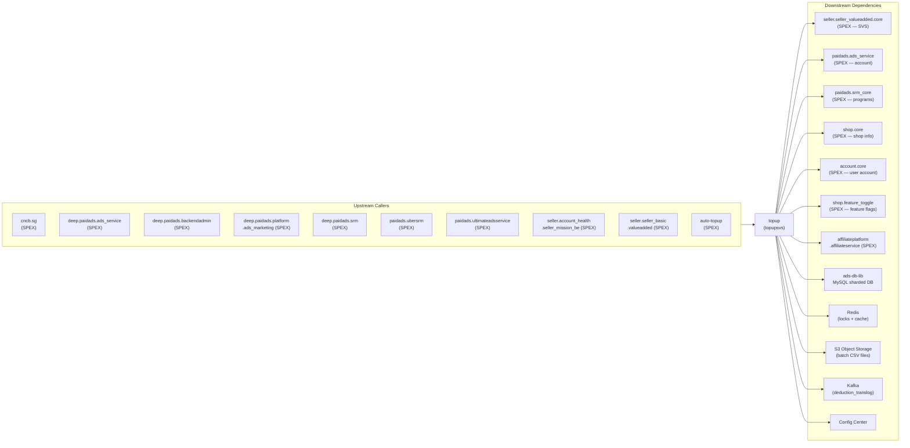

<!-- ads-workspace-gdoc-sync: gdoc_id=1-HYOyp26GddlE6gjdR0Gd4VRLKSkg-7HTH-qhJaqRrs gdoc_url=https://docs.google.com/document/d/1-HYOyp26GddlE6gjdR0Gd4VRLKSkg-7HTH-qhJaqRrs/edit -->

# Topup

**Repository:** https://git.garena.com/shopee/deep/topup

---

## Table of Contents

1. [Introduction](#introduction)
2. [Features](#features)
3. [Architecture](#architecture)
4. [Directory Structure](#directory-structure)
5. [SPEX and Modules](#spex-and-modules)
   - [API Overview](#api-overview)
   - [Topup and Translog](#topup-and-translog)
6. [Cronjobs](#cronjobs)
7. [Development Guidelines](#development-guidelines)
   - [Code Style](#code-style)
   - [Project Structure](#project-structure)
   - [Naming Conventions](#naming-conventions)
   - [Error Handling](#error-handling)
   - [Unit Testing Standards](#unit-testing-standards)
   - [Code Review & Git Workflow](#code-review--git-workflow)
8. [Configuration](#configuration)
   - [Config Files](#config-files)
   - [SPEX and spcli Setup](#spex-and-spcli-setup)
9. [Deployment](#deployment)
   - [Build for Production](#build-for-production)
   - [Release Process](#release-process)
10. [Monitoring](#monitoring)
11. [Business Terminology Glossary](#business-terminology-glossary)
    - [Core Metrics](#core-metrics)
    - [Ad Types and Products](#ad-types-and-products)
    - [Placements & Entrances](#placements--entrances)
    - [Sellers & Advertisers](#sellers--advertisers)
    - [Bidding & Pricing](#bidding--pricing)
    - [Prediction & Models](#prediction--models)
    - [System Features & Services](#system-features--services)
    - [Ad Supply & Display](#ad-supply--display)
    - [Controls & Filtering](#controls--filtering)
    - [External Services & Systems](#external-services--systems)
    - [Technical Terms](#technical-terms)
12. [Additional Resources](#additional-resources)
13. [Frequently Asked Questions](#frequently-asked-questions)

---

## Introduction

**topup** (also known as **TopupSVS**) is the critical ad wallet credit management service in the Shopee Paid Ads platform. It handles the full lifecycle of advertiser credit — from Topup (credit injection from Seller Value Service and admin portals) through credit expiry management, Manual Topup approval workflows, and providing real-time balance queries to other services.

The service is classified as **Critical** in the Advertiser Platform service inventory (PIC: Alif, Sam). It sits at the heart of the Topup subsystem, collaborating closely with `auto-topup` (automated top-up triggers) and `ads_service` / `ultimate_ads_service` (balance consumption via deductions), and interacts with the broader Advertiser Platform account domain.

The service exposes its API via the SPEX protocol (`paidads.topup.*` commands) and relies on `ads-db-lib` for sharded MySQL access, Redis for distributed locking and caching, S3-compatible object storage for batch file handling, and Kafka for deduction translog event publishing.

---

## Features

- **SVS Topup:** Processes top-up orders originating from Seller Center via the SVS (`seller.seller_valueadded.core`) payment gateway — supports packages, vouchers, and Ads Package top-ups with idempotent translog recording.
- **Credit Injection:** Supports admin-initiated credit injection (`inject_credit`, `inject_credit_v2`, `inject_credit_composite`) for multiple credit types (paid, free, expiring) with configurable effective type, consumption type, and expiry.
- **Manual Topup Workflow:** Full approval workflow for CRM-operated manual credit grants — single upload (`set_manual_topup`), batch upload from CSV (`batch_set_manual_topup_v2`), batch approval/rejection (`batch_action_manual_topup_v2`), single action (`do_action_manual_topup`). Supports Display Ads and Shopee Ads credit types.
- **Manual Deduct & Transfer:** Admin-initiated credit deduction (`set_manual_deduct`, `batch_set_manual_deduct`) and credit transfer between advertisers (`batch_set_manual_transfer`).
- **Balance Queries:** Real-time balance queries by placement (`get_balance_by_placement`), campaign-level balance (`get_balance_for_campaign`), today's topup amount (`get_today_topup`), topup amount by group type (`get_topup_amount`), credit summary (`get_credit_summary`), and campaign overdue balance (`get_campaign_overdue_balance`).
- **Translog Scanning:** Cursor-based paginated scan of topup translogs (`scan_topup_translog`) for downstream consumers.
- **Overdue Balance Management:** Detects and offsets overdue balances (debts from over-deductions) via a dedicated worker.
- **Ads Package Management:** CRUD operations for pre-defined Ad Credit Packages (`set_ads_package`, `get_ads_package_list`, `update_user_list_ads_package`, `reserve_order_ads_package`, `cancel_order_ads_package`).
- **Expiry Cleaning:** Daily worker that cleans in-progress expiry records to prevent stale states.
- **Notification:** Async notification to sellers about topup outcomes via the internal notify client.

---

## Architecture

The service uses a layered Go architecture:

```
[SPEX Clients / Callers]
        │  paidads.topup.* commands
        ▼
┌─────────────────────────────────────────┐
│           setup.Controllers             │  (SPEX handler routing)
│  topupController │ batchManualAdsV2     │
│  queryController │ packageController    │
│  workerController │ lastATFailureCtrl   │
└──────────┬──────────────────────────────┘
           │
┌──────────▼──────────────────────────────┐
│    Services / SubControllers / Workers  │
│  topup_helper_shopee (SVS topup flow)   │
│  topup_helper_display (Display Ads)     │
│  batch_manual_topup_v2 subcontroller    │
│  overdue_balance subcontroller          │
│  transfer subcontroller                 │
│  worker_v2 (async task queue)           │
└──────────┬──────────────────────────────┘
           │
┌──────────▼──────────────────────────────┐
│              Repositories               │
│  ads-db-lib (MySQL sharded DB)          │
│  spexconfig (live config from SVS)      │
│  Redis (cache + distributed lock)       │
│  S3 storage (batch CSV files)           │
│  Kafka (deduction_translog producer)    │
└─────────────────────────────────────────┘
```

### Service Topology



| Direction | Name | Protocol | Description |
|-----------|------|----------|-------------|
| **Upstream** | cncb.sg | SPEX | Calls `inject_credit` |
| **Upstream** | deep.paidads.ads_service | SPEX | Calls `inject_credit` |
| **Upstream** | deep.paidads.backendadmin | SPEX | Calls `batch_set_manual_topup_v2`, `get_ads_manual_topup_summary` |
| **Upstream** | deep.paidads.platform.ads_marketing | SPEX | Queries campaign/placement balance, overdue balance, today's topup, and unexpired free ads credit for seller UI |
| **Upstream** | deep.paidads.srm | SPEX | Calls `get_ads_package_list`, `inject_credit` |
| **Upstream** | paidads.ubersrm | SPEX | Calls `get_topup_amount`, `inject_credit_v2` |
| **Upstream** | paidads.ultimateadsservice | SPEX | Calls `get_balance_by_placement` |
| **Upstream** | seller.account_health.seller_mission_be | SPEX | Calls `inject_credit` |
| **Upstream** | seller.seller_basic.valueadded | SPEX | Calls `topup`, `get_ads_package_list`, `reserve_order_ads_package`, `cancel_order_ads_package` (Seller Center purchase flow) |
| **Upstream** | auto-topup | SPEX | Calls `topup` for automated credit replenishment |
| **Downstream** | seller.seller_valueadded.core | SPEX | Validates payment orders (`get_order_info`) and confirms transactions (`supplier_transaction_callback`) |
| **Downstream** | paidads.ads_service | SPEX | Creates/validates advertiser account (`get_ads_account`); checks Display Ads whitelist (`get_whitelist_users`) |
| **Downstream** | paidads.srm_core | SPEX | Fetches SRM program data (`list_programs`) |
| **Downstream** | shop.core | SPEX | Resolves shop-user mapping (`get_shop_batch`, `get_shop_by_name`, `get_user_id_by_shop_id`) |
| **Downstream** | account.core | SPEX | Resolves user accounts in batches of 50 (`get_account_batch`) |
| **Downstream** | shop.feature_toggle | SPEX | Checks per-shop feature flags (`is_shop_in_feature_toggle`) |
| **Downstream** | affiliateplatform.affiliateservice | SPEX | Fetches MCN basic info (`get_mcn_basic_info`) for MCN-type SVS topup orders |
| **Downstream** | ads-db-lib / MySQL | Library | Sharded ads database (7 DBs): `topup_translog_tab`, `ads_credit_tab`, `display_ads_credit_tab`, `promotion_paid_ads_manual_credit_tab`, `display_ads_manual_topup_tab`, `campaign_overdue_balance_tab`, `ads_manual_topup_action_history_tab` |
| **Downstream** | Redis | TCP | Distributed locking and caching; user-shop bidirectional cache |
| **Downstream** | S3 Object Storage | HTTPS | Batch file upload/download for manual topup, deduct, and transfer CSV operations |
| **Downstream** | Kafka | TCP | Publishes `deduction_translog` events (per-region topics) |
| **Downstream** | Config Center | HTTP | Reads `topup_svs_config` (group `paid_ads`, project `paid_ads_platform`) and `ads_config` at runtime |

---

## Directory Structure

```
topup/
├── gen/                        # Generated SPEX/proto code (do not edit manually)
│   └── go/
│       └── paidads_topup.pb/
├── internal/
│   ├── api/                    # HTTP controller (ping, prometheus, smoketest)
│   ├── cache/                  # Redis cache manager
│   ├── collections/            # Generic collection helpers (slice, set, map)
│   ├── config/                 # Config structs (TopupSVS, Kafka, Redis, ORM, etc.)
│   ├── constant/               # Enums and constants (translog, shop, etc.)
│   ├── controller/             # SPEX command controllers
│   │   ├── ads_package/        # Ads Package CRUD
│   │   ├── batch_manual_topup_v2/ # Batch manual topup v2
│   │   ├── last_at_failure/    # Last auto-topup failure query
│   │   ├── query/              # Balance and translog queries
│   │   └── topup/             # SVS Topup + InjectCredit + DeductCredit
│   ├── export/                 # Metrics & warning export helpers
│   ├── locker/                 # Redis distributed locker
│   ├── metadata/               # Request metadata (region, request ID)
│   ├── model/                  # Domain model types
│   ├── notify/                 # Async notification client
│   ├── repository/             # Data access layer
│   │   ├── batch_manual_topup_v2/
│   │   ├── config/             # Config Center & ads-config repository
│   │   ├── mcn/                # MCN repository (via SPEX)
│   │   ├── spexconfig/         # Live config from SVS via SPEX
│   │   ├── svs/                # SVS payment gateway repository
│   │   └── topup/              # Core topup translog & auto-topup DB repository
│   ├── retrier/                # Retry utility
│   ├── service/                # Business service layer
│   │   ├── ads_package/
│   │   ├── batch_manual_topup_v2/
│   │   ├── permission/         # Permission checks (GMV Max, Livestream, Search Brand)
│   │   ├── query/              # Credit query service
│   │   └── shop/               # Shop service
│   ├── set_ads_package/        # Ads Package create/edit/status state machine
│   ├── setup/                  # Dependency wiring (controllers, workers, repos, services)
│   ├── spexutil/               # SPEX RPC utilities and interceptors
│   ├── storage/                # S3 object storage manager
│   ├── subcontroller/          # Sub-domain controllers
│   │   ├── batch_manual_topup_v2/ # Topup, Deduct, and Transfer batch upload & action orchestration
│   │   ├── overdue_balance/    # Overdue balance detection & offset
│   │   ├── query/              # Credit query sub-controller
│   │   └── transfer/           # Credit transfer source & dest
│   ├── task/
│   │   └── ads_package/        # Ads Package async task client
│   ├── topup/                  # Core topup task client
│   ├── topup_helper_display/   # Display Ads topup helper
│   ├── topup_helper_shopee/    # Shopee Ads topup helper (SVS flow)
│   ├── types/                  # Shared value types (duration)
│   └── worker_v2/              # Async worker v2 (task processors)
│       ├── cleaning_expiry_in_progress/
│       ├── manual_topup_batch_action/
│       ├── manual_topup_batch_upload_display/
│       ├── manual_topup_batch_upload_shopee/
│       ├── manualdeductbatchupload/
│       ├── manualtransferbatchupload/
│       ├── offset_overdue_balance/
│       └── transferaction/
├── pkg/
│   └── worker/                 # Generic worker pool
├── sp_proto/                   # SPEX proto source files (edit here, then run spcli)
│   ├── affiliateplatform/
│   └── paidads/
│       └── topup.proto         # All SPEX command definitions
├── tool/                       # One-off admin/debug tools
│   ├── benchmarks/
│   ├── insert_same_subtype/
│   └── support_inject_credit_v2/
├── utils/                      # Shared utilities
├── .spkit.yml                  # Tool version pinning (Go, spcli, golangci-lint, etc.)
├── sp-workspace.yml            # SPEX proto dependencies & code generation config
└── readme.md                   # Legacy minimal README (superseded by this file)
```

---

## SPEX and Modules

### API Overview

The service is registered as SPEX service `paidads.topup`. All commands use the request/response protobuf types defined in `sp_proto/paidads/topup.proto`. Active commands:

| Command | Description |
|---------|-------------|
| `paidads.topup.ping` | Health check |
| `paidads.topup.topup` | SVS-triggered top-up (Seller Center purchase) |
| `paidads.topup.get_transaction` | Query topup translog by order ID or uniq_sign |
| `paidads.topup.inject_credit` | Admin credit injection (v1, by transaction_id) |
| `paidads.topup.inject_credit_v2` | Admin credit injection (v2, by uniq_sign) |
| `paidads.topup.inject_credit_composite` | Multi-credit-type injection in single transaction |
| `paidads.topup.deduct_credit` | Admin credit deduction (validates any valid `TransOperation` order type) |
| `paidads.topup.set_manual_topup` | Single manual topup upload |
| `paidads.topup.do_action_manual_topup` | Single manual topup action (approve/reject) |
| `paidads.topup.batch_set_manual_topup_v2` | Batch manual topup CSV upload |
| `paidads.topup.batch_action_manual_topup_v2` | Batch manual topup action |
| `paidads.topup.get_manual_topup_batch_upload_log` | Query batch upload log |
| `paidads.topup.get_manual_topup_batch_action_log` | Query batch action log |
| `paidads.topup.get_ads_manual_topup_summary` | Query manual topup summary list |
| `paidads.topup.trigger_async_manual_topup_task` | Trigger async manual topup task |
| `paidads.topup.set_manual_deduct` | Single manual deduction |
| `paidads.topup.batch_set_manual_deduct` | Batch manual deduction CSV upload |
| `paidads.topup.batch_set_manual_transfer` | Batch credit transfer CSV upload |
| `paidads.topup.get_balance_by_placement` | Balance query by placement group |
| `paidads.topup.get_balance_for_campaign` | Balance query for campaign creation |
| `paidads.topup.get_campaign_overdue_balance` | Campaign overdue balance query |
| `paidads.topup.get_today_topup` | Today's topup amount query |
| `paidads.topup.get_topup_amount` | Topup amount by group type and time range |
| `paidads.topup.scan_topup_translog` | Cursor-based topup translog scan |
| `paidads.topup.get_credit_summary` | Credit balance summary by type |
| `paidads.topup.list_unexpired_free_ads_credit` | List unexpired free credit items |
| `paidads.topup.get_last_auto_topup_failure` | Last auto-topup failure status |
| `paidads.topup.get_ads_package_list` | List Ads Packages |
| `paidads.topup.set_ads_package` | Create or edit Ads Package |
| `paidads.topup.update_user_list_ads_package` | Register/deregister users for an Ads Package |
| `paidads.topup.reserve_order_ads_package` | Reserve Ads Package order |
| `paidads.topup.cancel_order_ads_package` | Cancel Ads Package order |
| `paidads.topup.trigger_unfinish_topup` | Replay incomplete pending topup translogs |

**New proto fields (recent):**
- `AdsManualTopupSummary.transaction_group` (field 101): the `TransactionGroup` classification for the summary's `order_type` (e.g., `TransactionGroupTopup`, `TransactionGroupAdjustment`, `TransactionGroupTransfer`). Set automatically by the service; callers can use it to classify summary records without mapping `order_type` themselves.
- `DeductCreditRequest.partner_id` (field 12): optional; used for OpenAPI request validation — the `client_access_config_openapi` config determines whether the (proxy, partner_id, order_type) combination is permitted.

**Deprecated commands** (return `ERROR_DEPRECATED`): `batch_set_manual_topup`, `batch_update_manual_topup_status`, `get_batch_set_manual_topup_status`, `delete_manual_topup_batch_record`, `set_display_ads_manual_topup`, `get_display_ads_manual_topup_summary`, `update_display_ads_manual_topup_status`.

### Topup and Translog

The core topup flow (SVS Topup — Seller Center purchase):

1. Caller invokes `paidads.topup.topup` with `TopupRequest` containing SVS entity info and (optionally) package/voucher/Ads Package info.
2. `topup_helper_shopee` queries SVS (`seller.seller_valueadded.core.get_order_info`) to validate the payment order.
3. The service creates a `topup_translog_tab` record and injects the corresponding `ads_credit_tab` entries into the sharded `ads-db-lib` database.
4. A callback (`seller.seller_valueadded.core.supplier_transaction_callback`) is sent to SVS to confirm the transaction outcome.
5. The `topup_translog_tab` record stores: `order_id`, `order_type`, `user_id`, `shop_id`, `amount`, `status`, `package_id`, `voucher_id`, `ads_package_id`.

**Manual Topup flow:**

1. Admin uploads a batch CSV file (stored in S3 object storage) via `batch_set_manual_topup_v2`.
2. Async worker (`manual_topup_batch_upload_shopee` / `_display`) processes rows, creating `promotion_paid_ads_manual_credit_tab` records with `STATUS_PENDING`.
3. Admin approves via `batch_action_manual_topup_v2` or `do_action_manual_topup`.
4. On approval (`STATUS_PENDING_INJECT`), the service injects ads credits into `ads_credit_tab` and updates the record to `STATUS_APPROVED`.
5. Two-approval threshold enforced: if topup amount exceeds the configured threshold (stored in `AdsManualTopupSummaryExtinfo.threshold`), two approver signatures are required.

---

## Cronjobs

The topup service itself does not own scheduled jobs directly (those are owned by sibling services like `auto-topup`, `ads-status-syncer`, and `ads_service`). Jobs that directly interact with the topup service:

| Job Name | Importance | Owner Service | Description |
|----------|-----------|--------------|-------------|
| `auto_topup_scanner_live` | 🟠 High | auto-topup | Scans and triggers automatic topup via `paidads.topup.topup` |
| `topup_resource_sync_job_live` | 🟡 Medium | ads-status-syncer | Syncs topup resource status (gift packs, coupons) |
| `topup reminder [ALL]` | 🟢 Low | ads-srm | Sends top-up reminder notifications to sellers with low balance |

CMDB task list: https://space.shopee.io/console/cmdb/cronjobs/tree/shopee.mp_search_recommendation_ads.paidads.advertiser_platform.platform

---

## Development Guidelines

### Code Style

- Go version: `go1.21.6` (pinned in `.spkit.yml`)
- Linter: `golangci-lint v1.59.1` — run before pushing (`golangci-lint run`)
- Code generation tools pinned in `.spkit.yml`: `wire v0.5.0`, `mockery v2.43.2`, `go-enum v0.6.0`, `i18n-kit v0.9.0`

### Project Structure

- **`internal/`** — All application code (unexported). Never import across service boundaries from here.
- **`gen/`** — Auto-generated SPEX proto code. Do not hand-edit; regenerate with `spcli proto gen`.
- **`sp_proto/`** — Source proto files. Edit here, then regenerate.
- **`pkg/`** — Shared packages suitable for potential extraction (e.g., `worker` pool).
- **`tool/`** — One-off admin tools; not part of the main binary.

Dependency injection is done via `internal/setup/` (wire-style manual wiring) — all dependencies flow through `setup.Controllers`, `setup.WorkerClients`, `setup.Services`, `setup.Repositories`.

### Naming Conventions

- SPEX command handlers: match the command name in CamelCase (e.g., `InjectCredit` for `paidads.topup.inject_credit`)
- Repository interfaces: use `go:generate mockery` annotations — mock files are named `mocked_<name>.go` in-package
- Worker processors: implement `workerv2.Processor` interface and are registered in `setup/worker.go`
- Config structs: use YAML tags matching their config center key path

### Error Handling

- All SPEX handlers return `(uint32, error)` — error code is from `Constant.Error` enum in `topup.proto` (range `104100000–104199999`).
- Context cancellation and deadline: auto-converted to `ERROR_CANCELLED` / `ERROR_TIMEOUT` in `setup/controller.go:errorHandling`.
- Database errors: wrap with `fmt.Errorf("...: %w", err)` and return `ERROR_DATABASE`.
- Duplicate requests: detected via `deduct_unique_id` (translog) or `uniq_sign` fields; return `ERROR_DUPLICATE_REQUEST`.

### Unit Testing Standards

- Mock generation: `mockery v2.43.2` — run `go generate ./...` to regenerate mocks.
- Test files use the same package (`_test` suffix or in-package) — see `internal/topup/topup_test.go`, `internal/service/topup_test.go`.
- Coverage targets are not explicitly configured — test critical paths: topup helper flows, credit injection, balance queries.

### Code Review & Git Workflow

- Branch naming: `dev/$username` or `feature/$feature_name`
- Commit messages: `(Feat|Fix|Docs|Style|Refactor|Test|Chore): [JIRA-ID] description`
- MR title format (validated by `check_mr_title` CI stage on every MR): `(Feat|Fix|Docs|Style|Refactor|Test|Chore): [SPPA-xxxxx] description` — must contain a Jira ticket `SPPA-xxxx`; use `SPPA-65887` if no specific ticket applies.
- Merge via Merge Request only (squash + delete source branch)
- Algo code: only merge after launch in at least one region

---

## Configuration

### Config Files

Configuration is loaded in two layers:

1. **File-based config** (`yaml`): loaded via `uniconfig` from the service config file. Key: `topup-svs`.
2. **Config Center** (runtime overrides): subscribed via `paidads-platform-lib/service-config` using namespace alias `topup-svs-ns`. Config Center key: `topup_svs_config` under group `paid_ads` / project `paid_ads_platform`.

Key `TopupSVS` config sections:

| Field | Description |
|-------|-------------|
| `spex` | SPEX connection config (env, service name, etc.) |
| `db-lib` | ads-db-lib DB connection config |
| `db-secret` | DB credentials secret |
| `redis-locker` | Redis config for distributed locking |
| `cache` | Redis config for general caching |
| `user-shop-cache` | User-shop cache config |
| `storage` | S3 object storage (app-id, secret-key, host, bucket) |
| `kafka.producers.deduction_translog` | Kafka producer config by region for deduction translog |
| `config-center.topup-svs` | Config Center key/namespace for topup SVS config |
| `config-center.ads-config` | Config Center key/namespace for ads config |

The live config (`topup_svs_config`) loaded via `client_access_config_openapi` introduces per-partner OpenAPI access control. Structure: `commands[].cmd` → `clients.proxy` (the proxying service name) → `clients.clients[].partner_id` → `order_types` (allowed order types for that partner). This is in addition to the legacy `client_access_config` which uses a flat (cmd → client → order_types) map.
| `workerv2` | Async worker v2 pool config |
| `display-ads` | Display Ads credit-specific config |
| `notify` | Notification client config |
| `task.ads_package` | Ads Package task client config |

Additional config subscriptions via Config Center (see `internal/repository/config/`):
- `ads-config` namespace: ads-level config (e.g., Manual Topup thresholds, permission flags)

### SPEX and spcli Setup

Install `spcli`:

```bash
pip install --upgrade shopee-spex-cli
```

Install `inp-client` (for local SPEX RPC tunneling):

```bash
wget http://proxy.uss.s3.sz.shopee.io/api/v4/50054564/spex-s3ia-sg-live/intranet_penetrator/inp-client/latest/inp-client_darwin_amd64 \
  -O /usr/local/bin/inp-client && chmod +x /usr/local/bin/inp-client
```

SPEX protocol dependencies are declared in `sp-workspace.yml`:

```yaml
protocol:
  dep:
    - name: "paidads.ads_service"
    - name: "shop.core"
    - name: "account.core"
    - name: "paidads.srm_core"
    - name: "shop.feature_toggle"
    - name: "seller.seller_valueadded.core"
  source_dir: "./sp_proto"
  generated_dir: "./gen"
  targets: ["go", "validate"]
```

Regenerate proto code after editing `sp_proto/`:

```bash
spcli proto gen
```

Tool versions are pinned in `.spkit.yml` (`spkit: v0.10.11`, `spcli: v1.3.21`). Install all tools:

```bash
spkit install
```

---

## Deployment

### Build for Production

The service is deployed via the Shopee SPEX platform. Build is managed by the CI/CD pipeline — no manual `go build` step is required for production. For local compile verification:

```bash
go build ./...
```

### Release Process

Releases follow the standard Advertiser Platform SPEX release workflow:

1. Create a Merge Request targeting `master`.
2. Pass CI checks (lint, tests).
3. Release via SPEX portal (gray release → full release per region).
4. Monitor Grafana dashboards post-release.

Service CMDB: https://space.shopee.io/console/cmdb/detail/shopee.paidads.advertiser_platform.platform.advertiser_platform.topupsvs/dashboard

SPEX endpoint mappings (DNS backup info from `readme.md`):

| Environment | Hostname | Backend |
|-------------|----------|---------|
| live | `topupsvs.ads.deep.shopee.io` | `xh60fvqz.nlb.sgw.shopee.io` |
| test | `topupsvs.ads.deep.test.shopee.io` | `sg2.sgw.test.shopeemobile.com` |
| staging | `topupsvs.ads.deep.staging.shopee.io` | `sg.sgw.staging.shopeemobile.com` |
| uat | `topupsvs.ads.deep.uat.shopee.io` | `sg.sgw.uat.shopeemobile.com` |
| test-stable | `topupsvs.ads.deep.test-stable.shopee.io` | `sg.sgw.test-stable.shopeemobile.com` |

---

## Monitoring

- **Topup Services Dashboard:** https://monitoring.infra.sz.shopee.io/grafana/d/Us9zKo5Vz/topup-services-copy?orgId=39
- **Advertiser Platform Grafana Folder:** https://monitoring.infra.sz.shopee.io/grafana/dashboards/f/advertiser-platform/advertiser-platform
- **Ads DB (all callers):** https://monitoring.infra.sz.shopee.io/grafana/explore?orgId=39 (query `paidads_ads_db_manager_count` by caller)
- **Region Live Ads DB:** https://monitoring.infra.sz.shopee.io/grafana/d/4RB9tsfIz/region-live-ads-db?orgId=39
- **Billing Lag Monitor:** https://monitoring.infra.sz.shopee.io/grafana/d/YMWPK-Q7z/tdr-overview-dashboard?orgId=39&viewPanel=73
- **Kafka Deduction Topic:** https://monitoring.infra.sz.shopee.io/grafana/d/tMpwXZvMz/kafka-exporter-dashboard (var-topic=paidads-bigshop-deduct-event-id-live)
- **Manual Handbook:** https://confluence.shopee.io/display/SPAD/Topup+SVS

Key alert areas to watch:
- Error rate on `paidads.topup.topup` and `paidads.topup.inject_credit*` commands
- Redis locker contention (batch manual topup concurrent operations)
- Kafka producer lag for `deduction_translog`
- DB query latency via `paidads_ads_db_manager_count` metric

---

## Business Terminology Glossary

### Core Metrics

| Term | Definition |
|------|------------|
| CTR (Click-Through Rate) | Clicks / Impressions |
| CR (Conversion Rate) | Orders / Clicks |
| eCPM (Effective Cost Per Mille) | Total Ad Spend / Total Impressions × 1000 |
| CPC (Cost Per Click) | Amount spent per ad click |
| ROI (Return on Investment) | Ad GMV / Ad Expenditure |
| CIR (Cost-Income Ratio) | Ad Revenue / Ad GMV |
| Take-Rate | Ads Revenue / Platform GMV |
| Ads GMV | Total sales generated from ad clicks (7-day attribution window) |
| Display Rate | Ads with impression / Active ads |

### Ad Types and Products

| Term | Definition |
|------|------------|
| TADS / DADS | Targeting Ads / Discovery Ads — ads targeting specific buyer segments |
| Search Brand Ads | Brand-level keyword ads in the search results |
| Display Ads | CPM-priced brand/display advertising |
| GMV Max | Ads optimized to maximize GMV |
| NPB (New Product Boost) | New product promotion feature |
| oCPC / Simple Mode | Auto-optimized CPC bidding mode |

### Placements & Entrances

| Term | Definition |
|------|------------|
| PDP (Product Detail Page) | The item detail page where ads can appear |
| YMAL (You May Also Like) | A Discovery Ads placement on PDP |
| SVS PDP | Seller Value Service Product Detail Page — credit top-up entry for CB sellers |
| Placement | Numeric code identifying ad slot (4 = Search, 40 = Recommendation, 3 = Shop) |

### Sellers & Advertisers

| Term | Definition |
|------|------------|
| SC (Seller Center) | The seller management portal |
| CB Sellers | Cross-border sellers (no local bank; require Manual Topup) |
| OS (Official Shops) | Verified official brand stores |
| PS (Preferred Sellers) | Sellers with Preferred Seller status |
| Active Seller | Seller with an opened ads account who is still active |

### Bidding & Pricing

| Term | Definition |
|------|------------|
| uGSP | Unified Generalized Second Price — the auction pricing mechanism |
| CPC (Cost Per Click) | Bid price per click |
| CPM (Cost Per Mille) | Cost per 1,000 impressions (Display Ads) |
| PID | Proportional-Integral-Derivative controller for dynamic bid adjustment (Simple Mode) |
| Target ROI | Seller-configured ROI target for automated bidding |

### Prediction & Models

| Term | Definition |
|------|------------|
| pCTR | Predicted Click-Through Rate |
| pCR | Predicted Conversion Rate |
| eCPM (Rank Score) | eCPM + quality factors used for auction ranking |
| CF (Collaborative Filtering) | Similarity-based recommendation technique |
| Cold Start | New ad with insufficient historical data for model prediction |
| rcgbdt | RC Gradient Boost Decision Trees — ML model for pCTR prediction |

### System Features & Services

| Term | Definition |
|------|------------|
| Topup | The act of adding credits to an advertiser's Ads Wallet |
| Manual Topup | Admin-operated credit injection for CB sellers or CRM programs |
| Auto Topup | Automated credit replenishment when balance falls below threshold |
| SRM (Seller Relationship Management) | Seller segmentation and incentive program management |
| QSS (QuickStart Service) | Feature to help new advertisers quickly start using ads |
| Translog | Transaction log recording every topup/deduction event |
| SPEX | Shopee's internal RPC framework (replaces thrift/gRPC) |
| spcli | CLI tool for SPEX proto generation and project management |

### Ad Supply & Display

| Term | Definition |
|------|------------|
| Fill-up Rate | Actual impressions / Potential impressions |
| Traffic Rate | Impressions from one ad type / Total impressions |
| Broad Match | Keyword ad triggered when search query contains the keyword |
| Exact Match | Keyword ad triggered only on exact search query match |

### Controls & Filtering

| Term | Definition |
|------|------------|
| Blacklist | Block list for keywords or item IDs |
| Whitelist | Allow list for enabling specific features per seller |
| Badcase | Flagged problematic ad cases managed via ops tools |
| Overdue Balance | Accumulated debt from over-deduction events, tracked in `campaign_overdue_balance_tab` |
| Frozen Balance | Credits reserved (frozen) against a campaign budget |

### External Services & Systems

| Term | Definition |
|------|------------|
| SVS (Seller Value Service) | Payment gateway for Seller Center top-up orders (`seller.seller_valueadded.core`) |
| ads-db-lib | Internal library providing sharded MySQL access to 7 ads databases |
| MCN | Multi-Channel Network — influencer platform whose top-ups flow through this service |
| SIP (Shopee International Platform) | Cross-border seller platform |
| SCS (Shopee Consignment Service) | Shopee fully-managed seller center |

### Technical Terms

| Term | Definition |
|------|------------|
| DAG | Directed Acyclic Graph — used in feature pipeline (AFP) |
| GAS | General Ads Service |
| eCPM | Effective Cost Per Mille |
| uniq_sign | Idempotency key used to deduplicate topup/inject transactions |
| deduct_unique_id | Unique identifier for each deduction event to prevent double-charging |

---

## Additional Resources

- **Manual Handbook (Confluence):** https://confluence.shopee.io/display/SPAD/Topup+SVS
- **Advertiser Platform Architecture (Confluence):** https://confluence.shopee.io/display/SPAD/Advertiser+Platform
- **Paid Ads Glossary (Confluence):** https://confluence.shopee.io/pages/viewpage.action?spaceKey=SPAD&title=Paid+Ads+Glossary
- **CMDB (Service Dashboard):** https://space.shopee.io/console/cmdb/detail/shopee.paidads.advertiser_platform.platform.advertiser_platform.topupsvs/dashboard
- **Cronjob CMDB Tree:** https://space.shopee.io/console/cmdb/cronjobs/tree/shopee.mp_search_recommendation_ads.paidads.advertiser_platform.platform
- **SPEX Documentation:** https://spex.shopee.io/overview/quick-start/languages/go/index.html
- **ads-db-lib Repository:** https://git.garena.com/shopee/deep/ads-db-lib
- **SDDL (DB Schema Management):** https://gdbc.shopee.io/sddl/intro
- **DB Schema Control Panel:** https://space.shopee.io/mts/sddl/shopee/database-listing (search `ultimate_shard_db`)
- **Monitoring & Grafana Dashboards Doc (Google Docs):** https://docs.google.com/document/d/1xbEldfLSGJ5KsFjKk2IjZQfoI0XfQ8Ffwja0UKVHjNw/
- **Platform BE Cronjob Reference (Google Docs):** https://docs.google.com/document/d/1Z6VYs8vyJ-D914cU8wDBltrE6ItZ2TrhoZiXOSPkXmM/
- **DB Decoupling Solution Overview:** https://docs.google.com/document/d/1I5Wr0fr5-wBH6KWyGpUBCNYMY4YU-Wv0eZ5okhDfveU/

---

## Frequently Asked Questions

**Q1: What is the difference between `topup` and `inject_credit`?**

`topup` is triggered by actual seller payment orders coming from Seller Center via the SVS gateway — it validates the payment status with SVS before injecting credits. `inject_credit` / `inject_credit_v2` / `inject_credit_composite` are admin-initiated and do not require SVS order validation; they are used for program credits, CRM grants, incentives, etc.

**Q2: How does the two-approval threshold for Manual Topup work?**

When a manual topup record is created, the threshold at that time is stored in `AdsManualTopupSummaryExtinfo.threshold`. If `amount > threshold`, the record requires two separate approvals (action_list in extinfo tracks each approval). The threshold is configured in Config Center and is snapshotted at upload time — subsequent config changes do not affect existing records.

**Q3: How is credit type (Shopee Ads vs Display Ads) determined?**

The `credit_type` field in requests controls routing: Shopee Ads credit uses `ads_credit_tab` / `promotion_paid_ads_manual_credit_tab`, while Display Ads credit uses `display_ads_credit_tab` / `display_ads_manual_topup_tab`. The `topup_helper_shopee` and `topup_helper_display` packages handle the respective DB writes.

**Q4: How does idempotency work for topup and credit injection?**

For `topup`, the `order_id + order_type` pair is the deduplication key (`topup_translog_tab.deduct_unique_id`). For `inject_credit` v1, the `transaction_id + order_type` pair is unique. For `inject_credit_v2` and `inject_credit_composite`, the `uniq_sign + order_type` pair is used. Duplicate requests return `ERROR_DUPLICATE_REQUEST`.

**Q5: What happens when a topup is left in PENDING state (e.g., service crash)?**

The `trigger_unfinish_topup` command replays pending topup translogs. It is also called at worker startup (`ProcessPending`) and re-invoked 15 minutes after startup to catch any records that got stuck during initialization.

**Q6: How is batch manual topup processed?**

1. Caller uploads CSV → stored in S3 via storage manager.
2. `batch_set_manual_topup_v2` command creates a batch upload log record and dispatches an async worker task (via `worker_v2`).
3. The worker reads rows from S3, creates individual `promotion_paid_ads_manual_credit_tab` records.
4. Admin approves via `batch_action_manual_topup_v2` — worker processes each record and injects credits.
5. Progress is tracked in the batch upload/action log tables (`ads_manual_topup_action_history_tab`).

**Q7: How do I check what is wrong with a failed topup?**

1. Query `get_transaction` with the `order_id` and `order_type` to check translog status.
2. Check Grafana: [Topup Services Dashboard](https://monitoring.infra.sz.shopee.io/grafana/d/Us9zKo5Vz/topup-services-copy?orgId=39).
3. Check service logs via SMC: `smc logs topupsvs`.
4. For SVS-originating failures: check SVS callback status and `translog_tab.status` field.

**Q8: What is `effective_type` and `consumption_type` on credits?**

`effective_type` controls which placement types (search, discovery, display, etc.) the credit can be used for — `0` is universal. `consumption_type` controls which ad product the credit applies to. These fields are set at credit creation time (topup) and enforced during deduction.

**Q9: How does overdue balance arise and how is it recovered?**

Overdue balance arises when a campaign spends more than its daily budget (race condition in high-concurrency deductions). It is tracked per-campaign in `campaign_overdue_balance_tab`. The `offset_overdue_balance` worker periodically checks for outstanding overdue and offsets it from the account balance. Callers can query it via `get_campaign_overdue_balance`.

**Q10: How do I add a new SPEX command?**

1. Add the request/response message and command definition (commented block) in `sp_proto/paidads/topup.proto`.
2. Run `spcli proto gen` to regenerate code under `gen/`.
3. Add the handler method in `internal/setup/controller.go` implementing `Controllers`.
4. Wire the handler to a controller/service in the appropriate `internal/controller/` or `internal/service/` package.
5. Register in the SPEX command table via `paidads-platform-lib` (follow existing patterns in `setup/`).

<!-- Generated by ads-workspace/skills/ads-readme-generate | checked: b775fa16dd69b64bb6c658ba553fd85c2515c028 | spec: 76fce5f679f9550b -->
