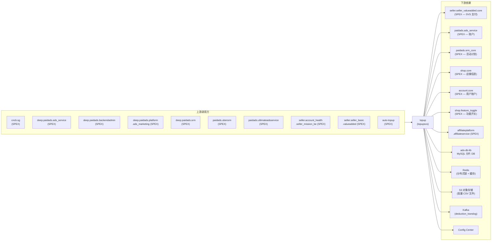

<!-- ads-workspace-gdoc-sync: gdoc_id=1_hFHMcTx0aTF6NpO7XTTQ0bOgZh6dVktvRdqup6s-1Q gdoc_url=https://docs.google.com/document/d/1_hFHMcTx0aTF6NpO7XTTQ0bOgZh6dVktvRdqup6s-1Q/edit -->

# Topup

**代码仓库：** https://git.garena.com/shopee/deep/topup

---

## 目录 / Table of Contents

1. [项目概述](#项目概述)
2. [核心功能](#核心功能)
3. [项目架构](#项目架构)
4. [目录结构](#目录结构)
5. [SPEX 与业务模块](#spex-与业务模块)
   - [接口总览](#接口总览)
   - [充值与流水](#充值与流水)
6. [定时任务](#定时任务)
7. [开发规范](#开发规范)
   - [代码风格](#代码风格)
   - [项目结构](#项目结构)
   - [命名规范](#命名规范)
   - [错误处理](#错误处理)
   - [单元测试](#单元测试)
   - [Code Review & Git Workflow](#code-review--git-workflow)
8. [配置说明](#配置说明)
   - [配置文件](#配置文件)
   - [SPEX 与 spcli 配置](#spex-与-spcli-配置)
9. [部署](#部署)
   - [生产构建](#生产构建)
   - [发布流程](#发布流程)
10. [监控](#监控)
11. [业务术语表](#业务术语表)
    - [核心指标](#核心指标)
    - [广告类型](#广告类型)
    - [位置入口](#位置入口)
    - [卖家与广告主](#卖家与广告主)
    - [竞价定价](#竞价定价)
    - [预测模型](#预测模型)
    - [系统特性与服务](#系统特性与服务)
    - [广告供给与展示](#广告供给与展示)
    - [管控与过滤](#管控与过滤)
    - [外部服务与系统](#外部服务与系统)
    - [技术术语](#技术术语)
12. [参考资料](#参考资料)
13. [常见问题](#常见问题)

---

## 项目概述

**topup**（也称 **TopupSVS**）是 Shopee Paid Ads 平台的广告钱包 Credit 管理核心服务。它负责广告主 Credit 的完整生命周期管理——从 Topup（通过 Seller Value Service 和管理后台注入 Credit）、Credit 到期管理、Manual Topup 审批流程，到为其他服务提供实时余额查询。

该服务在 Advertiser Platform 服务清单中被标记为 **Critical**（负责人：Alif、Sam）。它处于 Topup 子系统的核心位置，与 `auto-topup`（自动充值触发）、`ads_service` / `ultimate_ads_service`（余额消耗扣费）紧密协作，并与广告主平台的账户域进行交互。

服务通过 SPEX 协议（`paidads.topup.*` 命令）对外暴露 API，依赖 `ads-db-lib` 进行分片 MySQL 访问、Redis 分布式锁与缓存、S3 对象存储用于批量文件处理，以及 Kafka 用于发布扣费 Translog 事件。

---

## 核心功能

- **SVS Topup：** 处理来自 Seller Center 经 SVS（`seller.seller_valueadded.core`）支付网关发起的充值订单，支持套餐、优惠券和 Ads Package 充值，Translog 记录保证幂等性。
- **Credit 注入：** 支持管理员发起的 Credit 注入（`inject_credit`、`inject_credit_v2`、`inject_credit_composite`），支持多种 Credit 类型（付费、免费、带有效期），可配置生效类型（effective_type）、消耗类型（consumption_type）和过期时间。
- **Manual Topup 审批流程：** 完整的 CRM 运营手动 Credit 发放审批流——单条上传（`set_manual_topup`）、CSV 批量上传（`batch_set_manual_topup_v2`）、批量审批/驳回（`batch_action_manual_topup_v2`）、单条操作（`do_action_manual_topup`），支持 Display Ads 和 Shopee Ads 两种 Credit 类型。
- **Manual Deduct & Transfer：** 管理员发起的 Credit 扣减（`set_manual_deduct`、`batch_set_manual_deduct`）和广告主间 Credit 转账（`batch_set_manual_transfer`）。
- **余额查询：** 按广告位查询实时余额（`get_balance_by_placement`）、Campaign 创建时余额（`get_balance_for_campaign`）、今日充值金额（`get_today_topup`）、按 TopupGroupType 查询充值量（`get_topup_amount`）、Credit 汇总（`get_credit_summary`）、Campaign 逾期余额（`get_campaign_overdue_balance`）。
- **Translog 扫描：** 基于游标的分页 Translog 扫描（`scan_topup_translog`），供下游消费。
- **逾期余额管理：** 通过专用 worker 检测并抵扣逾期余额（超扣产生的欠款）。
- **Ads Package 管理：** 预定义广告 Credit 套餐的 CRUD（`set_ads_package`、`get_ads_package_list`、`update_user_list_ads_package`、`reserve_order_ads_package`、`cancel_order_ads_package`）。
- **过期记录清理：** 每日 worker 清理 in-progress 状态的过期记录，防止状态残留。
- **通知：** 通过内部 notify client 异步通知卖家充值结果。

---

## 项目架构

服务采用分层 Go 架构：

```
[SPEX 调用方 / Callers]
        │  paidads.topup.* 命令
        ▼
┌─────────────────────────────────────────┐
│           setup.Controllers             │  (SPEX 命令路由)
│  topupController │ batchManualAdsV2     │
│  queryController │ packageController    │
│  workerController │ lastATFailureCtrl   │
└──────────┬──────────────────────────────┘
           │
┌──────────▼──────────────────────────────┐
│  Services / SubControllers / Workers    │
│  topup_helper_shopee (SVS 充值流程)     │
│  topup_helper_display (Display Ads)     │
│  batch_manual_topup_v2 subcontroller    │
│  overdue_balance subcontroller          │
│  transfer subcontroller                 │
│  worker_v2 (异步任务队列)               │
└──────────┬──────────────────────────────┘
           │
┌──────────▼──────────────────────────────┐
│              Repositories               │
│  ads-db-lib (MySQL 分片 DB)             │
│  spexconfig (SVS 在线配置)              │
│  Redis (缓存 + 分布式锁)               │
│  S3 storage (批量 CSV 文件)             │
│  Kafka (deduction_translog 生产者)      │
└─────────────────────────────────────────┘
```

### 上下游调用拓扑



| 方向 | 服务名称 | 协议 | 说明 |
|------|---------|------|------|
| **上游** | cncb.sg | SPEX | 调用 `inject_credit` |
| **上游** | deep.paidads.ads_service | SPEX | 调用 `inject_credit` |
| **上游** | deep.paidads.backendadmin | SPEX | 调用 `batch_set_manual_topup_v2`、`get_ads_manual_topup_summary` |
| **上游** | deep.paidads.platform.ads_marketing | SPEX | 查询 Campaign/广告位余额、逾期余额、今日充值金额及未过期免费 Credit，用于卖家 UI |
| **上游** | deep.paidads.srm | SPEX | 调用 `get_ads_package_list`、`inject_credit` |
| **上游** | paidads.ubersrm | SPEX | 调用 `get_topup_amount`、`inject_credit_v2` |
| **上游** | paidads.ultimateadsservice | SPEX | 调用 `get_balance_by_placement` |
| **上游** | seller.account_health.seller_mission_be | SPEX | 调用 `inject_credit` |
| **上游** | seller.seller_basic.valueadded | SPEX | 调用 `topup`、`get_ads_package_list`、`reserve_order_ads_package`、`cancel_order_ads_package`（Seller Center 购买流程） |
| **上游** | auto-topup | SPEX | 调用 `topup` 触发自动充值补款 |
| **下游** | seller.seller_valueadded.core | SPEX | 验证支付订单（`get_order_info`）并回调确认事务（`supplier_transaction_callback`） |
| **下游** | paidads.ads_service | SPEX | 创建/验证广告主账户（`get_ads_account`）；检查 Display Ads 白名单（`get_whitelist_users`） |
| **下游** | paidads.srm_core | SPEX | 获取 SRM 活动计划数据（`list_programs`） |
| **下游** | shop.core | SPEX | 解析 shop-user 映射（`get_shop_batch`、`get_shop_by_name`、`get_user_id_by_shop_id`） |
| **下游** | account.core | SPEX | 批量解析用户账户（每批 50 个，`get_account_batch`） |
| **下游** | shop.feature_toggle | SPEX | 检查店铺维度功能开关（`is_shop_in_feature_toggle`） |
| **下游** | affiliateplatform.affiliateservice | SPEX | 获取 MCN 基本信息（`get_mcn_basic_info`），用于处理 MCN 类型的 SVS Topup 订单 |
| **下游** | ads-db-lib / MySQL | 库 | 分片广告数据库（7 个 DB）：`topup_translog_tab`、`ads_credit_tab`、`display_ads_credit_tab`、`promotion_paid_ads_manual_credit_tab`、`display_ads_manual_topup_tab`、`campaign_overdue_balance_tab`、`ads_manual_topup_action_history_tab` |
| **下游** | Redis | TCP | 分布式锁与缓存；user-shop 双向映射缓存 |
| **下游** | S3 对象存储 | HTTPS | Manual Topup、Deduct 和 Transfer CSV 批量文件的上传/下载 |
| **下游** | Kafka | TCP | 发布 `deduction_translog` 事件（按地区分 topic） |
| **下游** | Config Center | HTTP | 运行时读取 `topup_svs_config`（group `paid_ads`，project `paid_ads_platform`）和 `ads_config` |

---

## 目录结构

```
topup/
├── gen/                        # 生成的 SPEX/proto 代码（勿手动编辑）
│   └── go/
│       └── paidads_topup.pb/
├── internal/
│   ├── api/                    # HTTP controller（ping、prometheus、smoketest）
│   ├── cache/                  # Redis 缓存管理器
│   ├── collections/            # 通用集合工具（slice、set、map）
│   ├── config/                 # 配置结构体（TopupSVS、Kafka、Redis、ORM 等）
│   ├── constant/               # 枚举与常量（translog、shop 等）
│   ├── controller/             # SPEX 命令 controller
│   │   ├── ads_package/        # Ads Package CRUD
│   │   ├── batch_manual_topup_v2/ # 批量 Manual Topup v2
│   │   ├── last_at_failure/    # 最后一次 Auto Topup 失败查询
│   │   ├── query/              # 余额与 Translog 查询
│   │   └── topup/             # SVS Topup + InjectCredit + DeductCredit
│   ├── export/                 # Metrics 与 warning 导出
│   ├── locker/                 # Redis 分布式锁
│   ├── metadata/               # 请求元数据（region、request ID）
│   ├── model/                  # 领域模型类型
│   ├── notify/                 # 异步通知 client
│   ├── repository/             # 数据访问层
│   │   ├── batch_manual_topup_v2/
│   │   ├── config/             # Config Center & ads-config 配置仓库
│   │   ├── mcn/                # MCN 仓库（via SPEX）
│   │   ├── spexconfig/         # SVS 在线配置（via SPEX）
│   │   ├── svs/                # SVS 支付网关仓库
│   │   └── topup/              # 核心 Topup Translog & Auto Topup DB 仓库
│   ├── retrier/                # 重试工具
│   ├── service/                # 业务 service 层
│   │   ├── ads_package/
│   │   ├── batch_manual_topup_v2/
│   │   ├── permission/         # 权限校验（GMV Max、Livestream、Search Brand）
│   │   ├── query/              # Credit 查询 service
│   │   └── shop/               # 店铺 service
│   ├── set_ads_package/        # Ads Package 创建/编辑/状态机
│   ├── setup/                  # 依赖注入装配（controller、worker、repo、service）
│   ├── spexutil/               # SPEX RPC 工具与拦截器
│   ├── storage/                # S3 对象存储管理器
│   ├── subcontroller/          # 子域 controller
│   │   ├── batch_manual_topup_v2/ # Topup/Deduct/Transfer 批量上传与操作编排
│   │   ├── overdue_balance/    # 逾期余额检测与抵扣
│   │   ├── query/              # Credit 查询子 controller
│   │   └── transfer/           # Credit 转账（源/目的）
│   ├── task/
│   │   └── ads_package/        # Ads Package 异步任务 client
│   ├── topup/                  # 核心 Topup 任务 client
│   ├── topup_helper_display/   # Display Ads 充值 helper
│   ├── topup_helper_shopee/    # Shopee Ads 充值 helper（SVS 流程）
│   ├── types/                  # 共享值类型（duration）
│   └── worker_v2/              # 异步 worker v2（任务处理器）
│       ├── cleaning_expiry_in_progress/
│       ├── manual_topup_batch_action/
│       ├── manual_topup_batch_upload_display/
│       ├── manual_topup_batch_upload_shopee/
│       ├── manualdeductbatchupload/
│       ├── manualtransferbatchupload/
│       ├── offset_overdue_balance/
│       └── transferaction/
├── pkg/
│   └── worker/                 # 通用 worker 池
├── sp_proto/                   # SPEX proto 源文件（在此编辑，再运行 spcli）
│   ├── affiliateplatform/
│   └── paidads/
│       └── topup.proto         # 所有 SPEX 命令定义
├── tool/                       # 一次性管理/调试工具
│   ├── benchmarks/
│   ├── insert_same_subtype/
│   └── support_inject_credit_v2/
├── utils/                      # 共享工具函数
├── .spkit.yml                  # 工具版本锁定（Go、spcli、golangci-lint 等）
├── sp-workspace.yml            # SPEX proto 依赖与代码生成配置
└── readme.md                   # 旧版简短 README（已由本文件替代）
```

---

## SPEX 与业务模块

### 接口总览

服务注册为 SPEX 服务 `paidads.topup`，所有命令使用 `sp_proto/paidads/topup.proto` 中定义的 protobuf 类型。当前可用命令：

| 命令 | 说明 |
|------|------|
| `paidads.topup.ping` | 健康检查 |
| `paidads.topup.topup` | SVS 发起的充值（Seller Center 购买） |
| `paidads.topup.get_transaction` | 按 order_id 或 uniq_sign 查询充值 Translog |
| `paidads.topup.inject_credit` | 管理员 Credit 注入（v1，按 transaction_id） |
| `paidads.topup.inject_credit_v2` | 管理员 Credit 注入（v2，按 uniq_sign） |
| `paidads.topup.inject_credit_composite` | 单次事务多类型 Credit 注入 |
| `paidads.topup.deduct_credit` | 管理员 Credit 扣减（支持任意有效 `TransOperation` order type） |
| `paidads.topup.set_manual_topup` | 单条 Manual Topup 上传 |
| `paidads.topup.do_action_manual_topup` | 单条 Manual Topup 操作（审批/驳回） |
| `paidads.topup.batch_set_manual_topup_v2` | CSV 批量 Manual Topup 上传 |
| `paidads.topup.batch_action_manual_topup_v2` | 批量 Manual Topup 操作 |
| `paidads.topup.get_manual_topup_batch_upload_log` | 查询批量上传日志 |
| `paidads.topup.get_manual_topup_batch_action_log` | 查询批量操作日志 |
| `paidads.topup.get_ads_manual_topup_summary` | 查询 Manual Topup 汇总列表 |
| `paidads.topup.trigger_async_manual_topup_task` | 触发异步 Manual Topup 任务 |
| `paidads.topup.set_manual_deduct` | 单条手动扣减 |
| `paidads.topup.batch_set_manual_deduct` | CSV 批量手动扣减上传 |
| `paidads.topup.batch_set_manual_transfer` | CSV 批量 Credit 转账上传 |
| `paidads.topup.get_balance_by_placement` | 按广告位组查询余额 |
| `paidads.topup.get_balance_for_campaign` | 查询 Campaign 创建可用余额 |
| `paidads.topup.get_campaign_overdue_balance` | 查询 Campaign 逾期余额 |
| `paidads.topup.get_today_topup` | 查询今日充值金额 |
| `paidads.topup.get_topup_amount` | 按 TopupGroupType 和时间范围查询充值量 |
| `paidads.topup.scan_topup_translog` | 基于游标的 Translog 扫描 |
| `paidads.topup.get_credit_summary` | 按类型查询 Credit 余额汇总 |
| `paidads.topup.list_unexpired_free_ads_credit` | 列举未过期免费 Credit |
| `paidads.topup.get_last_auto_topup_failure` | 查询最后一次 Auto Topup 失败状态 |
| `paidads.topup.get_ads_package_list` | 查询 Ads Package 列表 |
| `paidads.topup.set_ads_package` | 创建或编辑 Ads Package |
| `paidads.topup.update_user_list_ads_package` | 注册/注销用户的 Ads Package |
| `paidads.topup.reserve_order_ads_package` | 预约 Ads Package 订单 |
| `paidads.topup.cancel_order_ads_package` | 取消 Ads Package 订单 |
| `paidads.topup.trigger_unfinish_topup` | 重放未完成的 PENDING 充值 Translog |

**新增 proto 字段（近期变更）：**
- `AdsManualTopupSummary.transaction_group`（字段 101）：当前 summary 的 `order_type` 对应的 `TransactionGroup` 分类（如 `TransactionGroupTopup`、`TransactionGroupAdjustment`、`TransactionGroupTransfer`）。由服务自动填充，调用方无需自行映射 `order_type`。
- `DeductCreditRequest.partner_id`（字段 12）：可选字段，用于 OpenAPI 请求校验——`client_access_config_openapi` 配置决定（proxy、partner_id、order_type）三元组是否被允许。

**已废弃命令**（返回 `ERROR_DEPRECATED`）：`batch_set_manual_topup`、`batch_update_manual_topup_status`、`get_batch_set_manual_topup_status`、`delete_manual_topup_batch_record`、`set_display_ads_manual_topup`、`get_display_ads_manual_topup_summary`、`update_display_ads_manual_topup_status`。

### 充值与流水

**SVS Topup 核心流程（Seller Center 购买）：**

1. 调用方发起 `paidads.topup.topup`，请求包含 SVS 实体信息及可选的套餐/优惠券/Ads Package 信息。
2. `topup_helper_shopee` 调用 SVS（`seller.seller_valueadded.core.get_order_info`）验证支付订单。
3. 服务在 `topup_translog_tab` 创建记录，并在 `ads-db-lib` 分片 DB 的 `ads_credit_tab` 写入对应 Credit。
4. 回调 SVS（`seller.seller_valueadded.core.supplier_transaction_callback`）确认事务结果。
5. `topup_translog_tab` 记录包含：`order_id`、`order_type`、`user_id`、`shop_id`、`amount`、`status`、`package_id`、`voucher_id`、`ads_package_id`。

**Manual Topup 流程：**

1. 管理员通过 `batch_set_manual_topup_v2` 上传 CSV 文件（存储至 S3 对象存储）。
2. 异步 worker（`manual_topup_batch_upload_shopee` / `_display`）处理每行，在 `promotion_paid_ads_manual_credit_tab` 创建 `STATUS_PENDING` 记录。
3. 管理员通过 `batch_action_manual_topup_v2` 或 `do_action_manual_topup` 审批。
4. 审批通过（`STATUS_PENDING_INJECT`）后，服务向 `ads_credit_tab` 注入 Credit，并将记录更新为 `STATUS_APPROVED`。
5. 双审批阈值机制：若充值金额超过配置阈值（存储于 `AdsManualTopupSummaryExtinfo.threshold`），需要两位审批人签字。

---

## 定时任务

topup 服务本身不直接拥有定时任务（由 `auto-topup`、`ads-status-syncer`、`ads_service` 等兄弟服务管理）。与 topup 服务直接交互的关键任务：

| 任务名称 | 重要程度 | 归属服务 | 说明 |
|---------|---------|---------|------|
| `auto_topup_scanner_live` | 🟠 高 | auto-topup | 扫描并触发自动充值，调用 `paidads.topup.topup` |
| `topup_resource_sync_job_live` | 🟡 中 | ads-status-syncer | 同步充值资源（礼包、优惠券）状态 |
| `topup reminder [ALL]` | 🟢 低 | ads-srm | 向余额不足的卖家发送充值提醒通知 |

CMDB 任务列表：https://space.shopee.io/console/cmdb/cronjobs/tree/shopee.mp_search_recommendation_ads.paidads.advertiser_platform.platform

---

## 开发规范

### 代码风格

- Go 版本：`go1.21.6`（锁定于 `.spkit.yml`）
- Linter：`golangci-lint v1.59.1`——推送前运行（`golangci-lint run`）
- 代码生成工具版本锁定于 `.spkit.yml`：`wire v0.5.0`、`mockery v2.43.2`、`go-enum v0.6.0`、`i18n-kit v0.9.0`

### 项目结构

- **`internal/`** — 所有应用代码（不导出），禁止跨服务直接引用。
- **`gen/`** — 自动生成的 SPEX proto 代码，勿手动编辑；修改 proto 后运行 `spcli proto gen` 重新生成。
- **`sp_proto/`** — proto 源文件，在此编辑再重新生成。
- **`pkg/`** — 可潜在抽取的共享包（如 `worker` 池）。
- **`tool/`** — 一次性管理工具，不编入主二进制。

依赖注入通过 `internal/setup/`（手动 wire 风格）完成——所有依赖通过 `setup.Controllers`、`setup.WorkerClients`、`setup.Services`、`setup.Repositories` 流转。

### 命名规范

- SPEX 命令 handler：命名对应 CamelCase 命令名（如 `InjectCredit` 对应 `paidads.topup.inject_credit`）
- Repository 接口：使用 `go:generate mockery` 注解，mock 文件命名为 `mocked_<name>.go`，in-package
- Worker processor：实现 `workerv2.Processor` 接口，在 `setup/worker.go` 中注册
- 配置结构体：YAML tag 与 config center key path 保持一致

### 错误处理

- 所有 SPEX handler 返回 `(uint32, error)`——错误码来自 `topup.proto` 中 `Constant.Error` 枚举（范围 `104100000–104199999`）。
- context 取消与超时：在 `setup/controller.go:errorHandling` 中自动转换为 `ERROR_CANCELLED` / `ERROR_TIMEOUT`。
- 数据库错误：使用 `fmt.Errorf("...: %w", err)` 包裹，返回 `ERROR_DATABASE`。
- 重复请求：通过 `deduct_unique_id`（translog）或 `uniq_sign` 字段检测，返回 `ERROR_DUPLICATE_REQUEST`。

### 单元测试

- Mock 生成：`mockery v2.43.2`——运行 `go generate ./...` 重新生成 mock。
- 测试文件使用同包（`_test` 后缀或 in-package）——参见 `internal/topup/topup_test.go`、`internal/service/topup_test.go`。
- 重点覆盖：topup helper 流程、credit 注入、余额查询。

### Code Review & Git Workflow

- 分支命名：`dev/$username` 或 `feature/$feature_name`
- Commit 格式：`(Feat|Fix|Docs|Style|Refactor|Test|Chore): [JIRA-ID] 描述`
- MR 标题格式（由 `check_mr_title` CI stage 在每次 MR 时校验）：`(Feat|Fix|Docs|Style|Refactor|Test|Chore): [SPPA-xxxxx] 描述` — 必须包含 Jira ticket `SPPA-xxxx`；无对应 ticket 时可用 `SPPA-65887`。
- 仅允许通过 Merge Request 合入（squash + 删除源分支）
- 算法代码：至少在一个地区灰度上线后方可合入

---

## 配置说明

### 配置文件

配置分两层加载：

1. **文件配置**（yaml）：通过 `uniconfig` 加载，key 为 `topup-svs`。
2. **Config Center**（运行时覆盖）：通过 `paidads-platform-lib/service-config` 订阅，namespace alias 为 `topup-svs-ns`，Config Center key 为 `topup_svs_config`（group `paid_ads` / project `paid_ads_platform`）。

`TopupSVS` 主要配置项：

| 字段 | 说明 |
|------|------|
| `spex` | SPEX 连接配置（env、service name 等） |
| `db-lib` | ads-db-lib DB 连接配置 |
| `db-secret` | DB 凭据 secret |
| `redis-locker` | 分布式锁 Redis 配置 |
| `cache` | 通用缓存 Redis 配置 |
| `user-shop-cache` | User-shop 缓存配置 |
| `storage` | S3 对象存储配置（app-id、secret-key、host、bucket） |
| `kafka.producers.deduction_translog` | 按地区配置的扣费 Translog Kafka 生产者 |
| `config-center.topup-svs` | Topup SVS Config Center key/namespace |
| `config-center.ads-config` | Ads Config Center key/namespace |

通过 `client_access_config_openapi` 从 Config Center（`topup_svs_config`）加载的在线配置新增了基于 partner 的 OpenAPI 访问控制。结构为：`commands[].cmd` → `clients.proxy`（代理服务名）→ `clients.clients[].partner_id` → `order_types`（该 partner 允许的 order type 列表）。这与旧版扁平结构（`client_access_config`：cmd → client → order_types）并列存在。
| `workerv2` | 异步 worker v2 线程池配置 |
| `display-ads` | Display Ads Credit 专项配置 |
| `notify` | 通知 client 配置 |
| `task.ads_package` | Ads Package 异步任务 client 配置 |

还可通过 Config Center 订阅额外配置（见 `internal/repository/config/`）：
- `ads-config` namespace：广告层面配置（如 Manual Topup 阈值、权限开关）

### SPEX 与 spcli 配置

安装 spcli：

```bash
pip install --upgrade shopee-spex-cli
```

安装 inp-client（本地 SPEX RPC 隧道）：

```bash
wget http://proxy.uss.s3.sz.shopee.io/api/v4/50054564/spex-s3ia-sg-live/intranet_penetrator/inp-client/latest/inp-client_darwin_amd64 \
  -O /usr/local/bin/inp-client && chmod +x /usr/local/bin/inp-client
```

SPEX 协议依赖声明于 `sp-workspace.yml`：

```yaml
protocol:
  dep:
    - name: "paidads.ads_service"
    - name: "shop.core"
    - name: "account.core"
    - name: "paidads.srm_core"
    - name: "shop.feature_toggle"
    - name: "seller.seller_valueadded.core"
  source_dir: "./sp_proto"
  generated_dir: "./gen"
  targets: ["go", "validate"]
```

编辑 `sp_proto/` 后重新生成代码：

```bash
spcli proto gen
```

工具版本锁定于 `.spkit.yml`（`spkit: v0.10.11`、`spcli: v1.3.21`）。安装所有工具：

```bash
spkit install
```

---

## 部署

### 生产构建

服务通过 Shopee SPEX 平台部署，构建由 CI/CD 流水线管理，无需手动执行 `go build`。本地编译验证：

```bash
go build ./...
```

### 发布流程

遵循 Advertiser Platform SPEX 标准发布流程：

1. 创建 Merge Request，目标分支为 `master`。
2. 通过 CI 检查（lint、测试）。
3. 通过 SPEX Portal 发布（灰度发布 → 逐地区全量）。
4. 发布后监控 Grafana 面板。

服务 CMDB：https://space.shopee.io/console/cmdb/detail/shopee.paidads.advertiser_platform.platform.advertiser_platform.topupsvs/dashboard

SPEX 端点映射（来自 `readme.md` 的备份信息）：

| 环境 | Hostname | 后端 |
|------|----------|------|
| live | `topupsvs.ads.deep.shopee.io` | `xh60fvqz.nlb.sgw.shopee.io` |
| test | `topupsvs.ads.deep.test.shopee.io` | `sg2.sgw.test.shopeemobile.com` |
| staging | `topupsvs.ads.deep.staging.shopee.io` | `sg.sgw.staging.shopeemobile.com` |
| uat | `topupsvs.ads.deep.uat.shopee.io` | `sg.sgw.uat.shopeemobile.com` |
| test-stable | `topupsvs.ads.deep.test-stable.shopee.io` | `sg.sgw.test-stable.shopeemobile.com` |

---

## 监控

- **Topup Services 面板：** https://monitoring.infra.sz.shopee.io/grafana/d/Us9zKo5Vz/topup-services-copy?orgId=39
- **Advertiser Platform Grafana 文件夹：** https://monitoring.infra.sz.shopee.io/grafana/dashboards/f/advertiser-platform/advertiser-platform
- **Ads DB 调用方：** https://monitoring.infra.sz.shopee.io/grafana/explore?orgId=39（查询 `paidads_ads_db_manager_count` by caller）
- **Region Live Ads DB：** https://monitoring.infra.sz.shopee.io/grafana/d/4RB9tsfIz/region-live-ads-db?orgId=39
- **计费 Lag 监控：** https://monitoring.infra.sz.shopee.io/grafana/d/YMWPK-Q7z/tdr-overview-dashboard?orgId=39&viewPanel=73
- **Kafka 扣费 Topic：** https://monitoring.infra.sz.shopee.io/grafana/d/tMpwXZvMz/kafka-exporter-dashboard（var-topic=paidads-bigshop-deduct-event-id-live）
- **操作手册（Confluence）：** https://confluence.shopee.io/display/SPAD/Topup+SVS

关键告警关注点：
- `paidads.topup.topup` 和 `paidads.topup.inject_credit*` 命令错误率
- Redis locker 争用（批量 Manual Topup 并发操作）
- Kafka `deduction_translog` 生产者 lag
- DB 查询延迟（`paidads_ads_db_manager_count` 指标）

---

## 业务术语表

### 核心指标

| 术语 | 定义 |
|------|------|
| CTR (Click-Through Rate) | 点击量 / 展示量 |
| CR (Conversion Rate) | 订单数 / 点击量 |
| eCPM (Effective Cost Per Mille) | 广告总消耗 / 总展示量 × 1000 |
| CPC (Cost Per Click) | 每次点击费用 |
| ROI (Return on Investment) | 广告 GMV / 广告消耗 |
| CIR (Cost-Income Ratio) | 广告收入 / 广告 GMV |
| Take-Rate | 广告收入 / 平台 GMV |
| Ads GMV | 广告带来的总销售额（7 天归因窗口） |
| Display Rate | 有展示的广告数 / 活跃广告数 |

### 广告类型

| 术语 | 定义 |
|------|------|
| TADS / DADS | Targeting Ads / Discovery Ads，定向广告 |
| Search Brand Ads | 搜索品牌广告（关键词级别） |
| Display Ads | CPM 计价的品牌/展示广告 |
| GMV Max | 以最大化 GMV 为目标的广告策略 |
| NPB (New Product Boost) | 新品推广功能 |
| oCPC / Simple Mode | 自动优化 CPC 的智能出价模式 |

### 位置入口

| 术语 | 定义 |
|------|------|
| PDP (Product Detail Page) | 商品详情页 |
| YMAL (You May Also Like) | Discovery Ads 在 PDP 上的广告位 |
| SVS PDP | Seller Value Service 商品详情页，CB 卖家充值入口 |
| Placement | 广告位标识码（4=搜索, 40=推荐, 3=店铺） |

### 卖家与广告主

| 术语 | 定义 |
|------|------|
| SC (Seller Center) | 卖家后台 |
| CB Sellers | 跨境卖家（无本地银行账户，需 Manual Topup） |
| OS (Official Shops) | 官方认证店铺 |
| PS (Preferred Sellers) | 优质卖家 |
| Active Seller | 已开通广告账户且仍在活跃的卖家 |

### 竞价定价

| 术语 | 定义 |
|------|------|
| uGSP | Unified Generalized Second Price，竞价拍卖定价机制 |
| CPC (Cost Per Click) | 每次点击出价 |
| CPM (Cost Per Mille) | 每千次展示费用（Display Ads） |
| PID | 比例积分微分控制器，用于 Simple Mode 动态调价 |
| Target ROI | 卖家配置的自动出价 ROI 目标 |

### 预测模型

| 术语 | 定义 |
|------|------|
| pCTR | 预测点击率 |
| pCR | 预测转化率 |
| eCPM (Rank Score) | eCPM + 质量因子，用于拍卖排序 |
| CF (Collaborative Filtering) | 协同过滤，基于相似性的推荐技术 |
| Cold Start | 新广告历史数据不足，模型预测精度较低 |
| rcgbdt | RC Gradient Boost Decision Trees，用于 pCTR 预测的 ML 模型 |

### 系统特性与服务

| 术语 | 定义 |
|------|------|
| Topup | 向广告主广告钱包充值 Credit 的行为 |
| Manual Topup | 管理员为 CB 卖家或 CRM 项目手动发放 Credit |
| Auto Topup | 余额低于阈值时自动充值 |
| SRM (Seller Relationship Management) | 卖家分群与激励计划管理 |
| QSS (QuickStart Service) | 帮助新广告主快速开始使用广告的功能 |
| Translog | 记录每次充值/扣费事件的流水日志 |
| SPEX | Shopee 内部 RPC 框架（取代 thrift/gRPC） |
| spcli | SPEX proto 生成与项目管理的 CLI 工具 |

### 广告供给与展示

| 术语 | 定义 |
|------|------|
| Fill-up Rate | 实际展示量 / 潜在展示量 |
| Traffic Rate | 某类广告展示量 / 全渠道总展示量 |
| Broad Match | 广泛匹配——搜索词包含关键词时触发广告 |
| Exact Match | 精确匹配——搜索词与关键词完全一致时触发广告 |

### 管控与过滤

| 术语 | 定义 |
|------|------|
| Blacklist | 关键词或商品 ID 黑名单 |
| Whitelist | 按卖家维度开放特定功能的白名单 |
| Badcase | 标记为异常的广告案例，通过运营工具管理 |
| Overdue Balance | 超扣产生的欠款，记录在 `campaign_overdue_balance_tab` |
| Frozen Balance | 针对 Campaign 预算冻结的 Credit |

### 外部服务与系统

| 术语 | 定义 |
|------|------|
| SVS (Seller Value Service) | Seller Center 充值订单的支付网关（`seller.seller_valueadded.core`） |
| ads-db-lib | 提供分片 MySQL 访问的内部库（覆盖 7 个广告 DB） |
| MCN | Multi-Channel Network，网红/达人平台，充值经由本服务处理 |
| SIP (Shopee International Platform) | 跨境卖家平台 |
| SCS (Shopee Consignment Service) | Shopee 全托管卖家中心 |

### 技术术语

| 术语 | 定义 |
|------|------|
| DAG | 有向无环图，用于特征处理流水线（AFP） |
| GAS | General Ads Service，通用广告服务 |
| eCPM | Effective Cost Per Mille，千次展示有效费用 |
| uniq_sign | 幂等 key，用于去重充值/注入事务 |
| deduct_unique_id | 每次扣费事件的唯一标识，防止重复扣费 |

---

## 参考资料

- **操作手册（Confluence）：** https://confluence.shopee.io/display/SPAD/Topup+SVS
- **Advertiser Platform 架构（Confluence）：** https://confluence.shopee.io/display/SPAD/Advertiser+Platform
- **Paid Ads 业务术语表（Confluence）：** https://confluence.shopee.io/pages/viewpage.action?spaceKey=SPAD&title=Paid+Ads+Glossary
- **服务 CMDB：** https://space.shopee.io/console/cmdb/detail/shopee.paidads.advertiser_platform.platform.advertiser_platform.topupsvs/dashboard
- **Cronjob CMDB 树：** https://space.shopee.io/console/cmdb/cronjobs/tree/shopee.mp_search_recommendation_ads.paidads.advertiser_platform.platform
- **SPEX 文档：** https://spex.shopee.io/overview/quick-start/languages/go/index.html
- **ads-db-lib 仓库：** https://git.garena.com/shopee/deep/ads-db-lib
- **SDDL（DB Schema 管理）：** https://gdbc.shopee.io/sddl/intro
- **DB Schema 控制面板：** https://space.shopee.io/mts/sddl/shopee/database-listing（搜索 `ultimate_shard_db`）
- **监控与 Grafana 面板汇总（Google Docs）：** https://docs.google.com/document/d/1xbEldfLSGJ5KsFjKk2IjZQfoI0XfQ8Ffwja0UKVHjNw/
- **Platform BE Cronjob 梳理（Google Docs）：** https://docs.google.com/document/d/1Z6VYs8vyJ-D914cU8wDBltrE6ItZ2TrhoZiXOSPkXmM/
- **DB 解耦方案总览：** https://docs.google.com/document/d/1I5Wr0fr5-wBH6KWyGpUBCNYMY4YU-Wv0eZ5okhDfveU/

---

## 常见问题

**Q1：`topup` 和 `inject_credit` 有什么区别？**

`topup` 由 Seller Center 通过 SVS 网关发起的真实支付订单触发——注入 Credit 前须先向 SVS 验证支付状态。`inject_credit` / `inject_credit_v2` / `inject_credit_composite` 由管理员发起，无需 SVS 订单验证，用于项目 Credit、CRM 发放、激励计划等场景。

**Q2：Manual Topup 双审批阈值机制如何运作？**

Manual Topup 记录创建时，会将当时的阈值快照写入 `AdsManualTopupSummaryExtinfo.threshold`。若 `amount > threshold`，该记录需要两位审批人签字（action_list 记录每次审批）。阈值来自 Config Center，上传后不随配置变更而更新。

**Q3：Credit 类型（Shopee Ads 与 Display Ads）如何区分？**

请求中的 `credit_type` 字段控制路由：Shopee Ads Credit 写入 `ads_credit_tab` / `promotion_paid_ads_manual_credit_tab`，Display Ads Credit 写入 `display_ads_credit_tab` / `display_ads_manual_topup_tab`。`topup_helper_shopee` 和 `topup_helper_display` 分别处理对应的 DB 写入。

**Q4：充值和 Credit 注入的幂等性如何保证？**

`topup` 使用 `order_id + order_type` 作为去重键（`topup_translog_tab.deduct_unique_id`）。`inject_credit` v1 使用 `transaction_id + order_type`。`inject_credit_v2` 和 `inject_credit_composite` 使用 `uniq_sign + order_type`。重复请求返回 `ERROR_DUPLICATE_REQUEST`。

**Q5：如果充值 Translog 卡在 PENDING 状态（如服务崩溃）怎么办？**

`trigger_unfinish_topup` 命令可重放未完成的 PENDING Translog。worker 启动时也会调用 `ProcessPending`，并在启动后 15 分钟再次调用，以兜底初始化期间卡住的记录。

**Q6：批量 Manual Topup 的处理流程是什么？**

1. 调用方上传 CSV → 通过 storage manager 存入 S3。
2. `batch_set_manual_topup_v2` 创建批量上传日志记录，并通过 `worker_v2` 下发异步任务。
3. Worker 从 S3 读取每行，在 `promotion_paid_ads_manual_credit_tab` 创建独立记录。
4. 管理员通过 `batch_action_manual_topup_v2` 审批——worker 处理每条记录并注入 Credit。
5. 进度通过 batch upload/action log 表（`ads_manual_topup_action_history_tab`）跟踪。

**Q7：如何排查失败的充值？**

1. 通过 `get_transaction`（传入 `order_id` 和 `order_type`）查询 Translog 状态。
2. 查看 Grafana：[Topup Services 面板](https://monitoring.infra.sz.shopee.io/grafana/d/Us9zKo5Vz/topup-services-copy?orgId=39)。
3. 通过 SMC 查看服务日志：`smc logs topupsvs`。
4. 对于 SVS 发起的失败：检查 SVS 回调状态和 `translog_tab.status` 字段。

**Q8：`effective_type` 和 `consumption_type` 字段的含义是什么？**

`effective_type` 控制 Credit 适用的广告位类型（搜索、发现、展示等），`0` 为通用。`consumption_type` 控制 Credit 适用的广告产品类型。这两个字段在 Credit 创建（充值）时设置，扣费时强制校验。

**Q9：逾期余额如何产生，如何恢复？**

逾期余额由高并发扣费时的超扣（Campaign 当日消耗超过日预算）产生，在 `campaign_overdue_balance_tab` 按 Campaign 维度记录。`offset_overdue_balance` worker 定期检测并从账户余额中抵扣逾期欠款。调用方可通过 `get_campaign_overdue_balance` 查询。

**Q10：如何新增一个 SPEX 命令？**

1. 在 `sp_proto/paidads/topup.proto` 中添加请求/响应消息和命令定义（注释块格式）。
2. 运行 `spcli proto gen` 重新生成 `gen/` 下的代码。
3. 在 `internal/setup/controller.go` 的 `Controllers` 中添加 handler 方法。
4. 在 `internal/controller/` 或 `internal/service/` 下对应的包中实现业务逻辑。
5. 通过 `paidads-platform-lib` 在 SPEX 命令表中注册（参考 `setup/` 现有模式）。

<!-- Generated by ads-workspace/skills/ads-readme-generate | checked: b775fa16dd69b64bb6c658ba553fd85c2515c028 | spec: 76fce5f679f9550b -->
