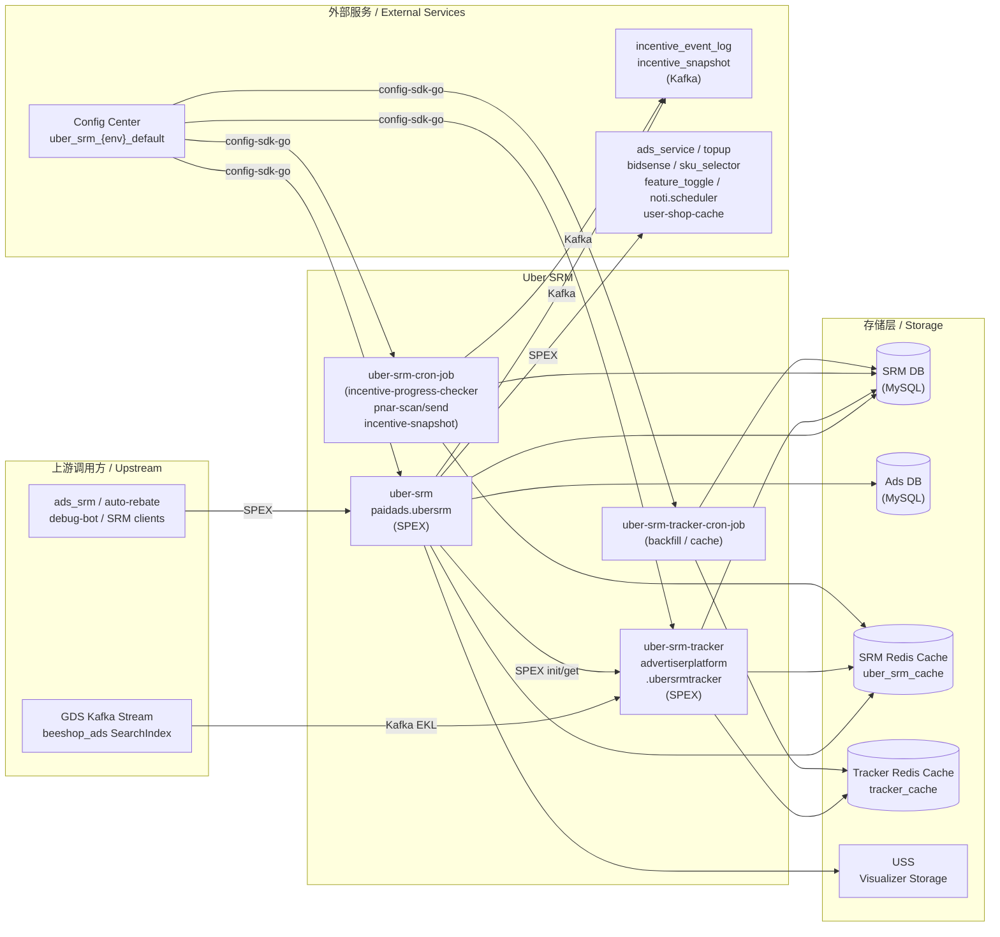

<!-- ads-workspace-gdoc-sync: gdoc_id=1k0R-xiD1GwUMHk3BbXHEGTIg_mleK0uleQKSIVJYL7A gdoc_url=https://docs.google.com/document/d/1k0R-xiD1GwUMHk3BbXHEGTIg_mleK0uleQKSIVJYL7A/edit -->

# Über SRM / Über SRM

> **Git**: [https://git.garena.com/shopee/deep/uber-srm](https://git.garena.com/shopee/deep/uber-srm)

## 目录 / Table of Contents

1. [项目概述 / Introduction](#项目概述--introduction)
2. [核心功能 / Features](#核心功能--features)
3. [项目架构 / Architecture](#项目架构--architecture)
4. [目录结构 / Directory Structure](#目录结构--directory-structure)
5. [运行入口与业务模块 / Runtime and Business Modules](#运行入口与业务模块--runtime-and-business-modules)
   - [Uber SRM API](#uber-srm-api--uber-srm-api)
   - [Uber SRM Tracker](#uber-srm-tracker--uber-srm-tracker)
   - [Workflow Graph 与节点 / Workflow Graph and Nodes](#workflow-graph-与节点--workflow-graph-and-nodes)
   - [Incentive 类型与业务 Helper / Incentive Types and Business Helpers](#incentive-类型与业务-helper--incentive-types-and-business-helpers)
   - [Cronjobs 与运营工具 / Cronjobs and Ops Tools](#cronjobs-与运营工具--cronjobs-and-ops-tools)
6. [开发与本地运行 / Development and Local Run](#开发与本地运行--development-and-local-run)
   - [环境准备 / Setup](#环境准备--setup)
   - [构建、测试与代码生成 / Build, Test and Codegen](#构建测试与代码生成--build-test-and-codegen)
   - [本地运行 / Local Run](#本地运行--local-run)
   - [Code Review & Git Workflow](#code-review--git-workflow)
7. [配置与部署 / Configuration and Deployment](#配置与部署--configuration-and-deployment)
   - [环境配置文件 / Environment Config Files](#环境配置文件--environment-config-files)
   - [Config Center 与动态配置 / Config Center and Runtime Config](#config-center-与动态配置--config-center-and-runtime-config)
   - [SPEX、Kafka、Redis 与存储 / SPEX, Kafka, Redis and Storage](#spexkafkaredis-与存储--spex-kafka-redis-and-storage)
   - [Mesos 构建与发布 / Mesos Build and Release](#mesos-构建与发布--mesos-build-and-release)
8. [监控与排障 / Monitoring and Operations](#监控与排障--monitoring-and-operations)
9. [关键术语 / Key Terms](#关键术语--key-terms)
10. [参考资料 / Additional Resources](#参考资料--additional-resources)
11. [常见问题 / Frequently Asked Questions](#常见问题--frequently-asked-questions)

---

## 项目概述 / Introduction

Uber SRM (Seller Reward Management) is a Go microservice in the Shopee Paid Ads Advertiser Platform that orchestrates complex seller incentive programs through graph-based workflow execution. It is **not** a generic CRUD service: core business behavior is driven by workflow graphs, node implementations, activity orchestration, and program-type-specific business helpers. The service has four deployment artifacts — `uber-srm`, `uber-srm-tracker`, `uber-srm-cron-job`, and `uber-srm-tracker-cron-job` — each responsible for a distinct runtime concern.

---

## 核心功能 / Features

### Program & Incentive Management

Based on `sp_proto/paidads.adv_platform/uber_srm.proto` and `internal/activity/`:

- **Program CRUD**: Create and list ProgramType, ProgramPreset, ProgramV2, ProgramCluster via `batch_set_program`, `list_program`, `batch_set_program_cluster`
- **Incentive lifecycle**: Enroll sellers, update node configs, trigger node execution via `batch_set_incentive`, `batch_set_incentive_node`, `batch_do_incentive`, `batch_trigger_incentive`
- **Quick-create / quick-set**: Streamlined seller enrollment (`batch_quick_create_incentive`) and node update (`batch_quick_set_incentive_node`) flows
- **Incentive listing**: Fetch incentive state with live data patching via `list_incentive`
- **Workflow visualization**: Retrieve DAG graph structure as JSON via `get_workflow_graph`

### Tracker Service

Based on `sp_proto/paidads.adv_platform/uber_srm_tracker.proto` and `internal/controller_tracker/`:

- **Real-time progress tracking**: Initialize (`init_tracker`), edit (`edit_tracker`), and query (`get_progress`) tracker state
- **Realtime processors** via GDS Kafka → EKL consumption:
  - `accumulated_spending` — ad spend accumulation
  - `accumulated_topup` — credit top-up accumulation
  - `ads_activation` — first ad creation event
  - `basic_item_spending` — per-item spend tracking
  - `ads_account_audit_count` — account audit event counting
  - `ads_audit_event_count` — general audit event counting
- **Backfill and cache crons**: Compensate for missed real-time events

### Incentive Program Types (V2) / Incentive Program Types

Twelve program types in `internal/business_helper/`:

| Program Type | ID | Description |
|---|---|---|
| `qss_one_month` | 100 | Four-week seller quality tasks (ads creation + top-up) with optional ATU bonus |
| `basic_item_spending` | 101 | Spend on N configured items to a per-item target |
| `sustained_atu` | 102 | Keep Auto Top-Up (ATU) active for N days |
| `signup_spending` | 103 | New-seller post-signup spending gate |
| `target_product_spending` | 104 | Spend on items from a Redis pool, per-item rewards |
| `campaign_optimization` | 105 | Sustain campaign budget + ROAS targets for N days |
| `simple_fixed_reward` | 106 | Reach an ad spending threshold for a flat credit reward |
| `sustained_auto_escrow` | 107 | Keep Auto Escrow enabled for N days; supports `DisplayTime`-based `Scheduled` fe_status for pre-start display control |
| `simple_topup` | 108 | Tier-based credit top-up accumulation |
| `simple_atu` | 109 | Top-up accumulation with ATU enablement requirement |
| `top_product_spending` | 110 | Curator-selected items with per-item spend targets and rewards |
| `fee_auto_escrow` | 111 | Sustain Fee Auto Escrow at a required rate; bonus reward for meeting take-rate target |

### Offline Operations (Cronjobs) / 离线操作

- **`incentive-progress-checker`**: Scan active incentives and advance node states
- **`pnar-scan` / `pnar-send`**: Scan eligible sellers and send push notifications (PNAR)
- **`incentive-snapshot`**: Emit full incentive presentation state to DE Kafka
- **Tracker `backfill` / `cache`**: Backfill missing tracker data and sync cache

---

## 项目架构 / Architecture

### 分层模型 / Layered Architecture

```
cmd/                      ← Entry points; bootstrap & run
internal/setup/           ← Wire DI configuration + gRPC controller wiring
internal/activity/        ← Request orchestration (validate → persist → execute graph)
internal/service/         ← Domain logic (state machines, post-change hooks)
internal/graph_engine/    ← DAG traversal and execution (Walker, Strategy)
internal/node/            ← Node implementations (condition, action, control)
internal/business_helper/ ← Program-type-specific input/output/patch logic
internal/repository/      ← DB, external SPEX, Redis data access
internal/kafka/           ← Kafka producer/consumer wrappers
internal/cache/           ← Redis connection and key-value wrappers
internal/storage/         ← S3/USS upload for workflow visualizer
```

Request flow for incentive creation:

1. gRPC request arrives → `internal/setup/uber_srm/controller.go`
2. `batch_set_incentive` activity validates input, checks conflicts, resolves shop
3. Write helper (`internal/write_helper/`) persists incentive + nodes to SRM DB
4. `graph_engine.Walker` with `ProcessStrategy` walks the DAG: `Yield()` then `Do()` on each node
5. Node outputs become inputs to dependent nodes via artifact wiring
6. `MustDoIncentivePostChange()` emits Kafka event and audit log

### 上下游调用拓扑 / Service Topology



#### 上游调用方 / Upstream Callers

| Caller | Protocol | API Called |
|---|---|---|
| `deep.paidads.platform.ads_srm` | SPEX | `list_incentive` |
| `auto-rebate` | SPEX | `list_incentive` |
| `ads-platform-quick-debug-bot` | SPEX | `get_workflow_graph`, `list_incentive` |
| General SRM clients | SPEX | All `paidads.adv_platform.uber_srm.*` RPCs |
| Uber SRM API service | SPEX | `init_tracker`, `edit_tracker`, `get_progress` |
| GDS / beeshop_ads stream | Kafka (EKL/Muse) | Consumed by `uber-srm-tracker` |

#### 下游依赖 / Downstream Dependencies

| Service | Protocol | Purpose |
|---|---|---|
| SRM DB + SRM ID generator (ads-db-lib) | MySQL (GDBC) | Primary persistence for all SRM entities |
| Ads DB (ads-db-lib) | MySQL (GDBC) | Campaign, ad, spend data for incentive evaluation |
| Uber SRM Redis (`uber_srm_cache`) | Redis | Runtime cache + distributed locks |
| Tracker Redis (`tracker_cache`) | Redis | Real-time tracker state |
| `incentive_event_log` Kafka topic | Kafka (Muse CRDS) | Incentive change events for DE |
| `incentive_snapshot` Kafka topic | Kafka (Muse CRDS) | Full incentive state for DE analytics |
| USS Visualizer Storage | HTTP | Workflow DAG graph image upload |
| `paidads.ads_service` | SPEX | Ads account state, campaign day info |
| `paidads.ultimate_ads_service` | SPEX | Campaign list for output patching |
| `paidads.topup` | SPEX | Top-up progress, credit injection |
| `paidads.srm_core` | SPEX | Legacy SRM compatibility |
| `paidads.adv_platform.uber_srm_tracker` | SPEX | Internal tracker init/edit/query |
| `paidads.bidsense` | SPEX | Take-rate info, item recommendation |
| `paidads.sku_selector` | SPEX | Target item recommendation |
| `marketplace.listing.item.itemaggregation.iteminfo` | SPEX | Item metadata and shop item count |
| `marketplace.listing.itemtagservice.querying_api` | SPEX | Item label checks (blocked/adult) |
| `shop.feature_toggle` | SPEX | Shop-level eligibility and whitelist |
| `seller.platform.miscellaneous.admin` | SPEX | Seller popup status update |
| `noti.scheduler` | SPEX | PNAR and seller notifications |
| `user-shop-cache` | SDK | User-to-shop mapping resolution |
| `item-ads-cache` | SDK | Ads activation tracking (tracker) |
| Config Center (`uber_srm_{env}_default`) | config-sdk-go | Runtime DB, Redis, Kafka, USS config |

---

## 目录结构 / Directory Structure

```
uber-srm/
├── cmd/
│   ├── uber-srm/                         # Main API service entry (CGO_ENABLED=1)
│   ├── uber-srm-tracker/                 # Real-time tracker service entry
│   ├── uber-srm-cron-job/                # Batch cron jobs (progress checker, PNAR, snapshot)
│   └── uber-srm-tracker-cron-job/        # Tracker maintenance crons (backfill, cache)
│
├── internal/
│   ├── activity/                         # Request orchestration layer
│   │   ├── batch_set_incentive/          # Incentive create, quick-create
│   │   ├── batch_set_incentive_node/     # Node config update, quick-set
│   │   ├── batch_do_incentive/           # Trigger node execution, dismiss, sync
│   │   ├── batch_trigger_incentive/      # Trigger tracker progress evaluation
│   │   ├── batch_set_program/            # Program CRUD
│   │   ├── batch_set_program_cluster/    # ProgramCluster management
│   │   ├── list_incentive/               # Incentive listing with output formatting
│   │   ├── list_program/                 # Program listing
│   │   └── get_workflow_graph/           # DAG structure retrieval
│   │
│   ├── graph_engine/                     # Workflow DAG execution engine
│   │   ├── walker.go                     # Walker interface
│   │   ├── strategy_process.go           # ProcessStrategy: execute nodes
│   │   ├── strategy_validation.go        # ValidationStrategy: dry-run
│   │   ├── dependency.go                 # Artifact data flow between nodes
│   │   └── node_store.go                 # In-memory node registry
│   │
│   ├── node/                             # Node implementations
│   │   ├── helper.go                     # Node factory (all node types)
│   │   ├── action_give_handout/          # Issue credit reward
│   │   ├── condition_*/                  # 13 condition nodes (spending, topup, claim, etc.)
│   │   ├── control_*/                    # 5 control flow nodes (sequence, parallel, signal)
│   │   └── common/                       # Shared time, state, activation helpers
│   │
│   ├── business_helper/                  # Program-type-specific logic
│   │   ├── basic_item_spending/
│   │   ├── campaign_optimization/
│   │   ├── fee_auto_escrow/
│   │   ├── qss_one_month/
│   │   ├── signup_spending/
│   │   ├── simple_atu/
│   │   ├── simple_fixed_reward/
│   │   ├── simple_topup/
│   │   ├── sustained_atu/
│   │   ├── sustained_auto_escrow/
│   │   ├── target_product_spending/
│   │   ├── top_product_spending/
│   │   └── common/                       # Shared DB fetch utilities
│   │
│   ├── controller_tracker/               # Tracker service logic
│   │   ├── business_logic_handler/       # Realtime processors (spending, topup, activation…)
│   │   ├── kafka_handler/                # GDS Kafka message routing
│   │   ├── spex_api/                     # init/edit/get_progress RPC handlers
│   │   ├── backfill_cron/                # Backfill cron logic
│   │   └── cache_cron/                   # Cache sync cron logic
│   │
│   ├── service/                          # Domain business logic
│   │   ├── incentive/                    # Post-change hooks, Kafka event emission
│   │   ├── ads/                          # Campaign and ad data
│   │   ├── ads_account/                  # ATU, take-rate, fee rate metrics
│   │   ├── item/                         # Item listing, shop item count
│   │   └── locator/                      # User-to-shop resolution
│   │
│   ├── repository/                       # Data access layer
│   │   ├── incentive/                    # Incentive + node DB operations
│   │   ├── program/                      # Program DB operations
│   │   ├── ads/                          # Campaign, ad spend queries
│   │   ├── ads_account/                  # ATU, take-rate SPEX calls
│   │   ├── item/                         # Item info, labels
│   │   ├── topup/                        # Top-up amount, credit injection
│   │   ├── tracker/                      # Tracker DB queries
│   │   ├── account/                      # Shop/account info
│   │   └── shop_feature_toggle/          # Feature flag checks
│   │
│   ├── repository_tracker/               # Tracker-specific repositories
│   │   ├── realtime_tracker/             # Redis-based tracker state (with Lua scripts)
│   │   └── tracker/                      # Tracker DB CRUD
│   │
│   ├── cache/                            # Redis connection and operations
│   ├── kafka/                            # Kafka producer/consumer (Muse CRDS)
│   ├── storage/                          # USS S3 upload for visualizer
│   ├── model/                            # Shared domain structs
│   ├── model_tracker/                    # Tracker domain structs
│   ├── constant/                         # Enums (generated) and constants
│   ├── convert_helper/                   # Proto ↔ internal model conversion
│   ├── write_helper/                     # Pre-write conflict checks and compare logic
│   ├── validator_helper/                 # Shared validation logic
│   ├── visualizer/                       # DAG → Graphviz JSON rendering
│   ├── translator/                       # i18n for PNAR notifications
│   ├── exporter/                         # Prometheus metric definitions
│   ├── db_manager/                       # Multiplex DB client initialization
│   ├── spex/                             # SPEX interceptors
│   └── setup/                            # Wire DI entry points
│       ├── uber_srm/                     # API service Wire providers + controller
│       └── uber_srm_tracker/             # Tracker Wire providers + controller
│
├── config/
│   ├── uber_srm.go                       # Config struct definitions (UberSRM, UberSRMTracker)
│   └── files/                            # Bootstrap YAML per environment
│       ├── live.yml / liveish.yml / stable.yml
│       ├── staging.yml / test.yml / uat.yml
│
├── deploy/
│   ├── mesos.sh                          # Build + run orchestration script
│   ├── ubersrm.json                      # API service Mesos config
│   ├── ubersrmtracker.json               # Tracker Mesos config
│   ├── ubersrmcronjob.json               # Cron job Mesos config
│   └── ubersrmtrackercronjob.json        # Tracker cron Mesos config
│
├── proto/
│   ├── manifest.yaml                     # Proto dependency manifest
│   └── go/                               # Generated proto code (do NOT edit manually)
│       ├── paidads_adv_platform_uber_srm.pb/
│       ├── paidads_adv_platform_uber_srm_log.pb/
│       └── paidads_adv_platform_uber_srm_tracker.pb/
│
├── sp_proto/
│   └── paidads.adv_platform/
│       ├── uber_srm.proto                # Core API + DB message definitions
│       ├── uber_srm_tracker.proto        # Tracker API definitions
│       └── uber_srm_log.proto            # Event log message definitions
│
├── scripts/
│   ├── copy_ads_db_srm_proto/            # Script to sync proto from ads-db-lib
│   └── gen-dep-proto.sh                  # Proto dependency generation
│
├── tools/                                # Local/ops tools (not deployed)
│   ├── fee_auto_escrow_progress_mock/
│   ├── program_type_generator/           # Generate program type workflow YAML configs
│   ├── single_incentive_setter/
│   ├── single_node_checker/
│   ├── single_node_setter/
│   ├── target_product_item_mock/
│   └── tracker_mock/
│
├── .claude/
│   ├── CLAUDE.md                         # AI coding guidelines
│   └── rules/
│       ├── add_new_incentive_type.md     # Checklist for adding new incentive types
│       └── snapshot_helper.md            # DE Kafka snapshot field reference
│
├── go.mod                                # Go 1.21.0 module definition
├── Makefile                              # Build, test, codegen targets
└── sp-workspace.yml                      # SPEX workspace proto dependency config
```

---

## 运行入口与业务模块 / Runtime and Business Modules

### Uber SRM API / Uber SRM API

SPEX service: `paidads.ubersrm`, processor: `paidads.adv_platform.uber_srm`

| RPC | Description |
|---|---|
| `batch_set_program` | Create or update ProgramType, ProgramPreset, ProgramV2 |
| `list_program` | Query programs with filters |
| `batch_set_program_cluster` | Create or update ProgramCluster |
| `batch_set_incentive` | Enroll sellers, create incentives |
| `batch_set_incentive_node` | Update incentive node configs |
| `batch_do_incentive` | Execute node logic: `DO_NODE`, `DISMISS`, `SYNC_PROGRESS` |
| `batch_trigger_incentive` | Trigger tracker-driven incentive evaluation |
| `batch_quick_create_incentive` | Streamlined seller enrollment flow |
| `batch_quick_set_incentive_node` | Streamlined node update flow |
| `list_incentive` | Fetch incentive list with computed `fe_status` and live data patching |
| `get_workflow_graph` | Return workflow DAG as JSON for visualization |

### Uber SRM Tracker / Uber SRM Tracker

SPEX service: `advertiserplatform.ubersrmtracker`, processor: `paidads.adv_platform.uber_srm_tracker`

| RPC | Description |
|---|---|
| `init_tracker` | Create a new tracker with thresholds and time window |
| `edit_tracker` | Delete tracker or set last backfill time |
| `get_progress` | Read current tracker progress (Redis-backed) |

**Realtime processors** (via GDS Kafka → EKL, defined in `internal/controller_tracker/business_logic_handler/`):

| Processor | What it tracks |
|---|---|
| `accumulated_spending` | Total ad spend per user/window |
| `accumulated_topup` | Total credit top-up per user |
| `ads_activation` | First ad creation event |
| `basic_item_spending` | Per-item ad spend |
| `ads_account_audit_count` | Account audit event count |
| `ads_audit_event_count` | General audit event count |

### Workflow Graph 与节点 / Workflow Graph and Nodes

Defined in `internal/graph_engine/` and `internal/node/`. A **Workflow Graph** is a DAG of `WorkflowNode` entries; each node has a type, parent/children links, and artifact `input_list`/`output_list`.

**Walker execution** (`internal/graph_engine/walker.go`):
1. `Yield()` called on all nodes to initialize state
2. `Do()` called on nodes in topological order via `ProcessStrategy`
3. `ValidationStrategy` provides dry-run mode for pre-flight checks

**Node categories** (see `internal/node/helper.go` for the exhaustive factory):

| Category | Node Types |
|---|---|
| **Control** | `control_sequence`, `control_parallel_and`, `control_parallel_select`, `control_active_once`, `control_signal_link` |
| **Action** | `action_give_handout` (issue credit reward to seller) |
| **Condition** | `cond_accumulate_spending`, `cond_accumulate_topup`, `cond_claim`, `cond_have_ads`, `cond_have_items`, `cond_create_item_first_ads`, `cond_basic_item_spending`, `cond_sustain_requisites`, `cond_signup`, `cond_target_product_spending`, `cond_campaign_optimization`, `cond_top_product_spending`, `cond_fee_auto_escrow` |

### Incentive 类型与业务 Helper / Incentive Types and Business Helpers

Each business helper under `internal/business_helper/<type>/` provides:
- **`input_helper.go`**: Convert public API config → workflow node config for incentive creation
- **`output_helper.go`**: Convert DB nodes + state → `list_incentive` response and Kafka snapshot payload
- **`output_helper_patch_data.go`**: Live data patching for real-time fields (spending, ATU status, etc.)
- **`validate.go`**: Program-type-specific validation (enrollment eligibility, conflict checks)

The write helper (`internal/write_helper/compare.go`) compares old vs new node extinfo before each DB write. If unchanged, the write is skipped; if changed, DB is persisted and an audit log is emitted.

### Cronjobs 与运营工具 / Cronjobs and Ops Tools

**`uber-srm-cron-job`** commands (defined in `cmd/uber-srm-cron-job/`):

| Command | Purpose |
|---|---|
| `incentive-progress-checker` | Scan active incentives; trigger node state transitions |
| `pnar-scan` | Scan sellers eligible for push notifications |
| `pnar-send` | Send push notifications via `noti.scheduler` SPEX |
| `incentive-snapshot` | Emit full incentive state to `incentive_snapshot` Kafka topic |

**`uber-srm-tracker-cron-job`** commands (defined in `cmd/uber-srm-tracker-cron-job/`):

| Command | Purpose |
|---|---|
| `backfill` | Backfill missing tracker progress from translog history |
| `cache` | Refresh tracker Redis cache from DB |

**`tools/`** (local/ops use only, not deployed as services):

| Tool | Purpose |
|---|---|
| `program_type_generator` | Generate workflow YAML configs for new program types |
| `single_incentive_setter` | Manually set a single incentive state (ops tooling) |
| `single_node_checker` | Inspect a single node's current state |
| `single_node_setter` | Manually override a single node's state |
| `tracker_mock` | Mock tracker data for local testing |
| `target_product_item_mock` | Mock target product item Redis data |
| `fee_auto_escrow_progress_mock` | Mock Fee Auto Escrow progress data |

---

## 开发与本地运行 / Development and Local Run

### 环境准备 / Setup

**Go version**: `1.21.0`

> ⚠️ Go 1.24 will break `bytedance/sonic` — do not upgrade past 1.21 without resolving this dependency first.

> **Quick start**: `make env` runs an environment check script + steps 2 and 6 (`proto-ensure-dep-only` + `translation`) in one command. Steps 1, 3, 4, 5, and 7 still need to be run manually.

```bash
# 1. Install spkit (ships wire, go-enum, golangci-lint, spcli, i18n-kit, spex-generator)
make tools

# 2. Ensure proto dependencies are downloaded
make proto-ensure-dep-only

# 3. Compile proto files to proto/go/
make proto-compile-dep-only

# 4. Generate enum files (*_enum.go)
make enum

# 5. Download Go modules
make dep-download   # equivalent to: go mod download

# 6. Download i18n translation data for PNAR (transify project ID 175)
make translation

# 7. Generate Wire DI files (wire_gen.go)
make wire
```

### 构建、测试与代码生成 / Build, Test and Codegen

**Build targets:**

```bash
make uber-srm                        # API service (CGO_ENABLED=1, also cross-compiles to Linux)
make uber-srm-tracker                # Tracker service
make uber-srm-cron-job               # Cron job binary
make uber-srm-tracker-cron-job       # Tracker cron binary
make build-tool TOOL=<tool_name>     # Build a tool under tools/ (e.g. TOOL=tracker_mock)
```

All build targets depend on `make enum` and embed version, commit, branch, and build info via `-ldflags`.

**Code quality:**

```bash
make fmt        # Check go fmt (fails if any file needs formatting)
make lint       # Run golangci-lint (GOGC=64)
make test       # Run all tests with -v -cover
make test-nv    # Run tests without verbose output
make ci         # lint + fmt + test-nv (mirrors GitLab CI pipeline)
```

**Generated code — never edit manually:**

| Target | Command | Output |
|---|---|---|
| Enum types | `make enum` | `internal/constant/*_enum.go` |
| Wire DI | `make wire` | `internal/setup/*/wire_gen.go`, `internal/graph_engine/wire_gen.go` |
| Proto (Go) | `make proto-compile-dep-only` | `proto/go/**/*.pb.go`, `*.spex.go` |
| i18n data | `make translation` | Translation data for PNAR (transify project ID 175) |

To sync SRM proto messages from `ads-db-lib`:

```bash
make update_ads_srm_proto         # Clone ads-db-lib, copy proto, regenerate
make update_ads_srm_proto_local   # Use already-present proto copy in scripts/
```

### 本地运行 / Local Run

1. Prepare a local `config.yml` pointing to test/staging endpoints (copy from `config/files/test.yml` and fill in real secrets).
2. Run the API service:
   ```bash
   ./bin/paidads_uber-srm_server -config config.yml
   ```
3. Health check endpoints:
   - `GET /smoketest` — smoke test (10 retries, 1 s timeout per `deploy/ubersrm.json`)
   - `GET /ping` — liveness check (3 retries, 1 s timeout)

For the tracker service:
```bash
./bin/paidads_uber-srm-tracker_server -config config.yml
```

### Code Review & Git Workflow

- Feature branches: `<username>/feat/<description>` or `<username>/fix/<description>`
- All MRs targeting `master` run `bash scripts/validate.sh` in GitLab CI
- When modifying workflow nodes or business helpers, verify all integration points listed in `.claude/rules/add_new_incentive_type.md`
- Generated files (`wire_gen.go`, `*_enum.go`, `proto/go/`) must not be hand-edited — regenerate them using the Makefile targets above

---

## 配置与部署 / Configuration and Deployment

### 环境配置文件 / Environment Config Files

Bootstrap YAML in `config/files/` is loaded at startup. It contains only the minimum required for service bootstrap — SPEX registration keys and user-shop-cache config. All runtime configuration is fetched from Config Center.

```yaml
# config/files/live.yml (structure only — secrets redacted)
uber-srm:
  env: live
  config-secret: <redacted>       # Config Center access secret — do NOT commit real value
  spex:
    service: paidads.ubersrm
    env: live
    tag: master
    deployment: default
    config-key: <redacted>        # SPEX config key
    serve-timeout: 60000ms
  user-shop-cache:
    env: live
    capacity: 2000000

uber-srm-tracker:
  env: live
  config-secret: <redacted>
  spex:
    service: advertiserplatform.ubersrmtracker
    ...
```

### Config Center 与动态配置 / Config Center and Runtime Config

- **Group**: `paid_ads`
- **Project**: `paid_ads_platform`
- **Namespace pattern**: `uber_srm_{env}_default`

| Key | Go Type | Content |
|---|---|---|
| `config` | `config.UberSRM` | SRM Redis (`uber_srm_cache`, `uber_srm_locker`), Ads DB, SRM DB, USS visualizer, Kafka for `incentive_event_log` and `incentive_snapshot`, PNAR translations |
| `tracker_config` | `config.UberSRMTracker` | GDS Kafka consumer (`gds_kafka`), Tracker Redis (`tracker_cache`), SRM Redis, DB endpoints |
| `server_config` | Server config | HTTP port, admin endpoint settings |
| `pnar_config` | `config.PNARConfig` | `ProgramTypeName2ProgramNameTranslation` — program name → i18n key mapping |

### SPEX、Kafka、Redis 与存储 / SPEX, Kafka, Redis and Storage

**SPEX**: Registered via `golang_splib`. Bootstrap config fields `spex.service` and `spex.config-key` wire up service discovery. Proto definitions are in `sp_proto/`; generated Go stubs are in `proto/go/`. The workspace file `sp-workspace.yml` declares all proto dependencies.

**Kafka**: All topics are configured via Muse CRDS (`git.garena.com/shopee/common/mq-contrib/muse`). Producers use `sarama` + Enhanced Kafka Library (EKL). The GDS consumer in the tracker is driven by `enhanced-kafka-lib` with CDC base processor routing.

**Redis**: Two separate Redis pools:
- `uber_srm_cache` — API service and crons; keys prefixed `uber_srm.{env}.{COUNTRY}.`; includes distributed lock pool `uber_srm_locker`
- `tracker_cache` — tracker service only; keys prefixed `tracker.{env}.{country}.`; important logical keys: `tracker_uid_{user_id}`, `tracker_{tracker_id}_{threshold_idx}`, `threshold_{tracker_id}_{threshold_idx}`

**USS**: `internal/storage` uploads Graphviz-rendered workflow DAG JSON to USS using config from `config.USS.Visualizer`.

### Mesos 构建与发布 / Mesos Build and Release

Build and run are driven by `deploy/mesos.sh`:

```bash
# Full build sequence (executed by CI via ubersrm.json)
bash ./scripts/gen-dep-proto.sh && make dep-download && bash ./deploy/mesos.sh build uber-srm ubersrm config/files

# Runtime start command (Mesos)
./mesos.sh run uber-srm
```

Deploy configs:

| File | Module Name | Service |
|---|---|---|
| `deploy/ubersrm.json` | `ubersrm` | `paidads.ubersrm` API service |
| `deploy/ubersrmtracker.json` | `ubersrmtracker` | `advertiserplatform.ubersrmtracker` tracker |
| `deploy/ubersrmcronjob.json` | `ubersrmcronjob` | Cron job container |
| `deploy/ubersrmtrackercronjob.json` | `ubersrmtrackercronjob` | Tracker cron container |

All containers use base image `harbor.shopeemobile.com/paidads/base/platform:1.21`.

---

## 监控与排障 / Monitoring and Operations

### Grafana 面板 / Grafana Dashboards

- [Advertiser Platform folder](https://monitoring.infra.sz.shopee.io/grafana/dashboards/f/advertiser-platform/advertiser-platform) — all Advertiser Platform services
- [Uber SRM](https://monitoring.infra.sz.shopee.io/grafana/d/lUTzqIrHk/uber-srm) — API service metrics
- [Uber SRM (USRM) Tracker](https://monitoring.infra.sz.shopee.io/grafana/d/EtCuulXNz/uber-srm-usrm-tracker) — Tracker service metrics

### 核心指标族 / Metric Families

All metrics use Prometheus namespace `paidads`.

| Subsystem | Key Metrics |
|---|---|
| `uber_srm_server` | `incentive_credit_handout_counter`, `incentive_anomaly_counter` (see events: `zero_actual_handout`, `unactivated_node`, `fail_node_activation`, `bad_conclude_case`), `incentive_audit_event_counter`, `do_incentive_node_latency_ms`, `incentive_currently_processing`, `incentive_lifespan`, `incentive_single_api_outcome_counter`, `cache_latency`, `locker_latency`, `cache_load_hit_rate`, `spex_request`, `spex_latency` |
| `uber_srm_tracker` | `tracker_anomaly_counter`, `cache_latency`, `locker_latency`, `cache_load_hit_rate`, `spex_request`, `spex_latency` |
| `uber_srm_cron_job` | Cron job execution counters |
| `uber_srm_cron_job_incentive_progress_checker` | `incentive_progress_checker_change` — count of incentive state transitions per run |
| `uber_srm_cron_job_pnar_send` | PNAR notification send success/failure counters |
| `uber_srm_tracker_cache_cron` | Cache sync metrics |
| `uber_srm_tracker_backfill_cron` | Backfill execution and progress metrics |

### 常见排障 / Common Troubleshooting

| Symptom | Likely Cause | Resolution |
|---|---|---|
| Service fails to start | Config Center fetch failure (bad `config-secret` or namespace) | Verify bootstrap YAML secret and Config Center namespace `uber_srm_{env}_default` |
| SPEX downstream errors | Target service unavailable or config key mismatch | Check SPEX registry and downstream service health |
| Redis operation errors | Cache pool misconfigured | Verify `config.uber_srm_cache` and `config.tracker_cache` keys in Config Center |
| Kafka consumer lag (tracker) | GDS stream processing falling behind | Check `uber_srm_tracker` consumer group lag in Kafka dashboard |
| Kafka producer failures | Muse CRDS misconfiguration for `incentive_event_log` or `incentive_snapshot` | Verify `incentive_event_log_kafka.muse_config_list` in Config Center |
| Tracker backfill not running | `uber-srm-tracker-cron-job backfill` not scheduled or failing | Check CMDB cron job logs |
| PNAR not sending | `pnar-send` cron error or `noti.scheduler` SPEX failure | Run `pnar-scan` dry-run first; check `noti.scheduler` availability |
| Proto/Wire mismatch at build | Generated files out of date | Run `make proto-compile-dep-only && make enum && make wire` |
| `incentive_anomaly_counter` firing | Unexpected node workflow state | See `internal/exporter/const.go`; investigate via audit log |

---

## 关键术语 / Key Terms

| Term | Definition |
|---|---|
| **Program** | A seller incentive campaign template. Defines the Workflow Graph, enrollment rules, and presentation config. |
| **ProgramType** | V2 program type record that owns the DAG definition. 12 types exist (IDs 100–111, see `internal/constant/program_type_enum.go`). |
| **ProgramCluster** | Groups programs by a cluster key (e.g. country/region) to control visibility. |
| **Incentive** | A seller's enrollment in a Program. One per `(user_id, program_id)`. Overall status: INACTIVE → ACTIVE → COMPLETED/FAILED. |
| **IncentiveNode** | A single workflow node instance for a seller's Incentive. Holds node-specific state and config in `extinfo` (protobuf blob). |
| **Workflow Graph** | A DAG of `WorkflowNode` entries. Each node declares its type, parent, children, and artifact input/output wiring. |
| **Tracker** | A real-time accumulator backed by Redis. Tracks cumulative spending, top-up, or event counts for a user within a time window. Thresholds trigger incentive evaluation when crossed. |
| **PNAR** | Push Notification Advertising Reminder. Cron-driven notification system for seller incentive reminders. Driven by `pnar-scan` + `pnar-send` commands. |
| **QSS** | QuickStart Service. A monthly seller quality program (program type 100) with four weekly tasks. |
| **ATU** | Ads Top-Up. A feature where sellers pre-fund their ad account. Required or tracked by `sustained_atu` (102) and `simple_atu` (109). |
| **FAE** | Fee Auto Escrow. A Shopee-managed deduction feature. Tracked by `sustained_auto_escrow` (107) and `fee_auto_escrow` (111). |
| **ProgramDisplayVariation** | Controls how a Program is displayed on the frontend. Values: `default` (0), `campaign_day` (1 — campaign-day-based display), `ads_campaign_accelerator` (2). Stored in `program.ExtInfo.Config.DisplayConfig.DisplayVariation`. |
| **GDS** | Global Data Stream. Shopee's internal real-time event bus. `uber-srm-tracker` consumes GDS Kafka topics via EKL. |
| **EKL** | Enhanced Kafka Library (`enhanced-kafka-lib`). Shopee's internal Kafka client used for GDS event consumption. |
| **Muse** | Shopee's Kafka topic registry / CRDS. Used to resolve topic endpoint metadata for producers and consumers. |
| **USS** | Unified Storage Service. Shopee's S3-compatible object storage. Used by `internal/storage` for workflow visualizer JSON upload. |
| **Config Center** | Shopee's runtime configuration service (`platform/config-sdk-go`). Uber SRM fetches all DB/Redis/Kafka config from namespace `uber_srm_{env}_default`. |

---

## 参考资料 / Additional Resources

- **Git Repository**: [https://git.garena.com/shopee/deep/uber-srm](https://git.garena.com/shopee/deep/uber-srm)
- **Advertiser Platform Architecture**: [Confluence — Advertiser Platform](https://confluence.shopee.io/display/SPAD/Advertiser+Platform)
- **Paid Ads Glossary**: [Confluence — Paid Ads Glossary](https://confluence.shopee.io/pages/viewpage.action?spaceKey=SPAD&title=Paid+Ads+Glossary)
- **Grafana — Uber SRM**: [https://monitoring.infra.sz.shopee.io/grafana/d/lUTzqIrHk/uber-srm](https://monitoring.infra.sz.shopee.io/grafana/d/lUTzqIrHk/uber-srm)
- **Grafana — Tracker**: [https://monitoring.infra.sz.shopee.io/grafana/d/EtCuulXNz/uber-srm-usrm-tracker](https://monitoring.infra.sz.shopee.io/grafana/d/EtCuulXNz/uber-srm-usrm-tracker)
- **Grafana — Advertiser Platform folder**: [https://monitoring.infra.sz.shopee.io/grafana/dashboards/f/advertiser-platform/advertiser-platform](https://monitoring.infra.sz.shopee.io/grafana/dashboards/f/advertiser-platform/advertiser-platform)
- **SPEX Go SDK Quick Start**: [https://spex.shopee.io/overview/quick-start/languages/go/index.html](https://spex.shopee.io/overview/quick-start/languages/go/index.html)
- **spcli Installation**: [https://spex.shopee.io/user-guide/SDK/Java/local.html](https://spex.shopee.io/user-guide/SDK/Java/local.html)
- **DE Kafka Snapshot Field Guide**: `.claude/rules/snapshot_helper.md`
- **New Incentive Type Checklist**: `.claude/rules/add_new_incentive_type.md`
- **AI Coding Guidelines**: `.claude/CLAUDE.md`
- **CMDB Cron Jobs**: [https://space.shopee.io/console/cmdb/cronjobs/tree/shopee.mp_search_recommendation_ads.paidads.advertiser_platform.platform](https://space.shopee.io/console/cmdb/cronjobs/tree/shopee.mp_search_recommendation_ads.paidads.advertiser_platform.platform)

---

## 常见问题 / Frequently Asked Questions

**Q: Why are there two separate SPEX services (`paidads.ubersrm` and `advertiserplatform.ubersrmtracker`)?**

A: The API service handles synchronous incentive management operations (create, update, list) and needs a full dependency graph including Kafka producers, USS storage, and multiple SPEX downstream calls. The tracker has a fundamentally different runtime — it long-polls a GDS Kafka consumer and maintains Redis-backed real-time counters. Separating them allows independent scaling and avoids Kafka consumer / gRPC server interference.

**Q: Which `cmd` binary should I modify for a given change?**

A: Follow this decision tree:
- Modifying RPC handlers for incentive/program CRUD → `cmd/uber-srm` + `internal/activity/`
- Modifying realtime tracker processing or tracker RPCs → `cmd/uber-srm-tracker` + `internal/controller_tracker/`
- Adding a new cron task (progress check, PNAR, snapshot) → `cmd/uber-srm-cron-job`
- Adding a tracker cron (backfill, cache sync) → `cmd/uber-srm-tracker-cron-job`

**Q: How do I regenerate proto, Wire, and enum files after a change?**

A: Run in this order:
```bash
make proto-compile-dep-only   # Regenerate proto/go/
make enum                     # Regenerate *_enum.go
make wire                     # Regenerate wire_gen.go
```
Never hand-edit generated files.

**Q: Why did the old README contain only a GitLab template?**

A: The repository was created with GitLab's default README template and was never replaced with actual documentation. This file is the first real documentation for the service.

**Q: Why does `uber-srm-tracker` have both real-time Kafka consumption and a backfill cron?**

A: Real-time consumption via GDS/EKL processes events as they arrive, providing low-latency tracker updates. However, events can be missed during service restarts or consumer lag. The `backfill` cron (`uber-srm-tracker-cron-job backfill`) compensates by reading historical translog data and replaying missing updates, ensuring tracker counters are eventually consistent.

**Q: How do I add a new incentive program type?**

A: Follow the complete checklist in `.claude/rules/add_new_incentive_type.md`. Critical steps: add proto/DB schema to `ads-db-lib` → `ads_srm_db.proto`, define the workflow graph in `tools/program_type_generator/program_types/`, register node conversions in `internal/convert_helper/from_workflow_node_config.go` and `internal/node/helper.go`, implement all lifecycle methods in `internal/business_helper/<type>/`, update `internal/write_helper/compare.go` for new extinfo fields, and add snapshot support in `internal/cronjob/incentive_snapshot/`.

**Q: How do I avoid accidentally putting `config-secret` values in code or documentation?**

A: `config-secret` is a bootstrap field granting access to Config Center. Its actual value exists only in `config/files/live.yml` (and similar) as a runtime secret managed by the deployment system. Never copy its actual value into README files, commit messages, or code comments. Treat it as a credential.

**Q: What does `incentive_anomaly_counter` in Grafana indicate?**

A: It fires on unexpected workflow events (see `internal/exporter/const.go`): `zero_actual_handout` (credit reward issued was zero), `unactivated_node` (node `Do()` called without prior `Yield()`), `fail_node_activation`, `bad_conclude_case` (unexpected terminal state). Investigate via the incentive audit log for the affected `incentive_id`.

**Q: How is the DE Kafka snapshot structured?**

A: See `.claude/rules/snapshot_helper.md` for the complete field guide. The `IncentivePresentationSnapshot` message has a `derived_info` oneof with a per-program-type `*Info` payload. The `fe_status` field is computed at emit time by each program type's `output_helper.go` — it is **not** stored in the DB.

---

<!-- Generated by ads-workspace/skills/ads-readme-generate | checked: 141690bf8cd273777c1f512c5a226691696b6a3a | spec: 76fce5f679f9550b -->
