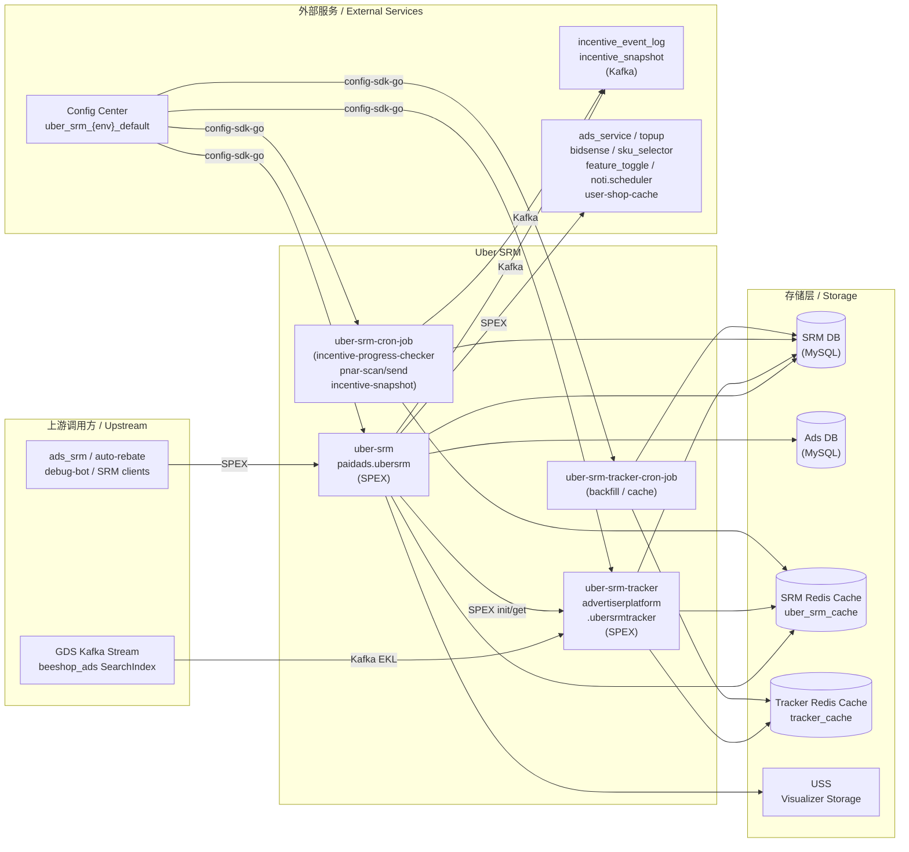

<!-- ads-workspace-gdoc-sync: gdoc_id=1S8TI8z9cTkR6UqPzNjQ67oSN9VSO8F9nY-q5ub5jba4 gdoc_url=https://docs.google.com/document/d/1S8TI8z9cTkR6UqPzNjQ67oSN9VSO8F9nY-q5ub5jba4/edit -->

# Über SRM / Über SRM

> **Git**: [https://git.garena.com/shopee/deep/uber-srm](https://git.garena.com/shopee/deep/uber-srm)

## 目录 / Table of Contents

1. [项目概述 / Introduction](#项目概述--introduction)
2. [核心功能 / Features](#核心功能--features)
3. [项目架构 / Architecture](#项目架构--architecture)
4. [目录结构 / Directory Structure](#目录结构--directory-structure)
5. [运行入口与业务模块 / Runtime and Business Modules](#运行入口与业务模块--runtime-and-business-modules)
   - [Uber SRM API](#uber-srm-api--uber-srm-api)
   - [Uber SRM Tracker](#uber-srm-tracker--uber-srm-tracker)
   - [Workflow Graph 与节点 / Workflow Graph and Nodes](#workflow-graph-与节点--workflow-graph-and-nodes)
   - [Incentive 类型与业务 Helper / Incentive Types and Business Helpers](#incentive-类型与业务-helper--incentive-types-and-business-helpers)
   - [Cronjobs 与运营工具 / Cronjobs and Ops Tools](#cronjobs-与运营工具--cronjobs-and-ops-tools)
6. [开发与本地运行 / Development and Local Run](#开发与本地运行--development-and-local-run)
   - [环境准备 / Setup](#环境准备--setup)
   - [构建、测试与代码生成 / Build, Test and Codegen](#构建测试与代码生成--build-test-and-codegen)
   - [本地运行 / Local Run](#本地运行--local-run)
   - [Code Review & Git Workflow](#code-review--git-workflow)
7. [配置与部署 / Configuration and Deployment](#配置与部署--configuration-and-deployment)
   - [环境配置文件 / Environment Config Files](#环境配置文件--environment-config-files)
   - [Config Center 与动态配置 / Config Center and Runtime Config](#config-center-与动态配置--config-center-and-runtime-config)
   - [SPEX、Kafka、Redis 与存储 / SPEX, Kafka, Redis and Storage](#spexkafkaredis-与存储--spex-kafka-redis-and-storage)
   - [Mesos 构建与发布 / Mesos Build and Release](#mesos-构建与发布--mesos-build-and-release)
8. [监控与排障 / Monitoring and Operations](#监控与排障--monitoring-and-operations)
9. [关键术语 / Key Terms](#关键术语--key-terms)
10. [参考资料 / Additional Resources](#参考资料--additional-resources)
11. [常见问题 / Frequently Asked Questions](#常见问题--frequently-asked-questions)

---

## 项目概述 / Introduction

Uber SRM（Seller Reward Management，卖家奖励管理）是 Shopee Paid Ads 广告主平台（Advertiser Platform）中的一个 Go 微服务，负责通过基于图的 Workflow 执行机制编排复杂的卖家激励计划。它**不是**通用 CRUD 服务：核心业务逻辑由 Workflow Graph、节点实现、Activity 编排以及每种计划类型专属的业务 Helper 驱动。该服务有四个部署产物——`uber-srm`、`uber-srm-tracker`、`uber-srm-cron-job` 和 `uber-srm-tracker-cron-job`，各自负责不同的运行时职责。

---

## 核心功能 / Features

### Program 与 Incentive 管理 / Program & Incentive Management

基于 `sp_proto/paidads.adv_platform/uber_srm.proto` 和 `internal/activity/`：

- **Program CRUD**：通过 `batch_set_program`、`list_program`、`batch_set_program_cluster` 创建和查询 ProgramType、ProgramPreset、ProgramV2、ProgramCluster
- **Incentive 生命周期**：通过 `batch_set_incentive`、`batch_set_incentive_node`、`batch_do_incentive`、`batch_trigger_incentive` 完成卖家注册、节点配置更新、节点执行触发
- **快速创建 / 快速设置**：简化版卖家注册流程（`batch_quick_create_incentive`）和节点更新流程（`batch_quick_set_incentive_node`）
- **Incentive 列表查询**：通过 `list_incentive` 获取带实时数据补丁的 Incentive 状态
- **Workflow 可视化**：通过 `get_workflow_graph` 以 JSON 形式获取 DAG 图结构

### Tracker 服务 / Tracker Service

基于 `sp_proto/paidads.adv_platform/uber_srm_tracker.proto` 和 `internal/controller_tracker/`：

- **实时进度追踪**：初始化（`init_tracker`）、编辑（`edit_tracker`）、查询（`get_progress`）Tracker 状态
- **实时处理器**（通过 GDS Kafka → EKL 消费，定义于 `internal/controller_tracker/business_logic_handler/`）：
  - `accumulated_spending`——广告消耗累积
  - `accumulated_topup`——充值金额累积
  - `ads_activation`——首次创建广告事件
  - `basic_item_spending`——按商品广告消耗追踪
  - `ads_account_audit_count`——账户审核事件计数
  - `ads_audit_event_count`——通用审核事件计数
- **补录与缓存 Cron**：补偿实时事件遗漏

### Incentive 计划类型（V2）/ Incentive Program Types

`internal/business_helper/` 中共 12 种计划类型：

| 计划类型 | ID | 描述 |
|---|---|---|
| `qss_one_month` | 100 | 四周卖家质量任务（创建广告 + 充值），含可选 ATU 奖励 |
| `basic_item_spending` | 101 | 在 N 个指定商品上完成每件目标消耗 |
| `sustained_atu` | 102 | 持续开启 Auto Top-Up（ATU）N 天 |
| `signup_spending` | 103 | 新卖家注册后的消耗门槛 |
| `target_product_spending` | 104 | 在 Redis 商品池中的商品上完成消耗，按商品奖励 |
| `campaign_optimization` | 105 | 持续维持计划预算和 ROAS 目标 N 天 |
| `simple_fixed_reward` | 106 | 达到广告消耗阈值获得固定金额充值奖励 |
| `sustained_auto_escrow` | 107 | 持续开启 Auto Escrow N 天；支持基于 `DisplayTime` 的 `Scheduled` fe_status，用于开始前的展示控制 |
| `simple_topup` | 108 | 按充值金额阶梯获得奖励 |
| `simple_atu` | 109 | 充值累积 + ATU 开启要求 |
| `top_product_spending` | 110 | 运营精选商品，按商品设置消耗目标与奖励 |
| `fee_auto_escrow` | 111 | 持续按要求费率开启 Fee Auto Escrow；达到 Take Rate 目标可获额外奖励 |

### 离线操作（Cronjobs）/ Offline Operations

- **`incentive-progress-checker`**：扫描活跃 Incentive 并推进节点状态
- **`pnar-scan` / `pnar-send`**：扫描符合条件的卖家并发送推送通知（PNAR）
- **`incentive-snapshot`**：将完整 Incentive 展示状态写入 DE Kafka
- **Tracker `backfill` / `cache`**：补录缺失 Tracker 数据并同步缓存

---

## 项目架构 / Architecture

### 分层模型 / Layered Architecture

```
cmd/                      ← 入口；启动 & 运行
internal/setup/           ← Wire DI 配置 + gRPC Controller 注册
internal/activity/        ← 请求编排（校验 → 持久化 → 执行图）
internal/service/         ← 领域逻辑（状态机、变更后回调）
internal/graph_engine/    ← DAG 遍历与执行（Walker、Strategy）
internal/node/            ← 节点实现（condition、action、control）
internal/business_helper/ ← 计划类型专属输入/输出/补丁逻辑
internal/repository/      ← DB、外部 SPEX、Redis 数据访问
internal/kafka/           ← Kafka 生产者/消费者封装
internal/cache/           ← Redis 连接及键值封装
internal/storage/         ← S3/USS 上传（Workflow 可视化器）
```

Incentive 创建请求流转：

1. gRPC 请求到达 → `internal/setup/uber_srm/controller.go`
2. `batch_set_incentive` Activity 校验输入、冲突检测、解析 Shop
3. Write Helper（`internal/write_helper/`）将 Incentive 和节点持久化到 SRM DB
4. `graph_engine.Walker` 配合 `ProcessStrategy` 遍历 DAG：对每个节点依次调用 `Yield()` 再调用 `Do()`
5. 节点输出通过 Artifact 连线成为后续节点的输入
6. `MustDoIncentivePostChange()` 发送 Kafka 事件和审计日志

### 上下游调用拓扑 / Service Topology



#### 上游调用方 / Upstream Callers

| 调用方 | 协议 | 调用的 API |
|---|---|---|
| `deep.paidads.platform.ads_srm` | SPEX | `list_incentive` |
| `auto-rebate` | SPEX | `list_incentive` |
| `ads-platform-quick-debug-bot` | SPEX | `get_workflow_graph`、`list_incentive` |
| 通用 SRM 客户端 | SPEX | 所有 `paidads.adv_platform.uber_srm.*` RPC |
| Uber SRM API 服务自身 | SPEX | `init_tracker`、`edit_tracker`、`get_progress` |
| GDS / beeshop_ads 数据流 | Kafka（EKL/Muse） | 由 `uber-srm-tracker` 消费 |

#### 下游依赖 / Downstream Dependencies

| 服务 | 协议 | 用途 |
|---|---|---|
| SRM DB + SRM ID 生成器（ads-db-lib） | MySQL（GDBC） | 所有 SRM 实体的主存储 |
| Ads DB（ads-db-lib） | MySQL（GDBC） | 计划、广告、消耗数据，用于 Incentive 评估 |
| Uber SRM Redis（`uber_srm_cache`） | Redis | 运行时缓存 + 分布式锁 |
| Tracker Redis（`tracker_cache`） | Redis | 实时 Tracker 状态 |
| `incentive_event_log` Kafka Topic | Kafka（Muse CRDS） | 发送给 DE 的 Incentive 变更事件 |
| `incentive_snapshot` Kafka Topic | Kafka（Muse CRDS） | 发送给 DE 分析的完整 Incentive 状态 |
| USS Visualizer Storage | HTTP | Workflow DAG 图片上传 |
| `paidads.ads_service` | SPEX | 广告账户状态、计划天数信息 |
| `paidads.ultimate_ads_service` | SPEX | 输出补丁用的计划列表 |
| `paidads.topup` | SPEX | 充值进度、充值金额注入 |
| `paidads.srm_core` | SPEX | 旧版 SRM 兼容层 |
| `paidads.adv_platform.uber_srm_tracker` | SPEX | 内部 Tracker 初始化/编辑/查询 |
| `paidads.bidsense` | SPEX | Take Rate 信息、商品推荐 |
| `paidads.sku_selector` | SPEX | 目标商品推荐 |
| `marketplace.listing.item.itemaggregation.iteminfo` | SPEX | 商品元数据及店铺商品数量 |
| `marketplace.listing.itemtagservice.querying_api` | SPEX | 商品标签检查（被屏蔽/成人内容） |
| `shop.feature_toggle` | SPEX | 店铺级别资格和白名单 |
| `seller.platform.miscellaneous.admin` | SPEX | 更新卖家弹窗状态 |
| `noti.scheduler` | SPEX | PNAR 及卖家通知 |
| `user-shop-cache` | SDK | 用户与店铺映射解析 |
| `item-ads-cache` | SDK | 广告激活追踪（Tracker 使用） |
| Config Center（`uber_srm_{env}_default`） | config-sdk-go | 运行时 DB、Redis、Kafka、USS 配置 |

---

## 目录结构 / Directory Structure

```
uber-srm/
├── cmd/
│   ├── uber-srm/                         # 主 API 服务入口（CGO_ENABLED=1）
│   ├── uber-srm-tracker/                 # 实时 Tracker 服务入口
│   ├── uber-srm-cron-job/                # 批量 Cron 任务（进度检查、PNAR、快照）
│   └── uber-srm-tracker-cron-job/        # Tracker 维护 Cron（补录、缓存）
│
├── internal/
│   ├── activity/                         # 请求编排层
│   │   ├── batch_set_incentive/          # Incentive 创建、快速创建
│   │   ├── batch_set_incentive_node/     # 节点配置更新、快速设置
│   │   ├── batch_do_incentive/           # 触发节点执行、撤销、同步进度
│   │   ├── batch_trigger_incentive/      # 触发 Tracker 驱动的 Incentive 评估
│   │   ├── batch_set_program/            # Program CRUD
│   │   ├── batch_set_program_cluster/    # ProgramCluster 管理
│   │   ├── list_incentive/               # Incentive 列表查询及输出格式化
│   │   ├── list_program/                 # Program 列表查询
│   │   └── get_workflow_graph/           # DAG 结构获取
│   │
│   ├── graph_engine/                     # Workflow DAG 执行引擎
│   │   ├── walker.go                     # Walker 接口
│   │   ├── strategy_process.go           # ProcessStrategy：执行节点
│   │   ├── strategy_validation.go        # ValidationStrategy：空运行
│   │   ├── dependency.go                 # 节点间 Artifact 数据流
│   │   └── node_store.go                 # 内存节点注册表
│   │
│   ├── node/                             # 节点实现
│   │   ├── helper.go                     # 节点工厂（所有节点类型）
│   │   ├── action_give_handout/          # 发放充值奖励
│   │   ├── condition_*/                  # 13 个 condition 节点（消耗、充值、领取等）
│   │   ├── control_*/                    # 5 个 control flow 节点（顺序、并行、信号）
│   │   └── common/                       # 共享时间、状态、激活 Helper
│   │
│   ├── business_helper/                  # 计划类型专属逻辑
│   │   ├── basic_item_spending/
│   │   ├── campaign_optimization/
│   │   ├── fee_auto_escrow/
│   │   ├── qss_one_month/
│   │   ├── signup_spending/
│   │   ├── simple_atu/
│   │   ├── simple_fixed_reward/
│   │   ├── simple_topup/
│   │   ├── sustained_atu/
│   │   ├── sustained_auto_escrow/
│   │   ├── target_product_spending/
│   │   ├── top_product_spending/
│   │   └── common/                       # 共享 DB 查询工具
│   │
│   ├── controller_tracker/               # Tracker 服务逻辑
│   │   ├── business_logic_handler/       # 实时处理器（消耗、充值、激活等）
│   │   ├── kafka_handler/                # GDS Kafka 消息路由
│   │   ├── spex_api/                     # init/edit/get_progress RPC 处理器
│   │   ├── backfill_cron/                # 补录 Cron 逻辑
│   │   └── cache_cron/                   # 缓存同步 Cron 逻辑
│   │
│   ├── service/                          # 领域业务逻辑
│   │   ├── incentive/                    # 变更后回调、Kafka 事件发送
│   │   ├── ads/                          # 计划和广告数据
│   │   ├── ads_account/                  # ATU、Take Rate、费率指标
│   │   ├── item/                         # 商品列表、店铺商品数量
│   │   └── locator/                      # 用户与店铺映射解析
│   │
│   ├── repository/                       # 数据访问层
│   │   ├── incentive/                    # Incentive + 节点 DB 操作
│   │   ├── program/                      # Program DB 操作
│   │   ├── ads/                          # 计划、广告消耗查询
│   │   ├── ads_account/                  # ATU、Take Rate SPEX 调用
│   │   ├── item/                         # 商品信息、标签
│   │   ├── topup/                        # 充值金额、充值注入
│   │   ├── tracker/                      # Tracker DB 查询
│   │   ├── account/                      # 店铺/账户信息
│   │   └── shop_feature_toggle/          # Feature Flag 检查
│   │
│   ├── repository_tracker/               # Tracker 专属数据访问
│   │   ├── realtime_tracker/             # 基于 Redis 的 Tracker 状态（含 Lua 脚本）
│   │   └── tracker/                      # Tracker DB CRUD
│   │
│   ├── cache/                            # Redis 连接与操作
│   ├── kafka/                            # Kafka 生产者/消费者（Muse CRDS）
│   ├── storage/                          # USS S3 上传（可视化器）
│   ├── model/                            # 共享领域结构体
│   ├── model_tracker/                    # Tracker 领域结构体
│   ├── constant/                         # 枚举（生成）及常量
│   ├── convert_helper/                   # Proto ↔ 内部模型转换
│   ├── write_helper/                     # 写前冲突检查与比较逻辑
│   ├── validator_helper/                 # 共享校验逻辑
│   ├── visualizer/                       # DAG → Graphviz JSON 渲染
│   ├── translator/                       # PNAR 通知的 i18n
│   ├── exporter/                         # Prometheus 指标定义
│   ├── db_manager/                       # 多路 DB 客户端初始化
│   ├── spex/                             # SPEX 拦截器
│   └── setup/                            # Wire DI 入口
│       ├── uber_srm/                     # API 服务 Wire Provider + Controller
│       └── uber_srm_tracker/             # Tracker Wire Provider + Controller
│
├── config/
│   ├── uber_srm.go                       # 配置结构体定义（UberSRM、UberSRMTracker）
│   └── files/                            # 各环境启动 YAML
│       ├── live.yml / liveish.yml / stable.yml
│       ├── staging.yml / test.yml / uat.yml
│
├── deploy/
│   ├── mesos.sh                          # 构建 + 运行编排脚本
│   ├── ubersrm.json                      # API 服务 Mesos 配置
│   ├── ubersrmtracker.json               # Tracker Mesos 配置
│   ├── ubersrmcronjob.json               # Cron 任务 Mesos 配置
│   └── ubersrmtrackercronjob.json        # Tracker Cron Mesos 配置
│
├── proto/
│   ├── manifest.yaml                     # Proto 依赖清单
│   └── go/                               # 生成的 Proto 代码（勿手动编辑）
│       ├── paidads_adv_platform_uber_srm.pb/
│       ├── paidads_adv_platform_uber_srm_log.pb/
│       └── paidads_adv_platform_uber_srm_tracker.pb/
│
├── sp_proto/
│   └── paidads.adv_platform/
│       ├── uber_srm.proto                # 核心 API + DB 消息定义
│       ├── uber_srm_tracker.proto        # Tracker API 定义
│       └── uber_srm_log.proto            # 事件日志消息定义
│
├── scripts/
│   ├── copy_ads_db_srm_proto/            # 从 ads-db-lib 同步 Proto 的脚本
│   └── gen-dep-proto.sh                  # Proto 依赖生成
│
├── tools/                                # 本地/运营工具（不部署为服务）
│   ├── fee_auto_escrow_progress_mock/
│   ├── program_type_generator/           # 生成新计划类型 Workflow YAML 配置
│   ├── single_incentive_setter/
│   ├── single_node_checker/
│   ├── single_node_setter/
│   ├── target_product_item_mock/
│   └── tracker_mock/
│
├── .claude/
│   ├── CLAUDE.md                         # AI 编码规范
│   └── rules/
│       ├── add_new_incentive_type.md     # 新增 Incentive 类型检查清单
│       └── snapshot_helper.md            # DE Kafka 快照字段参考
│
├── go.mod                                # Go 1.21.0 模块定义
├── Makefile                              # 构建、测试、代码生成目标
└── sp-workspace.yml                      # SPEX Workspace Proto 依赖配置
```

---

## 运行入口与业务模块 / Runtime and Business Modules

### Uber SRM API / Uber SRM API

SPEX 服务：`paidads.ubersrm`，Processor：`paidads.adv_platform.uber_srm`

| RPC | 说明 |
|---|---|
| `batch_set_program` | 创建或更新 ProgramType、ProgramPreset、ProgramV2 |
| `list_program` | 按条件查询 Program |
| `batch_set_program_cluster` | 创建或更新 ProgramCluster |
| `batch_set_incentive` | 注册卖家、创建 Incentive |
| `batch_set_incentive_node` | 更新 Incentive 节点配置 |
| `batch_do_incentive` | 执行节点逻辑：`DO_NODE`、`DISMISS`、`SYNC_PROGRESS` |
| `batch_trigger_incentive` | 触发 Tracker 驱动的 Incentive 评估 |
| `batch_quick_create_incentive` | 简化版卖家注册流程 |
| `batch_quick_set_incentive_node` | 简化版节点更新流程 |
| `list_incentive` | 获取 Incentive 列表，含计算出的 `fe_status` 及实时数据补丁 |
| `get_workflow_graph` | 返回 Workflow DAG JSON，用于可视化 |

### Uber SRM Tracker / Uber SRM Tracker

SPEX 服务：`advertiserplatform.ubersrmtracker`，Processor：`paidads.adv_platform.uber_srm_tracker`

| RPC | 说明 |
|---|---|
| `init_tracker` | 创建新 Tracker，设置阈值和时间窗口 |
| `edit_tracker` | 删除 Tracker 或设置上次补录时间 |
| `get_progress` | 读取当前 Tracker 进度（Redis 支撑） |

**实时处理器**（通过 GDS Kafka → EKL，定义于 `internal/controller_tracker/business_logic_handler/`）：

| 处理器 | 追踪内容 |
|---|---|
| `accumulated_spending` | 按用户/时间窗口累计广告消耗 |
| `accumulated_topup` | 按用户累计充值金额 |
| `ads_activation` | 首次创建广告事件 |
| `basic_item_spending` | 按商品广告消耗 |
| `ads_account_audit_count` | 账户审核事件计数 |
| `ads_audit_event_count` | 通用审核事件计数 |

### Workflow Graph 与节点 / Workflow Graph and Nodes

定义于 `internal/graph_engine/` 和 `internal/node/`。**Workflow Graph** 是由 `WorkflowNode` 条目组成的 DAG；每个节点包含类型、父子链接以及 Artifact `input_list`/`output_list`。

**Walker 执行**（`internal/graph_engine/walker.go`）：
1. 对所有节点调用 `Yield()` 初始化状态
2. 通过 `ProcessStrategy` 按拓扑顺序对各节点调用 `Do()`
3. `ValidationStrategy` 提供空运行（dry-run）模式用于预检

**节点分类**（完整工厂见 `internal/node/helper.go`）：

| 分类 | 节点类型 |
|---|---|
| **Control** | `control_sequence`、`control_parallel_and`、`control_parallel_select`、`control_active_once`、`control_signal_link` |
| **Action** | `action_give_handout`（向卖家发放充值奖励） |
| **Condition** | `cond_accumulate_spending`、`cond_accumulate_topup`、`cond_claim`、`cond_have_ads`、`cond_have_items`、`cond_create_item_first_ads`、`cond_basic_item_spending`、`cond_sustain_requisites`、`cond_signup`、`cond_target_product_spending`、`cond_campaign_optimization`、`cond_top_product_spending`、`cond_fee_auto_escrow` |

### Incentive 类型与业务 Helper / Incentive Types and Business Helpers

`internal/business_helper/<type>/` 下每个 Helper 提供：
- **`input_helper.go`**：将公开 API 配置转换为 Workflow 节点配置（用于 Incentive 创建）
- **`output_helper.go`**：将 DB 节点 + 状态转换为 `list_incentive` 响应及 Kafka 快照 Payload
- **`output_helper_patch_data.go`**：实时字段的数据补丁（消耗、ATU 状态等）
- **`validate.go`**：计划类型专属校验（注册资格、冲突检查）

Write Helper（`internal/write_helper/compare.go`）在每次 DB 写入前比对新旧节点 extinfo。若无变化则跳过写入；若有变化则持久化到 DB 并生成审计日志。

### Cronjobs 与运营工具 / Cronjobs and Ops Tools

**`uber-srm-cron-job`** 命令（定义于 `cmd/uber-srm-cron-job/`）：

| 命令 | 用途 |
|---|---|
| `incentive-progress-checker` | 扫描活跃 Incentive；触发节点状态转换 |
| `pnar-scan` | 扫描符合推送通知条件的卖家 |
| `pnar-send` | 通过 `noti.scheduler` SPEX 发送推送通知 |
| `incentive-snapshot` | 将完整 Incentive 状态写入 `incentive_snapshot` Kafka Topic |

**`uber-srm-tracker-cron-job`** 命令（定义于 `cmd/uber-srm-tracker-cron-job/`）：

| 命令 | 用途 |
|---|---|
| `backfill` | 从 Translog 历史补录缺失的 Tracker 进度 |
| `cache` | 从 DB 刷新 Tracker Redis 缓存 |

**`tools/`**（仅本地/运营使用，不作为服务部署）：

| 工具 | 用途 |
|---|---|
| `program_type_generator` | 为新计划类型生成 Workflow YAML 配置 |
| `single_incentive_setter` | 手动设置单个 Incentive 状态（运营工具） |
| `single_node_checker` | 查看单个节点当前状态 |
| `single_node_setter` | 手动覆盖单个节点状态 |
| `tracker_mock` | 用于本地测试的 Tracker 模拟数据 |
| `target_product_item_mock` | 模拟目标商品 Redis 数据 |
| `fee_auto_escrow_progress_mock` | 模拟 Fee Auto Escrow 进度数据 |

---

## 开发与本地运行 / Development and Local Run

### 环境准备 / Setup

**Go 版本**：`1.21.0`

> ⚠️ Go 1.24 会导致 `bytedance/sonic` 不兼容——在解决该依赖问题前请勿升级到 1.21 以上版本。

> **快速开始**：`make env` 将环境检查脚本、第 2 步（`proto-ensure-dep-only`）和第 6 步（`translation`）合并为一条命令。第 1、3、4、5、7 步仍需手动执行。

```bash
# 1. 安装 spkit（包含 wire、go-enum、golangci-lint、spcli、i18n-kit、spex-generator）
make tools

# 2. 下载 Proto 依赖
make proto-ensure-dep-only

# 3. 将 Proto 文件编译到 proto/go/
make proto-compile-dep-only

# 4. 生成枚举文件（*_enum.go）
make enum

# 5. 下载 Go 模块
make dep-download   # 等价于：go mod download

# 6. 下载 PNAR 的 i18n 翻译数据（Transify 项目 ID 175）
make translation

# 7. 生成 Wire DI 文件（wire_gen.go）
make wire
```

### 构建、测试与代码生成 / Build, Test and Codegen

**构建目标：**

```bash
make uber-srm                        # API 服务（CGO_ENABLED=1，同时交叉编译为 Linux 二进制）
make uber-srm-tracker                # Tracker 服务
make uber-srm-cron-job               # Cron 任务二进制
make uber-srm-tracker-cron-job       # Tracker Cron 二进制
make build-tool TOOL=<tool_name>     # 构建 tools/ 下的工具（如 TOOL=tracker_mock）
```

所有构建目标均依赖 `make enum`，并通过 `-ldflags` 注入版本、Commit、分支和构建信息。

**代码质量：**

```bash
make fmt        # 检查 go fmt（若有文件需要格式化则失败）
make lint       # 运行 golangci-lint（GOGC=64）
make test       # 运行所有测试，带 -v -cover
make test-nv    # 运行测试，不输出详细日志
make ci         # lint + fmt + test-nv（与 GitLab CI 流水线一致）
```

**生成代码——勿手动编辑：**

| 目标 | 命令 | 输出 |
|---|---|---|
| 枚举类型 | `make enum` | `internal/constant/*_enum.go` |
| Wire DI | `make wire` | `internal/setup/*/wire_gen.go`、`internal/graph_engine/wire_gen.go` |
| Proto（Go） | `make proto-compile-dep-only` | `proto/go/**/*.pb.go`、`*.spex.go` |
| i18n 数据 | `make translation` | PNAR 翻译数据（Transify 项目 ID 175） |

从 `ads-db-lib` 同步 SRM Proto 消息：

```bash
make update_ads_srm_proto         # 克隆 ads-db-lib、复制 Proto、重新生成
make update_ads_srm_proto_local   # 使用 scripts/ 中已有的 Proto 副本
```

### 本地运行 / Local Run

1. 准备一份本地 `config.yml`，指向测试/Staging 端点（从 `config/files/test.yml` 复制并填写真实密钥）。
2. 启动 API 服务：
   ```bash
   ./bin/paidads_uber-srm_server -config config.yml
   ```
3. 健康检查端点：
   - `GET /smoketest`——冒烟测试（10 次重试，1 秒超时，来自 `deploy/ubersrm.json`）
   - `GET /ping`——存活检查（3 次重试，1 秒超时）

启动 Tracker 服务：
```bash
./bin/paidads_uber-srm-tracker_server -config config.yml
```

### Code Review & Git Workflow

- 功能分支：`<username>/feat/<description>` 或 `<username>/fix/<description>`
- 所有面向 `master` 的 MR 均会在 GitLab CI 中运行 `bash scripts/validate.sh`
- 修改 Workflow 节点或业务 Helper 时，须核对 `.claude/rules/add_new_incentive_type.md` 中的所有集成检查点
- 生成文件（`wire_gen.go`、`*_enum.go`、`proto/go/`）禁止手动编辑——使用上述 Makefile 目标重新生成

---

## 配置与部署 / Configuration and Deployment

### 环境配置文件 / Environment Config Files

`config/files/` 下的启动 YAML 在服务启动时加载。其中只包含服务启动所需的最少配置——SPEX 注册密钥和 user-shop-cache 配置。所有运行时配置均从 Config Center 拉取。

```yaml
# config/files/live.yml（仅展示结构——密钥已隐去）
uber-srm:
  env: live
  config-secret: <redacted>       # Config Center 访问密钥——勿提交真实值
  spex:
    service: paidads.ubersrm
    env: live
    tag: master
    deployment: default
    config-key: <redacted>        # SPEX 配置密钥
    serve-timeout: 60000ms
  user-shop-cache:
    env: live
    capacity: 2000000

uber-srm-tracker:
  env: live
  config-secret: <redacted>
  spex:
    service: advertiserplatform.ubersrmtracker
    ...
```

### Config Center 与动态配置 / Config Center and Runtime Config

- **Group**：`paid_ads`
- **Project**：`paid_ads_platform`
- **Namespace 规律**：`uber_srm_{env}_default`

| Key | Go 类型 | 内容 |
|---|---|---|
| `config` | `config.UberSRM` | SRM Redis（`uber_srm_cache`、`uber_srm_locker`）、Ads DB、SRM DB、USS 可视化器、`incentive_event_log` 和 `incentive_snapshot` 的 Kafka、PNAR 翻译 |
| `tracker_config` | `config.UberSRMTracker` | GDS Kafka 消费者（`gds_kafka`）、Tracker Redis（`tracker_cache`）、SRM Redis、DB 端点 |
| `server_config` | 服务器配置 | HTTP 端口、Admin 端点设置 |
| `pnar_config` | `config.PNARConfig` | `ProgramTypeName2ProgramNameTranslation`——计划名称到 i18n Key 的映射 |

### SPEX、Kafka、Redis 与存储 / SPEX, Kafka, Redis and Storage

**SPEX**：通过 `golang_splib` 注册。启动配置字段 `spex.service` 和 `spex.config-key` 完成服务发现注册。Proto 定义位于 `sp_proto/`；生成的 Go Stub 位于 `proto/go/`。工作区文件 `sp-workspace.yml` 声明了所有 Proto 依赖。

**Kafka**：所有 Topic 均通过 Muse CRDS（`git.garena.com/shopee/common/mq-contrib/muse`）配置。生产者使用 `sarama` + Enhanced Kafka Library（EKL）。Tracker 中的 GDS 消费者由 `enhanced-kafka-lib` 驱动，采用 CDC Base Processor 路由。

**Redis**：两个独立 Redis 连接池：
- `uber_srm_cache`——API 服务和 Cron 使用；Key 前缀 `uber_srm.{env}.{COUNTRY}.`；包含分布式锁连接池 `uber_srm_locker`
- `tracker_cache`——仅 Tracker 服务使用；Key 前缀 `tracker.{env}.{country}.`；重要逻辑 Key：`tracker_uid_{user_id}`、`tracker_{tracker_id}_{threshold_idx}`、`threshold_{tracker_id}_{threshold_idx}`

**USS**：`internal/storage` 使用 `config.USS.Visualizer` 配置，将 Graphviz 渲染的 Workflow DAG JSON 上传至 USS。

### Mesos 构建与发布 / Mesos Build and Release

构建和运行均通过 `deploy/mesos.sh` 驱动：

```bash
# 完整构建流程（由 CI 通过 ubersrm.json 执行）
bash ./scripts/gen-dep-proto.sh && make dep-download && bash ./deploy/mesos.sh build uber-srm ubersrm config/files

# 运行时启动命令（Mesos）
./mesos.sh run uber-srm
```

部署配置：

| 文件 | Module Name | 服务 |
|---|---|---|
| `deploy/ubersrm.json` | `ubersrm` | `paidads.ubersrm` API 服务 |
| `deploy/ubersrmtracker.json` | `ubersrmtracker` | `advertiserplatform.ubersrmtracker` Tracker |
| `deploy/ubersrmcronjob.json` | `ubersrmcronjob` | Cron 任务容器 |
| `deploy/ubersrmtrackercronjob.json` | `ubersrmtrackercronjob` | Tracker Cron 容器 |

所有容器使用基础镜像 `harbor.shopeemobile.com/paidads/base/platform:1.21`。

---

## 监控与排障 / Monitoring and Operations

### Grafana 面板 / Grafana Dashboards

- [Advertiser Platform 目录](https://monitoring.infra.sz.shopee.io/grafana/dashboards/f/advertiser-platform/advertiser-platform)——所有 Advertiser Platform 服务
- [Uber SRM](https://monitoring.infra.sz.shopee.io/grafana/d/lUTzqIrHk/uber-srm)——API 服务指标
- [Uber SRM（USRM）Tracker](https://monitoring.infra.sz.shopee.io/grafana/d/EtCuulXNz/uber-srm-usrm-tracker)——Tracker 服务指标

### 核心指标族 / Metric Families

所有指标使用 Prometheus Namespace `paidads`。

| 子系统 | 关键指标 |
|---|---|
| `uber_srm_server` | `incentive_credit_handout_counter`、`incentive_anomaly_counter`（事件：`zero_actual_handout`、`unactivated_node`、`fail_node_activation`、`bad_conclude_case`）、`incentive_audit_event_counter`、`do_incentive_node_latency_ms`、`incentive_currently_processing`、`incentive_lifespan`、`incentive_single_api_outcome_counter`、`cache_latency`、`locker_latency`、`cache_load_hit_rate`、`spex_request`、`spex_latency` |
| `uber_srm_tracker` | `tracker_anomaly_counter`、`cache_latency`、`locker_latency`、`cache_load_hit_rate`、`spex_request`、`spex_latency` |
| `uber_srm_cron_job` | Cron 任务执行计数器 |
| `uber_srm_cron_job_incentive_progress_checker` | `incentive_progress_checker_change`——每次运行中 Incentive 状态转换数量 |
| `uber_srm_cron_job_pnar_send` | PNAR 通知发送成功/失败计数器 |
| `uber_srm_tracker_cache_cron` | 缓存同步指标 |
| `uber_srm_tracker_backfill_cron` | 补录执行和进度指标 |

### 常见排障 / Common Troubleshooting

| 症状 | 可能原因 | 解决方法 |
|---|---|---|
| 服务无法启动 | Config Center 拉取失败（`config-secret` 错误或 Namespace 不存在） | 检查启动 YAML 中的密钥及 Config Center Namespace `uber_srm_{env}_default` |
| SPEX 下游错误 | 目标服务不可用或 Config Key 不匹配 | 检查 SPEX 注册表和下游服务健康状态 |
| Redis 操作错误 | 缓存连接池配置错误 | 在 Config Center 中确认 `config.uber_srm_cache` 和 `config.tracker_cache` 的 Key |
| Kafka 消费延迟（Tracker） | GDS 数据流处理跟不上 | 在 Kafka 面板检查 `uber_srm_tracker` 消费者组延迟 |
| Kafka 生产失败 | `incentive_event_log` 或 `incentive_snapshot` 的 Muse CRDS 配置错误 | 在 Config Center 中确认 `incentive_event_log_kafka.muse_config_list` |
| Tracker 补录未运行 | `uber-srm-tracker-cron-job backfill` 未调度或执行失败 | 检查 CMDB Cron 任务日志 |
| PNAR 未发送 | `pnar-send` Cron 出错或 `noti.scheduler` SPEX 调用失败 | 先运行 `pnar-scan` 空跑；检查 `noti.scheduler` 可用性 |
| Proto/Wire 构建不匹配 | 生成文件已过期 | 执行 `make proto-compile-dep-only && make enum && make wire` |
| `incentive_anomaly_counter` 报警 | Workflow 节点状态异常 | 参见 `internal/exporter/const.go`；通过审计日志排查 |

---

## 关键术语 / Key Terms

| 术语 | 说明 |
|---|---|
| **Program** | 卖家激励计划模板。定义 Workflow Graph、注册规则和展示配置。 |
| **ProgramType** | V2 计划类型记录，拥有 DAG 定义。共 12 种类型（ID 100–111，见 `internal/constant/program_type_enum.go`）。 |
| **ProgramCluster** | 按集群 Key（如国家/地区）分组 Program，控制可见性。 |
| **Incentive** | 卖家在某个 Program 中的注册实例。每个 `(user_id, program_id)` 对应一条记录。总体状态：INACTIVE → ACTIVE → COMPLETED/FAILED。 |
| **IncentiveNode** | 卖家 Incentive 中单个 Workflow 节点的实例。在 `extinfo`（Protobuf Blob）中保存节点专属状态和配置。 |
| **Workflow Graph** | 由 `WorkflowNode` 条目组成的 DAG。每个节点声明其类型、父子关系以及 Artifact 输入/输出连线。 |
| **Tracker** | 基于 Redis 的实时累加器。在指定时间窗口内追踪用户的累计消耗、充值或事件计数。阈值触发时触发 Incentive 评估。 |
| **PNAR** | Push Notification Advertising Reminder（推送通知广告提醒）。由 Cron 驱动的卖家 Incentive 提醒通知系统，由 `pnar-scan` + `pnar-send` 命令驱动。 |
| **QSS** | QuickStart Service（快速入门服务）。一种月度卖家质量计划（计划类型 100），包含四个每周任务。 |
| **ATU** | Ads Top-Up（广告自动充值）。卖家预存广告账户资金的功能。`sustained_atu`（102）和 `simple_atu`（109）要求或追踪该状态。 |
| **FAE** | Fee Auto Escrow（费用自动托管）。Shopee 管理的自动扣费功能，由 `sustained_auto_escrow`（107）和 `fee_auto_escrow`（111）追踪。 |
| **ProgramDisplayVariation** | 控制 Program 在前端的展示方式。取值：`default`（0）、`campaign_day`（1，基于广告系列日的展示变体）、`ads_campaign_accelerator`（2）。存储在 `program.ExtInfo.Config.DisplayConfig.DisplayVariation`。 |
| **GDS** | Global Data Stream（全球数据流）。Shopee 内部实时事件总线。`uber-srm-tracker` 通过 EKL 消费 GDS Kafka Topic。 |
| **EKL** | Enhanced Kafka Library（增强 Kafka 库，`enhanced-kafka-lib`）。Shopee 内部 Kafka 客户端，用于 GDS 事件消费。 |
| **Muse** | Shopee 的 Kafka Topic 注册表 / CRDS。用于为生产者和消费者解析 Topic 端点元数据。 |
| **USS** | Unified Storage Service（统一存储服务）。Shopee 的 S3 兼容对象存储。`internal/storage` 使用它上传 Workflow 可视化器 JSON。 |
| **Config Center** | Shopee 的运行时配置服务（`platform/config-sdk-go`）。Uber SRM 从 Namespace `uber_srm_{env}_default` 拉取所有 DB/Redis/Kafka 配置。 |

---

## 参考资料 / Additional Resources

- **Git 仓库**：[https://git.garena.com/shopee/deep/uber-srm](https://git.garena.com/shopee/deep/uber-srm)
- **Advertiser Platform 架构**：[Confluence — Advertiser Platform](https://confluence.shopee.io/display/SPAD/Advertiser+Platform)
- **Paid Ads 术语表**：[Confluence — Paid Ads Glossary](https://confluence.shopee.io/pages/viewpage.action?spaceKey=SPAD&title=Paid+Ads+Glossary)
- **Grafana — Uber SRM**：[https://monitoring.infra.sz.shopee.io/grafana/d/lUTzqIrHk/uber-srm](https://monitoring.infra.sz.shopee.io/grafana/d/lUTzqIrHk/uber-srm)
- **Grafana — Tracker**：[https://monitoring.infra.sz.shopee.io/grafana/d/EtCuulXNz/uber-srm-usrm-tracker](https://monitoring.infra.sz.shopee.io/grafana/d/EtCuulXNz/uber-srm-usrm-tracker)
- **Grafana — Advertiser Platform 目录**：[https://monitoring.infra.sz.shopee.io/grafana/dashboards/f/advertiser-platform/advertiser-platform](https://monitoring.infra.sz.shopee.io/grafana/dashboards/f/advertiser-platform/advertiser-platform)
- **SPEX Go SDK 快速入门**：[https://spex.shopee.io/overview/quick-start/languages/go/index.html](https://spex.shopee.io/overview/quick-start/languages/go/index.html)
- **spcli 安装**：[https://spex.shopee.io/user-guide/SDK/Java/local.html](https://spex.shopee.io/user-guide/SDK/Java/local.html)
- **DE Kafka 快照字段指南**：`.claude/rules/snapshot_helper.md`
- **新增 Incentive 类型检查清单**：`.claude/rules/add_new_incentive_type.md`
- **AI 编码规范**：`.claude/CLAUDE.md`
- **CMDB Cron 任务**：[https://space.shopee.io/console/cmdb/cronjobs/tree/shopee.mp_search_recommendation_ads.paidads.advertiser_platform.platform](https://space.shopee.io/console/cmdb/cronjobs/tree/shopee.mp_search_recommendation_ads.paidads.advertiser_platform.platform)

---

## 常见问题 / Frequently Asked Questions

**Q：为什么有两个独立的 SPEX 服务（`paidads.ubersrm` 和 `advertiserplatform.ubersrmtracker`）？**

A：API 服务处理同步的 Incentive 管理操作（创建、更新、查询），需要完整的依赖图，包括 Kafka 生产者、USS 存储和多个 SPEX 下游调用。Tracker 则有本质不同的运行时——它长轮询 GDS Kafka 消费者并维护基于 Redis 的实时计数器。将两者分离可实现独立扩缩容，也能避免 Kafka 消费者与 gRPC 服务器相互干扰。

**Q：某个改动应该修改哪个 `cmd` 二进制？**

A：按以下决策树判断：
- 修改 Incentive/Program CRUD 的 RPC 处理器 → `cmd/uber-srm` + `internal/activity/`
- 修改实时 Tracker 处理或 Tracker RPC → `cmd/uber-srm-tracker` + `internal/controller_tracker/`
- 新增 Cron 任务（进度检查、PNAR、快照） → `cmd/uber-srm-cron-job`
- 新增 Tracker Cron（补录、缓存同步） → `cmd/uber-srm-tracker-cron-job`

**Q：修改代码后如何重新生成 Proto、Wire 和枚举文件？**

A：按以下顺序执行：
```bash
make proto-compile-dep-only   # 重新生成 proto/go/
make enum                     # 重新生成 *_enum.go
make wire                     # 重新生成 wire_gen.go
```
禁止手动编辑生成文件。

**Q：为什么旧 README 只有 GitLab 默认模板内容？**

A：该仓库创建时使用了 GitLab 默认 README 模板，从未替换为实际文档。本文件是该服务的第一份真实文档。

**Q：为什么 `uber-srm-tracker` 同时有实时 Kafka 消费和补录 Cron？**

A：实时消费通过 GDS/EKL 在事件到达时实时处理，提供低延迟的 Tracker 更新。但在服务重启或消费者延迟期间可能会漏事件。`backfill` Cron（`uber-srm-tracker-cron-job backfill`）通过读取历史 Translog 数据并重放缺失更新来补偿，确保 Tracker 计数器最终一致。

**Q：如何新增一种 Incentive 计划类型？**

A：按 `.claude/rules/add_new_incentive_type.md` 中的完整检查清单执行。关键步骤：在 `ads-db-lib` → `ads_srm_db.proto` 中新增 Proto/DB Schema → 在 `tools/program_type_generator/program_types/` 中定义 Workflow Graph → 在 `internal/convert_helper/from_workflow_node_config.go` 和 `internal/node/helper.go` 中注册节点转换 → 在 `internal/business_helper/<type>/` 中实现全生命周期方法 → 在 `internal/write_helper/compare.go` 中更新新 extinfo 字段的比对逻辑 → 在 `internal/cronjob/incentive_snapshot/` 中添加快照支持。

**Q：如何避免将 `config-secret` 值误写入代码或文档？**

A：`config-secret` 是访问 Config Center 的启动字段。其实际值仅存在于 `config/files/live.yml`（及类似文件）中，作为运行时密钥由部署系统管理。切勿将其实际值复制到 README、提交信息或代码注释中。请将其视为凭据处理。

**Q：Grafana 中的 `incentive_anomaly_counter` 报警说明什么？**

A：它在出现异常 Workflow 事件时触发（见 `internal/exporter/const.go`）：`zero_actual_handout`（发放的充值奖励为零）、`unactivated_node`（未先调用 `Yield()` 就调用了节点的 `Do()`）、`fail_node_activation`、`bad_conclude_case`（意外的终态）。请通过受影响 `incentive_id` 的 Incentive 审计日志进行排查。

**Q：DE Kafka 快照的结构是什么？**

A：完整字段指南请见 `.claude/rules/snapshot_helper.md`。`IncentivePresentationSnapshot` 消息有一个 `derived_info` oneof，包含每种计划类型对应的 `*Info` Payload。`fe_status` 字段在发送时由各计划类型的 `output_helper.go` 计算得出——它**不存储**在 DB 中。

---

<!-- Generated by ads-workspace/skills/ads-readme-generate | checked: 141690bf8cd273777c1f512c5a226691696b6a3a | spec: 76fce5f679f9550b -->
