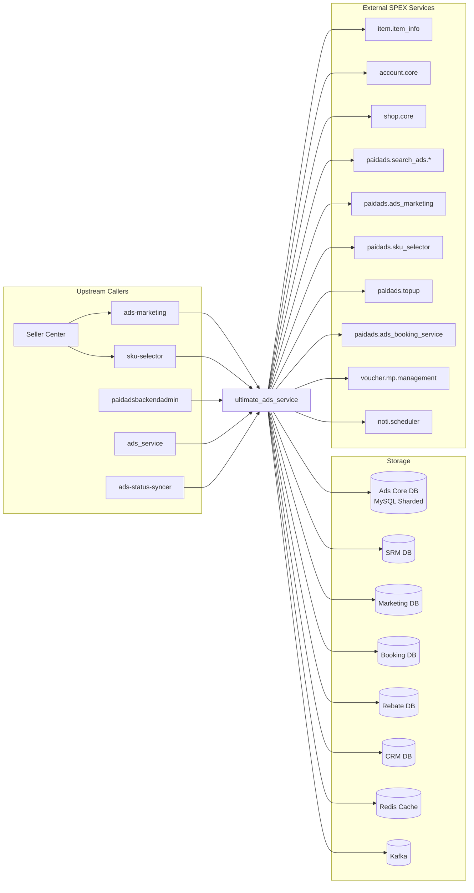

<!-- ads-workspace-gdoc-sync: gdoc_id=1pGd9wdPre5g8nuLCg2pvHPOY7VM-3zwNClf7pwFew00 gdoc_url=https://docs.google.com/document/d/1pGd9wdPre5g8nuLCg2pvHPOY7VM-3zwNClf7pwFew00/edit -->

# Ultimate Ads Service (UAS)

> Unified write/read entrypoint for Shopee Paid Ads — the authoritative source of truth for ad, campaign, and account lifecycle management across all ad types.
>
> Repository: [https://git.garena.com/shopee/deep/ultimate_ads_service](https://git.garena.com/shopee/deep/ultimate_ads_service)

---

## Table of Contents

1. [Introduction](#introduction)
2. [Features](#features)
3. [Architecture](#architecture)
4. [Directory Structure](#directory-structure)
5. [SPEX and Modules](#spex-and-modules)
   - [API Overview](#api-overview)
   - [Ads Type Modules](#ads-type-modules)
   - [Query and Audit](#query-and-audit)
6. [Cronjobs](#cronjobs)
7. [Development Guidelines](#development-guidelines)
   - [Code Style](#code-style)
   - [Project Structure](#project-structure)
   - [Naming Conventions](#naming-conventions)
   - [Error Handling](#error-handling)
   - [Unit Testing Standards](#unit-testing-standards)
   - [Code Review & Git Workflow](#code-review--git-workflow)
8. [Configuration](#configuration)
   - [Config Files](#config-files)
   - [SPEX and spcli Setup](#spex-and-spcli-setup)
9. [Deployment](#deployment)
   - [Build for Production](#build-for-production)
   - [Release Process](#release-process)
10. [Monitoring](#monitoring)
11. [Business Terminology Glossary](#business-terminology-glossary)
    - [Core Metrics](#core-metrics)
    - [Ad Types and Products](#ad-types-and-products)
    - [Placements & Entrances](#placements--entrances)
    - [Sellers & Advertisers](#sellers--advertisers)
    - [Bidding & Pricing](#bidding--pricing)
    - [Prediction & Models](#prediction--models)
    - [System Features & Services](#system-features--services)
    - [Ad Supply & Display](#ad-supply--display)
    - [Controls & Filtering](#controls--filtering)
    - [External Services & Systems](#external-services--systems)
    - [Technical Terms](#technical-terms)
12. [Additional Resources](#additional-resources)
13. [Frequently Asked Questions](#frequently-asked-questions)

---

## Introduction

**Ultimate Ads Service (UAS)** is the critical write/read gateway for Shopee Paid Ads. It serves as the **single source of truth** for all ad, campaign, keyword, and account state mutations across every ad type (Search Product, Shop, Live-stream, Video, Brand Consideration Ads, Search Brand Ads, Product GMS, etc.).

Callers include Seller Center (via `ads-marketing` and `sku-selector`), `paidadsbackendadmin`, `ads_service`, and other internal platform services. UAS persists all state to the Ads DB through `ads-db-lib` and publishes change events to Kafka for downstream consumers.

---

## Features

- **Unified write gateway** — `SetAdvertiseBatch*` / `MassUpdate*` APIs for every ad type, ensuring consistent validation, audit logging, and deduplication
- **Campaign lifecycle management** — create, update, delete/hide campaigns across Search, Display, Live-stream, Video, Brand Consideration Ads, and Product GMS ad types
- **Keyword management** — add, update, and mass-update keywords with match-type and price validation
- **Account management** — read/write of ads account balance state via `SetAdsAccount` / `GetAdsAccount`
- **Target audience groups** — CRUD of audience targeting segments
- **Setup flow versioning** — `GetSetupFlowVersion` / `InvalidateSetupFlowVersionCache` for feature-flag-based UI rollout
- **Audit and operation logging** — `GetAuditLogList`, `BatchGetAuditLogList`, `GetOperationLogList`
- **Brand Consideration Ads** — full lifecycle including QC approval and whitelist/blacklist checking
- **Search Brand Ads** — package management, creative QC, whitelist scanning
- **Product GMS Ads** — GMS item management and background ROI-3 GMS ads
- **Automated Ads Solution** — `SetCampaignAutoAdsSolution` for system-driven campaign management
- **Ads Voucher Package** — management of bundled ad credit packages (`SetBatchAdsVoucherPackage`, `GetAdsVoucherPackage`)
- **Campaign Accelerator** — seller sign-up for time-bounded program packages that sync auto-escrow fee-rate schedules across sign-up, live, and post-live periods; `GetCampaignAcceleratorPackage` / `GetCampaignAcceleratorPackageUser` read APIs
- **Whitelist meta management** — `SetWhitelistMeta` for creating whitelist types and changing their access mode (manual / open-to-all); transactional write with audit log
- **Item validity check** — `GetItemValidity` for batch item eligibility queries used by Product GMS ad creation flows
- **Background cronjobs** — NPA phase transition, ROI-3 daily sync, Search Brand Ads whitelist/blacklist checker, Brand Consideration Ads auto-cancel/unfreeze, and more

---

## Architecture

UAS uses a layered architecture:

```
Caller (SPEX)
    │
    ▼
Controller (internal/setup/controller.go)
    │  routes each RPC to the matching Activity
    ▼
Activity (internal/<module>/activity.go)
    │  orchestrates business logic
    ▼
Service / WriteHelper / ReadHelper
    │  domain logic, validation, locking
    ├── DBManager (internal/db_manager) ──► ads-db-lib ──► Ads Core DB (MySQL sharded)
    ├── Cache (internal/cache) ──────────► Redis
    ├── Repository (internal/repository) ► SPEX upstream calls (item, account, config, keyword)
    ├── Kafka (internal/kafka) ──────────► Kafka topics
    └── Locker (internal/locker) ────────► Distributed lock (Redis-based)
```

**Key infrastructure dependencies (from `go.mod` and config):**

| Component | Library / Service |
|-----------|-------------------|
| Database | `ads-db-lib` → Ads Core DB, SRM DB, Marketing DB, Rebate DB, Booking DB, CRM DB (MySQL, sharded via SDDL/Hardy) |
| Cache | `paidads-platform-lib/ads-helper` + `common/cache` + `campaign-surge-cache` → Redis |
| Config | `platform/config-sdk-go` + Config Center (`ultimate-ads-service-ns` namespace) + `ads-config-lib` |
| Service mesh | `paidads-platform-lib/spex/v2` (SPEX framework) |
| Messaging | `deep/kafka_client` + `deep/kafka_job_client` → Kafka |
| Distributed lock | `internal/locker` → Redis-based locker |
| Rate limiting | `paidads-platform-lib/rate-limit` + `internal/rate_limiter` |
| Auto top-up | `ads-topup-lib` → local seller auto top-up |
| Auto budget increase | `paidads-platform-lib/auto-budget-increase` |
| Shop customisation cache | `paidads-platform-lib/shop-customisation-cache` |
| Data service manager | `paidads-platform-lib/data-service-manager` |
| Ads constants | `ads-constant-lib` |
| Text processing | `shopee-server/textproc` |
| DI | `google/wire` |

### Service Topology



| Direction | Service | Protocol | Description |
|-----------|---------|----------|-------------|
| **Upstream** | ads-marketing | SPEX | Seller Center ad management flows |
| **Upstream** | sku-selector | SPEX | SKU selection and product ads creation |
| **Upstream** | paidadsbackendadmin | SPEX | Ops admin operations |
| **Upstream** | ads_service | SPEX | Legacy ads service delegation |
| **Upstream** | ads-status-syncer | SPEX | Status sync jobs calling UAS for state transitions |
| **Downstream/DB** | Ads Core DB | MySQL (ads-db-lib) | Campaigns, ads, keywords, translog, accounts |
| **Downstream/DB** | SRM DB | MySQL (ads-db-lib) | Seller relationship management data |
| **Downstream/DB** | Kafka | Kafka | Change event publication |
| **Downstream/DB** | Redis | Redis | Cache and distributed locking |
| **Dependency** | item.item_info | SPEX | Item status and metadata validation |
| **Dependency** | account.core | SPEX | User/shop account queries |
| **Dependency** | paidads.search_ads.* | SPEX | Bidding, budget allocation, autoboost |
| **Dependency** | paidads.ads_marketing | SPEX | Marketing flags and campaign day info |
| **Dependency** | voucher.mp.management | SPEX | Voucher lookup for ROI-3 |
| **Dependency** | noti.scheduler | SPEX | Notification scheduling |

---

## Directory Structure

```
ultimate_ads_service/
├── cmd/
│   ├── ultimate_ads_service/          # Main server entry point
│   └── ultimate_ads_service_cronjob/  # Cronjob runner entry point (all jobs registered here)
├── config/
│   ├── ultimate_ads_service.go        # Config struct definition
│   ├── const.go                       # Config center namespace/key constants
│   └── files/                         # Environment YAML configs (test/staging/live/liveish/stable/uat)
├── deploy/
│   ├── ultimateadsservice.json        # Mesos deploy descriptor (service)
│   └── ultimateadsservicecronjob.json # Mesos deploy descriptor (cronjob)
├── internal/
│   ├── setup/                         # Wire DI wiring + Controller (SPEX dispatcher)
│   ├── set_ads/                       # Generic ad set operations (auto/manual, product/shop)
│   ├── set_product_ads/               # Search product ads
│   ├── set_shop_ads/                  # Shop ads
│   ├── set_live_stream_ads/           # Live-stream ads
│   ├── set_video_ads/                 # Video ads
│   ├── set_product_gms_ads/           # Product GMS ads
│   ├── set_background_roi_three_gms_ads/  # Background ROI-3 GMS ads
│   ├── brand_consideration_ads/       # Brand Consideration Ads
│   ├── brand_consideration_unfreeze/  # BCA unfreeze tool (campaigns ended past buffer time)
│   ├── search_brand_ads/              # Search Brand Ads
│   ├── auto_product_ads/              # Auto product ads
│   ├── automated_ads_solution/        # Automated ads solution
│   ├── mass_update_*/                 # Bulk update modules (campaign, keyword, ads, item, NPB, potential product)
│   ├── query/                         # Read-only query activity (live-stream, video, search-brand, brand-consideration)
│   ├── campaign_info_v2/              # Campaign list/detail queries
│   ├── ads_account/                   # Account read/write activity
│   ├── ads_audit_info/                # Audit log queries
│   ├── ads_audit/                     # Audit v2 helpers
│   ├── operation_log/                 # Operation log queries
│   ├── targetaudience/                # Target audience group CRUD
│   ├── delete_hide/                   # Batch delete/hide campaigns
│   ├── quota_split/                   # Campaign quota split trigger
│   ├── repository/                    # SPEX upstream repositories (account, item, config, keyword, npa, voucher, etc.)
│   ├── db_manager/                    # ads-db-lib wrapper (DBManager interface)
│   ├── cache/                         # Redis cache abstractions (algo cache, derived data)
│   ├── locker/                        # Distributed locking (Redis)
│   ├── rate_limiter/                  # Rate limiting helpers
│   ├── rate_limiter_helper/           # Rate limiter helper utilities
│   ├── constant/                      # All enums and constants (85+ files, generated by go-enum)
│   ├── model/                         # Data models
│   ├── config_center/                 # Config Center client wrappers
│   ├── kafka/                         # Kafka producer
│   ├── storage/                       # S3/object storage client
│   ├── retrier/                       # Retry helper
│   ├── exporter/                      # Prometheus metric exporter
│   ├── spexutil/                      # SPEX agent/context utilities
│   ├── read_helper/                   # Shared read helpers
│   ├── write_helper/                  # Shared write helpers (validation, audit log writing)
│   ├── ads_helper/                    # Common ads helper utilities
│   ├── ads_voucher_package/           # Ads voucher package get/set
│   ├── voucher/                       # Voucher queries and ROI-3 daily sync job (sync_job.go)
│   ├── whitelist_meta/                # Whitelist meta CRUD (SetWhitelistMeta API)
│   ├── service/                       # Internal service layer (ads, data_migration, permission)
│   ├── subcontroller/                 # Sub-controllers (auto budget increase, etc.)
│   ├── textproc/                      # Text processing integration (blacklist, onboarding, min bid)
│   ├── transifyconstant/              # Transify i18n constants
│   ├── translator/                    # Translation manager (wraps i18n/transify)
│   ├── utils/                         # Utility functions (context, encoding, error, format, number, time, etc.)
│   ├── collections/                   # Generic collection utilities
│   ├── debug/                         # Debug endpoint (DebugPeekAdsList)
│   ├── upgrade_simple_roi_noti/       # Bulk notification trigger for upgradeable simple ROI-1 ads
│   ├── cronjob/                       # Cronjob infrastructure and one-off tools
│   │   ├── auto_escrow_fixed_program_whitelister/
│   │   ├── batch_set_escrow_fixed_program_whitelister_admin/
│   │   ├── campaign_accelerator_package_importer/
│   │   ├── campaign_accelerator_sync/
│   │   ├── job_live_stream_mcn_backfill/
│   │   ├── job_post_id_backfill/
│   │   ├── sync_ads_index_is_active/
│   │   └── whitelist_meta_importer/
│   ├── job_npa_phase_sync/            # NPA Phase Transition Job
│   ├── job_brand_consideration/       # Brand Consideration Ads auto-cancel job
│   ├── job_search_brand/              # Search Brand Ads whitelist/blacklist and auto-cancel job
│   ├── job_min_bid_increase/          # Min bid increase job
│   ├── job_manual_mode_v2_early_sunsetter/ # Manual mode v2 early sunset job
│   ├── job_background_gms_importer/   # Background GMS importer job
│   └── min_budget_sync/               # Min budget sync utility
├── protobuf/
│   └── go/paidads_ultimate_ads_service.pb/ # Generated Go proto bindings
├── sp_proto/paidads/
│   └── ultimate_ads_service.proto     # Service protocol definition
├── scripts/                           # Shell scripts (proto gen, git hooks)
├── tools/                             # Standalone tools (data repair, migration)
├── sp-workspace.yml                   # SPEX workspace config (deps + code-gen targets)
├── .spkit.yml                         # spkit tool versions
├── Makefile                           # Build, test, lint, codegen targets
└── go.mod                             # Go module definition (go 1.21)
```

---

## SPEX and Modules

UAS is a SPEX server. All APIs are defined in `sp_proto/paidads/ultimate_ads_service.proto` and dispatched through `internal/setup/controller.go`.

### API Overview

The service exposes **65+ SPEX methods** grouped by domain. Key methods:

| Method | Module | Description |
|--------|--------|-------------|
| `SetAdvertiseBatchProductV2` | `set_product_ads` | Create/update Search Product Ads (campaign + ads batch) |
| `SetAdvertiseBatchShopV2` | `set_shop_ads` | Create/update Shop Ads batch |
| `SetAdvertiseBatchLiveStream` | `set_live_stream_ads` | Create/update Live-stream Ads |
| `SetAdvertiseBatchVideo` | `set_video_ads` | Create/update Video Ads |
| `SetAdvertiseBatchSearchBrand` | `search_brand_ads` | Create/update Search Brand Ads |
| `SetAdvertiseBatchBrandConsiderationAds` | `brand_consideration_ads` | Create/update Brand Consideration Ads |
| `MassUpdateCampaignV2` | `mass_update_campaign` | Bulk update campaign status/budget |
| `MassUpdateKeyword` | `mass_update_keyword` | Bulk update keywords |
| `MassUpdateNewProductBoost` | `mass_update_new_product_boost` | Bulk update NPB state |
| `MassUpdateAds` | `mass_update_ads` | Bulk update ad status/bid |
| `MassUpdateItem` | `mass_update_item` | Bulk update items under GMS ads |
| `MassUpdatePotentialProduct` | `mass_update_potential_product` | Bulk update potential product ads |
| `MassUpdateProductGmsAds` | `set_product_gms_ads` | Bulk update Product GMS ads |
| `MassUpdateProductGmsItem` | `set_product_gms_ads` | Bulk update items in Product GMS ads |
| `BatchSetAffectedRoiTwoUpdate` | `mass_update_campaign` | Bulk update campaigns affected by ROI-2 changes |
| `GetCampaignListV2` | `campaign_info_v2` | List campaigns for a user |
| `GetCampaignListV2MultipleUsers` | `campaign_info_v2` | List campaigns for multiple users |
| `BatchDeleteHide` | `delete_hide` | Soft-delete or hide campaigns |
| `SetAdsAccount` | `ads_account` | Write ads account state |
| `GetAdsAccount` | `ads_account` | Read ads account state |
| `SetTargetAudienceGroup` | `targetaudience` | Create/update target audience group |
| `GetTargetAudienceGroups` | `targetaudience` | List target audience groups |
| `GetSetupFlowVersion` | `controller` | Always returns v2 (hardcoded; underlying module removed) |
| `InvalidateSetupFlowVersionCache` | `controller` | No-op; returns SUCCESS (underlying module removed) |
| `TriggerUpdateCampaignQuotaSplitV2` | `quota_split` | Trigger campaign quota redistribution |
| `GetAuditLogList` / `BatchGetAuditLogList` | `ads_audit_info` | Retrieve audit log entries |
| `GetOperationLogList` | `operation_log` | Retrieve operation log entries |
| `QueryLiveStreamCampaign` | `query` | Query live-stream campaign bundles |
| `QueryVideoCampaign` | `query` | Query video campaign bundles |
| `QueryProductGmsItem` | `query` | Query Product GMS item list |
| `GetSearchBrandAdsList` / `GetSearchBrandAdsDetail` | `query` | Search Brand Ads query |
| `GetBrandConsiderationAdsList` / `GetBrandConsiderationAdsDetail` | `query` | Brand Consideration Ads query |
| `GetBrandConsiderationAdsQcHistory` | `brand_consideration_ads` | Brand Consideration Ads QC history |
| `ApproveSearchBrandAdsCreative` | `search_brand_ads` | QC approval for Search Brand creatives |
| `QcBrandConsiderationCreative` | `brand_consideration_ads` | QC approval for Brand Consideration creatives |
| `BatchSetSearchBrandAdsPackage` | `search_brand_ads` | Manage Search Brand package inventory |
| `GetSearchBrandAdsPackageList` | `search_brand_ads` | Query Search Brand Ads package list |
| `GetSearchBrandAdsPackageChangelog` | `search_brand_ads` | Search Brand Ads package change log |
| `GetBrandAdsKeywordList` | `search_brand_ads` | Query brand ads keyword list |
| `SetBrandGroupedKeyword` | `search_brand_ads` | Create/update brand grouped keywords |
| `GetBrandKeywordChangelog` | `search_brand_ads` | Brand keyword change log |
| `SetCampaignAutoAdsSolution` | `automated_ads_solution` | System-managed campaign configuration |
| `RefreshItemBackgroundRoiThreeGms` | `set_background_roi_three_gms_ads` | Refresh ROI-3 GMS item background data |
| `SetBatchAdsVoucherPackage` / `GetAdsVoucherPackage` | `ads_voucher_package` | Ads credit voucher package management |
| `GetCampaignAcceleratorPackage` | `ads_account` | Query campaign accelerator packages by ID, with optional FE-status and sign-up-period filters |
| `GetCampaignAcceleratorPackageUser` | `ads_account` | Query a user's signed-up campaign accelerator packages with auto-escrow and Product GMS settings |
| `SetWhitelistMeta` | `whitelist_meta` | Create a whitelist type or change its access mode (manual / open-to-all); transactional write with audit log |
| `GetItemValidity` | `query` | Batch item validity check for Product GMS ad creation eligibility |
| `CreateRoiThreeVoucher` | `voucher` | Create ROI-3 voucher |
| `GetShopVoucherList` / `GetItemVoucherList` | `voucher` | Query vouchers by shop or item |
| `CheckCampaignName` | `campaign_info_v2` | Validate campaign name uniqueness |
| `CheckUpdateAutoProductAds` | `auto_product_ads` | Check if auto product ads need update |
| `AddMissingAutoProductAds` | `auto_product_ads` | Add missing auto product ads entries |
| `AddMissingItemProductGms` | `set_product_gms_ads` | Add missing GMS item entries |
| `Ping` | — | Service health check |

### Ads Type Modules

Each `set_*` module under `internal/` handles one ad type's write lifecycle:

| Package | Ad Type | Main Write Tables |
|---------|---------|-------------------|
| `set_product_ads` | Search Product Ads | `advertisement_tab`, `ad_keyword_tab`, `campaign_tab` |
| `set_shop_ads` | Shop Ads | `advertisement_tab`, `campaign_tab` |
| `set_live_stream_ads` | Live-stream Ads | `advertisement_tab`, `live_stream_ads_index_tab` |
| `set_video_ads` | Video Ads | `advertisement_tab`, `video_ads_index_tab` |
| `set_product_gms_ads` | Product GMS Ads | `product_ad_tab`, `product_campaign_tab`, `product_gms_item_tab` |
| `set_background_roi_three_gms_ads` | Background ROI-3 GMS Ads | `background_roi_three_gms_ads_index_tab` |
| `brand_consideration_ads` | Brand Consideration Ads | `brand_consideration_ads_index_tab` |
| `search_brand_ads` | Search Brand Ads | `searchbrand_ads_index_tab`, `searchbrand_package_tab` |
| `set_ads/auto_product_ads` | Auto Product Ads | `advertisement_tab`, `campaign_tab` |
| `auto_product_ads` | Auto Product Ads (auto-select) | `item_ads_index_v2_tab` |
| `automated_ads_solution` | Automated Ads Solution | `campaign_tab` |

**Live-stream Ads validation note:** `internal/set_ads/live_stream_ads/` performs MCN/affiliate validation and a food-only streamer check (`IsFoodOnlyStreamer` via `live_streaming.gateway.batch_get_streamer_by_uid`). Streamers with food-only permission (`streaming_perm == 2`) are blocked from creating/editing live-stream ads; streamers with MP+Food permission (`streaming_perm == 3`) are allowed. This check is region-gated and currently enabled for supported regions only.

### Query and Audit

- **`internal/query/`** — Read activity handling `QueryLiveStreamCampaign`, `QueryVideoCampaign`, `QueryProductGmsItem`, `GetSearchBrandAdsList`, `GetSearchBrandAdsDetail`, `GetBrandConsiderationAdsList`, `GetBrandConsiderationAdsDetail`, and `GetSearchBrandAdsQcHistory`
- **`internal/campaign_info_v2/`** — `GetCampaignListV2` and `GetCampaignListV2MultipleUsers`
- **`internal/ads_audit_info/`** — `GetAuditLogList`, `BatchGetAuditLogList`
- **`internal/operation_log/`** — `GetOperationLogList`

---

## Cronjobs

The cronjob binary (`cmd/ultimate_ads_service_cronjob`) runs all scheduled jobs. Each job is registered as a named CLI command in `cmd/ultimate_ads_service_cronjob/main.go`.

| Command | Package | Importance | Description |
|---------|---------|------------|-------------|
| `npa-phase-sync` | `job_npa_phase_sync` | 🟠 High | Transitions New Product Ads through lifecycle phases (learning → active); uses rate limiters and dry-run mode |
| `roi3-daily-sync` | `voucher` (sync_job.go) | 🔴 Critical | Daily ROI-3 voucher expiry and quota refill sync; uses `voucher.NewSyncer` |
| `brand-consideration-auto` | `job_brand_consideration` | 🟠 High | Handles auto-cancel and status changes for Brand Consideration Ads |
| `brand-consideration-unfreeze` | `brand_consideration_unfreeze` | 🟠 High | Unfreezes BCA campaigns ended past buffer time; supports dry-run and date range scan |
| `sba-whitelist-checker` | `job_search_brand` | 🟠 High | Checks and adds eligible sellers to Search Brand Ads whitelist |
| `sba-blacklist-checker` | `search_brand_ads/sba_whitelist_manager` | 🟠 High | Adds ineligible sellers to Search Brand Ads blacklist |
| `search-brand-auto` | `job_search_brand` | 🟠 High | Auto-cancel and status transition for Search Brand Ads |
| `background-gms-importer` | `job_background_gms_importer` | 🟠 High | Background GMS data importer |
| `sync-min-budget` | `min_budget_sync` | 🟡 Medium | Min budget synchronization tool |
| `auto-escrow-fixed-program-whitelister` | `cronjob/auto_escrow_fixed_program_whitelister` | 🟡 Medium | Whitelist shops for auto-escrow fixed-rate programs; CSV-driven (`--path`), multi-region support; flags: `--force-aas` (strictly follow CSV `IsOverrideGMS`), `--skip-existing` (skip shops with existing fee rate), `--only-existing` (only process shops with existing fee rate), `--parallelism` (parallel workers, default 16) |
| `batch-set-escrow-fixed-program-whitelister-admin` | `cronjob/batch_set_escrow_fixed_program_whitelister_admin` | 🟡 Medium | Admin batch set escrow fixed-rate program whitelist; scans the admin DB in batches (`--fetch-batch-size`, default 200) |
| `campaign-accelerator-package-importer` | `cronjob/campaign_accelerator_package_importer` | 🟡 Medium | Import campaign accelerator packages from CSV into DB; `--path` required (columns: region, package_name, sign_up_start_time, sign_up_end_time, live_start_time, live_end_time); supports `--dry-run`, `--pfb`, multi-region |
| `campaign-accelerator-sync` | `cronjob/campaign_accelerator_sync` | 🟡 Medium | Sync campaign accelerator package settings to ads accounts and GMS campaigns; `--rate-limit` (default 10 rps), `--parallelism` (default 16), `--dry-run` |
| `whitelist-meta-importer` | `cronjob/whitelist_meta_importer` | 🟡 Medium | Create whitelist meta entries from CSV; `--path` required (columns: name, whitelist_type, display_name); supports `--dry-run`, `--pfb` |
| `upgrade-simple-roi-noti` | `upgrade_simple_roi_noti` | 🟢 Low | Trigger bulk notifications for upgradeable simple ROI-1 ads |
| `ads-min-bid-increase` | `job_min_bid_increase` | 🟢 Low | Min bid increase utility (product ads) |
| `manual-mode-v2-early-sunsetter` | `job_manual_mode_v2_early_sunsetter` | 🟢 Low | Sunset manual mode v2 early |
| `post-id-backfill` | `cronjob/job_post_id_backfill` | 🟢 Low | Backfill `post_id` to user_id cache for video ads |
| `live-stream-mcn-backfill` | `cronjob/job_live_stream_mcn_backfill` | 🟢 Low | Backfill MCN data for live-stream ads |
| `sync-ads-index-is-active` | `cronjob/sync_ads_index_is_active` | 🟢 Low | Sync `is_active` field in ads index (live-stream, product ads) with campaign status |

All UAS-owned cronjobs are listed in the platform CMDB:
[`shopee.mp_search_recommendation_ads.paidads.advertiser_platform.platform`](https://space.shopee.io/console/cmdb/cronjobs/tree/shopee.mp_search_recommendation_ads.paidads.advertiser_platform.platform)

---

## Development Guidelines

### Code Style

- Use `golangci-lint` (v1.59.1) with the project's `.golangci.yml` config
- Run `make lint` locally before pushing; CI runs `make ci-lint`
- Run `make fmt` to enforce `gofmt`; `make gci` to fix import ordering
- Minimum Go version: **1.21** (as defined in `go.mod` and `.spkit.yml`)

### Project Structure

Follow the layered pattern: **Controller → Activity → Service/Helper → DBManager / Repository / Cache**

- All non-ads-DB external calls use the `repository/` layer (SPEX client wrappers)
- All ads-DB access goes through `db_manager/` (wrapping `ads-db-lib`)
- Keep business logic in the Activity or Service layer, not in the Controller
- Use `internal/constant/` for all enums (regenerate with `make enum` after editing `*.go` enum source files)
- Use `internal/model/` for data types shared across packages

### Naming Conventions

- `*_enum.go` files are auto-generated by `go-enum`; edit the source `*.go` and run `make enum`
- `*_mock.go` files are auto-generated by `mockery`; run `mockery` after changing interfaces
- `wire_gen.go` is auto-generated by `wire`; run `make wire` after changing `wire.go`
- SPEX Activity files: `activity.go` in each module
- Job structs: `Tool` or `Job` type in `job_*/`

### Error Handling

- Error codes are defined in `sp_proto/paidads/ultimate_ads_service.proto` under `Constant.Error` (range `496000000–496100000`)
- Return structured SPEX error codes (`uint32, error`) from the Controller layer
- Do not swallow errors; wrap with context using `fmt.Errorf("...: %w", err)`
- Use `retrier` (`internal/retrier`) for transient DB/cache errors

### Unit Testing Standards

- Run tests with `make test` (includes race detection and coverage)
- Mock files for interfaces are in `*_mock.go`, generated by `mockery` (v2.43.2)
- Integration tests use `go-sqlmock` for DB mocking

### Code Review & Git Workflow

- Commit message format: `(Feat|Fix|Docs|Style|Refactor|Test|Chore): [JIRA-ID] description`
- Branch naming: `dev/$username` or `feature/$feature_name`
- Merge via Merge Request only (squash commits, delete source branch)
- CI pipeline (`.gitlab-ci.yml`) runs: `make fmt`, `make ci-lint`, `make test`, proto gen check
- Tools managed by `spkit` — versions pinned in `.spkit.yml`; use `spkit run <tool>` rather than direct invocation

---

## Configuration

### Config Files

Config files are in `config/files/`:

| File | Environment |
|------|-------------|
| `test.yml` | Local development / unit test |
| `staging.yml` | Staging environment |
| `uat.yml` | UAT environment |
| `live.yml` | Production (live) |
| `liveish.yml` | Liveish (canary / liveish) |
| `stable.yml` | Stable environment |

The config struct is `UltimateAdsServiceConfig` (`config/ultimate_ads_service.go`). Key sections:

| Config Key | Purpose |
|------------|---------|
| `spex` | SPEX server socket and connection settings |
| `ads-db-lib` | Database shard configuration |
| `config-center` | Config Center namespace and secret |
| `cache` / `ads-cache` / `derived-data-cache` / `algo-gms-cache` | Redis cache configs |
| `locker` | Distributed lock Redis config |
| `rate-limiter` / `campaign-rate-limiter` | Rate limit thresholds |
| `user-shop-cache` / `shop-customisation-cache` | Platform cache configs |
| `storage` / `storage-backend-admin` | S3/object storage configs |
| `textproc` | Text processing service config |
| `auto-topup` (Config Center key: `auto_escrow`) | Auto-escrow fixed-rate program config: `force_ask_consent`, `block_override_auto_ads_solution`, `additional_fee_rate` per region |

Config Center uses namespace alias `ultimate-ads-service-ns`, group `paid_ads`, project `paid_ads_platform`.

**Feature downgrade flags** (Config Center key: `feature_downgrade_config`) include `disable_is_active_index_for_read`, `disable_is_active_index_for_write`, and `blocked_ads_audit_event_list` — these provide per-country emergency killswitches to disable specific write operations or index reads/writes without redeployment.

### SPEX and spcli Setup

> **Quick start:** `make env` runs the full setup in one command (platform env script + proto dependency fetch + translation download). Run it once after cloning.

1. **Install spkit tools** (managed automatically via `.spkit.yml`):
   - `spcli` v1.3.21, `spex-generator` (ads-platform-spex-generator v2.10.0), `go-enum` v0.6.0, `wire` v0.5.0, `golangci-lint` v1.59.1, `mockery` v2.43.2, `i18n-kit` v0.9.0

2. **Configure local SPEX socket:**
   ```bash
   export SP_UNIX_SOCKET=/tmp/spex.sock
   ```
   See [Configure local spex socket](https://confluence.shopee.io/x/54xKAw) for full instructions.

3. **Fetch proto dependencies:**
   ```bash
   make proto-ensure-dep-only   # fetch dependency protos only (no full regen)
   make proto-compile           # full proto regen (requires spex-generator + spcli)
   ```

4. **Generate enums, DI, and translations:**
   ```bash
   make enum          # regenerate *_enum.go files
   make wire          # regenerate wire_gen.go
   make translation   # download transify translations (project ID 175)
   # or directly: spkit run i18n_kit download transify_manager --projectID 175 --env test
   ```

> **Note:** spcli bug ([SPPE-2787](https://jira.shopee.io/browse/SPPE-2787)) may cause generated files to be owned by root. Fix manually with `chown` if this happens.

---

## Deployment

### Build for Production

```bash
# Download Go module dependencies
make dep-download

# Fetch proto dependencies only
make proto-ensure-dep-only

# Build main service binary
make ultimate_ads_service
# Output: bin/paidads_ultimate_ads_service_server (local) + bin/paidads_ultimate_ads_service_server.linux (cross-compiled)

# Build cronjob binary
make ultimate_ads_service_cronjob
# Output: bin/paidads_ultimate_ads_service_cronjob_server.linux

# Build a specific tool
make build-tool TOOL=<tool_name>
```

### Running Locally

```bash
make start
# Equivalent to:
# export SP_UNIX_SOCKET=/tmp/spex.sock
# ./bin/paidads_ultimate_ads_service_server -c config/files/test.yml
```

For tools:
```bash
make run-tool T=<tool_name>
# Uses: env=test, cid=sg, config=config/files/test.yml
```

### Release Process

Releases are managed via the Ads Platform release pipeline (`.gitlab-ci.yml` includes `pipeline-script/release.yml` from `paidads-platform-lib`). The CI pipeline stages are:

1. **autotest** — `make ci-lint`, `make test`
2. **check** — changelog and TODO checks
3. **changelog** — auto-generate CHANGELOG
4. **release** — publish release artifact (Mesos deploy descriptor in `deploy/`)

Deployment is to Shopee Mesos using descriptors in `deploy/`:
- `ultimateadsservice.json` — main server
- `ultimateadsservicecronjob.json` — cronjob server

Publish a proto topic after proto changes:
```bash
make proto-publish TOPIC=<your_topic_name>
```

---

## Monitoring

- **UAS Grafana Dashboard**: [Ultimate Ads Service (UAS)](https://monitoring.infra.sz.shopee.io/grafana/d/tdUYd8DSk/ultimate-ads-service-uas)
- **Advertiser Platform Folder**: [advertiser-platform dashboards](https://monitoring.infra.sz.shopee.io/grafana/dashboards/f/advertiser-platform/advertiser-platform)
- **Ads DB Monitoring**: [Region Live Ads DB](https://monitoring.infra.sz.shopee.io/grafana/d/4RB9tsfIz/region-live-ads-db?orgId=39)
- **DB Caller Explore** (all DB callers via Prometheus):
  ```
  sum(rate(paidads_ads_db_manager_count{queryName!~"(Get|Put)AdsClient"}[1m])) by (caller)
  ```
- **Billing Lag Monitor**: [TDR Overview Dashboard](https://monitoring.infra.sz.shopee.io/grafana/d/YMWPK-Q7z/tdr-overview-dashboard)
- **Kafka Lag Monitor**: [Kafka Exporter Dashboard](https://monitoring.infra.sz.shopee.io/grafana/d/tMpwXZvMz/kafka-exporter-dashboard) (topic: `paidads-bigshop-deduct-event-id-live`)
- **DB SDDL Control Panel**: [Space SDDL Listing](https://space.shopee.io/mts/sddl/shopee/database-listing?env=live&name=ultimate_shard_db)

Key alerts to watch:
- UAS SPEX error rate and P99 latency
- Ads DB query latency and connection pool exhaustion
- Kafka consumer lag for downstream deduction event topics
- ROI-3 voucher sync job failure rate

---

## Business Terminology Glossary

### Core Metrics

| Term | Full Name | Definition |
|------|-----------|------------|
| CTR | Click-Through Rate | Clicks / Impressions |
| CR | Conversion Rate | Ad orders / Clicks |
| CPC | Cost Per Click | Spend / Clicks |
| CPM | Cost Per Mille | Cost per 1,000 impressions |
| eCPM | Effective CPM | Total Spend / Total Impressions |
| ROI | Return on Investment | Ad GMV / Ad Spend |
| ROAS | Return on Ad Spend | Synonym for ROI |
| CIR | Cost-Income Ratio | Ad Revenue / Ad GMV |
| Ads GMV | Gross Merchandise Value from Ads | Total sales within 7 days of an ad click |
| Take-Rate | — | Ads Revenue / Platform GMV |
| Rank Score | — | eCPM + quality factors |
| Advv | Advertiser Value | Long-term revenue measurement for platform |

### Ad Types and Products

| Term | Description |
|------|-------------|
| Search Product Ads | Keyword-based product ads appearing in search results |
| Shop Ads | Ads for an entire shop appearing in search/discovery |
| Live-stream Ads | Ads linked to a live-stream session |
| Video Ads | Short-form video ads |
| Brand Consideration Ads (BCA) | Brand-level display ads for awareness and consideration |
| Search Brand Ads (SBA) | Premium brand-reserved search placements with custom creative |
| Product GMS Ads | Product ads tied to GMS (Gross Merchandise Sales) contracts |
| Background ROI-3 GMS Ads | System-managed ROI-3 GMS ads running in the background |
| Auto Product Ads | System-auto-created product ads |
| TADS / DADS | Targeting/Discovery Ads — audience-targeted display ads |
| Display Ads | CPM-based brand display advertising |
| NPA | New Product Ads — ads for newly listed products with lifecycle phases |
| NPB | New Product Boost — boosting of new products |
| oCPC | Optimized CPC / Simple Mode — auto keyword selection for sellers |
| OCPC CIR | Cost/Income Ratio config for OCPC auto-bidding |
| QSS | QuickStart Service — helps new advertisers ramp up |

### Placements & Entrances

| Term | Description |
|------|-------------|
| Search | Search results placement (placement=4) |
| Discovery | Recommendation/discovery feed placement (placement=40) |
| Shop | Shop page placement (placement=3) |
| Display | Brand display slots (CPM-based) |
| PDP | Product Detail Page |
| YMAL | You May Also Like — discovery ads feature |
| DD | Daily Discovery feed |

### Sellers & Advertisers

| Term | Description |
|------|-------------|
| Active Seller | Seller with an open ads account, still actively advertising |
| PS | Preferred Sellers — sellers meeting Shopee quality criteria |
| OS | Official Shops |
| SC | Seller Center — the platform sellers use to manage ads |
| CB Sellers | Cross-border sellers requiring manual top-up |
| MCN | Multi-Channel Network — manages KOL/influencer shops |
| SRM | Seller Relationship Management — segment/program system for seller engagement |
| SCS | Shopee Consignment Service — fully managed seller stores |
| SIP | Shopee International Platform |

### Bidding & Pricing

| Term | Description |
|------|-------------|
| uGSP | Uniform Generalized Second Price — Shopee's ad auction mechanism |
| eCPM | Effective CPM used for ranking and billing |
| Broad Match | Keyword matching when search query contains the keyword |
| Exact Match | Keyword matching when search query exactly equals the keyword |
| Target ROI | Seller-set ROI target for auto-bidding (ROI-3) |
| ROI-3 (ROI3) | Third generation ROI target bidding — uses vouchers and dynamic bid adjustment |
| PID Controller | Proportional-Integral-Derivative control for dynamic bid adjustment in Simple Mode |
| Min Bid / Min Budget | Platform-enforced minimum bid price / daily budget thresholds |
| Auto Budget Increase | Automatic daily budget increase feature |
| CPS | Cost Per Sale mode |
| Display Rate | Ads with impression / Active ads |
| Fill-up Rate | Actual impressions / Potential impressions in designated slots |

### Prediction & Models

| Term | Description |
|------|-------------|
| pCTR | Predicted Click-Through Rate |
| pCR | Predicted Conversion Rate |
| rcgbdt | RC Gradient Boost Decision Trees — pCTR model |
| Cold Start | Ads with insufficient historical data for accurate prediction |
| Intention | Model predicting buyer purpose/intent from behavior |
| CF | Collaborative Filtering — item-based or user-based similarity |
| VGS | Values Grid Search — automated algorithm parameter tuning |

### System Features & Services

| Term | Description |
|------|-------------|
| UAS | Ultimate Ads Service — this service |
| adsdblib | `ads-db-lib` — shared DB client library for all ads services |
| SPEX | Shopee's internal RPC framework (service mesh) |
| spcli | SPEX CLI tool for proto management |
| DAG | Directed Acyclic Graph — used in feature processing pipelines |
| GAS | Go Application Server — Shopee's Go service framework |
| Campaign Day | Major promotional event day with special budget configurations |
| Setup Flow | UI wizard version controlling which ad creation flows are shown to sellers |
| mass_update | Bulk update operations (campaigns, keywords, ads, items) in UAS |
| Quota Split | Distributing campaign daily budget across time windows |
| Auto Top-up | Automatic credit top-up for local sellers when balance falls below threshold |
| SVS Top-up | Cross-border seller credit top-up via Seller Value Service |
| Brand Max | Premium brand advertising placement with inventory booking |

### Ad Supply & Display

| Term | Description |
|------|-------------|
| Ads Index | Reverse lookup tables (item→ad, shop→ad, etc.) used by recall systems |
| Creative | Visual/media material for brand ads (image, video, landing page) |
| QC Status | Quality control review status for ad creatives |
| Traffic Rate | Impressions from one ad type / All channel impressions |
| Ad Booking | Reservation of brand display slots for a given date range |
| Slot Inventory | Forecast impressions available for booking in Brand Max |

### Controls & Filtering

| Term | Description |
|------|-------------|
| Blacklist | Item/keyword blacklist preventing ad display |
| Whitelist | Feature access whitelist for sellers (e.g., Target ROI, audience targeting) |
| Badcase | Flagged ad quality issues managed in the ops DB |
| Buyer Segmentation | Tagging buyers with behavioral/demographic segments for ad targeting |
| Fraud User | User flagged for fraudulent activity |
| Reserved Keyword | Keywords reserved for brand use, not available for general keyword bidding |

### External Services & Systems

| Term | Description |
|------|-------------|
| Config Center | Shopee's centralized dynamic configuration service |
| SDDL / Hardy | Shopee DB Definition Language / sharding middleware |
| Transify | Shopee's translation management system (project ID 175 for UAS) |
| Kafka | Message bus for publishing ad change events |
| DataSuite / Hive | Data warehouse used by rebate and ROI jobs |
| SRM | Seller Relationship Management (also refers to the `uber-srm` service) |
| CRM | Customer Relationship Management backend (`ads-crm` service) |

### Technical Terms

| Term | Description |
|------|-------------|
| Wire | Google's dependency injection code generator |
| go-enum | Enum code generator (`spkit run go-enum`) |
| mockery | Mock interface generator (`spkit run mockery`) |
| spkit | Shopee's tool version manager (pins tool versions in `.spkit.yml`) |
| Mesos | Shopee's container orchestration system |
| SMC | Shopee Mesos Container — CLI for managing Mesos deployments |
| HDFS R2 | Hadoop distributed file system for ML training data |

---

## Additional Resources

| Resource | Link |
|----------|------|
| Repository | [git.garena.com/shopee/deep/ultimate_ads_service](https://git.garena.com/shopee/deep/ultimate_ads_service) |
| Advertiser Platform Architecture | [Confluence: Advertiser Platform](https://confluence.shopee.io/display/SPAD/Advertiser+Platform) |
| Paid Ads Glossary | [Confluence: Paid Ads Glossary](https://confluence.shopee.io/pages/viewpage.action?spaceKey=SPAD&title=Paid+Ads+Glossary) |
| UAS Grafana Dashboard | [Ultimate Ads Service (UAS)](https://monitoring.infra.sz.shopee.io/grafana/d/tdUYd8DSk/ultimate-ads-service-uas) |
| Advertiser Platform Grafana | [advertiser-platform folder](https://monitoring.infra.sz.shopee.io/grafana/dashboards/f/advertiser-platform/advertiser-platform) |
| Ads DB Dashboard | [Region Live Ads DB](https://monitoring.infra.sz.shopee.io/grafana/d/4RB9tsfIz/region-live-ads-db?orgId=39) |
| Cronjob CMDB | [CMDB Cronjob Tree](https://space.shopee.io/console/cmdb/cronjobs/tree/shopee.mp_search_recommendation_ads.paidads.advertiser_platform.platform) |
| Platform Cronjob Analysis | [Platform BE Cronjob Analysis (Google Doc)](https://docs.google.com/document/d/1Z6VYs8vyJ-D914cU8wDBltrE6ItZ2TrhoZiXOSPkXmM/) |
| ads-db-lib | [git.garena.com/shopee/deep/ads-db-lib](https://git.garena.com/shopee/deep/ads-db-lib) |
| paidads-platform-lib | [git.garena.com/shopee/deep/paidads-platform-lib](https://git.garena.com/shopee/deep/paidads-platform-lib) |
| SPEX Quick Start | [SPEX Go SDK Quick Start](https://spex.shopee.io/overview/quick-start/languages/go/index.html) |
| spcli Setup | [SPEX spcli local setup](https://confluence.shopee.io/x/54xKAw) |
| SDDL | [gdbc.shopee.io/sddl/intro](https://gdbc.shopee.io/sddl/intro) |
| DB SDDL Control Panel | [Space SDDL Listing (ultimate_shard_db)](https://space.shopee.io/mts/sddl/shopee/database-listing?env=live&name=ultimate_shard_db) |
| Transify i18n_kit Usage Guide | [Confluence: i18n_kit Usage Guide](https://confluence.shopee.io/display/MTS/%5BUsage+Guide%5D+i18n_kit) |

---

## Frequently Asked Questions

**Q1: What is UAS's role in the Ads Platform, and who calls it?**
UAS is the authoritative write/read gateway for all ad data. Callers include `ads-marketing`, `sku-selector`, `paidadsbackendadmin`, `ads_service`, and `ads-status-syncer`. It persists all state to the Ads DB via `ads-db-lib` and publishes Kafka events.

**Q2: How do I run the service locally?**
```bash
export SP_UNIX_SOCKET=/tmp/spex.sock
make proto-ensure-dep-only
make ultimate_ads_service
./bin/paidads_ultimate_ads_service_server -c config/files/test.yml
# Or simply: make start
```
Prerequisites: working Go 1.21 toolchain, SPEX local socket configured, transify translation downloaded.

**Q3: How do I add a new SPEX API?**
1. Define request/response messages and the method in `sp_proto/paidads/ultimate_ads_service.proto`
2. Run `make proto-compile` to regenerate Go bindings
3. Implement the Activity in the relevant `internal/<module>/activity.go`
4. Add the dispatcher method in `internal/setup/controller.go`
5. Wire the new Activity via `internal/setup/wire.go` and run `make wire`

**Q4: How do I regenerate enum, wire, or mock files after editing interfaces?**
```bash
make enum      # after editing *.go enum source in internal/constant/
make wire      # after editing wire.go
# For mocks: run mockery manually after changing interfaces
spkit run mockery --name=<InterfaceName> --dir=<package_dir> --output=<package_dir>
```

**Q5: What is `ads-db-lib` and why is it critical?**
`ads-db-lib` is the shared MySQL shard client library used by all Ads Platform services. It abstracts DB sharding (by userid, campaignid, date, etc.) and Config Center-driven shard routing. UAS wraps it in `internal/db_manager/`. **Do not access ads DB tables directly** — always go through `db_manager`.

**Q6: Why is the NPA Phase Transition Job important?**
It drives the lifecycle of New Product Ads from the learning phase to active delivery. A failure blocks NPB ad delivery for newly listed products. It uses rate limiters and a dry-run flag — always verify these parameters before production runs.

**Q7: How does ROI-3 (roi3-daily-sync) work?**
ROI-3 uses vouchers to implement target-ROI bidding. The `roi3-daily-sync` command (implemented in `internal/voucher/sync_job.go` via `voucher.NewSyncer`) handles daily voucher expiry and quota refill. It is 🔴 Critical — a failure prevents sellers from benefiting from target-ROI auto-bidding.

**Q8: How do I trace the flow for a `SetAdvertiseBatchProductV2` call?**
`Controller.SetAdvertiseBatchProductV2` → `setproductads.Activity.SetAdvertiseBatchProductV2` → service-layer validation (item status, price, keyword checks via `repository/`) → `dbmanager` writes to `campaign_tab`, `advertisement_tab`, `ad_keyword_tab` → audit log written → Kafka event published.

**Q9: How is Config Center used at runtime?**
At startup, `config/ultimate_ads_service.go` subscribes to Config Center with namespace `ultimate-ads-service-ns`, group `paid_ads`, project `paid_ads_platform`, and the secret from the YAML file. Dynamic configs (rate limits, feature flags) are loaded via `service-config` package without service restart.

**Q10: What should I check when a mass_update operation is failing at scale?**
Check: (1) UAS SPEX error rate and P99 latency on the Grafana dashboard; (2) rate limiter metrics (`campaign-rate-limiter`, `rate-limiter` in config); (3) Ads DB connection pool and query latency; (4) whether the campaign-level distributed lock (`internal/locker`) is experiencing contention.

<!-- Generated by ads-workspace/skills/ads-readme-generate | checked: 52a2ffec61fd5bc1d61cfb4e712e27a83c29ceb4 | spec: 76fce5f679f9550b -->
