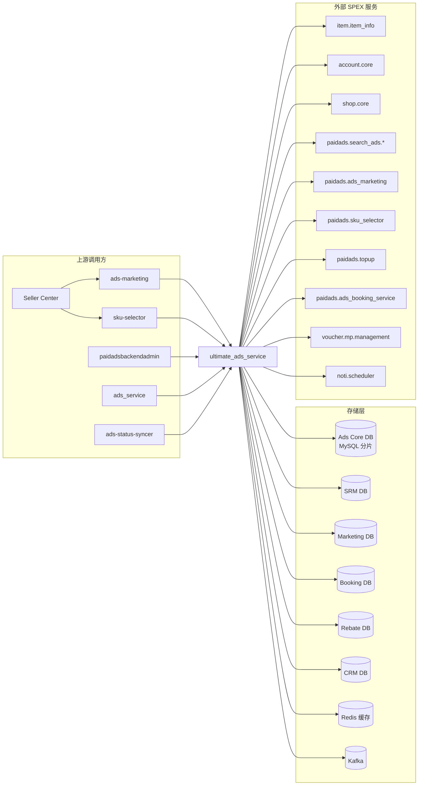

<!-- ads-workspace-gdoc-sync: gdoc_id=1S0zqcqYBCoyblxzxGHdrp4KmN6dsIrz_QkIFG-hPg7g gdoc_url=https://docs.google.com/document/d/1S0zqcqYBCoyblxzxGHdrp4KmN6dsIrz_QkIFG-hPg7g/edit -->

# Ultimate Ads Service (UAS)

> Shopee Paid Ads 统一读写入口——广告、Campaign 和账户全生命周期管理的权威数据源，覆盖所有广告类型。
>
> 仓库地址：[https://git.garena.com/shopee/deep/ultimate_ads_service](https://git.garena.com/shopee/deep/ultimate_ads_service)

---

## 目录 / Table of Contents

1. [项目概述](#项目概述)
2. [核心功能](#核心功能)
3. [项目架构](#项目架构)
   - [上下游调用拓扑](#上下游调用拓扑)
4. [目录结构](#目录结构)
5. [SPEX 与业务模块](#spex-与业务模块)
   - [接口总览](#接口总览)
   - [按广告类型的 set_* / mass_update_* 模块](#按广告类型的-set_--mass_update_-模块)
   - [查询与审计](#查询与审计)
6. [定时任务](#定时任务)
7. [开发规范](#开发规范)
   - [代码风格](#代码风格)
   - [项目结构](#项目结构)
   - [命名规范](#命名规范)
   - [错误处理](#错误处理)
   - [单元测试](#单元测试)
   - [Code Review & Git Workflow](#code-review--git-workflow)
8. [配置说明](#配置说明)
   - [配置文件](#配置文件)
   - [SPEX 与 spcli 配置](#spex-与-spcli-配置)
9. [部署](#部署)
   - [生产构建](#生产构建)
   - [发布流程](#发布流程)
10. [监控](#监控)
11. [业务术语表](#业务术语表)
    - [核心指标](#核心指标)
    - [广告类型](#广告类型)
    - [位置入口](#位置入口)
    - [卖家与广告主](#卖家与广告主)
    - [竞价定价](#竞价定价)
    - [预测模型](#预测模型)
    - [系统特性与服务](#系统特性与服务)
    - [广告供给与展示](#广告供给与展示)
    - [管控与过滤](#管控与过滤)
    - [外部服务与系统](#外部服务与系统)
    - [技术术语](#技术术语)
12. [参考资料](#参考资料)
13. [常见问题](#常见问题)

---

## 项目概述

**Ultimate Ads Service (UAS)** 是 Shopee Paid Ads 的核心读写网关，也是所有广告类型（搜索商品广告、店铺广告、直播广告、视频广告、品牌考虑广告 Brand Consideration Ads、搜索品牌广告 Search Brand Ads、产品 GMS 广告等）的广告数据、Campaign 和账户状态变更的**权威数据源**。

调用方包括 Seller Center（通过 `ads-marketing` 和 `sku-selector`）、`paidadsbackendadmin`、`ads_service` 以及其他内部平台服务。UAS 通过 `ads-db-lib` 将所有状态持久化到 Ads DB，并向 Kafka 发布变更事件供下游消费。

---

## 核心功能

- **统一写入网关**——针对所有广告类型提供 `SetAdvertiseBatch*` / `MassUpdate*` API，保证一致的参数校验、审计日志和去重逻辑
- **Campaign 全生命周期管理**——涵盖搜索、展示、直播、视频、品牌考虑 Brand Consideration Ads 和产品 GMS 广告的创建、更新、删除/隐藏
- **关键词管理**——带匹配类型和价格校验的关键词添加、更新及批量更新
- **账户管理**——通过 `SetAdsAccount` / `GetAdsAccount` 读写广告账户余额状态
- **目标受众分组**——受众定向分组的增删改查
- **Setup Flow 版本管理**——`GetSetupFlowVersion` / `InvalidateSetupFlowVersionCache`，用于基于 Feature Flag 的 UI 分阶段发布
- **审计与操作日志**——`GetAuditLogList`、`BatchGetAuditLogList`、`GetOperationLogList`
- **Brand Consideration Ads**——完整生命周期，包含 QC 审批和黑白名单检查
- **Search Brand Ads**——套餐管理、创意 QC、白名单扫描
- **产品 GMS 广告**——GMS 商品管理和后台 ROI-3 GMS 广告
- **Automated Ads Solution**——`SetCampaignAutoAdsSolution`，用于系统自动管理 Campaign 配置
- **Ads Voucher Package**——广告积分券套餐管理（`SetBatchAdsVoucherPackage`、`GetAdsVoucherPackage`）
- **Campaign Accelerator**——卖家报名参与时间限定的广告加速套餐（Program），自动将自动托管费率计划同步到报名期、活动期和活动后期；提供 `GetCampaignAcceleratorPackage` / `GetCampaignAcceleratorPackageUser` 只读 API
- **白名单元数据管理**——`SetWhitelistMeta` 用于创建白名单类型或变更其访问模式（手动 / 全开），写入带事务和审计日志
- **商品有效性检查**——`GetItemValidity`，供产品 GMS 广告创建流程批量查询商品资格
- **后台定时任务**——NPA 阶段转换、ROI-3 同步、Search Brand Ads 白名单检查、Brand Consideration Ads 解冻等

---

## 项目架构

UAS 采用分层架构：

```
调用方（SPEX）
    │
    ▼
Controller（internal/setup/controller.go）
    │  将每个 RPC 路由到对应的 Activity
    ▼
Activity（internal/<module>/activity.go）
    │  编排业务逻辑
    ▼
Service / WriteHelper / ReadHelper
    │  领域逻辑、校验、分布式锁
    ├── DBManager（internal/db_manager）──► ads-db-lib ──► Ads Core DB（MySQL 分片）
    ├── Cache（internal/cache）──────────► Redis
    ├── Repository（internal/repository）► SPEX 上游调用（item、account、config、keyword 等）
    ├── Kafka（internal/kafka）──────────► Kafka topics
    └── Locker（internal/locker）────────► 分布式锁（基于 Redis）
```

**关键基础设施依赖（来自 `go.mod` 和配置文件）：**

| 组件 | 库 / 服务 |
|------|-----------|
| 数据库 | `ads-db-lib` → Ads Core DB、SRM DB、Marketing DB、Rebate DB、Booking DB、CRM DB（MySQL，通过 SDDL/Hardy 分片） |
| 缓存 | `paidads-platform-lib/ads-helper` + `common/cache` + `campaign-surge-cache` → Redis |
| 配置 | `platform/config-sdk-go` + Config Center（命名空间 `ultimate-ads-service-ns`）+ `ads-config-lib` |
| 服务网格 | `paidads-platform-lib/spex/v2`（SPEX 框架） |
| 消息队列 | `deep/kafka_client` + `deep/kafka_job_client` → Kafka |
| 分布式锁 | `internal/locker` → 基于 Redis 的分布式锁 |
| 限流 | `paidads-platform-lib/rate-limit` + `internal/rate_limiter` |
| 自动充值 | `ads-topup-lib` → 本地卖家自动充值 |
| 自动预算提升 | `paidads-platform-lib/auto-budget-increase` |
| 店铺定制化缓存 | `paidads-platform-lib/shop-customisation-cache` |
| 数据服务管理器 | `paidads-platform-lib/data-service-manager` |
| 广告常量库 | `ads-constant-lib` |
| 文本处理 | `shopee-server/textproc` |
| 依赖注入 | `google/wire` |

### 上下游调用拓扑



| 方向 | 服务 | 协议 | 描述 |
|------|------|------|------|
| **上游** | ads-marketing | SPEX | Seller Center 广告管理流程 |
| **上游** | sku-selector | SPEX | SKU 选品与商品广告创建 |
| **上游** | paidadsbackendadmin | SPEX | 运营后台操作 |
| **上游** | ads_service | SPEX | 旧版广告服务委托调用 |
| **上游** | ads-status-syncer | SPEX | 状态同步任务调用 UAS 触发状态转换 |
| **下游/存储** | Ads Core DB | MySQL（ads-db-lib） | Campaign、广告、关键词、扣费流水、账户 |
| **下游/存储** | SRM DB | MySQL（ads-db-lib） | 卖家关系管理数据 |
| **下游/存储** | Kafka | Kafka | 变更事件发布 |
| **下游/存储** | Redis | Redis | 缓存与分布式锁 |
| **依赖** | item.item_info | SPEX | 商品状态与元数据校验 |
| **依赖** | account.core | SPEX | 用户/店铺账户查询 |
| **依赖** | paidads.search_ads.* | SPEX | 出价、预算分配、自动 Boost |
| **依赖** | paidads.ads_marketing | SPEX | 营销 Flag 和大促日信息 |
| **依赖** | voucher.mp.management | SPEX | ROI-3 使用的券查询 |
| **依赖** | noti.scheduler | SPEX | 通知调度 |

---

## 目录结构

```
ultimate_ads_service/
├── cmd/
│   ├── ultimate_ads_service/          # 主服务入口
│   └── ultimate_ads_service_cronjob/  # 定时任务入口
├── config/
│   ├── ultimate_ads_service.go        # 配置结构体定义
│   ├── const.go                       # Config Center 命名空间/key 常量
│   └── files/                         # 各环境 YAML 配置（test/staging/live/liveish/stable/uat）
├── deploy/
│   ├── ultimateadsservice.json        # Mesos 部署描述（服务）
│   └── ultimateadsservicecronjob.json # Mesos 部署描述（定时任务）
├── internal/
│   ├── setup/                         # Wire DI + Controller（SPEX 请求分发）
│   ├── set_ads/                       # 通用广告 Set 操作（自动/手动，商品/店铺）
│   ├── set_product_ads/               # 搜索商品广告
│   ├── set_shop_ads/                  # 店铺广告
│   ├── set_live_stream_ads/           # 直播广告
│   ├── set_video_ads/                 # 视频广告
│   ├── set_product_gms_ads/           # 产品 GMS 广告
│   ├── set_background_roi_three_gms_ads/  # 后台 ROI-3 GMS 广告
│   ├── brand_consideration_ads/       # Brand Consideration Ads
│   ├── search_brand_ads/              # Search Brand Ads
│   ├── auto_product_ads/              # 自动商品广告
│   ├── automated_ads_solution/        # Automated Ads Solution
│   ├── mass_update_*/                 # 批量更新模块（campaign、keyword、ads、item、NPB、潜力商品）
│   ├── query/                         # 只读查询 Activity（直播、视频、搜索品牌、品牌考虑）
│   ├── campaign_info_v2/              # Campaign 列表/详情查询
│   ├── ads_account/                   # 账户读写 Activity
│   ├── ads_audit_info/                # 审计日志查询
│   ├── operation_log/                 # 操作日志查询
│   ├── targetaudience/                # 目标受众分组 CRUD
│   ├── delete_hide/                   # Campaign 批量删除/隐藏
│   ├── quota_split/                   # Campaign 配额分割触发
│   ├── repository/                    # SPEX 上游仓库（account、item、config、keyword、npa 等）
│   ├── db_manager/                    # ads-db-lib 封装（DBManager 接口）
│   ├── cache/                         # Redis 缓存抽象（算法缓存、衍生数据缓存）
│   ├── locker/                        # 分布式锁（Redis）
│   ├── rate_limiter/                  # 限流帮助类
│   ├── constant/                      # 所有枚举和常量（85+ 文件，由 go-enum 生成）
│   ├── model/                         # 数据模型
│   ├── config_center/                 # Config Center 客户端封装
│   ├── kafka/                         # Kafka Producer
│   ├── storage/                       # S3/对象存储客户端
│   ├── retrier/                       # 重试帮助类
│   ├── exporter/                      # Prometheus 指标导出
│   ├── spexutil/                      # SPEX Agent/Context 工具类
│   ├── read_helper/                   # 共享读帮助类
│   ├── write_helper/                  # 共享写帮助类（校验、审计日志写入）
│   ├── ads_audit/                     # 广告审计 v2 辅助工具
│   ├── ads_voucher_package/           # Ads Voucher Package 读写
│   ├── voucher/                       # 券查询与 ROI-3 每日同步 Job（sync_job.go）
│   ├── whitelist_meta/                # 白名单元数据 CRUD（SetWhitelistMeta API）
│   ├── collections/                   # 通用集合工具类
│   ├── debug/                         # 调试接口（DebugPeekAdsList）
│   ├── subcontroller/                 # 子控制器（自动预算提升等）
│   ├── service/                       # 内部服务层（ads、data_migration、permission）
│   ├── textproc/                      # 文本处理集成（黑名单、onboarding、最低出价）
│   ├── transifyconstant/              # Transify i18n 常量
│   ├── translator/                    # 翻译管理器（封装 i18n/transify）
│   ├── utils/                         # 通用工具函数（context、encoding、error、format、number、time 等）
│   ├── upgrade_simple_roi_noti/       # 可升级 simple ROI-1 广告的批量通知触发工具
│   ├── cronjob/                       # 定时任务基础设施与一次性工具
│   │   ├── auto_escrow_fixed_program_whitelister/
│   │   ├── batch_set_escrow_fixed_program_whitelister_admin/
│   │   ├── campaign_accelerator_package_importer/
│   │   ├── campaign_accelerator_sync/
│   │   ├── job_live_stream_mcn_backfill/
│   │   ├── job_post_id_backfill/
│   │   ├── sync_ads_index_is_active/
│   │   └── whitelist_meta_importer/
│   ├── brand_consideration_unfreeze/  # BCA 解冻工具（已结束超过缓冲时间的 Campaign）
│   ├── job_npa_phase_sync/            # NPA 阶段转换 Job
│   ├── job_brand_consideration/       # Brand Consideration Ads 自动取消 Job
│   ├── job_search_brand/              # Search Brand Ads 自动取消 Job
│   ├── job_min_bid_increase/          # 最低出价提升 Job
│   ├── job_manual_mode_v2_early_sunsetter/ # Manual mode v2 提前下线 Job
│   ├── job_background_gms_importer/   # 后台 GMS 数据导入 Job
│   └── min_budget_sync/              # 最低预算同步工具
├── protobuf/go/paidads_ultimate_ads_service.pb/  # 生成的 Go Proto 绑定
├── sp_proto/paidads/ultimate_ads_service.proto   # 服务协议定义
├── scripts/                           # Shell 脚本（proto 生成、git hook）
├── tools/                             # 独立工具（数据修复、迁移）
├── sp-workspace.yml                   # SPEX workspace 配置（依赖 + 代码生成目标）
├── .spkit.yml                         # spkit 工具版本
├── Makefile                           # 构建、测试、lint、代码生成目标
└── go.mod                             # Go 模块定义（go 1.21）
```

---

## SPEX 与业务模块

UAS 是一个 SPEX 服务。所有 API 定义在 `sp_proto/paidads/ultimate_ads_service.proto` 中，通过 `internal/setup/controller.go` 进行分发。

### 接口总览

服务共暴露 **65+ SPEX 方法**，按领域分组。核心方法如下：

| 方法 | 模块 | 描述 |
|------|------|------|
| `SetAdvertiseBatchProductV2` | `set_product_ads` | 创建/更新搜索商品广告（Campaign + 广告批量） |
| `SetAdvertiseBatchShopV2` | `set_shop_ads` | 创建/更新店铺广告批量 |
| `SetAdvertiseBatchLiveStream` | `set_live_stream_ads` | 创建/更新直播广告 |
| `SetAdvertiseBatchVideo` | `set_video_ads` | 创建/更新视频广告 |
| `SetAdvertiseBatchSearchBrand` | `search_brand_ads` | 创建/更新 Search Brand Ads |
| `SetAdvertiseBatchBrandConsiderationAds` | `brand_consideration_ads` | 创建/更新 Brand Consideration Ads |
| `MassUpdateCampaignV2` | `mass_update_campaign` | 批量更新 Campaign 状态/预算 |
| `MassUpdateKeyword` | `mass_update_keyword` | 批量更新关键词 |
| `MassUpdateNewProductBoost` | `mass_update_new_product_boost` | 批量更新 NPB 状态 |
| `MassUpdateAds` | `mass_update_ads` | 批量更新广告状态/出价 |
| `MassUpdateItem` | `mass_update_item` | 批量更新 GMS 广告下的商品 |
| `MassUpdatePotentialProduct` | `mass_update_potential_product` | 批量更新潜力商品广告 |
| `MassUpdateProductGmsAds` | `set_product_gms_ads` | 批量更新产品 GMS 广告 |
| `MassUpdateProductGmsItem` | `set_product_gms_ads` | 批量更新产品 GMS 广告下的商品 |
| `GetCampaignListV2` | `campaign_info_v2` | 查询用户的 Campaign 列表 |
| `GetCampaignListV2MultipleUsers` | `campaign_info_v2` | 批量查询多用户的 Campaign 列表 |
| `BatchDeleteHide` | `delete_hide` | 软删除或隐藏 Campaign |
| `SetAdsAccount` | `ads_account` | 写入广告账户状态 |
| `GetAdsAccount` | `ads_account` | 读取广告账户状态 |
| `SetTargetAudienceGroup` | `targetaudience` | 创建/更新目标受众分组 |
| `GetTargetAudienceGroups` | `targetaudience` | 列出目标受众分组 |
| `GetSetupFlowVersion` | `controller` | 固定返回 v2（硬编码；底层模块已删除） |
| `InvalidateSetupFlowVersionCache` | `controller` | 空操作，直接返回 SUCCESS（底层模块已删除） |
| `TriggerUpdateCampaignQuotaSplitV2` | `quota_split` | 触发 Campaign 配额重新分配 |
| `GetAuditLogList` / `BatchGetAuditLogList` | `ads_audit_info` | 查询审计日志条目 |
| `GetOperationLogList` | `operation_log` | 查询操作日志条目 |
| `QueryLiveStreamCampaign` | `query` | 查询直播 Campaign 集合 |
| `QueryVideoCampaign` | `query` | 查询视频 Campaign 集合 |
| `QueryProductGmsItem` | `query` | 查询产品 GMS 商品列表 |
| `GetSearchBrandAdsList` / `GetSearchBrandAdsDetail` | `query` | 查询 Search Brand Ads |
| `GetBrandConsiderationAdsList` / `GetBrandConsiderationAdsDetail` | `query` | 查询 Brand Consideration Ads |
| `GetBrandConsiderationAdsQcHistory` | `brand_consideration_ads` | Brand Consideration Ads QC 审核历史 |
| `ApproveSearchBrandAdsCreative` | `search_brand_ads` | Search Brand 创意 QC 审批 |
| `QcBrandConsiderationCreative` | `brand_consideration_ads` | Brand Consideration 创意 QC 审批 |
| `BatchSetSearchBrandAdsPackage` | `search_brand_ads` | 管理 Search Brand 套餐库存 |
| `GetSearchBrandAdsPackageList` | `search_brand_ads` | 查询 Search Brand Ads 套餐列表 |
| `GetSearchBrandAdsPackageChangelog` | `search_brand_ads` | Search Brand Ads 套餐变更记录 |
| `GetBrandAdsKeywordList` | `search_brand_ads` | 查询品牌广告关键词列表 |
| `SetBrandGroupedKeyword` | `search_brand_ads` | 创建/更新品牌分组关键词 |
| `GetBrandKeywordChangelog` | `search_brand_ads` | 品牌关键词变更记录 |
| `SetCampaignAutoAdsSolution` | `automated_ads_solution` | 系统驱动的 Campaign 配置管理 |
| `RefreshItemBackgroundRoiThreeGms` | `set_background_roi_three_gms_ads` | 刷新 ROI-3 GMS 商品后台数据 |
| `SetBatchAdsVoucherPackage` / `GetAdsVoucherPackage` | `ads_voucher_package` | 广告积分券套餐管理 |
| `GetCampaignAcceleratorPackage` | `ads_account` | 按 ID 查询 Campaign Accelerator 套餐，支持按 FE 状态和报名期过滤 |
| `GetCampaignAcceleratorPackageUser` | `ads_account` | 查询用户已报名的 Campaign Accelerator 套餐及自动托管和产品 GMS 设置 |
| `SetWhitelistMeta` | `whitelist_meta` | 创建白名单类型或变更其访问模式（手动 / 全开）；带事务和审计日志 |
| `GetItemValidity` | `query` | 批量商品有效性检查，用于产品 GMS 广告创建资格校验 |
| `CreateRoiThreeVoucher` | `voucher` | 创建 ROI-3 券 |
| `GetShopVoucherList` / `GetItemVoucherList` | `voucher` | 按店铺或商品查询券列表 |
| `BatchSetAffectedRoiTwoUpdate` | `mass_update_campaign` | 批量更新受 ROI-2 变更影响的 Campaign |
| `CheckCampaignName` | `campaign_info_v2` | 校验 Campaign 名称唯一性 |
| `CheckUpdateAutoProductAds` | `auto_product_ads` | 检查自动商品广告是否需要更新 |
| `AddMissingAutoProductAds` | `auto_product_ads` | 补充缺失的自动商品广告条目 |
| `AddMissingItemProductGms` | `set_product_gms_ads` | 补充缺失的 GMS 商品条目 |
| `Ping` | （健康检查） | 服务存活检查 |

### 按广告类型的 set_* / mass_update_* 模块

每个 `internal/set_*` 包负责一种广告类型的写入生命周期：

| 包 | 广告类型 | 主要写入表 |
|----|---------|------------|
| `set_product_ads` | 搜索商品广告 | `advertisement_tab`、`ad_keyword_tab`、`campaign_tab` |
| `set_shop_ads` | 店铺广告 | `advertisement_tab`、`campaign_tab` |
| `set_live_stream_ads` | 直播广告 | `advertisement_tab`、`live_stream_ads_index_tab` |
| `set_video_ads` | 视频广告 | `advertisement_tab`、`video_ads_index_tab` |
| `set_product_gms_ads` | 产品 GMS 广告 | `product_ad_tab`、`product_campaign_tab`、`product_gms_item_tab` |
| `set_background_roi_three_gms_ads` | 后台 ROI-3 GMS 广告 | `background_roi_three_gms_ads_index_tab` |
| `brand_consideration_ads` | Brand Consideration Ads | `brand_consideration_ads_index_tab` |
| `search_brand_ads` | Search Brand Ads | `searchbrand_ads_index_tab`、`searchbrand_package_tab` |
| `set_ads/auto_product_ads` | 自动商品广告 | `advertisement_tab`、`campaign_tab` |
| `auto_product_ads` | 自动选品广告 | `item_ads_index_v2_tab` |
| `automated_ads_solution` | Automated Ads Solution | `campaign_tab` |

**直播广告校验说明：** `internal/set_ads/live_stream_ads/` 包含 MCN/联盟校验和纯食品主播拦截（`IsFoodOnlyStreamer`，通过 `live_streaming.gateway.batch_get_streamer_by_uid` 调用）。仅拥有食品直播权限（`streaming_perm == 2`）的主播会被拒绝创建/编辑直播广告；同时拥有 MP+食品权限（`streaming_perm == 3`）的主播可正常操作。该校验按 region 生效，当前仅在已支持的 region 开启。

### 查询与审计

- **`internal/query/`**——只读 Activity，处理 `QueryLiveStreamCampaign`、`QueryVideoCampaign`、`GetSearchBrandAdsList`、`GetSearchBrandAdsDetail`、`GetBrandConsiderationAdsList`、`GetBrandConsiderationAdsDetail`、`GetSearchBrandAdsQcHistory`
- **`internal/campaign_info_v2/`**——`GetCampaignListV2` 和 `GetCampaignListV2MultipleUsers`
- **`internal/ads_audit_info/`**——`GetAuditLogList`、`BatchGetAuditLogList`
- **`internal/operation_log/`**——`GetOperationLogList`

---

## 定时任务

定时任务二进制（`cmd/ultimate_ads_service_cronjob`）承载所有定时任务和一次性工具，每个均以命名 CLI 命令注册于 `cmd/ultimate_ads_service_cronjob/main.go`。

| 命令 | 包 | 重要程度 | 描述 |
|------|----|---------|------|
| `npa-phase-sync` | `job_npa_phase_sync` | 🟠 High | 将 New Product Ads 从学习期推进到正式投放阶段；支持限流和 dry-run 模式 |
| `roi3-daily-sync` | `voucher`（sync_job.go） | 🔴 Critical | ROI-3 券每日到期与配额补充同步；使用 `voucher.NewSyncer` |
| `brand-consideration-auto` | `job_brand_consideration` | 🟠 High | 处理 Brand Consideration Ads 的自动取消和状态变更 |
| `brand-consideration-unfreeze` | `brand_consideration_unfreeze` | 🟠 High | 解冻已结束超过缓冲时间的 BCA Campaign；支持 dry-run 和日期范围扫描 |
| `sba-whitelist-checker` | `job_search_brand` | 🟠 High | 检查并将符合条件的卖家加入 Search Brand Ads 白名单 |
| `sba-blacklist-checker` | `search_brand_ads/sba_whitelist_manager` | 🟠 High | 将不符合条件的卖家加入 Search Brand Ads 黑名单 |
| `search-brand-auto` | `job_search_brand` | 🟠 High | Search Brand Ads 的自动取消和状态变更 |
| `upgrade-simple-roi-noti` | `upgrade_simple_roi_noti` | 🟢 Low | 对可升级的 simple ROI-1 广告触发批量通知 |
| `sync-min-budget` | `min_budget_sync` | 🟡 Medium | 最低预算同步工具 |
| `ads-min-bid-increase` | `job_min_bid_increase` | 🟢 Low | 最低出价提升工具（商品广告） |
| `manual-mode-v2-early-sunsetter` | `job_manual_mode_v2_early_sunsetter` | 🟢 Low | Manual mode v2 提前下线 |
| `background-gms-importer` | `job_background_gms_importer` | 🟠 High | 后台 GMS 数据导入 |
| `auto-escrow-fixed-program-whitelister` | `cronjob/auto_escrow_fixed_program_whitelister` | 🟡 Medium | 为自动托管固定费率项目的店铺设置白名单；CSV 驱动（`--path`），支持多 region；新增参数：`--force-aas`（严格遵循 CSV 中的 `IsOverrideGMS` 值）、`--skip-existing`（跳过已有固定费率的店铺）、`--only-existing`（只处理已有固定费率的店铺）、`--parallelism`（并行 worker 数，默认 16） |
| `batch-set-escrow-fixed-program-whitelister-admin` | `cronjob/batch_set_escrow_fixed_program_whitelister_admin` | 🟡 Medium | 管理员批量设置托管固定费率项目白名单；从 admin DB 分批扫描（`--fetch-batch-size`，默认 200） |
| `campaign-accelerator-package-importer` | `cronjob/campaign_accelerator_package_importer` | 🟡 Medium | 从 CSV 导入 Campaign Accelerator 套餐；`--path` 必填（列：region、package_name、sign_up_start_time、sign_up_end_time、live_start_time、live_end_time）；支持 `--dry-run`、`--pfb`、多 region |
| `campaign-accelerator-sync` | `cronjob/campaign_accelerator_sync` | 🟡 Medium | 将 Campaign Accelerator 套餐配置同步到广告账户和 GMS Campaign；`--rate-limit`（默认 10 rps）、`--parallelism`（默认 16）、`--dry-run` |
| `whitelist-meta-importer` | `cronjob/whitelist_meta_importer` | 🟡 Medium | 从 CSV 创建白名单元数据条目；`--path` 必填（列：name、whitelist_type、display_name）；支持 `--dry-run`、`--pfb` |
| `post-id-backfill` | `cronjob/job_post_id_backfill` | 🟢 Low | 为视频广告回填 `post_id` 到 user_id 缓存 |
| `live-stream-mcn-backfill` | `cronjob/job_live_stream_mcn_backfill` | 🟢 Low | 回填直播广告 MCN 数据 |
| `sync-ads-index-is-active` | `cronjob/sync_ads_index_is_active` | 🟢 Low | 将广告索引（直播、商品广告）中的 `is_active` 字段与 Campaign 状态同步 |

所有 UAS 拥有的定时任务均在平台 CMDB 中列出：
[`shopee.mp_search_recommendation_ads.paidads.advertiser_platform.platform`](https://space.shopee.io/console/cmdb/cronjobs/tree/shopee.mp_search_recommendation_ads.paidads.advertiser_platform.platform)

---

## 开发规范

### 代码风格

- 使用 `golangci-lint`（v1.59.1）和项目 `.golangci.yml` 配置
- 提交前在本地运行 `make lint`；CI 运行 `make ci-lint`
- 运行 `make fmt` 执行 `gofmt`；`make gci` 修复 import 排序
- 最低 Go 版本：**1.21**（在 `go.mod` 和 `.spkit.yml` 中定义）

### 项目结构

遵循分层模式：**Controller → Activity → Service/Helper → DBManager / Repository / Cache**

- 所有非 Ads DB 的外部调用使用 `repository/` 层（SPEX 客户端封装）
- 所有 Ads DB 访问通过 `db_manager/`（封装 `ads-db-lib`）
- 业务逻辑放在 Activity 或 Service 层，不在 Controller 中
- 使用 `internal/constant/` 存放所有枚举（编辑 `*.go` 枚举源文件后运行 `make enum` 重新生成）
- 使用 `internal/model/` 存放跨包共享的数据类型

### 命名规范

- `*_enum.go` 文件由 `go-enum` 自动生成；编辑源 `*.go` 后运行 `make enum`
- `*_mock.go` 文件由 `mockery` 自动生成；修改接口后运行 `mockery`
- `wire_gen.go` 由 `wire` 自动生成；修改 `wire.go` 后运行 `make wire`
- SPEX Activity 文件：每个模块下的 `activity.go`
- Job 结构体：`job_*/` 中的 `Tool` 或 `Job` 类型

### 错误处理

- 错误码定义在 `sp_proto/paidads/ultimate_ads_service.proto` 的 `Constant.Error` 枚举（范围 `496000000–496100000`）
- Controller 层返回结构化的 SPEX 错误码（`uint32, error`）
- 不可吞掉错误；使用 `fmt.Errorf("...: %w", err)` 包装携带上下文
- 对瞬时 DB/缓存错误使用 `retrier`（`internal/retrier`）

### 单元测试

- 使用 `make test` 运行测试（含竞态检测和覆盖率统计）
- 接口的 Mock 文件为 `*_mock.go`，由 `mockery`（v2.43.2）生成
- 集成测试使用 `go-sqlmock` 进行 DB Mock

### Code Review & Git Workflow

- 提交信息格式：`(Feat|Fix|Docs|Style|Refactor|Test|Chore): [JIRA-ID] description`
- 分支命名：`dev/$username` 或 `feature/$feature_name`
- 通过 Merge Request 合并（squash commits，合并后删除源分支）
- CI 流水线（`.gitlab-ci.yml`）运行：`make fmt`、`make ci-lint`、`make test`、proto gen 检查
- 工具通过 `spkit` 管理——版本固定在 `.spkit.yml` 中；使用 `spkit run <tool>` 而非直接调用

---

## 配置说明

### 配置文件

配置文件位于 `config/files/`：

| 文件 | 环境 |
|------|------|
| `test.yml` | 本地开发 / 单元测试 |
| `staging.yml` | Staging 环境 |
| `uat.yml` | UAT 环境 |
| `live.yml` | 生产（live）环境 |
| `liveish.yml` | Liveish（金丝雀）环境 |
| `stable.yml` | Stable 环境 |

配置结构体为 `UltimateAdsServiceConfig`（`config/ultimate_ads_service.go`）。关键配置节：

| 配置 key | 用途 |
|----------|------|
| `spex` | SPEX 服务器 socket 和连接配置 |
| `ads-db-lib` | 数据库分片配置 |
| `config-center` | Config Center 命名空间和 secret |
| `cache` / `ads-cache` / `derived-data-cache` / `algo-gms-cache` | Redis 缓存配置 |
| `locker` | 分布式锁 Redis 配置 |
| `rate-limiter` / `campaign-rate-limiter` | 限流阈值 |
| `user-shop-cache` / `shop-customisation-cache` | 平台缓存配置 |
| `storage` / `storage-backend-admin` | S3/对象存储配置 |
| `textproc` | 文本处理服务配置 |
| `auto-topup`（Config Center key：`auto_escrow`） | 自动托管固定费率配置：`force_ask_consent`（强制用户授权）、`block_override_auto_ads_solution`（禁止覆盖 AAS）、`additional_fee_rate`（各 region 附加费率） |

Config Center 使用命名空间别名 `ultimate-ads-service-ns`，group `paid_ads`，project `paid_ads_platform`。

**Feature downgrade 降级开关**（Config Center key：`feature_downgrade_config`）包含 `disable_is_active_index_for_read`、`disable_is_active_index_for_write` 和 `blocked_ads_audit_event_list`，可在不重启服务的情况下按 country 紧急关闭特定写操作或索引读写。

### SPEX 与 spcli 配置

> **快速上手：** `make env` 可一键完成全量配置（平台环境脚本 + proto 依赖拉取 + 翻译文件下载）。克隆仓库后执行一次即可。

1. **安装 spkit 工具**（通过 `.spkit.yml` 自动管理）：
   - `spcli` v1.3.21、`spex-generator`（ads-platform-spex-generator v2.10.0）、`go-enum` v0.6.0、`wire` v0.5.0、`golangci-lint` v1.59.1、`mockery` v2.43.2、`i18n-kit` v0.9.0

2. **配置本地 SPEX socket：**
   ```bash
   export SP_UNIX_SOCKET=/tmp/spex.sock
   ```
   完整说明参见 [Configure local spex socket](https://confluence.shopee.io/x/54xKAw)。

3. **拉取 proto 依赖：**
   ```bash
   make proto-ensure-dep-only   # 仅拉取依赖 proto（不重新生成）
   make proto-compile           # 完整 proto 重新生成（需要 spex-generator + spcli）
   ```

4. **生成枚举、依赖注入和翻译文件：**
   ```bash
   make enum          # 重新生成 *_enum.go 文件
   make wire          # 重新生成 wire_gen.go
   make translation   # 下载 transify 翻译（项目 ID 175）
   # 或直接执行：./i18n_kit download transify_manager --projectID 175 --env test
   ```

> **注意：** spcli bug（[SPPE-2787](https://jira.shopee.io/browse/SPPE-2787)）可能导致生成文件所有者变为 root。若发生此情况，手动 `chown` 修复权限。

---

## 部署

### 生产构建

```bash
# 下载 Go 模块依赖
make dep-download

# 仅拉取 proto 依赖
make proto-ensure-dep-only

# 构建主服务二进制
make ultimate_ads_service
# 输出：bin/paidads_ultimate_ads_service_server（本地）+ bin/paidads_ultimate_ads_service_server.linux（交叉编译）

# 构建定时任务二进制
make ultimate_ads_service_cronjob

# 构建特定工具
make build-tool TOOL=<tool_name>
```

### 本地运行

```bash
make start
# 等价于：
# export SP_UNIX_SOCKET=/tmp/spex.sock
# ./bin/paidads_ultimate_ads_service_server -c config/files/test.yml
```

运行工具：
```bash
make run-tool T=test_db
# 使用：env=test, cid=sg, config=config/files/test.yml
```

### 发布流程

发布通过 Ads Platform 发布流水线管理（`.gitlab-ci.yml` 引入了 `paidads-platform-lib` 中的 `pipeline-script/release.yml`）。CI 流水线阶段：

1. **autotest**——`make ci-lint`、`make test`
2. **check**——changelog 和 TODO 检查
3. **changelog**——自动生成 CHANGELOG
4. **release**——发布产物（Mesos 部署描述在 `deploy/`）

通过 Shopee Mesos 部署，使用 `deploy/` 下的描述文件：
- `ultimateadsservice.json`——主服务
- `ultimateadsservicecronjob.json`——定时任务服务

proto 变更后发布协议主题：
```bash
make proto-publish TOPIC=<your_topic_name>
```

---

## 监控

- **UAS Grafana 大盘**：[Ultimate Ads Service (UAS)](https://monitoring.infra.sz.shopee.io/grafana/d/tdUYd8DSk/ultimate-ads-service-uas)
- **Advertiser Platform 文件夹**：[advertiser-platform 监控大盘合集](https://monitoring.infra.sz.shopee.io/grafana/dashboards/f/advertiser-platform/advertiser-platform)
- **Ads DB 监控**：[Region Live Ads DB](https://monitoring.infra.sz.shopee.io/grafana/d/4RB9tsfIz/region-live-ads-db?orgId=39)
- **DB 调用方 Explore**（通过 Prometheus 查看所有 DB 调用方）：
  ```
  sum(rate(paidads_ads_db_manager_count{queryName!~"(Get|Put)AdsClient"}[1m])) by (caller)
  ```
- **计费 Lag 监控**：[TDR Overview Dashboard](https://monitoring.infra.sz.shopee.io/grafana/d/YMWPK-Q7z/tdr-overview-dashboard)
- **Kafka Lag 监控**：[Kafka Exporter Dashboard](https://monitoring.infra.sz.shopee.io/grafana/d/tMpwXZvMz/kafka-exporter-dashboard)（topic：`paidads-bigshop-deduct-event-id-live`）
- **DB SDDL 控制面板**：[Space SDDL Listing](https://space.shopee.io/mts/sddl/shopee/database-listing?env=live&name=ultimate_shard_db)

关键告警项：
- UAS SPEX 错误率和 P99 延迟
- Ads DB 查询延迟和连接池耗尽
- 下游扣费事件 Kafka 消费者积压（consumer lag）
- ROI-3 券同步任务失败率

---

## 业务术语表

### 核心指标

| 术语 | 全称 | 定义 |
|------|------|------|
| CTR | Click-Through Rate | 点击数 / 展示数 |
| CR | Conversion Rate | 广告订单 / 点击数 |
| CPC | Cost Per Click | 花费 / 点击数 |
| CPM | Cost Per Mille | 每 1,000 次展示的费用 |
| eCPM | Effective CPM | 总花费 / 总展示数 |
| ROI | Return on Investment | 广告 GMV / 广告花费 |
| ROAS | Return on Ad Spend | ROI 的同义词 |
| CIR | Cost-Income Ratio | 广告收入 / 广告 GMV |
| Ads GMV | 广告 GMV | 广告点击后 7 天内产生的总销售额 |
| Take-Rate | 变现率 | 广告收入 / 平台 GMV |
| Rank Score | 排名分 | eCPM + 质量因子 |
| Advv | Advertiser Value（广告主价值） | 平台长期收入增长的衡量指标 |

### 广告类型

| 术语 | 描述 |
|------|------|
| 搜索商品广告 | 出现在搜索结果中的关键词出价商品广告 |
| 店铺广告 | 店铺整体在搜索/发现频道中的广告 |
| 直播广告 | 关联直播场次的广告 |
| 视频广告 | 短视频广告 |
| Brand Consideration Ads（品牌考虑广告） | 品牌层面的展示广告，用于认知和考虑阶段 |
| Search Brand Ads（搜索品牌广告） | 高价值品牌专属搜索位，带定制化创意 |
| 产品 GMS 广告 | 与 GMS（Gross Merchandise Sales）合同挂钩的商品广告 |
| 后台 ROI-3 GMS 广告 | 系统自动管理的 ROI-3 GMS 广告 |
| 自动商品广告 | 系统自动创建的商品广告 |
| TADS / DADS | 定向广告 / 发现广告——基于受众的展示广告 |
| 展示广告（Display Ads） | CPM 计费的品牌展示广告 |
| NPA | New Product Ads——新品广告，具有生命周期阶段 |
| NPB | New Product Boost——新品推广加速 |
| oCPC / Simple Mode | 优化 CPC / 简单模式——系统自动为卖家选词 |
| OCPC CIR | OCPC 自动出价的成本收入比配置 |
| QSS | QuickStart Service——帮助新广告主快速开始投放 |

### 位置入口

| 术语 | 描述 |
|------|------|
| 搜索 | 搜索结果位置（placement=4） |
| 发现/推荐 | 推荐频道位置（placement=40） |
| 店铺 | 店铺页面位置（placement=3） |
| 展示 | 品牌展示广告位（CPM 计费） |
| PDP | Product Detail Page（商品详情页） |
| YMAL | You May Also Like（猜你喜欢）——发现广告功能 |
| DD | Daily Discovery（每日发现）频道 |

### 卖家与广告主

| 术语 | 描述 |
|------|------|
| Active Seller | 开通广告账户且仍在活跃投放的卖家 |
| PS | Preferred Sellers（优选卖家） |
| OS | Official Shops（官方店铺） |
| SC | Seller Center——卖家管理广告的平台 |
| CB Sellers | 跨境卖家，需人工充值 |
| MCN | Multi-Channel Network——管理 KOL/网红店铺的机构 |
| SRM | Seller Relationship Management——卖家关系管理（分群/计划体系） |
| SCS | Shopee Consignment Service（Shopee 全托管）——面向全托管卖家 |
| SIP | Shopee International Platform（Shopee 国际平台） |

### 竞价定价

| 术语 | 描述 |
|------|------|
| uGSP | Uniform Generalized Second Price——Shopee 广告拍卖机制 |
| eCPM | 用于排名和计费的有效每千次展示费用 |
| 广泛匹配（Broad Match） | 搜索词包含关键词时触发广告 |
| 精确匹配（Exact Match） | 搜索词完全等于关键词时触发广告 |
| Target ROI | 卖家设定的 ROI 目标（ROI-3 自动出价） |
| ROI-3 | 第三代 ROI 目标出价——通过券和动态出价调整实现 |
| PID Controller | 比例-积分-微分控制器——在 Simple Mode 中动态调整出价 |
| 最低出价 / 最低预算 | 平台强制执行的最低出价价格 / 每日预算下限 |
| 自动预算提升 | 自动每日预算提升功能 |
| CPS | Cost Per Sale（按销售计费）模式 |
| Display Rate | 有展示的广告数 / 活跃广告数 |
| Fill-up Rate | 实际展示数 / 指定广告位的潜在展示数 |

### 预测模型

| 术语 | 描述 |
|------|------|
| pCTR | 预测点击率 |
| pCR | 预测转化率 |
| rcgbdt | RC Gradient Boost Decision Trees——pCTR 预测模型 |
| 冷启动（Cold Start） | 历史数据不足、难以准确预测的新广告 |
| Intention（意图） | 基于买家行为预测其主要使用目的的模型 |
| CF | Collaborative Filtering（协同过滤） |
| VGS | Values Grid Search——用于自动调整算法参数的系统 |

### 系统特性与服务

| 术语 | 描述 |
|------|------|
| UAS | Ultimate Ads Service——本服务 |
| adsdblib | `ads-db-lib`——所有广告平台服务共享的 DB 客户端库 |
| SPEX | Shopee 内部 RPC 框架（服务网格） |
| spcli | SPEX CLI 工具，用于 proto 管理 |
| DAG | 有向无环图——用于特征处理流水线 |
| GAS | Go Application Server——Shopee 的 Go 服务框架 |
| Campaign Day | 大促日，带特殊预算配置 |
| Setup Flow | UI 引导版本，控制向卖家展示哪个广告创建流程 |
| mass_update | UAS 中的批量更新操作（Campaign、关键词、广告、商品） |
| Quota Split | 将 Campaign 每日预算分配到各时间段 |
| 自动充值（Auto Top-up） | 余额低于阈值时为本地卖家自动充值 |
| SVS Top-up | 跨境卖家通过 Seller Value Service 充值广告积分 |
| Brand Max | 高级品牌广告位，支持库存预定 |

### 广告供给与展示

| 术语 | 描述 |
|------|------|
| 广告索引（Ads Index） | 反向查找表（商品→广告、店铺→广告等），供召回系统使用 |
| 创意（Creative） | 品牌广告的视觉/媒体素材（图片、视频、落地页） |
| QC Status | 广告创意的质量审核状态 |
| Traffic Rate | 某类广告展示数 / 所有渠道总展示数 |
| Ad Booking | 预定特定日期范围内的品牌展示广告位 |
| Slot Inventory | Brand Max 可预定的预测展示量库存 |

### 管控与过滤

| 术语 | 描述 |
|------|------|
| 黑名单（Blacklist） | 阻止广告展示的商品/关键词黑名单 |
| 白名单（Whitelist） | 卖家功能访问白名单（如 Target ROI、受众定向） |
| Badcase | 运营 DB 中管理的广告质量问题标记 |
| 买家分群（Buyer Segmentation） | 对买家打行为/人口标签，用于广告定向 |
| 欺诈用户（Fraud User） | 被标记为欺诈行为的用户 |
| 保留关键词（Reserved Keyword） | 为品牌保留的关键词，不可用于普通关键词竞价 |

### 外部服务与系统

| 术语 | 描述 |
|------|------|
| Config Center | Shopee 集中式动态配置服务 |
| SDDL / Hardy | Shopee DB Definition Language / 分片中间件 |
| Transify | Shopee 翻译管理系统（UAS 项目 ID 175） |
| Kafka | 广告变更事件发布的消息总线 |
| DataSuite / Hive | 返利和 ROI 任务使用的数据仓库 |
| SRM | Seller Relationship Management（也指 `uber-srm` 服务） |
| CRM | Customer Relationship Management 后台（`ads-crm` 服务） |

### 技术术语

| 术语 | 描述 |
|------|------|
| Wire | Google 的依赖注入代码生成器 |
| go-enum | 枚举代码生成器（`spkit run go-enum`） |
| mockery | 接口 Mock 生成器（`spkit run mockery`） |
| spkit | Shopee 工具版本管理器（在 `.spkit.yml` 中固定工具版本） |
| Mesos | Shopee 的容器编排系统 |
| SMC | Shopee Mesos Container——管理 Mesos 部署的 CLI |
| HDFS R2 | 用于 ML 训练数据的 Hadoop 分布式文件系统 |

---

## 参考资料

| 资源 | 链接 |
|------|------|
| 仓库地址 | [git.garena.com/shopee/deep/ultimate_ads_service](https://git.garena.com/shopee/deep/ultimate_ads_service) |
| Advertiser Platform 架构总览 | [Confluence: Advertiser Platform](https://confluence.shopee.io/display/SPAD/Advertiser+Platform) |
| Paid Ads 业务术语表 | [Confluence: Paid Ads Glossary](https://confluence.shopee.io/pages/viewpage.action?spaceKey=SPAD&title=Paid+Ads+Glossary) |
| UAS Grafana 大盘 | [Ultimate Ads Service (UAS)](https://monitoring.infra.sz.shopee.io/grafana/d/tdUYd8DSk/ultimate-ads-service-uas) |
| Advertiser Platform Grafana 文件夹 | [advertiser-platform 大盘合集](https://monitoring.infra.sz.shopee.io/grafana/dashboards/f/advertiser-platform/advertiser-platform) |
| Ads DB 监控 | [Region Live Ads DB](https://monitoring.infra.sz.shopee.io/grafana/d/4RB9tsfIz/region-live-ads-db?orgId=39) |
| 定时任务 CMDB | [CMDB Cronjob Tree](https://space.shopee.io/console/cmdb/cronjobs/tree/shopee.mp_search_recommendation_ads.paidads.advertiser_platform.platform) |
| 平台 BE 定时任务梳理 | [Platform BE Cronjob 梳理（Google Doc）](https://docs.google.com/document/d/1Z6VYs8vyJ-D914cU8wDBltrE6ItZ2TrhoZiXOSPkXmM/) |
| ads-db-lib | [git.garena.com/shopee/deep/ads-db-lib](https://git.garena.com/shopee/deep/ads-db-lib) |
| paidads-platform-lib | [git.garena.com/shopee/deep/paidads-platform-lib](https://git.garena.com/shopee/deep/paidads-platform-lib) |
| SPEX 快速上手 | [SPEX Go SDK Quick Start](https://spex.shopee.io/overview/quick-start/languages/go/index.html) |
| spcli 本地配置 | [SPEX spcli 本地配置](https://confluence.shopee.io/x/54xKAw) |
| SDDL 文档 | [gdbc.shopee.io/sddl/intro](https://gdbc.shopee.io/sddl/intro) |
| DB SDDL 控制面板 | [Space SDDL Listing (ultimate_shard_db)](https://space.shopee.io/mts/sddl/shopee/database-listing?env=live&name=ultimate_shard_db) |
| Transify i18n_kit 使用指南 | [Confluence: i18n_kit Usage Guide](https://confluence.shopee.io/display/MTS/%5BUsage+Guide%5D+i18n_kit) |

---

## 常见问题

**Q1：UAS 在广告平台中的角色是什么？谁来调用它？**
UAS 是所有广告数据的权威读写网关。调用方包括 `ads-marketing`、`sku-selector`、`paidadsbackendadmin`、`ads_service` 和 `ads-status-syncer`。它通过 `ads-db-lib` 将状态持久化到 Ads DB，并发布 Kafka 变更事件。

**Q2：如何在本地运行服务？**
```bash
export SP_UNIX_SOCKET=/tmp/spex.sock
make proto-ensure-dep-only
make ultimate_ads_service
./bin/paidads_ultimate_ads_service_server -c config/files/test.yml
# 或者直接运行：make start
```
前提条件：Go 1.21 工具链、SPEX 本地 socket 配置完成、transify 翻译文件已下载。

**Q3：如何新增一个 SPEX API？**
1. 在 `sp_proto/paidads/ultimate_ads_service.proto` 中定义请求/响应 message 和方法
2. 运行 `make proto-compile` 重新生成 Go 绑定
3. 在对应 `internal/<module>/activity.go` 中实现 Activity
4. 在 `internal/setup/controller.go` 中添加分发方法
5. 在 `internal/setup/wire.go` 中完成 Wire 注入，并运行 `make wire`

**Q4：如何在修改接口后重新生成枚举、wire 或 mock 文件？**
```bash
make enum      # 编辑 internal/constant/ 下的枚举源文件后
make wire      # 编辑 wire.go 后
# Mock 文件：修改接口后手动运行 mockery
spkit run mockery --name=<InterfaceName> --dir=<package_dir> --output=<package_dir>
```

**Q5：`ads-db-lib` 是什么？为何如此关键？**
`ads-db-lib` 是所有广告平台服务共享的 MySQL 分片客户端库。它封装了 DB 分片逻辑（按 userid、campaignid、日期等分片）和基于 Config Center 的分片路由。UAS 在 `internal/db_manager/` 中对其进行封装。**请勿直接访问广告 DB 表**——始终通过 `db_manager`。

**Q6：为什么 NPA Phase Transition Job 很重要？**
该任务驱动 New Product Ads 从学习期到正式投放阶段的生命周期推进。任务失败会阻塞新上架商品的 NPB 广告投放。它使用了限流器和 dry-run 标志——生产运行前务必确认这些参数正确。

**Q7：ROI-3（roi3-daily-sync）是如何工作的？**
ROI-3 通过券（voucher）实现 Target ROI 出价。`roi3-daily-sync` 命令由 `internal/voucher/sync_job.go` 中的 `voucher.NewSyncer` 实现，负责处理券的每日到期和配额补充。该任务为 🔴 Critical——任务失败会导致卖家无法享受 Target ROI 自动出价。

**Q8：`SetAdvertiseBatchProductV2` 的调用链路是什么？**
`Controller.SetAdvertiseBatchProductV2` → `setproductads.Activity.SetAdvertiseBatchProductV2` → 服务层校验（通过 `repository/` 调用 item 状态、价格、关键词检查）→ `dbmanager` 写入 `campaign_tab`、`advertisement_tab`、`ad_keyword_tab` → 写入审计日志 → 发布 Kafka 事件。

**Q9：Config Center 在运行时如何使用？**
服务启动时，`config/ultimate_ads_service.go` 使用命名空间 `ultimate-ads-service-ns`、group `paid_ads`、project `paid_ads_platform` 以及 YAML 文件中的 secret 订阅 Config Center。动态配置（限流规则、Feature Flag）通过 `service-config` 包加载，无需重启服务。

**Q10：mass_update 操作大规模失败时应检查哪些方面？**
检查：(1) UAS SPEX 错误率和 P99 延迟（Grafana 大盘）；(2) 限流器指标（配置中的 `campaign-rate-limiter`、`rate-limiter`）；(3) Ads DB 连接池和查询延迟；(4) Campaign 级别的分布式锁（`internal/locker`）是否存在竞争。

<!-- Generated by ads-workspace/skills/ads-readme-generate | checked: 52a2ffec61fd5bc1d61cfb4e712e27a83c29ceb4 | spec: 76fce5f679f9550b -->
