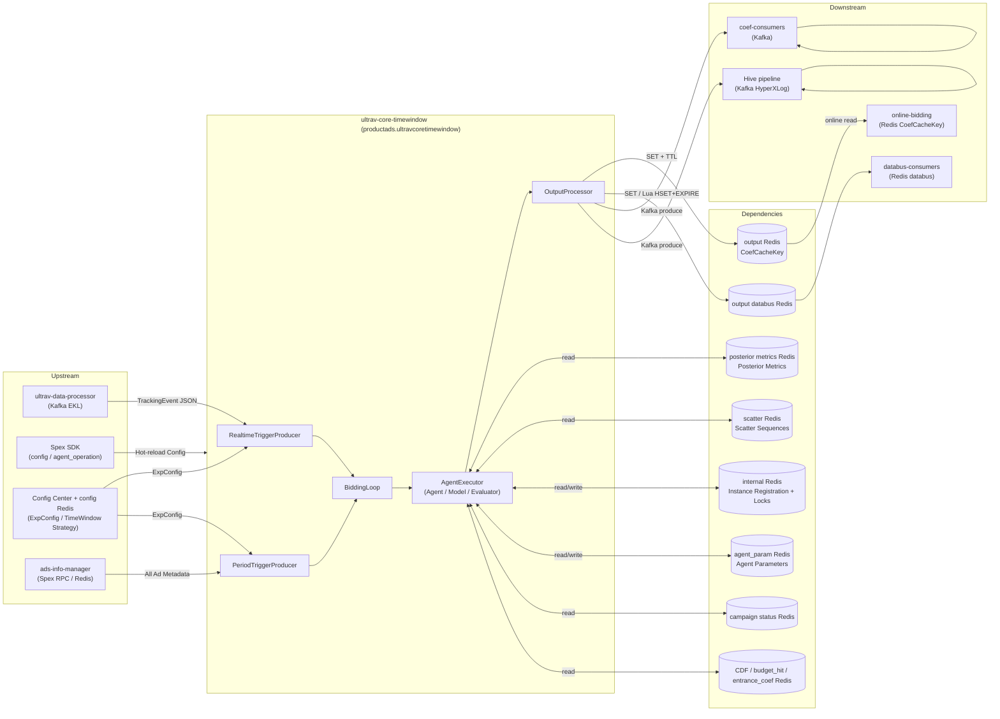

<!-- ads-workspace-gdoc-sync: gdoc_id=1RSCaBmhL7RpasH7WHOumj4ix05U0lFm0lSrjhh1LFDs gdoc_url=https://docs.google.com/document/d/1RSCaBmhL7RpasH7WHOumj4ix05U0lFm0lSrjhh1LFDs/edit -->

# ultrav-core-timewindow

Repository: https://git.garena.com/shopee/deep/paidads-bidding/ultrav-core-timewindow

---

## Table of Contents

- [Introduction](#introduction)
- [Features](#features)
- [Architecture](#architecture)
  - [System Context](#system-context)
  - [Service Topology](#service-topology)
  - [Data Flow](#data-flow)
- [Directory Structure](#directory-structure)
- [Deployment Modes](#deployment-modes)
  - [Product Ads Deployment](#product-ads-deployment)
  - [Other Verticals (Makefile Only)](#other-verticals-makefile-only)
- [Core Pipeline](#core-pipeline)
  - [Realtime Trigger Path](#realtime-trigger-path)
  - [Period Trigger Path](#period-trigger-path)
  - [BiddingLoop Main Loop](#biddingloop-main-loop)
  - [AgentExecutor Pipeline](#agentexecutor-pipeline)
  - [Output Processing](#output-processing)
- [Time Window Mechanism](#time-window-mechanism)
  - [Realtime Trigger Intervals](#realtime-trigger-intervals)
  - [Posterior Metric Time Levels](#posterior-metric-time-levels)
  - [Event Marking and Flushing](#event-marking-and-flushing)
- [Strategy Modules](#strategy-modules)
  - [Agent Architecture](#agent-architecture)
  - [Product Ads GMV Max Strategy](#product-ads-gmv-max-strategy)
- [Configuration](#configuration)
  - [Static Config (Spex config)](#static-config-spex-config)
  - [Agent Operation Config (Spex agent_operation)](#agent-operation-config-spex-agent_operation)
  - [Experiment Config (Config Center + Redis)](#experiment-config-config-center--redis)
- [Redis Interaction](#redis-interaction)
  - [Posterior Metrics Read](#posterior-metrics-read)
  - [Coefficient Output Write](#coefficient-output-write)
  - [Internal Framework Coordination](#internal-framework-coordination)
  - [Trigger Deduplication](#trigger-deduplication)
- [Development Guidelines](#development-guidelines)
  - [Code Style](#code-style)
  - [How to Add a New Agent](#how-to-add-a-new-agent)
  - [How to Add a New Model](#how-to-add-a-new-model)
  - [How to Add a New Evaluator](#how-to-add-a-new-evaluator)
  - [Project Structure](#project-structure)
  - [Naming Conventions](#naming-conventions)
  - [Error Handling](#error-handling)
  - [Unit Testing Standards](#unit-testing-standards)
  - [Code Review & Git Workflow](#code-review--git-workflow)
- [Deployment](#deployment)
  - [Build for Production](#build-for-production)
  - [Release Process](#release-process)
  - [Docker Local Development](#docker-local-development)
- [Monitoring](#monitoring)
- [Business Terminology Glossary](#business-terminology-glossary)
- [Additional Resources](#additional-resources)
- [Frequently Asked Questions](#frequently-asked-questions)

---

## Introduction

`ultrav-core-timewindow` is the **time-window strategy execution service** for the Shopee Paid Ads bidding system. It consumes tracking events from Kafka, buffers and aggregates them per configurable time windows (60s / 120s / 180s), triggers strategy execution, and writes the computed bid coefficients to Redis / Kafka / Hive.

**Core data flow:**

```
Kafka TrackingEvent (from ultrav-data-processor)
  ↓ RealtimeTriggerProducer (buffer per time window)
  ↓ BiddingLoop (concurrency control)
  ↓ AgentExecutor (read posterior metrics + run Agent/Model/Evaluator strategies)
  ↓ OutputProcessor
  ├── output Redis (CoefCacheKey, FlatBuffers serialized)
  ├── output Kafka (coefficient change events)
  ├── Hive Kafka (HyperXLog protobuf offline logs)
  └── output databus Redis (aggregated coefficients)
```

The service also runs a **PeriodTriggerProducer** in parallel, which scans all active ads at fixed intervals to ensure periodic coefficient updates even for low-traffic ads.

**Codebase scope:**
- The codebase contains only the **Product Ads** vertical as a complete implementation (`cmd/product_ad_cmd/`).
- `Makefile` defines `build_shop_ads_svc`, `build_live_ads_svc`, `build_brand_max_svc`, and `build_video_ads_svc` targets, but the corresponding `cmd/` directories **do not exist in this repository**.
- Upstream/downstream: reads posterior metrics Redis written by `ultrav-data-aggregator`; outputs coefficients consumed by `online-bidding` / `ultrav-core`.

---

## Features

- **Dual-trigger architecture**: Realtime trigger (event-driven) + Period trigger (full ad scan) run in parallel and independently
- **Configurable time windows**: 3 dimensions (60s / 120s / 180s); each ExpConfig independently configures its trigger interval
- **Experiment matching**: Events are precisely filtered against ExpConfig by group_keys, abtest bucket, and time window
- **Agent/Model/Evaluator three-layer plugin architecture**: Strategy modules are decoupled from the framework via registration; independently extensible
- **Multi-target output**: Coefficients written simultaneously to output Redis (CoefCacheKey), output Kafka, Hive Kafka, and databus Redis
- **Trigger deduplication**: Redis SETNX + BigCache local cache dual-layer deduplication prevents duplicate computation for the same ad within the same window
- **Distributed instance coordination**: Period trigger shards by `adId % instanceLen`; Redis ZADD/HSET registers instances; Redis SETNX locks prevent duplicate processing
- **Hot-reload configuration**: Spex SDK supports hot updates to `config` and `agent_operation` keys without restart
- **Prometheus monitoring**: Three metric families (`paidads_ultrav_core_timewindow_*`, `paidads_ultrav_core_exp_*`, `paidads_ultrav_core_coef_*`)
- **Verifier offline validation**: `cmd/product_ad_verifier_cmd` loads ExpTrigger from JSON files for offline strategy verification

---

## Architecture

### System Context

`ultrav-core-timewindow` is middleware in the Shopee Paid Ads bidding chain, positioned between data aggregation (`ultrav-data-aggregator`) and online bidding (`online-bidding`). It transforms posterior metrics and ad metadata into bid coefficients distributed via multiple output channels.

Spex service name: `productads.ultravcoretimewindow` (see `cmd/constant.go`). Spex is used solely for configuration management (`config` and `agent_operation` keys); the service **does not register any RPC handlers**.

### Service Topology



**Topology Table:**

| Category | Name | Protocol | Description |
|----------|------|----------|-------------|
| **Upstream** | ultrav-data-processor | Kafka (EKL) | Tracking event stream, TrackingEvent JSON |
| **Upstream** | Spex | Spex SDK | config / agent_operation two-layer config, hot-reloaded |
| **Upstream** | Config Center + config Redis | Config Center SDK / Redis | ExpConfig and time window strategy parameters |
| **Upstream** | ads-info-manager | Spex RPC / Redis | Full ad metadata (AdInfoLoaderV2) |
| **Downstream** | online-bidding | Redis (CoefCacheKey) | Reads FlatBuffers coefficients from output Redis |
| **Downstream** | coef-consumers | Kafka | Coefficient change events |
| **Downstream** | Hive pipeline | Kafka | HyperXLog protobuf offline analysis logs |
| **Downstream** | databus-consumers | Redis (databus) | Aggregated coefficient data |
| **Dependency** | posterior metrics Redis | Redis GET | Posterior metrics (COUNT/SCALAR, multiple time levels) |
| **Dependency** | scatter Redis | Redis GET | TimeSlot2X protobuf scatter sequences |
| **Dependency** | output Redis | Redis SET+TTL | CoefCacheKey FlatBuffers coefficients write |
| **Dependency** | internal Redis | Redis ZADD/HSET/SETNX | Instance registration, Period ad locks |
| **Dependency** | agent_param Redis | Redis GET/SET | Agent parameter persistence |
| **Dependency** | campaign status Redis | Redis HGET | Campaign status (budget, date) |
| **Dependency** | CDF / budget_hit / entrance_coef Redis | Redis GET | Time distribution, budget hit, entrance coefficients |
| **Dependency** | output databus Redis | Redis SET / Lua HSET+EXPIRE | Aggregated databus data |

#### Middleware Instance Details

The service initializes Spex as `productads.ultravcoretimewindow` and reads Config Center namespace `[sp]productads / ultravcoretimewindow`, item `config` plus `agent_operation`.

| Type | Direction | Concrete Instance | Purpose | Evidence |
|---|---|---|---|---|
| Kafka | Consume | `framework_config.tracking_event_kafka`; brokers `di-kafka-stt01-bg1-bootstrap01/02/03-stt-sg.data-infra.shopee.io:9093`, `di-kafka-da01-bg1-bootstrap01/02/03-dallas-us.data-infra.shopee.io:9093`; topics `bidding_tracking_event_id`, `bidding_tracking_event_my`, `bidding_tracking_event_sg`, `bidding_tracking_event_th`, `bidding_tracking_event_ph`, `bidding_tracking_event_vn`, `bidding_tracking_event_tw`, `mkplpaidads_discovery_ads.hyperx_tracking_event_us`; groups `ultrav_core_timewindow_id`, `ultrav_core_timewindow_global`, `ultrav_core_timewindow_ph`, `ultrav_core_timewindow_vn`, `paidads_mkplpaidads_hyperx_ultrav_core_timewindow_us` | Time-window realtime tracking input | `cmd/constant.go`, `cmd/product_ad_cmd/main.go`, `config/core.go` |
| Kafka | Produce | `framework_config.output_kafka_producer`; broker `kafka.kafka_paidads_searchads_drt_live.ap-sg-1-general-c.live.mq.shopee.io:9092` topics `product_ads_coef-id-live`, `product_ads_coef-global-live`, `product_ads_coef-tw-live`; US/BR broker `kafka.kafka_latam_fe_us.na-us-2-general-a.live.mq.shopee.io:9092` topic `product_ads_coef-global-live`; groups `mp_search_recommendation_ads-paidads-456ef8`, `mp_search_recommendation_ads-paidads-77dc4d` | Coefficient change output | `pkg/data/output_kafka_producer`, `pkg/framework/output_processor.go` |
| Kafka | Produce | `framework_config.hive_log_producer`; brokers `di-kafka-at01-bg1-bootstrap01/02/03-airtrunk-sg.data-infra.shopee.io:9093`, `di-kafka-da01-bg1-bootstrap01/02/03-dallas-us.data-infra.shopee.io:9093`; topics `mkplpaidads_discovery_ads.hyperx_exp_log`, `mkplpaidads_discovery_ads.hyperx_exp_log_us`; groups `paidads_mkplpaidads_hyperx_ultrav_core_timewindow_id`, `paidads_mkplpaidads_hyperx_ultrav_core_timewindow_global`, `paidads_mkplpaidads_hyperx_ultrav_core_timewindow_vn`, `paidads_mkplpaidads_hyperx_ultrav_core_timewindow_us` | Offline HyperX log output | `pkg/data/output_hive_kafka_producer` |
| Redis | ReadWrite | Internal / agent-param Redis domains `vkedn.elasticredis.cloud.shopee.io:10719`, `wip9w.elasticredis.cloud.shopee.io:10397`, `qv8w1.elasticredis.cloud.shopee.io:10740`, `dlcby.elasticredis.cloud.shopee.io:10735`, `vmqcp.elasticredis.cloud.shopee.io:10734`, `3xyvw.elasticredis.cloud.shopee.io:11755`; output Redis `a91cw.elasticredis.cloud.shopee.io:10391`, `wip9w.elasticredis.cloud.shopee.io:10397`, `bhdrr.elasticredis.cloud.shopee.io:10350`, `2mr2q.elasticredis.cloud.shopee.io:10991`, `rsp7p.elasticredis.cloud.shopee.io:10392`; output_databus `rhb8s.elasticredis.cloud.shopee.io:10311`, `wip9w.elasticredis.cloud.shopee.io:10397`, `eujfa.elasticredis.cloud.shopee.io:10306` | Instance registration, locking, agent params, coefficient output, and databus output | `pkg/data/internal_redis`, `pkg/data/agent_param_redis`, `pkg/data/output_redis`, `pkg/data/output_databus` |
| Redis | Read | Posterior routing uses `post_data_spex` project `ads_bidding`, namespace `post_data_redis_config`; CDF / campaign status / budget hit / entrance coef Redis domains `cflft.elasticredis.cloud.shopee.io:10246`, `9cac9f7a85485590.elasticredis.cloud.shopee.io:10523`; scatter/config Redis domains `soefe.elasticredis.cloud.shopee.io:11828`, `0083dcfb33f6dedd.elasticredis.cloud.shopee.io:11828` | Posterior metrics, scatter series, campaign status, CDF, budget-hit, entrance-coef, and exp config reads | `pkg/data/post_data_client`, `pkg/data/cdf_redis`, `pkg/data/budget_hit`, `pkg/data/entrance_coef`, `pkg/config_redis` |
| Config Center | Read | `[sp]productads / ultravcoretimewindow` item `config` and `agent_operation`; experiment config address `ads_bidding/product_ads_bidding_timewindow_config` | Runtime middleware config and time-window strategy config | `config/core.go`, `config/agent.go` |
| DB/FSE/Vespa/S3/ClickHouse | None detected | This repository does not directly read/write DB, FSE, Vespa, S3, or ClickHouse in the scanned code | Storage access is Redis/Kafka/Config Center/Spex RPC only | source scan |

### Data Flow

```
[Physical Layer]
  posterior metrics Redis → framework (PrepareRawData)
  scatter Redis           → framework (PrepareScatterData)
  ads-info-manager        → framework (prepareAdsInfo)
  campaign status Redis   → framework (GetTodayCampaignStatus)
  CDF / budget_hit Redis  → framework (prepareAdsInfo)

[Framework Layer]
  RawData (posterior metrics + scatter) + AgentAdsInfo (AdsInfo + CDF + BudgetHit + EntranceCoef)
      → AgentExecutor.ProcessTrigger
          → Agent.Process(agentCtx, rdRWrapper, validModel, evaluator)
              → Model.Predict(coef) + Evaluator.Evaluate(coef, result) × N search iterations
              → optimal coefficient in ExpOutput

[Output Layer]
  OutputProcessor.ProcessOutput
      → output Redis (CoefCacheKey SET+TTL)
      → output Kafka (coefficient events)
      → Hive Kafka (HyperXLog protobuf)
      → output databus Redis (SET or Lua HSET+EXPIRE)
```

---

## Directory Structure

```
ultrav-core-timewindow/
├── cmd/
│   ├── constant.go                      # Spex service name constant (productads.ultravcoretimewindow)
│   ├── product_ad_cmd/                  # Product Ads main service entry point
│   │   ├── main.go                      # Init Spex, config, components; start BiddingLoop + HTTP server
│   │   └── registor.go                  # Register Agent / Model / Evaluator
│   └── product_ad_verifier_cmd/         # Offline verification tool (Verifier)
├── config/
│   ├── core.go                          # AppConfig (DynamicConfig + FrameworkConfig + ProductAdsConfig)
│   ├── agent.go                         # AgentOperationConfig (Spex agent_operation key)
│   ├── ekl_log.yml                      # EKL log configuration
│   └── product_ads/
│       └── product_ads.go               # ProductAdsConfig (AdsInfoManager + ConfigCenterAddress)
├── internal/
│   ├── core/
│   │   ├── config.go                    # BiddingLoop Config (concurrency, channel buffer)
│   │   ├── dependency.go               # TriggerProducer / AgentExecutor interface definitions
│   │   └── loop.go                      # BiddingLoop main loop implementation
│   ├── exporter/
│   │   ├── core_exporter.go             # Prometheus metrics: paidads_ultrav_core_exp_*
│   │   └── coef_exporter.go             # Prometheus metrics: paidads_ultrav_core_coef_*
│   ├── model/                           # Data model definitions
│   │   ├── agent_ads_info.go            # AgentAdsInfo (AdsInfo + CDF + BudgetHit + EntranceCoef)
│   │   ├── agent_context/               # AgentContext initialization
│   │   ├── raw_data.go                  # RawData + RawDataReadWrapper interface
│   │   ├── exp_trigger.go               # ExpTrigger / ExpTriggerData
│   │   ├── exp_output.go                # ExpOutput / CoefInfo
│   │   ├── predict_result.go            # PredictResult standard structure
│   │   └── agent_param.proto            # AgentParam protobuf definition
│   ├── service/
│   │   ├── agent_executor/
│   │   │   ├── agent_executor.go        # BatchProcessTriggers / ProcessTrigger core logic
│   │   │   ├── ads_info_prep.go         # prepareAdsInfo (CDF + BudgetHit + EntranceCoef)
│   │   │   └── dependency.go            # Agent / Model / Evaluator interface definitions
│   │   ├── output_processor/
│   │   │   └── output_processor.go     # Multi-target output write (Redis + Kafka + Hive + Databus)
│   │   ├── post_data_dao/              # Posterior metrics data access layer
│   │   └── trigger_producer/
│   │       ├── realtime_producer.go     # RealtimeTriggerProducer (Kafka EKL consumer)
│   │       ├── period_producer.go       # PeriodTriggerProducer (full ad scan)
│   │       ├── time_window_marker.go    # TimeWindowProcessor (time window buffering + flush)
│   │       ├── exp_config_matcher.go    # ExpConfig filter matching
│   │       ├── exp_trigger_generator.go # ExpTrigger generation
│   │       └── util.go
│   └── strategy/
│       ├── agent_util/                  # Shared utilities (aggregated_storage, param resolution)
│       └── product_ad/
│           └── gmv_max/                 # GMV Max strategy (only complete implementation)
│               ├── agent/               # GmvMaxAgent (MPC search + post-processing) + mpc_processor.go (MpcSearchResult / MpcProcessorInfo) + final_prediction_sequence.go (V2 prediction cache)
│               ├── model/               # DeepModel / StatModel / FuncModel + prediction_trace.go (V2 trace structures)
│               └── evaluator/           # GmvMaxRoiEvaluator / GmvMaxAdvvEvaluator etc. + obs_risk_target.go (obs-risk ROI adjustment)
├── pkg/
│   ├── data/                            # Redis / Kafka client wrappers
│   │   ├── ad_info_loader/              # AdInfoLoaderV2 (ads-info-manager interface)
│   │   ├── agent_param_redis/           # Agent parameter Redis client
│   │   ├── budget_hit/                  # BudgetHit Redis client
│   │   ├── campaign_status/             # CampaignStatus Redis client
│   │   ├── cdf_redis/                   # CDF Redis client
│   │   ├── entrance_coef/               # EntranceCoef Redis client
│   │   ├── internal_redis/              # Internal framework Redis (instance reg + locks)
│   │   ├── output_databus/              # output databus Redis write
│   │   ├── output_hive_kafka_producer/  # Hive log Kafka producer
│   │   ├── output_kafka_producer/       # Coefficient event Kafka producer
│   │   ├── output_redis/                # output Redis write (CoefCacheKey + FlatBuffers)
│   │   ├── posterior_data_wrapper/      # Posterior metrics data wrapper
│   │   └── scatter_redis/               # scatter Redis client
│   ├── http_handler/                    # HTTP routes (/metrics, /ping, /debug/pprof, /log/)
│   └── util/                            # Common utilities (metric export, log level, env detection)
├── agent_exp_configs/
│   └── product_ads/                     # Sample experiment configuration JSON files (planid_simple2/target2 9910–9919 series, base/2410 series)
├── deploy/
│   └── product-ads.json                 # SPACE deployment configuration
├── docker-compose.yml                   # Local dev environment (Kafka + Redis + Kafka UI)
├── Makefile                             # Build / test / CI / Docker operation commands
├── go.mod                               # Go 1.24, module: git.garena.com/.../ultrav-core-timewindow
└── sp-workspace.yml                     # Spex workspace config (paidads.valar.ads_info_data deps)
```

---

## Deployment Modes

### Product Ads Deployment

Product Ads is the **only fully implemented** vertical in this codebase.

| Field | Value |
|-------|-------|
| Entry point | `cmd/product_ad_cmd/main.go` |
| Build artifact | `bin/ultrav-core-product` |
| Build command | `make build_product_ads_svc` |
| Spex service name | `productads.ultravcoretimewindow` |
| SPACE project_name | `productads` |
| SPACE module_name | `ultravcoretimewindow` |
| Deployment config | `deploy/product-ads.json` |
| Health check endpoint | `GET /ping` |
| SPACE release page | https://space.shopee.io/console/cmdb/deployment/detail/shopee.mp_search_recommendation_ads.paidads.ads_bidding.product_ads.ultrav_core_timewindow |

**Verifier mode** (offline strategy validation):

```bash
make build_product_ads_verifier                              # build locally
make upload_product_ads_verifier USER_FOLDER=<your_folder>  # upload to liveish machine 10.187.174.217
```

**output_getter tool** (decode Redis coefficient cache values):

```bash
# Under tool/output_getter/, decode and inspect CoefCacheKey FlatBuffers data from Redis
```

### Other Verticals (Makefile Only)

The following Makefile targets are defined but the corresponding `cmd/` source code **does not exist in this repository**:

| Target | Artifact |
|--------|----------|
| `build_shop_ads_svc` | `bin/ultrav-core-shop` |
| `build_live_ads_svc` | `bin/ultrav-core-livead` |
| `build_live_ads_antou_svc` | `bin/ultrav-core-livead-antou` |
| `build_brand_max_svc` | `bin/ultrav-core-brand-max` |
| `build_video_ads_svc` | `bin/ultrav-core-video` |

---

## Core Pipeline

### Realtime Trigger Path

```
Kafka TrackingEvent
  ↓ EKL Consumer.Transform()
      - JSON deserialize to TrackingEvent
      - Filter non-target countries
      - Parse GroupKeysMap field types
      - Filter events where TrafficType != "AD"
  ↓ EKL Consumer.Process()
      - TimeWindowProcessor.MarkTrackingEvent(trackingEvent)
          - Load all current ExpConfigs
          - Extract ad_key (ads_id level) or coarse-grained key (category/placement level)
          - Write trackingEvent into adKeyMaps[country][interval][adKey]
            and coarseGrainedKeyMaps[country][interval][key]
            (all 3 intervals written simultaneously)

[Independent timer per interval]
  ↓ time.Tick(interval * second) → ProduceTriggersByWindow(country, interval)
      - getAndResetMap(): atomic swap, retrieve current window keys, reset map
      - For each ad_key or coarse-grained key:
          - filterAdExpConfigs / filterCoarseGrainedExpConfigs
          - GenerateExpTriggerFromContext → []*ExpTrigger
      - expTriggerCh <- expTriggers
```

### Period Trigger Path

```
time.Tick(PeriodTriggerIntervalMinutes)
  ↓ PeriodTriggerProducer.triggerPeriodically()
      - Load all ExpConfigs
      - For each country:
          - adInfoManager.GetAllAdsInfo(country) → all ad metadata
          - Shard by adId % instanceLen == instanceIdx (only process this instance's ads)
          - Batch (100 ads) call internalCli.LockAds() (Redis SETNX locking)
          - For locked ads: produceExpTriggers()
              - Build groupKeyMap (ads_id / placement / pricing_type / bucket etc.)
              - filterAdExpConfigs + GenerateExpTriggerFromContext
              - Generate ExpTrigger (EventType=Period, TimeWindow=0)
              - expTriggerCh <- expTriggers
```

### BiddingLoop Main Loop

```go
// internal/core/loop.go
select {
case expTriggers := <-realtimeTriggerProducer.GetExpTriggerChan():
    getWorker(agentWorkerCh)           // acquire worker from pool (default 256)
    go doBidding(ctx, expTriggers)     // concurrent execution

case expTriggers := <-periodTriggerProducer.GetExpTriggerChan():
    getWorker(agentWorkerCh)
    go doBidding(ctx, expTriggers)
}
// doBidding → agentExecutor.BatchProcessTriggers(ctx, expTriggers)
```

BiddingExecutorConcurrency defaults to 256, maximum 1024 (`internal/core/config.go`).

### AgentExecutor Pipeline

```
BatchProcessTriggers(triggers)
  1. Trigger deduplication: VerifyTrigger(Redis SETNX + BigCache dual-layer)
  2. PrepareRawData: read posterior metrics Redis
  3. PrepareScatterData: read scatter Redis
  4. GetTodayCampaignStatus: read campaign status Redis (includes IsCampaignDay / IsSurge / GetBoost)
  5. prepareAdsInfo:
     - GetAdsInfo (ads-info-manager)
     - InitAccountBalanceSnapshot (account balance snapshot)
     - GetCdf (CDF Redis)
     - GetTodayHitMinute / GetHistoryHitMinutes (BudgetHit Redis)
     - GetDifferentEntranceBidCoefMap (EntranceCoef Redis)
     - posteriorDataDai.GetBudgetUnificationData (posterior_data_wrapper.Wrapper → Spex-backed post data) → InitBudgetUnificationInfo
     → AgentAdsInfo{
         IndexerAdsInfo,
         AccountBalance{AccountBalanceSnapshot, AccountBalanceSnapshotPm, ValidBudget, ValidBudgetPm},
         BudgetUnificationInfo{RtRemainBudget, RtDailyBudget, DailyBudgetMaxCap, ...},
         Cdf, TodayBudgetHit, HistoryBudgetHits, EntranceBidCoef
       }
  6. For each trigger → ProcessTrigger()

ProcessTrigger(trigger)
  1. NewRawDataReadWrapper (scoped by expName for data isolation)
  2. PrepareAgentParamManager (load persisted params from agent_param Redis)
  3. InitAgentContext (combine trigger + agentParamManager + adsInfo + campaignStatus)
  4. getAgentByExpTrigger → agent
  5. getModelsByExpTrigger → models in model_list order
  6. Iterate models: m.Prepare() → select first IsValid() as validModel; exports fail_prepare_all_models metric if all models fail
  7. getEvaluatorByExpTrigger + evaluator.Prepare()
  8. agent.Process(ctx, agentContext, rdRWrapper, validModel, evaluator) → ExpOutput
     - GmvMaxAgent internally: MPC search → postProcess (step control, entrance coef, Max CPC) → updateFinalPredictionEffectiveOnline (V2 sequence cache stitch)
  9. SetAgentParamManager (write back to agent_param Redis, including `mpc_final_prediction_v2_cache_json` sequence cache)
  10. outputProcessor.ProcessOutput(OutputWrapper)
```

### Output Processing

`OutputProcessor` invokes registered `outputWriter` in order (failure of one breaks the chain):

| Target | Implementation | Description |
|--------|----------------|-------------|
| output Redis | `output_redis.WriteOutput` | CoefCacheKey (FlatBuffers serialized) SET + TTL |
| output Kafka | `output_kafka_producer.WriteOutput` | Coefficient change events |
| Hive Kafka | `output_hive_kafka_producer.WriteOutput` | HyperXLog protobuf offline analysis logs |
| output databus Redis | `output_databus.WriteOutput` | SET or Lua HSET+EXPIRE aggregated write |

After writing, exports Prometheus metrics: `coef_produced_total`, `coef_value_distribution`, `coef_production_age_seconds`.

---

## Time Window Mechanism

### Realtime Trigger Intervals

```go
// internal/service/trigger_producer/time_window_marker.go
var validRealtimeTriggerIntervals = []int32{60, 120, 180}
```

Each interval (in seconds) has its own independent in-memory map and timer. An ExpConfig's `realtime_trigger_interval` must exactly match one of these 3 values to be triggered by the realtime trigger.

### Posterior Metric Time Levels

Posterior metrics (read via `post_data_client`) support the following time levels:

| Level | Description |
|-------|-------------|
| `history` | Historical aggregate |
| `daily` | Daily data |
| `hourly` | Hourly data |
| `minutely` | Minute-level data |
| `quarter` | 15-minute level data |
| `every_minute` | Per-minute data |

These time levels are a different dimension from the realtime trigger windows (60s/120s/...). ExpConfig's `metric_needs` field declares which metrics and time levels the strategy requires.

### Event Marking and Flushing

`TimeWindowProcessor.MarkTrackingEvent()` writes each TrackingEvent simultaneously into all 3 interval maps. When each interval's timer fires, `getAndResetMap()` atomically swaps the current map and resets it, avoiding write lock contention.

---

## Strategy Modules

### Agent Architecture

The framework defines three core interfaces (`internal/service/agent_executor/dependency.go`):

```go
type Agent interface {
    GetAgentName() string
    Process(ctx context.Context, agentCtx *agent_context.AgentContext,
            rdRWrapper *model.RawDataReadWrapper, model Model, evaluator Evaluator) (*model.ExpOutput, error)
}

type Model interface {
    GetModelName() string
    Prepare(agentCtx *agent_context.AgentContext, agentParamManager *model.AgentParamManager,
            rdRWrapper *model.RawDataReadWrapper, modelParams map[string]any) error
    IsValid() bool
    Predict(coef float64) (*model.PredictResult, any, bool)
    GetTrace() any
}

type Evaluator interface {
    GetEvaluatorName() string
    Prepare(agentCtx *agent_context.AgentContext, agentParamManager *model.AgentParamManager,
            rdRWrapper *model.RawDataReadWrapper, evaluateParams map[string]any) error
    Evaluate(coef float64, predictResult *model.PredictResult) (float64, any, bool)
    GetTrace() any
}
```

Additionally, if an Evaluator implements the `RoiExplorerAware` interface (`internal/strategy/product_ad/gmv_max/agent/`), GmvMaxAgent will inject ROI exploration results (adjusted TargetRoiLower/Upper for campaign surge or rapid boost scenarios) before MPC search:

```go
type RoiExplorerAware interface {
    SetExploredRoi(lowerAE, upperAE float64, isCampaignSurgeInEffect, isRapidBoostInEffect bool)
}
```

**Registration** (`cmd/product_ad_cmd/registor.go`):

```go
var agentRegisterFuncs = []func() agent_executor.Agent{
    func() agent_executor.Agent { return gmv_max_agent.NewGmvMaxAgent() }, // agent_name: "gmv_max"
}

var modelRegisterFuncs = []func() agent_executor.Model{
    func() agent_executor.Model { return model.NewDeepModel() },  // model_name: "gmv_max_deep_model"
    func() agent_executor.Model { return model.NewStatModel() },  // model_name: "gmv_max_stat_model"
    func() agent_executor.Model { return model.NewFuncModel() },  // model_name: "gmv_max_func_model"
}

var evaluatorRegisterFuncs = []func() agent_executor.Evaluator{
    func() agent_executor.Evaluator { return evaluator.NewGmvMaxRoiEvaluator() },      // "gmv_max_roi_evaluator"
    func() agent_executor.Evaluator { return evaluator.NewGmvMaxRoiBCBEvaluator() },   // "gmv_max_roi_bcb_evaluator"
    func() agent_executor.Evaluator { return evaluator.NewGmvMaxAdvvEvaluator() },     // "gmv_max_advv_evaluator"
    func() agent_executor.Evaluator { return evaluator.NewGmvMaxAdvvBCBEvaluator() },  // "gmv_max_advv_bcb_evaluator"
}
```

### Product Ads GMV Max Strategy

GMV Max is the only fully implemented strategy in this codebase, located at `internal/strategy/product_ad/gmv_max/`.

| Component | Path | Description |
|-----------|------|-------------|
| Agent | `agent/gmv_max_agent.go` | GmvMaxAgent, orchestrates MPC search (`performMpcSearch` in `mpc_processor.go`) + post-processing (step control, entrance coef, Max CPC cap, budget soft floor, eCPC pay-quality `AvgOrder2Pay`) |
| MpcProcessor | `agent/mpc_processor.go` | `performMpcSearch`: linear coef search [coef_min, coef_max] × mpc_step_cnt; returns `MpcSearchResult` (bestCoef + bestPredictResult) and `MpcProcessorInfo` (campaign surge / rapid boost / databus flags, AE ROI bounds) |
| Data | `agent/data.go` | `MainData` (4 campaign-level MetricMap slots: AdsLastNday / AdsLastNdayNoCampaign / AdsLast24hour / AdsToday); `Order2PaySelfStat` + `ComputeOrder2PaySelf()` (linearly-weighted 24h pay-quality ratio → `AvgOrder2Pay` in CoefExtra); `EntranceDataLoader` (per-entrance today cost for budget limit ratio) |
| RoiExplorer | `agent/roi_explorer.go` | ROI target exploration for campaign surge / rapid boost scenarios; adjusts TargetRoiLower/Upper accordingly |
| FinalPredictionV2 Cache | `agent/final_prediction_sequence.go` | Caches daily prediction stage sequences (raw/after_p2p/after_p2r/final, 96 slots) across trigger cycles; stitches historical-day prefix with current-trigger suffix to produce the `effective_online` sequence; persisted via agent param key `mpc_final_prediction_v2_cache_json` |
| Model | `model/` | DeepModel (`gmv_max_deep_model`) / StatModel (`gmv_max_stat_model`) / FuncModel (`gmv_max_func_model`), fallback in `model_list` order |
| Prediction Trace V2 | `model/prediction_trace.go` | Unified prediction trace structures: `UnifiedPredictionTrace` (96-slot raw/after_p2p/after_p2r/final sequences), `FinalPredictionV2Trace`, `EffectiveOnlinePredictionTrace`; enabled via `enable_mpc_prediction_trace_v2` |
| P2P Hourly Calibration | `model/p2p_hourly_cali.go` | Intra-hour calibration with shape shrink, prediction-weighted renormalization, and per-hour source tracking to improve per-slot prediction accuracy |
| P2R Calibration | `model/p2r_cali.go` | Predict-to-real calibration to correct model prediction vs. actual metric deviation |
| HitBudget Adjustment | `model/hit_budget_adjustment.go` | Coefficient adjustment based on historical budget hit days |
| Evaluator (ROI) | `evaluator/roi_evaluator.go` | `gmv_max_roi_evaluator`, ROI target matching |
| Evaluator (ROI BCB) | `evaluator/roi_bcb_evaluator.go` | `gmv_max_roi_bcb_evaluator`, ROI + BCB budget pacing constraint; supports `disable_bcb_when_underbid` to skip BCB when underbidding |
| Evaluator (Advv) | `evaluator/advv_evaluator.go` | `gmv_max_advv_evaluator`, advertiser value (Advv) objective |
| Evaluator (Advv BCB) | `evaluator/advv_bcb_evaluator.go` | `gmv_max_advv_bcb_evaluator`, Advv + BCB budget pacing constraint |
| ObsRiskTarget | `evaluator/obs_risk_target.go` | Observation-risk personalized ROI target adjustment: combines maturity signal (feedback ratio + history backfill), sample size signal (click/cost/advv in USD), and bias signal (yesterday pred vs real ROI) into `target_delta` for dynamic evaluator ROI target; enabled via `enable_obs_risk_personalized_target` |
| DelayedFeedback | `evaluator/delayed_feedback.go` | Delayed GMV feedback calibration (1H/6H/24H feedback ratio estimation) |
| Sample config | `agent/simple2_base_v0.json` | Complete ExpConfig JSON example |
| Verifier sample (Simple2) | `cmd/product_ad_verifier_cmd/sample_gmv_max_simple2.json` | Offline verification trigger sample for Simple2 pricing type |
| Verifier sample (Target2) | `cmd/product_ad_verifier_cmd/sample_gmv_max_target2.json` | Offline verification trigger sample for Target2 pricing type |

`internal/strategy/agent_util/` provides cross-strategy shared utilities including aggregated_storage and parameter resolution helpers (`agent_util.GetFloat64` / `GetInt32` / `GetBool`). Parameter keys support a four-level priority resolution (lowest to highest):

```
key               → base default
key.<planID>      → override by planID (L2 plan bucket)
key.<country>     → override by country
key.<country>.<planID> → joint country + planID override (highest priority)
```

---

## Configuration

### Static Config (Spex config)

Spex key: `config`, corresponding struct `AppConfig` (`config/core.go`):

```go
type AppConfig struct {
    DynamicConfig   DynamicConfig                     // Dynamic parameters
    FrameworkConfig FrameworkConfig                    // Framework-level config
    ProductAdsConfig product_ads.ProductAdsConfig     // Product Ads specific config
}

type DynamicConfig struct {
    LogLevel       string   // Log level
    Countries      []string // Countries to process
    GracefulPeriod string   // Graceful shutdown wait duration (e.g. "30s")
}

type FrameworkConfig struct {
    TrackingEventKafka     KafkaConfig      // EKL Kafka consumer config
    InternalFrameworkRedis redisutil.Config // Internal coordination Redis
    OutputKafkaProducer    KafkaConfig      // Coefficient event Kafka producer
    HiveLogProducer        KafkaConfig      // Hive log Kafka producer
    PostDataRedis          post_data_client.Config     // Posterior metrics Redis
    PostDataSpex           post_data_client.SpexConfig // Posterior metrics via Spex (budget unification data)
    AgentParamRedis        redisutil.Config // Agent parameter Redis
    OutputRedis            redisutil.Config // Coefficient output Redis
    CampaignStatusRedis    redisutil.Config // Campaign status Redis
    CdfRedis               redisutil.Config // CDF Redis
    ScatterRedis           redisutil.Config // scatter Redis
    BudgetHitRedis         redisutil.Config // BudgetHit Redis
    EntranceCoefRedis      redisutil.Config // Entrance coefficient Redis
    OutputDatabus          redisutil.Config // output databus Redis

    // Behavior control
    MinInstanceCount              int64    // Minimum instance count for Period trigger sharding
    OutputRedisTtlMinutes         int64    // output Redis TTL (minutes)
    LockRedisTtlMinutes           int64    // Period lock TTL (minutes)
    PeriodTriggerIntervalMinutes  int64    // Period trigger interval (minutes, default 5; mutually exclusive with Seconds, Seconds takes priority)
    PeriodTriggerIntervalSeconds  int64    // Period trigger interval in seconds (takes priority over Minutes, for fine-grained control)
    PeriodTriggerBufferCount      int64    // Period trigger channel buffer (default 100000)
    PeriodTriggerAdsRateLimit     int      // Period trigger rate limit (ads/s)
    RealtimeTriggerBufferCount    int64    // Realtime trigger channel buffer (default 10000)
    BiddingLoop core.Config                // BiddingExecutorConcurrency (default 256)
}
```

`KafkaConfig` supports `country_kafka_configs` (configure different brokers/topics/groups per country).

### Agent Operation Config (Spex agent_operation)

Spex key: `agent_operation`, corresponding struct `AgentOperationConfig` (`config/agent.go`):

```go
type AgentOperationConfig struct {
    LogDowngradeRate              float64   // Log downsampling rate
    ManualRatioForShopCost        int64     // Manual ratio for Shop ad cost (default 6)
    DailyBudgetAdjustableCoefList []DailyBudgetAdjustableCoef // Budget-adjustable coefficients by country + PricingType
    DailyBudgetAdjustableCoefMap  map[string]map[int32]float64 // Expanded map (json:"-")
}
```

### Experiment Config (Config Center + Redis)

ExpConfig is loaded via Config Center + Redis (`config_redis.TimewindowExpConfigClient`), stored at:

```
https://space.shopee.io/console/cmdb/config_center/detail/shopee.mp_search_recommendation_ads.paidads.ads_bidding.configuration_server/ads_bidding/live/namespace/product_ads_bidding_timewindow_config
```

Key fields example (see `agent_exp_configs/product_ads/planid_simple2_9910_v0_strategy.json`):

```json
{
  "enabled": true,
  "strategy_name": "planid_simple2_9910",
  "agent_name": "gmv_max",
  "model_list": ["gmv_max_stat_model", "gmv_max_func_model"],
  "evaluator": "gmv_max_roi_bcb_evaluator",
  "realtime_trigger_interval": 180,
  "period_trigger_interval": 3600,
  "metric_needs": [...],
  "model_data_need": [{"data_source": "scatter_redis", "datas": [...]}],
  "model_param": { "mpc_stat_model_name": "nn_modelv0_campaign", "enable_feedback_p2r": true },
  "evaluator_param": { "manual_merge_target_roi_coef": 0.95, "enable_obs_risk_personalized_target": false },
  "processor_param": { "coef_min": 0.4, "coef_max": 8.0, "enable_campaign_surge_plug_in": true }
}
```

Important agent param keys (declared via `agent_param.agent_param_keys`):

| Key | Type | Description |
|-----|------|-------------|
| `coef_total` | float64 | Last output coefficient, used for step control |
| `mpc_final_prediction_v2_cache_json` | string | FinalPredictionV2 daily prediction sequence cache (96 slots), stitches `effective_online` sequence across trigger cycles |

ExpConfig release supports canary publishing.

---

## Redis Interaction

| Operation | Redis | Key Pattern | Command | Purpose |
|-----------|-------|-------------|---------|---------|
| Instance registration | internal Redis | `ultrav_instance_*` | ZADD + HSET | Period trigger instance discovery and index assignment |
| Period ad lock | internal Redis | `period_trig_gen_lock:{country}:{adId}:{placement}` | SETNX + EXPIRE | Prevent multi-instance duplicate processing |
| Trigger deduplication | internal Redis | `trigger_v3:{country}:{expName}:{key}` | SETNX + EXPIRE | Redis-layer dedup (with BigCache local cache) |
| Posterior metrics read | posterior metrics Redis | Managed by post_data_client | GET (multi-key) | Read COUNT/SCALAR metrics across time levels |
| Scatter read | scatter Redis | Managed by scatter_redis | GET | Read TimeSlot2X protobuf scatter sequences |
| Agent param read/write | agent_param Redis | `agent_param_v3:{country}:{expName}:{key}` | GET / SET | Agent parameter persistence across trigger cycles |
| Campaign status read | campaign status Redis | `camp:CAMPAIGN_STATUS_{country}_{date}` | HGET | Read today's campaign status |
| CDF read | cdf_redis | Managed by cdf_redis | GET | Cumulative distribution function by time slot |
| BudgetHit read | budget_hit_redis | Managed by budget_hit | GET | Today's / historical budget exhaustion times |
| EntranceCoef read | entrance_coef_redis | Managed by entrance_coef | GET | Per-entrance bid coefficients |
| Coefficient write | output Redis | CoefCacheKey (FlatBuffers format) | SET + EXPIRE | Primary + per-entrance coefficients for online-bidding |
| Databus write | output_databus Redis | Managed by output_databus | SET or Lua HSET+EXPIRE | Aggregated coefficients for databus-consumers |

### Posterior Metrics Read

Posterior metrics are read via `post_data_client` (`paidads-bidding/common/post_data_client`), supporting batch retrieval by metric names and time levels declared in ExpConfig's `metric_needs`. The framework prepares all data once in `BatchProcessTriggers` for all triggers in the batch.

### Coefficient Output Write

Output coefficients are serialized using `google/flatbuffers` (`v25.2.10`), stored with `CoefCacheKey` (PostDataTimeSpan format) as the Redis key. TTL is set according to `OutputRedisTtlMinutes`.

`CoefExtra` fields written per trigger:

| Field | Source | Description |
|-------|--------|-------------|
| `TargetCir` | `1 / TargetRoiLower` | Target cost-income ratio for online bidding |
| `MaxCpcBidCap` | `FinalBudget × max_budget_ratio_for_bid` | Max CPC bid cap |
| `MpcECost` / `MpcEGmv` | Model.Predict(finalCoef) | Raw 24h cost / GMV prediction |
| `MpcECostCalied` / `MpcEGmvCalied` | After P2R calibration | Calibrated prediction |
| `UnderBidCoef` | extra_coef × underBidAdsExtraCoef × adsPcostUnderBidCoef | Underbid revenue recovery multiplier |
| `AvgOrder2Pay` | `ComputeOrder2PaySelf()` linearly-weighted ratio | Scheme 1 eCPC pay-quality perturbation: time-weighted 24h `pay_pgmv / pgmv` ratio; absent when no hourly data (online bidding degrades gracefully) |

### Internal Framework Coordination

`internal_redis` serves dual purposes:
1. **Instance registration**: Every 10s calls `Register(CID, MESOS_TASK_ID)`, adds instance to sorted set via ZADD, records details via HSET, returns `(instanceIdx, instanceLen)`
2. **Ad locking**: `LockAds` uses Redis pipeline to batch SETNX, preventing cross-instance duplicate processing

### Trigger Deduplication

`AgentExecutor.BatchProcessTriggers` calls `TriggerCache.VerifyTrigger(country, key, interval)`, implementing **dual-layer deduplication**:
1. **BigCache (in-memory)**: Local cache fast-path, avoids Redis requests
2. **Redis SETNX**: Distributed deduplication with TTL equal to trigger interval

---

## Development Guidelines

### Code Style

```bash
make fmt   # go fmt (strict CI check)
make vet   # go vet (strict CI check)
make ci    # Full CI pipeline (vet + fmt + unittest)
```

CI (`.gitlab-ci.yml`) requires code to pass `go fmt` and `go vet`; otherwise MRs cannot be merged. Additional linter rules are configured in `.golangci.yml`.

### How to Add a New Agent

1. Create a package under `internal/strategy/product_ad/<strategy_name>/agent/`
2. Implement the `agent_executor.Agent` interface: `GetAgentName()`, `Process()`
3. In `Process()`: call `model.Predict(coef)` + `evaluator.Evaluate(coef, result)` to search for the optimal coefficient, return `*model.ExpOutput`
4. Never make network requests inside an Agent; access all external data via `agentCtx` and `rdRWrapper`
5. Register in `agentRegisterFuncs` in `cmd/product_ad_cmd/registor.go`:
   ```go
   func() agent_executor.Agent { return your_agent.NewYourAgent() }
   ```
6. `GetAgentName()` return value must exactly match the `agent_name` field in ExpConfig

### How to Add a New Model

1. Create a file under `internal/strategy/product_ad/<strategy_name>/model/`
2. Implement the `agent_executor.Model` interface
3. In `Prepare()`: parse `model_param`, read posterior metrics and scatter data from `rdRWrapper`, set the `valid` flag
4. `Predict(coef)` returns `*model.PredictResult` (standard fields: PredictCost, PredictGmv, etc.)
5. Never directly access Redis or make RPC calls inside a Model
6. Register in `modelRegisterFuncs`; `GetModelName()` must match the `model_list[]` entries in ExpConfig

### How to Add a New Evaluator

1. Create a file under `internal/strategy/product_ad/<strategy_name>/evaluator/`
2. Implement the `agent_executor.Evaluator` interface
3. `Evaluate()` returns `(score float64, state any, ok bool)`; higher score is better
4. Register in `evaluatorRegisterFuncs`; `GetEvaluatorName()` must match the `evaluator` field in ExpConfig

### Project Structure

- Business strategy code: `internal/strategy/<product_line>/<strategy_name>/`
- Framework data access: `pkg/data/` (strategies must not access these directly)
- Interface definitions: in each service's `dependency.go`

### Naming Conventions

- Go package names use lowercase snake_case (e.g. `gmv_max_agent`)
- Agent/Model/Evaluator names (`GetAgentName()` etc.) must exactly match the strings in ExpConfig JSON
- Config JSON keys use snake_case
- Redis key formats follow established patterns (see Redis Interaction section)

### Error Handling

- Framework layer: critical errors (e.g. initialization failures) return `error`, causing the process to exit
- Strategy layer: failure of a single trigger does not affect other triggers in the same batch
- Non-critical external data (CDF, scatter, etc.) failures set the corresponding validity flag to false; strategies can choose to degrade gracefully
- Panics are recovered at `BiddingLoop.doBidding` and `AgentExecutor.ProcessTrigger`, and exported as panic metrics

### Unit Testing Standards

```bash
make test         # Run all unit tests
make unittest     # CI test (with coverage)
```

For strategy layer test examples, see `internal/strategy/product_ad/gmv_max/base_test.go`.

### Code Review & Git Workflow

- MRs must pass CI (`make ci`: vet + fmt + unittest) before merging
- Run `make ci` locally before submitting an MR
- Agent/Model/Evaluator name changes must be synchronized with ExpConfig

---

## Deployment

### Build for Production

```bash
# Build Product Ads main service
make build_product_ads_svc
# Artifact: bin/ultrav-core-product

# Build Verifier (includes cross-compilation for Linux AMD64)
make build_product_ads_verifier
# Or upload to liveish machine
make upload_product_ads_verifier USER_FOLDER=<your_folder>
```

Build uses Go 1.24 (`go.mod`), Docker base image `golang-base:1.24.4-20` (see `deploy/product-ads.json`).

### Release Process

**Service release (binary):**

Release tag/branch via SPACE:
https://space.shopee.io/console/cmdb/deployment/detail/shopee.mp_search_recommendation_ads.paidads.ads_bidding.product_ads.ultrav_core_timewindow

> Not yet integrated with the Release Platform; use SPACE directly for now.

**Experiment config release (ExpConfig):**

Publish directly via Config Center, with canary support:
https://space.shopee.io/console/cmdb/config_center/detail/shopee.mp_search_recommendation_ads.paidads.ads_bidding.configuration_server/ads_bidding/live/namespace/product_ads_bidding_timewindow_config

### Docker Local Development

`docker-compose.yml` provides a complete local dependency environment:

```bash
make docker-up      # Start Kafka + Zookeeper + Redis + Kafka UI
make docker-down    # Stop all services
make docker-logs    # View logs

# Kafka operations
make kafka-create-topic KAFKA_TOPIC=tracking-events KAFKA_PARTITIONS=3
make kafka-list-topics
make kafka-produce KAFKA_TOPIC=tracking-events KAFKA_MESSAGE='{"test": "message"}'
make kafka-consume KAFKA_TOPIC=tracking-events
```

Service ports:
- Kafka: `9092`
- Redis: `6379`
- Kafka UI: `8090` (http://localhost:8090)

**Liveish testing (online verification):**

Refer to the [Liveish Testing Guide](https://confluence.shopee.io/display/SPAD/%5BGuide%5D+Liveish+testing).

SG liveish machine: `10.187.174.217`

```bash
# 1. Build and upload Verifier
make upload_product_ads_verifier USER_FOLDER=<your_folder>

# 2. Load environment variables on liveish machine
export timewindow_export_env.sh  # /data/ultra/timewindow_export_env.sh

# 3. Prepare ExpTrigger JSON (see cmd/product_ad_verifier_cmd/sample_gmv_max_simple2.json)
# 4. Run Verifier
```

---

## Monitoring

### Prometheus Metrics

**`paidads_ultrav_core_timewindow_*` (general framework metrics):**

| Metric | Type | Labels | Description |
|--------|------|--------|-------------|
| `paidads_ultrav_core_timewindow_count` | Counter | country, component, type | General counter (trigger counts, success/failure) |
| `paidads_ultrav_core_timewindow_gauge` | Gauge | country, component, type | General gauge (channel backlog, instance count) |
| `paidads_ultrav_core_timewindow_latency` | Summary | country, component, type | Latency (P50/P90/P99) |
| `paidads_ultrav_core_timewindow_error` | Counter | country, component, err | Error count |

**`paidads_ultrav_core_exp_*` (experiment-level metrics):**

| Metric | Type | Labels | Description |
|--------|------|--------|-------------|
| `paidads_ultrav_core_exp_count` | Counter | country, exp_name, component, type | Per-experiment counter |
| `paidads_ultrav_core_exp_latency` | Summary | country, exp_name, component, type | Per-experiment latency |
| `paidads_ultrav_core_exp_error` | Counter | country, exp_name, component, err | Per-experiment error count |
| `paidads_ultrav_core_exp_panic` | Counter | country, exp_name, component | Panic count |

**`paidads_ultrav_core_coef_*` (coefficient quality metrics):**

| Metric | Type | Labels | Description |
|--------|------|--------|-------------|
| `paidads_ultrav_core_coef_produced_total` | Counter | country, coef_type | Total coefficients successfully produced |
| `paidads_ultrav_core_coef_value_distribution` | Histogram | country, coef_type | Coefficient value distribution (anomaly detection) |
| `paidads_ultrav_core_coef_production_age_seconds` | Histogram | country, coef_type, event_type | Pipeline latency from trigger to coefficient emission (seconds) |

**`paidads_ultrav_core_exp_plan_bucket_output_count` (plan bucket output count):**

| Metric | Type | Labels | Description |
|--------|------|--------|-------------|
| `paidads_ultrav_core_exp_plan_bucket_output_count` | Counter | agent_name, plan_bucket, type (placement:pricingType) | Successful output count per agent + plan bucket + ad type; used to verify bucket configuration completeness |

### HTTP Endpoints

| Endpoint | Description |
|----------|-------------|
| `GET /ping` | Health check (smoke check and SPACE check depend on this) |
| `GET /metrics` | Prometheus metrics |
| `GET /debug/pprof/*` | Go pprof performance profiling |
| `PUT /log/{level}` | Dynamically adjust log level (debug/info/fatal) |

```bash
# Quick operations
make debug    # Switch to debug logging
make info     # Switch to info logging
make metrics  # Get current metrics
```

---

## Business Terminology Glossary

| Term | Definition |
|------|------------|
| **eCPM** | Effective Cost Per Mille: total ad spend / total impressions × 1000 |
| **uGSP** | Unified Generalized Second Price auction mechanism |
| **SPEX** | Shopee internal service governance framework (RPC + config management) |
| **spcli** | Spex CLI tool for proto code generation and local development |
| **DAG** | Directed Acyclic Graph |
| **GAS** | (Shopee internal system) |
| **EKL** | Enhanced Kafka Library, Shopee's enhanced Kafka consumer framework |
| **TrackingEvent** | Kafka message from ultrav-data-processor, containing GroupKeysMap and data fields |
| **ExpConfig** | Experiment Config: includes strategy name, trigger conditions, model list, evaluator, etc. |
| **ExpTrigger** | Experiment Trigger: input unit for Agent execution, containing ExpConfig and context data |
| **ExpTriggerData** | Trigger context (country, GroupKeyMap, TimeWindow, EventType, etc.) |
| **TimeWindowProcessor** | Core component for realtime trigger time window buffering and flush |
| **AgentExecutor** | Framework core component executing the Agent/Model/Evaluator pipeline |
| **BiddingLoop** | Main loop consuming realtime + period trigger channels, controlling concurrency |
| **RealtimeTriggerProducer** | Consumes Kafka tracking events, produces ExpTriggers per time window |
| **PeriodTriggerProducer** | Periodically scans all ads, produces ExpTriggers |
| **OutputWrapper** | Container encapsulating ExpOutput + ExpTrigger + AgentParam for output |
| **CoefCacheKey** | Key format in output Redis, using PostDataTimeSpan structure |
| **PostDataTimeSpan** | Posterior metric time span enum (history/daily/hourly/minutely/quarter/every_minute) |
| **FlatBuffers** | Google high-performance serialization library for Redis coefficient storage format |
| **RerankOperatorRule** | Reranking operator rule (ads strategy related) |
| **ReflectMap** | (Internal framework structure) |
| **BigCache** | High-performance Go in-memory cache library, used as local cache layer for trigger dedup |
| **ROI** | Return On Investment: Ad GMV / Ad Spend |
| **Advv** | Advertiser Value: platform revenue measurement metric (Manual: Σ(avg_cpc × click); Simple: Σ(GMV × Target_CIR)) |
| **CIR** | Cost Income Ratio: Ad Spend / Ad GMV |
| **CDF** | Cumulative Distribution Function: time-of-day spending pattern for budget pacing |
| **Verifier** | Offline strategy validation tool (cmd/product_ad_verifier_cmd) |

---

## Additional Resources

- **Repository**: https://git.garena.com/shopee/deep/paidads-bidding/ultrav-core-timewindow
- **Framework Flow Design Document**: https://docs.google.com/document/d/11zCUOb3IWgFr_c4FbImQzJnjW6JsV3vG8z6LnprDTqg/edit?tab=t.0
- **ExpConfig Config Center (Product Ads)**: https://space.shopee.io/console/cmdb/config_center/detail/shopee.mp_search_recommendation_ads.paidads.ads_bidding.configuration_server/ads_bidding/live/namespace/product_ads_bidding_timewindow_config
- **SPACE Release Page**: https://space.shopee.io/console/cmdb/deployment/detail/shopee.mp_search_recommendation_ads.paidads.ads_bidding.product_ads.ultrav_core_timewindow
- **Liveish Testing Guide**: https://confluence.shopee.io/display/SPAD/%5BGuide%5D+Liveish+testing
- **Paid Ads Business Glossary**: https://confluence.shopee.io/pages/viewpage.action?spaceKey=SPAD&title=Paid+Ads+Glossary
- **SPEX Go Quick Start**: https://spex.shopee.io/overview/quick-start/languages/go/index.html
- **spcli Installation & Git Setup**: https://spex.shopee.io/user-guide/SDK/Java/local.html

---

## Frequently Asked Questions

**Q1: How should I choose the realtime trigger interval (realtime_trigger_interval)?**

A: You must choose from `[60, 120, 180]` (seconds). The ExpConfig's `realtime_trigger_interval` must exactly match one of these 3 values; otherwise the realtime trigger will not fire for that experiment. The previously supported 15s and 300s intervals have been removed. Selection guide: high-traffic ads use smaller windows (60s); low-traffic ads use larger windows (120s/180s) to accumulate sufficient event volume.

**Q2: What is the difference between Period and Realtime triggers?**

A: The Realtime trigger is event-driven and only fires for ads that have actual traffic within a given window. The Period trigger periodically scans **all** active ads at fixed intervals (default 5 minutes), ensuring even zero-traffic ads get periodic coefficient updates. Period triggers produce ExpTriggers with `EventType=Period` and `TimeWindow=0`, bypassing the interval matcher.

**Q3: How do I add a new Agent?**

A: 1) Implement the `Agent` interface under `internal/strategy/product_ad/<strategy_name>/agent/`; 2) Never make network requests inside the Agent—access data through `agentCtx.AdsInfo` and `rdRWrapper`; 3) Register in `agentRegisterFuncs` in `cmd/product_ad_cmd/registor.go`; 4) Set `agent_name` in ExpConfig to match `GetAgentName()`.

**Q4: What is the difference between time windows (60s/120s etc.) and posterior metric time levels (daily/hourly etc.)?**

A: Time windows control the **aggregation granularity of the realtime trigger**—how often the tracking event batch is flushed. Posterior metric time levels control **which historical time range to read for metrics** (e.g. `daily` reads yesterday's data, `hourly` reads the last N hours). They are configured independently in ExpConfig (`realtime_trigger_interval` vs `metric_needs`).

**Q5: How does the trigger deduplication mechanism work?**

A: Dual-layer deduplication: 1) **BigCache (local memory)**: fast-path filter to reduce Redis requests; 2) **Redis SETNX**: distributed deduplication with TTL matching the trigger interval, ensuring the same ad is processed only once per window. Only triggers that pass both layers are considered valid.

**Q6: Why does the Makefile have shop/live targets but no corresponding source code?**

A: These verticals (Shop Ads, Live Ads, Brand Max, Video Ads) were or are planned to be implemented under the same framework. Their Makefile targets are retained as placeholders. The actual strategy code is maintained in separate repositories or has not yet been migrated to this framework. Currently only Product Ads (`cmd/product_ad_cmd/`) has a complete implementation in this repository.

**Q7: How do I debug strategy logic locally?**

A: 1) Use `make docker-up` to start local Kafka + Redis; 2) Prepare an ExpTrigger JSON (see `cmd/product_ad_verifier_cmd/sample_gmv_max_simple2.json`); 3) Build the Verifier with `make build_product_ads_verifier`; 4) Run the Verifier with the local JSON trigger to validate strategy output offline. For online validation, upload to the liveish machine (`make upload_product_ads_verifier`).

**Q8: What are the CoefCacheKey and FlatBuffers output formats?**

A: `CoefCacheKey` is the Redis key format for output coefficients, containing country, coef_type, id_type, id, and other fields, corresponding to the `PostDataTimeSpan` structure. Values are serialized using `google/flatbuffers` (`v25.2.10`), including the primary coefficient (entrance=0) and per-entrance coefficients (with timestamp and extra data). Use the `tool/output_getter` tool to decode and inspect values from Redis.

**Q9: How does PeriodTriggerProducer sharding work?**

A: Each instance registers with internal Redis upon startup (ZADD + HSET) and receives an `(instanceIdx, instanceLen)` pair. When processing ads, only ads satisfying `adId % instanceLen == instanceIdx` are processed. Re-registration occurs every 10 seconds to detect instance changes. `MinInstanceCount` prevents a single instance from taking on too much background work.

**Q10: What does the output databus Redis Lua script aggregation write do?**

A: Some coefficients need to be written per-field into a Hash structure (rather than overwriting the entire key), while atomically refreshing the TTL. Regular HSET cannot atomically perform "set field + refresh TTL," so a Lua script implements the atomic `HSET + EXPIRE` operation, avoiding race conditions that could reset or lose the TTL.

---

<!-- Generated by ads-workspace/skills/ads-readme-generate | checked: d016ff491656ce66ef8625ab8859f63cd77457da | spec: 76fce5f679f9550b -->
