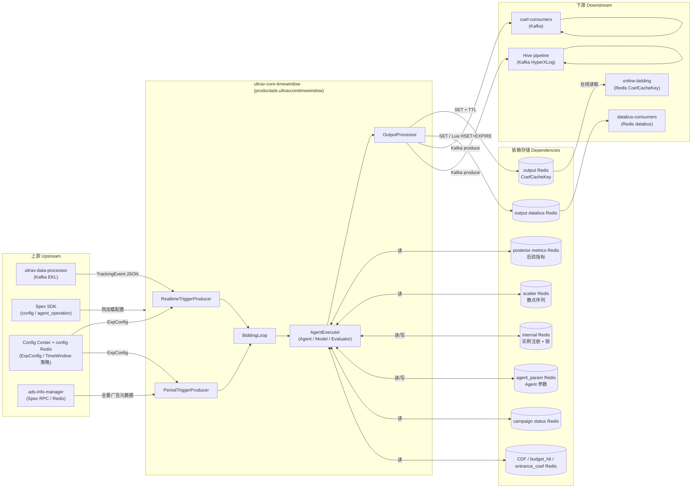

<!-- ads-workspace-gdoc-sync: gdoc_id=1X2RJ3BJ_jZzNsKor0M7u_vG0U8ysBgjmIjXSTMI6vkg gdoc_url=https://docs.google.com/document/d/1X2RJ3BJ_jZzNsKor0M7u_vG0U8ysBgjmIjXSTMI6vkg/edit -->

# ultrav-core-timewindow

仓库地址：https://git.garena.com/shopee/deep/paidads-bidding/ultrav-core-timewindow

---

## 目录 / Table of Contents

- [项目概述 / Introduction](#项目概述--introduction)
- [核心功能 / Features](#核心功能--features)
- [项目架构 / Architecture](#项目架构--architecture)
  - [系统上下文 / System Context](#系统上下文--system-context)
  - [上下游调用拓扑 / Service Topology](#上下游调用拓扑--service-topology)
  - [数据流 / Data Flow](#数据流--data-flow)
- [目录结构 / Directory Structure](#目录结构--directory-structure)
- [部署模式 / Deployment Modes](#部署模式--deployment-modes)
  - [Product Ads 部署 / Product Ads Deployment](#product-ads-部署--product-ads-deployment)
  - [其他垂类（Makefile 定义） / Other Verticals (Makefile Only)](#其他垂类makefile-定义--other-verticals-makefile-only)
- [核心流程 / Core Pipeline](#核心流程--core-pipeline)
  - [实时触发器 / Realtime Trigger Path](#实时触发器--realtime-trigger-path)
  - [定时触发器 / Period Trigger Path](#定时触发器--period-trigger-path)
  - [BiddingLoop 主循环 / BiddingLoop Main Loop](#biddingloop-主循环--biddingloop-main-loop)
  - [AgentExecutor 执行流水线 / AgentExecutor Pipeline](#agentexecutor-执行流水线--agentexecutor-pipeline)
  - [输出处理 / Output Processing](#输出处理--output-processing)
- [时间窗口机制 / Time Window Mechanism](#时间窗口机制--time-window-mechanism)
  - [实时触发间隔 / Realtime Trigger Intervals](#实时触发间隔--realtime-trigger-intervals)
  - [后验指标时间层级 / Posterior Metric Time Levels](#后验指标时间层级--posterior-metric-time-levels)
  - [事件标记与刷新 / Event Marking and Flushing](#事件标记与刷新--event-marking-and-flushing)
- [策略模块 / Strategy Modules](#策略模块--strategy-modules)
  - [Agent / Model / Evaluator 架构 / Agent Architecture](#agent--model--evaluator-架构--agent-architecture)
  - [Product Ads GMV Max / Product Ads GMV Max Strategy](#product-ads-gmv-max--product-ads-gmv-max-strategy)
- [配置体系 / Configuration](#配置体系--configuration)
  - [静态配置 (Spex config) / Static Config](#静态配置-spex-config--static-config)
  - [Agent 运营配置 (Spex agent_operation) / Agent Operation Config](#agent-运营配置-spex-agent_operation--agent-operation-config)
  - [实验配置 (Config Center + Redis) / Experiment Config](#实验配置-config-center--redis--experiment-config)
- [Redis 交互详解 / Redis Interaction](#redis-交互详解--redis-interaction)
  - [后验指标读取 / Posterior Metrics Read](#后验指标读取--posterior-metrics-read)
  - [系数输出写入 / Coefficient Output Write](#系数输出写入--coefficient-output-write)
  - [框架内部协调 / Internal Framework Coordination](#框架内部协调--internal-framework-coordination)
  - [触发器去重 / Trigger Deduplication](#触发器去重--trigger-deduplication)
- [开发规范 / Development Guidelines](#开发规范--development-guidelines)
  - [代码风格 / Code Style](#代码风格--code-style)
  - [新增 Agent / How to Add a New Agent](#新增-agent--how-to-add-a-new-agent)
  - [新增 Model / How to Add a New Model](#新增-model--how-to-add-a-new-model)
  - [新增 Evaluator / How to Add a New Evaluator](#新增-evaluator--how-to-add-a-new-evaluator)
  - [项目结构 / Project Structure](#项目结构--project-structure)
  - [命名规范 / Naming Conventions](#命名规范--naming-conventions)
  - [错误处理 / Error Handling](#错误处理--error-handling)
  - [单元测试 / Unit Testing Standards](#单元测试--unit-testing-standards)
  - [Code Review & Git Workflow](#code-review--git-workflow)
- [部署 / Deployment](#部署--deployment)
  - [生产构建 / Build for Production](#生产构建--build-for-production)
  - [发布流程 / Release Process](#发布流程--release-process)
  - [Docker 本地开发 / Docker Local Development](#docker-本地开发--docker-local-development)
- [监控 / Monitoring](#监控--monitoring)
- [业务术语表 / Business Terminology Glossary](#业务术语表--business-terminology-glossary)
- [参考资料 / Additional Resources](#参考资料--additional-resources)
- [常见问题 / Frequently Asked Questions](#常见问题--frequently-asked-questions)

---

## 项目概述 / Introduction

`ultrav-core-timewindow` 是广告出价系统的**时间窗口策略执行服务**。它负责消费来自 Kafka 的 tracking 事件，按可配置的时间窗口（15s / 60s / 120s / 180s / 300s）对广告进行缓冲和聚合，然后触发策略执行，最终将计算得到的出价系数写入 Redis / Kafka / Hive。

**核心数据流：**

```
Kafka TrackingEvent (来自 ultrav-data-processor)
  ↓ RealtimeTriggerProducer（按时间窗口缓冲）
  ↓ BiddingLoop（并发控制）
  ↓ AgentExecutor（读取后验指标 + 运行 Agent/Model/Evaluator 策略）
  ↓ OutputProcessor
  ├── output Redis（CoefCacheKey，FlatBuffers 序列化）
  ├── output Kafka（系数变更事件）
  ├── Hive Kafka（HyperXLog protobuf 离线日志）
  └── output databus Redis（聚合系数）
```

服务同时运行**定时触发器（PeriodTriggerProducer）**，以固定间隔扫描全量广告，实现周期性系数更新，确保低流量广告也能得到出价调整。

**代码库范围说明：**
- 当前代码库仅包含 **Product Ads** 的完整实现（`cmd/product_ad_cmd/`）。
- `Makefile` 中定义了 `build_shop_ads_svc`、`build_live_ads_svc`、`build_brand_max_svc`、`build_video_ads_svc` 等 target，但对应的 `cmd/` 目录**不在本代码库中**。
- 与上下游关系：读取 `ultrav-data-aggregator` 写入的后验指标 Redis，输出系数供 `online-bidding` / `ultrav-core` 读取。

---

## 核心功能 / Features

- **双触发器架构**：实时触发器（事件驱动）+ 定时触发器（全量扫描），互不干扰并行运行
- **可配置时间窗口**：支持 5 个维度（15s / 60s / 120s / 180s / 300s），每个 ExpConfig 独立配置触发间隔
- **实验匹配**：根据 ExpConfig 的 group_keys、abtest bucket、time window 对事件进行精确过滤
- **Agent/Model/Evaluator 三层插件架构**：策略模块通过注册机制与框架解耦，可独立扩展
- **多目标输出**：出价系数同时写入 output Redis（CoefCacheKey）、output Kafka、Hive Kafka、databus Redis
- **触发器去重**：Redis SETNX + BigCache 本地缓存双层去重，防止同一广告在同一窗口被重复计算
- **分布式实例协调**：Period 触发器通过 `adId % instanceLen` 分片，Redis ZADD/HSET 注册实例，Redis SETNX 加锁防止重复处理
- **热加载配置**：Spex SDK 支持 `config` 和 `agent_operation` 两个配置 key 的热更新，无需重启
- **Prometheus 监控**：三组指标族（`paidads_ultrav_core_timewindow_*`、`paidads_ultrav_core_exp_*`、`paidads_ultrav_core_coef_*`）
- **Verifier 离线验证**：`cmd/product_ad_verifier_cmd` 支持从 JSON 文件加载 ExpTrigger，离线验证策略逻辑

---

## 项目架构 / Architecture

### 系统上下文 / System Context

`ultrav-core-timewindow` 是 Shopee Paid Ads 出价链路的中间件，位于数据聚合（ultrav-data-aggregator）与在线竞价（online-bidding）之间。它将后验指标和广告元数据转化为出价系数，通过多个输出渠道下发。

Spex 服务名：`productads.ultravcoretimewindow`（见 `cmd/constant.go`）。Spex 仅用于配置管理（`config` 和 `agent_operation` 两个 key），服务本身**不注册任何 RPC handler**。

### 上下游调用拓扑 / Service Topology



**拓扑表格：**

| 类别 | 名称 | 协议 | 描述 |
|------|------|------|------|
| **上游** | ultrav-data-processor | Kafka (EKL) | tracking 事件流，TrackingEvent JSON |
| **上游** | Spex | Spex SDK | config / agent_operation 两层配置，热加载 |
| **上游** | Config Center + config Redis | Config Center SDK / Redis | ExpConfig 和时间窗口策略参数 |
| **上游** | ads-info-manager | Spex RPC / Redis | 全量广告元数据（AdInfoLoaderV2）|
| **下游** | online-bidding | Redis (CoefCacheKey) | 读取 output Redis 中的 FlatBuffers 系数 |
| **下游** | coef-consumers | Kafka | 系数变更事件 |
| **下游** | Hive pipeline | Kafka | HyperXLog protobuf 离线分析日志 |
| **下游** | databus-consumers | Redis (databus) | 聚合系数数据 |
| **依赖** | posterior metrics Redis | Redis GET | 后验指标（COUNT/SCALAR 多时间层级）|
| **依赖** | scatter Redis | Redis GET | TimeSlot2X protobuf 散点序列 |
| **依赖** | output Redis | Redis SET+TTL | CoefCacheKey FlatBuffers 系数写入 |
| **依赖** | internal Redis | Redis ZADD/HSET/SETNX | 实例注册、Period 广告锁 |
| **依赖** | agent_param Redis | Redis GET/SET | Agent 参数持久化 |
| **依赖** | campaign status Redis | Redis HGET | Campaign 状态（预算、日期） |
| **依赖** | CDF / budget_hit / entrance_coef Redis | Redis GET | 时段分布、预算命中、入口系数 |
| **依赖** | output databus Redis | Redis SET / Lua HSET+EXPIRE | 聚合后的 databus 数据 |

#### 中间件实例详情 / Middleware Instance Details

服务以 `productads.ultravcoretimewindow` 初始化 Spex，读取 Config Center namespace `[sp]productads / ultravcoretimewindow`，item 为 `config` 和 `agent_operation`。

| 类型 | 方向 | 具体实例 | 用途 | 证据 |
|---|---|---|---|---|
| Kafka | 消费 | `framework_config.tracking_event_kafka`；brokers `di-kafka-stt01-bg1-bootstrap01/02/03-stt-sg.data-infra.shopee.io:9093`, `di-kafka-da01-bg1-bootstrap01/02/03-dallas-us.data-infra.shopee.io:9093`；topics `bidding_tracking_event_id`, `bidding_tracking_event_my`, `bidding_tracking_event_sg`, `bidding_tracking_event_th`, `bidding_tracking_event_ph`, `bidding_tracking_event_vn`, `bidding_tracking_event_tw`, `mkplpaidads_discovery_ads.hyperx_tracking_event_us`；groups `ultrav_core_timewindow_id`, `ultrav_core_timewindow_global`, `ultrav_core_timewindow_ph`, `ultrav_core_timewindow_vn`, `paidads_mkplpaidads_hyperx_ultrav_core_timewindow_us` | 时间窗口实时 tracking 输入 | `cmd/constant.go`, `cmd/product_ad_cmd/main.go`, `config/core.go` |
| Kafka | 生产 | `framework_config.output_kafka_producer`；broker `kafka.kafka_paidads_searchads_drt_live.ap-sg-1-general-c.live.mq.shopee.io:9092`，topics `product_ads_coef-id-live`, `product_ads_coef-global-live`, `product_ads_coef-tw-live`；US/BR broker `kafka.kafka_latam_fe_us.na-us-2-general-a.live.mq.shopee.io:9092`，topic `product_ads_coef-global-live`；groups `mp_search_recommendation_ads-paidads-456ef8`, `mp_search_recommendation_ads-paidads-77dc4d` | 系数变更输出 | `pkg/data/output_kafka_producer`, `pkg/framework/output_processor.go` |
| Kafka | 生产 | `framework_config.hive_log_producer`；brokers `di-kafka-at01-bg1-bootstrap01/02/03-airtrunk-sg.data-infra.shopee.io:9093`, `di-kafka-da01-bg1-bootstrap01/02/03-dallas-us.data-infra.shopee.io:9093`；topics `mkplpaidads_discovery_ads.hyperx_exp_log`, `mkplpaidads_discovery_ads.hyperx_exp_log_us`；groups `paidads_mkplpaidads_hyperx_ultrav_core_timewindow_id`, `paidads_mkplpaidads_hyperx_ultrav_core_timewindow_global`, `paidads_mkplpaidads_hyperx_ultrav_core_timewindow_vn`, `paidads_mkplpaidads_hyperx_ultrav_core_timewindow_us` | 离线 HyperX 日志输出 | `pkg/data/output_hive_kafka_producer` |
| Redis | 读写 | internal / agent-param Redis domains `vkedn.elasticredis.cloud.shopee.io:10719`, `wip9w.elasticredis.cloud.shopee.io:10397`, `qv8w1.elasticredis.cloud.shopee.io:10740`, `dlcby.elasticredis.cloud.shopee.io:10735`, `vmqcp.elasticredis.cloud.shopee.io:10734`, `3xyvw.elasticredis.cloud.shopee.io:11755`；output Redis `a91cw.elasticredis.cloud.shopee.io:10391`, `wip9w.elasticredis.cloud.shopee.io:10397`, `bhdrr.elasticredis.cloud.shopee.io:10350`, `2mr2q.elasticredis.cloud.shopee.io:10991`, `rsp7p.elasticredis.cloud.shopee.io:10392`；output_databus `rhb8s.elasticredis.cloud.shopee.io:10311`, `wip9w.elasticredis.cloud.shopee.io:10397`, `eujfa.elasticredis.cloud.shopee.io:10306` | 实例注册、锁、Agent 参数、系数输出、databus 输出 | `pkg/data/internal_redis`, `pkg/data/agent_param_redis`, `pkg/data/output_redis`, `pkg/data/output_databus` |
| Redis | 读取 | 后验指标路由通过 `post_data_spex` 指向 project `ads_bidding`、namespace `post_data_redis_config`；CDF / campaign status / budget hit / entrance coef Redis domains `cflft.elasticredis.cloud.shopee.io:10246`, `9cac9f7a85485590.elasticredis.cloud.shopee.io:10523`；scatter/config Redis domains `soefe.elasticredis.cloud.shopee.io:11828`, `0083dcfb33f6dedd.elasticredis.cloud.shopee.io:11828` | 后验指标、scatter 序列、campaign 状态、CDF、budget-hit、入口系数、实验配置读取 | `pkg/data/post_data_client`, `pkg/data/cdf_redis`, `pkg/data/budget_hit`, `pkg/data/entrance_coef`, `pkg/config_redis` |
| Config Center | 读取 | `[sp]productads / ultravcoretimewindow` item `config` 和 `agent_operation`；实验配置地址 `ads_bidding/product_ads_bidding_timewindow_config` | 运行时中间件配置与时间窗口策略配置 | `config/core.go`, `config/agent.go` |
| DB/FSE/Vespa/S3/ClickHouse | 未发现 | 扫描代码未发现本仓库直接读写 DB、FSE、Vespa、S3 或 ClickHouse | 存储访问集中在 Redis/Kafka/Config Center/Spex RPC | source scan |

### 数据流 / Data Flow

```
[物理层 Physical Layer]
  posterior metrics Redis → framework (PrepareRawData)
  scatter Redis           → framework (PrepareScatterData)
  ads-info-manager        → framework (prepareAdsInfo)
  campaign status Redis   → framework (GetTodayCampaignStatus)
  CDF / budget_hit Redis  → framework (prepareAdsInfo)

[框架层 Framework Layer]
  RawData (后验指标 + scatter) + AgentAdsInfo (AdsInfo + CDF + BudgetHit + EntranceCoef)
      → AgentExecutor.ProcessTrigger
          → Agent.Process(agentCtx, rdRWrapper, validModel, evaluator)
              → Model.Predict(coef) + Evaluator.Evaluate(coef, result) × N 次搜索
              → 最优系数 ExpOutput

[输出层 Output Layer]
  OutputProcessor.ProcessOutput
      → output Redis (CoefCacheKey SET+TTL)
      → output Kafka (系数事件)
      → Hive Kafka (HyperXLog protobuf)
      → output databus Redis (SET 或 Lua HSET+EXPIRE)
```

---

## 目录结构 / Directory Structure

```
ultrav-core-timewindow/
├── cmd/
│   ├── constant.go                      # Spex 服务名常量（productads.ultravcoretimewindow）
│   ├── product_ad_cmd/                  # Product Ads 主服务入口
│   │   ├── main.go                      # 初始化 Spex、配置、组件，启动 BiddingLoop + HTTP server
│   │   └── registor.go                  # 注册 Agent / Model / Evaluator
│   └── product_ad_verifier_cmd/         # 离线验证工具（Verifier）
├── config/
│   ├── core.go                          # AppConfig（DynamicConfig + FrameworkConfig + ProductAdsConfig）
│   ├── agent.go                         # AgentOperationConfig（Spex agent_operation key）
│   ├── ekl_log.yml                      # EKL 日志配置
│   └── product_ads/
│       └── product_ads.go               # ProductAdsConfig（AdsInfoManager + ConfigCenterAddress）
├── internal/
│   ├── core/
│   │   ├── config.go                    # BiddingLoop Config（并发度、channel buffer）
│   │   ├── dependency.go               # TriggerProducer / AgentExecutor 接口定义
│   │   └── loop.go                      # BiddingLoop 主循环实现
│   ├── exporter/
│   │   ├── core_exporter.go             # Prometheus 指标：paidads_ultrav_core_exp_*
│   │   └── coef_exporter.go             # Prometheus 指标：paidads_ultrav_core_coef_*
│   ├── model/                           # 数据模型定义
│   │   ├── agent_ads_info.go            # AgentAdsInfo（AdsInfo + CDF + BudgetHit + EntranceCoef）
│   │   ├── agent_context/               # AgentContext 初始化
│   │   ├── raw_data.go                  # RawData + RawDataReadWrapper 接口
│   │   ├── exp_trigger.go               # ExpTrigger / ExpTriggerData
│   │   ├── exp_output.go                # ExpOutput / CoefInfo
│   │   ├── predict_result.go            # PredictResult 标准结构
│   │   └── agent_param.proto            # AgentParam protobuf 定义
│   ├── service/
│   │   ├── agent_executor/
│   │   │   ├── agent_executor.go        # BatchProcessTriggers / ProcessTrigger 核心逻辑
│   │   │   ├── ads_info_prep.go         # prepareAdsInfo（CDF + BudgetHit + EntranceCoef）
│   │   │   └── dependency.go            # Agent / Model / Evaluator 接口定义
│   │   ├── output_processor/
│   │   │   └── output_processor.go     # 多目标输出写入（Redis + Kafka + Hive + Databus）
│   │   ├── post_data_dao/              # 后验指标数据访问层
│   │   └── trigger_producer/
│   │       ├── realtime_producer.go     # RealtimeTriggerProducer（Kafka EKL 消费）
│   │       ├── period_producer.go       # PeriodTriggerProducer（全量广告周期扫描）
│   │       ├── time_window_marker.go    # TimeWindowProcessor（时间窗口缓冲 + flush）
│   │       ├── exp_config_matcher.go    # ExpConfig 过滤匹配
│   │       ├── exp_trigger_generator.go # ExpTrigger 生成
│   │       └── util.go
│   └── strategy/
│       ├── agent_util/                  # 共享工具（aggregated_storage、param resolution）
│       └── product_ad/
│           └── gmv_max/                 # GMV Max 策略（唯一完整实现）
│               ├── agent/               # GmvMaxAgent（MPC 搜索 + 后处理）+ mpc_processor.go（MpcSearchResult / MpcProcessorInfo）+ final_prediction_sequence.go（V2 预测缓存）
│               ├── model/               # DeepModel / StatModel / FuncModel + prediction_trace.go（V2 Trace 结构）
│               └── evaluator/           # GmvMaxRoiEvaluator / GmvMaxAdvvEvaluator 等 + obs_risk_target.go（观测风险 ROI 调整）
├── pkg/
│   ├── data/                            # 各 Redis / Kafka 客户端封装
│   │   ├── ad_info_loader/              # AdInfoLoaderV2（ads-info-manager 接口）
│   │   ├── agent_param_redis/           # Agent 参数 Redis 客户端
│   │   ├── budget_hit/                  # BudgetHit Redis 客户端
│   │   ├── campaign_status/             # CampaignStatus Redis 客户端
│   │   ├── cdf_redis/                   # CDF Redis 客户端
│   │   ├── entrance_coef/               # EntranceCoef Redis 客户端
│   │   ├── internal_redis/              # 内部框架 Redis（实例注册 + 锁）
│   │   ├── output_databus/              # output databus Redis 写入
│   │   ├── output_hive_kafka_producer/  # Hive 日志 Kafka 生产者
│   │   ├── output_kafka_producer/       # 系数事件 Kafka 生产者
│   │   ├── output_redis/                # output Redis 写入（CoefCacheKey + FlatBuffers）
│   │   ├── posterior_data_wrapper/      # 后验指标数据封装
│   │   └── scatter_redis/               # scatter Redis 客户端
│   ├── http_handler/                    # HTTP 路由（/metrics、/ping、/debug/pprof、/log/）
│   └── util/                            # 通用工具（指标导出、日志级别、环境检测）
├── agent_exp_configs/
│   └── product_ads/                     # 样例实验配置 JSON（planid_simple2_99xx / planid_target2_99xx / planid_ads_group_2410 / planid_gms_2410 等系列）
├── deploy/
│   └── product-ads.json                 # SPACE 部署配置
├── docker-compose.yml                   # 本地开发环境（Kafka + Redis + Kafka UI）
├── Makefile                             # 构建 / 测试 / CI / Docker 操作命令
├── go.mod                               # Go 1.24，模块名 git.garena.com/.../ultrav-core-timewindow
└── sp-workspace.yml                     # Spex workspace 配置（paidads.valar.ads_info_data 等依赖）
```

---

## 部署模式 / Deployment Modes

### Product Ads 部署 / Product Ads Deployment

Product Ads 是代码库中**唯一完整实现**的垂类。

| 字段 | 值 |
|------|-----|
| 入口 | `cmd/product_ad_cmd/main.go` |
| 构建产物 | `bin/ultrav-core-product` |
| 构建命令 | `make build_product_ads_svc` |
| Spex 服务名 | `productads.ultravcoretimewindow` |
| SPACE project_name | `productads` |
| SPACE module_name | `ultravcoretimewindow` |
| 部署配置 | `deploy/product-ads.json` |
| 健康检查端点 | `GET /ping` |
| SPACE 发布页 | https://space.shopee.io/console/cmdb/deployment/detail/shopee.mp_search_recommendation_ads.paidads.ads_bidding.product_ads.ultrav_core_timewindow |

**Verifier 模式**（离线策略验证）：

```bash
make build_product_ads_verifier          # 本地构建
make upload_product_ads_verifier USER_FOLDER=<your_folder>  # 上传到 liveish 机器 10.187.174.217
```

**output_getter 工具**（解码 Redis 系数缓存值）：

```bash
# tool/output_getter/ 目录下，用于从 Redis 读取并解码 CoefCacheKey FlatBuffers 数据
```

### 其他垂类（Makefile 定义） / Other Verticals (Makefile Only)

以下 Makefile target 已定义，但对应的 `cmd/` 源码**不在本代码库中**：

| Target | 产物 |
|--------|------|
| `build_shop_ads_svc` | `bin/ultrav-core-shop` |
| `build_live_ads_svc` | `bin/ultrav-core-livead` |
| `build_live_ads_antou_svc` | `bin/ultrav-core-livead-antou` |
| `build_brand_max_svc` | `bin/ultrav-core-brand-max` |
| `build_video_ads_svc` | `bin/ultrav-core-video` |

---

## 核心流程 / Core Pipeline

### 实时触发器 / Realtime Trigger Path

```
Kafka TrackingEvent
  ↓ EKL Consumer.Transform()
      - JSON 反序列化为 TrackingEvent
      - 过滤非目标 country
      - 解析 GroupKeysMap 中各字段的具体类型
      - 过滤 TrafficType != "AD" 的事件
  ↓ EKL Consumer.Process()
      - TimeWindowProcessor.MarkTrackingEvent(trackingEvent)
          - 获取当前所有 ExpConfig
          - 提取 ad_key（ads_id 级别）或 coarse-grained key（品类/placement 级别）
          - 将 trackingEvent 写入 adKeyMaps[country][interval][adKey]
            和 coarseGrainedKeyMaps[country][interval][key]（所有 5 个 interval 同步写入）

[每个 interval 的独立定时器]
  ↓ time.Tick(interval * second) → ProduceTriggersByWindow(country, interval)
      - getAndResetMap()：原子 swap，获取当前窗口所有 key，重置 map
      - 对每个 ad_key 或 coarse-grained key：
          - filterAdExpConfigs / filterCoarseGrainedExpConfigs
          - GenerateExpTriggerFromContext → []*ExpTrigger
      - expTriggerCh <- expTriggers
```

### 定时触发器 / Period Trigger Path

```
time.Tick(PeriodTriggerIntervalMinutes)
  ↓ PeriodTriggerProducer.triggerPeriodically()
      - 获取全量 ExpConfig
      - 对每个 country：
          - adInfoManager.GetAllAdsInfo(country) → 全量广告元数据
          - 按 adId % instanceLen == instanceIdx 分片（只处理本实例负责的广告）
          - 批量（100 个）调用 internalCli.LockAds()（Redis SETNX 加锁）
          - 对已加锁的广告：produceExpTriggers()
              - 构造 groupKeyMap（ads_id / placement / pricing_type / bucket 等）
              - filterAdExpConfigs + GenerateExpTriggerFromContext
              - 生成 ExpTrigger（EventType=Period, TimeWindow=0）
              - expTriggerCh <- expTriggers
```

### BiddingLoop 主循环 / BiddingLoop Main Loop

```go
// internal/core/loop.go
select {
case expTriggers := <-realtimeTriggerProducer.GetExpTriggerChan():
    getWorker(agentWorkerCh)           // 从并发池获取 worker（默认 256）
    go doBidding(ctx, expTriggers)     // 并发执行

case expTriggers := <-periodTriggerProducer.GetExpTriggerChan():
    getWorker(agentWorkerCh)
    go doBidding(ctx, expTriggers)
}
// doBidding → agentExecutor.BatchProcessTriggers(ctx, expTriggers)
```

BiddingExecutorConcurrency 默认 256，最大 1024（`internal/core/config.go`）。

### AgentExecutor 执行流水线 / AgentExecutor Pipeline

```
BatchProcessTriggers(triggers)
  1. 触发器去重：VerifyTrigger(Redis SETNX + BigCache 双层)
  2. PrepareRawData：读取后验指标 Redis
  3. PrepareScatterData：读取 scatter Redis
  4. GetTodayCampaignStatus：读取 campaign status Redis（含 IsCampaignDay / IsSurge / GetBoost）
  5. prepareAdsInfo：
     - GetAdsInfo（ads-info-manager）
     - InitAccountBalanceSnapshot（账户余额快照）
     - GetCdf（CDF Redis）
     - GetTodayHitMinute / GetHistoryHitMinutes（BudgetHit Redis）
     - GetDifferentEntranceBidCoefMap（EntranceCoef Redis）
     - posteriorDataDai.GetBudgetUnificationData（posterior_data_wrapper.Wrapper → Spex 后验数据）→ InitBudgetUnificationInfo
     → AgentAdsInfo{
         IndexerAdsInfo,
         AccountBalance{AccountBalanceSnapshot, AccountBalanceSnapshotPm, ValidBudget, ValidBudgetPm},
         BudgetUnificationInfo{RtRemainBudget, RtDailyBudget, DailyBudgetMaxCap, ...},
         Cdf, TodayBudgetHit, HistoryBudgetHits, EntranceBidCoef
       }
  6. 对每个 trigger → ProcessTrigger()

ProcessTrigger(trigger)
  1. NewRawDataReadWrapper（按 expName 作用域隔离原始数据）
  2. PrepareAgentParamManager（从 agent_param Redis 加载持久化参数）
  3. InitAgentContext（组合 trigger + agentParamManager + adsInfo + campaignStatus）
  4. getAgentByExpTrigger → agent
  5. getModelsByExpTrigger → 按 model_list 顺序获取 models
  6. 遍历 models：m.Prepare() → 选第一个 IsValid() 的作为 validModel；所有 model 均失败时导出 fail_prepare_all_models 指标
  7. getEvaluatorByExpTrigger + evaluator.Prepare()
  8. agent.Process(ctx, agentContext, rdRWrapper, validModel, evaluator) → ExpOutput
     - GmvMaxAgent 内部：MPC 搜索 → postProcess（步长控制、入口系数、Max CPC）→ updateFinalPredictionEffectiveOnline（V2 序列缓存拼接）
  9. SetAgentParamManager（写回 agent_param Redis，包含 `mpc_final_prediction_v2_cache_json` 序列缓存）
  10. outputProcessor.ProcessOutput(OutputWrapper)
```

### 输出处理 / Output Processing

`OutputProcessor` 按顺序调用注册的 `outputWriter`（任一失败则中断）：

| 写入目标 | 实现 | 说明 |
|----------|------|------|
| output Redis | `output_redis.WriteOutput` | CoefCacheKey（FlatBuffers 序列化）SET + TTL |
| output Kafka | `output_kafka_producer.WriteOutput` | 系数变更事件 |
| Hive Kafka | `output_hive_kafka_producer.WriteOutput` | HyperXLog protobuf 离线分析日志 |
| output databus Redis | `output_databus.WriteOutput` | SET 或 Lua HSET+EXPIRE 聚合写入 |

写入完成后，导出 Prometheus 指标：`coef_produced_total`、`coef_value_distribution`、`coef_production_age_seconds`。

---

## 时间窗口机制 / Time Window Mechanism

### 实时触发间隔 / Realtime Trigger Intervals

```go
// internal/service/trigger_producer/time_window_marker.go
var validRealtimeTriggerIntervals = []int32{60, 120, 180}
```

每个 interval（单位：秒）有独立的内存 map 和定时器。ExpConfig 的 `realtime_trigger_interval` 字段必须匹配以上 3 个值之一，才会被实时触发器触发。

### 后验指标时间层级 / Posterior Metric Time Levels

后验指标（通过 `post_data_client` 读取）支持以下时间层级：

| 层级 | 说明 |
|------|------|
| `history` | 历史汇总 |
| `daily` | 天级数据 |
| `hourly` | 小时级数据 |
| `minutely` | 分钟级数据 |
| `quarter` | 15 分钟级数据 |
| `every_minute` | 每分钟数据 |

这些时间层级与实时触发窗口（15s/60s/...）是不同维度的概念。ExpConfig 的 `metric_needs` 字段声明策略需要哪些指标和时间层级。

### 事件标记与刷新 / Event Marking and Flushing

`TimeWindowProcessor.MarkTrackingEvent()` 将每个 TrackingEvent 同时写入所有 5 个 interval 的 map。每个 interval 的定时器触发时，`getAndResetMap()` 原子地 swap 出当前 map 并重置，避免写入锁竞争。

---

## 策略模块 / Strategy Modules

### Agent / Model / Evaluator 架构 / Agent Architecture

框架定义三个核心接口（`internal/service/agent_executor/dependency.go`）：

```go
type Agent interface {
    GetAgentName() string
    Process(ctx context.Context, agentCtx *agent_context.AgentContext,
            rdRWrapper *model.RawDataReadWrapper, model Model, evaluator Evaluator) (*model.ExpOutput, error)
}

type Model interface {
    GetModelName() string
    Prepare(agentCtx *agent_context.AgentContext, agentParamManager *model.AgentParamManager,
            rdRWrapper *model.RawDataReadWrapper, modelParams map[string]any) error
    IsValid() bool
    Predict(coef float64) (*model.PredictResult, any, bool)
    GetTrace() any
}

type Evaluator interface {
    GetEvaluatorName() string
    Prepare(agentCtx *agent_context.AgentContext, agentParamManager *model.AgentParamManager,
            rdRWrapper *model.RawDataReadWrapper, evaluateParams map[string]any) error
    Evaluate(coef float64, predictResult *model.PredictResult) (float64, any, bool)
    GetTrace() any
}
```

此外，若 Evaluator 实现了 `RoiExplorerAware` 接口（`internal/strategy/product_ad/gmv_max/agent/`），则 GmvMaxAgent 会在 MPC 搜索前将 ROI 探索结果（大促/极速起量场景下调整后的 TargetRoiLower/Upper）注入：

```go
type RoiExplorerAware interface {
    SetExploredRoi(lowerAE, upperAE float64, isCampaignSurgeInEffect, isRapidBoostInEffect bool)
}
```

**注册机制**（`cmd/product_ad_cmd/registor.go`）：

```go
var agentRegisterFuncs = []func() agent_executor.Agent{
    func() agent_executor.Agent { return gmv_max_agent.NewGmvMaxAgent() }, // agent_name: "gmv_max"
}

var modelRegisterFuncs = []func() agent_executor.Model{
    func() agent_executor.Model { return model.NewDeepModel() },  // model_name: "gmv_max_deep_model"
    func() agent_executor.Model { return model.NewStatModel() },  // model_name: "gmv_max_stat_model"
    func() agent_executor.Model { return model.NewFuncModel() },  // model_name: "gmv_max_func_model"
}

var evaluatorRegisterFuncs = []func() agent_executor.Evaluator{
    func() agent_executor.Evaluator { return evaluator.NewGmvMaxRoiEvaluator() },      // "gmv_max_roi_evaluator"
    func() agent_executor.Evaluator { return evaluator.NewGmvMaxRoiBCBEvaluator() },   // "gmv_max_roi_bcb_evaluator"
    func() agent_executor.Evaluator { return evaluator.NewGmvMaxAdvvEvaluator() },     // "gmv_max_advv_evaluator"
    func() agent_executor.Evaluator { return evaluator.NewGmvMaxAdvvBCBEvaluator() },  // "gmv_max_advv_bcb_evaluator"
}
```

### Product Ads GMV Max / Product Ads GMV Max Strategy

GMV Max 是当前代码库中唯一完整实现的策略，位于 `internal/strategy/product_ad/gmv_max/`。

| 组件 | 路径 | 说明 |
|------|------|------|
| Agent | `agent/gmv_max_agent.go` | GmvMaxAgent，编排 MPC 搜索（调用 `mpc_processor.go` 中的 `performMpcSearch`）+ 后处理（步长控制、入口系数、Max CPC、预算软下线、eCPC 付款质量 `AvgOrder2Pay`） |
| MpcProcessor | `agent/mpc_processor.go` | `performMpcSearch`：在 [coef_min, coef_max] × mpc_step_cnt 线性搜索最优系数；返回 `MpcSearchResult`（bestCoef + bestPredictResult）和 `MpcProcessorInfo`（大促/极速起量/databus 开关、AE ROI 上下界） |
| Data | `agent/data.go` | `MainData`（4 个 campaign 维度 MetricMap：AdsLastNday / AdsLastNdayNoCampaign / AdsLast24hour / AdsToday）；`Order2PaySelfStat` + `ComputeOrder2PaySelf()`（线性加权 24h 付款质量比率 → CoefExtra 中的 `AvgOrder2Pay`）；`EntranceDataLoader`（各入口今日消耗，用于预算限额比率） |
| RoiExplorer | `agent/roi_explorer.go` | 大促/极速起量场景 ROI 目标探索（CampaignSurge / RapidBoost 插件） |
| FinalPredictionV2 缓存 | `agent/final_prediction_sequence.go` | 跨触发周期缓存每日预测序列（raw/after_p2p/after_p2r/final 四阶段，96 时段），拼接当日历史前缀与当次预测后缀，生成 `effective_online` 有效在线序列；由 agent param key `mpc_final_prediction_v2_cache_json` 持久化 |
| Model | `model/` | DeepModel (`gmv_max_deep_model`) / StatModel (`gmv_max_stat_model`) / FuncModel (`gmv_max_func_model`)，按 `model_list` 顺序 fallback |
| 预测 Trace V2 | `model/prediction_trace.go` | 统一预测追踪结构：`UnifiedPredictionTrace`（含 96 时段 raw/after_p2p/after_p2r/final 序列）、`FinalPredictionV2Trace`、`EffectiveOnlinePredictionTrace`；由 `enable_mpc_prediction_trace_v2` 参数启用 |
| P2P 小时级校准 | `model/p2p_hourly_cali.go` | 基于历史时段分布对 predict 结果做小时级校准（含 shape shrink、归一化、来源追踪），提升时段内精度 |
| P2R 校准 | `model/p2r_cali.go` | predict-to-real 校准，修正模型预估与实际指标的偏差 |
| HitBudget 调整 | `model/hit_budget_adjustment.go` | 基于历史预算命中天数对系数进行调整 |
| Evaluator (ROI) | `evaluator/roi_evaluator.go` | `gmv_max_roi_evaluator`，ROI 目标匹配 |
| Evaluator (ROI BCB) | `evaluator/roi_bcb_evaluator.go` | `gmv_max_roi_bcb_evaluator`，ROI + BCB 预算节奏约束；支持 `disable_bcb_when_underbid` 在欠成本时跳过 BCB |
| Evaluator (Advv) | `evaluator/advv_evaluator.go` | `gmv_max_advv_evaluator`，广告主价值（Advv）目标 |
| Evaluator (Advv BCB) | `evaluator/advv_bcb_evaluator.go` | `gmv_max_advv_bcb_evaluator`，Advv + BCB 预算节奏约束 |
| ObsRiskTarget | `evaluator/obs_risk_target.go` | 观测风险个性化 ROI 目标调整：综合广告成熟度（feedback ratio + history backfill）、样本量（click/cost/advv）、偏差（昨日预测 vs 实际 ROI）三类信号计算 `target_delta`，动态调整评估器 ROI 目标；由 `enable_obs_risk_personalized_target` 参数启用 |
| DelayedFeedback | `evaluator/delayed_feedback.go` | 延迟回流率校准（1H/6H/24H 回流比例估算） |
| 示例配置 | `agent/simple2_base_v0.json` | 完整 ExpConfig JSON 示例 |
| Verifier 样本 (Simple2) | `cmd/product_ad_verifier_cmd/sample_gmv_max_simple2.json` | Simple2 定价类型的离线验证触发器样本 |
| Verifier 样本 (Target2) | `cmd/product_ad_verifier_cmd/sample_gmv_max_target2.json` | Target2 定价类型的离线验证触发器样本 |

`internal/strategy/agent_util/` 提供跨策略共享工具，包括 aggregated_storage 和参数解析工具（`agent_util.GetFloat64` / `GetInt32` / `GetBool`）。参数 key 支持四级优先级解析（从低到高）：

```
key               → 基础默认值
key.<planID>      → 按 planID（L2 plan bucket）覆盖
key.<country>     → 按国家覆盖
key.<country>.<planID> → 国家 + planID 联合覆盖（最高优先级）
```

---

## 配置体系 / Configuration

### 静态配置 (Spex config) / Static Config

Spex key：`config`，对应结构 `AppConfig`（`config/core.go`）：

```go
type AppConfig struct {
    DynamicConfig   DynamicConfig                     // 动态参数
    FrameworkConfig FrameworkConfig                    // 框架级配置
    ProductAdsConfig product_ads.ProductAdsConfig     // Product Ads 特有配置
}

type DynamicConfig struct {
    LogLevel       string   // 日志级别
    Countries      []string // 处理的国家列表
    GracefulPeriod string   // 优雅停机等待时间（如 "30s"）
}

type FrameworkConfig struct {
    TrackingEventKafka     KafkaConfig      // EKL Kafka 消费者配置
    InternalFrameworkRedis redisutil.Config // 内部协调 Redis
    OutputKafkaProducer    KafkaConfig      // 系数事件 Kafka 生产者
    HiveLogProducer        KafkaConfig      // Hive 日志 Kafka 生产者
    PostDataRedis          post_data_client.Config     // 后验指标 Redis
    PostDataSpex           post_data_client.SpexConfig // 后验指标 Spex 接入（预算统一数据）
    AgentParamRedis        redisutil.Config // Agent 参数 Redis
    OutputRedis            redisutil.Config // 系数输出 Redis
    CampaignStatusRedis    redisutil.Config // Campaign 状态 Redis
    CdfRedis               redisutil.Config // CDF Redis
    ScatterRedis           redisutil.Config // scatter Redis
    BudgetHitRedis         redisutil.Config // BudgetHit Redis
    EntranceCoefRedis      redisutil.Config // 入口系数 Redis
    OutputDatabus          redisutil.Config // output databus Redis

    // 行为控制
    MinInstanceCount              int64    // Period 触发器最小实例数（防止单实例负载过重）
    OutputRedisTtlMinutes         int64    // output Redis TTL（分钟）
    LockRedisTtlMinutes           int64    // Period 锁 TTL（分钟）
    PeriodTriggerIntervalMinutes  int64    // Period 触发间隔（分钟，默认 5；与 Seconds 互斥，Seconds 优先）
    PeriodTriggerIntervalSeconds  int64    // Period 触发间隔（秒，优先于 Minutes 生效，适合精细化配置）
    PeriodTriggerBufferCount      int64    // Period 触发器 channel buffer（默认 100000）
    PeriodTriggerAdsRateLimit     int      // Period 触发器限速（ads/s）
    RealtimeTriggerBufferCount    int64    // 实时触发器 channel buffer（默认 10000）
    BiddingLoop core.Config                // BiddingExecutorConcurrency（默认 256）
}
```

`KafkaConfig` 支持 `country_kafka_configs`（按国家配置不同的 broker/topic/group）。

### Agent 运营配置 (Spex agent_operation) / Agent Operation Config

Spex key：`agent_operation`，对应结构 `AgentOperationConfig`（`config/agent.go`）：

```go
type AgentOperationConfig struct {
    LogDowngradeRate              float64   // 日志降采样率
    ManualRatioForShopCost        int64     // Shop 广告 cost 手动比例（默认 6）
    DailyBudgetAdjustableCoefList []DailyBudgetAdjustableCoef // 按国家 + PricingType 的预算可调系数
    DailyBudgetAdjustableCoefMap  map[string]map[int32]float64 // 展开后的 map（json:"-"）
}
```

### 实验配置 (Config Center + Redis) / Experiment Config

ExpConfig 通过 Config Center + Redis（`config_redis.TimewindowExpConfigClient`）加载，存储在：

```
https://space.shopee.io/console/cmdb/config_center/detail/shopee.mp_search_recommendation_ads.paidads.ads_bidding.configuration_server/ads_bidding/live/namespace/product_ads_bidding_timewindow_config
```

关键字段示例（参考 `agent_exp_configs/product_ads/planid_simple2_9910_v0_strategy.json`）：

```json
{
  "enabled": true,
  "strategy_name": "planid_simple2_9910",
  "agent_name": "gmv_max",
  "model_list": ["gmv_max_stat_model", "gmv_max_func_model"],
  "evaluator": "gmv_max_roi_bcb_evaluator",
  "realtime_trigger_interval": 180,
  "period_trigger_interval": 3600,
  "metric_needs": [...],
  "model_data_need": [{"data_source": "scatter_redis", "datas": [...]}],
  "model_param": { "mpc_stat_model_name": "nn_modelv0_campaign", "enable_feedback_p2r": true },
  "evaluator_param": { "manual_merge_target_roi_coef": 0.95, "enable_obs_risk_personalized_target": false },
  "processor_param": { "coef_min": 0.4, "coef_max": 8.0, "enable_campaign_surge_plug_in": true }
}
```

重要 agent param key（由 `agent_param.agent_param_keys` 声明）：

| Key | 类型 | 说明 |
|-----|------|------|
| `coef_total` | float64 | 上次输出的系数，用于步长控制 |
| `mpc_final_prediction_v2_cache_json` | string | FinalPredictionV2 每日预测序列缓存（96 时段），跨触发周期拼接 effective_online 有效在线序列 |

ExpConfig 发布支持 canary 灰度发布。

---

## Redis 交互详解 / Redis Interaction

| 操作 | Redis | Key 格式 | 命令 | 用途 |
|------|-------|----------|------|------|
| 实例注册（Index 分配） | internal Redis | `ultrav_instance_*` | ZADD + HSET | Period 触发器实例发现与 index 分配 |
| Period 广告锁 | internal Redis | `period_trig_gen_lock:{country}:{adId}:{placement}` | SETNX + EXPIRE | 防止多实例重复处理同一广告 |
| 触发器去重 | internal Redis | `trigger_v3:{country}:{expName}:{key}` | SETNX + EXPIRE | Redis 层去重（配合 BigCache 本地缓存） |
| 后验指标读取 | posterior metrics Redis | 由 post_data_client 管理 | GET（多 key） | 读取 COUNT/SCALAR 多时间层级指标 |
| scatter 读取 | scatter Redis | 由 scatter_redis 管理 | GET | 读取 TimeSlot2X protobuf 散点序列 |
| Agent 参数读取/写入 | agent_param Redis | `agent_param_v3:{country}:{expName}:{key}` | GET / SET | Agent 参数持久化（跨触发周期） |
| Campaign 状态读取 | campaign status Redis | `camp:CAMPAIGN_STATUS_{country}_{date}` | HGET | 读取今日 campaign 状态 |
| CDF 读取 | cdf_redis | 由 cdf_redis 管理 | GET | 时段累积分布函数 |
| BudgetHit 读取 | budget_hit_redis | 由 budget_hit 管理 | GET | 今日/历史预算命中时间 |
| EntranceCoef 读取 | entrance_coef_redis | 由 entrance_coef 管理 | GET | 各入口出价系数 |
| 系数写入 | output Redis | CoefCacheKey（FlatBuffers 格式） | SET + EXPIRE | 主系数 + 各入口系数，供 online-bidding 读取 |
| databus 写入 | output_databus Redis | 由 output_databus 管理 | SET 或 Lua HSET+EXPIRE | 聚合系数，供 databus-consumers 消费 |

### 后验指标读取 / Posterior Metrics Read

后验指标通过 `post_data_client`（`paidads-bidding/common/post_data_client`）读取，支持按 ExpConfig 的 `metric_needs` 声明的指标名和时间层级批量获取。框架在 `BatchProcessTriggers` 阶段一次性为所有 trigger 准备好数据。

### 系数输出写入 / Coefficient Output Write

输出系数使用 `google/flatbuffers` 序列化，以 `CoefCacheKey`（`PostDataTimeSpan` 格式）作为 Redis key。写入时设置 TTL（由 `OutputRedisTtlMinutes` 控制）。

每次触发写入的 `CoefExtra` 字段：

| 字段 | 来源 | 说明 |
|------|------|------|
| `TargetCir` | `1 / TargetRoiLower` | 目标成本收入比，用于在线出价 |
| `MaxCpcBidCap` | `FinalBudget × max_budget_ratio_for_bid` | 最大 CPC 出价上限 |
| `MpcECost` / `MpcEGmv` | Model.Predict(finalCoef) | 原始 24h 消耗 / GMV 预测值 |
| `MpcECostCalied` / `MpcEGmvCalied` | P2R 校准后 | 校准后的预测值 |
| `UnderBidCoef` | extra_coef × underBidAdsExtraCoef × adsPcostUnderBidCoef | 欠成本提收系数乘积 |
| `AvgOrder2Pay` | `ComputeOrder2PaySelf()` 线性加权比率 | Scheme 1 eCPC 付款质量扰动：时间加权 24h `pay_pgmv / pgmv` 比率；无逐小时数据时缺省（在线出价优雅降级） |

### 框架内部协调 / Internal Framework Coordination

`internal_redis` 同时承担：
1. **实例注册**：每 10s 调用 `Register(CID, MESOS_TASK_ID)`，通过 ZADD 将实例加入有序集合，HSET 记录详情，返回 `(instanceIdx, instanceLen)`
2. **广告锁**：`LockAds` 通过 Redis pipeline 批量 SETNX，防止跨实例重复处理

### 触发器去重 / Trigger Deduplication

`AgentExecutor.BatchProcessTriggers` 调用 `TriggerCache.VerifyTrigger(country, key, interval)`，该方法实现**双层去重**：
1. **BigCache**（内存）：本地缓存快速过滤，避免 Redis 请求
2. **Redis SETNX**：分布式去重，配置 TTL 等于触发间隔

---

## 开发规范 / Development Guidelines

### 代码风格 / Code Style

```bash
make fmt   # go fmt（CI 严格检查）
make vet   # go vet（CI 严格检查）
make ci    # 完整 CI 流程（vet + fmt + unittest）
```

CI（`.gitlab-ci.yml`）强制要求代码通过 `go fmt` 和 `go vet`，否则 MR 无法合并。`.golangci.yml` 中配置了额外的 linter 规则。

### 新增 Agent / How to Add a New Agent

1. 在 `internal/strategy/product_ad/<strategy_name>/agent/` 下新建包
2. 实现 `agent_executor.Agent` 接口：`GetAgentName()`、`Process()`
3. 在 `Process()` 中：调用 `model.Predict(coef)` + `evaluator.Evaluate(coef, result)` 搜索最优系数，返回 `*model.ExpOutput`
4. 不得在 Agent 内发起任何网络请求，所有外部数据通过 `agentCtx` 和 `rdRWrapper` 访问
5. 在 `cmd/product_ad_cmd/registor.go` 的 `agentRegisterFuncs` 中注册：
   ```go
   func() agent_executor.Agent { return your_agent.NewYourAgent() }
   ```
6. `GetAgentName()` 返回值必须与 ExpConfig 的 `agent_name` 字段一致

### 新增 Model / How to Add a New Model

1. 在 `internal/strategy/product_ad/<strategy_name>/model/` 下新建文件
2. 实现 `agent_executor.Model` 接口
3. `Prepare()` 中：解析 `model_param`，从 `rdRWrapper` 读取后验指标和 scatter 数据，设置 `valid` 标志
4. `Predict(coef)` 返回 `*model.PredictResult`（包含 PredictCost、PredictGmv 等标准字段）
5. 不得在 Model 内直接访问 Redis 或发起 RPC
6. 在 `modelRegisterFuncs` 中注册，`GetModelName()` 与 ExpConfig 的 `model_list[]` 条目一致

### 新增 Evaluator / How to Add a New Evaluator

1. 在 `internal/strategy/product_ad/<strategy_name>/evaluator/` 下新建文件
2. 实现 `agent_executor.Evaluator` 接口
3. `Evaluate()` 返回 `(score float64, state any, ok bool)`，score 越高越好
4. 在 `evaluatorRegisterFuncs` 中注册，`GetEvaluatorName()` 与 ExpConfig 的 `evaluator` 字段一致

### 项目结构 / Project Structure

- 业务策略代码放在 `internal/strategy/<product_line>/<strategy_name>/`
- 框架级数据访问放在 `pkg/data/`（不得在策略层直接访问）
- 接口定义放在对应服务的 `dependency.go` 中

### 命名规范 / Naming Conventions

- Go 包名使用小写 snake_case（如 `gmv_max_agent`）
- Agent/Model/Evaluator 名称（`GetAgentName()` 等）必须与 ExpConfig JSON 中的字符串完全一致
- 配置 JSON key 使用 snake_case
- Redis key 格式遵循已有模式（见 Redis 交互详解章节）

### 错误处理 / Error Handling

- 框架层：关键错误（如初始化失败）返回 `error`，使进程退出
- 策略层：单个 trigger 处理失败不影响同批次其他 trigger
- 非关键外部数据（CDF、scatter 等）获取失败时，相应 validity flag 置 false，策略逻辑可选择降级
- panic 在 `BiddingLoop.doBidding` 和 `AgentExecutor.ProcessTrigger` 两处有 recover，并导出 panic 指标

### 单元测试 / Unit Testing Standards

```bash
make test         # 运行所有单元测试
make unittest     # CI 测试（含覆盖率统计）
```

策略层测试参考 `internal/strategy/product_ad/gmv_max/base_test.go`。

### Code Review & Git Workflow

- MR 合并前必须通过 CI（`make ci`：vet + fmt + unittest）
- 提交 MR 前本地运行 `make ci` 确认通过
- Agent/Model/Evaluator 的命名变更需同步更新 ExpConfig

---

## 部署 / Deployment

### 生产构建 / Build for Production

```bash
# 构建 Product Ads 主服务
make build_product_ads_svc
# 产物：bin/ultrav-core-product

# 构建 Verifier（含交叉编译 Linux AMD64）
make build_product_ads_verifier
# 或上传到 liveish 机器
make upload_product_ads_verifier USER_FOLDER=<your_folder>
```

构建使用 Go 1.24（`go.mod`），Docker 基础镜像 `golang-base:1.24.4-20`（见 `deploy/product-ads.json`）。

### 发布流程 / Release Process

**服务发布（二进制）：**

通过 SPACE 发布 tag/branch：
https://space.shopee.io/console/cmdb/deployment/detail/shopee.mp_search_recommendation_ads.paidads.ads_bidding.product_ads.ultrav_core_timewindow

> 目前尚未集成到 Release Platform，临时使用 SPACE 直接发布。

**实验配置发布（ExpConfig）：**

通过 Config Center 直接发布，支持 canary 灰度：
https://space.shopee.io/console/cmdb/config_center/detail/shopee.mp_search_recommendation_ads.paidads.ads_bidding.configuration_server/ads_bidding/live/namespace/product_ads_bidding_timewindow_config

### Docker 本地开发 / Docker Local Development

`docker-compose.yml` 提供完整的本地依赖环境：

```bash
make docker-up      # 启动 Kafka + Zookeeper + Redis + Kafka UI
make docker-down    # 停止所有服务
make docker-logs    # 查看日志

# Kafka 操作
make kafka-create-topic KAFKA_TOPIC=tracking-events KAFKA_PARTITIONS=3
make kafka-list-topics
make kafka-produce KAFKA_TOPIC=tracking-events KAFKA_MESSAGE='{"test": "message"}'
make kafka-consume KAFKA_TOPIC=tracking-events
```

服务端口：
- Kafka: `9092`
- Redis: `6379`
- Kafka UI: `8090`（http://localhost:8090）

**Liveish 测试（在线验证）：**

参考 [Liveish 测试指南](https://confluence.shopee.io/display/SPAD/%5BGuide%5D+Liveish+testing)。

SG liveish 机器：`10.187.174.217`

```bash
# 1. 编译并上传 Verifier
make upload_product_ads_verifier USER_FOLDER=<your_folder>

# 2. 在 liveish 机器上加载环境变量
export timewindow_export_env.sh  # /data/ultra/timewindow_export_env.sh

# 3. 准备 ExpTrigger JSON（参考 cmd/product_ad_verifier_cmd/sample_gmv_max_simple2.json）
# 4. 运行 Verifier
```

---

## 监控 / Monitoring

### Prometheus 指标

**`paidads_ultrav_core_timewindow_*`（通用框架指标）：**

| 指标 | 类型 | 标签 | 说明 |
|------|------|------|------|
| `paidads_ultrav_core_timewindow_count` | Counter | country, component, type | 通用计数（触发器数量、成功/失败） |
| `paidads_ultrav_core_timewindow_gauge` | Gauge | country, component, type | 通用 Gauge（channel 积压量、实例数） |
| `paidads_ultrav_core_timewindow_latency` | Summary | country, component, type | 延迟（P50/P90/P99） |
| `paidads_ultrav_core_timewindow_error` | Counter | country, component, err | 错误计数 |

**`paidads_ultrav_core_exp_*`（实验级指标）：**

| 指标 | 类型 | 标签 | 说明 |
|------|------|------|------|
| `paidads_ultrav_core_exp_count` | Counter | country, exp_name, component, type | 实验维度计数 |
| `paidads_ultrav_core_exp_latency` | Summary | country, exp_name, component, type | 实验维度延迟 |
| `paidads_ultrav_core_exp_error` | Counter | country, exp_name, component, err | 实验维度错误 |
| `paidads_ultrav_core_exp_panic` | Counter | country, exp_name, component | panic 计数 |

**`paidads_ultrav_core_coef_*`（系数质量指标）：**

| 指标 | 类型 | 标签 | 说明 |
|------|------|------|------|
| `paidads_ultrav_core_coef_produced_total` | Counter | country, coef_type | 成功产出系数总数 |
| `paidads_ultrav_core_coef_value_distribution` | Histogram | country, coef_type | 系数值分布（异常检测） |
| `paidads_ultrav_core_coef_production_age_seconds` | Histogram | country, coef_type, event_type | 从触发到产出的延迟（秒） |

**`paidads_ultrav_core_exp_plan_bucket_output_count`（计划桶产出计数）：**

| 指标 | 类型 | 标签 | 说明 |
|------|------|------|------|
| `paidads_ultrav_core_exp_plan_bucket_output_count` | Counter | agent_name, plan_bucket, type (placement:pricingType) | 各 agent + plan bucket + 广告类型的成功输出次数，用于验证 bucket 配置完整性 |

### HTTP 端点

| 端点 | 说明 |
|------|------|
| `GET /ping` | 健康检查（smoke check 和 SPACE check 均依赖此端点） |
| `GET /metrics` | Prometheus 指标 |
| `GET /debug/pprof/*` | Go pprof 性能分析 |
| `PUT /log/{level}` | 动态调整日志级别（debug/info/fatal） |

```bash
# 快速操作
make debug    # 切换到 debug 日志
make info     # 切换到 info 日志
make metrics  # 获取当前指标
```

---

## 业务术语表 / Business Terminology Glossary

| 术语 | 定义 |
|------|------|
| **eCPM** | Effective Cost Per Mille，广告总花费 / 总曝光数 × 1000 |
| **uGSP** | Unified Generalized Second Price，统一广义第二价格竞价 |
| **SPEX** | Shopee 内部服务治理框架（RPC + 配置管理） |
| **spcli** | Spex 命令行工具，用于 proto 代码生成和本地开发 |
| **DAG** | Directed Acyclic Graph，有向无环图 |
| **GAS** | （Shopee 内部系统） |
| **EKL** | Enhanced Kafka Library，Shopee 增强版 Kafka 消费框架 |
| **TrackingEvent** | Kafka 消息，来自 ultrav-data-processor，包含 GroupKeysMap 和数据字段 |
| **ExpConfig** | Experiment Config，实验配置，包含策略名、触发条件、模型列表、评估器等 |
| **ExpTrigger** | 实验触发器，Agent 执行的输入单元，包含 ExpConfig 和上下文数据 |
| **ExpTriggerData** | 触发器上下文（country、GroupKeyMap、TimeWindow、EventType 等） |
| **TimeWindowProcessor** | 实时触发器的时间窗口缓冲与 flush 核心组件 |
| **AgentExecutor** | 执行 Agent/Model/Evaluator 流水线的框架核心组件 |
| **BiddingLoop** | 主循环，消费 realtime + period 触发器 channel，控制并发 |
| **RealtimeTriggerProducer** | 消费 Kafka tracking 事件，按时间窗口产出 ExpTrigger |
| **PeriodTriggerProducer** | 周期扫描全量广告，产出 ExpTrigger |
| **OutputWrapper** | 封装 ExpOutput + ExpTrigger + AgentParam 的输出容器 |
| **CoefCacheKey** | output Redis 中的 key 格式，使用 PostDataTimeSpan 结构 |
| **PostDataTimeSpan** | 后验指标时间跨度枚举（history/daily/hourly/minutely/quarter/every_minute） |
| **FlatBuffers** | Google 高性能序列化库，用于系数的 Redis 存储格式 |
| **RerankOperatorRule** | 重排操作规则（广告策略相关） |
| **ReflectMap** | （框架内部结构） |
| **BigCache** | Go 高性能内存缓存库，用于触发器去重的本地缓存层 |
| **ROI** | Return On Investment，广告 GMV / 广告花费 |
| **Advv** | Advertiser Value，广告主价值指标（Manual 模式：Σ(avg_cpc × click)；Simple 模式：Σ(GMV × Target_CIR)） |
| **CIR** | Cost Income Ratio，广告花费 / 广告 GMV |
| **CDF** | Cumulative Distribution Function，时段累积分布函数，用于预算节奏控制 |
| **Verifier** | 离线策略验证工具（cmd/product_ad_verifier_cmd） |

---

## 参考资料 / Additional Resources

- **仓库地址**：https://git.garena.com/shopee/deep/paidads-bidding/ultrav-core-timewindow
- **Framework Flow 设计文档**：https://docs.google.com/document/d/11zCUOb3IWgFr_c4FbImQzJnjW6JsV3vG8z6LnprDTqg/edit?tab=t.0
- **ExpConfig 配置中心（Product Ads）**：https://space.shopee.io/console/cmdb/config_center/detail/shopee.mp_search_recommendation_ads.paidads.ads_bidding.configuration_server/ads_bidding/live/namespace/product_ads_bidding_timewindow_config
- **SPACE 发布页**：https://space.shopee.io/console/cmdb/deployment/detail/shopee.mp_search_recommendation_ads.paidads.ads_bidding.product_ads.ultrav_core_timewindow
- **Liveish 测试指南**：https://confluence.shopee.io/display/SPAD/%5BGuide%5D+Liveish+testing
- **Paid Ads 业务术语表**：https://confluence.shopee.io/pages/viewpage.action?spaceKey=SPAD&title=Paid+Ads+Glossary
- **SPEX Go 快速上手**：https://spex.shopee.io/overview/quick-start/languages/go/index.html
- **spcli 安装与 Git 配置**：https://spex.shopee.io/user-guide/SDK/Java/local.html

---

## 常见问题 / Frequently Asked Questions

**Q1: 实时触发间隔（realtime_trigger_interval）如何选择？**

A: 必须从 `[60, 120, 180]`（秒）中选一个值。ExpConfig 的 `realtime_trigger_interval` 必须与这 3 个值之一精确匹配，否则实时触发器不会触发该实验。选择依据：流量频繁的广告用较小窗口（60s），低流量广告用较大窗口（120s/180s）以积累足够事件量。15s 和 300s 两个 interval 已不再支持。

**Q2: Period 触发器和 Realtime 触发器有什么区别？**

A: Realtime 触发器由实际 tracking 事件驱动，仅对在窗口内有实际流量的广告触发。Period 触发器按固定周期（默认 5 分钟）扫描**全量**广告，确保即使零流量的广告也能周期性更新系数。Period 触发器生成的 ExpTrigger 中 `EventType=Period`，`TimeWindow=0`，不经过 interval 匹配。

**Q3: 如何新增一个 Agent？**

A: 1) 在 `internal/strategy/product_ad/<strategy_name>/agent/` 下实现 `Agent` 接口；2) 不得在 Agent 内发起网络请求，通过 `agentCtx.AdsInfo` 和 `rdRWrapper` 访问数据；3) 在 `cmd/product_ad_cmd/registor.go` 的 `agentRegisterFuncs` 中注册；4) 在 ExpConfig 的 `agent_name` 字段填写与 `GetAgentName()` 一致的名称。

**Q4: 时间窗口（15s/60s 等）和后验指标时间层级（daily/hourly 等）有什么区别？**

A: 时间窗口控制**实时触发器的聚合粒度**——多长时间 flush 一次 tracking 事件聚合批次。后验指标时间层级控制**读取哪段时间范围的历史指标数据**（如 daily 读昨日数据，hourly 读近 N 小时数据）。两者在 ExpConfig 中独立配置（`realtime_trigger_interval` vs `metric_needs`）。

**Q5: 触发器去重机制是怎样工作的？**

A: 双层去重：1) **BigCache（本地内存）**：快速过滤，减少 Redis 请求；2) **Redis SETNX**：分布式去重，TTL 与触发间隔一致，确保同一广告在同一窗口内只被处理一次。两层都通过则判定为有效触发器。

**Q6: 为什么 Makefile 中有 shop/live 等 target，但代码库里没有对应源码？**

A: 这些垂类（Shop Ads、Live Ads、Brand Max、Video Ads）曾经或计划在同一框架下实现，其 Makefile target 作为占位符保留。实际的策略代码在各自独立的仓库中维护，或尚未迁移到本框架。目前只有 Product Ads（`cmd/product_ad_cmd/`）在本仓库中有完整实现。

**Q7: 如何在本地调试策略逻辑？**

A: 1) 使用 `make docker-up` 启动本地 Kafka + Redis；2) 准备 ExpTrigger JSON（参考 `cmd/product_ad_verifier_cmd/sample_gmv_max_simple2.json`）；3) 运行 `make build_product_ads_verifier` 构建 Verifier；4) 执行 Verifier 载入本地 JSON 触发器，离线验证策略输出。在线验证可上传到 liveish 机器（`make upload_product_ads_verifier`）。

**Q8: CoefCacheKey 和 FlatBuffers 的输出格式是什么？**

A: `CoefCacheKey` 是 output Redis 中系数的 key 格式，包含 country、coef_type、id_type、id 等字段，对应 `PostDataTimeSpan` 结构。value 使用 `google/flatbuffers`（`v25.2.10`）序列化，包含主系数（entrance=0）和各入口系数（带 timestamp 和 extra data）。可用 `tool/output_getter` 工具从 Redis 解码查看。

**Q9: PeriodTriggerProducer 的分片机制是如何工作的？**

A: 每个实例启动后向 internal Redis 注册（ZADD + HSET），获得一个 `(instanceIdx, instanceLen)` 对。处理广告时，只处理满足 `adId % instanceLen == instanceIdx` 的广告。每 10 秒重新注册以检测实例变化，`MinInstanceCount` 配置防止单实例负载过重。

**Q10: output databus Redis 的 Lua 脚本聚合写入是做什么的？**

A: 某些系数需要按 field 聚合写入 Hash 结构（而非覆盖整个 key），同时需要原子地设置 TTL。普通 HSET 无法原子完成"设置 field + 刷新 TTL"，因此使用 Lua 脚本实现 `HSET + EXPIRE` 的原子操作，避免竞态条件导致 TTL 被重置或丢失。

---

<!-- Generated by ads-workspace/skills/ads-readme-generate | checked: d016ff491656ce66ef8625ab8859f63cd77457da | spec: 76fce5f679f9550b -->
