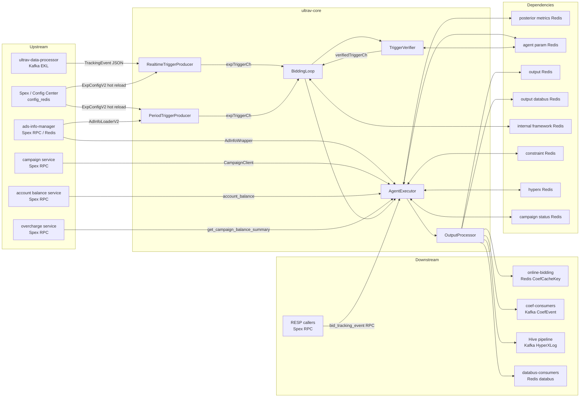

<!-- ads-workspace-gdoc-sync: gdoc_id=1YAlGz-5SaDCcfNH8n31moyPAhKhUnv1cXTSCyoBpgYw gdoc_url=https://docs.google.com/document/d/1YAlGz-5SaDCcfNH8n31moyPAhKhUnv1cXTSCyoBpgYw/edit -->

# ultrav-core

Online bidding coefficient computation service for the ads bidding system, executing bidding strategies for 6 ad verticals.

**Repository**: https://git.garena.com/shopee/deep/paidads-bidding/ultrav-core

---

## Table of Contents

1. [Introduction](#introduction)
2. [Features](#features)
3. [Architecture](#architecture)
   - [System Context](#system-context)
   - [Service Topology](#service-topology)
   - [Data Flow](#data-flow)
4. [Directory Structure](#directory-structure)
5. [Verticals and Deployment](#verticals-and-deployment)
   - [Supported Ad Verticals](#supported-ad-verticals)
   - [Build Targets and Binaries](#build-targets-and-binaries)
   - [Deploy Configuration](#deploy-configuration)
   - [RESP Mode](#resp-mode)
6. [Core Pipeline](#core-pipeline)
   - [Realtime Trigger Path](#realtime-trigger-path)
   - [Period Trigger Path](#period-trigger-path)
   - [BiddingLoop Main Loop](#biddingloop-main-loop)
   - [AgentExecutor Pipeline](#agentexecutor-pipeline)
   - [Output Processing](#output-processing)
7. [Agent Registration and Strategies](#agent-registration-and-strategies)
   - [Agent Interface](#agent-interface)
   - [Product Ads Agents (40)](#product-ads-agents-40)
   - [Shop Ads Agents (5)](#shop-ads-agents-5)
   - [Live Ads Agents (12)](#live-ads-agents-12)
   - [Live Ads Antou Agents (2)](#live-ads-antou-agents-2)
   - [Brand Max Agents (1)](#brand-max-agents-1)
   - [Video Ads Agents (2)](#video-ads-agents-2)
   - [Shared Utilities (agent_util)](#shared-utilities-agent_util)
8. [RESP Mode Details](#resp-mode-details)
   - [Activation Condition](#activation-condition)
   - [Request Processing Flow](#request-processing-flow)
   - [Differences from Normal Mode](#differences-from-normal-mode)
   - [resp_guard Read-Write Protection](#resp_guard-read-write-protection)
9. [Configuration](#configuration)
   - [AppConfig Overview](#appconfig-overview)
   - [DynamicConfig](#dynamicconfig)
   - [FrameworkConfig](#frameworkconfig)
   - [Per-Vertical Config](#per-vertical-config)
   - [AgentOperationConfig](#agentoperationconfig)
   - [BiddingLoop Config](#biddingloop-config)
   - [KafkaConfig Structure](#kafkaconfig-structure)
10. [Trigger Verification and Deduplication](#trigger-verification-and-deduplication)
    - [Interval-based Verification](#interval-based-verification)
    - [Count-based Verification](#count-based-verification)
    - [Executor Lock](#executor-lock)
    - [BigCache Local Cache](#bigcache-local-cache)
11. [Redis Interaction](#redis-interaction)
12. [Kafka Interaction](#kafka-interaction)
13. [Key Data Structures](#key-data-structures)
14. [Development Guidelines](#development-guidelines)
    - [How to Add a New Agent](#how-to-add-a-new-agent)
    - [Agent Utility Libraries](#agent-utility-libraries)
    - [PID Framework](#pid-framework)
    - [MPC Model Utilities](#mpc-model-utilities)
    - [Unit Testing](#unit-testing)
    - [Code Review & Git Workflow](#code-review--git-workflow)
15. [Deployment](#deployment)
    - [Build for Production](#build-for-production)
    - [Release Process](#release-process)
    - [Verifier Offline Validation](#verifier-offline-validation)
    - [Tools](#tools)
16. [Monitoring](#monitoring)
17. [Business Terminology Glossary](#business-terminology-glossary)
18. [Additional Resources](#additional-resources)
19. [Frequently Asked Questions](#frequently-asked-questions)

---

## Introduction

ultrav-core is the **online bidding coefficient computation service** of the ads bidding system. It executes bidding strategies for the following 6 ad verticals:

- **Product Ads**
- **Shop Ads**
- **Live Ads**
- **Live Ads Antou**
- **Brand Max**
- **Video Ads**

**Core workflow**: Consume Kafka tracking events (realtime path) or periodically scan all ads (period path) → generate experiment triggers (ExpTrigger) → verify/deduplicate/lock → run corresponding Agent strategy → output coefficients to Redis/Kafka/Hive/Databus.

**Relationship with ultrav-core-timewindow**: ultrav-core generates triggers directly for each tracking event (no buffering); ultrav-core-timewindow introduces a `TimeWindowProcessor` that buffers events in configurable windows (15s–300s) before batch triggering — suitable for aggregation-based strategies.

**RESP Mode**: The Product vertical additionally supports Spex RPC synchronous request-response mode (`adsbidding.ultravcoreproduct.bid_tracking_event`); other verticals support only async Kafka + Period mode.

**Spex service names**:

| Vertical | Spex serverName |
|---|---|
| Product Ads | `adsbidding.ultravcoreproduct` |
| Shop Ads | `adsbidding.ultravcoreshop` |
| Live Ads | `adsbidding.ultravcorelivead` |
| Live Ads Antou | `adsbidding.ultravcoreliveadantou` |
| Brand Max | `adsbidding.ultravcorebrandmax` |
| Video Ads | `adsbidding.ultravcorevideoad` |

---

## Features

- **Multi-vertical bidding coefficient computation**: Independent Agent strategies for Product/Shop/Live/LiveAntou/BrandMax/Video verticals, producing bidding coefficients (coef).
- **Dual trigger paths**: Realtime path (Kafka TrackingEvent → RealtimeTriggerProducer) and period path (PeriodTriggerProducer full scan), both processed through the unified BiddingLoop.
- **Experiment framework (ExpConfigV2)**: Agent routing by experiment name, supports parallel experiments, A/B bucket splitting, and flexible triggering by event_type with count/interval conditions.
- **Hot-pluggable Agent registration**: Register via `AgentExecutor.RegisterAgent` by name; dynamically routed at runtime via `ExpConfigV2.AgentName`.
- **PID Framework**: Provides `base_pid`, `cold_start_pid`, `subsidy_pid`, `cofund_roi_threshold_pid`, and `custom_pid` variants for PID feedback control of bidding coefficients.
- **MPC Model**: Supports statistical models, calibration (cali), and Redis scatter interpolation for model-driven bidding strategies.
- **RESP Mode (Product vertical)**: Supports synchronous Spex RPC calls; external services send requests via `bid_tracking_event` and receive OutputParamList synchronously.
- **Multi-path output**: OutputProcessor sequentially writes coefficients to output Redis (FlatBuffers), output Kafka (CoefEvent protobuf), Hive Kafka (HyperXLog JSON), and output Databus Redis (aggregated writes).
- **Trigger deduplication and rate limiting**: Three-layer verification (interval/count/last-update) + BigCache local cache + executor lock to prevent duplicate computation.
- **Dynamic config hot reload**: Config updates via Spex Config mechanism (`config.SetAppConfig`) take effect without service restart.

---

## Architecture

### System Context

ultrav-core sits in the paidads-bidding subsystem between the tracking data consumption layer and the online bidding (online-bidding) service. It reads tracking events or full ad lists, computes bidding coefficients via Agents, and pushes results to Redis/Kafka readable by online services.

### Service Topology



**Upstream**

| Service | Protocol | Description |
|---|---|---|
| ultrav-data-processor | Kafka (EKL) | Upstream tracking event stream; filtered by country + event type as realtime trigger input |
| Spex / Config Center | Spex SDK / config_redis | Provides two-layer config (config / agent_operation) with hot reload; Product RESP mode also exposes RPC entry |
| Config Center + config Redis | Config Center SDK / Redis | Provides ExpConfigV2 and strategy params; Product uses config_redis, Shop/Live/Video/BrandMax use ConfigCenterClient |
| ads-info-manager | Spex RPC / Redis | Provides ad metadata (AdInfoLoaderV2 / LiveAdInfoLoaderV2) for period full scans and realtime ad info queries |
| campaign service | Spex RPC | Fetches today's campaign status (CampSurgeLevel/AutoCampLevel/Boost) and campaign calendar via CampaignClient |
| account balance service | Spex RPC | Fetches account balance and cumulative balance snapshot via paidads.account_balance / paidads.valar |
| overcharge service | Spex RPC | Fetches remaining budget (by shop/campaign/placement) via paidads.valar.get_campaign_balance_summary |

**Downstream**

| Service | Protocol | Description |
|---|---|---|
| online-bidding | Redis (CoefCacheKey) | Writes FlatBuffers-serialized coefficients to output Redis for online bidding service to read |
| coef-consumers (legacy + new) | Kafka | Sends CoefEvent protobuf via OutputKafkaProducer (legacy) and NewOutputKafkaProducer |
| Hive pipeline | Kafka | Sends HyperXLog JSON logs (project=ultrav_core) via HiveLogProducer for offline analysis |
| databus-consumers | Redis (databus) | Writes protobuf coefficient data to output_databus Redis; supports single SET and Lua aggregated HSET |
| RESP callers | Spex RPC | In Product RESP mode, external services receive OutputParamList synchronously via bid_tracking_event |

**Dependencies**

| Name | Type | Description |
|---|---|---|
| posterior metrics Redis | datastore | Reads time-window posterior metrics (COUNT/SCALAR: history/daily/hourly/minutely/quarter) |
| agent param Redis | datastore | Read/write `agent_param_v2` keys storing Agent parameter protobuf; BigCache reduces hot key access |
| output Redis | datastore | Writes CoefCacheKey FlatBuffers coefficients (SET+TTL); supports per-country and default client dual-write |
| output databus Redis | datastore | Writes databus protobuf (SET+TTL); supports Lua-script aggregated writes (HSET+EXPIRE) |
| internal framework Redis | datastore | Period ad locks (Pipeline+SetNX+TTL), instance registration (ZADD/ZRank/ZCard), heartbeat, trigger dedup, executor lock |
| constraint Redis | datastore | Vertical-specific constraint/calibration data: ROI CDF, model bid PDF, MPC calibration, subsidy, budget ratios |
| hyperx Redis (Product) | datastore | Product-specific HyperX feature Redis |
| campaign status Redis | datastore | Reads campaign status (HGET) for strategy decisions |

#### Middleware Instance Details

Config Center is loaded from the actual Spex service names initialized by the binaries: `[sp]adsbidding / ultravcoreproduct`, `ultravcoreshop`, `ultravcorelivead`, `ultravcoreliveadantou`, `ultravcorebrandmax`, and `ultravcorevideoad`, item `config` plus `agent_operation`.

| Type | Direction | Concrete Instance | Purpose | Evidence |
|---|---|---|---|---|
| Kafka | Consume | Product `framework_config.tracking_event_kafka`: brokers `di-kafka-stt01-bg1-bootstrap01/02/03-stt-sg.data-infra.shopee.io:9093`, `di-kafka-da01-bg1-bootstrap01/02/03-dallas-us.data-infra.shopee.io:9093`; topics `bidding_tracking_event_my/th/sg/id/ph/vn/tw`, `mkplpaidads_discovery_ads.hyperx_tracking_event_us`; groups `ultrav_core_global`, `ultrav_core_id`, `ultrav_core_ph`, `ultrav_core_vn`, `ultrav_core_tw`, `paidads_mkplpaidads_hyperx_ultrav_core_us` | Product realtime trigger input | `cmd/product_bidding/main.go`, `config/core.go` |
| Kafka | Consume | Shop `shop-ads-data-event-global-live`, `shop-ads-data-event-br-live`; Live/Antou `live-ads-data-event-global-live`, `live-ads-data-event-br-live`; Video `adsbidding_videoads_ultrav_data_processor-global-live`, `adsbidding_videoads_ultrav_data_processor-br-live`; brokers include `kafka.ks_adstracking_live.ap-sg-1-general-b.live.mq.shopee.io:9092`, `kafka.kafka_latam_fe_us.na-us-2-general-a.live.mq.shopee.io:9092`, `kafka.ks_commmonlog_live.ap-sg-1-general-a.live.mq.shopee.io:9092`, `kafka.ks_br_market_live.ap-sg-1-general-c.live.mq.shopee.io:9092` | Content vertical realtime trigger input | `cmd/shop_bidding`, `cmd/live_ad_bidding`, `cmd/live_ad_antou_bidding`, `cmd/video_bidding` |
| Kafka | Produce | Product output topics `product_ads_coef-global-live`, `product_ads_coef-id-live`, `product_ads_coef-tw-live`; Shop `shop_ads_coef-global-live`, `shop_ads_coef-br-live`; Live/Antou `live_ads_coef-global-live`, `live_ads_coef-br-live`; Brand Max `brandmax_ads_coef-global-live`, `brandmax_ads_coef-br-live`; Video `video_ads_coef-global-live`, `video_ads_coef-br-live` | Coefficient events for downstream consumers | `pkg/data/output_kafka_producer`, `pkg/framework/output_processor.go` |
| Kafka | Produce | Hive log topics `mkplpaidads_discovery_ads.hyperx_exp_log`, `mkplpaidads_discovery_ads.hyperx_exp_log_us`, `shop-ads-ultrav-core-global-live`, `shop-ads-ultrav-core-br-live`, `liveads-ultrav-core-bidding-global-live`, `liveads-ultrav-core-bidding-br-live`, `brand-max-ultrav-core-global-live`, `brand-max-ultrav-core-br-live`, `videoads-ultrav-core-bidding-global-live`, `videoads-ultrav-core-bidding-br-live` | Offline HyperX / bidding log stream | `pkg/data/output_hive_kafka_producer` |
| Redis | ReadWrite | Product framework Redis domains: `ftrbx.elasticredis.cloud.shopee.io:10582`, `zzhmu.elasticredis.cloud.shopee.io:10895`, `a91cw.elasticredis.cloud.shopee.io:10391`, `rsp7p.elasticredis.cloud.shopee.io:10392`; output Redis `bhdrr.elasticredis.cloud.shopee.io:10350`, `2mr2q.elasticredis.cloud.shopee.io:10991`; output_databus `rhb8s.elasticredis.cloud.shopee.io:10311`, `eujfa.elasticredis.cloud.shopee.io:10306`; config/hyperx Redis `soefe.elasticredis.cloud.shopee.io:11828`, `0083dcfb33f6dedd.elasticredis.cloud.shopee.io:11828`; constraint Redis `cflft.elasticredis.cloud.shopee.io:10246`, `9cac9f7a85485590.elasticredis.cloud.shopee.io:10523` | Product trigger locks, agent params, coefficient output, databus, config, HyperX, and constraints | `pkg/data/*redis*`, `config/core.go` |
| Redis | ReadWrite | Shop Redis domains: `gkil5.elasticredis.cloud.shopee.io:10243`, `p4bix.elasticredis.cloud.shopee.io:11450`, `0ld4p.elasticredis.cloud.shopee.io:10283`, double-write `mkako.elasticredis.cloud.shopee.io:11103`, `nfd7h.elasticredis.cloud.shopee.io:14117`, output_databus `wj64e.elasticredis.cloud.shopee.io:10338`, `svl1q.elasticredis.cloud.shopee.io:11679`, constraint `757ffc4f637c7500.elasticredis.cloud.shopee.io:10242`, `065de79213c14d62.elasticredis.cloud.shopee.io:10242` | Shop posterior, internal, agent param, output, databus, and constraint data | `config/core.go`, `pkg/data` |
| Redis | ReadWrite | Live/Antou Redis domains: external `7rc0q.elasticredis.cloud.shopee.io:10133`, `imbis.elasticredis.cloud.shopee.io:10133`, `0wn58.elasticredis.cloud.shopee.io:14132`; constraint `pfzyf.elasticredis.cloud.shopee.io:9469`, `0wn58.elasticredis.cloud.shopee.io:14132`; posterior `mvohf.elasticredis.cloud.shopee.io:10469`, `nwhw8.elasticredis.cloud.shopee.io:14131`; internal/trigger/agent/output `uk63v.elasticredis.cloud.shopee.io:11364`, `nz2ch.elasticredis.cloud.shopee.io:11358`, `tyfwn.elasticredis.cloud.shopee.io:14133`, `oih7k.elasticredis.cloud.shopee.io:11357`, `yig7d.elasticredis.cloud.shopee.io:14134` | Live and Antou posterior, constraint, trigger, agent param, and output data | `config/core.go`, `pkg/data` |
| Redis | ReadWrite | Brand Max Redis domains: `vgyor.elasticredis.cloud.shopee.io:10515`, `yvqj8.elasticredis.cloud.shopee.io:11555`, databus `si5ki.elasticredis.cloud.shopee.io:10673`, `paxi6.elasticredis.cloud.shopee.io:11722`, output_databus `wj64e.elasticredis.cloud.shopee.io:10338`, `svl1q.elasticredis.cloud.shopee.io:11679`; Video Redis domains: constraint `omcyj.elasticredis.cloud.shopee.io:10187`, `8lvi2.elasticredis.cloud.shopee.io:11623`, posterior `cgg9d.elasticredis.cloud.shopee.io:10286`, `nitmd.elasticredis.cloud.shopee.io:11624`, internal/trigger/agent/output `cpz5u.elasticredis.cloud.shopee.io:10587`, `z9mag.elasticredis.cloud.shopee.io:10588`, `xrij2.elasticredis.cloud.shopee.io:11622` | Brand Max and Video trigger state, posterior, constraints, output, and databus data | `config/core.go`, `pkg/data` |
| Config Center | Read | `post_data_spex` points to project `ads_bidding`, namespace `post_data_redis_config`; Product experiment config also uses `ads_bidding/product_ads_bidding_aggregation_config` and common `ads_bidding/bidding_common` through config Redis / Config Center clients | Posterior Redis routing and experiment/strategy config | `config/core.go`, `pkg/config_redis`, `pkg/data/post_data_client` |
| DB/FSE/Vespa/S3/ClickHouse | None detected | This repository does not directly read/write DB, FSE, Vespa, S3, or ClickHouse in the scanned code | Storage access is Redis/Kafka/Config Center/Spex RPC only | source scan |

### Data Flow

**Realtime Path**:
```
Kafka TrackingEvent
  → RealtimeTriggerProducer.Transform (JSON deserialization + country filter + GroupKey normalization)
  → Process (iterate ExpConfigV2, generate ExpTrigger)
  → expTriggerCh
  → BiddingLoop.verify (TriggerVerifier)
  → verifiedTriggerCh
  → BiddingLoop.doBidding (LockTriggerExecutor + AgentExecutor.Process)
  → OutputProcessor.ProcessOutput (output Redis → output Kafka → Hive Kafka → databus Redis)
```

**Period Path**:
```
PeriodTriggerProducer (periodic execution)
  → Register CID/TaskID in internal Redis → GetAllAdsInfo → shard by adId%instanceLen
  → LockAds (Pipeline+SetNX) → generate Period ExpTrigger
  → expTriggerCh → [same as realtime path]
```

**RESP Path (Product only)**:
```
Spex RPC bid_tracking_event
  → RESPHandler.handleBidTrackingEvent
  → JSON parse + GroupKey normalization
  → TriggerGenerator.GenerateAllExpTriggers
  → per-trigger VerifyTrigger (NoOp) + AgentExecutor.Process
  → dedup (expName_planBucket_trafficBucket) + sort
  → return OutputParamList (no Redis/Kafka writes)
```

---

## Directory Structure

```
ultrav-core/
├── cmd/                          # Entry points for each vertical service
│   ├── product_bidding/          # Product Ads service (supports RESP mode)
│   ├── shop_bidding/             # Shop Ads service
│   ├── live_ad_bidding/          # Live Ads service
│   ├── live_ad_antou_bidding/    # Live Ads Antou service
│   ├── brand_max_bidding/        # Brand Max service (Period only)
│   ├── video_bidding/            # Video Ads service
│   └── product_bidding_agent_verifier/  # Offline verification tool
├── config/                       # Configuration definitions
│   ├── core.go                   # AppConfig / FrameworkConfig / KafkaConfig
│   ├── dynamic/                  # AgentOperationConfig dynamic config
│   ├── product_ads/              # ProductAdsConfig
│   ├── product_bidding_runonce/  # Lightweight AppConfig for exp_config_publisher tool (namespace: ultrav_core_cmd)
│   ├── shop_ads/                 # ShopAdsConfig
│   ├── live_ads/                 # LiveAdsConfig
│   ├── brand_max/                # BrandMaxConfig
│   └── video_ads/                # VideoAdsConfig
├── deploy/                       # Deployment JSON configs
├── gen/                          # Auto-generated protobuf code (do not modify manually)
├── internal/
│   ├── agent/
│   │   ├── agent_base/           # AgentBase / AuMonitor / AuLogger
│   │   ├── agent_util/           # Shared utilities (PID Framework / MPC Model / CDF / aggregated_storage, etc.)
│   │   ├── product_ad_agent/     # Product Ads Agent implementations (40)
│   │   ├── shop_ads_agent/       # Shop Ads Agent implementations (5)
│   │   ├── live_ads_agent/       # Live Ads Agent implementations (12)
│   │   ├── brand_max_agent/      # Brand Max Agent implementations (1)
│   │   └── video_ads_agent/      # Video Ads Agent implementations (2)
│   ├── core/                     # BiddingLoop core framework (dependency.go / loop.go / config.go)
│   ├── exporter/                 # Prometheus metric exporters
│   ├── model/                    # Core data structures (ExpTrigger / ExpConfigV2 / OutputParam, etc.)
│   ├── tagreader/                # tagclient.TagReader wrapper; initializes model.CheckAdTagBit at startup
│   └── service/
│       ├── agent_executor/       # AgentExecutor + ResourceContext + Agent interface
│       ├── output_processor/     # OutputProcessor (multi-destination writes)
│       ├── resp_handler/         # RESP mode Spex processor
│       ├── trigger_producer/     # RealtimeTriggerProducer / PeriodTriggerProducer
│       └── trigger_verifier/     # TriggerVerifier (degradation + verification routing)
├── pkg/
│   ├── data/                     # Data access layer (Redis / Kafka / ad info, etc.)
│   ├── http_handler/             # HTTP endpoints (/metrics /ping /debug/pprof /log)
│   └── util/                    # Common utilities (Prometheus export / logging / environment detection)
├── sp_proto/                     # Spex protobuf definitions
├── tool/                         # Utility tools
│   ├── exp_config_publisher/     # Publish experiment config tool
│   ├── output_getter/            # Decode Redis coefficient tool
│   └── hash_lib_tester/          # Hash library test tool
├── go.mod
└── Makefile
```

---

## Verticals and Deployment

### Supported Ad Verticals

| Vertical | cmd directory | Trigger modes | Agent count |
|---|---|---|---|
| Product Ads | `cmd/product_bidding` | Realtime + Period + RESP | 40 |
| Shop Ads | `cmd/shop_bidding` | Realtime + Period | 5 |
| Live Ads | `cmd/live_ad_bidding` | Realtime + Period | 12 |
| Live Ads Antou | `cmd/live_ad_antou_bidding` | Realtime + Period | 2 |
| Brand Max | `cmd/brand_max_bidding` | **Period only** | 1 |
| Video Ads | `cmd/video_bidding` | Realtime + Period | 2 |

### Build Targets and Binaries

| Makefile target | Output binary | Spex serverName | Notes |
|---|---|---|---|
| `build_product_ads_svc` | `bin/ultrav-core-product` | `adsbidding.ultravcoreproduct` | Supports RESP mode |
| `build_shop_ads_svc` | `bin/ultrav-core-shop` | `adsbidding.ultravcoreshop` | |
| `build_live_ads_svc` | `bin/ultrav-core-livead` | `adsbidding.ultravcorelivead` | |
| `build_live_ads_antou_svc` | `bin/ultrav-core-livead-antou` | `adsbidding.ultravcoreliveadantou` | |
| `build_brand_max_svc` | `bin/ultrav-core-brand-max` | `adsbidding.ultravcorebrandmax` | Period only |
| `build_video_ads_svc` | `bin/ultrav-core-video` | `adsbidding.ultravcorevideoad` | |
| `build_product_ads_verifier` | `bin/agent_verifier` | — | Offline verification tool |

Build all services at once:
```bash
make build-all
```

### Deploy Configuration

Each JSON file under `deploy/` corresponds to one deployment unit. Key fields:

| Field | Description |
|---|---|
| `project_name` | `adsbidding` |
| `module_name` | Vertical module name (e.g., `ultravcoreproduct`) |
| `build.commands` | Invokes Makefile target (e.g., `make build_product_ads_svc`) |
| `docker_image.base_image` | `harbor.shopeemobile.com/shopee/golang-base:1.24.4-20` |
| `run.enable_prometheus` | `true`, enables Prometheus metric collection |
| `run.smoke.endpoint` | `/ping`, timeout 5s, interval 10s, max retry 120 times |
| `run.check.endpoint` | `/ping`, triggers alert after 10 consecutive failures |
| `run.enable_spex_config_key_fetch` | `true`, enables Spex config fetching |

### RESP Mode

RESP (Request-Response) mode is only supported by the Product vertical, activated when the `SDU_ID` environment variable is non-empty:

```go
// cmd/product_bidding/main.go
if util.IsRESPDeployment() {  // SDU_ID != ""
    runRESPMode()
} else {
    runNormalMode()
}
```

In RESP mode:
- Registers Spex processor `adsbidding.ultravcoreproduct.bid_tracking_event`
- Dependencies are initialized as a lightweight subset (no Kafka consumer/producer, no output Redis writes)
- All Redis clients are wrapped in read-only mode via `resp_guard`

---

## Core Pipeline

### Realtime Trigger Path

`internal/service/trigger_producer/realtime_producer.go`

1. EKL Kafka consumer (`DispatcherByKey` + 1000 workers) consumes tracking event topic
2. `Transform`: JSON deserialization to `TrackingEvent`, filter by country
3. `Process`: Iterate all `ExpConfigV2`, generate `ExpTrigger` for each matching experiment config (GroupKey filter, bucket splitting)
4. Push `ExpTrigger` to `expTriggerCh` (bounded channel, capacity configured by `RealtimeTriggerBufferCount`)

### Period Trigger Path

`internal/service/trigger_producer/period_producer.go`

1. Periodic execution (interval configured by `PeriodTriggerIntervalMinutes`/`PeriodTriggerIntervalSeconds`, default 5 minutes)
2. On startup and every 10 seconds, registers the instance to internal framework Redis (ZADD), retrieves its rank (ZRank) and total count (ZCard) for sharding; if `MinInstanceCount` is configured, `instanceLen` = `max(actualCount, MinInstanceCount)`
3. Fetch full ad list from ads-info-manager (`GetAllAdsInfo`)
4. Shard by `adId % instanceLen`, only process ads assigned to this instance
5. Lock ads in batches (100 ads/batch, 5 workers in parallel) via Pipeline+SetNX (`LockAds`) to prevent duplicate processing across instances
6. Iterate `ExpConfigV2` with `period_trigger` config, generate Period `ExpTrigger`
7. Push to `expTriggerCh` (default buffer 100,000, with rate limiting `PeriodTriggerAdsRateLimit`)

### BiddingLoop Main Loop

`internal/core/loop.go`

```
BiddingLoop.Run()
├── goroutine: realtimeTriggerProducer.Start()
├── goroutine: periodTriggerProducer.Start()
├── goroutine: consume realtime/period trigger channels
│   └── getWorker(verifierWorkerCh) → go verify(ctx, expTrigger)
└── goroutine: consume verifiedTriggerCh
    └── getWorker(agentWorkerCh) → go doBidding(ctx, expTrigger)
```

Concurrency control (`internal/core/config.go`):
- `VerifierConcurrency`: verifier worker pool size (default 512, max 4096)
- `BiddingExecutorConcurrency`: agent worker pool size (default 256, max 1024)
- `BiddingExecutorChannelBuffer`: verifiedTriggerCh buffer (default = BiddingExecutorConcurrency × 10)

Brand Max uses `RunPeriodTrigger()` — only consumes the period channel; realtime producer is an empty implementation (`&trigger_producer.RealtimeTriggerProducer{}`).

### AgentExecutor Pipeline

`internal/service/agent_executor/agent_executor.go`

```
AgentExecutor.Process(ctx, trigger)
1. Look up AgentInitFunc for trigger.AgentName in agentInitMap
2. Invoke AgentInitFunc() to instantiate Agent
3. Read debug_mode and log_downgrade_rate from ExpConfigV2.ExtraParam
4. agent_base.InitBase(trigger, debugMode, logDowngradeRate)
   - Set local timezone (LoadLocation(country))
   - Initialize AuMonitor (Prometheus metrics)
   - Initialize AuLogger (structured logs + sampling degradation)
5. agent.Process(ctx, agentBase, resourceContext) → *OutputParam
```

### Output Processing

`internal/service/output_processor/output_processor.go`

OutputProcessor executes outputWriters sequentially (stops on first error):

| Order | Writer | Target | Notes |
|---|---|---|---|
| 1 | output_redis | output Redis | FlatBuffers CoefCacheKey, SET+TTL |
| 2 | output_kafka_producer | Kafka CoefEvent topic | Legacy CoefEvent protobuf |
| 3 | new_output_kafka_producer | Kafka (new topic) | New CoefEvent protobuf (Product only) |
| 4 | output_hive_kafka_producer | Kafka HyperXLog topic | HyperXLog JSON log |
| 5 | output_databus | databus Redis | Protobuf databus data |

OutputParam control flags:
- `DisableToWriteRedis`: skip output Redis write
- `DisableToWriteHive`: skip Hive log write
- `EnableToWriteDatabus`: default false (must be explicitly enabled)

---

## Agent Registration and Strategies

### Agent Interface

`internal/service/agent_executor/dependency.go`

```go
type Agent interface {
    GetAgentName() string
    Process(ctx context.Context, agentBase *agent_base.AgentBase, resourceContext *ResourceContext) (*model.OutputParam, error)
}
```

Registration example (Product vertical, `cmd/product_bidding/agent_registor.go`):

```go
agentExecutor.RegisterAgent(func() agent_executor.Agent { return roi2.New() })
```

### Product Ads Agents (40)

`internal/agent/product_ad_agent/`

| Agent Name | Directory | Category |
|---|---|---|
| demo | demo/ | Debug/example |
| roi2 | roi2/ | ROI: target ROI PID control |
| roi1 | roi1/ | ROI: ROI v1 |
| roi3 | roi3/ | ROI: ROI v3 |
| roi2_diff_entrance | roi2_diff_entrance/ | ROI: differentiated by entrance |
| roi2_perf_predictor | roi2_perf_predictor/ | ROI: performance predictor |
| roi3_ctr_uplift | roi3_ctr_uplift/ | ROI: ROI v3 CTR uplift |
| roi3_multi_dimensions | roi3_multi_dimensions/ | ROI: multi-dimensional ROI v3 |
| multi_dim_roi_control | roi3_cofund/multi_dim_roi_control/ | ROI: multi-dimensional ROI control |
| simpleroi2 | simpleroi2/ | Simple Mode ROI v2 |
| simpleroi2_diff_entrance | simpleroi2_diff_entrance/ | Simple Mode ROI v2 differentiated entrance |
| ecpc | ecpc/ | eCPC bidding |
| gmv_calibrator | gmv_calibrator/ | GMV: calibration |
| gmv_max_strategy | gmv_max/ | GMV: maximization strategy |
| GMS | GMS/ | GMV: GMS |
| large_sellers_gmv_uplift | large_sellers_gmv_uplift/ | GMV: large seller GMV uplift |
| subsidy | subsidy/ | Subsidy: subsidy control |
| subsidy_uplift | subsidy_uplift/ | Subsidy: subsidy uplift |
| subsidy_1cpa_budget | subsidy/subsidy_1cpa_budget/ | Subsidy: 1CPA budget |
| subsidy_traffic_budget | subsidy/subsidy_traffic_budget/ | Subsidy: traffic budget |
| cofund_roi_threshold | roi3_cofund/cofund_roi_threshold/ | Cofund: ROI threshold |
| cofund_budget_ratio | roi3_cofund/cofund_budget_ratio/ | Cofund: budget ratio |
| platform_share_ratio | roi3_cofund/platform_share_ratio/ | Cofund: platform share ratio |
| voucher_pacing_control | roi3_cofund/voucher_pacing_control/ | Cofund: voucher pacing control |
| package_budget_control | roi3_cofund/package_budget_control/ | Cofund: package budget control |
| budget_control | budget_control/ | Budget: control |
| bucket_budget | bucket_budget/ | Budget: bucket budget |
| budget_unification | budget_unification/ | Budget: unification; outputs `BudgetUnificationInfo` (account balance/daily budget/weekly budget/realtime remaining) to CoefExtra and Databus; computes `UnderBidFlag7d` (marks under-bidding when 7d cost < 7d ADVV/GMV) |
| pacing | pacing/ | Pacing control |
| campaign_surge | campaign_surge/ | Campaign: surge control |
| campaign_deduction | campaign_deduction/ | Campaign: charge calibration |
| target_roi2_deduction | target_roi2_deduction/ | Target ROI deduction |
| manual_transfer | manual_transfer/ | Manual mode transfer |
| order_priority | order_priority/ | Order priority |
| universal_order_priority (GMS) | universal_order_priority/GMS/ | Universal order priority (GMS): order priority with GMS cold-start support (gms_cold_start_simple/target + mp_cold_start_target config variants) |
| pctr_deduction_cali | pctr_deduction_cali/ | pCTR charge calibration: adjusts manualCoef based on daily Advv/GMV-cost ratio (outer layer) and per-entrance click/pCTR ratio (inner layer); three config variants — `v0`, `cold_start_v0`, `multi_item_v0`; logs intermediate state via `OutputParam.Trace` |
| ads_info_snapshot | ads_info_snapshot/ | Ad info snapshot |
| posterior_data_monitor | posterior_data_monitor/ | Posterior data monitoring |
| mpc_model_monitor | mpc_model_monitor/ | MPC model monitoring |
| unified_model_bid | unified_model_bid/ | Unified model bidding: statistical model (Wa/Ka/Wb/Kb/Alpha params + 96-quantile PDF interpolation) for cold-start / empty-order / NPB / new-advertiser / GMS cold-start (simple + target) / GMS empty-order / MP cold-start scenarios; writes ModelBidCoef to AgentParam and outputs SellerBidRatio / BoostCostRatioMap |

### Shop Ads Agents (5)

`internal/agent/shop_ads_agent/`

| Agent Name | Function |
|---|---|
| auto_model_target_roas | Auto mode target ROAS |
| auto_model_cold_start | Auto mode cold start |
| manual_model_ecpc_strategy | Manual mode eCPC strategy |
| shop_gmv_calibrator | Shop GMV calibration |
| shop_ads_target_roas_union_bidding_strategy | Target ROAS union bidding strategy |

### Live Ads Agents (12)

`internal/agent/live_ads_agent/`

| Agent Name | Function |
|---|---|
| demo | Debug/example |
| live_target_roi2 | Live target ROI v2 |
| live_max_gmv2_roi | Live max GMV (ROI mode) |
| live_max_gmv2_two_stage | Live max GMV (two-stage) |
| live_max_gmv2_budget | Live max GMV (budget control) |
| gmv_calibrator | Live GMV calibration |
| live_target_roi2_mpc | Live target ROI v2 (MPC model) |
| target_roi2_antou | Live Antou target ROI v2 |
| live_max_view | Live max views |
| live_max_view_mpc | Live max views (MPC model) |
| live_max_view2_mpc | Live max views v2 (MPC model) |
| live_max_gmv_unification | Live GMV unified bidding |

### Live Ads Antou Agents (2)

`cmd/live_ad_antou_bidding/` (shares live_ads_agent code)

| Agent Name | Function |
|---|---|
| demo | Debug/example |
| target_roi2_antou | Antou targeted ROI v2 |

### Brand Max Agents (1)

`internal/agent/brand_max_agent/`

| Agent Name | Function |
|---|---|
| budget_pacing | Brand Max budget pacing control: PID feedback on daily budget utilization (budgetUsage/budgetCoef); additionally outputs DiscountFactor (antou-specific — set to 1.0 when DailyMingtouRev/DailyRev ≥ MingtouRevThreshold, otherwise 0); outputs five model quality thresholds (PctrThreshold / PatcThreshold / PctatcThreshold / PcrThreshold / PctcvrThreshold) via PlatformRevRoiCoefMap, adjusted dynamically alongside the pacing coefficient |

### Video Ads Agents (2)

`internal/agent/video_ads_agent/`

| Agent Name | Function |
|---|---|
| video_max_gmv | Video ads GMV maximization |
| video_max_view | Video ads max views |

### Shared Utilities (agent_util)

`internal/agent/agent_util/`

| Utility | File | Function |
|---|---|---|
| FX rate conversion | common.go | Currency conversion tools |
| Time utilities | utils.go | Local timezone conversion, time window calculation |
| extra_param parsing | extra_param.go | Read bool/float64/int/string types from `ExtraParam` |
| AggregatedStorage | aggregated_storage.go | Aggregated storage metadata |
| entrance_utils | entrance_utils.go | Entrance-related utility functions |
| CDF utility | cdf.go | CDF calculation for ROI CDF / PDF interpolation from constraint Redis |
| auto_formatter | auto_formatter.go | Auto-formatting utility |
| pid_framework | pid_framework/ | PID framework (see below) |
| mpc_model | mpc_model/ | MPC statistical model |
| mpc_model_util | mpc_model_util/ | MPC utility functions |
| mpc_model_cali_util | mpc_model_cali_util/ | MPC calibration utilities |
| feed_back_util | feed_back_util/ | Feedback control utilities |
| model_bid_util | model_bid_util/ | Model-based bid utilities: `LoadModelBidPdf` (load 96-quantile PDF from constraint Redis), `LoadModelBidParams`/`LoadUnifiedModelBidParams` (load Wa/Ka/Wb/Kb/Alpha by L2Category or pricingType, supporting both L2Category and GMS pricingType dimensions), `LoadCampaignAov`/`LoadPricingTypeDefaultAov` (load campaign or category default AOV) |

---

## RESP Mode Details

### Activation Condition

When environment variable `SDU_ID` is non-empty, `util.IsRESPDeployment()` returns true and `main()` calls `runRESPMode()`.

### Request Processing Flow

`internal/service/resp_handler/handler.go`

```
handleBidTrackingEvent(ctx, req, resp)
1. Parse req.TrackingEventJson → TrackingEvent
2. Iterate GroupKeysMap, normalize types via configCli.GetEventValueByGroupKeyType
3. triggerGen.GenerateAllExpTriggers(&trackingEvent) → []ExpTrigger
4. For each trigger:
   a. triggerVerifier.VerifyTrigger (NoOp, always returns true)
   b. agentExecutor.Process(ctx, trigger) → OutputParam
   c. Dedup key = expName_planBucketId_trafficBucketId
5. Convert deduplicated OutputParam to OutputParamProto
6. Sort by RespKey, return response.OutputParamList
```

### Differences from Normal Mode

| Dimension | Normal Mode | RESP Mode |
|---|---|---|
| Trigger source | Kafka async | Spex RPC sync |
| Execution | Async goroutine pool | Sync sequential |
| Verifier | Real verification (interval/count/last-update) | NoOp (always passes) |
| Output | output Redis + Kafka + Hive + Databus | No writes, returns OutputParamList only |
| Redis permissions | Full read-write | resp_guard read-only wrapper |
| Dependency scale | Full (Kafka + all Redis) | Lightweight (no Kafka consumer/producer) |

### resp_guard Read-Write Protection

`pkg/data/resp_guard/`

In RESP mode, all Redis DAIs are wrapped via `resp_guard`:
- `resp_guard.NewReadOnlyAgentParamDai`: Wraps AgentParamDai as read-only (Get works normally, Set returns ErrReadOnly)
- `resp_guard.GuardGeneralRedisClient`: Sets write hooks on constraint/hyperx/databus Redis clients; write operations return read-only error
- `resp_guard.NewNoOpTriggerVerifier`: TriggerVerifier always returns (true, nil)

---

## Configuration

### AppConfig Overview

`config/core.go`

Config is hot-loaded via Spex Config mechanism (key = `"config"`, namespace = `"ultrav_core"`):

```go
type AppConfig struct {
    DynamicConfig    DynamicConfig
    FrameworkConfig  FrameworkConfig
    ProductAdsConfig product_ads.ProductAdsConfig
    ShopAdsConfig    shop_ads.ShopAdsConfig
    LiveAdsConfig    live_ads.LiveAdsConfig
    BrandMaxConfig   brand_max.BrandMaxConfig
    VideoAdsConfig   video_ads.VideoAdsConfig
}
```

### DynamicConfig

| Field | Type | Description |
|---|---|---|
| `log_level` | string | Log level (debug/info/fatal) |
| `graceful_period` | string | Graceful shutdown timeout (e.g., `"30s"`), default 30s |
| `countries` | []string | Enabled country list (builds `CountriesMap` for filtering) |
| `enable_get_remain_budget` | bool | Whether to enable remaining budget queries |

### FrameworkConfig

**Kafka config**:

| Field | Description |
|---|---|
| `tracking_event_kafka` | Tracking event consumer config |
| `output_kafka_producer` | Coefficient Kafka producer (legacy) |
| `new_output_kafka_producer` | Coefficient Kafka producer (new, Product only) |
| `hive_log_producer` | Hive log Kafka producer |

**Redis config**:

| Field | Description |
|---|---|
| `internal_framework_redis` | Internal framework Redis (locks / instance registration / heartbeat) |
| `agent_param_redis` | Agent parameter Redis |
| `output_redis` | Coefficient output Redis |
| `output_databus` | Databus output Redis |
| `double_write_output_redis` | Optional secondary output Redis for dual-write |
| `common_post_data_redis` | (Deprecated — use `post_data_spex`) Posterior data Redis |

**Posterior data config**:

| Field | Description |
|---|---|
| `post_data_spex` | Spex-based posterior data client config (preferred; replaces `common_post_data_redis`) |

**TTL and concurrency params**:

| Field | Description |
|---|---|
| `output_redis_ttl_minutes` | output Redis key TTL (minutes) |
| `output_databus_ttl_minutes` | databus Redis key TTL (minutes) |
| `lock_redis_ttl_minutes/seconds` | Ad lock TTL |
| `period_trigger_interval_minutes/seconds` | Period trigger interval |
| `period_trigger_buffer_count` | PeriodTriggerProducer channel buffer |
| `period_trigger_ads_rate_limit` | Period trigger ad rate limit (items/sec) |
| `min_instance_count` | Minimum instance count for Period trigger sharding (when actual instance count is below this value, sharding uses this minimum to avoid overloading a single instance) |
| `realtime_trigger_buffer_count` | RealtimeTriggerProducer channel buffer |
| `plan_bucket_hash_log_rate` | Sampling rate for logging plan bucket hash computation |
| `verifier_downgrade_rate` | Global verifier degradation rate (0~1) |
| `verifier_local_cache_soft_ttl_seconds` | BigCache soft TTL (seconds) |
| `verifier_downgrade_rate_by_event` | Per-event-type degradation rates |

### Per-Vertical Config

**ProductAdsConfig** (`config/product_ads/`):

| Field | Description |
|---|---|
| `AdsInfoManager` | ads-info-manager Spex RPC config |
| `ConfigRedis` | config_redis experiment config Redis |
| `ConstraintRedis` | Constraint Redis (ROI CDF/PDF/MPC calibration, etc.) |
| `HyperxRedis` | HyperX feature Redis |
| `DatabusRedis` | Databus Redis |
| `CommonConfigCenterAddress` | Common Config Center address |
| `BusinessConfigCenterAddress` | Business Config Center address |

**ShopAdsConfig**, **LiveAdsConfig**, **BrandMaxConfig**, **VideoAdsConfig** have similar structure with their own `AdsInfoManager`, `ConstraintRedis`, `ConfigCenterAddress` fields.

### AgentOperationConfig

`config/dynamic/` (dynamic config, key = `"agent_operation"`)

| Field | Description |
|---|---|
| `LogDowngradeRate` | Global log sampling degradation rate (0~1; overridable via extra_param) |
| `ManualRatioForShopCost` | Manual mode shop cost ratio |
| `DailyBudgetAdjustableCoefList` | Daily budget adjustable coefficient list |

### BiddingLoop Config

`internal/core/config.go`

| Field | Default | Max | Description |
|---|---|---|---|
| `VerifierConcurrency` | 512 | 4096 | Verifier worker pool size |
| `BiddingExecutorConcurrency` | 256 | 1024 | Agent worker pool size |
| `BiddingExecutorChannelBuffer` | Concurrency × 10 | — | verifiedTriggerCh buffer size |

Executor lock TTL: `biddingLockDuration = 5 * time.Second` (hardcoded).

### KafkaConfig Structure

```go
type KafkaConfig struct {
    Brokers           []string
    Topics            []string
    User, Password    string
    Mechanism         string  // SASL mechanism
    GroupId           string
    RateLimit         int
    OffsetsInitial    int64
    CompressionCodec  int
    CountryKafkaConfigs []CountryKafkaConfig  // Per-country overrides
}
```

`CountryKafkaConfigs` supports per-country broker/topic/consumer group configuration for traffic isolation in multi-region deployments. When non-empty, EKL creates independent consumers per country; these take priority over the top-level `KafkaConfig`.

---

## Trigger Verification and Deduplication

`pkg/data/agent_param_redis/` (implements the `TriggerVerifier` interface)

### Interval-based Verification

- Redis key: `exp_trigger_last:{expName}:{groupKeyString}`
- Operation: `SetNX + TTL` (TTL = `trigger_condition.interval_second`)
- Logic: If SetNX succeeds (key doesn't exist), it means the interval has elapsed since the last trigger — allow execution

### Count-based Verification

- Redis key: `exp_trigger_cnt:{expName}:{groupKeyString}`
- Operation: `Incr + Expire` (expiry = 6h)
- Logic: When count reaches `trigger_condition.count`, trigger execution and let the counter reset via Expire

There is also last-update-interval verification (`last_update_interval_second`): reads the CoefCacheKey from output Redis, decodes FlatBuffers to get the last update timestamp, triggers if elapsed time exceeds the configured interval.

### Executor Lock

- Redis key: `lock_exe:{expName}:{groupKeyString}`
- Operation: `SetNX + TTL = 5s`
- Logic: Ensures the same trigger key is not processed concurrently; called in `BiddingLoop.doBidding`

### BigCache Local Cache

Uses `github.com/allegro/bigcache/v2` for local caching in the agent_param_redis layer:
- Soft TTL configured by `VerifierLocalCacheSoftTTLSeconds`
- Reduces hot key pressure on agent param Redis for high-frequency triggers

Degradation mechanism:
- `VerifierDowngradeRate`: Global random degradation (skip verification, return invalid directly)
- `VerifierDowngradeRateByEvent`: Per-event-type (IMP/CLICK/ORDER/PERIOD/DEDUCTION_IMP) degradation rates

---

## Redis Interaction

| Key Format | Command | Redis Instance | Purpose |
|---|---|---|---|
| `agent_param_v2:{expName}:{groupKeyString}` | GET / SET+TTL | agent_param_redis | Agent PID parameter read/write |
| `exp_trigger_last:{expName}:{groupKeyString}` | SetNX+TTL | agent_param_redis | Interval verification |
| `exp_trigger_cnt:{expName}:{groupKeyString}` | Incr+Expire | agent_param_redis | Count verification |
| `lock_exe:{expName}:{groupKeyString}` | SetNX+TTL=5s | agent_param_redis | Executor lock |
| `CoefCacheKey(idType,country,id,bucketId,coefType)` | SET+TTL | output_redis | Coefficient output (FlatBuffers) |
| `databus_{idType}_{country}_{id}_{bucketId}_{coefType}` | SET+TTL | output_databus | Databus normal write |
| `databus_aggregated_{idType}_{country}_{parentId}` | HSET+EXPIRE (Lua) | output_databus | Databus aggregated write |
| `ultrav:cid:{cid}` | ZADD / ZRank / ZCard | internal_framework | Instance registration and sharding |
| `ultrav:heartbeat` | HSET / HGetAll / HDel | internal_framework | Instance heartbeat |
| `ultrav:lock_ads:{adId}` | Pipeline+SetNX+TTL | internal_framework | Period ad lock |
| `camp:CAMPAIGN_STATUS_{country}_{date}` | HGET | campaign_status_redis | Campaign status query |
| Constraint data (vertical-specific keys) | HGet / Get | constraint_redis | ROI CDF, PDF, MPC calibration, subsidy, budget ratios |
| `coldstart_bid:pdf:{country}:{pricingType}:{quarter_index}` | GET | constraint_redis | unified_model_bid loads 96-quantile PDF data (JSON or FlatBuffers) |
| `coldstart_bid:cats_params:{country}:{pricingType}:{catID}` | GET | constraint_redis | unified_model_bid loads L2Category model params (Wa/Ka/Wb/Kb/Alpha) |
| `coldstart_bid:pricingtype_params:{country}:{pricingType}` | GET | constraint_redis | unified_model_bid loads GMS pricingType-level model params |
| `coldstart_bid:campaign_aov:{country}:{pricingType}:{campaignId}` | GET | constraint_redis | Load campaign-level AOV (average order value) |
| `log_replay_bid_coef:{country}_{adsId}` | HGET (field: log_replay_coef) | constraint_redis | order_priority loads log-replay bid coefficient lower bound (in 1/10000 units) |
| `log_replay_ub:{country}_{adsId}_{coef*10000}` | HGET (field: prev) | constraint_redis | order_priority loads pRev per coefficient bracket for upper-bound calculation |
| `boost_support_databus:{country}_{campaignId}_{date}` | GET (7-day lookback) | output_databus | order_priority reads Boost campaign budget info (BoostBudgetInfo: traffic/voucher budget, cost, remaining) |
| HyperX feature data | Get | hyperx_redis (Product) | Product HyperX features |

---

## Kafka Interaction

### Tracking Event Consumer

- EKL `DispatcherByKey` (`pkg/data/` wrapper), 1000 worker goroutines
- Message format: JSON, deserialized to `types.TrackingEvent`
- Filter: by country (`DynamicConfig.CountriesMap`)

### Coef Event Producer

- **Legacy OutputKafkaProducer**: Key = CoefCacheKey string, Value = FlatBuffers CoefBytes
- **NewOutputKafkaProducer** (Product only): Same format, different topic
- Message type: protobuf CoefEvent

### Hive Log Producer

- `pkg/data/output_hive_kafka_producer/`
- Message format: HyperXLog JSON (project=`ultrav_core`)
- Key fields: `exp_name`, `agent_name`, `country`, `id`, `coef`, `target_roi`, `pid_coef`, `mpc_e_gmv`, `daily_metrics_*`, `rt_remain_budget`, `daily_budget`, `account_balance`, etc. (`HiveExtraFields`)

---

## Key Data Structures

### ExpTrigger

```go
type ExpTrigger struct {
    ExpConfigV2   *ExpConfigV2
    ExpName       string         // = StrategyName + "_" + Version
    AgentName     string
    StrategyId    uint32
    CoefType      int32
    Country       string
    IdType        int32
    Id            string
    AbtestBucket  AbtestBucket   // {PlanBucketId, TrafficBucketId}
    GroupKeys     []string
    GroupKeyValues []any
    GroupKeyString string
    GroupKeysMap  map[string]any
    EventType     string         // IMP / CLICK / ORDER / PERIOD / DEDUCTION_IMP
    Timestamp     int64
}
```

### ExpConfigV2

```go
type ExpConfigV2 struct {
    Enabled           bool
    ExpName           string        // StrategyName + "_" + Version (constructed at runtime)
    StrategyName      string
    Version           string
    AgentName         string
    CoefType          int32
    IdType            int32
    AbtestBucketConfig AbtestBucketConfig  // {PlanBucketList, TrafficBucketList}
    GroupKeys         []string
    GroupKeyFilters   map[string][]any
    TriggerConditions map[string]TriggerCondition  // event_type → {Count, IntervalSecond, LastUpdateIntervalSecond}
    GenPeriodTriggerValueSets map[string][]any
    ExtraParam        map[string]any
}
```

### OutputParam

```go
type OutputParam struct {
    StrategyName, Version  string
    StrategyId             uint32
    CoefType               int32
    Country                string
    IdType                 int32
    Id                     string
    TrafficBucketId, PlanBucketId  int64
    EventType              string
    EventTimestamp, EmissionTimestamp  int64
    // Output
    CoefInfo               CoefInfo               // {Coef float64, SoftRemove bool, Extra *CoefExtra}
    CoefInfoByEntrance     map[int32]CoefInfo      // Per-entrance differentiated coefficients
    // Hive log
    AgentParam             any
    GroupKeyMap            map[string]any
    Trace                  any            // Agent-specific trace for intermediate state (e.g., PctrDeductionCali.Trace)
    HiveExtraFields        *HiveExtraFields
    // Databus
    DataBusData            *databus.Data
    // Aggregated storage
    AggregatedStorage      *AggregatedStorageMetadata
    // Control flags
    DisableToWriteRedis    bool
    DisableToWriteHive     bool
    EnableToWriteDatabus   bool
}
```

### AgentAdsInfo / PeriodAdsInfo

- `AgentAdsInfo` (`internal/model/internal_ads_info.go`): Rich ad runtime info including balance query results and budget unification data; used in Agent.Process for decision-making
- `PeriodAdsInfo` (`internal/model/period_ads_info.go`): Lightweight Period scan ad row (ids, placement, pricing, entrances, campaign period, plan buckets); used by PeriodTriggerProducer

---

## Development Guidelines

### How to Add a New Agent

1. Create a new package under `internal/agent/{vertical}_agent/` (e.g., `new_agent/`)
2. Implement the `Agent` interface:
   ```go
   type NewAgent struct{}

   func New() *NewAgent { return &NewAgent{} }

   func (a *NewAgent) GetAgentName() string {
       return "new_agent"  // Must match ExpConfigV2.AgentName
   }

   func (a *NewAgent) Process(ctx context.Context, agentBase *agent_base.AgentBase,
       resourceContext *agent_executor.ResourceContext) (*model.OutputParam, error) {
       // Implement bidding logic
   }
   ```
3. Register in the corresponding `cmd/*/main.go` (or `cmd/product_bidding/agent_registor.go`):
   ```go
   agentExecutor.RegisterAgent(func() agent_executor.Agent { return new_agent.New() })
   ```
4. Add corresponding `ExpConfigV2` to Spex/Config Center (`agent_name` must match `GetAgentName()`)
5. Run unit tests: `make unittest`

### Agent Utility Libraries

- **AgentBase** (`internal/agent/agent_base/agent_base.go`):
  - `agentBase.LocalEventTime`: Local timezone time of the event
  - `agentBase.LocalCurrentTime`: Current local timezone time
  - `agentBase.Monitor` (`AuMonitor`): Dynamic Prometheus metrics, `RecordCounter/RecordGauge`
  - `agentBase.Log` (`AuLogger`): Structured logging with `logDowngradeRate` sampling

- **ResourceContext** (`internal/service/agent_executor/agent_executor.go`):
  - `CommonResource`: `AdsInfoDai`, `PosteriorDataDai`, `AgentParamDai`, `BudgetUnificationDataDai`
  - `ProductAdsResource`: `ConstraintRedisDai`, `HyperxRedisDai`, `CampaignStatusDai`, `DatabusRedisDai`
  - `ShopAdsResource`: `BrandAdsCampaignDai`, `ShopAdsPosteriorDataDai`, `ConstraintRedisDai`
  - `LiveAdsResource`: `ExternalRedisDai`, `ConstraintRedisDai`
  - `VideoAdsResource`: `ConstraintRedisDai`

- **extra_param utilities** (`internal/agent/agent_util/extra_param.go`):
  ```go
  agent_util.GetBool(extraParam, "debug_mode", false)
  agent_util.GetCountryFloat64(extraParam, "target_roi", country, defaultVal)
  ```

### PID Framework

`internal/agent/agent_util/pid_framework/`

Provides 5 PID variants:

| Variant | File | Use case |
|---|---|---|
| `base_pid` | base_pid.go | Standard PID control |
| `cold_start_pid` | cold_start_pid.go | Cold start phase PID |
| `subsidy_pid` | subsidy_pid.go | Subsidy PID control |
| `cofund_roi_threshold_pid` | cofund_roi_threshold_pid.go | Cofund ROI threshold PID |
| `custom_pid` | custom_pid.go | Custom PID parameters |

PID parameters (coef, P/I/D, P_err/I_err/D_err, current_value/target_value) are read/written to agent_param_redis via `AgentParamDai`, with TTL typically ranging from hours to days.

### MPC Model Utilities

`internal/agent/agent_util/`

| Package | Function |
|---|---|
| `mpc_model/` | MPC statistical model core computation |
| `mpc_model_util/` | MPC utility functions (normalization, interpolation, etc.) |
| `mpc_model_cali_util/` | MPC calibration utilities (reads calibration params from constraint Redis) |

### Unit Testing

Uses `github.com/alicebob/miniredis/v2` (in-memory Redis) and `github.com/stretchr/testify`:

```bash
# Run all tests
make unittest

# Run tests with coverage
go test -cover ./...
```

Test files co-locate with source code, e.g., `agent_util/extra_param_test.go`, `pkg/data/resp_guard/read_only_hook_test.go`.

### Code Review & Git Workflow

1. Create feature branch from master
2. Run `make ci` locally before committing (includes `ci-vet`, `ci-fmt`, `unittest`)
3. Create GitLab MR with at least 1 reviewer approval
4. CI Pipeline (`.gitlab-ci.yml`) automatically runs `make ci`
5. Squash merge to master

---

## Deployment

### Build for Production

```bash
# Build individual vertical
make build_product_ads_svc    # → bin/ultrav-core-product
make build_shop_ads_svc       # → bin/ultrav-core-shop
make build_live_ads_svc       # → bin/ultrav-core-livead
make build_live_ads_antou_svc # → bin/ultrav-core-livead-antou
make build_brand_max_svc      # → bin/ultrav-core-brand-max
make build_video_ads_svc      # → bin/ultrav-core-video

# Build all
make build-all
```

Go version requirement: Go 1.24+ (`go.mod` declares `go 1.24.3`, CI uses `golang-base:1.24.4-20`).

### Release Process

Deployed via the Spex SDU platform; each vertical maps to a `deploy/*.json` config:

1. Trigger CI Pipeline to build Docker image
2. Canary release via SDU (smoke check `/ping`)
3. Monitor Prometheus metrics to confirm normal, then full rollout

Config changes (`AppConfig`) are hot-reloaded via Spex Config — no service restart required.

### Verifier Offline Validation

`cmd/product_bidding_agent_verifier/` (Product vertical only)

```bash
# Build locally
make build_product_ads_verifier

# Upload to live machine (configure USER_FOLDER and IDC)
make upload_product_ads_verifier USER_FOLDER=myname IDC=sg

# Run verification on live machine
./agent_verifier.linux
```

The verifier simulates the full BiddingLoop but executes Agents in memory only — no Redis/Kafka writes — used to validate Agent logic correctness against live data.

### Tools

Utility tools under `tool/`:

| Tool | Makefile target | Function |
|---|---|---|
| `exp_config_publisher` | `build_exp_config_publisher` | Publish ExpConfigV2 experiment configs to Config Center; also deployed as a standalone CI image via `deploy/ultrav-core-product-runonce.json` (module: `ultravcoreproductcmd`) |
| `output_getter` | `upload_output_getter` | Read and decode FlatBuffers coefficients from output Redis for live debugging |
| `hash_lib_tester` | `upload_hash_lib_tester` | Validate hash library computation results |

---

## Monitoring

### Prometheus Metrics

**Experiment-level metrics** (`internal/exporter/core_exporter.go`):

| Metric name | Type | Labels | Description |
|---|---|---|---|
| `paidads_ultrav_core_exp_count` | Counter | country, exp_name, component, type | Per-stage counters |
| `paidads_ultrav_core_exp_latency` | Summary | country, exp_name, component, type | Per-stage latency (p50/p90/p99) |
| `paidads_ultrav_core_exp_error` | Counter | country, exp_name, component, err | Error counts |
| `paidads_ultrav_core_exp_panic` | Counter | country, exp_name, component | Panic counts |
| `paidads_ultrav_core_exp_plan_bucket_triggered` | Gauge | agent_name, plan_bucket, type | Whether a bucket has been triggered (1=yes) |
| `paidads_ultrav_core_exp_plan_bucket_output_count` | Counter | agent_name, plan_bucket, type | Coefficient output count per bucket |

**Coefficient-level metrics** (`internal/exporter/coef_exporter.go`):

| Metric name | Type | Labels | Description |
|---|---|---|---|
| `paidads_ultrav_core_coef_produced_total` | Counter | country, coef_type | Total successfully produced coefficients |
| `paidads_ultrav_core_coef_value_distribution` | Histogram | country, coef_type | Coefficient value distribution (buckets: -0.1~10.0) |
| `paidads_ultrav_core_coef_production_age_seconds` | Histogram | country, coef_type, event_type | Latency from trigger event to coefficient emission (seconds) |

**Agent dynamic metrics** (`internal/agent/agent_base/monitor.go`):

Agents dynamically register Prometheus metrics via `agentBase.Monitor.RecordCounter/RecordGauge`, naming convention:
- Counter: `ultrav_core_biz_{agent}_{groupKeys}_{metric}_count` (labels: country/agent/exp/strategy/version/groupKey.../status)
- Gauge: `ultrav_core_biz_{agent}_{groupKeys}_{metric}_gauge`

**Framework general metrics** (`pkg/util/`):

| Metric name | Type | Labels | Description |
|---|---|---|---|
| `paidads_ultrav_core_count` | Counter | country, component, type | General counters |
| `paidads_ultrav_core_gauge` | Gauge | country, component, type | General gauges (channel watermark, etc.) |
| `paidads_ultrav_core_latency` | Summary | country, component, type | General latency |
| `paidads_ultrav_core_error` | Counter | country, component, err | General error counters |

### HTTP Endpoints

| Endpoint | Description |
|---|---|
| `GET /metrics` | Prometheus metrics (also accessible via `make metrics` locally) |
| `GET /ping` | Health check, returns 200 |
| `GET /debug/pprof/*` | Go pprof performance profiling |
| `PUT /log/debug` | Dynamically switch log level to debug |
| `PUT /log/info` | Dynamically switch log level to info |
| `PUT /log/fatal` | Dynamically switch log level to fatal |

---

## Business Terminology Glossary

| Term | Full Name / Description |
|---|---|
| eCPM | Effective Cost Per Mille — effective cost per thousand impressions |
| uGSP | Uniform Generalized Second Price auction mechanism |
| SPEX | Shopee Platform EXtension — internal RPC and service governance framework |
| spcli | Spex CLI tool for managing proto files and service configurations |
| DAG | Directed Acyclic Graph (internal pipeline concept) |
| GAS | Internal ads service abbreviation |
| ExpTrigger | Experiment trigger carrying ExpConfigV2 and GroupKey info to drive Agent execution |
| ExpConfigV2 | Experiment config v2 defining Agent name, trigger conditions, GroupKeys, etc. |
| AgentExecutor | Agent executor that routes and runs the Agent matching AgentName |
| BiddingLoop | Core bidding loop managing verifier/agent worker pools and channels |
| RealtimeTriggerProducer | Realtime trigger producer consuming Kafka tracking events to generate ExpTriggers |
| PeriodTriggerProducer | Period trigger producer periodically scanning all ads to generate ExpTriggers |
| OutputProcessor | Output processor sequentially writing coefficients to Redis/Kafka/Hive/Databus |
| OutputParam | Output parameter with Agent computation results including coefficient and Hive log fields |
| CoefCacheKey | Coefficient Redis key format (idType + country + id + bucketId + coefType) |
| CoefBytes | FlatBuffers-serialized coefficient data |
| FlatBuffers | Google high-performance serialization format used for Redis coefficient storage |
| BigCache | High-performance local in-memory cache reducing Redis hot key access |
| AgentBase | Agent base struct providing timezone, Monitor, Logger and other common capabilities |
| AuMonitor | Agent dynamic Prometheus metric utility |
| AuLogger | Agent structured logging utility (with sampling degradation support) |
| ResourceContext | Agent runtime resource context (vertically grouped DAI collections) |
| ConstraintRedis | Constraint Redis storing ROI CDF/PDF, MPC calibration and other strategy parameters |
| PlanBucketGenerator | Ad bucket generator for Period trigger ad bucketing |
| PostDataTimeSpan | Posterior data time window definition (history/daily/hourly/minutely/quarter) |
| PostDataTimeLevel | Posterior data time granularity |
| TriggerVerifier | Trigger verifier interface implementing three-layer interval/count/lock verification |
| LockTriggerExecutor | Executor lock preventing concurrent processing of the same trigger key |
| RESPHandler | RESP mode Spex processor handling synchronous RPC requests |
| EKL | Enhanced Kafka Lib — internal enhanced Kafka client |
| Spex | Shopee Platform EXtension (same as SPEX) |
| HyperXLog | HyperX format log used for Hive offline analysis |
| DatabusKey | Databus Redis key format |
| AggregatedStorage | Aggregated storage (Lua HSET writes to Databus) |
| PID Framework | PID control framework providing 5 variants for bidding coefficient feedback control |
| MPC Model | Model Predictive Control — statistical model for model-driven bidding |
| CIR | Cost-Income Ratio = Ad spend / Ad GMV (= 1/ROI) |
| ROI | Return on Investment = Ad GMV / Ad spend |
| ROAS | Return on Ad Spend — synonym of ROI |
| oCPC | Optimized Cost Per Click — Simple Mode bidding |

---

## Additional Resources

- **Repository**: https://git.garena.com/shopee/deep/paidads-bidding/ultrav-core
- **SRA Ads Architecture (ultrav-core section)**: https://sra.shopee.io/05.Business_Systems/5.3_Ads_Business_and_Architecture_Introduction/5.3.2._ads_engine.html#2412-ultrav-core
- **New Bidding Infrastructure Detailed Design**: https://confluence.shopee.io/display/SPAD/%5BTD%5D+New+bidding+infras+Detailed+Design
- **Paid Ads Glossary**: https://confluence.shopee.io/pages/viewpage.action?spaceKey=SPAD&title=Paid+Ads+Glossary
- **Spex Go SDK Quick Start**: https://spex.shopee.io/overview/quick-start/languages/go/index.html
- **spcli Installation**: https://spex.shopee.io/user-guide/SDK/Java/local.html

---

## Frequently Asked Questions

**Q1: What is the difference between ultrav-core and ultrav-core-timewindow?**

ultrav-core generates a trigger directly for each tracking event (no buffering); ultrav-core-timewindow introduces a `TimeWindowProcessor` that buffers events in configurable windows (15s–300s) before batch triggering — suitable for aggregation-based computation (e.g., aggregate GMV per minute before updating coefficients). Both share the same Agent interface and BiddingLoop framework.

**Q2: What is RESP mode and when should it be used?**

RESP (Request-Response) mode allows external services to synchronously call ultrav-core Product to compute coefficients via Spex RPC, without waiting for the async Kafka pipeline. It is automatically enabled when the `SDU_ID` environment variable is non-empty. It is appropriate when online bidding services need real-time fresh coefficients (rather than relying on historical cached coefficients in Redis).

**Q3: How do I add a new Agent?**

1. Create a package under `internal/agent/{vertical}_agent/new_agent/`, implement the `Agent` interface (`GetAgentName` + `Process`).
2. Register it in the corresponding `cmd/*/main.go` (or Product's `agent_registor.go`) via `agentExecutor.RegisterAgent`.
3. Add the corresponding `ExpConfigV2` in Spex/Config Center (the `agent_name` field must match `GetAgentName()` exactly).
4. Run `make unittest` to ensure tests pass.

**Q4: What are the Agent counts and key differences across verticals?**

Product has 40 Agents (most complex, supports RESP mode); Shop has 5 (focused on ROAS and eCPC); Live has 12 (focused on ROI/GMV/max views); Live Antou has 2 (targeted); Brand Max has 1 (budget_pacing only); Video has 2 (GMV/max views). Product is unique in having: HyperX Redis, CampaignStatus Redis, and a dedicated DatabusRedis.

**Q5: How do the three trigger verification mechanisms work?**

- **Interval verification**: `SetNX + TTL` to agent_param_redis, TTL = configured interval seconds; execution is allowed only when SetNX succeeds (key absent = interval elapsed).
- **Count verification**: `Incr + Expire(6h)` to agent_param_redis; execution is triggered when count reaches the configured value, then naturally resets via Expire.
- **Last-update-interval**: Reads the coefficient FlatBuffers from output Redis, decodes it to get the last update timestamp; triggers execution if elapsed time exceeds `last_update_interval_second`.

**Q6: How does BiddingLoop concurrency control work?**

BiddingLoop uses two bounded channels as worker pools: `verifierWorkerCh` (capacity = `VerifierConcurrency`) and `agentWorkerCh` (capacity = `BiddingExecutorConcurrency`). Each `getWorker(pool)` call takes a token from the channel (blocking until one is available), and `returnWorker(pool, token)` returns it after the goroutine finishes — implementing backpressure control.

**Q7: What is OutputProcessor's write order and error handling?**

Sequential execution: output Redis → output Kafka (legacy) → new output Kafka (Product) → Hive Kafka → databus Redis. Any writer failure immediately returns an error and skips subsequent writers (fail-fast). This means if output Redis write fails, Kafka will also not be written — preserving data consistency.

**Q8: Why does Brand Max only use Period triggers?**

Brand Max's bidding logic is based on budget pacing control (`budget_pacing`), which requires periodic full scans of all Brand Max ads to update coefficients — it does not depend on realtime tracking events. Therefore Brand Max calls `biddingLoop.RunPeriodTrigger()` instead of `Run()`, and the realtime producer is an empty implementation.

**Q9: What are the different uses of constraint Redis across verticals?**

- **Product**: ROI CDF, model bid PDF, MPC calibration parameters, subsidy data, budget ratios, cold start CDF (via `ConstraintRedisDai` using HGet/Get)
- **Shop**: Shop-specific constraint data (e.g., ROAS calibration)
- **Live**: Live ad ROI constraints (distinguished via `ExternalRedisDai` + `ConstraintRedisDai`)
- **Video**: Video ad constraint data

**Q10: How do I debug live coefficients locally?**

1. Use `output_getter`: `make upload_output_getter` to upload to the live machine; run it, enter a CoefCacheKey, and the tool reads and decodes FlatBuffers from output Redis to print coefficient value and metadata.
2. Use `agent_verifier`: `make upload_product_ads_verifier` to upload, run on the live machine to simulate a full BiddingLoop Agent execution and validate strategy logic.
3. Temporarily enable debug logging: `make debug` (via HTTP `PUT /log/debug`).

**Q11: What is the purpose of CountryKafkaConfigs in KafkaConfig?**

`CountryKafkaConfigs` allows configuring different Kafka broker/topic/consumer groups per country, achieving traffic isolation. When non-empty, EKL creates independent consumers per country config — higher priority than the top-level `KafkaConfig`. This is critical for multi-region deployments (e.g., SG/TH/MY) to prevent cross-country traffic interference.

**Q12: How do I choose between PID Framework variants and MPC Model tools?**

- **base_pid**: Standard PID control for most ROI control scenarios
- **cold_start_pid**: Cold start phase with sparse data — uses more conservative PID policy
- **subsidy_pid**: Subsidy scenarios with subsidy-weighted PID
- **cofund_roi_threshold_pid**: Cofund ROI threshold control
- **custom_pid**: Most flexible, for fully custom PID parameters
- **MPC Model**: Use when you need statistical model predictions for eCPM/GMV instead of PID feedback; requires model parameters and calibration data stored in constraint Redis

<!-- Generated by ads-workspace/skills/ads-readme-generate | checked: 64229b31bd7393f0f717d33717ce4575ac6bf70a | spec: 76fce5f679f9550b -->
