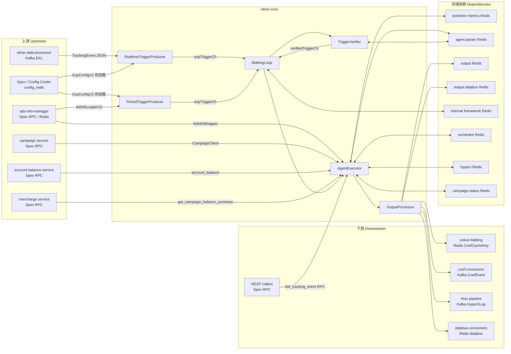

<!-- ads-workspace-gdoc-sync: gdoc_id=1LQzjlvWk4Uy2KHkvh8dHoyKUA2-YPsER5ILs1s6iKYM gdoc_url=https://docs.google.com/document/d/1LQzjlvWk4Uy2KHkvh8dHoyKUA2-YPsER5ILs1s6iKYM/edit -->

# ultrav-core

广告出价系统在线系数计算服务，为 6 个广告垂类提供出价策略执行。

**仓库地址**：https://git.garena.com/shopee/deep/paidads-bidding/ultrav-core

---

## 目录 / Table of Contents

1. [项目概述 / Introduction](#项目概述--introduction)
2. [核心功能 / Features](#核心功能--features)
3. [项目架构 / Architecture](#项目架构--architecture)
   - [系统上下文 / System Context](#系统上下文--system-context)
   - [上下游调用拓扑 / Service Topology](#上下游调用拓扑--service-topology)
   - [数据流 / Data Flow](#数据流--data-flow)
4. [目录结构 / Directory Structure](#目录结构--directory-structure)
5. [垂类与部署 / Verticals and Deployment](#垂类与部署--verticals-and-deployment)
   - [支持的广告垂类 / Supported Ad Verticals](#支持的广告垂类--supported-ad-verticals)
   - [构建目标与二进制 / Build Targets and Binaries](#构建目标与二进制--build-targets-and-binaries)
   - [部署配置 / Deploy Configuration](#部署配置--deploy-configuration)
   - [RESP 模式 / RESP Mode](#resp-模式--resp-mode)
6. [核心流程 / Core Pipeline](#核心流程--core-pipeline)
   - [实时触发器 / Realtime Trigger Path](#实时触发器--realtime-trigger-path)
   - [定时触发器 / Period Trigger Path](#定时触发器--period-trigger-path)
   - [BiddingLoop 主循环 / BiddingLoop Main Loop](#biddingloop-主循环--biddingloop-main-loop)
   - [AgentExecutor 执行流程 / AgentExecutor Pipeline](#agentexecutor-执行流程--agentexecutor-pipeline)
   - [输出处理 / Output Processing](#输出处理--output-processing)
7. [Agent 注册与策略 / Agent Registration and Strategies](#agent-注册与策略--agent-registration-and-strategies)
   - [Agent 接口 / Agent Interface](#agent-接口--agent-interface)
   - [Product Ads Agents（40 个）](#product-ads-agents40-个)
   - [Shop Ads Agents（5 个）](#shop-ads-agents5-个)
   - [Live Ads Agents（12 个）](#live-ads-agents12-个)
   - [Live Ads Antou Agents（2 个）](#live-ads-antou-agents2-个)
   - [Brand Max Agents（1 个）](#brand-max-agents1-个)
   - [Video Ads Agents（2 个）](#video-ads-agents2-个)
   - [共享工具 agent_util / Shared Utilities (agent_util)](#共享工具-agent_util--shared-utilities-agent_util)
8. [RESP 模式详解 / RESP Mode Details](#resp-模式详解--resp-mode-details)
   - [触发条件 / Activation Condition](#触发条件--activation-condition)
   - [请求处理流程 / Request Processing Flow](#请求处理流程--request-processing-flow)
   - [与正常模式的差异 / Differences from Normal Mode](#与正常模式的差异--differences-from-normal-mode)
   - [resp_guard 读写保护 / resp_guard Read-Write Protection](#resp_guard-读写保护--resp_guard-read-write-protection)
9. [配置体系 / Configuration](#配置体系--configuration)
   - [AppConfig 总览 / AppConfig Overview](#appconfig-总览--appconfig-overview)
   - [DynamicConfig](#dynamicconfig)
   - [FrameworkConfig](#frameworkconfig)
   - [各垂类配置 / Per-Vertical Config](#各垂类配置--per-vertical-config)
   - [AgentOperationConfig](#agentoperationconfig)
   - [BiddingLoop Config](#biddingloop-config)
   - [KafkaConfig 结构 / KafkaConfig Structure](#kafkaconfig-结构--kafkaconfig-structure)
10. [触发器验证与去重 / Trigger Verification and Deduplication](#触发器验证与去重--trigger-verification-and-deduplication)
    - [间隔验证 / Interval-based Verification](#间隔验证--interval-based-verification)
    - [计数验证 / Count-based Verification](#计数验证--count-based-verification)
    - [执行器锁 / Executor Lock](#执行器锁--executor-lock)
    - [BigCache 本地缓存 / BigCache Local Cache](#bigcache-本地缓存--bigcache-local-cache)
11. [Redis 交互详解 / Redis Interaction](#redis-交互详解--redis-interaction)
12. [Kafka 交互详解 / Kafka Interaction](#kafka-交互详解--kafka-interaction)
13. [关键数据结构 / Key Data Structures](#关键数据结构--key-data-structures)
14. [开发规范 / Development Guidelines](#开发规范--development-guidelines)
    - [新增 Agent / How to Add a New Agent](#新增-agent--how-to-add-a-new-agent)
    - [Agent 工具链 / Agent Utility Libraries](#agent-工具链--agent-utility-libraries)
    - [PID Framework](#pid-framework)
    - [MPC Model 工具 / MPC Model Utilities](#mpc-model-工具--mpc-model-utilities)
    - [单元测试 / Unit Testing](#单元测试--unit-testing)
    - [Code Review & Git Workflow](#code-review--git-workflow)
15. [部署 / Deployment](#部署--deployment)
    - [生产构建 / Build for Production](#生产构建--build-for-production)
    - [发布流程 / Release Process](#发布流程--release-process)
    - [Verifier 离线验证 / Verifier Offline Validation](#verifier-离线验证--verifier-offline-validation)
    - [工具 / Tools](#工具--tools)
16. [监控 / Monitoring](#监控--monitoring)
17. [业务术语表 / Business Terminology Glossary](#业务术语表--business-terminology-glossary)
18. [参考资料 / Additional Resources](#参考资料--additional-resources)
19. [常见问题 / Frequently Asked Questions](#常见问题--frequently-asked-questions)

---

## 项目概述 / Introduction

ultrav-core 是广告出价系统的**在线系数计算服务**，负责为以下 6 个广告垂类提供出价策略执行：

- **Product Ads**（商品广告）
- **Shop Ads**（店铺广告）
- **Live Ads**（直播广告）
- **Live Ads Antou**（直播广告 Antou 定向）
- **Brand Max**（品牌推广）
- **Video Ads**（视频广告）

**核心工作流**：消费 Kafka tracking 事件（实时路径）或周期扫描全量广告（定时路径）→ 生成实验触发器（ExpTrigger）→ 验证/去重/加锁 → 运行对应 Agent 策略 → 输出系数到 Redis/Kafka/Hive/Databus。

**与 ultrav-core-timewindow 的关系**：ultrav-core 直接处理每个 tracking 事件生成触发器（无时间窗口缓冲）；ultrav-core-timewindow 引入 `TimeWindowProcessor`，按可配置窗口（15s–300s）缓冲后批量触发，适合对低频事件的聚合计算。

**RESP 模式**：Product 垂类额外支持 Spex RPC 同步请求-响应模式（`adsbidding.ultravcoreproduct.bid_tracking_event`）；其余垂类仅支持异步 Kafka + Period 模式。

**Spex 服务名**：

| 垂类 | Spex serverName |
|---|---|
| Product Ads | `adsbidding.ultravcoreproduct` |
| Shop Ads | `adsbidding.ultravcoreshop` |
| Live Ads | `adsbidding.ultravcorelivead` |
| Live Ads Antou | `adsbidding.ultravcoreliveadantou` |
| Brand Max | `adsbidding.ultravcorebrandmax` |
| Video Ads | `adsbidding.ultravcorevideoad` |

---

## 核心功能 / Features

- **多垂类出价系数计算**：为 Product/Shop/Live/LiveAntou/BrandMax/Video 6 个广告垂类独立运行 Agent 策略，输出出价系数（coef）。
- **双触发路径**：实时路径（Kafka TrackingEvent → RealtimeTriggerProducer）和定时路径（PeriodTriggerProducer 全量扫描），两路均经过统一的 BiddingLoop 处理。
- **实验框架（ExpConfigV2）**：基于实验名称和 Agent 名称映射，支持多实验并行、A/B bucket 分流、按 event_type 和触发条件（计数/间隔）灵活触发。
- **Agent 热插拔注册**：通过 `AgentExecutor.RegisterAgent` 按名称注册，运行时通过 `ExpConfigV2.AgentName` 动态路由。
- **PID Framework**：提供 `base_pid`、`cold_start_pid`、`subsidy_pid`、`cofund_roi_threshold_pid`、`custom_pid` 5 种变体，支持 PID 反馈控制出价系数。
- **MPC Model**：支持统计模型、校准（cali）和 Redis scatter 插值，用于模型驱动的出价策略。
- **RESP 模式（Product 垂类）**：支持 Spex RPC 同步调用，外部服务通过 `bid_tracking_event` 命令发送请求并同步获取 OutputParamList。
- **多路输出**：OutputProcessor 按顺序将系数写入 output Redis（FlatBuffers）、output Kafka（CoefEvent protobuf）、Hive Kafka（HyperXLog JSON）和 output Databus Redis（聚合写入）。
- **触发器去重与限频**：三层验证（间隔/计数/最后更新时间）+ BigCache 本地缓存 + 执行器锁，防止重复计算。
- **动态配置热加载**：通过 Spex Config 机制（`config.SetAppConfig`）实现配置热更新，无需重启。

---

## 项目架构 / Architecture

### 系统上下文 / System Context

ultrav-core 是 paidads-bidding 子系统中的在线系数计算层，位于 tracking 数据消费侧与在线竞价（online-bidding）服务之间。它读取 tracking 事件或全量广告列表，通过 Agent 计算出价系数，再将系数推送至在线服务可读的 Redis/Kafka。

### 上下游调用拓扑 / Service Topology



**上下游表格**：

**上游（Upstream）**

| 服务 | 协议 | 描述 |
|---|---|---|
| ultrav-data-processor | Kafka (EKL) | 上游 tracking 事件流，按 country+event type 过滤后作为实时触发器输入源 |
| Spex / Config Center | Spex SDK / config_redis | 提供两层配置（config / agent_operation），支持热加载；Product RESP 模式下同时提供 RPC 请求入口 |
| Config Center + config Redis | Config Center SDK / Redis | 提供实验配置（ExpConfigV2）和策略参数，Product 使用 config_redis，Shop/Live/Video/BrandMax 使用 ConfigCenterClient |
| ads-info-manager | Spex RPC / Redis | 提供广告元数据（AdInfoLoaderV2 / LiveAdInfoLoaderV2），用于 Period 全量扫描和实时路径广告信息查询 |
| campaign service | Spex RPC | 通过 CampaignClient 获取当日 campaign 状态（CampSurgeLevel/AutoCampLevel/Boost）及 campaign 日历 |
| account balance service | Spex RPC | 通过 paidads.account_balance / paidads.valar 获取账户余额和累计余额快照 |
| overcharge service | Spex RPC | 通过 paidads.valar.get_campaign_balance_summary 获取剩余预算（按 shop/campaign/placement）|

**下游（Downstream）**

| 服务 | 协议 | 描述 |
|---|---|---|
| online-bidding | Redis (CoefCacheKey) | 将 FlatBuffers 序列化的出价系数写入 output Redis，供在线竞价服务读取 |
| coef-consumers (legacy + new) | Kafka | 通过 OutputKafkaProducer（legacy）和 NewOutputKafkaProducer 发送 CoefEvent protobuf |
| Hive pipeline | Kafka | 通过 HiveLogProducer 发送 HyperXLog JSON 日志（project=ultrav_core），用于离线分析 |
| databus-consumers | Redis (databus) | 通过 output_databus Redis 写入 protobuf 系数数据，支持单键 SET 和 Lua 聚合 HSET |
| RESP callers | Spex RPC | Product RESP 模式下，外部服务通过 bid_tracking_event 获取 OutputParamList |

**存储依赖（Dependencies）**

| 名称 | 类型 | 描述 |
|---|---|---|
| posterior metrics Redis | datastore | 读取时间窗口维度的后验指标（COUNT/SCALAR 的 history/daily/hourly/minutely/quarter） |
| agent param Redis | datastore | 读写 `agent_param_v2` 键，存储 Agent 参数 protobuf；支持 BigCache 本地缓存减少热 key 访问 |
| output Redis | datastore | 写入 CoefCacheKey 格式的 FlatBuffers 系数（SET+TTL），支持 per-country 和 default client 双写 |
| output databus Redis | datastore | 写入 databus protobuf（SET+TTL），支持 Lua 脚本聚合写入（HSET+EXPIRE） |
| internal framework Redis | datastore | Period 广告锁（Pipeline+SetNX+TTL）、实例注册（ZADD/ZRank/ZCard）、心跳、触发器去重、执行器锁 |
| constraint Redis | datastore | 各垂类策略所需约束/校准数据：ROI CDF、模型出价 PDF、MPC 校准、subsidy、预算比例等 |
| hyperx Redis (Product) | datastore | Product 专用的 HyperX 特征 Redis |
| campaign status Redis | datastore | 读取 campaign 状态（HGET），用于策略决策 |

#### 中间件实例详情 / Middleware Instance Details

Config Center 按各二进制实际初始化的 Spex 服务名读取：`[sp]adsbidding / ultravcoreproduct`、`ultravcoreshop`、`ultravcorelivead`、`ultravcoreliveadantou`、`ultravcorebrandmax`、`ultravcorevideoad`，item 为 `config` 和 `agent_operation`。

| 类型 | 方向 | 具体实例 | 用途 | 证据 |
|---|---|---|---|---|
| Kafka | 消费 | Product `framework_config.tracking_event_kafka`：brokers `di-kafka-stt01-bg1-bootstrap01/02/03-stt-sg.data-infra.shopee.io:9093`, `di-kafka-da01-bg1-bootstrap01/02/03-dallas-us.data-infra.shopee.io:9093`；topics `bidding_tracking_event_my/th/sg/id/ph/vn/tw`, `mkplpaidads_discovery_ads.hyperx_tracking_event_us`；groups `ultrav_core_global`, `ultrav_core_id`, `ultrav_core_ph`, `ultrav_core_vn`, `ultrav_core_tw`, `paidads_mkplpaidads_hyperx_ultrav_core_us` | Product 实时触发输入 | `cmd/product_bidding/main.go`, `config/core.go` |
| Kafka | 消费 | Shop `shop-ads-data-event-global-live`, `shop-ads-data-event-br-live`；Live/Antou `live-ads-data-event-global-live`, `live-ads-data-event-br-live`；Video `adsbidding_videoads_ultrav_data_processor-global-live`, `adsbidding_videoads_ultrav_data_processor-br-live`；brokers 包括 `kafka.ks_adstracking_live.ap-sg-1-general-b.live.mq.shopee.io:9092`, `kafka.kafka_latam_fe_us.na-us-2-general-a.live.mq.shopee.io:9092`, `kafka.ks_commmonlog_live.ap-sg-1-general-a.live.mq.shopee.io:9092`, `kafka.ks_br_market_live.ap-sg-1-general-c.live.mq.shopee.io:9092` | 内容垂类实时触发输入 | `cmd/shop_bidding`, `cmd/live_ad_bidding`, `cmd/live_ad_antou_bidding`, `cmd/video_bidding` |
| Kafka | 生产 | Product output topics `product_ads_coef-global-live`, `product_ads_coef-id-live`, `product_ads_coef-tw-live`；Shop `shop_ads_coef-global-live`, `shop_ads_coef-br-live`；Live/Antou `live_ads_coef-global-live`, `live_ads_coef-br-live`；Brand Max `brandmax_ads_coef-global-live`, `brandmax_ads_coef-br-live`；Video `video_ads_coef-global-live`, `video_ads_coef-br-live` | 系数变更事件 | `pkg/data/output_kafka_producer`, `pkg/framework/output_processor.go` |
| Kafka | 生产 | Hive log topics `mkplpaidads_discovery_ads.hyperx_exp_log`, `mkplpaidads_discovery_ads.hyperx_exp_log_us`, `shop-ads-ultrav-core-global-live`, `shop-ads-ultrav-core-br-live`, `liveads-ultrav-core-bidding-global-live`, `liveads-ultrav-core-bidding-br-live`, `brand-max-ultrav-core-global-live`, `brand-max-ultrav-core-br-live`, `videoads-ultrav-core-bidding-global-live`, `videoads-ultrav-core-bidding-br-live` | 离线 HyperX / bidding 日志 | `pkg/data/output_hive_kafka_producer` |
| Redis | 读写 | Product framework Redis domains：`ftrbx.elasticredis.cloud.shopee.io:10582`, `zzhmu.elasticredis.cloud.shopee.io:10895`, `a91cw.elasticredis.cloud.shopee.io:10391`, `rsp7p.elasticredis.cloud.shopee.io:10392`；output Redis `bhdrr.elasticredis.cloud.shopee.io:10350`, `2mr2q.elasticredis.cloud.shopee.io:10991`；output_databus `rhb8s.elasticredis.cloud.shopee.io:10311`, `eujfa.elasticredis.cloud.shopee.io:10306`；config/hyperx Redis `soefe.elasticredis.cloud.shopee.io:11828`, `0083dcfb33f6dedd.elasticredis.cloud.shopee.io:11828`；constraint Redis `cflft.elasticredis.cloud.shopee.io:10246`, `9cac9f7a85485590.elasticredis.cloud.shopee.io:10523` | Product 触发锁、Agent 参数、系数输出、databus、config、HyperX、constraint | `pkg/data/*redis*`, `config/core.go` |
| Redis | 读写 | Shop Redis domains：`gkil5.elasticredis.cloud.shopee.io:10243`, `p4bix.elasticredis.cloud.shopee.io:11450`, `0ld4p.elasticredis.cloud.shopee.io:10283`；double-write `mkako.elasticredis.cloud.shopee.io:11103`, `nfd7h.elasticredis.cloud.shopee.io:14117`；output_databus `wj64e.elasticredis.cloud.shopee.io:10338`, `svl1q.elasticredis.cloud.shopee.io:11679`；constraint `757ffc4f637c7500.elasticredis.cloud.shopee.io:10242`, `065de79213c14d62.elasticredis.cloud.shopee.io:10242` | Shop 后验、内部状态、Agent 参数、输出、databus、constraint | `config/core.go`, `pkg/data` |
| Redis | 读写 | Live/Antou Redis domains：external `7rc0q.elasticredis.cloud.shopee.io:10133`, `imbis.elasticredis.cloud.shopee.io:10133`, `0wn58.elasticredis.cloud.shopee.io:14132`；constraint `pfzyf.elasticredis.cloud.shopee.io:9469`, `0wn58.elasticredis.cloud.shopee.io:14132`；posterior `mvohf.elasticredis.cloud.shopee.io:10469`, `nwhw8.elasticredis.cloud.shopee.io:14131`；internal/trigger/agent/output `uk63v.elasticredis.cloud.shopee.io:11364`, `nz2ch.elasticredis.cloud.shopee.io:11358`, `tyfwn.elasticredis.cloud.shopee.io:14133`, `oih7k.elasticredis.cloud.shopee.io:11357`, `yig7d.elasticredis.cloud.shopee.io:14134` | Live 和 Antou 后验、约束、触发、Agent 参数、输出 | `config/core.go`, `pkg/data` |
| Redis | 读写 | Brand Max Redis domains：`vgyor.elasticredis.cloud.shopee.io:10515`, `yvqj8.elasticredis.cloud.shopee.io:11555`, databus `si5ki.elasticredis.cloud.shopee.io:10673`, `paxi6.elasticredis.cloud.shopee.io:11722`, output_databus `wj64e.elasticredis.cloud.shopee.io:10338`, `svl1q.elasticredis.cloud.shopee.io:11679`；Video Redis domains：constraint `omcyj.elasticredis.cloud.shopee.io:10187`, `8lvi2.elasticredis.cloud.shopee.io:11623`，posterior `cgg9d.elasticredis.cloud.shopee.io:10286`, `nitmd.elasticredis.cloud.shopee.io:11624`，internal/trigger/agent/output `cpz5u.elasticredis.cloud.shopee.io:10587`, `z9mag.elasticredis.cloud.shopee.io:10588`, `xrij2.elasticredis.cloud.shopee.io:11622` | Brand Max 和 Video 触发状态、后验、约束、输出、databus | `config/core.go`, `pkg/data` |
| Config Center | 读取 | `post_data_spex` 指向 project `ads_bidding`、namespace `post_data_redis_config`；Product 实验配置还通过 config Redis / Config Center client 使用 `ads_bidding/product_ads_bidding_aggregation_config` 和 common `ads_bidding/bidding_common` | 后验 Redis 路由、实验和策略配置 | `config/core.go`, `pkg/config_redis`, `pkg/data/post_data_client` |
| DB/FSE/Vespa/S3/ClickHouse | 未发现 | 扫描代码未发现本仓库直接读写 DB、FSE、Vespa、S3 或 ClickHouse | 存储访问集中在 Redis/Kafka/Config Center/Spex RPC | source scan |

### 数据流 / Data Flow

**实时路径**：
```
Kafka TrackingEvent
  → RealtimeTriggerProducer.Transform（JSON 反序列化 + country 过滤 + GroupKey 归一化）
  → Process（遍历 ExpConfigV2 生成 ExpTrigger）
  → expTriggerCh
  → BiddingLoop.verify（TriggerVerifier）
  → verifiedTriggerCh
  → BiddingLoop.doBidding（LockTriggerExecutor + AgentExecutor.Process）
  → OutputProcessor.ProcessOutput（output Redis → output Kafka → Hive Kafka → databus Redis）
```

**定时路径**：
```
PeriodTriggerProducer（周期执行）
  → CID/TaskID 注册实例分片 → GetAllAdsInfo → 按 adId%instanceLen 分片
  → LockAds（Pipeline+SetNX）→ 生成 Period ExpTrigger
  → expTriggerCh → [同实时路径后续]
```

**RESP 路径（Product 专用）**：
```
Spex RPC bid_tracking_event
  → RESPHandler.handleBidTrackingEvent
  → JSON 解析 + GroupKey 归一化
  → TriggerGenerator.GenerateAllExpTriggers
  → 逐触发器 VerifyTrigger（NoOp）+ AgentExecutor.Process
  → 去重（expName_planBucket_trafficBucket）+ 排序
  → 返回 OutputParamList（不写 Redis/Kafka）
```

---

## 目录结构 / Directory Structure

```
ultrav-core/
├── cmd/                          # 各垂类服务入口
│   ├── product_bidding/          # Product Ads 服务（含 RESP 模式）
│   ├── shop_bidding/             # Shop Ads 服务
│   ├── live_ad_bidding/          # Live Ads 服务
│   ├── live_ad_antou_bidding/    # Live Ads Antou 服务
│   ├── brand_max_bidding/        # Brand Max 服务（仅 Period 触发器）
│   ├── video_bidding/            # Video Ads 服务
│   └── product_bidding_agent_verifier/  # 离线验证工具
├── config/                       # 配置定义
│   ├── core.go                   # AppConfig / FrameworkConfig / KafkaConfig
│   ├── dynamic/                  # AgentOperationConfig 动态配置
│   ├── product_ads/              # ProductAdsConfig
│   ├── product_bidding_runonce/  # exp_config_publisher 工具轻量配置（namespace: ultrav_core_cmd）
│   ├── shop_ads/                 # ShopAdsConfig
│   ├── live_ads/                 # LiveAdsConfig
│   ├── brand_max/                # BrandMaxConfig
│   └── video_ads/                # VideoAdsConfig
├── deploy/                       # 部署配置 JSON
├── gen/                          # protobuf 生成代码（自动生成，勿手动修改）
├── internal/
│   ├── agent/
│   │   ├── agent_base/           # AgentBase / AuMonitor / AuLogger
│   │   ├── agent_util/           # 共享工具（PID Framework / MPC Model / CDF / aggregated_storage 等）
│   │   ├── product_ad_agent/     # Product Ads Agent 实现（40 个）
│   │   ├── shop_ads_agent/       # Shop Ads Agent 实现（5 个）
│   │   ├── live_ads_agent/       # Live Ads Agent 实现（12 个）
│   │   ├── brand_max_agent/      # Brand Max Agent 实现（1 个）
│   │   └── video_ads_agent/      # Video Ads Agent 实现（2 个）
│   ├── core/                     # BiddingLoop 核心框架（dependency.go / loop.go / config.go）
│   ├── exporter/                 # Prometheus 指标导出
│   ├── model/                    # 核心数据结构（ExpTrigger / ExpConfigV2 / OutputParam 等）
│   ├── tagreader/                # tagclient.TagReader 封装；启动时初始化 model.CheckAdTagBit
│   └── service/
│       ├── agent_executor/       # AgentExecutor + ResourceContext + Agent 接口
│       ├── output_processor/     # OutputProcessor（多路写入）
│       ├── resp_handler/         # RESP 模式 Spex 处理器
│       ├── trigger_producer/     # RealtimeTriggerProducer / PeriodTriggerProducer
│       └── trigger_verifier/     # TriggerVerifier（降级 + 验证路由）
├── pkg/
│   ├── data/                     # 数据访问层（Redis / Kafka / 广告信息等）
│   ├── http_handler/             # HTTP 端点（/metrics /ping /debug/pprof /log）
│   └── util/                    # 通用工具（Prometheus 导出 / 日志 / 环境判断）
├── sp_proto/                     # Spex protobuf 定义
├── tool/                         # 辅助工具
│   ├── exp_config_publisher/     # 发布实验配置工具
│   ├── output_getter/            # 解码 Redis 系数工具
│   └── hash_lib_tester/          # 哈希库测试工具
├── go.mod
└── Makefile
```

---

## 垂类与部署 / Verticals and Deployment

### 支持的广告垂类 / Supported Ad Verticals

| 垂类 | cmd 目录 | 触发模式 | Agent 数量 |
|---|---|---|---|
| Product Ads | `cmd/product_bidding` | Realtime + Period + RESP | 40 |
| Shop Ads | `cmd/shop_bidding` | Realtime + Period | 5 |
| Live Ads | `cmd/live_ad_bidding` | Realtime + Period | 12 |
| Live Ads Antou | `cmd/live_ad_antou_bidding` | Realtime + Period | 2 |
| Brand Max | `cmd/brand_max_bidding` | **Period 仅** | 1 |
| Video Ads | `cmd/video_bidding` | Realtime + Period | 2 |

### 构建目标与二进制 / Build Targets and Binaries

| Makefile 目标 | 输出二进制 | Spex serverName | 说明 |
|---|---|---|---|
| `build_product_ads_svc` | `bin/ultrav-core-product` | `adsbidding.ultravcoreproduct` | 支持 RESP 模式 |
| `build_shop_ads_svc` | `bin/ultrav-core-shop` | `adsbidding.ultravcoreshop` | |
| `build_live_ads_svc` | `bin/ultrav-core-livead` | `adsbidding.ultravcorelivead` | |
| `build_live_ads_antou_svc` | `bin/ultrav-core-livead-antou` | `adsbidding.ultravcoreliveadantou` | |
| `build_brand_max_svc` | `bin/ultrav-core-brand-max` | `adsbidding.ultravcorebrandmax` | 仅 Period |
| `build_video_ads_svc` | `bin/ultrav-core-video` | `adsbidding.ultravcorevideoad` | |
| `build_product_ads_verifier` | `bin/agent_verifier` | — | 离线验证工具 |

一次编译全部服务：
```bash
make build-all
```

### 部署配置 / Deploy Configuration

`deploy/` 目录下每个 JSON 文件对应一个部署单元，关键字段：

| 字段 | 说明 |
|---|---|
| `project_name` | `adsbidding` |
| `module_name` | 对应垂类模块名（如 `ultravcoreproduct`） |
| `build.commands` | 调用 Makefile 目标（如 `make build_product_ads_svc`） |
| `docker_image.base_image` | `harbor.shopeemobile.com/shopee/golang-base:1.24.4-20` |
| `run.enable_prometheus` | `true`，启用 Prometheus 指标采集 |
| `run.smoke.endpoint` | `/ping`，超时 5s，间隔 10s，最多重试 120 次 |
| `run.check.endpoint` | `/ping`，最多连续失败 10 次触发告警 |
| `run.enable_spex_config_key_fetch` | `true`，启用 Spex 配置拉取 |

### RESP 模式 / RESP Mode

RESP（Request-Response）模式仅 Product 垂类支持，通过 `SDU_ID` 环境变量判断是否启用：

```go
// cmd/product_bidding/main.go
if util.IsRESPDeployment() {  // SDU_ID != ""
    runRESPMode()
} else {
    runNormalMode()
}
```

RESP 模式下：
- 注册 Spex 处理器 `adsbidding.ultravcoreproduct.bid_tracking_event`
- 依赖初始化为轻量级子集（无 Kafka consumer/producer，无 output Redis 写入）
- 所有 Redis 客户端通过 `resp_guard` 封装为只读模式

---

## 核心流程 / Core Pipeline

### 实时触发器 / Realtime Trigger Path

`internal/service/trigger_producer/realtime_producer.go`

1. EKL Kafka 消费者（`DispatcherByKey` + 1000 workers）消费 tracking event topic
2. `Transform`：JSON 反序列化为 `TrackingEvent`，按 country 过滤
3. `Process`：遍历所有 `ExpConfigV2`，对每个匹配的实验配置生成 `ExpTrigger`（GroupKey 过滤、bucket 分流）
4. 将 `ExpTrigger` 推入 `expTriggerCh`（有界 channel，容量由 `RealtimeTriggerBufferCount` 配置）

### 定时触发器 / Period Trigger Path

`internal/service/trigger_producer/period_producer.go`

1. 周期执行（间隔由 `PeriodTriggerIntervalMinutes`/`PeriodTriggerIntervalSeconds` 配置，默认 5 分钟）
2. 启动时及每 10 秒定期向 internal framework Redis 注册实例（`Register` → ZADD），获取本实例在 ZSET 中的排名（ZRank）和实例总数（ZCard），实现分片；若配置了 `MinInstanceCount`，instanceLen 取 `max(实际数量, MinInstanceCount)`
3. 从 ads-info-manager 拉取全量广告列表（`GetAllAdsInfo`）
4. 按 `adId % instanceLen` 分片，仅处理本实例负责的广告
5. 以批次（100 条/批，5 个 worker 并行）Pipeline+SetNX 对广告加锁（`LockAds`），防止多实例重复处理
6. 遍历 `ExpConfigV2`（带 `period_trigger` 配置的实验），生成 Period `ExpTrigger`
7. 推入 `expTriggerCh`（默认缓冲 100,000，带速率限制 `PeriodTriggerAdsRateLimit`）

### BiddingLoop 主循环 / BiddingLoop Main Loop

`internal/core/loop.go`

```
BiddingLoop.Run()
├── goroutine: realtimeTriggerProducer.Start()
├── goroutine: periodTriggerProducer.Start()
├── goroutine: 消费 realtime/period trigger channel
│   └── getWorker(verifierWorkerCh) → go verify(ctx, expTrigger)
└── goroutine: 消费 verifiedTriggerCh
    └── getWorker(agentWorkerCh) → go doBidding(ctx, expTrigger)
```

并发控制（`internal/core/config.go`）：
- `VerifierConcurrency`：verifier worker 池大小（默认 512，最大 4096）
- `BiddingExecutorConcurrency`：agent worker 池大小（默认 256，最大 1024）
- `BiddingExecutorChannelBuffer`：verifiedTriggerCh 缓冲区（默认 = BiddingExecutorConcurrency × 10）

Brand Max 使用 `RunPeriodTrigger()`，仅消费 period channel，realtime producer 为空实现（`&trigger_producer.RealtimeTriggerProducer{}`）。

### AgentExecutor 执行流程 / AgentExecutor Pipeline

`internal/service/agent_executor/agent_executor.go`

```
AgentExecutor.Process(ctx, trigger)
1. 从 agentInitMap 查找 trigger.AgentName 对应的 AgentInitFunc
2. 调用 AgentInitFunc() 实例化 Agent
3. 读取 debug_mode 和 log_downgrade_rate（来自 ExpConfigV2.ExtraParam）
4. agent_base.InitBase(trigger, debugMode, logDowngradeRate)
   - 设置本地时区（LoadLocation(country)）
   - 初始化 AuMonitor（Prometheus 指标）
   - 初始化 AuLogger（结构化日志 + 降级采样）
5. agent.Process(ctx, agentBase, resourceContext) → *OutputParam
```

### 输出处理 / Output Processing

`internal/service/output_processor/output_processor.go`

OutputProcessor 顺序执行 outputWriters（首个错误终止链）：

| 顺序 | Writer | 目标 | 说明 |
|---|---|---|---|
| 1 | output_redis | output Redis | FlatBuffers CoefCacheKey，SET+TTL |
| 2 | output_kafka_producer | Kafka CoefEvent topic | legacy CoefEvent protobuf |
| 3 | new_output_kafka_producer | Kafka（新 topic） | 新版 CoefEvent protobuf（Product 专用） |
| 4 | output_hive_kafka_producer | Kafka HyperXLog topic | HyperXLog JSON 日志 |
| 5 | output_databus | databus Redis | protobuf databus 数据 |

OutputParam 中的控制标志：
- `DisableToWriteRedis`：跳过 output Redis 写入
- `DisableToWriteHive`：跳过 Hive log 写入
- `EnableToWriteDatabus`：默认 false（须显式启用）

---

## Agent 注册与策略 / Agent Registration and Strategies

### Agent 接口 / Agent Interface

`internal/service/agent_executor/dependency.go`

```go
type Agent interface {
    GetAgentName() string
    Process(ctx context.Context, agentBase *agent_base.AgentBase, resourceContext *ResourceContext) (*model.OutputParam, error)
}
```

注册方式（以 Product 垂类为例，`cmd/product_bidding/agent_registor.go`）：

```go
agentExecutor.RegisterAgent(func() agent_executor.Agent { return roi2.New() })
```

### Product Ads Agents（40 个）

`internal/agent/product_ad_agent/`

| Agent 名称 | 目录 | 功能分类 |
|---|---|---|
| demo | demo/ | 调试/示例 |
| roi2 | roi2/ | ROI 系列：目标 ROI PID 控制 |
| roi1 | roi1/ | ROI 系列：ROI v1 |
| roi3 | roi3/ | ROI 系列：ROI v3 |
| roi2_diff_entrance | roi2_diff_entrance/ | ROI 系列：按 entrance 差异化 ROI |
| roi2_perf_predictor | roi2_perf_predictor/ | ROI 系列：ROI 性能预测 |
| roi3_ctr_uplift | roi3_ctr_uplift/ | ROI 系列：ROI v3 CTR 提升 |
| roi3_multi_dimensions | roi3_multi_dimensions/ | ROI 系列：多维度 ROI v3 |
| multi_dim_roi_control | roi3_cofund/multi_dim_roi_control/ | ROI 系列：多维度 ROI 控制 |
| simpleroi2 | simpleroi2/ | Simple Mode ROI v2 |
| simpleroi2_diff_entrance | simpleroi2_diff_entrance/ | Simple Mode ROI v2 差异化 entrance |
| ecpc | ecpc/ | eCPC 出价 |
| gmv_calibrator | gmv_calibrator/ | GMV 系列：GMV 校准 |
| gmv_max_strategy | gmv_max/ | GMV 系列：GMV 最大化策略 |
| GMS | GMS/ | GMV 系列：GMS |
| large_sellers_gmv_uplift | large_sellers_gmv_uplift/ | GMV 系列：大卖家 GMV 提升 |
| subsidy | subsidy/ | Subsidy 系列：补贴控制 |
| subsidy_uplift | subsidy_uplift/ | Subsidy 系列：补贴提升 |
| subsidy_1cpa_budget | subsidy/subsidy_1cpa_budget/ | Subsidy 系列：1CPA 预算 |
| subsidy_traffic_budget | subsidy/subsidy_traffic_budget/ | Subsidy 系列：流量预算 |
| cofund_roi_threshold | roi3_cofund/cofund_roi_threshold/ | Cofund 系列：ROI 阈值 |
| cofund_budget_ratio | roi3_cofund/cofund_budget_ratio/ | Cofund 系列：预算比例 |
| platform_share_ratio | roi3_cofund/platform_share_ratio/ | Cofund 系列：平台分摊比例 |
| voucher_pacing_control | roi3_cofund/voucher_pacing_control/ | Cofund 系列：券节奏控制 |
| package_budget_control | roi3_cofund/package_budget_control/ | Cofund 系列：套餐预算控制 |
| budget_control | budget_control/ | Budget 系列：预算控制 |
| bucket_budget | bucket_budget/ | Budget 系列：bucket 预算 |
| budget_unification | budget_unification/ | Budget 系列：预算统一；输出 `BudgetUnificationInfo`（账户余额/日预算/周预算/实时剩余预算等）到 CoefExtra 和 Databus；计算 `UnderBidFlag7d`（7d 花费 < 7d ADVV/GMV 时标记欠出价）|
| pacing | pacing/ | Pacing 节奏控制 |
| campaign_surge | campaign_surge/ | Campaign 系列：surge 控制 |
| campaign_deduction | campaign_deduction/ | Campaign 系列：扣费校准 |
| target_roi2_deduction | target_roi2_deduction/ | 目标 ROI 扣费 |
| manual_transfer | manual_transfer/ | 手动模式转换 |
| order_priority | order_priority/ | 订单优先级 |
| universal_order_priority (GMS) | universal_order_priority/GMS/ | 通用订单优先级（GMS）：支持 GMS 冷启动场景（gms_cold_start_simple/target + mp_cold_start_target 配置变体）|
| pctr_deduction_cali | pctr_deduction_cali/ | pCTR 扣费校准：外层基于全场景汇总达标率（Advv/GMV-成本比）调整 manualCoef，内层按 entrance 单独计算 click/pCTR 校准系数；三种配置变体：`v0`、`cold_start_v0`、`multi_item_v0`；中间状态通过 `OutputParam.Trace` 记录 |
| ads_info_snapshot | ads_info_snapshot/ | 广告信息快照 |
| posterior_data_monitor | posterior_data_monitor/ | 后验数据监控 |
| mpc_model_monitor | mpc_model_monitor/ | MPC 模型监控 |
| unified_model_bid | unified_model_bid/ | 统一模型出价：基于统计模型（Wa/Ka/Wb/Kb/Alpha 参数 + 96分位 PDF 插值）为冷启动/空订单/NPB/新广告主/GMS 冷启动（简单 + 目标）/GMS 空订单/MP 冷启动等场景自动选择出价策略；写入 ModelBidCoef 到 AgentParam，输出 SellerBidRatio/BoostCostRatioMap |

### Shop Ads Agents（5 个）

`internal/agent/shop_ads_agent/`

| Agent 名称 | 功能 |
|---|---|
| auto_model_target_roas | 自动模式目标 ROAS |
| auto_model_cold_start | 自动模式冷启动 |
| manual_model_ecpc_strategy | 手动模式 eCPC 策略 |
| shop_gmv_calibrator | 店铺 GMV 校准 |
| shop_ads_target_roas_union_bidding_strategy | 目标 ROAS 联合出价策略 |

### Live Ads Agents（12 个）

`internal/agent/live_ads_agent/`

| Agent 名称 | 功能 |
|---|---|
| demo | 调试/示例 |
| live_target_roi2 | 直播目标 ROI v2 |
| live_max_gmv2_roi | 直播 GMV 最大化（ROI 模式） |
| live_max_gmv2_two_stage | 直播 GMV 最大化（两阶段） |
| live_max_gmv2_budget | 直播 GMV 最大化（预算控制） |
| gmv_calibrator | 直播 GMV 校准 |
| live_target_roi2_mpc | 直播目标 ROI v2（MPC 模型） |
| target_roi2_antou | 直播 Antou 目标 ROI v2 |
| live_max_view | 直播最大观看量 |
| live_max_view_mpc | 直播最大观看量（MPC 模型） |
| live_max_view2_mpc | 直播最大观看量 v2（MPC 模型） |
| live_max_gmv_unification | 直播 GMV 统一出价 |

### Live Ads Antou Agents（2 个）

`cmd/live_ad_antou_bidding/`（共享 live_ads_agent 代码）

| Agent 名称 | 功能 |
|---|---|
| demo | 调试/示例 |
| target_roi2_antou | Antou 定向目标 ROI v2 |

### Brand Max Agents（1 个）

`internal/agent/brand_max_agent/`

| Agent 名称 | 功能 |
|---|---|
| budget_pacing | 品牌推广预算节奏控制：基于当日剩余预算与历史预算利用率（budgetUsage/budgetCoef）做 PID 控制；额外输出 DiscountFactor（antou 广告专用，当 DailyMingtouRev/DailyRev ≥ MingtouRevThreshold 时设为 1.0，否则为 0）；通过 PlatformRevRoiCoefMap 输出五类模型质量阈值（PctrThreshold / PatcThreshold / PctatcThreshold / PcrThreshold / PctcvrThreshold），随节奏系数动态调整 |

### Video Ads Agents（2 个）

`internal/agent/video_ads_agent/`

| Agent 名称 | 功能 |
|---|---|
| video_max_gmv | 视频广告 GMV 最大化 |
| video_max_view | 视频广告最大观看量 |

### 共享工具 agent_util / Shared Utilities (agent_util)

`internal/agent/agent_util/`

| 工具 | 文件 | 功能 |
|---|---|---|
| FX 汇率转换 | common.go | 货币转换工具 |
| 时间工具 | utils.go | 本地时区转换、时间窗口计算 |
| extra_param 解析 | extra_param.go | 从 `ExtraParam` 读取 bool/float64/int/string 等类型 |
| AggregatedStorage | aggregated_storage.go | 聚合存储元数据 |
| entrance_utils | entrance_utils.go | entrance 相关工具函数 |
| CDF 工具 | cdf.go | CDF 计算，用于约束 Redis 中的 ROI CDF、PDF 插值 |
| auto_formatter | auto_formatter.go | 自动格式化工具 |
| pid_framework | pid_framework/ | PID 框架（见下文） |
| mpc_model | mpc_model/ | MPC 统计模型 |
| mpc_model_util | mpc_model_util/ | MPC 工具函数 |
| mpc_model_cali_util | mpc_model_cali_util/ | MPC 校准工具 |
| feed_back_util | feed_back_util/ | 反馈控制工具 |
| model_bid_util | model_bid_util/ | 模型出价工具：`LoadModelBidPdf`（从约束 Redis 加载96分位 PDF 数据）、`LoadModelBidParams`/`LoadUnifiedModelBidParams`（按 L2Category 或 pricingType 加载 Wa/Ka/Wb/Kb/Alpha 参数，支持 L2Category 和 GMS pricingType 两种维度）、`LoadCampaignAov`/`LoadPricingTypeDefaultAov`（加载广告或品类默认 AOV）|

---

## RESP 模式详解 / RESP Mode Details

### 触发条件 / Activation Condition

环境变量 `SDU_ID` 非空时，`util.IsRESPDeployment()` 返回 true，`main()` 调用 `runRESPMode()`。

### 请求处理流程 / Request Processing Flow

`internal/service/resp_handler/handler.go`

```
handleBidTrackingEvent(ctx, req, resp)
1. 解析 req.TrackingEventJson → TrackingEvent
2. 遍历 GroupKeysMap，调用 configCli.GetEventValueByGroupKeyType 归一化类型
3. triggerGen.GenerateAllExpTriggers(&trackingEvent) → []ExpTrigger
4. 对每个触发器：
   a. triggerVerifier.VerifyTrigger（NoOp，始终返回 true）
   b. agentExecutor.Process(ctx, trigger) → OutputParam
   c. 去重键 = expName_planBucketId_trafficBucketId
5. 将去重后的 OutputParam 转为 OutputParamProto
6. 按 RespKey 排序，返回 response.OutputParamList
```

### 与正常模式的差异 / Differences from Normal Mode

| 维度 | 正常模式 | RESP 模式 |
|---|---|---|
| 触发来源 | Kafka 异步 | Spex RPC 同步 |
| 执行方式 | 异步 goroutine pool | 同步串行 |
| Verifier | 真实验证（间隔/计数/最后更新） | NoOp（始终通过） |
| 输出 | output Redis + Kafka + Hive + Databus | 无写入，仅返回 OutputParamList |
| Redis 权限 | 全读写 | resp_guard 只读封装 |
| 依赖规模 | 完整依赖（Kafka + 全量 Redis） | 轻量依赖（无 Kafka consumer/producer） |

### resp_guard 读写保护 / resp_guard Read-Write Protection

`pkg/data/resp_guard/`

RESP 模式下，所有 Redis DAI 通过 `resp_guard` 封装：
- `resp_guard.NewReadOnlyAgentParamDai`：AgentParamDai 封装为只读（Get 正常，Set 返回 ErrReadOnly）
- `resp_guard.GuardGeneralRedisClient`：constraint/hyperx/databus Redis 设置写操作 hook，写操作返回只读错误
- `resp_guard.NewNoOpTriggerVerifier`：TriggerVerifier 始终返回 (true, nil)

---

## 配置体系 / Configuration

### AppConfig 总览 / AppConfig Overview

`config/core.go`

配置通过 Spex Config 机制热加载（key = `"config"`，namespace = `"ultrav_core"`）：

```go
type AppConfig struct {
    DynamicConfig    DynamicConfig
    FrameworkConfig  FrameworkConfig
    ProductAdsConfig product_ads.ProductAdsConfig
    ShopAdsConfig    shop_ads.ShopAdsConfig
    LiveAdsConfig    live_ads.LiveAdsConfig
    BrandMaxConfig   brand_max.BrandMaxConfig
    VideoAdsConfig   video_ads.VideoAdsConfig
}
```

### DynamicConfig

| 字段 | 类型 | 说明 |
|---|---|---|
| `log_level` | string | 日志级别（debug/info/fatal）|
| `graceful_period` | string | 优雅停止超时（如 `"30s"`），默认 30s |
| `countries` | []string | 启用的国家列表（构建 `CountriesMap` 过滤）|
| `enable_get_remain_budget` | bool | 是否启用获取剩余预算 |

### FrameworkConfig

**Kafka 配置**：

| 字段 | 说明 |
|---|---|
| `tracking_event_kafka` | tracking event 消费者配置 |
| `output_kafka_producer` | 系数 Kafka 生产者（legacy） |
| `new_output_kafka_producer` | 系数 Kafka 生产者（新，Product 专用）|
| `hive_log_producer` | Hive 日志 Kafka 生产者 |

**Redis 配置**：

| 字段 | 说明 |
|---|---|
| `internal_framework_redis` | 内部框架 Redis（锁/实例注册/心跳）|
| `agent_param_redis` | Agent 参数 Redis |
| `output_redis` | 系数输出 Redis |
| `output_databus` | Databus 输出 Redis |
| `double_write_output_redis` | 可选的双写输出 Redis |
| `common_post_data_redis` | （已废弃，请用 `post_data_spex`）后验数据 Redis |

**后验数据配置**：

| 字段 | 说明 |
|---|---|
| `post_data_spex` | 基于 Spex 的后验数据客户端配置（推荐；取代 `common_post_data_redis`）|

**TTL 与并发参数**：

| 字段 | 说明 |
|---|---|
| `output_redis_ttl_minutes` | output Redis key TTL（分钟）|
| `output_databus_ttl_minutes` | databus Redis key TTL（分钟）|
| `lock_redis_ttl_minutes/seconds` | 广告锁 TTL |
| `period_trigger_interval_minutes/seconds` | 定时触发器间隔 |
| `period_trigger_buffer_count` | PeriodTriggerProducer channel 缓冲 |
| `period_trigger_ads_rate_limit` | 定时触发器广告速率限制（条/秒）|
| `min_instance_count` | Period 触发器最低实例数（当实际实例数低于此值时，分片逻辑使用此值避免单实例处理量过大）|
| `realtime_trigger_buffer_count` | RealtimeTriggerProducer channel 缓冲 |
| `plan_bucket_hash_log_rate` | Plan Bucket 哈希计算日志采样率 |
| `verifier_downgrade_rate` | 全局 verifier 降级比例（0~1）|
| `verifier_local_cache_soft_ttl_seconds` | BigCache 软 TTL（秒）|
| `verifier_downgrade_rate_by_event` | 按 event_type 分别配置降级比例 |

### 各垂类配置 / Per-Vertical Config

**ProductAdsConfig**（`config/product_ads/`）：

| 字段 | 说明 |
|---|---|
| `AdsInfoManager` | ads-info-manager Spex RPC 配置 |
| `ConfigRedis` | config_redis 实验配置 Redis |
| `ConstraintRedis` | 约束 Redis（ROI CDF/PDF/MPC 校准等）|
| `HyperxRedis` | HyperX 特征 Redis |
| `DatabusRedis` | Databus Redis |
| `CommonConfigCenterAddress` | 公共 Config Center 地址 |
| `BusinessConfigCenterAddress` | 业务 Config Center 地址 |

**ShopAdsConfig**、**LiveAdsConfig**、**BrandMaxConfig**、**VideoAdsConfig** 结构类似，各有对应的 `AdsInfoManager`、`ConstraintRedis`、`ConfigCenterAddress` 等字段。

### AgentOperationConfig

`config/dynamic/`（动态配置，key = `"agent_operation"`）

| 字段 | 说明 |
|---|---|
| `LogDowngradeRate` | 全局日志降级采样率（0~1，默认通过 extra_param 覆盖）|
| `ManualRatioForShopCost` | 手动模式 Shop Cost 比例 |
| `DailyBudgetAdjustableCoefList` | 日预算可调整系数列表 |

### BiddingLoop Config

`internal/core/config.go`

| 字段 | 默认值 | 最大值 | 说明 |
|---|---|---|---|
| `VerifierConcurrency` | 512 | 4096 | Verifier worker 池大小 |
| `BiddingExecutorConcurrency` | 256 | 1024 | Agent worker 池大小 |
| `BiddingExecutorChannelBuffer` | Concurrency × 10 | — | verifiedTriggerCh 缓冲区 |

执行器锁 TTL：`biddingLockDuration = 5 * time.Second`（硬编码）。

### KafkaConfig 结构 / KafkaConfig Structure

```go
type KafkaConfig struct {
    Brokers           []string
    Topics            []string
    User, Password    string
    Mechanism         string  // SASL 机制
    GroupId           string
    RateLimit         int
    OffsetsInitial    int64
    CompressionCodec  int
    CountryKafkaConfigs []CountryKafkaConfig  // 国家级别覆盖
}
```

`CountryKafkaConfigs` 支持按国家指定不同的 broker/topic/group，优先级高于顶层配置，用于多地区部署时的流量隔离。

---

## 触发器验证与去重 / Trigger Verification and Deduplication

`pkg/data/agent_param_redis/`（实现 `TriggerVerifier` 接口）

### 间隔验证 / Interval-based Verification

- Redis key：`exp_trigger_last:{expName}:{groupKeyString}`
- 操作：`SetNX + TTL`（TTL = `trigger_condition.interval_second`）
- 逻辑：若 SetNX 成功（key 不存在），说明上次触发距今已超过间隔，允许执行

### 计数验证 / Count-based Verification

- Redis key：`exp_trigger_cnt:{expName}:{groupKeyString}`
- 操作：`Incr + Expire`（过期时间 6h）
- 逻辑：当计数达到 `trigger_condition.count` 时触发执行，并重置计数

另有基于最后更新时间的验证（`last_update_interval_second`）：读取 output Redis 中的 CoefCacheKey，解码 FlatBuffers 获取上次更新时间戳，若距今超过配置间隔则允许触发。

### 执行器锁 / Executor Lock

- Redis key：`lock_exe:{expName}:{groupKeyString}`
- 操作：`SetNX + TTL = 5s`
- 逻辑：确保同一 trigger key 不被并发处理，在 `BiddingLoop.doBidding` 中调用

### BigCache 本地缓存 / BigCache Local Cache

使用 `github.com/allegro/bigcache/v2` 在 agent_param_redis 层实现本地缓存：
- 软 TTL 由 `VerifierLocalCacheSoftTTLSeconds` 配置
- 减少高频 trigger 对 agent param Redis 的热 key 访问压力

降级机制：
- `VerifierDowngradeRate`：全局随机降级（直接跳过验证，返回 invalid）
- `VerifierDowngradeRateByEvent`：按 event_type（IMP/CLICK/ORDER/PERIOD/DEDUCTION_IMP）分别配置降级比例

---

## Redis 交互详解 / Redis Interaction

| Key 格式 | 命令 | Redis 实例 | 用途 |
|---|---|---|---|
| `agent_param_v2:{expName}:{groupKeyString}` | GET / SET+TTL | agent_param_redis | Agent PID 参数读写 |
| `exp_trigger_last:{expName}:{groupKeyString}` | SetNX+TTL | agent_param_redis | 间隔验证 |
| `exp_trigger_cnt:{expName}:{groupKeyString}` | Incr+Expire | agent_param_redis | 计数验证 |
| `lock_exe:{expName}:{groupKeyString}` | SetNX+TTL=5s | agent_param_redis | 执行器锁 |
| `CoefCacheKey(idType,country,id,bucketId,coefType)` | SET+TTL | output_redis | 系数输出（FlatBuffers） |
| `databus_{idType}_{country}_{id}_{bucketId}_{coefType}` | SET+TTL | output_databus | Databus 普通写入 |
| `databus_aggregated_{idType}_{country}_{parentId}` | HSET+EXPIRE (Lua) | output_databus | Databus 聚合写入 |
| `ultrav:cid:{cid}` | ZADD / ZRank / ZCard | internal_framework | 实例注册与分片 |
| `ultrav:heartbeat` | HSET / HGetAll / HDel | internal_framework | 实例心跳 |
| `ultrav:lock_ads:{adId}` | Pipeline+SetNX+TTL | internal_framework | Period 广告锁 |
| `camp:CAMPAIGN_STATUS_{country}_{date}` | HGET | campaign_status_redis | Campaign 状态查询 |
| 约束数据（各垂类不同 key） | HGet / Get | constraint_redis | ROI CDF、PDF、MPC 校准、subsidy、预算比例等 |
| `coldstart_bid:pdf:{country}:{pricingType}:{quarter_index}` | GET | constraint_redis | unified_model_bid 加载96分位 PDF 数据（JSON 或 FlatBuffers 格式）|
| `coldstart_bid:cats_params:{country}:{pricingType}:{catID}` | GET | constraint_redis | unified_model_bid 加载 L2Category 维度模型参数（Wa/Ka/Wb/Kb/Alpha）|
| `coldstart_bid:pricingtype_params:{country}:{pricingType}` | GET | constraint_redis | unified_model_bid 加载 GMS pricingType 维度模型参数 |
| `coldstart_bid:campaign_aov:{country}:{pricingType}:{campaignId}` | GET | constraint_redis | 加载 campaign 级别 AOV（平均客单价）|
| `log_replay_bid_coef:{country}_{adsId}` | HGET（field: log_replay_coef） | constraint_redis | order_priority 加载 log replay 出价系数下界（万分比）|
| `log_replay_ub:{country}_{adsId}_{coef*10000}` | HGET（field: prev） | constraint_redis | order_priority 加载各系数档位对应的 pRev，用于计算上界 |
| `boost_support_databus:{country}_{campaignId}_{date}` | GET（7天回溯） | output_databus | order_priority 读取 Boost 活动预算信息（BoostBudgetInfo：流量/券预算、花费、剩余等）|
| HyperX 特征数据 | Get | hyperx_redis（Product） | Product HyperX 特征 |

---

## Kafka 交互详解 / Kafka Interaction

### Tracking Event 消费 / Tracking Event Consumer

- EKL `DispatcherByKey`（`pkg/data/` 封装），1000 个 worker goroutine
- 消息格式：JSON，反序列化为 `types.TrackingEvent`
- 过滤：按 country 过滤（`DynamicConfig.CountriesMap`）

### 系数事件生产 / Coef Event Producer

- **Legacy OutputKafkaProducer**：Key = CoefCacheKey 字符串，Value = FlatBuffers CoefBytes
- **NewOutputKafkaProducer**（Product 专用）：同格式，写入新 topic
- 消息类型：protobuf CoefEvent

### Hive 日志生产 / Hive Log Producer

- `pkg/data/output_hive_kafka_producer/`
- 消息格式：HyperXLog JSON（project=`ultrav_core`）
- 主要字段：`exp_name`、`agent_name`、`country`、`id`、`coef`、`target_roi`、`pid_coef`、`mpc_e_gmv`、`daily_metrics_*`、`rt_remain_budget`、`daily_budget`、`account_balance` 等（`HiveExtraFields`）

---

## 关键数据结构 / Key Data Structures

### ExpTrigger

```go
type ExpTrigger struct {
    ExpConfigV2   *ExpConfigV2
    ExpName       string         // = StrategyName + "_" + Version
    AgentName     string
    StrategyId    uint32
    CoefType      int32
    Country       string
    IdType        int32
    Id            string
    AbtestBucket  AbtestBucket   // {PlanBucketId, TrafficBucketId}
    GroupKeys     []string
    GroupKeyValues []any
    GroupKeyString string
    GroupKeysMap  map[string]any
    EventType     string         // IMP / CLICK / ORDER / PERIOD / DEDUCTION_IMP
    Timestamp     int64
}
```

### ExpConfigV2

```go
type ExpConfigV2 struct {
    Enabled           bool
    ExpName           string        // StrategyName + "_" + Version（运行时拼接）
    StrategyName      string
    Version           string
    AgentName         string
    CoefType          int32
    IdType            int32
    AbtestBucketConfig AbtestBucketConfig  // {PlanBucketList, TrafficBucketList}
    GroupKeys         []string
    GroupKeyFilters   map[string][]any
    TriggerConditions map[string]TriggerCondition  // event_type → {Count, IntervalSecond, LastUpdateIntervalSecond}
    GenPeriodTriggerValueSets map[string][]any
    ExtraParam        map[string]any
}
```

### OutputParam

```go
type OutputParam struct {
    StrategyName, Version  string
    StrategyId             uint32
    CoefType               int32
    Country                string
    IdType                 int32
    Id                     string
    TrafficBucketId, PlanBucketId  int64
    EventType              string
    EventTimestamp, EmissionTimestamp  int64
    // 输出
    CoefInfo               CoefInfo               // {Coef float64, SoftRemove bool, Extra *CoefExtra}
    CoefInfoByEntrance     map[int32]CoefInfo      // 按 entrance 差异化系数
    // Hive 日志
    AgentParam             any
    GroupKeyMap            map[string]any
    Trace                  any            // Agent 自定义 trace 结构（如 PctrDeductionCali.Trace），用于记录中间状态
    HiveExtraFields        *HiveExtraFields
    // Databus
    DataBusData            *databus.Data
    // 聚合存储
    AggregatedStorage      *AggregatedStorageMetadata
    // 控制标志
    DisableToWriteRedis    bool
    DisableToWriteHive     bool
    EnableToWriteDatabus   bool
}
```

### AgentAdsInfo / PeriodAdsInfo

- `AgentAdsInfo`（`internal/model/internal_ads_info.go`）：丰富的广告运行时信息，包含余额查询结果、预算统一数据，用于 Agent.Process 决策
- `PeriodAdsInfo`（`internal/model/period_ads_info.go`）：轻量 Period 循环广告行（ids, placement, pricing, entrances, campaign period, plan buckets），用于 PeriodTriggerProducer

---

## 开发规范 / Development Guidelines

### 新增 Agent / How to Add a New Agent

1. 在 `internal/agent/{vertical}_agent/` 下创建新包（如 `new_agent/`）
2. 实现 `Agent` 接口：
   ```go
   type NewAgent struct{}

   func New() *NewAgent { return &NewAgent{} }

   func (a *NewAgent) GetAgentName() string {
       return "new_agent"  // 与 ExpConfigV2.AgentName 保持一致
   }

   func (a *NewAgent) Process(ctx context.Context, agentBase *agent_base.AgentBase,
       resourceContext *agent_executor.ResourceContext) (*model.OutputParam, error) {
       // 实现出价逻辑
   }
   ```
3. 在对应 `cmd/*/main.go`（或 `cmd/product_bidding/agent_registor.go`）中注册：
   ```go
   agentExecutor.RegisterAgent(func() agent_executor.Agent { return new_agent.New() })
   ```
4. 运行单元测试：`make unittest`

### Agent 工具链 / Agent Utility Libraries

- **AgentBase**（`internal/agent/agent_base/agent_base.go`）：
  - `agentBase.LocalEventTime`：事件发生时的本地时区时间
  - `agentBase.LocalCurrentTime`：当前本地时区时间
  - `agentBase.Monitor`（`AuMonitor`）：动态 Prometheus 指标，`RecordCounter/RecordGauge`
  - `agentBase.Log`（`AuLogger`）：结构化日志，支持 `logDowngradeRate` 采样降级

- **ResourceContext**（`internal/service/agent_executor/agent_executor.go`）：
  - `CommonResource`：`AdsInfoDai`、`PosteriorDataDai`、`AgentParamDai`、`BudgetUnificationDataDai`
  - `ProductAdsResource`：`ConstraintRedisDai`、`HyperxRedisDai`、`CampaignStatusDai`、`DatabusRedisDai`
  - `ShopAdsResource`：`BrandAdsCampaignDai`、`ShopAdsPosteriorDataDai`、`ConstraintRedisDai`
  - `LiveAdsResource`：`ExternalRedisDai`、`ConstraintRedisDai`
  - `VideoAdsResource`：`ConstraintRedisDai`

- **extra_param 工具**（`internal/agent/agent_util/extra_param.go`）：
  ```go
  agent_util.GetBool(extraParam, "debug_mode", false)
  agent_util.GetCountryFloat64(extraParam, "target_roi", country, defaultVal)
  ```

### PID Framework

`internal/agent/agent_util/pid_framework/`

提供 5 种 PID 变体：

| 变体 | 文件 | 适用场景 |
|---|---|---|
| `base_pid` | base_pid.go | 基础 PID 控制 |
| `cold_start_pid` | cold_start_pid.go | 冷启动阶段 PID |
| `subsidy_pid` | subsidy_pid.go | 补贴 PID 控制 |
| `cofund_roi_threshold_pid` | cofund_roi_threshold_pid.go | Cofund ROI 阈值 PID |
| `custom_pid` | custom_pid.go | 自定义 PID 参数 |

PID 参数（coef、P/I/D、P_err/I_err/D_err、current_value/target_value）通过 `AgentParamDai` 读写到 agent_param_redis，TTL 通常为数小时到数天。

### MPC Model 工具 / MPC Model Utilities

`internal/agent/agent_util/`

| 包 | 功能 |
|---|---|
| `mpc_model/` | 统计模型核心（MPC Model 计算）|
| `mpc_model_util/` | MPC 工具函数（归一化、插值等）|
| `mpc_model_cali_util/` | MPC 校准工具（从 constraint Redis 读取校准参数）|

### 单元测试 / Unit Testing

使用 `github.com/alicebob/miniredis/v2`（内存 Redis）和 `github.com/stretchr/testify`：

```bash
# 运行所有测试
make unittest

# 运行测试（带覆盖率）
go test -cover ./...
```

测试文件与被测代码在同一包下，如 `agent_util/extra_param_test.go`、`pkg/data/resp_guard/read_only_hook_test.go`。

### Code Review & Git Workflow

1. 基于 master 创建 feature 分支
2. 提交前本地运行 `make ci`（包含 `ci-vet`、`ci-fmt`、`unittest`）
3. 创建 GitLab MR，至少 1 位 reviewer 审批
4. CI Pipeline（`.gitlab-ci.yml`）自动运行 `make ci`
5. Squash merge 到 master

---

## 部署 / Deployment

### 生产构建 / Build for Production

```bash
# 构建单个垂类
make build_product_ads_svc    # → bin/ultrav-core-product
make build_shop_ads_svc       # → bin/ultrav-core-shop
make build_live_ads_svc       # → bin/ultrav-core-livead
make build_live_ads_antou_svc # → bin/ultrav-core-livead-antou
make build_brand_max_svc      # → bin/ultrav-core-brand-max
make build_video_ads_svc      # → bin/ultrav-core-video

# 构建全部
make build-all
```

Go 版本要求：Go 1.24+（`go.mod` 声明 `go 1.24.3`，CI 使用 `golang-base:1.24.4-20`）。

### 发布流程 / Release Process

通过 Spex SDU 平台发布，每个垂类对应 `deploy/*.json` 中的部署配置：

1. 触发 CI Pipeline 构建 Docker 镜像
2. 通过 SDU 灰度发布（smoke check `/ping`）
3. 监控 Prometheus 指标确认正常后全量上线

配置变更（`AppConfig`）通过 Spex Config 热加载，无需重启服务。

### Verifier 离线验证 / Verifier Offline Validation

`cmd/product_bidding_agent_verifier/`（仅支持 Product 垂类）

```bash
# 本地编译
make build_product_ads_verifier

# 上传到线上机器（需配置 USER_FOLDER 和 IDC）
make upload_product_ads_verifier USER_FOLDER=myname IDC=sg

# 在线上机器运行验证
./agent_verifier.linux
```

verifier 模拟完整的 BiddingLoop，但仅在内存中执行 Agent，不写入 Redis/Kafka，用于验证 Agent 逻辑正确性。

### 工具 / Tools

`tool/` 目录下的辅助工具：

| 工具 | Makefile 目标 | 功能 |
|---|---|---|
| `exp_config_publisher` | `build_exp_config_publisher` | 发布实验配置（ExpConfigV2）到 Config Center；同时通过 `deploy/ultrav-core-product-runonce.json`（module: `ultravcoreproductcmd`）部署为独立 CI 镜像 |
| `output_getter` | `upload_output_getter` | 从 output Redis 读取并解码 FlatBuffers 系数，用于线上 debug |
| `hash_lib_tester` | `upload_hash_lib_tester` | 验证哈希库计算结果 |

---

## 监控 / Monitoring

### Prometheus 指标

**实验级别指标**（`internal/exporter/core_exporter.go`）：

| 指标名 | 类型 | Labels | 说明 |
|---|---|---|---|
| `paidads_ultrav_core_exp_count` | Counter | country, exp_name, component, type | 各流程节点计数 |
| `paidads_ultrav_core_exp_latency` | Summary | country, exp_name, component, type | 各流程节点延迟（p50/p90/p99） |
| `paidads_ultrav_core_exp_error` | Counter | country, exp_name, component, err | 错误计数 |
| `paidads_ultrav_core_exp_panic` | Counter | country, exp_name, component | panic 计数 |
| `paidads_ultrav_core_exp_plan_bucket_triggered` | Gauge | agent_name, plan_bucket, type | bucket 是否被触发过（1=是） |
| `paidads_ultrav_core_exp_plan_bucket_output_count` | Counter | agent_name, plan_bucket, type | bucket 系数输出计数 |

**系数级别指标**（`internal/exporter/coef_exporter.go`）：

| 指标名 | 类型 | Labels | 说明 |
|---|---|---|---|
| `paidads_ultrav_core_coef_produced_total` | Counter | country, coef_type | 成功产出系数总数 |
| `paidads_ultrav_core_coef_value_distribution` | Histogram | country, coef_type | 系数值分布（buckets: -0.1~10.0） |
| `paidads_ultrav_core_coef_production_age_seconds` | Histogram | country, coef_type, event_type | 从事件时间戳到系数产出的延迟（秒）|

**Agent 动态指标**（`internal/agent/agent_base/monitor.go`）：

Agent 通过 `agentBase.Monitor.RecordCounter/RecordGauge` 动态注册 Prometheus 指标，命名规则：
- Counter：`ultrav_core_biz_{agent}_{groupKeys}_{metric}_count`（labels: country/agent/exp/strategy/version/groupKey.../status）
- Gauge：`ultrav_core_biz_{agent}_{groupKeys}_{metric}_gauge`

**框架通用指标**（`pkg/util/`）：

| 指标名 | 类型 | Labels | 说明 |
|---|---|---|---|
| `paidads_ultrav_core_count` | Counter | country, component, type | 通用计数 |
| `paidads_ultrav_core_gauge` | Gauge | country, component, type | 通用 Gauge（channel 水位等）|
| `paidads_ultrav_core_latency` | Summary | country, component, type | 通用延迟 |
| `paidads_ultrav_core_error` | Counter | country, component, err | 通用错误 |

### HTTP 端点

| 端点 | 说明 |
|---|---|
| `GET /metrics` | Prometheus 指标（也可通过 `make metrics` 本地查看）|
| `GET /ping` | 健康检查，返回 200 |
| `GET /debug/pprof/*` | Go pprof 性能分析 |
| `PUT /log/debug` | 动态切换日志级别为 debug |
| `PUT /log/info` | 动态切换日志级别为 info |
| `PUT /log/fatal` | 动态切换日志级别为 fatal |

---

## 业务术语表 / Business Terminology Glossary

| 术语 | 全称/说明 |
|---|---|
| eCPM | Effective Cost Per Mille，有效千次展示成本 |
| uGSP | Uniform Generalized Second Price，均匀广义第二价格拍卖 |
| SPEX | Shopee Platform EXtension，内部 RPC + 服务治理框架 |
| spcli | Spex CLI 工具，用于管理 proto 文件和服务配置 |
| DAG | Directed Acyclic Graph，有向无环图（内部流水线概念）|
| GAS | 内部广告服务缩写 |
| ExpTrigger | 实验触发器，携带 ExpConfigV2 和 GroupKey 信息，驱动 Agent 执行 |
| ExpConfigV2 | 实验配置 v2，定义 Agent 名称、触发条件、GroupKey 等 |
| AgentExecutor | Agent 执行器，根据 AgentName 路由并执行对应 Agent |
| BiddingLoop | 出价主循环，管理 verifier/agent worker 池和 channel |
| RealtimeTriggerProducer | 实时触发器生产者，消费 Kafka tracking event 生成 ExpTrigger |
| PeriodTriggerProducer | 定时触发器生产者，周期扫描全量广告生成 ExpTrigger |
| OutputProcessor | 输出处理器，顺序将系数写入 Redis/Kafka/Hive/Databus |
| OutputParam | 输出参数，Agent 计算结果，包含系数和 Hive 日志字段 |
| CoefCacheKey | 系数 Redis key 格式（idType + country + id + bucketId + coefType） |
| CoefBytes | FlatBuffers 序列化的系数数据 |
| FlatBuffers | Google 高性能序列化格式，用于系数的 Redis 存储 |
| BigCache | 高性能本地内存缓存，减少 Redis 热 key 访问 |
| AgentBase | Agent 基础结构，提供时区、Monitor、Logger 等通用能力 |
| AuMonitor | Agent 动态 Prometheus 指标工具 |
| AuLogger | Agent 结构化日志工具（支持降级采样）|
| ResourceContext | Agent 运行时资源上下文（按垂类分组的 DAI 集合）|
| ConstraintRedis | 约束 Redis，存储 ROI CDF/PDF、MPC 校准等策略参数 |
| PlanBucketGenerator | 广告桶生成器，用于 Period 触发器的广告分桶 |
| PostDataTimeSpan | 后验数据时间窗口定义（history/daily/hourly/minutely/quarter）|
| PostDataTimeLevel | 后验数据时间粒度 |
| TriggerVerifier | 触发器验证器接口，实现间隔/计数/锁三层验证 |
| LockTriggerExecutor | 执行器锁，防止同一 trigger key 被并发处理 |
| RESPHandler | RESP 模式 Spex 处理器，处理同步 RPC 请求 |
| EKL | Enhanced Kafka Lib，内部增强版 Kafka 客户端 |
| Spex | Shopee Platform EXtension（同 SPEX）|
| HyperXLog | HyperX 格式日志，用于 Hive 离线分析 |
| DatabusKey | Databus Redis key 格式 |
| AggregatedStorage | 聚合存储（Lua HSET 方式写入 Databus）|
| PID Framework | PID 控制框架，提供 5 种变体用于出价系数反馈控制 |
| MPC Model | 统计模型（Model Predictive Control），用于模型驱动出价 |
| CIR | Cost-Income Ratio，广告花费/广告 GMV（= 1/ROI）|
| ROI | Return on Investment，广告 GMV/广告花费 |
| ROAS | Return on Ad Spend，同 ROI |
| oCPC | Optimized Cost Per Click，简单模式出价 |

---

## 参考资料 / Additional Resources

- **仓库地址**：https://git.garena.com/shopee/deep/paidads-bidding/ultrav-core
- **SRA Ads 架构文档（ultrav-core 章节）**：https://sra.shopee.io/05.Business_Systems/5.3_Ads_Business_and_Architecture_Introduction/5.3.2._ads_engine.html#2412-ultrav-core
- **新出价基础设施详细设计**：https://confluence.shopee.io/display/SPAD/%5BTD%5D+New+bidding+infras+Detailed+Design
- **Paid Ads 业务术语表**：https://confluence.shopee.io/pages/viewpage.action?spaceKey=SPAD&title=Paid+Ads+Glossary
- **Spex Go SDK 快速上手**：https://spex.shopee.io/overview/quick-start/languages/go/index.html
- **spcli 安装文档**：https://spex.shopee.io/user-guide/SDK/Java/local.html

---

## 常见问题 / Frequently Asked Questions

**Q1：ultrav-core 与 ultrav-core-timewindow 有什么区别？**

ultrav-core 对每个 tracking event 直接生成触发器，无时间窗口缓冲；ultrav-core-timewindow 引入 `TimeWindowProcessor`，按可配置窗口（15s–300s）缓冲事件后批量触发，适合低频事件的聚合计算（如按分钟聚合 GMV 再更新系数）。两者共享相同的 Agent 接口和 BiddingLoop 框架。

**Q2：RESP 模式是什么？何时使用？**

RESP（Request-Response）模式让外部服务通过 Spex RPC 同步调用 ultrav-core Product 计算系数，而无需等待异步 Kafka 流程。当 `SDU_ID` 环境变量非空时自动启用。适用于需要实时获取出价系数的在线场景（如在线竞价服务直接查询最新系数），而非依赖 Redis 缓存中的历史系数。

**Q3：如何新增一个 Agent？**

1. 在 `internal/agent/{vertical}_agent/new_agent/` 下创建包，实现 `Agent` 接口（`GetAgentName` + `Process`）。
2. 在对应 `cmd/*/main.go`（或 Product 的 `agent_registor.go`）中调用 `agentExecutor.RegisterAgent`。
3. 在 Spex/Config Center 中添加对应的 `ExpConfigV2`（`agent_name` 字段必须与 `GetAgentName()` 返回值一致）。
4. 运行 `make unittest` 确保测试通过。

**Q4：各垂类 Agent 数量和主要差异是什么？**

Product 40 个（最复杂，支持 RESP 模式），Shop 5 个（聚焦 ROAS 和 eCPC），Live 12 个（聚焦 ROI/GMV/最大观看量），Live Antou 2 个（定向），Brand Max 1 个（仅 budget_pacing），Video 2 个（GMV/观看量最大化）。Product 垂类独有：HyperX Redis、CampaignStatus Redis、DatabusRedis（Product 专用）。

**Q5：触发器验证的三种机制是如何工作的？**

- **间隔验证**：`SetNX + TTL` 到 agent_param_redis，TTL = 配置的间隔秒数；key 不存在（上次触发已超间隔）才允许执行。
- **计数验证**：`Incr + Expire(6h)` 到 agent_param_redis；计数达到配置值时触发，然后计数被 Expire 重置。
- **最后更新间隔**：读取 output Redis 中的系数 FlatBuffers，解码获取上次更新时间戳，若距今超过 `last_update_interval_second` 则允许触发。

**Q6：BiddingLoop 的并发控制机制是什么？**

BiddingLoop 使用两个有界 channel 作为 worker 池：`verifierWorkerCh`（容量 = `VerifierConcurrency`）和 `agentWorkerCh`（容量 = `BiddingExecutorConcurrency`）。每次 `getWorker(pool)` 从 channel 取令牌（阻塞直到有空闲），goroutine 执行完毕后 `returnWorker(pool, token)` 归还令牌，实现背压控制。

**Q7：OutputProcessor 的写入顺序和错误处理是什么？**

按顺序执行：output Redis → output Kafka（legacy）→ new output Kafka（Product）→ Hive Kafka → databus Redis。任何一个 writer 失败立即返回错误，后续 writer 不再执行（fail-fast）。这意味着 output Redis 写入失败会导致 Kafka 也不写入，保证数据一致性。

**Q8：Brand Max 为何只使用 Period 触发器？**

Brand Max 的出价逻辑基于预算节奏控制（`budget_pacing`），需要周期性全量扫描所有 Brand Max 广告并更新系数，不依赖实时 tracking event 驱动。因此 Brand Max 调用 `biddingLoop.RunPeriodTrigger()` 而非 `Run()`，realtime producer 为空实现。

**Q9：constraint Redis 在各垂类中有什么不同用途？**

- **Product**：ROI CDF、模型出价 PDF、MPC 校准参数、subsidy 数据、预算比例、cold start CDF（通过 `ConstraintRedisDai` 读取 HGet/Get）
- **Shop**：Shop 垂类专用约束数据（如 ROAS 校准）
- **Live**：Live 广告 ROI 约束（通过 `ExternalRedisDai` + `ConstraintRedisDai` 区分）
- **Video**：视频广告约束数据

**Q10：如何本地调试线上系数？**

1. 使用 `output_getter`：`make upload_output_getter` 上传到线上机器，运行后输入 CoefCacheKey，程序从 output Redis 读取并解码 FlatBuffers，打印系数值和元数据。
2. 使用 `agent_verifier`：`make upload_product_ads_verifier` 上传，在线上机器运行，模拟完整 BiddingLoop 执行 Agent，验证策略逻辑。
3. 临时开启 debug 日志：`make debug`（通过 HTTP `PUT /log/debug`）。

**Q11：KafkaConfig 中 CountryKafkaConfigs 的作用是什么？**

`CountryKafkaConfigs` 允许为不同国家配置不同的 Kafka broker/topic/consumer group，实现流量隔离。当 `CountryKafkaConfigs` 非空时，EKL 为每个国家配置创建独立的 consumer，优先级高于顶层 `KafkaConfig`。这在多地区（如 SG/TH/MY）部署时非常重要，避免不同国家的流量相互干扰。

**Q12：如何选择 PID Framework 的变体和 MPC Model 工具？**

- **base_pid**：标准 PID 控制，适用于大多数 ROI 控制场景
- **cold_start_pid**：广告冷启动阶段，数据稀少时使用更保守的 PID 策略
- **subsidy_pid**：补贴场景，带补贴权重的 PID
- **cofund_roi_threshold_pid**：Cofund ROI 阈值控制场景
- **custom_pid**：自定义 PID 参数，灵活度最高
- **MPC Model**：当需要用统计模型预测 eCPM/GMV 替代 PID 反馈时使用，需要先在 constraint Redis 中存储模型参数和校准数据

<!-- Generated by ads-workspace/skills/ads-readme-generate | checked: 64229b31bd7393f0f717d33717ce4575ac6bf70a | spec: 76fce5f679f9550b -->
