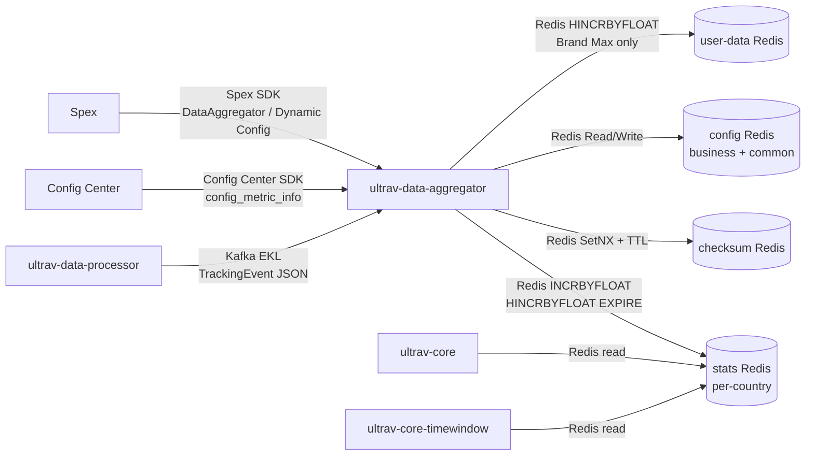

<!-- ads-workspace-gdoc-sync: gdoc_id=1cXBbECsd0Mqz86udzXQpj73R7iF7ZagfrniaWdlyQOA gdoc_url=https://docs.google.com/document/d/1cXBbECsd0Mqz86udzXQpj73R7iF7ZagfrniaWdlyQOA/edit -->

# ultrav-data-aggregator

> Repository: https://git.garena.com/shopee/deep/paidads-bidding/ultrav-data-aggregator

## Table of Contents

1. [Introduction](#introduction)
2. [Features](#features)
3. [Architecture](#architecture)
   - [System Context](#system-context)
   - [Service Topology](#service-topology)
   - [Data Flow](#data-flow)
4. [Directory Structure](#directory-structure)
5. [Deployment Modes](#deployment-modes)
   - [Product Ads Standalone Deployment](#product-ads-standalone-deployment)
   - [Merged Deployment (content_ads)](#merged-deployment-content_ads)
6. [Core Pipeline](#core-pipeline)
   - [Kafka Consumption and Event Parsing](#kafka-consumption-and-event-parsing)
   - [Event Deduplication](#event-deduplication)
   - [Metric Generation](#metric-generation)
   - [Metric Writing](#metric-writing)
   - [Hot Key Local Aggregation](#hot-key-local-aggregation)
7. [Configuration](#configuration)
   - [Static Config (Spex)](#static-config-spex)
   - [Dynamic Config](#dynamic-config)
   - [Metric Aggregation Rules (Config Center)](#metric-aggregation-rules-config-center)
8. [Development Guidelines](#development-guidelines)
   - [Code Style](#code-style)
   - [How to Add New Metric Types](#how-to-add-new-metric-types)
   - [Project Structure](#project-structure)
   - [Naming Conventions](#naming-conventions)
   - [Error Handling](#error-handling)
   - [Unit Testing Standards](#unit-testing-standards)
   - [Code Review & Git Workflow](#code-review--git-workflow)
9. [Deployment](#deployment)
   - [Build for Production](#build-for-production)
   - [Release Process](#release-process)
10. [Monitoring](#monitoring)
11. [Business Terminology Glossary](#business-terminology-glossary)
12. [Additional Resources](#additional-resources)
13. [Frequently Asked Questions](#frequently-asked-questions)

---

## Introduction

`ultrav-data-aggregator` is Shopee PaidAds' **real-time metric aggregation service**. It consumes enriched TrackingEvents (impressions, clicks, orders, etc.) from Kafka produced by `ultrav-data-processor`, aggregates metrics by ad type, country, time window, and group key, and writes results to Redis. These aggregated metrics are read in real time by `ultrav-core` / `ultrav-core-timewindow` for bidding decisions.

The service supports 2 deployment modes:

| Deployment Mode | Ad Types Covered | Spex Node |
|---|---|---|
| Product Ads Standalone | Product Ads | `adsbidding.ultravdataaggregator` |
| Content Ads Merged | Shop Ads + Live Ads + Video Ads + Brand Max | `contentads.ultravdataaggregator` |

---

## Features

- **Real-time Kafka consumption**: High-concurrency TrackingEvent JSON consumption via EKL (Enhanced Kafka Lib), with `DispatcherByKey` partitioning and `ConcurrentConfirm` offset acknowledgment; 1000 worker threads by default.
- **Event deduplication**: Prevents duplicate events from being counted using checksum Redis `SetNX + TTL`.
- **Config-driven metric extraction**: All metric definitions (Conditions and Expressions) are delivered dynamically from Config Center — new metrics can be added without redeploying the service.
- **Multi-granularity time windows**: Supports 6 time granularities (History, Daily, Hourly, Quarter 15min, Minutely 5min, EveryMinute), each DataEntry carries its own TTL.
- **Hot key local aggregation**: High-frequency keys are buffered in `localAggregator` for 9–10s then batch-written, reducing Redis write pressure.
- **Per-country Redis routing**: Routes writes to the corresponding Redis cluster by country, achieving data isolation.
- **Brand Max user-data isolation**: Brand Max user-dimension metrics (`IsUserData=true`) are written to a separate `user_data` Redis cluster.
- **Prometheus metrics export**: Rich Prometheus metrics covering event counts, write latencies, error counts, etc., with support for country, ad type, and entrance-level breakdown.

---

## Architecture

### System Context

`ultrav-data-aggregator` is responsible for **posterior data collection and aggregation** in the ads bidding pipeline (corresponding to the Posterior Data Collection stage in SRA documentation). The upstream `ultrav-data-processor` enriches events and delivers them via Kafka (EKL channel). The downstream `ultrav-core` and `ultrav-core-timewindow` read aggregated results from Redis during bidding.

### Service Topology



**Topology table:**

| Category | Service/Dependency | Protocol | Description |
|---|---|---|---|
| **Upstream** | ultrav-data-processor | Kafka (EKL) | Upstream tracking event producer; sends impression, click, and order TrackingEvent JSON messages |
| **Upstream** | Config Center | Config Center SDK | Provides metric aggregation definitions (`config_metric_info` key) with hot-update support |
| **Upstream** | Spex | Spex SDK | Provides static service config (`DataAggregator`) and dynamic config (`DynamicConfigType`) with hot-reload support |
| **Downstream** | ultrav-core | Redis (read) | Reads aggregated metrics from stats Redis for real-time bidding decisions |
| **Downstream** | ultrav-core-timewindow | Redis (read) | Reads time-window aggregated data from stats Redis for time-period bidding control |
| **Dependency** | stats Redis | datastore | Per-country Redis clusters storing aggregated metrics; uses `INCRBYFLOAT` / `HINCRBYFLOAT` / `EXPIRE` |
| **Dependency** | checksum Redis | datastore | Event deduplication Redis; prevents duplicate consumption via `SetNX + TTL` |
| **Dependency** | config Redis | datastore | Stores group key mappings and business aggregation rules (business + common namespaces) |
| **Dependency** | user-data Redis | datastore | Brand Max-exclusive; stores user-dimension aggregated data |

#### Middleware Instance Details

The repository uses two Spex entrypoints: `server/product_ads/main.go` initializes `adsbidding.ultravdataaggregator`, while `server/content_ads/main.go` initializes `contentads.ultravdataaggregator`. The content binary reads four item keys from the same `[sp]contentads / ultravdataaggregator` namespace: `shop_ads_config`, `live_ads_config`, `video_ads_config`, and `brand_max_config`. It does not read per-vertical namespaces such as `adsbidding.shopadsultravdataaggregator`.

| Type | Direction | Concrete Instance | Purpose | Evidence |
|---|---|---|---|---|
| Kafka | Consume | Product config key `config.ekl_kafka_consumer` in `[sp]adsbidding / ultravdataaggregator`; brokers `di-kafka-stt01-bg1-bootstrap01/02/03-stt-sg.data-infra.shopee.io:9093`, `di-kafka-da01-bg1-bootstrap01/02/03-dallas-us.data-infra.shopee.io:9093`; topics `bidding_tracking_event_id/my/ph/sg/th/tw/vn`, `mkplpaidads_discovery_ads.hyperx_tracking_event_us`; groups `ultrav_data_aggregator`, `paidads_mkplpaidads_hyperx` | Product Ads enriched TrackingEvent input | `server/product_ads/main.go`, `config/data_aggregator.go` |
| Kafka | Consume | Content config keys in `[sp]contentads / ultravdataaggregator`: `shop_ads_config.ekl_kafka_consumer` topics `shop-ads-data-event-global-live`, `shop-ads-data-event-br-live`; `live_ads_config.ekl_kafka_consumer` topics `live-ads-data-event-global-live`, `live-ads-data-event-br-live`; `video_ads_config.ekl_kafka_consumer` topics `adsbidding_videoads_ultrav_data_processor-global-live`, `adsbidding_videoads_ultrav_data_processor-br-live`; `brand_max_config.ekl_kafka_consumer` topics `brand-max-bidding-event-global-live`, `brand-max-bidding-event-br-live` | Content Ads enriched event input by vertical | `server/content_ads/main.go`, `config/content_ads_aggregator.go` |
| Redis | Write | `post_data_spex` points to Config Center `ads_bidding/post_data_redis_config` | Aggregated stats writes through `post_data_client.NewWithSpex` and `WriteByBatch` | `config/data_aggregator.go`, `pkg/data/stats_redis/client.go` |
| Redis | ReadWrite | Product `config.checksum_cli.redis`: `03tcn.elasticredis.cloud.shopee.io:10421`, `ka0oo.elasticredis.cloud.shopee.io:10829`; key pattern `sum_da_<country>_<eventType>:<checksum>`; TTL from `checksum_cli.ttl`, default `1h` | Product duplicate event suppression with `SetNX + TTL` | `pkg/data/checksum/checksum.go` |
| Redis | ReadWrite | Content checksum Redis: `shop_ads_config` uses `gkil5.elasticredis.cloud.shopee.io:10243`, `p4bix.elasticredis.cloud.shopee.io:11450`; `live_ads_config` uses `mvohf.elasticredis.cloud.shopee.io:10469`, `nwhw8.elasticredis.cloud.shopee.io:14131`; `video_ads_config` uses `nitmd.elasticredis.cloud.shopee.io:11624`; `brand_max_config` uses `vgyor.elasticredis.cloud.shopee.io:10515`, `yvqj8.elasticredis.cloud.shopee.io:11555` | Content duplicate event suppression with `SetNX + TTL` | `config/content_ads_aggregator.go`, `pkg/data/checksum/checksum.go` |
| Config Center | Read | Product `aggr_config_center_address` = `ads_bidding/product_ads_bidding_aggregation_config`; common config = `ads_bidding/bidding_common`; content items also use `post_data_redis_config` | Metric aggregation rules, common metric definitions, post-data Redis routing | `config/data_aggregator.go`, `config/metric_config/config_center_metric_source.go` |
| DB/FSE/Vespa/S3/ClickHouse | None detected | This repository does not directly read/write DB, FSE, Vespa, S3, or ClickHouse in the scanned code | Storage access is Redis/Kafka/Config Center only | source scan |

### Data Flow

```
Kafka topic (enriched TrackingEvents from ultrav-data-processor)
  ↓ EKL AdvancedConsumer (DispatcherByKey / 1000 workers / ConcurrentConfirm)
  ↓ TrackingEventHandler.Transform()
      JSON deserialization → TrackingEvent
      GroupKeysMap values typed via configCli.GetEventValueByGroupKeyType()
  ↓ TrackingEventHandler.Process()
      countryIndexes filter (events with unknown countries are dropped)
      SumChecker.Exists() → Redis SetNX("sum_da_{country}_{type}:{checksum}", TTL)
      BidRerankTrace base64+protobuf decoding
      monitorEvent() → Prometheus event counters
  ↓ statsProcessor.ProcessTrackingEvent() (concurrent goroutines)
      MetricGenerator.GenerateDataEntries()
          configCli.GetGroupKeyAggregations() → []AggrConfig
          For each AggrConfig × time granularity × metric:
              Extract groupKeyValues → Cartesian combinations
              A/B bucket filtering
              extractMetricByConfig / extractFeedbackMetricByConfig
                  ConditionChecker.CheckConditions() (AND, with Negate support)
                  ExpressionEvaluator.EvaluateExpression() → float64
              Generate LocalTimeSpanMark (country-local time window)
              GenRedisKey() → METRIC_{name}_{timeWindow}_{groupKeyString}
              Return *DataEntry
      MetricWriter.WriteMetrics([]*DataEntry)
          IsPotentialHotKey → localAggregator.PushDataEntry (channel 100k)
          Normal keys → PostDataRedis.WriteByBatch()
  ↓ localAggregator (per-country goroutine, triggered every 9–10s)
      accumulateDataEntry (in-memory sum of Count / CountFloat / DecimalValue)
      syncToRedis(): batches of 100, parallel WriteByBatch goroutines
  ↓ PostDataRedis.WriteByBatch()
      Sharded (Product Ads): toPostDataEntry() → post_data_client.WriteByBatch() with shard routing
      Legacy (other ad types):
          redisClient.CountryClient(country) → country-specific Redis cluster
          redis.Pipeline():
              COUNT    → INCRBYFLOAT + EXPIRE
              SCALAR   → HINCRBYFLOAT(COUNT, SUM) + EXPIRE
              HASH     → HINCRBYFLOAT(subKey) + EXPIRE
              FEEDBACK → per delay bucket: HINCRBY(COUNT) + HINCRBYFLOAT(SUM) + EXPIRE
          Pipeline.Exec()
```

---

## Directory Structure

```
ultrav-data-aggregator/
├── Makefile                        # Build, test, format commands
├── go.mod / go.sum                 # Go module dependencies
├── config/                         # Configuration struct definitions
│   ├── data_aggregator.go          # DataAggregator main config struct (includes CountryKafkaConfigs)
│   ├── content_ads_aggregator.go   # Loads 4 Spex keys for content_ads merged deployment
│   ├── dynamic/
│   │   └── dynamic_config.go       # DynamicConfigType with hot-update support
│   └── metric_config/              # MetricConfig definitions, Condition/Expression types, validator
│       ├── types.go                # MetricType constants (COUNT/SCALAR/HASH/PERCENT/FEEDBACK)
│       ├── metric_config.go        # MetricConfig / ExtractionConfig / Condition / Expression structs
│       └── validator.go            # Configuration validation logic
├── pkg/
│   ├── handler/
│   │   ├── event_handler.go        # TrackingEventHandler: Transform (JSON → TrackingEvent) + Process (filter + dedup + fanout)
│   │   └── processor.go            # TrackingEventProcessor interface; concurrent fan-out registration
│   ├── services/
│   │   ├── metric_generator/
│   │   │   ├── generator.go        # MetricGenerator: GenerateDataEntries core logic
│   │   │   ├── function_registry.go # FunctionRegistry: builtin function registration and invocation
│   │   │   ├── builtin_functions.go # All builtin condition/expression function implementations
│   │   │   ├── condition_checker.go # ConditionChecker: AND logic with Negate support
│   │   │   ├── expression_eval.go  # ExpressionEvaluator: evaluation of 5 expression types
│   │   │   └── field_accessor.go   # Reflection-based cached access to TrackingEvent fields (dot-path support)
│   │   ├── metric_writer/
│   │   │   ├── writer.go           # MetricWriter: hot key routing vs. direct write
│   │   │   └── local_aggregator.go # localAggregator: 100k channel, 9–10s jitter flush
│   │   └── stats_processor/
│   │       └── processor.go        # StatsProcessor: chains generate + write; Brand Max dual routing
│   ├── data/
│   │   ├── checksum/
│   │   │   └── checksum.go         # SumChecker: Redis SetNX dedup, key = sum_da_{country}_{type}:{checksum}
│   │   └── stats_redis/
│   │       └── client.go           # PostDataRedis: routes Redis commands by MetricType, per-country routing
│   ├── types/
│   │   ├── data_entry.go           # DataEntry: Redis key / value / TTL / bucket info
│   │   └── time_span_mark.go       # LocalTimeSpanMark: 6 time granularity definitions and TTLs
│   └── util/
│       ├── exporter.go             # Prometheus metrics export (event counts, latencies, errors)
│       ├── record_metrics.go       # Business metric monitoring (Product Ads key metrics, Live Ads, PCOC)
│       └── util.go                 # Utility functions (order type checks, ROI3 bucket validation, etc.)
├── server/
│   ├── init.go                     # Dependency injection & startup: InitAdTypeDeps / StartKafkaConsumers / StopGracefullyFor
│   ├── spex_name.go                # Spex name constants (ProductAdsSpexName / ContentAdsSpexName)
│   ├── product_ads/main.go         # Product Ads standalone deployment entry point
│   └── content_ads/main.go         # Content Ads merged deployment entry (Shop + Live + Video + Brand Max)
├── mocks/                          # Mock interfaces (generated by golang/mock)
├── mock_data/                      # Test mock data (JSON fixtures)
└── tool/                           # Local debugging tools (mock_kafka_input)
```

---

## Deployment Modes

### Product Ads Standalone Deployment

Currently only Product Ads retains a standalone entry point (`server/product_ads/main.go`):

| Ad Type | Makefile Target | Output | Spex Name |
|---|---|---|---|
| Product Ads | `make product-svc` | `bin/ultrav-data-aggregator` | `adsbidding.ultravdataaggregator` |

Startup sequence:

```go
spex.FastInitSpex(context.Background(), server.ProductAdsSpexName)
config.SetConfig()                                    // Load Spex static config
dynamic.SetDynamicConfig()                            // Load dynamic config
server.InitAdTypeDeps(config.AggregatorConfig, constant.BizTypeProductAds)
server.StartKafkaConsumers(appDeps, errCh)
server.StartHTTPServer(httpServer, errCh)
// Wait for SIGINT/SIGTERM, graceful shutdown
server.StopGracefully(appDeps, httpServer)
```

### Merged Deployment (content_ads)

`server/content_ads/main.go` runs **4 ad types** (Shop / Live / Video / Brand Max) in a **single process**, loading 4 independent Spex keys via `config.SetContentAdsConfig()`:

| Global Variable | Spex Key | bizType constant |
|---|---|---|
| `config.ShopAdsConfig` | `"shop_ads_config"` | `BizTypeShopAds` |
| `config.LiveAdsConfig` | `"live_ads_config"` | `BizTypeLiveAds` |
| `config.VideoAdsConfig` | `"video_ads_config"` | `BizTypeVideoAds` |
| `config.BrandMaxConfig` | `"brand_max_config"` | `BizTypeBrandMax` |

Each ad type is independently initialized via `server.InitAdTypeDeps(cfg, bizType)`, producing independent Kafka consumers, Redis clients, and stats processors. Each vertical can be individually disabled via `cfg.Disabled = true` without code changes.

The overall Spex node is `contentads.ultravdataaggregator` (`server.ContentAdsSpexName`). Graceful shutdown uses `StopGracefullyFor(deps, nil, gracePeriod)` rather than the global `config.AggregatorConfig`.

| Dimension | Product Ads Standalone | content_ads Merged |
|---|---|---|
| Spex keys | 1 | 4 |
| Spex node name | `adsbidding.ultravdataaggregator` | `contentads.ultravdataaggregator` |
| Processes | 1 | 1 (shared) |
| Kafka consumers | 1 (supports CountryKafkaConfigs) | 4 (independent per vertical, each supports CountryKafkaConfigs) |
| Redis clients | 1 stats + 1 checksum | 4 stats + 4 checksum (+ 1 user-data for Brand Max) |
| Use case | High-traffic; independent scaling | Resource-constrained; saves resources |

---

## Core Pipeline

### Kafka Consumption and Event Parsing

EKL (`git.garena.com/shopee/core-server/enhanced-kafka-lib`) runs in AdvancedConsumer mode:

- **Dispatcher**: `DispatcherByKey` — messages with the same Kafka key (usually ads_id) are always routed to the same worker, preserving ordering.
- **Worker count**: 1000 by default (`cfg.KafkaConsumer.WorkerNum`).
- **Acknowledgment mode**: `ConcurrentConfirm` — offset confirmation is asynchronous.
- **Rate limit**: `RateLimitPerSecond` defaults to 5000.

`TrackingEventHandler.Transform()` (`pkg/handler/event_handler.go:45`):

1. JSON deserialization → `*common_types.TrackingEvent`
2. For each key in `GroupKeysMap`, calls `configCli.GetEventValueByGroupKeyType(value, key)` to convert raw strings to typed values (`int32` / `int64` / `string`)

`TrackingEventHandler.Process()` (`pkg/handler/event_handler.go:78`):

1. Country filter: if `trackingEvent.Country` is not in `countryIndexes` → drop
2. Checksum deduplication (see next section)
3. BidRerankTrace decoding: base64 → protobuf deserialization
4. `monitorEvent()` → Prometheus counters
5. Concurrent fan-out to all registered processors (`ProcessTrackingEvent`)

### Event Deduplication

File: `pkg/data/checksum/checksum.go`

```go
key := fmt.Sprintf("sum_da_%s_%s:%s", country, eventType, sum)
isSet, _ := cli.SetNX(ctx, key, "", ttl)
// isSet=true  → new event, continue processing
// isSet=false → duplicate event, discard
```

- **Checksum source**: Pre-computed by upstream `ultrav-data-processor`, stored in `TrackingEvent.Checksum`.
- **Key format**: `sum_da_{country}_{eventType}:{checksum}`
- **TTL**: Configured via `CheckSumConfig.TTL`, defaults to 1 hour.

### Metric Generation

`MetricGenerator.GenerateDataEntries()` (`pkg/services/metric_generator/generator.go:96`):

1. Fetch all `AggrConfig` from `configCli.GetGroupKeyAggregations(SourceType_Track)`
2. For each `AggrConfig`:
   - Validate `[]string` group key list length (against `DynamicConfig.GroupKeyListLenThreshold`)
   - Call `generateDataEntriesByAggrConfig()`
3. For each AggrConfig × time granularity (History / Daily / Hourly / Quarter / Minutely / EveryMinute):
   - Extract groupKeyValues, compute all Cartesian combinations (`backtrack()`)
   - `isPotentialHotKey`: if the event's country is in `DynamicConfig.FullLocalAggCountries`, ALL DataEntries for that country are marked as hot key candidates (bypassing the group key check); otherwise combinations containing no large-pool group keys are flagged as hot key candidates
   - For each combination, call `extractMetricByConfig()` or `extractFeedbackMetricByConfig()`:
     - **ConditionChecker**: AND evaluation of all Conditions (with `Negate` support); on failure returns `DefaultValue` (if configured) or `-1` (not recorded)
     - **ExpressionEvaluator**: evaluates Expression (`constant` / `field` / `map` / `arithmetic` / `function`)
   - Generate `LocalTimeSpanMark` (time window based on country local time)
   - `GenRedisKey()` generates final key: `METRIC_{metricName}_{timeWindow}_{groupKeyString}[_pbk_{p}][_tbk_{t}]`

**6 time window types:**

| MarkType | Granularity | Key Format Example | Default TTL |
|---|---|---|---|
| History | All-time | `ALL` | 30 days |
| Daily | Per day | `20240423` | 9 days |
| Hourly | Per hour | `2024042315` | 26 hours |
| Quarter | 15 minutes | `202404231500@15` | 1 hour |
| Minutely | 5 minutes | `202404231500@5` | 2 hours |
| EveryMinute | Per minute | `202404231500` | 2 hours |

### Metric Writing

`PostDataRedis.WriteByBatch()` (`pkg/data/stats_redis/client.go`) dispatches to one of two write paths depending on how `PostDataRedis` was constructed:

- **Sharded path** (Product Ads, constructed via `NewWithSpex`): converts each `DataEntry` to a `common_types.PostDataEntry` and delegates to `post_data_client.WriteByBatch`, which handles per-shard routing based on Spex Config Center shard assignments.
- **Legacy single-cluster path** (all other ad types, constructed via `New`):
  1. `redisClient.CountryClient(country)` routes to the country-specific Redis cluster
  2. Opens Redis Pipeline and selects commands by MetricType:

| MetricType | Redis Commands |
|---|---|
| COUNT | `INCRBYFLOAT key DecimalValue` + `EXPIRE key TTL` |
| SCALAR (global bucket) | `HINCRBY key COUNT int64(count)` + `HINCRBYFLOAT key SUM DecimalValue` + `EXPIRE` |
| SCALAR (traffic bucket) | `HINCRBYFLOAT key COUNT CountFloat` + `HINCRBYFLOAT key SUM DecimalValue` + `EXPIRE` |
| HASH | `HINCRBYFLOAT key SubKey DecimalValue` + `EXPIRE` |
| FEEDBACK | Per delay bucket (i=0..N): `HINCRBY key COUNT` + `HINCRBYFLOAT key SUM FeedbackValue[i]` + `EXPIRE` |

3. `Pipeline.Exec()` submits all commands in a single round trip

### Hot Key Local Aggregation

`localAggregator` (`pkg/services/metric_writer/local_aggregator.go`):

- **Detection logic**: `IsPotentialHotKey = DynamicConfig.FullLocalAggCountries[country] || !checkContainGroupKeysWithLargePool(groupKeys)` — if `FullLocalAggCountries` is enabled for a country, all entries are routed through localAggregator; otherwise combinations without large-pool group keys (e.g., user_id, shop_id with huge candidate sets) are treated as hot key candidates.
- **Per-country isolation**: `writer` allocates one `localAggregator` instance per country, indexed by `countryIndexes`.
- **Channel capacity**: 100,000 DataEntry slots (prevents back-pressure from blocking Kafka consumption).
- **Flush interval**: Configurable per country via `DataAggregator.CountryLocalAggIntervalMs`; if set for a country, uses `override_ms + rand(1000ms)` jitter; otherwise defaults to `10000ms + rand(1000ms)` to prevent synchronized write storms.
- **Overflow protection**: When the in-memory data map reaches `DynamicConfig.LocalAggMaxEntries` entries, a synchronous flush to Redis is triggered immediately before accumulating the new entry, bounding memory usage.
- **Accumulation**: In-memory map that sums `Count` / `CountFloat` / `DecimalValue` for the same Redis key; FEEDBACK type element-wise sums slices.
- **Flush triggers**: Timer or immediate on service stop (`StopGracefully`).

---

## Configuration

### Static Config (Spex)

Main config struct: `config.DataAggregator` (`config/data_aggregator.go`)

| Field | Description |
|---|---|
| `LogLevel` | Log level (supports runtime change) |
| `GracefulPeriod` | Graceful shutdown wait duration, default `"10s"` |
| `Countries` | List of country codes the service processes (e.g., `["SG", "MY", "TH"]`) |
| `CountryIndexes` | `country → index` map generated from `Countries` (used for localAggregator array indexing) |
| `KafkaConsumer` | EKL Kafka config (brokers, topics, group_id, worker count, rate limit, etc.); the `CountryKafkaConfigs` sub-field supports configuring independent broker/topic/group_id per country (automatically uses single vs. per-country multi-consumer based on whether this list is populated) |
| `CheckSumCli` | Checksum Redis config (address, TTL) |
| `BusinessConfigCenterAddress` | Business namespace Config Center address |
| `CommonConfigCenterAddress` | Common namespace Config Center address (stores `config_metric_info`) |
| `StatsCli` | Stats Redis config (aggregated metric write target; used by non-ProductAds ad types) |
| `PostDataSpex` | `post_data_client.SpexConfig` for multi-cluster shard routing (Product Ads only); shard assignments are hot-reloaded from Spex Config Center |
| `UserDataCli` | User-data Redis config (Brand Max only) |
| `CountryLocalAggIntervalMs` | Per-country override for localAggregator flush interval (milliseconds); if absent for a country the default 10 s interval is used |

**Per-country Kafka config** (`KafkaConfig.CountryKafkaConfigs`): if this list is non-empty, `server.newEklKafkaConsumers()` creates an independent EKL consumer for each `CountryKafkaConfig`, enabling country-level broker/topic isolation. If the list is empty, the shared config is used (backward-compatible behavior).

Hot-reloaded via Spex SDK — changes take effect without service restart.

**SPEX and spcli Setup:**

This service uses [SPEX](https://spex.shopee.io) for configuration management. Use the `spcli` tool to read/write configs in development:

1. Install spcli: see [spcli installation guide](https://spex.shopee.io/user-guide/SDK/Java/local.html)
2. Configure Git: follow the documentation to configure spcli-related fields in `~/.gitconfig`
3. Read config: `spcli get <namespace> <key>`
4. Write config: `spcli set <namespace> <key> <value>`

SPEX Go SDK usage: [SPEX Go SDK Quick Start](https://spex.shopee.io/overview/quick-start/languages/go/index.html)

### Dynamic Config

Struct: `dynamic.DynamicConfigType` (`config/dynamic/dynamic_config.go`)

Hot-updated via Spex key `"dynamic"` without restart:

| Field | Description |
|---|---|
| `OcpmOrderAdsSampleRate` | Sampling rate for OCPM order log entries |
| `WhitelistForGroupKeyLen` | Group keys exempted from list-length validation |
| `GroupKeyListLenThreshold` | Maximum allowed length for `[]string` type group keys |
| `EventProcessLagThreshold` | Event consumption lag alert threshold (milliseconds) |
| `EventLagLogSampleRate` | Sampling rate for lag log entries |
| `FullLocalAggCountries` | Map of countries for which ALL DataEntries are routed through localAggregator regardless of hot-key status (bypasses the large-pool group key check entirely for those countries) |
| `LocalAggMaxEntries` | Caps the in-memory localAggregator data map size per country; when the cap is reached a sync flush to Redis is triggered immediately before accumulating new entries |

### Metric Aggregation Rules (Config Center)

**Storage path**: Config Center → `bidding_common` namespace → `config_metric_info` key

Structure: `map[metricName]*MetricConfig`

Example single MetricConfig:

```json
{
  "IMP": {
    "type": "COUNT",
    "extraction_config": {
      "conditions": [
        { "type": "event_type", "params": { "event_type": "IMP" } },
        { "type": "field", "params": { "field": "DeductionReason", "operator": "==", "value": 0 } }
      ],
      "expression": { "type": "constant", "params": { "value": 1 } }
    }
  }
}
```

**MetricType enum** (`config/metric_config/types.go`):

| Type | Description |
|---|---|
| `COUNT` | Counter; Redis INCRBYFLOAT |
| `SCALAR` | Scalar (for computing averages); Redis HINCRBYFLOAT(COUNT, SUM) |
| `HASH` | Hash (sub-key dimension); Redis HINCRBYFLOAT(subKey) |
| `PERCENT` | Percentage type |
| `FEEDBACK` | Feedback type (multiple delay buckets); e.g., GMV attribution |

**Condition types** (`ConditionType`):

| Type | Description | Example params |
|---|---|---|
| `event_type` | Event type filter | `{ "event_type": "IMP" }` (allowed: IMP/CLICK/ORDER/DEDUCTION_IMP/RAWIMP/RAWCLICK/VIEW) |
| `field` | TrackingEvent field comparison | `{ "field": "DeductionReason", "operator": "==", "value": 0 }` |
| `map` | Value comparison from groupMaps | `{ "key": "tag_type_subsidy_version", "operator": "==", "value": "2:1" }` |
| `function` | Call a registered builtin function | `{ "function_name": "IsPlacedBroadOrder" }` |

Supports `negate: true` for negation; all conditions use AND semantics.

**Expression types** (`ExpressionType`):

| Type | Description |
|---|---|
| `constant` | Constant value |
| `field` | TrackingEvent field value (supports dot-path, optional `cast` type conversion) |
| `map` | Value from groupMaps |
| `arithmetic` | Arithmetic operations (+/-/*//; at least 2 operands) |
| `function` | Call a registered builtin function |

---

## Development Guidelines

### Code Style

- **Language**: Go 1.24
- **Formatting**: `make fmt` (`go fmt ./...`); must run before committing
- **Import ordering**: `make gci` (standard → default → `git.garena.com` → `git.garena.com/shopee/deep` → local module)
- **Static analysis**: `make vet` (`go vet ./...`)

### How to Add New Metric Types

#### Option 1: Config-driven (recommended)

Most new metrics require no code changes — add a config entry directly in Config Center `config_metric_info`:

1. Add a new MetricConfig JSON to `bidding_common/config_metric_info` in [Config Center](https://space.shopee.io/console/cmdb/config_center/detail/shopee.mp_search_recommendation_ads.paidads.ads_bidding.configuration_server/ads_bidding/live/namespace/bidding_common)
2. Verify config syntax (condition types, expression types must exist in the registry)
3. After publishing, check the monitors:
   - [Success counter](https://monitoring.infra.sz.shopee.io/grafana/d/mB7oDOnNk/ultrav-data-aggregator?orgId=39&var-sdu=adsbidding-ultravdataaggregator-live-global&var-idc=sg7&viewPanel=151)
   - [Validation fail](https://monitoring.infra.sz.shopee.io/grafana/d/mB7oDOnNk/ultrav-data-aggregator?orgId=39&var-sdu=adsbidding-ultravdataaggregator-live-global&var-idc=sg7&viewPanel=152)

> **Warning**: Config validation failure will block the next aggregator startup. Always check the monitors above after publishing.

#### Option 2: Adding a new MetricType (requires code change)

1. Define a new `MetricType` constant in `config/metric_config/types.go`
2. Implement the corresponding Redis write logic in `WriteByBatch` in `pkg/data/stats_redis/client.go`
3. Register the new type's generation logic in `pkg/services/metric_generator/generator.go`
4. Deploy the code first, then use the new type in config

#### Option 3: Adding a new Condition / Expression builtin function

When `condition.type=function` or `expression.type=function` is used, the function name must already exist in the registry:

1. Implement the new function in `pkg/services/metric_generator/builtin_functions.go`; function signature: `(trackingEvent, groupMaps) → bool/float64/[]float64`
2. Register it in `RegisterBuiltinFunctions` by calling `registry.RegisterFunction(name, fn)`
3. **Deploy code first, then update config** (otherwise config validation will fail)

Currently registered builtin functions (`builtin_functions.go`):

| Category | Function Name | Return Type | Description |
|---|---|---|---|
| Order type (Condition) | `IsPlacedDirectOrder` | bool | Direct channel order placed (non-broad) |
| | `IsPlacedShopOrder` | bool | Shop channel order placed (broad) |
| | `IsPlacedBroadOrder` | bool | All orders placed (including broad) |
| | `IsPaidDirectOrder` | bool | Direct channel order paid |
| | `IsPaidBroadOrder` | bool | All orders paid |
| | `IsValidECPCAds` | bool | ECPC ads validity check (from groupMaps) |
| | `IsValidECPCAdsFromEvent` | bool | ECPC ads validity check (from TrackingEvent.GroupKeysMap) |
| Event filter (Condition) | `clickOrDeductionImp` | bool | Click or deduction impression |
| | `expectGmvClickEligible` | bool | OCPM expected GMV event filter |
| | `shopRevEligible` | bool | Shop ads revenue event filter |
| | `redeemedOrder1hEligible` | bool | 1h redeemed order filter |
| | `order1hEligible` | bool | 1h direct order filter |
| ROI3 (Condition) | `roi3BroadBaseOrder` | bool | ROI3 broad base bucket |
| | `roi3DirectBaseOrder` | bool | ROI3 direct base bucket |
| | `roi3BroadExpOrder` | bool | ROI3 broad exp bucket |
| | `roi3DirectExpOrder` | bool | ROI3 direct exp bucket |
| PGMV Feedback (Condition) | `todayPgmvFeedbackCond` | bool | Today PGMV feedback event validity |
| | `todayPayPgmvFeedbackCond` | bool | Today Pay PGMV feedback event validity |
| Delta eCPM (Condition) | `trafficBoostDeltaEcpmCond` | bool | Traffic Boost Delta eCPM existence check |
| | `voucherBoostDeltaEcpmCond` | bool | Voucher Boost Delta eCPM existence check |
| | `hasNonNilDeltaEcpm` | bool | DeltaEcpm field is non-nil |
| | `hasNonNilDeltaPvalue` | bool | DeltaPvalue field is non-nil |
| | `hasNonNilBoostFactor` | bool | BoostFactor field is non-nil |
| Metric extraction (Expression) | `calculatePGmvAov` | float64 | Product GMV AOV calculation |
| | `calculatePadvvAov` | float64 | Advv AOV calculation |
| | `getTagTypeSubsidyVer` | tuple | Parse tag_type:subsidy_version from groupMaps |
| | `getDeltaPvalue` | float64 | Fetch value from DeltaPvalue map |
| | `getPgmv2Click` | float64 | PGMV_2_CLICK value (prefer Pgmv, fallback Pcr*ItemPrice) |
| | `getPadvv2Click` | float64 | Padvv_2_CLICK value |
| | `getShopBroadAdvv` | float64 | Shop ads Broad Advv |
| | `getGmv500` | float64 | GMV capped at 500 USD equivalent |
| | `getPgmv2Imp` | float64 | PGMV_2_IMP value |
| | `getDirectPgmv2Imp` | float64 | Direct channel PGMV_2_IMP value |
| | `getCostReal` | float64 | Actual cost (Click: DAI balance diff; OCPM: AdjustedCost) |
| | `getPCost` | float64 | Predicted cost (impression with DeductionReason=0: OCPM returns BidDeductionPrice directly; CPC returns Pctr × BidDeductionPrice) |
| | `getPcrVModel` | float64 | Voucher model pCR adjustment (segmented by VoucherPrice/ItemPrice) |
| | `getDeltaEcpm` | float64 | Normalized DeltaEcpm (adjusted by Pctr and deduction price) |
| | `getDeltaEcpmOri` | float64 | Raw DeltaEcpm (divided by Pctr only) |
| | `getBoostFactor` | float64 | BoostFactor value |
| | `getTrafficBoostDeltaEcpm` | float64 | Traffic Boost Delta eCPM value |
| | `getVoucherBoostDeltaEcpm` | float64 | Voucher Boost Delta eCPM value |
| | `getPgmv2WeightedPidCoef` | float64 | PGMV × OriginPidCoef weighted value |
| | `getMpcECost` | float64 | MPC eCost (with cap validation) |
| | `getMpcEGmv` | float64 | MPC eGMV (with cap validation) |
| | `getMpcECostCalied` | float64 | Calibrated MPC eCost |
| | `getMpcEGmvCalied` | float64 | Calibrated MPC eGMV |
| | `getTodayPgmvFeedback` | float64 | Today PGMV Feedback value |
| | `getTodayPayPgmvFeedback` | float64 | Today Pay PGMV Feedback value |
| | `getPgmvFeedbackRatio` | []float64 | PGMV daily feedback attribution ratios (7 buckets) |
| | `getPayPgmvFeedbackRatio` | []float64 | Pay PGMV daily feedback attribution ratios (7 buckets) |
| | `getAtcAdvv` | float64 | Add-to-cart Advv (prefer AtcAdvValue, fallback ItemPrice*TargetCir*ItemDeepEcr) |

Reference MR: https://git.garena.com/shopee/deep/paidads-bidding/ultrav-data-aggregator/-/merge_requests/210

### Project Structure

- `pkg/` — Core business logic (handler, services, data, types, util)
- `config/` — Configuration struct definitions
- `server/` — Per-vertical entry points and dependency injection
- `mocks/` — Auto-generated mock files (generated by `golang/mock`; do not edit manually)
- `tool/` — Local debugging only; not deployed

### Naming Conventions

- File names: `snake_case` (e.g., `event_handler.go`, `local_aggregator.go`)
- Interface names: verb/role based (e.g., `TrackingEventProcessor`, `MetricWriter`, `MetricGenerator`)
- Constants: `MetricType_COUNT`, `ConditionType_EventType` (`{Category}_{Value}` format)
- Prometheus metric name prefix: `paidads_ultrav_data_aggregator_`

### Error Handling

- Redis write failures: logged to Prometheus error counter (`component=stats_redis`); does not interrupt consumption
- Checksum Redis failures: treated as "not seen" (event is not dropped); error counter is incremented
- Config validation failures: block service startup; detailed error log is printed
- Event consumption lag exceeding `EventProcessLagThreshold`: Prometheus error counter incremented; logs sampled at `EventLagLogSampleRate`

### Unit Testing Standards

- Run tests: `make unittest` (`go test -cover ./...`)
- Redis mock: uses `github.com/alicebob/miniredis/v2`; no real Redis required
- Mock generation: `github.com/golang/mock`; generated files in `mocks/`
- Test data: JSON fixtures in `mock_data/`

### Code Review & Git Workflow

- All changes merged via GitLab MR; requires at least 1 reviewer approval
- Run `make ci` (= `make ci-vet` + `make unittest`) before submitting
- CI pipeline automatically runs `vet` and unit tests
- Config changes (Config Center) and code changes are managed independently; if adding a builtin function, the code MR must be merged and deployed before the config is published

---

## Deployment

### Build for Production

```bash
# Build by deployment mode; all output to bin/ultrav-data-aggregator
make product-svc      # Product Ads standalone deployment
make content-ads-svc  # Content Ads merged deployment (Shop + Live + Video + Brand Max)

# Other common commands
make unittest         # Run unit tests
make ci               # vet + unit tests (full CI flow)
make fmt              # Format code
make vet              # Static analysis
make gci              # Organize import order
make proto            # Regenerate protobuf code (required when coef_extra.proto changes)
```

### Release Process

This service is managed through SPEX:

1. **Code merge**: MR merged to main branch, CI passes
2. **Image build**: CI automatically triggers image build
3. **Staging deployment**: Update staging environment config in SPEX console and publish
4. **Canary rollout**: Select canary strategy (by country, by IDC, etc.) in SPEX console and gradually increase traffic
5. **Full rollout**: Roll out fully after monitoring confirms no anomalies
6. **Config update** (if any): Update `config_metric_info` in Config Center; check validation monitors

> Full SPEX release process: [SPEX Release Documentation](https://spex.shopee.io/user-guide/SDK/Java/local.html)

---

## Monitoring

**Core dashboards:**

- **Main dashboard**: [ultrav-data-aggregator Grafana](https://monitoring.infra.sz.shopee.io/grafana/d/mB7oDOnNk/ultrav-data-aggregator?orgId=39&var-sdu=adsbidding-ultravdataaggregator-live-global&var-idc=sg7&var-country=All)
  - Panel 151: Config validation success counter
  - Panel 152: Config validation failure counter

**Key Prometheus metrics** (prefix: `paidads_ultrav_data_aggregator_`, exposed at `GET :{PORT_HTTP}/metrics`):

| Metric Name | Type | Labels | Description |
|---|---|---|---|
| `event_count` | Counter | `biz_type, country, event, entrance, placement, pricing_type` | Event consumption counts by type |
| `event_by_bucket_count` | Counter | Same + `plan_bucket, traffic_bucket, plan_traffic_bucket` | Event counts broken down by bucket |
| `error` | Counter | `biz_type, country, component, err` | Error counts by component and error type |
| `count` | Counter | `biz_type, country, component, type` | General-purpose counter |
| `latency` | Summary (p50/p90/p99) | `biz_type, country, component, type` | Latency per pipeline stage |
| `gauge` | Gauge | `biz_type, country, component, type` | Real-time status indicators |
| `metrics_count` | Counter | `biz_type, model_name, country, entrance, placement, metric, pricing_type` | Write count per metric |
| `metrics_value` | Summary | Same as above | Value distribution per metric |
| `key_metrics_count` | Counter | `biz_type, country, entrance, pricing_type, metric` | Key metric write count (Product Ads key metrics monitoring) |
| `key_metrics_value` | Summary | Same as above | Key metric value distribution |

**Business metric monitoring (`pkg/util/record_metrics.go`)**:

- **Product Ads** (`RecordProductAdsMetrics`): Reports IMP, CLICK, COST, COST_REAL, PLACED_ORDER, PLACED_GMV, PAID_ORDER, PAID_GMV, PLACED_BROAD_ORDER, PLACED_BROAD_GMV, PAID_BROAD_ORDER, PAID_BROAD_GMV, and unified-order-dimension PLATFORM_PLACED_GMV/ORDER, PLATFORM_PAID_GMV/ORDER, broken down by `entrance + pricingType`.
- **Live Ads** (`RecordLiveAdsMetrics`): Reports IMP, DEDUCT_IMP, DEDUCT_IMP_COST, BROAD_ORDER, BROAD_GMV broken down by `entrance + placement + pricingType`.
- **PCOC monitoring** (`PcocMonitor`, Product Ads): Tracks RAW_CLICK_DEDUP, P_UNI_ORDER_7D series, DIRECT_PGMV_7D series, and other deduplication-level metrics broken down by `UniPcrModel + entrance + placement`.

**Event latency monitoring**: `WriteMetrics` records the delay from event creation to Redis write via `ExportTimeGap(eventTimestamp, now)`. Events exceeding `DynamicConfig.EventProcessLagThreshold` trigger `error{component="stats_redis_cli.write_by_batch", err="event_process_lag"}` and are sampled at `EventLagLogSampleRate` for logging.

**Key alert rules (to be configured in Grafana/AlertManager):**

- `event_process_lag_threshold` exceeded → alert on `error{component="stats_redis_cli.write_by_batch", err="event_process_lag"}`
- `validation_fail` count increasing → Config Center validation failure; requires immediate review and rollback
- `error{component="stats_redis"}` increasing → Redis write anomaly

**Runtime log level change** (hot switch, no restart required):

```bash
curl -i -XPUT 127.0.0.1:$(cat HTTP_PORT)/log/debug   # Switch to debug
curl -i -XPUT 127.0.0.1:$(cat HTTP_PORT)/log/info    # Switch to info
curl -i -XPUT 127.0.0.1:$(cat HTTP_PORT)/log/fatal   # Switch to fatal
```

---

## Business Terminology Glossary

| Term | Description |
|---|---|
| TrackingEvent | An ads tracking event including impression (IMP), click (CLICK), order (ORDER), etc.; enriched by ultrav-data-processor and sent via Kafka |
| DataEntry | A single Redis write record containing key, aggregated values (Count/DecimalValue), TTL, and bucket information |
| MetricConfig | Metric configuration in Config Center, containing MetricType, Conditions list, and Expression |
| ExtractionConfig | Sub-structure of MetricConfig defining conditions / expression / default_value |
| Config Center | Shopee internal configuration center; the `config_metric_info` key stores aggregation metric definitions with hot-update support |
| EKL | Enhanced Kafka Lib; Shopee's internal Kafka consumer framework |
| Spex | Shopee service configuration management platform; manages service static and dynamic configs |
| hot key | A high-frequency Redis key; buffered by localAggregator and batch-written every 9–10s to reduce Redis write pressure |
| localAggregator | Hot key local aggregator; one instance per country; 100k channel capacity; flushes every 9–10s |
| eCPM | Effective Cost Per Mille; core metric in ad bidding |
| uGSP | Uniform Generalized Second Price; ad pricing mechanism |
| SPEX | See Spex |
| spcli | Spex CLI tool for local read/write of Spex configs |
| DAG | Directed Acyclic Graph; used to describe dependency relationships in the ads system |
| GAS | Group Aggregation Service; group key aggregation service |
| BidRerankTrace | Bid reranking trace information; base64-encoded protobuf carrying debug information from the bidding process |
| FEEDBACK | Feedback metric type; uses multiple delay buckets to store attribution data across time dimensions (e.g., GMV attribution) |
| content_ads | Merged deployment mode; Shop / Live / Video / Brand Max run in a single process |

See also [Paid Ads Glossary](https://confluence.shopee.io/pages/viewpage.action?spaceKey=SPAD&title=Paid+Ads+Glossary):

| Abbreviation | Full Name | Description |
|---|---|---|
| CPC | Cost Per Click | Cost per click |
| CPM | Cost Per Mille | Cost per 1000 impressions |
| CTR | Click-Through Rate | Clicks / Impressions |
| CR | Conversion Rate | Orders / Clicks |
| ROI | Return on Investment | Ad GMV / Ad Spend |
| ROAS | Return on Ad Spending | Same as ROI |
| Advv | Advertiser Value | Advertiser value; measurement of long-term revenue increase for the platform |
| Take-Rate | Take Rate | Ads Revenue / Platform GMV |

---

## Additional Resources

- **Repository**: https://git.garena.com/shopee/deep/paidads-bidding/ultrav-data-aggregator
- **Metric Config Authoring Guide (English)**: [how to add new metric in data collect](https://docs.google.com/document/d/1LQDX9Q2scrzqiGArrmk6VXFTcl-K6bZTpkJZkyHTPUo/edit?tab=t.ezbxi9wbkikh#heading=h.vu1p89e8f3lo)
- **Config Center (metric configs)**: [bidding_common/config_metric_info](https://space.shopee.io/console/cmdb/config_center/detail/shopee.mp_search_recommendation_ads.paidads.ads_bidding.configuration_server/ads_bidding/live/namespace/bidding_common)
- **Grafana Dashboard**: [ultrav-data-aggregator Dashboard](https://monitoring.infra.sz.shopee.io/grafana/d/mB7oDOnNk/ultrav-data-aggregator)
- **SPEX Go SDK**: [Quick Start](https://spex.shopee.io/overview/quick-start/languages/go/index.html)
- **spcli installation**: [spcli Setup Guide](https://spex.shopee.io/user-guide/SDK/Java/local.html)
- **Paid Ads Glossary**: [Glossary](https://confluence.shopee.io/pages/viewpage.action?spaceKey=SPAD&title=Paid+Ads+Glossary)
- **Upstream service**: [ultrav-data-processor](https://git.garena.com/shopee/deep/paidads-bidding/ultrav-data-processor)
- **Downstream services**: [ultrav-core](https://git.garena.com/shopee/deep/paidads-bidding/ultrav-core) / [ultrav-core-timewindow](https://git.garena.com/shopee/deep/paidads-bidding/ultrav-core-timewindow)
- **Builtin function addition example MR**: https://git.garena.com/shopee/deep/paidads-bidding/ultrav-data-aggregator/-/merge_requests/210

---

## Frequently Asked Questions

**Q1: How do I add a new aggregation metric (e.g., computing the average of a field)?**

A: Use the config-driven approach. Add a `SCALAR` type MetricConfig to `bidding_common/config_metric_info` in Config Center, with `conditions` (to filter event types) and `expression` (a `field` type pointing to the target field). After publishing, check Grafana Panel 151 (success counter) to confirm the config passes validation. No code changes or service restarts required.

**Q2: How is a Redis key determined to be a hot key? What is the difference in write paths for hot vs. normal keys?**

A: `IsPotentialHotKey = DynamicConfig.FullLocalAggCountries[country] || !checkContainGroupKeysWithLargePool(groupKeys)` — if the event country is in `FullLocalAggCountries` all entries for that country are treated as hot keys unconditionally; otherwise combinations without large-pool group keys (e.g., user_id or shop_id with huge candidate sets) are treated as hot key candidates. Hot keys are buffered by `localAggregator`, merged in memory, and batch-written every 9–10s (or per-country configured interval). Normal keys are written directly via `PostDataRedis.WriteByBatch()`.

**Q3: What is the difference between content_ads merged deployment and Product Ads standalone deployment? How do I choose?**

A: content_ads runs 4 ad types (Shop / Live / Video / Brand Max) in one process, sharing a single Spex node (`contentads.ultravdataaggregator`) but with independent Kafka consumers, Redis clients, and stats processors per vertical. Each vertical can be disabled individually via `cfg.Disabled=true`. Product Ads uses an independent Spex node (`adsbidding.ultravdataaggregator`) for standalone deployment, which is recommended for high-traffic scenarios requiring independent scaling and fault isolation.

**Q4: What should I do if Config Center config validation fails after an update?**

A: 1) Immediately roll back Config Center config to the previous version; 2) Check Grafana Panel 152 (validation fail counter) to confirm the failure is resolved; 3) Investigate the syntax issue (common causes: referencing an unregistered function_name, misspelled expression type, missing condition params); 4) Fix and republish. **Note**: Validation failure does not immediately impact the live service (old config remains effective), but will block the next service restart.

**Q5: How should the checksum TTL be chosen?**

A: TTL is configured via `CheckSumConfig.TTL`, defaulting to 1 hour. A TTL that is too short may fail to catch duplicate events (the same event could be processed again after TTL expires); too long wastes Redis memory. Generally, the TTL should cover the full retry window of the upstream system. 1 hour is typically sufficient.

**Q6: How is per-country Redis routing implemented?**

A: `redisutil.Redis` (`redisutil/v8`) wraps multiple country Redis cluster clients and returns the appropriate cluster via `CountryClient(country string)`. `DataAggregator.Countries` configures all supported country codes. TrackingEvents from countries not in this list are dropped at the `Process()` stage before any processing.

**Q7: After adding a field to TrackingEvent, how do I use it in the aggregator?**

A: 1) Add the field to TrackingEvent in the `paidads-bidding/common` library; 2) `ultrav-data-processor` updates the common version and populates the field for the relevant event types (imp/click/order); 3) `ultrav-data-aggregator` updates the common version; 4) Reference the new field name in MetricConfig via `expression.type=field` in Config Center (`field_accessor.go` uses reflection access and requires no code changes).

**Q8: What is the delay bucket mechanism for FEEDBACK type metrics?**

A: FEEDBACK is used for GMV attribution, splitting GMV across multiple time delays (1h / 3h / 24h / 72h, etc.) into separate delay buckets, each written to an independent Redis key (`GenRedisKey(i)`). The `GetFeedBackRatio()` function converts `FeedbackRatio1h/3h/24h/72h` into 7 daily attribution buckets with monotonicity validation (ensuring cumulative attribution ratios are non-decreasing).

**Q9: How do I locally debug Kafka consumption or Redis writes?**

A: The project provides a local debugging tool:
- `make mock_kafka_input` (`tool/mock_kafka_input/main.go`): simulates sending TrackingEvent messages to Kafka

Unit tests use `miniredis/v2` in-memory Redis — run `make unittest` without a real Redis environment.

**Q10: Will hot key data be lost during graceful service shutdown?**

A: No. `StopGracefully()` waits for `GracefulPeriod` (default 10s) and triggers an immediate flush (`syncToRedis()`) on all `localAggregator` instances, ensuring all buffered hot key data is written to Redis before the process exits.

<!-- Generated by ads-workspace/skills/ads-readme-generate | checked: 95b810ebc9f99d11914f4398665700b95d2d23e2 -->
