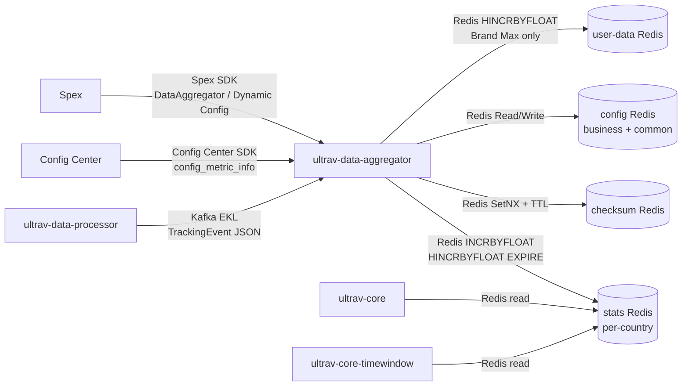

<!-- ads-workspace-gdoc-sync: gdoc_id=1-ggN432khjqFpXYZUALHjoovTAKCZfoGAqeiZz7q9BA gdoc_url=https://docs.google.com/document/d/1-ggN432khjqFpXYZUALHjoovTAKCZfoGAqeiZz7q9BA/edit -->

# ultrav-data-aggregator

> 仓库地址：https://git.garena.com/shopee/deep/paidads-bidding/ultrav-data-aggregator

## 目录 / Table of Contents

1. [项目概述 / Introduction](#项目概述--introduction)
2. [核心功能 / Features](#核心功能--features)
3. [项目架构 / Architecture](#项目架构--architecture)
   - [系统上下文 / System Context](#系统上下文--system-context)
   - [上下游调用拓扑 / Service Topology](#上下游调用拓扑--service-topology)
   - [数据流 / Data Flow](#数据流--data-flow)
4. [目录结构 / Directory Structure](#目录结构--directory-structure)
5. [部署模式 / Deployment Modes](#部署模式--deployment-modes)
   - [Product Ads 独立部署 / Single Vertical Deployment](#product-ads-独立部署--single-vertical-deployment)
   - [合并部署 (content_ads) / Merged Deployment](#合并部署-content_ads--merged-deployment)
6. [核心流程 / Core Pipeline](#核心流程--core-pipeline)
   - [Kafka 消费与事件解析 / Kafka Consumption and Event Parsing](#kafka-消费与事件解析--kafka-consumption-and-event-parsing)
   - [事件去重 / Event Deduplication](#事件去重--event-deduplication)
   - [指标生成 / Metric Generation](#指标生成--metric-generation)
   - [指标写入 / Metric Writing](#指标写入--metric-writing)
   - [热 key 本地聚合 / Hot Key Local Aggregation](#热-key-本地聚合--hot-key-local-aggregation)
7. [配置体系 / Configuration](#配置体系--configuration)
   - [静态配置 (Spex) / Static Config](#静态配置-spex--static-config)
   - [动态配置 / Dynamic Config](#动态配置--dynamic-config)
   - [指标聚合规则 (Config Center) / Metric Aggregation Rules](#指标聚合规则-config-center--metric-aggregation-rules)
8. [开发规范 / Development Guidelines](#开发规范--development-guidelines)
   - [代码风格 / Code Style](#代码风格--code-style)
   - [新增指标类型 / How to Add New Metric Types](#新增指标类型--how-to-add-new-metric-types)
   - [项目结构 / Project Structure](#项目结构--project-structure)
   - [命名规范 / Naming Conventions](#命名规范--naming-conventions)
   - [错误处理 / Error Handling](#错误处理--error-handling)
   - [单元测试 / Unit Testing Standards](#单元测试--unit-testing-standards)
   - [Code Review & Git Workflow](#code-review--git-workflow)
9. [部署 / Deployment](#部署--deployment)
   - [生产构建 / Build for Production](#生产构建--build-for-production)
   - [发布流程 / Release Process](#发布流程--release-process)
10. [监控 / Monitoring](#监控--monitoring)
11. [业务术语表 / Business Terminology Glossary](#业务术语表--business-terminology-glossary)
12. [参考资料 / Additional Resources](#参考资料--additional-resources)
13. [常见问题 / Frequently Asked Questions](#常见问题--frequently-asked-questions)

---

## 项目概述 / Introduction

`ultrav-data-aggregator` 是 Shopee PaidAds 广告竞价系统的**实时指标聚合服务**。它消费来自 `ultrav-data-processor` 经过丰富化的 TrackingEvent（展示、点击、订单等），按广告类型、国家、时间窗口、group key 聚合指标，并将结果写入 Redis，供下游 `ultrav-core` / `ultrav-core-timewindow` 在出价决策时实时读取。

支持 2 种部署模式：

| 部署模式 | 覆盖广告类型 | Spex Node |
|---|---|---|
| Product Ads 独立部署 | Product Ads（商品广告） | `adsbidding.ultravdataaggregator` |
| Content Ads 合并部署 | Shop Ads + Live Ads + Video Ads + Brand Max | `contentads.ultravdataaggregator` |

---

## 核心功能 / Features

- **实时 Kafka 消费**：通过 EKL（Enhanced Kafka Lib）高并发消费 TrackingEvent JSON 消息，支持按 key 分发（`DispatcherByKey`）和并发确认（`ConcurrentConfirm`），默认 1000 worker 线程。
- **事件去重**：利用 checksum Redis 的 `SetNX + TTL` 机制防止重复事件被计入聚合。
- **配置驱动的指标提取**：所有指标定义（包括 Condition 和 Expression）均来自 Config Center 动态下发，无需重新部署服务即可新增指标。
- **多时间窗口聚合**：支持 6 种时间粒度（History、Daily、Hourly、Quarter 15min、Minutely 5min、EveryMinute），每个 DataEntry 附带独立的 TTL。
- **热 key 本地聚合**：高频 key 通过 `localAggregator` 缓存 9–10s 后批量写入，避免直接在 Redis 上产生过多 INCRBYFLOAT 请求。
- **per-country Redis 路由**：按国家将写入请求路由到对应的 Redis 集群，数据隔离。
- **Brand Max 用户数据独立存储**：Brand Max 的用户维度指标（`IsUserData=true`）写入单独的 `user_data` Redis 集群。
- **Prometheus 指标导出**：暴露事件计数、写入延迟、错误计数等丰富的 Prometheus metrics，支持按国家、广告类型、entrance 等维度拆分。

---

## 项目架构 / Architecture

### 系统上下文 / System Context

`ultrav-data-aggregator` 在广告竞价链路中承担"后验数据收集与聚合"的职责（对应 SRA 文档的 Posterior Data Collection 阶段）。上游由 `ultrav-data-processor` 丰富化事件后通过 Kafka（EKL 通道）推送，下游 `ultrav-core` 和 `ultrav-core-timewindow` 在竞价时从 Redis 读取聚合结果。

### 上下游调用拓扑 / Service Topology



**拓扑说明：**

| 类别 | 服务/依赖 | 协议 | 描述 |
|---|---|---|---|
| **上游** | ultrav-data-processor | Kafka (EKL) | 上游 tracking 事件生产者，发送展示、点击、订单等 TrackingEvent JSON 消息 |
| **上游** | Config Center | Config Center SDK | 提供聚合指标定义（`config_metric_info` key），支持热更新 |
| **上游** | Spex | Spex SDK | 提供服务静态配置（`DataAggregator`）和动态配置（`DynamicConfigType`），支持热加载 |
| **下游** | ultrav-core | Redis (read) | 读取 stats Redis 中的聚合指标数据，用于实时出价决策 |
| **下游** | ultrav-core-timewindow | Redis (read) | 读取 stats Redis 中的时间窗口聚合数据，用于时段维度的出价控制 |
| **依赖** | stats Redis | datastore | per-country Redis 集群，存储聚合指标，使用 `INCRBYFLOAT` / `HINCRBYFLOAT` / `EXPIRE` |
| **依赖** | checksum Redis | datastore | 事件去重 Redis，通过 `SetNX + TTL` 防止重复消费 |
| **依赖** | config Redis | datastore | 存储 group key 映射和业务聚合规则（business + common namespace） |
| **依赖** | user-data Redis | datastore | Brand Max 专用，存储用户维度聚合数据 |

#### 中间件实例明细 / Middleware Instance Details

本仓库实际有两个 Spex 入口：`server/product_ads/main.go` 初始化 `adsbidding.ultravdataaggregator`，`server/content_ads/main.go` 初始化 `contentads.ultravdataaggregator`。content binary 在同一个 `[sp]contentads / ultravdataaggregator` namespace 下读取四个 item key：`shop_ads_config`、`live_ads_config`、`video_ads_config`、`brand_max_config`。它不读取 `adsbidding.shopadsultravdataaggregator` 这类按垂类拆开的 namespace。

| 类型 | 方向 | 具体实例名 | 用途 | 代码或配置证据 |
|---|---|---|---|---|
| Kafka | Consume | Product 配置 key `[sp]adsbidding / ultravdataaggregator` 的 `config.ekl_kafka_consumer`；brokers `di-kafka-stt01-bg1-bootstrap01/02/03-stt-sg.data-infra.shopee.io:9093`、`di-kafka-da01-bg1-bootstrap01/02/03-dallas-us.data-infra.shopee.io:9093`；topics `bidding_tracking_event_id/my/ph/sg/th/tw/vn`、`mkplpaidads_discovery_ads.hyperx_tracking_event_us`；groups `ultrav_data_aggregator`、`paidads_mkplpaidads_hyperx` | Product Ads enriched TrackingEvent 输入 | `server/product_ads/main.go`、`config/data_aggregator.go` |
| Kafka | Consume | Content 配置 key `[sp]contentads / ultravdataaggregator`：`shop_ads_config.ekl_kafka_consumer` topics `shop-ads-data-event-global-live`、`shop-ads-data-event-br-live`；`live_ads_config.ekl_kafka_consumer` topics `live-ads-data-event-global-live`、`live-ads-data-event-br-live`；`video_ads_config.ekl_kafka_consumer` topics `adsbidding_videoads_ultrav_data_processor-global-live`、`adsbidding_videoads_ultrav_data_processor-br-live`；`brand_max_config.ekl_kafka_consumer` topics `brand-max-bidding-event-global-live`、`brand-max-bidding-event-br-live` | Content Ads 各垂类 enriched event 输入 | `server/content_ads/main.go`、`config/content_ads_aggregator.go` |
| Redis | Write | `post_data_spex` 指向 Config Center `ads_bidding/post_data_redis_config` | 通过 `post_data_client.NewWithSpex` 和 `WriteByBatch` 写入聚合 stats | `config/data_aggregator.go`、`pkg/data/stats_redis/client.go` |
| Redis | ReadWrite | Product `config.checksum_cli.redis`：`03tcn.elasticredis.cloud.shopee.io:10421`、`ka0oo.elasticredis.cloud.shopee.io:10829`；key pattern `sum_da_<country>_<eventType>:<checksum>`；TTL 来自 `checksum_cli.ttl`，默认 `1h` | Product 事件去重，使用 `SetNX + TTL` | `pkg/data/checksum/checksum.go` |
| Redis | ReadWrite | Content checksum Redis：`shop_ads_config` 使用 `gkil5.elasticredis.cloud.shopee.io:10243`、`p4bix.elasticredis.cloud.shopee.io:11450`；`live_ads_config` 使用 `mvohf.elasticredis.cloud.shopee.io:10469`、`nwhw8.elasticredis.cloud.shopee.io:14131`；`video_ads_config` 使用 `nitmd.elasticredis.cloud.shopee.io:11624`；`brand_max_config` 使用 `vgyor.elasticredis.cloud.shopee.io:10515`、`yvqj8.elasticredis.cloud.shopee.io:11555` | Content 事件去重，使用 `SetNX + TTL` | `config/content_ads_aggregator.go`、`pkg/data/checksum/checksum.go` |
| Config Center | Read | Product `aggr_config_center_address` = `ads_bidding/product_ads_bidding_aggregation_config`；common config = `ads_bidding/bidding_common`；content items 也使用 `post_data_redis_config` | metric 聚合规则、common metric 定义、post-data Redis 路由 | `config/data_aggregator.go`、`config/metric_config/config_center_metric_source.go` |
| DB/FSE/Vespa/S3/ClickHouse | None detected | 本仓库扫描代码中未发现直接读写 DB、FSE、Vespa、S3 或 ClickHouse | 存储访问仅包含 Redis/Kafka/Config Center | source scan |

### 数据流 / Data Flow

```
Kafka topic（来自 ultrav-data-processor 的丰富化 TrackingEvent）
  ↓ EKL AdvancedConsumer（DispatcherByKey / 1000 workers / ConcurrentConfirm）
  ↓ TrackingEventHandler.Transform()
      JSON 反序列化 → TrackingEvent
      GroupKeysMap 值类型化（configCli.GetEventValueByGroupKeyType）
  ↓ TrackingEventHandler.Process()
      countryIndexes 过滤（未配置国家直接丢弃）
      SumChecker.Exists() → Redis SetNX("sum_da_{country}_{type}:{checksum}", TTL)
      BidRerankTrace base64+protobuf 解码
      monitorEvent() → Prometheus 事件计数器
  ↓ statsProcessor.ProcessTrackingEvent()（并发 goroutine）
      MetricGenerator.GenerateDataEntries()
          configCli.GetGroupKeyAggregations() → []AggrConfig
          对每个 AggrConfig × 时间粒度 × 指标：
              提取 groupKeyValues → Cartesian 组合
              A/B bucket 过滤
              extractMetricByConfig / extractFeedbackMetricByConfig
                  ConditionChecker.CheckConditions()（AND，支持 Negate）
                  ExpressionEvaluator.EvaluateExpression() → float64
              生成 LocalTimeSpanMark（国家本地时间窗口）
              GenRedisKey() → METRIC_{name}_{timeWindow}_{groupKeyString}
              返回 *DataEntry
      MetricWriter.WriteMetrics([]*DataEntry)
          IsPotentialHotKey → localAggregator.PushDataEntry（channel 100k）
          普通 key → PostDataRedis.WriteByBatch()
  ↓ localAggregator（per country goroutine，每 9–10s 触发）
      accumulateDataEntry（内存累加 Count / CountFloat / DecimalValue）
      syncToRedis()：每批 100 条，并行 WriteByBatch goroutine
  ↓ PostDataRedis.WriteByBatch()
      分片路径（Product Ads）：toPostDataEntry() → post_data_client.WriteByBatch()，分片路由
      Legacy 路径（其他广告类型）：
          redisClient.CountryClient(country) → 国家对应 Redis 集群
          redis.Pipeline()：
              COUNT  → INCRBYFLOAT + EXPIRE
              SCALAR → HINCRBYFLOAT(COUNT, SUM) + EXPIRE
              HASH   → HINCRBYFLOAT(subKey) + EXPIRE
              FEEDBACK → 每个 delay bucket：HINCRBY(COUNT) + HINCRBYFLOAT(SUM) + EXPIRE
          Pipeline.Exec()
```

---

## 目录结构 / Directory Structure

```
ultrav-data-aggregator/
├── Makefile                        # 构建、测试、格式化命令
├── go.mod / go.sum                 # Go 模块依赖
├── config/                         # 配置结构体定义
│   ├── data_aggregator.go          # DataAggregator 主配置结构体（含 CountryKafkaConfigs）
│   ├── content_ads_aggregator.go   # content_ads 合并部署的 4 个 Spex key 加载
│   ├── dynamic/
│   │   └── dynamic_config.go       # DynamicConfigType 热更新动态配置
│   └── metric_config/              # MetricConfig 定义、Condition / Expression 类型、校验器
│       ├── types.go                # MetricType 常量（COUNT/SCALAR/HASH/PERCENT/FEEDBACK）
│       ├── metric_config.go        # MetricConfig / ExtractionConfig / Condition / Expression 结构体
│       └── validator.go            # 配置校验逻辑
├── pkg/
│   ├── handler/
│   │   ├── event_handler.go        # TrackingEventHandler：Transform（JSON → TrackingEvent）+ Process（过滤 + 去重 + 分发）
│   │   └── processor.go            # TrackingEventProcessor 接口；并发 fan-out 注册机制
│   ├── services/
│   │   ├── metric_generator/
│   │   │   ├── generator.go        # MetricGenerator：GenerateDataEntries 核心逻辑
│   │   │   ├── function_registry.go # FunctionRegistry：builtin function 注册与调用
│   │   │   ├── builtin_functions.go # 所有 builtin condition / expression 函数实现
│   │   │   ├── condition_checker.go # ConditionChecker：AND 逻辑、Negate 支持
│   │   │   ├── expression_eval.go  # ExpressionEvaluator：5 种表达式类型求值
│   │   │   └── field_accessor.go   # 反射缓存访问 TrackingEvent 字段（支持点路径）
│   │   ├── metric_writer/
│   │   │   ├── writer.go           # MetricWriter：热 key 分流 vs. 直接写入
│   │   │   └── local_aggregator.go # localAggregator：100k channel，9–10s jitter flush
│   │   └── stats_processor/
│   │       └── processor.go        # StatsProcessor：串联 generate + write，Brand Max 双路由
│   ├── data/
│   │   ├── checksum/
│   │   │   └── checksum.go         # SumChecker：Redis SetNX 去重，key = sum_da_{country}_{type}:{checksum}
│   │   └── stats_redis/
│   │       └── client.go           # PostDataRedis：按 MetricType 路由 Redis 命令，per-country 路由
│   ├── types/
│   │   ├── data_entry.go           # DataEntry：Redis key / value / TTL / bucket 信息
│   │   └── time_span_mark.go       # LocalTimeSpanMark：6 种时间粒度定义与 TTL
│   └── util/
│       ├── exporter.go             # Prometheus metrics 导出（事件计数、延迟、错误）
│       ├── record_metrics.go       # 业务指标监控（Product Ads key metrics、Live Ads、PCOC 监控）
│       └── util.go                 # 工具函数（订单类型判断、ROI3 bucket 校验等）
├── server/
│   ├── init.go                     # 依赖注入 & 启动：InitAdTypeDeps / StartKafkaConsumers / StopGracefullyFor
│   ├── spex_name.go                # Spex 名称常量（ProductAdsSpexName / ContentAdsSpexName）
│   ├── product_ads/main.go         # Product Ads 独立部署入口
│   └── content_ads/main.go         # Content Ads 合并部署入口（Shop + Live + Video + Brand Max）
├── mocks/                          # Mock 接口（golang/mock 生成）
├── mock_data/                      # 测试用 mock 数据
└── tool/                           # 本地调试工具（mock_kafka_input）
```

---

## 部署模式 / Deployment Modes

### 单广告类型部署 / Single Vertical Deployment

目前仅 Product Ads 保留独立部署入口（`server/product_ads/main.go`）：

| 广告类型 | Makefile 目标 | 产物 | Spex Name |
|---|---|---|---|
| Product Ads | `make product-svc` | `bin/ultrav-data-aggregator` | `adsbidding.ultravdataaggregator` |

启动流程：

```go
spex.FastInitSpex(context.Background(), server.ProductAdsSpexName)
config.SetConfig()                                    // 加载 Spex 静态配置
dynamic.SetDynamicConfig()                            // 加载动态配置
server.InitAdTypeDeps(config.AggregatorConfig, constant.BizTypeProductAds)
server.StartKafkaConsumers(appDeps, errCh)
server.StartHTTPServer(httpServer, errCh)
// 等待 SIGINT/SIGTERM，优雅退出
server.StopGracefully(appDeps, httpServer)
```

### 合并部署 (content_ads) / Merged Deployment

`server/content_ads/main.go` 在**同一进程**中运行 4 种广告类型（Shop / Live / Video / Brand Max）。入口通过 `config.SetContentAdsConfig()` 加载 4 个独立的 Spex key：

| 全局变量 | Spex Key | bizType 常量 |
|---|---|---|
| `config.ShopAdsConfig` | `"shop_ads_config"` | `BizTypeShopAds` |
| `config.LiveAdsConfig` | `"live_ads_config"` | `BizTypeLiveAds` |
| `config.VideoAdsConfig` | `"video_ads_config"` | `BizTypeVideoAds` |
| `config.BrandMaxConfig` | `"brand_max_config"` | `BizTypeBrandMax` |

每个广告类型通过 `server.InitAdTypeDeps(cfg, bizType)` 独立初始化，生成独立的 Kafka consumer、Redis client 和 stats processor。各广告类型可通过 `cfg.Disabled = true` 单独禁用而无需修改代码。

整体 Spex Node 为 `contentads.ultravdataaggregator`（`server.ContentAdsSpexName`），优雅停止使用 `StopGracefullyFor(deps, nil, gracePeriod)` 而非全局 `config.AggregatorConfig`。

| 维度 | Product Ads 独立部署 | content_ads 合并部署 |
|---|---|---|
| Spex key 数量 | 1 | 4 |
| Spex Node 名称 | `adsbidding.ultravdataaggregator` | `contentads.ultravdataaggregator` |
| 进程数量 | 1 | 1（共用） |
| Kafka consumer | 1（支持 CountryKafkaConfigs） | 4（各 vertical 独立，各支持 CountryKafkaConfigs） |
| Redis client | 1 stats + 1 checksum | 4 stats + 4 checksum（+ 1 user-data for Brand Max） |
| 适用场景 | 高流量场景，独立扩缩容 | 资源受限场景，合并部署节省资源 |

---

## 核心流程 / Core Pipeline

### Kafka 消费与事件解析 / Kafka Consumption and Event Parsing

EKL（`git.garena.com/shopee/core-server/enhanced-kafka-lib`）以 AdvancedConsumer 模式运行：

- **Dispatcher**：`DispatcherByKey`——同一 Kafka key（通常为 ads_id）的消息固定路由到同一 worker，保证顺序。
- **Worker 数量**：默认 1000（`cfg.KafkaConsumer.WorkerNum`）。
- **确认模式**：`ConcurrentConfirm`——offset 确认与消费异步进行。
- **流量控制**：`RateLimitPerSecond` 默认 5000。

`TrackingEventHandler.Transform()`（`pkg/handler/event_handler.go:45`）：

1. JSON 反序列化 → `*common_types.TrackingEvent`
2. 对 `GroupKeysMap` 中每个 key，调用 `configCli.GetEventValueByGroupKeyType(value, key)` 将原始字符串转为类型化值（`int32` / `int64` / `string`）

`TrackingEventHandler.Process()`（`pkg/handler/event_handler.go:78`）：

1. 国家过滤：若 `trackingEvent.Country` 不在 `countryIndexes` 中 → 丢弃
2. Checksum 去重（见下节）
3. BidRerankTrace 解码：base64 → protobuf 反序列化
4. `monitorEvent()` → Prometheus 计数器
5. 并发 fan-out 到所有注册的 processor（`ProcessTrackingEvent`）

### 事件去重 / Event Deduplication

文件：`pkg/data/checksum/checksum.go`

```go
key := fmt.Sprintf("sum_da_%s_%s:%s", country, eventType, sum)
isSet, _ := cli.SetNX(ctx, key, "", ttl)
// isSet=true  → 新事件，继续处理
// isSet=false → 重复事件，丢弃
```

- **Checksum 来源**：由上游 `ultrav-data-processor` 预先计算，存储在 `TrackingEvent.Checksum` 字段。
- **Key 格式**：`sum_da_{country}_{eventType}:{checksum}`
- **TTL**：通过 `CheckSumConfig.TTL` 配置，默认 1 小时。

### 指标生成 / Metric Generation

`MetricGenerator.GenerateDataEntries()`（`pkg/services/metric_generator/generator.go:96`）：

1. 从 `configCli.GetGroupKeyAggregations(SourceType_Track)` 获取所有 `AggrConfig`
2. 对每个 `AggrConfig`：
   - 校验 `[]string` group key 列表长度（与 `DynamicConfig.GroupKeyListLenThreshold` 比较）
   - 调用 `generateDataEntriesByAggrConfig()`
3. 对每个 AggrConfig × 时间粒度（History / Daily / Hourly / Quarter / Minutely / EveryMinute）：
   - 提取 groupKeyValues，计算所有 Cartesian 组合（`backtrack()`）
   - `isPotentialHotKey`：若事件所在国家在 `DynamicConfig.FullLocalAggCountries` 中，该国所有 DataEntry 均标记为热 key 候选（绕过 group key 检查）；否则不含大池 group key 的组合才被视为热 key 候选
   - 对每个组合，调用 `extractMetricByConfig()` 或 `extractFeedbackMetricByConfig()`：
     - **ConditionChecker**：AND 逻辑评估所有 Condition（支持 `Negate`），失败则返回 `DefaultValue`（若配置）或 `-1`（不记录）
     - **ExpressionEvaluator**：求值 Expression（`constant` / `field` / `map` / `arithmetic` / `function`）
   - 生成 `LocalTimeSpanMark`（按国家本地时间计算时间窗口和 TTL）
   - `GenRedisKey()` 生成最终 key：`METRIC_{metricName}_{timeWindow}_{groupKeyString}[_pbk_{p}][_tbk_{t}]`

**6 种时间窗口类型：**

| MarkType | 粒度 | Key 格式示例 | 默认 TTL |
|---|---|---|---|
| History | 全量 | `ALL` | 30 天 |
| Daily | 按天 | `20240423` | 9 天 |
| Hourly | 按小时 | `2024042315` | 26 小时 |
| Quarter | 15 分钟 | `202404231500@15` | 1 小时 |
| Minutely | 5 分钟 | `202404231500@5` | 2 小时 |
| EveryMinute | 每分钟 | `202404231500` | 2 小时 |

### 指标写入 / Metric Writing

`PostDataRedis.WriteByBatch()`（`pkg/data/stats_redis/client.go`）根据构造方式分发到两条写入路径：

- **分片路由路径**（Product Ads，通过 `NewWithSpex` 构造）：将每条 `DataEntry` 转换为 `common_types.PostDataEntry` 后委托给 `post_data_client.WriteByBatch`，由其基于 Spex Config Center 的分片配置进行集群路由。
- **Legacy 单集群路径**（其他广告类型，通过 `New` 构造）：
  1. `redisClient.CountryClient(country)` 路由到国家对应 Redis 集群
  2. 开启 Redis Pipeline，按 MetricType 选择命令：

| MetricType | Redis 命令 |
|---|---|
| COUNT | `INCRBYFLOAT key DecimalValue` + `EXPIRE key TTL` |
| SCALAR（全局 bucket） | `HINCRBY key COUNT int64(count)` + `HINCRBYFLOAT key SUM DecimalValue` + `EXPIRE` |
| SCALAR（traffic bucket） | `HINCRBYFLOAT key COUNT CountFloat` + `HINCRBYFLOAT key SUM DecimalValue` + `EXPIRE` |
| HASH | `HINCRBYFLOAT key SubKey DecimalValue` + `EXPIRE` |
| FEEDBACK | 每个 delay bucket (i=0..N)：`HINCRBY key COUNT` + `HINCRBYFLOAT key SUM FeedbackValue[i]` + `EXPIRE` |

3. `Pipeline.Exec()` 一次性提交所有命令

### 热 key 本地聚合 / Hot Key Local Aggregation

`localAggregator`（`pkg/services/metric_writer/local_aggregator.go`）：

- **判定逻辑**：`IsPotentialHotKey = DynamicConfig.FullLocalAggCountries[country] || !checkContainGroupKeysWithLargePool(groupKeys)` ——若 `FullLocalAggCountries` 对该国家启用，所有条目均路由到 localAggregator；否则不含大池 group key（如 user_id）的组合被视为热 key 候选。
- **每国家独立**：`writer` 按 `countryIndexes` 为每个国家分配一个 `localAggregator` 实例。
- **channel 容量**：`100,000` 条 DataEntry（防止背压阻塞 Kafka 消费）。
- **flush 间隔**：通过 `DataAggregator.CountryLocalAggIntervalMs` 支持每国家独立配置；已配置时使用 `override_ms + rand(1000ms)` jitter，否则默认 `10000ms + rand(1000ms)`，防止集中写入。
- **溢出保护**：当内存 map 条目数达到 `DynamicConfig.LocalAggMaxEntries` 时，立即触发同步 flush 再接收新条目，限制内存占用。
- **累加方式**：内存 map 对同一 Redis key 的 `Count` / `CountFloat` / `DecimalValue` 累加；FEEDBACK 类型逐元素累加 slice。
- **flush 触发**：定时器触发或服务停止时（`StopGracefully`）立即 flush。

---

## 配置体系 / Configuration

### 静态配置 (Spex) / Static Config

主配置结构体：`config.DataAggregator`（`config/data_aggregator.go`）

| 字段 | 说明 |
|---|---|
| `LogLevel` | 日志级别（支持运行时切换） |
| `GracefulPeriod` | 优雅退出等待时间，默认 `"10s"` |
| `Countries` | 服务处理的国家代码列表（如 `["SG", "MY", "TH"]`） |
| `CountryIndexes` | 由 `Countries` 生成的 `country → index` 映射（用于 localAggregator 数组索引） |
| `KafkaConsumer` | EKL Kafka 配置（broker 地址、topic、group_id、worker 数、限速等）；`CountryKafkaConfigs` 子字段支持为每个国家单独配置独立 broker/topic/group_id（按配置有无自动选择单一 consumer 或 per-country multi consumer） |
| `CheckSumCli` | checksum Redis 配置（地址、TTL） |
| `BusinessConfigCenterAddress` | business namespace Config Center 地址 |
| `CommonConfigCenterAddress` | common namespace Config Center 地址（存储 `config_metric_info`） |
| `StatsCli` | stats Redis 配置（聚合指标写入目标，用于非 ProductAds 广告类型） |
| `PostDataSpex` | `post_data_client.SpexConfig`，用于多集群分片路由（仅 Product Ads 使用），分片配置从 Spex Config Center 热加载 |
| `UserDataCli` | user-data Redis 配置（仅 Brand Max 使用） |
| `CountryLocalAggIntervalMs` | 各国家 localAggregator flush 间隔覆盖值（毫秒）；未配置的国家使用默认 10s |

**per-country Kafka 配置**（`KafkaConfig.CountryKafkaConfigs`）：若该列表非空，`server.newEklKafkaConsumers()` 会为每个 `CountryKafkaConfig` 创建独立 EKL consumer，实现国家粒度的 broker/topic 隔离；若列表为空则使用共用配置（兼容原有行为）。

通过 Spex SDK 热加载，变更后无需重启服务。

**SPEX 与 spcli 配置说明：**

本服务使用 [SPEX](https://spex.shopee.io) 管理配置。开发环境中使用 `spcli` 工具读写配置：

1. 安装 spcli：参见 [spcli 安装说明](https://spex.shopee.io/user-guide/SDK/Java/local.html)
2. 配置 Git：按文档说明配置 `~/.gitconfig` 中的 spcli 相关字段
3. 读取配置：`spcli get <namespace> <key>`
4. 写入配置：`spcli set <namespace> <key> <value>`

SPEX Go SDK 使用方式参见：[SPEX Go SDK 快速上手](https://spex.shopee.io/overview/quick-start/languages/go/index.html)

### 动态配置 / Dynamic Config

结构体：`dynamic.DynamicConfigType`（`config/dynamic/dynamic_config.go`）

通过 Spex key `"dynamic"` 热更新，无需重启：

| 字段 | 说明 |
|---|---|
| `OcpmOrderAdsSampleRate` | OCPM order 日志采样率 |
| `WhitelistForGroupKeyLen` | 豁免列表长度校验的 group key 白名单 |
| `GroupKeyListLenThreshold` | `[]string` 类型 group key 允许的最大列表长度 |
| `EventProcessLagThreshold` | 事件消费延迟告警阈值（毫秒） |
| `EventLagLogSampleRate` | 延迟日志采样率 |
| `FullLocalAggCountries` | 启用全量本地聚合的国家映射表；对这些国家的所有 DataEntry 无论是否热 key 均路由到 localAggregator（绕过 large-pool group key 检查） |
| `LocalAggMaxEntries` | 每个国家 localAggregator 内存 map 的容量上限；达到上限时立即触发同步 flush 再接收新条目，防止内存无限增长 |

### 指标聚合规则 (Config Center) / Metric Aggregation Rules

**存储路径**：Config Center → `bidding_common` namespace → `config_metric_info` key

结构：`map[metricName]*MetricConfig`

单条 MetricConfig 示例：

```json
{
  "IMP": {
    "type": "COUNT",
    "extraction_config": {
      "conditions": [
        { "type": "event_type", "params": { "event_type": "IMP" } },
        { "type": "field", "params": { "field": "DeductionReason", "operator": "==", "value": 0 } }
      ],
      "expression": { "type": "constant", "params": { "value": 1 } }
    }
  }
}
```

**MetricType 枚举**（`config/metric_config/types.go`）：

| 类型 | 说明 |
|---|---|
| `COUNT` | 计数型，Redis INCRBYFLOAT |
| `SCALAR` | 标量型（求均值），Redis HINCRBYFLOAT(COUNT, SUM) |
| `HASH` | 哈希型（子 key 维度），Redis HINCRBYFLOAT(subKey) |
| `PERCENT` | 百分比型 |
| `FEEDBACK` | 反馈型（多 delay bucket），如 GMV 归因 |

**Condition 类型**（`ConditionType`）：

| 类型 | 说明 | 示例参数 |
|---|---|---|
| `event_type` | 事件类型过滤 | `{ "event_type": "IMP" }`（允许：IMP/CLICK/ORDER/DEDUCTION_IMP/RAWIMP/RAWCLICK/VIEW） |
| `field` | TrackingEvent 字段比较 | `{ "field": "DeductionReason", "operator": "==", "value": 0 }` |
| `map` | 从 groupMaps 取值比较 | `{ "key": "tag_type_subsidy_version", "operator": "==", "value": "2:1" }` |
| `function` | 调用已注册 builtin 函数 | `{ "function_name": "IsPlacedBroadOrder" }` |

支持 `negate: true` 取反；所有 condition 为 AND 语义。

**Expression 类型**（`ExpressionType`）：

| 类型 | 说明 |
|---|---|
| `constant` | 常量值 |
| `field` | TrackingEvent 字段值（支持点路径，支持 `cast` 类型转换） |
| `map` | 从 groupMaps 取值 |
| `arithmetic` | 四则运算（+/-/*//，至少 2 个 operands） |
| `function` | 调用已注册 builtin 函数 |

---

## 开发规范 / Development Guidelines

### 代码风格 / Code Style

- **语言**：Go 1.24
- **格式化**：`make fmt`（`go fmt ./...`），提交前必须运行
- **Import 排序**：`make gci`（standard → default → `git.garena.com` → `git.garena.com/shopee/deep` → local module）
- **静态检查**：`make vet`（`go vet ./...`）

### 新增指标类型 / How to Add New Metric Types

#### 方式一：配置驱动（推荐）

大多数新指标无需修改代码，直接在 Config Center `config_metric_info` 中新增配置即可：

1. 在 [Config Center](https://space.shopee.io/console/cmdb/config_center/detail/shopee.mp_search_recommendation_ads.paidads.ads_bidding.configuration_server/ads_bidding/live/namespace/bidding_common) 的 `bidding_common/config_metric_info` 中新增 MetricConfig JSON
2. 验证配置语法（条件类型、表达式类型是否存在）
3. 发布后检查监控：
   - [Success counter](https://monitoring.infra.sz.shopee.io/grafana/d/mB7oDOnNk/ultrav-data-aggregator?orgId=39&var-sdu=adsbidding-ultravdataaggregator-live-global&var-idc=sg7&viewPanel=151)
   - [Validation fail](https://monitoring.infra.sz.shopee.io/grafana/d/mB7oDOnNk/ultrav-data-aggregator?orgId=39&var-sdu=adsbidding-ultravdataaggregator-live-global&var-idc=sg7&viewPanel=152)

> **注意**：配置校验失败会阻止下次 aggregator 启动，发布后务必检查以上监控。

#### 方式二：新增 MetricType（需修改代码）

1. 在 `config/metric_config/types.go` 中定义新的 `MetricType` 常量
2. 在 `pkg/data/stats_redis/client.go` 的 `WriteByBatch` 中实现对应的 Redis 写入逻辑
3. 在 `pkg/services/metric_generator/generator.go` 中注册新类型的生成逻辑
4. 发布代码后，再在配置中使用新类型

#### 方式三：新增 Condition / Expression builtin function

当 `condition.type=function` 或 `expression.type=function` 时，函数名必须已在注册表中存在：

1. 在 `pkg/services/metric_generator/builtin_functions.go` 中实现新函数，函数签名为 `(trackingEvent, groupMaps) → bool/float64/[]float64`
2. 在 `RegisterBuiltinFunctions` 中调用 `registry.RegisterFunction(name, fn)` 注册
3. **先发布代码，再更新配置**（否则配置校验不通过）

目前已注册的 builtin functions（`builtin_functions.go`）：

| 分类 | 函数名 | 返回类型 | 说明 |
|---|---|---|---|
| 订单类型 (Condition) | `IsPlacedDirectOrder` | bool | 直接渠道已下单（non-broad） |
| | `IsPlacedShopOrder` | bool | 店铺渠道已下单（broad） |
| | `IsPlacedBroadOrder` | bool | 所有已下单（包括 broad） |
| | `IsPaidDirectOrder` | bool | 直接渠道已支付 |
| | `IsPaidBroadOrder` | bool | 所有已支付 |
| | `IsValidECPCAds` | bool | ECPC 广告有效性检查（从 groupMaps） |
| | `IsValidECPCAdsFromEvent` | bool | ECPC 广告有效性检查（从 TrackingEvent.GroupKeysMap） |
| 事件过滤 (Condition) | `clickOrDeductionImp` | bool | 点击或扣费展示 |
| | `expectGmvClickEligible` | bool | OCPM 预期 GMV 事件过滤 |
| | `shopRevEligible` | bool | 店铺广告收入事件过滤 |
| | `redeemedOrder1hEligible` | bool | 1h 内兑换订单过滤 |
| | `order1hEligible` | bool | 1h 内直接订单过滤 |
| ROI3 (Condition) | `roi3BroadBaseOrder` | bool | ROI3 broad base bucket |
| | `roi3DirectBaseOrder` | bool | ROI3 direct base bucket |
| | `roi3BroadExpOrder` | bool | ROI3 broad exp bucket |
| | `roi3DirectExpOrder` | bool | ROI3 direct exp bucket |
| PGMV Feedback (Condition) | `todayPgmvFeedbackCond` | bool | 当日 PGMV feedback 事件合法性校验 |
| | `todayPayPgmvFeedbackCond` | bool | 当日 Pay PGMV feedback 事件合法性校验 |
| Delta eCPM (Condition) | `trafficBoostDeltaEcpmCond` | bool | Traffic Boost Delta eCPM 存在检查 |
| | `voucherBoostDeltaEcpmCond` | bool | Voucher Boost Delta eCPM 存在检查 |
| | `hasNonNilDeltaEcpm` | bool | DeltaEcpm 字段非空 |
| | `hasNonNilDeltaPvalue` | bool | DeltaPvalue 字段非空 |
| | `hasNonNilBoostFactor` | bool | BoostFactor 字段非空 |
| 指标提取 (Expression) | `calculatePGmvAov` | float64 | 商品 GMV AOV 计算 |
| | `calculatePadvvAov` | float64 | Advv AOV 计算 |
| | `getTagTypeSubsidyVer` | tuple | 从 groupMaps 解析 tag_type:subsidy_version |
| | `getDeltaPvalue` | float64 | 从 DeltaPvalue map 取值 |
| | `getPgmv2Click` | float64 | PGMV_2_CLICK 值（优先 Pgmv，fallback Pcr*ItemPrice） |
| | `getPadvv2Click` | float64 | Padvv_2_CLICK 值 |
| | `getShopBroadAdvv` | float64 | 店铺广告 Broad Advv |
| | `getGmv500` | float64 | GMV 上限截断（500 USD 等值换算） |
| | `getPgmv2Imp` | float64 | PGMV_2_IMP 值 |
| | `getDirectPgmv2Imp` | float64 | 直接渠道 PGMV_2_IMP 值 |
| | `getCostReal` | float64 | 实际扣费（Click: DAI 余额差，OCPM: AdjustedCost） |
| | `getPCost` | float64 | 预测成本（Impression 且 DeductionReason=0：OCPM 直接返回 BidDeductionPrice，CPC 返回 Pctr×BidDeductionPrice） |
| | `getPcrVModel` | float64 | 券模型 pCR 调整值（按 VoucherPrice/ItemPrice 分段） |
| | `getDeltaEcpm` | float64 | 归一化 DeltaEcpm（按 Pctr 和扣费价格调整） |
| | `getDeltaEcpmOri` | float64 | 原始 DeltaEcpm（仅除以 Pctr） |
| | `getBoostFactor` | float64 | BoostFactor 值 |
| | `getTrafficBoostDeltaEcpm` | float64 | Traffic Boost Delta eCPM 值 |
| | `getVoucherBoostDeltaEcpm` | float64 | Voucher Boost Delta eCPM 值 |
| | `getPgmv2WeightedPidCoef` | float64 | PGMV × OriginPidCoef 加权值 |
| | `getMpcECost` | float64 | MPC eCost（带上限校验） |
| | `getMpcEGmv` | float64 | MPC eGMV（带上限校验） |
| | `getMpcECostCalied` | float64 | 校准后 MPC eCost |
| | `getMpcEGmvCalied` | float64 | 校准后 MPC eGMV |
| | `getTodayPgmvFeedback` | float64 | 当日 PGMV Feedback 值 |
| | `getTodayPayPgmvFeedback` | float64 | 当日 Pay PGMV Feedback 值 |
| | `getPgmvFeedbackRatio` | []float64 | PGMV 每日 Feedback 归因比例（7 bucket） |
| | `getPayPgmvFeedbackRatio` | []float64 | Pay PGMV 每日 Feedback 归因比例（7 bucket） |
| | `getAtcAdvv` | float64 | Add-to-cart Advv（优先 AtcAdvValue，fallback ItemPrice*TargetCir*ItemDeepEcr） |

参考 MR：https://git.garena.com/shopee/deep/paidads-bidding/ultrav-data-aggregator/-/merge_requests/210

### 项目结构 / Project Structure

- `pkg/` — 核心业务逻辑（handler、services、data、types、util）
- `config/` — 配置结构体定义
- `server/` — 各 vertical 入口和依赖注入
- `mocks/` — 自动生成的 mock 文件（由 `golang/mock` 生成，不要手动修改）
- `tool/` — 仅供本地调试，不部署

### 命名规范 / Naming Conventions

- 文件名：`snake_case`（如 `event_handler.go`、`local_aggregator.go`）
- 接口名：动词/角色名（如 `TrackingEventProcessor`、`MetricWriter`、`MetricGenerator`）
- 常量：`MetricType_COUNT`、`ConditionType_EventType`（`{Category}_{Value}` 格式）
- Prometheus metric 名称前缀：`paidads_ultrav_data_aggregator_`

### 错误处理 / Error Handling

- Redis 写入失败：记录 Prometheus error counter（`component=stats_redis`），不中断消费
- checksum Redis 失败：视同未去重（不丢弃事件），同时上报 error counter
- 配置校验失败：阻止服务启动，打印详细错误日志
- 事件消费延迟超过 `EventProcessLagThreshold`：上报 Prometheus error counter 并按 `EventLagLogSampleRate` 采样打印日志

### 单元测试 / Unit Testing Standards

- 运行测试：`make unittest`（`go test -cover ./...`）
- Redis Mock：使用 `github.com/alicebob/miniredis/v2`，不依赖真实 Redis
- Mock 生成：`github.com/golang/mock`，生成文件存放于 `mocks/`
- 测试数据：`mock_data/` 目录中存放测试用 JSON fixture

### Code Review & Git Workflow

- 所有变更通过 GitLab MR 合并，需至少 1 名 reviewer approve
- 提交前运行 `make ci`（= `make ci-vet` + `make unittest`）
- CI pipeline 自动运行 `vet` 和单元测试
- 配置变更（Config Center）与代码变更独立管理；若新增 builtin function，代码 MR 必须在配置发布前合并上线

---

## 部署 / Deployment

### 生产构建 / Build for Production

```bash
# 按部署模式构建，产物均为 bin/ultrav-data-aggregator
make product-svc      # Product Ads 独立部署
make content-ads-svc  # Content Ads 合并部署（Shop + Live + Video + Brand Max）

# 其他常用命令
make unittest         # 运行单元测试
make ci               # vet + 单元测试（完整 CI 流程）
make fmt              # 格式化代码
make vet              # 静态检查
make gci              # 整理 import 顺序
make proto            # 重新生成 protobuf 代码（coef_extra.proto 变更时需手动运行）
```

### 发布流程 / Release Process

本服务通过 SPEX 管理发布，流程如下：

1. **代码合并**：MR 合并到主分支，CI 通过
2. **构建镜像**：CI 自动触发镜像构建
3. **发布到 staging**：在 SPEX 控制台更新 staging 环境配置并发布
4. **灰度发布**：在 SPEX 控制台选择灰度策略（按国家、按 IDC 等），逐步放量
5. **全量发布**：观察监控无异常后全量上线
6. **配置更新**（若有）：在 Config Center 更新 `config_metric_info`，检查 validation 监控

> 完整 SPEX 发布流程参见：[SPEX 发布文档](https://spex.shopee.io/user-guide/SDK/Java/local.html)

---

## 监控 / Monitoring

**核心监控大盘**：

- **主大盘**：[ultrav-data-aggregator Grafana](https://monitoring.infra.sz.shopee.io/grafana/d/mB7oDOnNk/ultrav-data-aggregator?orgId=39&var-sdu=adsbidding-ultravdataaggregator-live-global&var-idc=sg7&var-country=All)
  - Panel 151：配置校验成功计数（`success_counter`）
  - Panel 152：配置校验失败计数（`validation_fail`）

**主要 Prometheus metrics**（前缀：`paidads_ultrav_data_aggregator_`，暴露于 `GET :{PORT_HTTP}/metrics`）：

| Metric 名称 | 类型 | 标签 | 说明 |
|---|---|---|---|
| `event_count` | Counter | `biz_type, country, event, entrance, placement, pricing_type` | 各类型事件消费计数 |
| `event_by_bucket_count` | Counter | 同上 + `plan_bucket, traffic_bucket, plan_traffic_bucket` | 按 bucket 细分的事件计数 |
| `error` | Counter | `biz_type, country, component, err` | 错误计数（按组件和错误类型） |
| `count` | Counter | `biz_type, country, component, type` | 通用计数器 |
| `latency` | Summary (p50/p90/p99) | `biz_type, country, component, type` | 各环节延迟 |
| `gauge` | Gauge | `biz_type, country, component, type` | 实时状态指标 |
| `metrics_count` | Counter | `biz_type, model_name, country, entrance, placement, metric, pricing_type` | 每条指标的写入计数 |
| `metrics_value` | Summary | 同上 | 每条指标的值分布 |
| `key_metrics_count` | Counter | `biz_type, country, entrance, pricing_type, metric` | 关键指标写入计数（Product Ads key metrics 监控） |
| `key_metrics_value` | Summary | 同上 | 关键指标值分布 |

**业务指标监控（`pkg/util/record_metrics.go`）**：

- **Product Ads**（`RecordProductAdsMetrics`）：以 `entrance + pricingType` 为维度，上报 IMP、CLICK、COST、COST_REAL、PLACED_ORDER、PLACED_GMV、PAID_ORDER、PAID_GMV、PLACED_BROAD_ORDER、PLACED_BROAD_GMV、PAID_BROAD_ORDER、PAID_BROAD_GMV，以及统一订单口径的 PLATFORM_PLACED_GMV/ORDER、PLATFORM_PAID_GMV/ORDER。
- **Live Ads**（`RecordLiveAdsMetrics`）：以 `entrance + placement + pricingType` 为维度，上报 IMP、DEDUCT_IMP、DEDUCT_IMP_COST、BROAD_ORDER、BROAD_GMV。
- **PCOC 监控**（`PcocMonitor`，Product Ads）：以 `UniPcrModel + entrance + placement` 为维度，追踪 RAW_CLICK_DEDUP、P_UNI_ORDER_7D 系列、DIRECT_PGMV_7D 系列等去重 click 和订单维度指标。

**事件延迟监控**：`WriteMetrics` 中通过 `ExportTimeGap(eventTimestamp, now)` 记录每条事件从产生到写入 Redis 的延迟；超过 `DynamicConfig.EventProcessLagThreshold` 时上报 `error{component="stats_redis_cli.write_by_batch", err="event_process_lag"}`，并按 `EventLagLogSampleRate` 采样打印日志。

**关键告警规则（需在 Grafana/AlertManager 配置）：**

- `event_process_lag_threshold` 超阈值 → `error` metric 中 `component=stats_redis_cli.write_by_batch,err=event_process_lag` 告警
- `validation_fail` 计数上升 → Config Center 配置校验失败，需立即检查并回滚
- `error{component="stats_redis"}` 上升 → Redis 写入异常

**运行时日志级别调整**（热更新，无需重启）：

```bash
curl -i -XPUT 127.0.0.1:$(cat HTTP_PORT)/log/debug   # 切换到 debug
curl -i -XPUT 127.0.0.1:$(cat HTTP_PORT)/log/info    # 切换到 info
curl -i -XPUT 127.0.0.1:$(cat HTTP_PORT)/log/fatal   # 切换到 fatal
```

---

## 业务术语表 / Business Terminology Glossary

| 术语 | 说明 |
|---|---|
| TrackingEvent | 广告 tracking 事件，包含展示（IMP）、点击（CLICK）、订单（ORDER）等类型，由 ultrav-data-processor 丰富化后通过 Kafka 发送 |
| DataEntry | 一条 Redis 写入记录，包含 key、聚合值（Count/DecimalValue）、TTL、bucket 信息 |
| MetricConfig | Config Center 中的指标配置，包含 MetricType、Conditions 列表和 Expression |
| ExtractionConfig | MetricConfig 的子结构，定义 conditions / expression / default_value |
| Config Center | Shopee 内部配置中心，`config_metric_info` key 存储聚合指标定义，支持热更新 |
| EKL | Enhanced Kafka Lib，Shopee 内部封装的 Kafka 消费框架 |
| Spex | Shopee 服务配置管理平台，管理服务的静态配置和动态配置 |
| hot key | 高频写入的 Redis key，通过 localAggregator 本地累加后批量写入，减少 Redis 压力 |
| localAggregator | 热 key 本地聚合器，per-country 独立实例，channel 容量 100k，每 9–10s flush 一次 |
| eCPM | Effective Cost Per Mille，有效千次展示费用，广告竞价核心指标 |
| uGSP | Uniform Generalized Second Price，广告定价机制 |
| SPEX | 见 Spex |
| spcli | Spex 命令行工具，用于本地读写 Spex 配置 |
| DAG | Directed Acyclic Graph，有向无环图，用于描述广告系统中的依赖关系 |
| GAS | Group Aggregation Service，group key 聚合服务 |
| BidRerankTrace | 竞价重排 trace 信息，base64 编码的 protobuf，携带出价过程中的调试信息 |
| FEEDBACK | 反馈型指标，使用多个 delay bucket 存储不同时间维度的归因数据（如 GMV 反馈） |
| content_ads | 合并部署模式，Shop / Live / Video / Brand Max 四种广告类型共用同一进程 |

另请参见 [Paid Ads Glossary](https://confluence.shopee.io/pages/viewpage.action?spaceKey=SPAD&title=Paid+Ads+Glossary)：

| 缩写 | 全称 | 说明 |
|---|---|---|
| CPC | Cost Per Click | 每次点击费用 |
| CPM | Cost Per Mille | 每千次展示费用 |
| CTR | Click-Through Rate | 点击率 = 点击数 / 展示数 |
| CR | Conversion Rate | 转化率 = 订单数 / 点击数 |
| ROI | Return on Investment | 广告回报率 = 广告 GMV / 广告花费 |
| ROAS | Return on Ad Spending | 同 ROI |
| Advv | Advertiser Value | 广告主价值，平台长期收益的衡量指标 |
| Take-Rate | 变现率 | 广告收入 / 平台 GMV |

---

## 参考资料 / Additional Resources

- **仓库地址**：https://git.garena.com/shopee/deep/paidads-bidding/ultrav-data-aggregator
- **Metric 配置开发指南（中文）**：[新增 Metric 配置开发指南](https://docs.google.com/document/d/1LQDX9Q2scrzqiGArrmk6VXFTcl-K6bZTpkJZkyHTPUo/edit?tab=t.ezbxi9wbkikh#heading=h.vu1p89e8f3lo)
- **Config Center（指标配置）**：[bidding_common/config_metric_info](https://space.shopee.io/console/cmdb/config_center/detail/shopee.mp_search_recommendation_ads.paidads.ads_bidding.configuration_server/ads_bidding/live/namespace/bidding_common)
- **Grafana 监控大盘**：[ultrav-data-aggregator Dashboard](https://monitoring.infra.sz.shopee.io/grafana/d/mB7oDOnNk/ultrav-data-aggregator)
- **SPEX Go SDK**：[快速上手](https://spex.shopee.io/overview/quick-start/languages/go/index.html)
- **spcli 安装**：[spcli 配置说明](https://spex.shopee.io/user-guide/SDK/Java/local.html)
- **Paid Ads Glossary**：[术语表](https://confluence.shopee.io/pages/viewpage.action?spaceKey=SPAD&title=Paid+Ads+Glossary)
- **上游服务**：[ultrav-data-processor](https://git.garena.com/shopee/deep/paidads-bidding/ultrav-data-processor)
- **下游服务**：[ultrav-core](https://git.garena.com/shopee/deep/paidads-bidding/ultrav-core) / [ultrav-core-timewindow](https://git.garena.com/shopee/deep/paidads-bidding/ultrav-core-timewindow)
- **builtin function 新增示例 MR**：https://git.garena.com/shopee/deep/paidads-bidding/ultrav-data-aggregator/-/merge_requests/107

---

## 常见问题 / Frequently Asked Questions

**Q1：如何新增一个聚合指标（如统计某个字段的平均值）？**

A：推荐纯配置方式。在 Config Center `bidding_common/config_metric_info` 中新增一条 `SCALAR` 类型的 MetricConfig，设置 `conditions`（过滤事件类型）和 `expression`（`field` 类型指向目标字段）。发布后检查 Grafana Panel 151（success counter）确认配置通过校验。无需修改代码或重启服务。

**Q2：如何判断一个 Redis key 是否是热 key？热 key 和普通 key 的写入路径有何不同？**

A：`IsPotentialHotKey = DynamicConfig.FullLocalAggCountries[country] || !checkContainGroupKeysWithLargePool(groupKeys)`——若事件国家在 `FullLocalAggCountries` 中，该国所有条目无条件视为热 key；否则 group key 中不含大池 key（如 user_id、shop_id 这类候选值数量极多的 key）的组合被认为是热 key 候选。热 key 经由 `localAggregator` 缓存，按配置间隔（默认 9–10s）批量合并写入；普通 key 直接调用 `PostDataRedis.WriteByBatch()` 写入 Redis。

**Q3：content_ads 合并部署与 Product Ads 独立部署有何区别？如何选择？**

A：content_ads 在同一进程中启动 4 个广告类型（Shop / Live / Video / Brand Max），共享一个 Spex node（`contentads.ultravdataaggregator`），但各自维护独立的 Kafka consumer、Redis client 和 stats processor。各广告类型可通过 `cfg.Disabled=true` 单独停用。Product Ads 使用独立 Spex node（`adsbidding.ultravdataaggregator`）独立部署，适合高流量场景下独立扩缩容和故障隔离。

**Q4：Config Center 配置更新后校验失败怎么办？**

A：1）立即回滚 Config Center 配置到上一个版本；2）检查 Grafana Panel 152（validation fail counter）确认失败消除；3）排查配置语法问题（常见原因：引用了未注册的 function_name、expression 类型拼写错误、条件参数缺失）；4）修复后重新发布。**注意**：校验失败不会立即影响线上服务（旧配置继续生效），但会阻止下次服务重启。

**Q5：checksum TTL 应如何选择？**

A：TTL 通过 `CheckSumConfig.TTL` 配置，默认 1 小时。TTL 过短会导致重复事件漏检（同一事件在 TTL 到期后重复消费），过长会占用 Redis 内存。通常应根据上游系统重试窗口设定，以覆盖所有可能的重试场景为准，一般 1 小时足够。

**Q6：per-country Redis 路由是如何实现的？**

A：`redisutil.Redis`（`redisutil/v8`）封装了多 country Redis cluster 客户端，通过 `CountryClient(country string)` 返回对应国家的 Redis client。`DataAggregator.Countries` 中配置了所有支持的国家代码，未在列表中的国家 TrackingEvent 会在 `Process()` 阶段被过滤丢弃。

**Q7：新增 TrackingEvent 字段后，如何在 aggregator 中使用该字段？**

A：1）先在 `paidads-bidding/common` 库的 TrackingEvent 中新增字段；2）`ultrav-data-processor` 更新 common 版本并在对应事件口径（imp/click/order）填入该字段；3）`ultrav-data-aggregator` 更新 common 版本；4）在 Config Center 的 MetricConfig 中通过 `expression.type=field` 引用新字段名（`field_accessor.go` 支持反射访问，无需修改代码）。

**Q8：FEEDBACK 类型指标的 delay bucket 机制是什么？**

A：FEEDBACK 用于 GMV 归因场景，将 GMV 按不同时间延迟（1h / 3h / 24h / 72h 等）拆分为多个 delay bucket，每个 bucket 写入一个独立的 Redis key（`GenRedisKey(i)`）。`GetFeedBackRatio()` 函数将 `FeedbackRatio1h/3h/24h/72h` 转换为 7 个每日归因 bucket，并进行单调性校验（确保累积归因率不递减）。

**Q9：如何在本地调试 Kafka 消费或 Redis 写入？**

A：项目提供了本地调试工具：
- `make mock_kafka_input`（`tool/mock_kafka_input/main.go`）：模拟向 Kafka 发送 TrackingEvent 消息

单元测试使用 `miniredis/v2` 内存 Redis，运行 `make unittest` 无需真实 Redis 环境。

**Q10：服务优雅退出时，热 key 数据会丢失吗？**

A：不会。`StopGracefully()` 会在关闭前等待 `GracefulPeriod`（默认 10s），并触发所有 `localAggregator` 的立即 flush（`syncToRedis()`），确保内存中积累的热 key 数据全部写入 Redis 后再退出。

<!-- Generated by ads-workspace/skills/ads-readme-generate | checked: 95b810ebc9f99d11914f4398665700b95d2d23e2 -->
