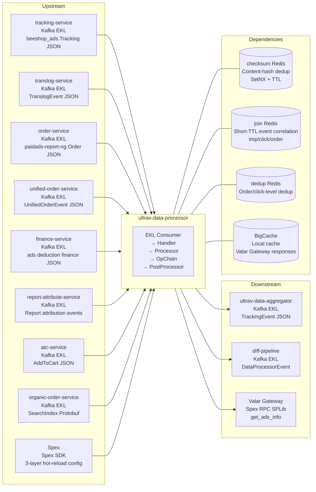

<!-- ads-workspace-gdoc-sync: gdoc_id=1pFRuSzmdB9Z8lh9sqmbtPH_kYRG6mCF55RgjwaqikKQ gdoc_url=https://docs.google.com/document/d/1pFRuSzmdB9Z8lh9sqmbtPH_kYRG6mCF55RgjwaqikKQ/edit -->

# UltraV Data Processor

[中文](README.md) | English

Repository: https://git.garena.com/shopee/deep/paidads-bidding/ultrav-data-processor

---

## Table of Contents

1. [Introduction](#introduction)
2. [Features](#features)
3. [Architecture](#architecture)
   - [System Context](#system-context)
   - [Service Topology](#service-topology)
   - [Data Flow](#data-flow)
4. [Directory Structure](#directory-structure)
5. [Deployment Modes](#deployment-modes)
   - [Product Ads Standalone](#product-ads-standalone)
   - [Content Ads Merged Deployment](#content-ads-merged-deployment)
6. [Core Pipeline](#core-pipeline)
   - [Kafka Consumption and Event Parsing](#kafka-consumption-and-event-parsing)
   - [Event Deduplication](#event-deduplication)
   - [Operator Chain Processing](#operator-chain-processing)
   - [Post Processors](#post-processors)
   - [Kafka Output](#kafka-output)
7. [Configuration](#configuration)
   - [Static Config (Spex config)](#static-config-spex-config)
   - [Dynamic Config (Spex dynamic)](#dynamic-config-spex-dynamic)
   - [Operator Chain Config (Spex op\_chain\_config)](#operator-chain-config-spex-op_chain_config)
8. [Development Guidelines](#development-guidelines)
   - [Code Style](#code-style)
   - [How to Add a New Operator](#how-to-add-a-new-operator)
   - [How to Add a New Processor](#how-to-add-a-new-processor)
   - [How to Add a New Special Setter](#how-to-add-a-new-special-setter)
   - [Project Structure](#project-structure)
   - [Naming Conventions](#naming-conventions)
   - [Error Handling](#error-handling)
   - [Unit Testing Standards](#unit-testing-standards)
   - [Code Review & Git Workflow](#code-review--git-workflow)
9. [Deployment](#deployment)
   - [Build for Production](#build-for-production)
   - [Release Process](#release-process)
10. [Monitoring](#monitoring)
11. [Business Terminology Glossary](#business-terminology-glossary)
12. [Additional Resources](#additional-resources)
13. [Frequently Asked Questions](#frequently-asked-questions)

---

## Introduction

`ultrav-data-processor` is a near-real-time ETL data processing service within the Paid Ads bidding system, sitting between raw event ingestion and downstream aggregation (ultrav-data-aggregator). It is the first segment of the UltraV bidding feedback loop: it consumes raw ad events from multiple upstream Kafka sources (impressions, clicks, deductions, orders, add-to-cart, etc.), normalizes them through filtering, field enrichment, and an operator chain, produces standardized TrackingEvent JSON, and writes it to downstream Kafka topics. The downstream ultrav-data-aggregator then aggregates these events into Redis time-window metrics, which ultimately drive UltraV Core's bidding coefficient adjustments.

The service currently exposes two independent processes:

- `server/product_ads/main.go`: Product Ads standalone process, Spex service name `adsbidding.ultravdataprocessor`
- `server/content_ads/content_ads_main.go`: Content Ads merged process (shop / live / brand_max / video combined into one process), Spex service name `contentads.ultravdataprocessor`

Both modes share the same processing framework (handler, operator, special_setter, checksum) but differ in input topics, output producers, dynamic config, and Operator Chain configuration.

---

## Features

- **Multi-source Kafka consumption**: Supports 9 input event types — tracking (`beeshop_ads.Tracking` JSON), traffic (unified tracking new format), translog (TranslogEvent JSON), order (paidads-report-ng Order JSON), unified_order (UnifiedOrderEvent), finance (ads deduction finance), attribute (report attribution), atc (AddToCart, Product Ads only), organic_order (SearchIndex Protobuf, Product Ads only)
- **Configurable Operator Chain**: Hot-reloaded via Spex `op_chain_config`, supports multi-level orchestration with phase / condition / op_list / sub_op_chain / layer — processing logic can be updated without service restart; new operators include `ValidTranslogOcpm` (OCPM translog gate) and `ShouldSendTopicGate` (topic-type gate as an op_chain operator)
- **Content-hash event deduplication (checksum)**: Content hash + Redis SetNX + configurable TTL to prevent duplicate consumption (default TTL: 1 hour)
- **Product Ads post-processing**: Join Redis event correlation (impression ↔ click ↔ order), Dedup Redis order-level deduplication, Valar Gateway Spex RPC (`paidads.valar.gateway.get_ads_info`) for `global_cat_ids` enrichment with BigCache local cache to reduce RPC calls
- **TopicTypeOld / TopicTypeNew dual-write control**: Blue-green switching via dynamic config `enable_write_old_topic` / `enable_write_new_topic` and `unified_output_switch_timestamp`
- **Diff pipeline output**: Optional `diff_data_kafka_producer` to emit DataProcessorEvent for comparison
- **Prometheus metrics exposure**: namespace=`paidads`, subsystem=`ultrav_data_processor`, with event counts, latency, error counts, and metrics values
- **HTTP diagnostic endpoints**: `/metrics`, `/ping`, `/debug/pprof/*`, `/log/{level}` (runtime log level switching)

---

## Architecture

### System Context

`ultrav-data-processor` occupies the middle layer in the ads bidding data collection pipeline:

```
Multiple upstream Kafka events
  → ultrav-data-processor (ETL / normalization)
  → Downstream Kafka topics
  → ultrav-data-aggregator (metric aggregation into Redis)
  → UltraV Core (bidding coefficient adjustment)
  → Online Bidding (real-time auction)
```

### Service Topology



**Topology Table**

| Category | Name | Protocol | Description |
|----------|------|----------|-------------|
| Upstream | tracking-service | Kafka (EKL) | `beeshop_ads.Tracking` JSON (impressions, clicks, etc.) |
| Upstream | translog-service | Kafka (EKL) | TranslogEvent JSON, billing deduction events |
| Upstream | order-service | Kafka (EKL) | paidads-report-ng Order JSON, order attribution |
| Upstream | unified-order-service | Kafka (EKL) | UnifiedOrderEvent JSON, OCPM / no-click order |
| Upstream | finance-service | Kafka (EKL) | ads deduction finance JSON, financial-reconciliation stream |
| Upstream | report-attribute-service | Kafka (EKL) | Report attribution events for dimension enrichment |
| Upstream | atc-service | Kafka (EKL) | AddToCart events (Product Ads only) |
| Upstream | organic-order-service | Kafka (EKL) | SearchIndex Protobuf, organic orders (Product Ads only) |
| Upstream | Spex | Spex SDK | Provides config / dynamic / op_chain_config with hot reload |
| Downstream | ultrav-data-aggregator | Kafka (EKL) | Consumes TrackingEvent JSON, aggregates into Redis |
| Downstream | diff-pipeline | Kafka (EKL) | Optional DataProcessorEvent diff comparison downstream |
| Downstream | Valar Gateway (`paidads.valar.gateway`) | Spex RPC (SPLib) | `get_ads_info` command to fetch `global_cat_ids` |
| Dependency | checksum Redis | Redis (SetNX+TTL) | Content-hash deduplication, default TTL 1h |
| Dependency | join Redis | Redis | Short-TTL cache for impression/click/order event correlation (Product Ads) |
| Dependency | dedup Redis | Redis | Order/click-level deduplication markers |
| Dependency | BigCache | Local in-memory cache | Caches Valar Gateway ads info responses, LifeWindow 24h, HardMax 128MB |

#### Middleware Instance Details

The repository uses two Spex entrypoints: `server/product_ads/main.go` initializes `adsbidding.ultravdataprocessor`, while `server/content_ads/content_ads_main.go` initializes `contentads.ultravdataprocessor`. The content binary reads a single `[sp]contentads / ultravdataprocessor` namespace and separates shop / live / brand_max / video traffic by config fields. It does not read per-vertical namespaces such as `adsbidding.shopadsultravdataprocessor`.

| Type | Direction | Concrete Instance | Purpose | Evidence |
|---|---|---|---|---|
| Kafka | Consume | Product config key `config.tracking_kafka` in `[sp]adsbidding / ultravdataprocessor`; brokers `kafka.ks_adsTracking_live.ap-sg-1-general-b.live.mq.shopee.io:9092`, `kafka.ks_ads_live.ap-sg-1-general-a.live.mq.shopee.io:9092`, `kafka.kafka_aqb6pqgg_live.na-us-2-general-a.live.mq.shopee.io:9092`, `kafka.kafka_us_ar_acl_live.live.mq.shopee.io:9093`; topics `shopee_ads_sg/vn/tw/th/ph/my/id_live`, `shopee_ads_br_live`, `shopee_ads_mx_live`, `shopee_ads_ar_live`; groups `hyperx`, `paidads-hyperx-664cba`, `mp_search_recommendation_ads-paidads-hyperx-a22d29`, `mp_search_recommendation_ads-paidads-ultrav-data-processor-33acc5` | Product Ads tracking input | `server/product_ads/main.go`, `config/processor.go` |
| Kafka | Consume | Product config also reads `traffic_kafka` topic `shopee_ads_traffic-ph-live`; `translog_kafka` topics `paidads_translog_event_sg/th/vn/tw/ph/my/id_live`, `paidads_translog_event_br_live`, `paidads_translog_event_mx_live`, `paidads_translog_event-ar-live`; `order_kafka` topics `shopee_ads_order_live`, `shopee_ads_order_br_live`, `shopee_ads_order-mx-live`, `shopee_ads_order-ar-live`; `unified_order_kafka` topics `shopee-ads-data-unified-order-*-live`; `finance_kafka` topic `shopee-ads-finance-ph-live`; `attribute_kafka` topic `shopee-ads-attribution-ph-live`; `atc_kafka` topics `shopee_ads_atc_*_live`; `organic_order_kafka` topics `shopee_order_gds_live`, `shopee_order_gds_br_live`, `shopee_order_gds-mx-live`, `shopee-order-gds-ar-live` | Product Ads billing, order, attribution, ATC, and organic-order inputs | `handler/`, `processor/`, `config/processor.go` |
| Kafka | Produce | Product config key `config.kafka_producer`; brokers `di-kafka-stt01-bg1-bootstrap01/02/03-stt-sg.data-infra.shopee.io:9093`, `di-kafka-da01-bg1-bootstrap01/02/03-dallas-us.data-infra.shopee.io:9093`; topics `bidding_tracking_event_id/ph/vn/th/my/tw/sg`, `mkplpaidads_discovery_ads.hyperx_tracking_event_us`; group `ultrav_data_processor` where configured | Product Ads `TrackingEvent` output to `ultrav-data-aggregator` | `pkg/producer`, `config/processor.go` |
| Kafka | Consume | Content config key `config.tracking_kafka` in `[sp]contentads / ultravdataprocessor`; brokers `kafka.ks_adsTracking_live.ap-sg-1-general-b.live.mq.shopee.io:9092`, `kafka.ks_ads_live-01.ap-sg-1-general-a.live.mq.shopee.io:9092`, `kafka.kafka_aqb6pqgg_live.na-us-2-general-a.live.mq.shopee.io:9092`; topics `shopee_ads_sg/vn/tw/th/ph/my/id_live`, `shopee_ads_br_live`; groups `mp_search_recommendation_ads-paidads-content-ads-ultrav-data-processor-*` | Content Ads shop tracking input | `server/content_ads/content_ads_main.go`, `config/processor.go` |
| Kafka | Consume | Content config also reads `live_ads_tracking_kafka` topics `shopee_ads_livestream_ads_id/vn/my/ph/th/sg/tw_live`, `shopee_ads_livestream_ads_br_live`; `brand_max_tracking_kafka` topics `shopee_ads_display_ads`, `shopee_ads_display_ads_br`; `translog_kafka` topics `paidads_translog_event_sg/th/vn/tw/ph/my/id_live`, `paidads_translog_event_br_live`; `order_kafka` topics `shopee_ads_order_live`, `shopee_ads_order_br_live` | Content Ads live, brand-max, translog, and order inputs | `processor/`, `operator/`, `config/processor.go` |
| Kafka | Produce | Content config keys `shop_kafka_producer`, `live_kafka_producer`, `brand_max_kafka_producer`, `video_kafka_producer`, `diff_data_kafka_producer`; brokers `kafka.ks_adstracking_live.ap-sg-1-general-b.live.mq.shopee.io:9092`, `kafka.kafka_latam_fe_us.na-us-2-general-a.live.mq.shopee.io:9092`, `kafka.ks_commmonlog_live.ap-sg-1-general-a.live.mq.shopee.io:9092`, `kafka.ks_br_market_live.ap-sg-1-general-c.live.mq.shopee.io:9092`, `kafka.ks_paidads_live.ap-sg-1-general-a.live.mq.shopee.io:9092`; topics `shop-ads-data-event-global-live`, `shop-ads-data-event-br-live`, `live-ads-data-event-global-live`, `live-ads-data-event-br-live`, `brand-max-bidding-event-global-live`, `brand-max-bidding-event-br-live`, `adsbidding_videoads_ultrav_data_processor-global-live`, `adsbidding_videoads_ultrav_data_processor-br-live`, `paidads-bidding-data-processor-output-global-live` | Content Ads per-vertical `TrackingEvent` output and diff output | `operator/`, `pkg/producer`, `config/processor.go` |
| Redis | ReadWrite | Product `config.checksum_redis`: `03tcn.elasticredis.cloud.shopee.io:10421`, `ka0oo.elasticredis.cloud.shopee.io:10829`; Content `config.checksum_redis`: `soefe.elasticredis.cloud.shopee.io:11828`, `0083dcfb33f6dedd.elasticredis.cloud.shopee.io:11828`; liveish rule also uses `gkil5.elasticredis.cloud.shopee.io:10243` | Duplicate event suppression with `SetNX + TTL` | `pkg/checksum`, `config/processor.go` |
| Redis | ReadWrite | Product `config_redis`: `0083dcfb33f6dedd.elasticredis.cloud.shopee.io:11828`; join/dedup Redis are configured in Product Ads config structs, but concrete live domains were not found in the scanned `config` item | Group-key config lookup, event correlation, and deduplication | `pkg/post_processor`, `config/processor.go` |
| Config Center | Read | Product `[sp]adsbidding / ultravdataprocessor` item `config`; Content `[sp]contentads / ultravdataprocessor` item `config`; additional code paths read items `dynamic` and `op_chain_config` using app key `ultrav_data_processor` | Runtime Kafka, Redis, operator-chain, and dynamic toggles | `config/processor.go`, `config/dynamic/dynamic.go`, `config/op_config/config.go` |
| DB/FSE/Vespa/S3/ClickHouse | None detected | This repository does not directly read/write DB, FSE, Vespa, S3, or ClickHouse in the scanned code | Storage access is Redis/Kafka/Config Center/Spex RPC only | source scan |

### Data Flow

```
Kafka Input (EKL Consumer)
  └─ Handler.Transform()        # Byte stream → typed event object (JSON/Proto unmarshal)
  └─ Handler.Process()          # Business logic entry point
      └─ Checksum dedup         # Content hash + Redis SetNX; discard duplicate events
      └─ OpContext init          # InitCtxData(MaxLayer): allocate layered data structure
      └─ Operator Chain exec     # Execute phases in order; each phase runs op_list operators
          ├─ condition check
          ├─ operator execution  (ExtractFields / IsValid / Loop / Convert / SumGen ...)
          ├─ sub_op_chain nest   # Sub-chain for loop-type operators
          └─ layer data passing  # Operators share intermediate results via OpContext layered data
      └─ Post Processor         # Product Ads: Join Redis + Dedup Redis + Valar GW
                                # Content Ads: no-op (output done by post_processor ops in op_chain)
  └─ Kafka Producer write       # TrackingEvent JSON → downstream Kafka topic
```

9 input event types map to 9 Processor implementations:

| Processor | Input Kafka | Event Type |
|-----------|------------|-----------|
| `tracking_processor` | `tracking_kafka` | `beeshop_ads.Tracking` JSON (TopicTypeOld) |
| `traffic_processor` | `traffic_kafka` | `beeshop_ads.Tracking` JSON (TopicTypeNew) |
| `translog_processor` | `translog_kafka` | TranslogEvent JSON (CPC/CPM deductions) |
| `order_processor` | `order_kafka` | paidads-report-ng Order JSON |
| `unified_order_processor` | `unified_order_kafka` | UnifiedOrderEvent JSON |
| `finance_processor` (AdsDeductionFinance) | `finance_kafka` | Finance deduction JSON |
| `attribute_processor` (ReportAttribute) | `attribute_kafka` | Report attribution events |
| `atc_processor` | `atc_kafka` | AddToCart JSON (Product Ads) |
| `organic_order_processor` | `organic_order_kafka` | SearchIndex Protobuf (Product Ads) |

---

## Directory Structure

```
ultrav-data-processor/
├── server/
│   ├── product_ads/main.go            # Product Ads entry (Spex: adsbidding.ultravdataprocessor)
│   ├── content_ads/content_ads_main.go # Content Ads entry (Spex: contentads.ultravdataprocessor)
│   └── util.go                        # InitOpList(): register all Operator instances
├── config/
│   ├── processor.go                   # DataProcessorConfigType: main config (Kafka/Redis/Filter/AdsInfoGateway)
│   ├── dynamic/dynamic.go             # DynamicConfigType: dynamic switches, Spex key=dynamic
│   └── op_config/config.go            # OpChainConfigType: operator chain config, Spex key=op_chain_config
├── pkg/
│   ├── handler/                       # Kafka consumer wrapper (single / country-split consumers)
│   ├── service/
│   │   ├── processor/                 # Event Processor implementations
│   │   │   ├── tracking_processor/    # Tracking / Traffic processors
│   │   │   ├── translog_processor/    # Translog / Finance processors
│   │   │   ├── order_processor/       # Order / Attribute processors
│   │   │   ├── unified_order_processor/
│   │   │   ├── atc_processor/
│   │   │   ├── organic_order_processor/
│   │   │   ├── monitor.go             # Prometheus event_count / event_count_by_bucket / no_cat_count
│   │   │   ├── interface.go           # Processor interface (Transform + Process)
│   │   │   └── util.go                # TopicTypeOld/New, InitCtxData, group key helpers
│   │   ├── operator/                  # All Operator implementations (tracking/translog/order/common/post_processor)
│   │   └── post_processor/            # Product Ads / Content Ads PostProcessor implementations
│   ├── data/
│   │   ├── ads_info_gateway/          # Valar Gateway Spex RPC client + BigCache
│   │   ├── checksum/                  # Content-hash dedup Redis client
│   │   ├── dedup_redis/               # Order/click dedup Redis client
│   │   ├── join_redis/                # Event correlation Redis client
│   │   └── kafka/                     # Kafka EventProducer wrapper
│   ├── special_setters/               # SpecialSetter registry (field_setters / group_key_setters)
│   ├── http_handler/                  # HTTP route registration (/metrics, /ping, /debug/pprof/*, /log/{level})
│   └── util/                          # exporter.go (Prometheus), logger, const, diff, getter/setter helpers
├── types/                             # Custom error types and setter input helpers (OpContext moved to paidads-bidding/common)
├── mock_data/                         # Local debug op_chain_config JSON samples
│   ├── op_chain_config.json           # Product Ads sample
│   ├── content_op_chain_config.json   # Content Ads sample
│   └── op_chain_config_translog.json
├── tool/                              # Helper tools (mock_kafka_input, mock_redis_config)
├── tools/                             # opchain-viewer and other dev tools
├── docs/                              # Developer docs (OpContext refactor guide, field dataflow SOP)
├── go.mod
└── Makefile
```

---

## Deployment Modes

### Product Ads Standalone

| Item | Value |
|------|-------|
| Entry point | `server/product_ads/main.go` |
| Spex service name | `adsbidding.ultravdataprocessor` |
| Environment vars | `PROJECT_NAME=adsbidding`, `MODULE_NAME=ultravdataprocessor` |
| Kafka consumers | tracking / traffic / translog / order / atc / organic_order / unified_order / attribute (optional) / finance (optional) |
| Kafka producer | Single `kafka_producer` (Product Ads TrackingEvent topic) |
| Unique capabilities | Join Redis event correlation, Dedup Redis, Valar Gateway ads info enrichment (global_cat_ids) |

Local startup:

```bash
go run ./server/product_ads
```

### Content Ads Merged Deployment

| Item | Value |
|------|-------|
| Entry point | `server/content_ads/content_ads_main.go` |
| Spex service name | `contentads.ultravdataprocessor` |
| Environment vars | `PROJECT_NAME=contentads`, `MODULE_NAME=ultravdataprocessor` |
| Kafka consumers | tracking / live_ads_tracking (optional) / translog / order |
| Kafka producers | shop_kafka_producer / live_kafka_producer / brand_max_kafka_producer / video_kafka_producer / diff_data_kafka_producer (optional) |
| Unique capabilities | Multi-producer merged deployment; shop/live/brand_max/video handled in a single process; Content Ads PostProcessor is no-op |

Local startup:

```bash
go run ./server/content_ads
```

**Deployment Comparison**

| Dimension | Product Ads | Content Ads |
|-----------|-------------|-------------|
| Entry point | `server/product_ads/main.go` | `server/content_ads/content_ads_main.go` |
| Spex service name | `adsbidding.ultravdataprocessor` | `contentads.ultravdataprocessor` |
| Kafka producer count | 1 (single `kafka_producer`) | 4 (shop / live / brand_max / video) |
| Main input sources | 9 types (including atc / organic_order / unified_order) | 3–4 types (tracking / translog / order, optional live_ads_tracking) |
| PostProcessor | Active (join Redis / dedup / ads info enrichment) | No-op (output done by post_processor operators in op_chain) |
| Valar Gateway dependency | Yes | No |

> **Note**: The Makefile retains `shop-svc`, `live-svc`, `video-svc`, and `brandmax-svc` targets for historical compatibility, but their corresponding `server/shop_ads`, `server/live_ads`, `server/video_ads`, and `server/brand_max` directories no longer exist in the repository. Use `content-svc` (`server/content_ads`) instead.

---

## Core Pipeline

### Kafka Consumption and Event Parsing

Each event processor implements the `processor.Processor` interface:

```go
type Processor interface {
    Transform(ctx context.Context, msg *ekl.Message) (interface{}, error)
    Process(ctx context.Context, msg *ekl.Message) error
}
```

- **Transform**: Deserializes an EKL Message byte stream into a typed event object (JSON Unmarshal or Proto Unmarshal)
- **Process**: Executes business logic including filtering, deduplication, operator chain execution, and post-processing output

The Handler supports two consumer modes:
- **Single consumer**: `KafkaConfig.Brokers + Topics + GroupId` (no `CountryKafkaConfigs`)
- **Country-split consumers**: `KafkaConfig.CountryKafkaConfigs`, with separate broker/topic/group per country

### Event Deduplication

Idempotency is guaranteed via content-hash deduplication:

```
Event fields → xxhash64 → Redis key: sum_dp_{country}_{eventType}:{hash}_v0
→ SetNX(key, "", TTL) → If already exists, discard the event
```

- `Exists()`: Used for TopicTypeOld stream (key suffix `_v0`), default TTL 1 hour
- `ExistsV2()`: Used for TopicTypeNew stream (key suffix `_v3`)
- `IsNewOrder()`: Per-order new-order check (key: `no:{country}_{orderId}_{itemId}`, TTL 7 days)

The checksum Redis is the instance configured under `config.checksum_redis`, which is also reused for the dedup Redis (initialized via `dedup_redis.New(cfg.CheckSum.Redis)`).

### Operator Chain Processing

The Operator Chain is the service's core abstraction. Each ProcessorV2 (TrackingProcessorV2 / TranslogProcessorV2 / OrderProcessorV2 / UnifiedOrderProcessorV2) contains:

```
ProcessorV2 {
  Kafka       string             // Corresponding input kafka config key
  MaxLayer    int                // Number of layers in OpContext layered data
  OpChain     []OperationByPhase // Executed in phase order
  InitOpInput []string           // Initial operator input field list
}

OperationByPhase {
  Phase     string        // Phase name
  Condition string        // Execution condition (empty = unconditional)
  OpList    []OperationV2 // Operators to execute in this phase
}

OperationV2 {
  OpName     string             // Operator name (registered in server/util.go)
  OpType     string             // Operator type
  OpConfig   OpConfig           // Operator configuration
  SubOpChain []OperationByPhase // Sub-chain for loop-type operators
  Layer      int                // Target layer index
}
```

`OpContext` core structure:
- `Data []map[string]interface{}`: Initialized by `InitCtxData(MaxLayer)`, indexed by layer; operators pass intermediate results across layers
- `DependencyData`: Dependency fields for the current operator
- `SetterInput`: Input data for Special Setters

Operator registration entry: `server/util.go`, `InitOpList()` registers all operator instances:

- **Tracking operators**: ConvertEntranceLiveTracking, ExtractFieldsTracking, ExtractFieldsTrackingItem, ExtractFieldsTrackingLivestream, ExtractFieldsTrackingShop, ExtractFieldsTrackingVideo, GetTrackingPlacement, IsValidTraffic, IsValidTrafficItemProduct, IsValidTracking, IsValidTrackingItem* (Product/Shop/Live/LiveAntou/BrandMax/Video), LoopTrackingItem* (Product/Shop/Live/Video), SwitchOpTracking
- **Translog operators**: ExtractFieldsTranslog, ExtractFieldsTranslogEvent, IsValidTranslog, IsValidTranslogItem* (Product/Live/LiveAntou/Video), ConvertEventDetails, ConvertProductDeductionInfo, ConvertMapCostDetails, ExtractFields* (CostDetail/EventDetail/Finance/FinanceCostDetail/ProductDeductionInfo), GetCostDetail, GetFirstFinanceCostDetail, IsValidFinance, IsValidFinanceItemProduct, LoopFinanceCostDetails, LoopTranslogEventDetails, SwitchDeductionType, SwitchOpTranslog, **ValidTranslogOcpm** (filters translog events where `is_ocpm` is false)
- **Order operators**: ExtractFieldsOrder, ExtractFieldsOrderClick, ExtractFieldsOrderItem, ExtractFieldsOrderAdsInfo, ExtractFieldsOrderImp, IsValidOrder, IsValidOrderLive, IsValidOrderLiveAntou, IsValidOrderProductClick, IsValidOrderProductNoClick, IsValidOrderProductImp, SwitchOpOrder
- **Report attribute operators**: ExtractFieldsReportAttribute, ExtractFieldsReportAttributeAttributeInfo, ExtractFieldsReportAttributeOrderOriginal, FillReportAttributeClickItemIDFallback, IsValidReportAttribute, IsValidReportAttributeProduct* (Atc/Click/Imp/NoClick), SwitchOpReportAttribute
- **Unified order operators**: IsValidUnifiedOrder, ExtractFieldsUnifiedOrder
- **Common operators**: ConvertAdsData (and variants: Live/Video/Shop/ShopWithFallback/ShopWithoutFallback/BrandMax/WithoutFallback), ConvertBidRerankTrace, ConvertDeductionInfo, ConvertExtInfo, ConvertTrackingEventToList, ConvertVideoAdsData, ExtractFieldsAdsData, ExtractFieldsBidRerankTrace, ExtractFieldsDeductionInfo, ExtractFieldsExtInfo, GetEntranceByPlacement, GetEntranceFromAlgoJsonData, RegroupPlacementLive, SetTrackingEventItemFields, SetTrackingEventsCommonFields, **ShouldSendTopicGate** (op_chain gate that applies topic-type filtering using dynamic config), SumCheck, WriteFieldAToFieldB
- **Post-processor operators**: DiffPostProcessor, ShopPostProcessor, LivePostProcessor, BrandMaxPostProcessor, VideoPostProcessor, ProductPostProcessor, ProductPostProcessorForDiff, ContentPostProcessorForDiff

**Key OpConfig fields**:

| Field | Description |
|-------|-------------|
| `dependency` | List of input fields the operator depends on |
| `output` | List of output fields the operator writes |
| `special_config` | Operator-private config typed as `any`; each operator defines its own struct and asserts it inside the operator |
| `set_fields` | Legacy field definition kept temporarily; the new path does not auto-read it. Target shape: `special_config.set_fields` |
| `set_group_keys` | Legacy field definition kept temporarily; the new path does not auto-read it. Target shape: `special_config.set_group_keys` |
| `set_fields_special` | Legacy field definition kept temporarily; the new path does not auto-read it. Target shape: `special_config.set_fields_special` |
| `set_group_keys_special` | Legacy field definition kept temporarily; the new path does not auto-read it. Target shape: `special_config.set_group_keys_special` |
| `loop_field` | Field to iterate over for loop-type operators |
| `sub_op_input` | Initial input fields for the sub-op chain |
| `cp_to_next_layer` | Fields to copy to the next layer |

### Post Processors

**Product Ads PostProcessor** (`post_processor.NewProductAdsPostProcessor`):
1. **Join Redis**: Correlates impression / click / order events by caching click info in join_redis (keyed by country + ads_id + item_id), enabling order events to look up click timestamps
2. **Dedup Redis**: Order/click-level deduplication to prevent double-counting the same orderId+itemId
3. **Valar Gateway ads info enrichment**: Queries `global_cat_ids` via `paidads.valar.gateway.get_ads_info` (Spex RPC); results are cached locally with BigCache (24h LifeWindow, 128MB HardMax) to reduce RPC QPS

**Content Ads PostProcessor** (`post_processor.NewContentAdsPostProcessor`):
- Holds four Kafka Producers (shop / live / brand_max / video)
- Is itself a no-op: event routing and output are entirely handled by `ShopPostProcessor`, `LivePostProcessor`, and other post_processor operators within the op_chain

### Kafka Output

- Product Ads: All output goes through a single `kafka_producer` as TrackingEvent JSON
- Content Ads: Output is routed by ad type via `shop_kafka_producer`, `live_kafka_producer`, `brand_max_kafka_producer`, and `video_kafka_producer`
- Optional `diff_data_kafka_producer`: Emits DataProcessorEvent for old/new format comparison

TopicTypeOld / TopicTypeNew dual-write logic is controlled by `ShouldSendTopic(topicType, currentTimestamp, switchTimestamp)`, combined with dynamic config `enable_write_old_topic`, `enable_write_new_topic`, and `unified_output_switch_timestamp` for zero-downtime switching.

---

## Configuration

The service initializes three layers of Spex configuration at startup, all supporting hot updates (no restart required).

### Static Config (Spex config)

**Spex key**: `config` (loaded per service name: `adsbidding.ultravdataprocessor` or `contentads.ultravdataprocessor`)

**Config struct**: `DataProcessorConfigType` (`config/processor.go`)

| Category | Field | Description |
|----------|-------|-------------|
| General | `log_level` | Log level (debug/info/warn/error/fatal) |
| General | `graceful_period` | Graceful shutdown wait time (Go duration string, default 30s) |
| General | `encoder_secret` | DeductionInfo decoding secret for TrackingItem |
| General | `countries` | Allowlist of countries to process |
| Input Kafka | `tracking_kafka` | Tracking event consumer config |
| Input Kafka | `live_ads_tracking_kafka` | Live ads tracking (Content Ads, optional) |
| Input Kafka | `translog_kafka` | Translog event consumer config |
| Input Kafka | `order_kafka` | Order event consumer config |
| Input Kafka | `atc_kafka` | ATC event consumer config (Product Ads) |
| Input Kafka | `organic_order_kafka` | Organic order event consumer config (Product Ads) |
| Input Kafka | `unified_order_kafka` | Unified order event consumer config (Product Ads) |
| Input Kafka (unified) | `traffic_kafka` | Tracking new-format consumer config |
| Input Kafka (unified) | `finance_kafka` | Finance deduction consumer config (optional) |
| Input Kafka (unified) | `attribute_kafka` | Report attribution consumer config (optional) |
| Output Kafka | `kafka_producer` | Product Ads TrackingEvent output |
| Output Kafka | `shop_kafka_producer` | Content Ads Shop output |
| Output Kafka | `live_kafka_producer` | Content Ads Live output |
| Output Kafka | `brand_max_kafka_producer` | Content Ads BrandMax output |
| Output Kafka | `video_kafka_producer` | Content Ads Video output |
| Output Kafka | `diff_data_kafka_producer` | Diff comparison output (optional) |
| Dedup | `checksum_redis` | Checksum + dedup Redis config, includes `ttl` (default 1h) |
| Filters | `product_ads_filter` | Product Ads business filter (placements / impression_placements / entrances) |
| Filters | `shop_ads_filter` | Shop Ads business filter |
| Filters | `brand_max_filter` | BrandMax business filter |
| Filters | `live_ads_filter` | Live Ads business filter |
| Filters | `video_ads_filter` | Video Ads business filter |
| Filters | `ads_tracking_filter` | Tracking processor filter (country/operation/placement dimensions) |
| Filters | `order_log_filter` | Order processor filter |
| Filters | `trans_log_filter` | Translog processor filter |
| External deps | `ads_info_gateway` | Valar Gateway timeout config (`timeout`, default 100ms) |

`KafkaConfig` supports both single-consumer mode (`brokers + topics + group_id`) and country-split mode (`country_kafka_configs` list).

### Dynamic Config (Spex dynamic)

**Spex key**: `dynamic` (function `dynamic.SetDynamicConfig()`, Spex service name `ultrav_data_processor`)

**Config struct**: `DynamicConfigType` (`config/dynamic/dynamic.go`)

| Field | Type | Default | Description |
|-------|------|---------|-------------|
| `enable_order_dedup` | bool | false | Enable order-level deduplication |
| `no_click_order_ads_enabled` | bool | false | Enable no-click order processing |
| `no_click_order_ads_sample_rate` | float64 | 0 | Sampling rate for no-click order debug logs |
| `ocpm_order_ads_enabled` | bool | false | Enable OCPM order processing |
| `ocpm_order_ads_sample_rate` | float64 | 0 | Sampling rate for OCPM order debug logs |
| `event_process_lag_threshold` | int | 60000 | Event processing lag alert threshold (ms) |
| `event_process_lag_shop_whitelist_by_country` | map[string][]int64 | — | Lag whitelist shop IDs by country |
| `event_lag_log_sample_rate` | float64 | — | Lag log sampling rate |
| `live_ads_default_value` | struct | — | Live Ads default pCTR entrances and target ROI |
| `video_ads_default_value` | struct | — | Video Ads default pCTR entrances and target ROI |
| `target_roi_discount_ratio_map` | map[int32]map[string]float64 | — | Target ROI discount ratio (pricing_type → country → ratio) |
| `default_target_roi_country_value` | float64 | — | Default target ROI country-level value |
| `unified_output_switch_timestamp` | int64 | — | Timestamp for TopicTypeOld → TopicTypeNew switch |
| `enable_write_old_topic` | bool | true | Whether to write to the old topic |
| `enable_write_new_topic` | bool | false | Whether to write to the new topic |

### Operator Chain Config (Spex op\_chain\_config)

**Spex key**: `op_chain_config` (function `op_config.SetOpChainConfig()`)

**Config struct**: `OpChainConfigType` (`config/op_config/config.go`)

`special_config` is pre-parsed by each operator's `ParseSpecialConfig` during initial `op_chain_config` load and hot updates, then written back into the config object. At runtime, the operator client calls `Process` with the parsed struct.

```
OpChainConfigType {
  TrackingProcessorV2        ProcessorV2        // Operator chain for tracking events
  TrafficProcessorV2         ProcessorV2        // Operator chain for traffic (new-format) events
  TranslogProcessorV2        ProcessorV2        // Operator chain for translog events
  FinanceProcessorV2         ProcessorV2        // Operator chain for finance deduction events
  OrderProcessorV2           ProcessorV2        // Operator chain for order events
  ReportAttributeProcessorV2 ProcessorV2        // Operator chain for report_attribute events
  UnifiedOrderProcessorV2    ProcessorV2        // Operator chain for unified_order events
  MonitorSampleRate          map[string]float64 // Per-event-type monitoring sample rate
}
```

Local sample configs:
- `mock_data/op_chain_config.json`: Product Ads sample
- `mock_data/content_op_chain_config.json`: Content Ads sample
- `mock_data/op_chain_config_translog.json`: Translog sample

---

## Development Guidelines

### Code Style

- Follow official Go conventions; format code with `go fmt ./...` (the `fmt` Makefile target)
- Run static analysis with `go vet ./...` (the `ci-vet` target fails if vet produces any diff)
- Linting rules are defined in `.golangci.yml`
- Requires Go ≥ 1.23 (version check in Makefile; `go 1.24.5` declared in `go.mod`)

### How to Add a New Operator

1. Create a new file in the appropriate sub-package under `pkg/service/operator/` (tracking / translog / order / common), implementing the `operator.Operator` interface (`Name() string` + `ParseSpecialConfig(specialConfig any) (any, error)` + `Process(opCtx, opConfig)`)
2. Register the new operator instance with `operator.Ops.RegisterAll(...)` in `InitOpList()` in `server/util.go`
3. Reference the operator by its `op_name` in the corresponding ProcessorV2's `op_chain` within the Spex `op_chain_config`

### How to Add a New Processor

1. Create a new package under `pkg/service/processor/`, implementing `processor.Processor` (`Transform` + `Process`)
2. In the relevant entry (`server/product_ads/main.go` or `server/content_ads/content_ads_main.go`):
   - Instantiate the Processor
   - Create a Handler via `handler.NewEventHandler(kafkaConfig, processor)`
   - Launch `handler.Start()` as a goroutine in `main()`
   - Call `handler.Stop()` in `stopGracefully()`
3. Add the corresponding `KafkaConfig` field to `DataProcessorConfigType` in `config/processor.go`

### How to Add a New Special Setter

Special Setters allow custom logic functions to be referenced in `op_chain_config` via `special_config.set_fields_special` or `special_config.set_group_keys_special`.

1. Create a new file in `pkg/special_setters/field_setters/` or `pkg/special_setters/group_key_setters/`, implementing the `SpecialSetter` interface (`Name() string` + `Process(opCtx, trackingEvent, name, layer) bool`)
2. Append the new Setter instance to `SpecialSetterList` in `pkg/special_setters/special_setters.go` (the `init()` function auto-registers it into `SpecialSetters.Map`)
3. Reference it in `op_chain_config` via the `func` field name under `special_config.set_fields_special` or `special_config.set_group_keys_special`

Current field setters include: BroadPcrProduct, CalBidDeductionPrice, CampaignCoef, ClickShop, ConvertInt64CatIds, ConvertOrderIdToList, DeductionClick, DeductionImp (and BrandMax/Video variants), DedupPlanBucketList, DedupTrafficBucketList, DeduplicatedClick, Impression (and Shop/BrandMax variants), ItemPriceWithFallback, LiveView, NoClickOrder, NumOrderedWithFallback, **OcpmOrder** (sets `trackingEvent.OcpmOrder = true`), Order, AddToCart, PctrByEntrance, PgmvWithFallback (and ClickOrder/OcpmOrder variants), RawClick (and Shop/Video variants), SumGen* (Order/OrderX/TrackingEvent/TrackingEventX/TrackingLive/TrackingVideo/TrackingProduct/TrackingShop/TranslogD/TranslogShop/TranslogX/ReportAttribute/TrackingBrandMax/UnifiedOrder), TargetCirFallback (Live/Video), TargetCirShop, UnifiedOrderTrafficBucketList, ClickTimeStamp, RequestIdOrderNoClick.

Current group key setters include: AdsBucket* (1/10/100/101/401/1000/1103/1109/1117/1123/1129/1151/1201), CalculateDiscount, CalculateItemPriceLevel, CampaignBucket401, ConvertAdTagBit, ConvertAttrDataType, **ConvertIsRoi3** (converts ROI3 boolean flag to group key), **ConvertRoi3ItemDim** (ROI3 item dimension), **ConvertRoi3TrafficBucket** (ROI3 traffic bucket), ConvertSubEntrance, ConvertTagTypeSubsidyVersion, ConvertUniPcrModel, ConvertVoucherUnpickedReason, EntranceGroupIdx (NoFallback/WithFallback/WithoutFallback), EntranceZero, GetEntranceByPlacement, RegroupEntrance, **Roi3UnifiedOrderTrafficBucket** (ROI3 unified order traffic bucket), StreamerBucket101, TargetTypeZero.

### Project Structure

- `config/`: Config models only — no business logic
- `pkg/service/operator/`: Pure operator logic; read/write intermediate results via OpContext; no direct external I/O
- `pkg/service/post_processor/`: Holds Kafka Producers and Redis clients; responsible for final output
- `pkg/data/`: All external dependency wrappers (Kafka / Redis / Valar Gateway); other packages must not call Redis or Spex directly

### Naming Conventions

- Operator implementation files: in `{event_type}/` sub-package; struct names in UpperCamelCase, e.g., `ExtractFieldsTracking`
- Special Setter files: named by function; struct name matches `Name()` return value
- Processor files: `{event_type}_processor.go`; struct name in lowerCamelCase (package-private), exposed via `New*Processor()` factory
- Makefile build targets: `product-svc` (Product Ads), `content-svc` (Content Ads)

### Error Handling

- Kafka consumption errors: retried by the EKL framework; processing failures are reported via `ExportError()` to Prometheus
- External RPC/Redis errors: logged at warn/error level and reported to Prometheus; do not abort the main pipeline (events are degraded gracefully)
- Checksum Redis errors: on failure, treated as "not deduplicated" to allow processing to continue (prevents Redis outage from dropping all events)
- Critical init errors (Spex / Kafka consumer init failure): `log.Errorf` + `return`, causing process exit

### Unit Testing Standards

Test files are co-located with the code under test and named `*_test.go`:

```bash
go test -cover ./...    # Run all unit tests
make unittest           # Equivalent to the above
```

Existing tests:
- `pkg/service/processor/order_processor/order_processor_test.go`
- `pkg/service/processor/tracking_processor/tracking_processor_test.go`
- `pkg/service/processor/translog_processor/translog_processor_test.go`
- `pkg/util/tracking_event_diff_test.go`

Redis-related tests use `github.com/alicebob/miniredis/v2` as an in-process mock.

### Code Review & Git Workflow

- All MRs must pass CI (`make ci`: vet + unittest) before merging
- CI validates that `go vet` produces no diff (vet-induced changes must be committed manually)
- Follow Conventional Commits format: `feat(processor): add new organic_order processor`
- Config changes should be accompanied by updates to the sample JSONs in `mock_data/`

---

## Deployment

### Build for Production

```bash
# Product Ads build
make product-svc
# Output: bin/ultrav-data-processor

# Content Ads build
make content-svc
# Output: bin/ultrav-data-processor
```

Both targets write to `bin/ultrav-data-processor`; the service type is determined by environment variables:
- Product Ads: `PROJECT_NAME=adsbidding`, `MODULE_NAME=ultravdataprocessor`
- Content Ads: `PROJECT_NAME=contentads`, `MODULE_NAME=ultravdataprocessor`

### Release Process

1. Ensure local CI passes: `make ci`
2. Submit code and create an MR; the GitLab CI pipeline (`.gitlab-ci.yml`) must pass
3. Spex configuration changes (config / dynamic / op_chain_config) are published independently via the Spex platform without a service restart
4. Service binary changes are deployed via the Spex release pipeline, supporting gradual rollout (by country / by traffic percentage)
5. After deployment, monitor Prometheus metrics: `paidads_ultrav_data_processor_event_count`, `paidads_ultrav_data_processor_error`

**Local debugging tools**:

```bash
# Launch op_chain_config visualizer (default port 8765)
make opchain-viewer
# Open http://localhost:8765/tools/opchain-viewer/

# Simulate Kafka input (live ads)
go run tool/mock_kafka_input/live_ads

# Simulate Redis config
go run tool/mock_redis_config/main.go

# Dynamically change log level at runtime
curl -XPUT http://127.0.0.1:${PORT_HTTP}/log/debug
curl -XPUT http://127.0.0.1:${PORT_HTTP}/log/info

# Fetch Prometheus metrics
make metrics
# Equivalent to: curl 127.0.0.1:$(cat HTTP_PORT)/metrics
```

---

## Monitoring

Prometheus metrics are registered in `pkg/util/exporter.go` and `pkg/service/processor/monitor.go`, with namespace `paidads` and subsystem `ultrav_data_processor`.

**Core Metrics**

| Metric | Type | Description |
|--------|------|-------------|
| `paidads_ultrav_data_processor_count` | Counter | General counter; labels: `country / component / type / subcomponent` |
| `paidads_ultrav_data_processor_latency` | Summary | Latency (P50/P90/P99); labels: `country / component / type / subcomponent` |
| `paidads_ultrav_data_processor_error` | Counter | Error count; labels: `country / component / err / subcomponent` |
| `paidads_ultrav_data_processor_metrics_value` | Summary | Business metric values (e.g., msg_size); labels: `country / component / entrance / placement / pricing_type / metric` |
| `paidads_ultrav_data_processor_event_count` | Counter | Event count; labels: `country / event_type / entrance / placement / pricing_type` |
| `paidads_ultrav_data_processor_event_count_by_bucket` | Counter | Event count segmented by A/B bucket |
| `paidads_ultrav_data_processor_no_cat_count` | Counter | Events with no category_ids (monitors Valar GW enrichment effectiveness) |

**Key Monitoring Points**

- **Event processing lag**: `event_process_lag_threshold` (dynamic config, default 60000ms) detects consumer lag; `event_lag_log_sample_rate` controls log sampling
- **Checksum Redis error rate**: `paidads_ultrav_data_processor_error{component="checksum_cli"}`
- **Valar Gateway success/failure rate**: `paidads_ultrav_data_processor_count{component="ads_info_gateway.get_ads_info", type="success/err_*"}`
- **no_cat_count**: Counts events that failed to obtain `global_cat_ids`; indicates Valar GW enrichment health

**HTTP Diagnostic Endpoints**

| Endpoint | Description |
|----------|-------------|
| `GET /metrics` | Prometheus metrics export |
| `GET /ping` | Health check |
| `GET /debug/pprof/*` | Go pprof performance profiling |
| `PUT /log/{level}` | Runtime log level change (debug/info/warn/error/fatal) |

---

## Business Terminology Glossary

| Term | Description |
|------|-------------|
| TrackingEvent | Normalized ad event produced by this service; contains GroupKeysMap (dimension fields) and business fields (impression/click/order, etc.) |
| OpContext | Operator Chain execution context; holds layered data (`[]map[string]interface{}`) for passing intermediate results between operators |
| OpChain | Operator Chain; phase-ordered operator sequence driven by Spex `op_chain_config` |
| ProcessorV2 | Operator chain config unit corresponding to one Kafka input event type (tracking/translog/order/unified_order) |
| TopicTypeOld | Old-format topic; corresponds to `enable_write_old_topic`; original tracking topic |
| TopicTypeNew | New-format topic; corresponds to `enable_write_new_topic`; unified data format topic |
| SumChecker | Content-hash deduplication checker interface; implements idempotent consumption via Redis SetNX |
| EKL | Enhanced Kafka Library; internal Kafka consumer wrapper (`git.garena.com/shopee/core-server/enhanced-kafka-lib`) |
| Spex | Internal RPC/config framework for service-to-service RPC and hot-reload configuration |
| Valar Gateway | `paidads.valar.gateway`; provides ad metadata queries (`get_ads_info` command) to enrich `global_cat_ids` |
| Join Redis | Event correlation Redis; caches impression/click info for order events to look up click timestamps (Product Ads) |
| Dedup Redis | Deduplication Redis; order/click-level dedup markers to prevent double-counting (Product Ads) |
| BigCache | Local in-memory cache library (`github.com/allegro/bigcache`); caches Valar Gateway ads info responses |
| TranslogEvent | Billing deduction event (CPC/CPM) from the translog-service Kafka topic |
| UnifiedOrderEvent | Unified order event supporting both OCPM and no-click order types |
| eCPM | Effective Cost Per Mille |
| uGSP | Uniform Generalized Second Price auction mechanism |
| SPEX | Internal service framework (same as Spex) |
| spcli | Internal CLI tool for managing Spex configurations |
| DAG | Directed Acyclic Graph; used for ads engine task orchestration |
| GAS | Ads service system (internal abbreviation) |
| CPC | Cost Per Click |
| CPM | Cost Per Mille |
| OCPM | Optimized CPM |

---

## Additional Resources

- Repository: https://git.garena.com/shopee/deep/paidads-bidding/ultrav-data-processor
- SRA Ads Engine Architecture (including Posterior Data Collection section): https://sra.shopee.io/05.Business_Systems/5.3_Ads_Business_and_Architecture_Introduction/5.3.2._ads_engine.html#2411-posterior-data-collection
- Paid Ads Glossary: https://confluence.shopee.io/pages/viewpage.action?spaceKey=SPAD&title=Paid+Ads+Glossary
- SPEX Go SDK Quick Start: https://spex.shopee.io/overview/quick-start/languages/go/index.html
- spcli Installation & Git Config: https://spex.shopee.io/user-guide/SDK/Java/local.html
- opchain-viewer: `make opchain-viewer` (open http://localhost:8765/tools/opchain-viewer/)
- Developer docs:
  - `docs/op_context_dependency_fetcher_refactor_guide.md`: OpContext dependency fetcher refactor guide
  - `docs/sop_add_field_groupkey_dataflow.md`: SOP for adding new fields/GroupKeys to the data flow

---

## Frequently Asked Questions

**Q1: How do I add a new Operator?**

A: Implement the `operator.Operator` interface (`Name()` + `ParseSpecialConfig()` + `Process()`) in the appropriate sub-package under `pkg/service/operator/`. Register the new instance with `operator.Ops.RegisterAll(...)` in `InitOpList()` in `server/util.go`. Finally, reference it by `op_name` in the relevant ProcessorV2's `op_chain` in Spex `op_chain_config`. The operator registration requires a service deploy; referencing it in the config is a hot update (no restart needed).

**Q2: What is the difference between TopicTypeOld and TopicTypeNew?**

A: `TopicTypeOld` (constant value `0`) corresponds to the old-format topic (original tracking format), while `TopicTypeNew` (constant value `1`) corresponds to the new unified-format topic. The type is specified at Processor construction time via `NewTrackingProcessor(... topicType ...)`. Dual-write switching is controlled by the dynamic config fields `enable_write_old_topic`, `enable_write_new_topic`, and `unified_output_switch_timestamp`: when an event's timestamp exceeds `unified_output_switch_timestamp`, the service automatically switches to writing to TopicTypeNew.

**Q3: What is the difference between Content Ads and Product Ads deployment?**

A: They are independent processes with different Spex service names (`adsbidding.ultravdataprocessor` vs `contentads.ultravdataprocessor`). Product Ads has Join Redis, Dedup Redis, and Valar Gateway post-processing dependencies; the Content Ads PostProcessor is a no-op — event routing and output are handled by `ShopPostProcessor`, `LivePostProcessor`, and similar operators within the op_chain. Content Ads has 4 separate Kafka Producers (shop/live/brand_max/video), while Product Ads has only 1.

**Q4: How should the checksum TTL be chosen?**

A: The default TTL is 1 hour (`defaultTTL = time.Hour`), overridable via the static config field `checksum_redis.ttl` (Go duration string, e.g., `"1h"`, `"30m"`); if parsing fails, it falls back to 1 hour. The new-order check (`IsNewOrder`) uses a 7-day TTL (`newOrderTTL = 24 * 7 * time.Hour`). A TTL that is too short risks reprocessing duplicate events; too long increases Redis memory pressure.

**Q5: What is the OpContext layer mechanism?**

A: `OpContext.Data` is a `[]map[string]interface{}`, with length determined by the ProcessorV2's `MaxLayer` (allocated via `InitCtxData(MaxLayer)`). Each operator specifies which layer to operate on via `OperationV2.Layer`. Loop-type operators (e.g., `LoopTrackingItemProduct`) process each iteration using the sub-op-chain in an isolated layer, preventing data contamination between iterations. The `cp_to_next_layer` field copies specified fields from the current layer to the next.

**Q6: How do I debug locally using mock_data?**

A: Use the sample JSON files in `mock_data/` as `op_chain_config`. Run `make opchain-viewer` to visualize the op_chain_config at http://localhost:8765/tools/opchain-viewer/. Use `go run tool/mock_kafka_input/live_ads` to simulate Live Ads Kafka input. Ensure the `PORT_HTTP` environment variable is set before starting the service.

**Q7: How does the join Redis event correlation work?**

A: When the Product Ads PostProcessor handles an order event, it queries join Redis for the corresponding click event (cached with a key based on country + ads_id + item_id) to retrieve the click timestamp and other correlation data for computing the conversion window. Join Redis uses a short TTL (determined by business logic) and is initialized from `config.config_redis` via `join_redis.New(config.DataProcessorConfig.ConfigRedis)`.

**Q8: What do enable\_write\_old\_topic and enable\_write\_new\_topic do?**

A: These switches control which Kafka topic TrackingEvents are ultimately written to. `enable_write_old_topic=true` (default) writes to the old topic; `enable_write_new_topic=false` (default) skips the new topic. During migration, both can be enabled simultaneously for dual-write — once the downstream validates the new format, the old topic write can be disabled. `unified_output_switch_timestamp` further constrains the switch by event time, so historical events already processed are not affected.

<!-- Generated by ads-workspace/skills/ads-readme-generate | checked: 84a2dc0a966d3f1ba08de4aa4b6cfb61fabcc4e8 | spec: 76fce5f679f9550b -->
