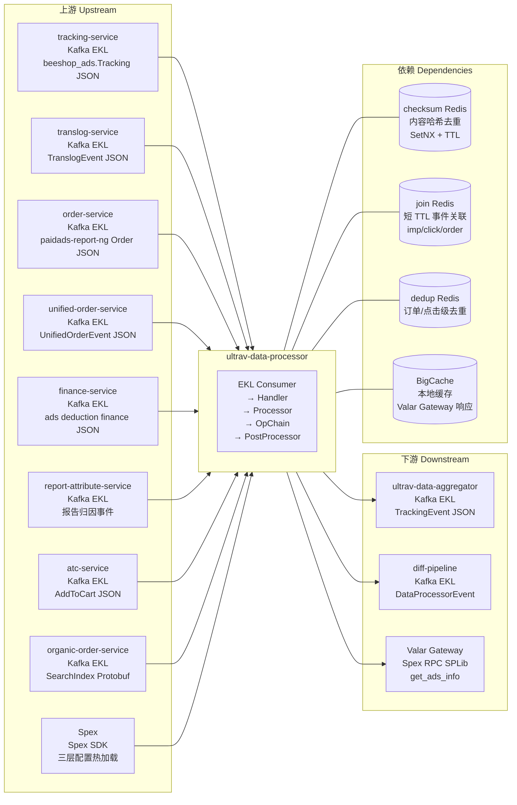

<!-- ads-workspace-gdoc-sync: gdoc_id=1muH9-wq6GJU4DC_YF8ZJi_2traVo41EXdHL3cYxePl8 gdoc_url=https://docs.google.com/document/d/1muH9-wq6GJU4DC_YF8ZJi_2traVo41EXdHL3cYxePl8/edit -->

# UltraV Data Processor

[English](README_EN.md) | 中文

仓库地址：https://git.garena.com/shopee/deep/paidads-bidding/ultrav-data-processor

---

## 目录 / Table of Contents

1. [项目概述 / Introduction](#项目概述--introduction)
2. [核心功能 / Features](#核心功能--features)
3. [项目架构 / Architecture](#项目架构--architecture)
   - [系统上下文 / System Context](#系统上下文--system-context)
   - [上下游调用拓扑 / Service Topology](#上下游调用拓扑--service-topology)
   - [数据流 / Data Flow](#数据流--data-flow)
4. [目录结构 / Directory Structure](#目录结构--directory-structure)
5. [部署模式 / Deployment Modes](#部署模式--deployment-modes)
   - [Product Ads 独立部署 / Product Ads Standalone](#product-ads-独立部署--product-ads-standalone)
   - [Content Ads 合并部署 / Content Ads Merged Deployment](#content-ads-合并部署--content-ads-merged-deployment)
6. [核心流程 / Core Pipeline](#核心流程--core-pipeline)
   - [Kafka 消费与事件解析 / Kafka Consumption and Event Parsing](#kafka-消费与事件解析--kafka-consumption-and-event-parsing)
   - [事件去重 (Checksum) / Event Deduplication](#事件去重-checksum--event-deduplication)
   - [Operator Chain 处理 / Operator Chain Processing](#operator-chain-处理--operator-chain-processing)
   - [后置处理器 / Post Processors](#后置处理器--post-processors)
   - [Kafka 产出 / Kafka Output](#kafka-产出--kafka-output)
7. [配置体系 / Configuration](#配置体系--configuration)
   - [静态配置 (Spex config) / Static Config](#静态配置-spex-config--static-config)
   - [动态配置 (Spex dynamic) / Dynamic Config](#动态配置-spex-dynamic--dynamic-config)
   - [算子链配置 (Spex op\_chain\_config) / Operator Chain Config](#算子链配置-spex-op_chain_config--operator-chain-config)
8. [开发规范 / Development Guidelines](#开发规范--development-guidelines)
   - [代码风格 / Code Style](#代码风格--code-style)
   - [新增 Operator / How to Add a New Operator](#新增-operator--how-to-add-a-new-operator)
   - [新增事件处理器 / How to Add a New Processor](#新增事件处理器--how-to-add-a-new-processor)
   - [新增 Special Setter / How to Add a Special Setter](#新增-special-setter--how-to-add-a-new-special-setter)
   - [项目结构 / Project Structure](#项目结构--project-structure)
   - [命名规范 / Naming Conventions](#命名规范--naming-conventions)
   - [错误处理 / Error Handling](#错误处理--error-handling)
   - [单元测试 / Unit Testing Standards](#单元测试--unit-testing-standards)
   - [Code Review & Git Workflow](#code-review--git-workflow)
9. [部署 / Deployment](#部署--deployment)
   - [生产构建 / Build for Production](#生产构建--build-for-production)
   - [发布流程 / Release Process](#发布流程--release-process)
10. [监控 / Monitoring](#监控--monitoring)
11. [业务术语表 / Business Terminology Glossary](#业务术语表--business-terminology-glossary)
12. [参考资料 / Additional Resources](#参考资料--additional-resources)
13. [常见问题 / Frequently Asked Questions](#常见问题--frequently-asked-questions)

---

## 项目概述 / Introduction

`ultrav-data-processor` 是 Paid Ads 竞价系统中的近实时 ETL 数据处理服务，位于原始事件采集与下游聚合（ultrav-data-aggregator）之间。它是 UltraV 竞价闭环数据链路的第一段：将来自多个上游 Kafka 源的原始广告事件（展示、点击、扣费、订单、加购等），经过过滤、字段补充、算子链归一化后，产出标准化的 TrackingEvent JSON，写入下游 Kafka，由 ultrav-data-aggregator 聚合为 Redis 时间窗口指标，最终驱动 UltraV Core 的竞价系数调整。

服务当前包含两种独立进程：

- `server/product_ads/main.go`：Product Ads 独立进程，Spex 服务名 `adsbidding.ultravdataprocessor`
- `server/content_ads/content_ads_main.go`：Content Ads 合并进程（shop / live / brand_max / video 四类合并为一个进程），Spex 服务名 `contentads.ultravdataprocessor`

两种模式共享同一套处理框架（handler、operator、special_setter、checksum），但输入 topic、输出 producer、动态配置和 Operator Chain 配置各有差异。

---

## 核心功能 / Features

- **多源 Kafka 消费**：支持 tracking（beeshop_ads.Tracking JSON）、traffic（统一 tracking 新口径）、translog（TranslogEvent JSON）、order（paidads-report-ng Order JSON）、unified_order（UnifiedOrderEvent）、finance（ads deduction finance）、attribute（报告归因）、atc（AddToCart，仅 Product Ads）、organic_order（SearchIndex Protobuf，仅 Product Ads）共 9 类输入源
- **可配置算子链（Operator Chain）**：通过 Spex `op_chain_config` 热加载，支持 phase / condition / op_list / sub_op_chain / layer 多层编排，无需重启即可调整事件处理逻辑；新增算子包括 `ValidTranslogOcpm`（OCPM translog 过滤门控）和 `ShouldSendTopicGate`（作为 op_chain 算子实现 topic-type 门控）
- **事件内容哈希去重（checksum）**：基于内容哈希 + Redis SetNX + 可配置 TTL，防止重复消费（默认 TTL 1 小时）
- **Product Ads 独特后处理**：Join Redis 事件关联（impression ↔ click ↔ order）、Dedup Redis 订单级去重、通过 Valar Gateway（Spex RPC `paidads.valar.gateway.get_ads_info`）补充 `global_cat_ids`，并以 BigCache 本地缓存减少 RPC 调用
- **TopicTypeOld / TopicTypeNew 双写控制**：通过动态配置 `enable_write_old_topic` / `enable_write_new_topic` 及 `unified_output_switch_timestamp` 实现蓝绿切换
- **Diff Pipeline 对比输出**：可选开启 `diff_data_kafka_producer`，将 DataProcessorEvent 输出到对比下游
- **Prometheus 指标暴露**：namespace=`paidads`，subsystem=`ultrav_data_processor`，含事件计数、延迟、错误计数、指标值四类 metrics
- **HTTP 诊断能力**：`/metrics`、`/ping`、`/debug/pprof/*`、`/log/{level}`（运行时动态切换日志级别）

---

## 项目架构 / Architecture

### 系统上下文 / System Context

`ultrav-data-processor` 在广告竞价数据收集链路中处于中间层：

```
上游多类 Kafka 事件
  → ultrav-data-processor（ETL / 归一化）
  → 下游 Kafka topic
  → ultrav-data-aggregator（指标聚合写入 Redis）
  → UltraV Core（竞价系数调整）
  → Online Bidding（实时出价）
```

### 上下游调用拓扑 / Service Topology



**上下游拓扑表格**

| 类别 | 名称 | 协议 | 说明 |
|------|------|------|------|
| 上游 | tracking-service | Kafka (EKL) | beeshop_ads.Tracking JSON（展示、点击等） |
| 上游 | translog-service | Kafka (EKL) | TranslogEvent JSON，扣费事件 |
| 上游 | order-service | Kafka (EKL) | paidads-report-ng Order JSON，订单归因 |
| 上游 | unified-order-service | Kafka (EKL) | UnifiedOrderEvent JSON，OCPM / no-click order |
| 上游 | finance-service | Kafka (EKL) | ads deduction finance JSON，财务口径 |
| 上游 | report-attribute-service | Kafka (EKL) | 报告归因事件，补充归因维度 |
| 上游 | atc-service | Kafka (EKL) | AddToCart 事件（仅 Product Ads） |
| 上游 | organic-order-service | Kafka (EKL) | SearchIndex Protobuf，有机订单（仅 Product Ads） |
| 上游 | Spex | Spex SDK | 提供 config / dynamic / op_chain_config 三层配置，支持热加载 |
| 下游 | ultrav-data-aggregator | Kafka (EKL) | 消费 TrackingEvent JSON，聚合写入 Redis |
| 下游 | diff-pipeline | Kafka (EKL) | 可选的 DataProcessorEvent 差异对比下游 |
| 下游 | Valar Gateway (`paidads.valar.gateway`) | Spex RPC (SPLib) | `get_ads_info` 命令获取 `global_cat_ids` |
| 依赖 | checksum Redis | Redis (SetNX+TTL) | 内容哈希去重，防止重复消费，默认 TTL 1h |
| 依赖 | join Redis | Redis | 短 TTL 缓存，用于 impression/click/order 事件关联（Product Ads） |
| 依赖 | dedup Redis | Redis | 订单/点击级别去重标记，防止重复计算 |
| 依赖 | BigCache | 本地内存缓存 | 缓存 Valar Gateway ads info 响应，LifeWindow 24h，HardMax 128MB |

#### 中间件实例详情 / Middleware Instance Details

本仓库使用两个 Spex 入口：`server/product_ads/main.go` 初始化 `adsbidding.ultravdataprocessor`，`server/content_ads/content_ads_main.go` 初始化 `contentads.ultravdataprocessor`。Content 进程读取的是同一个 `[sp]contentads / ultravdataprocessor` namespace，再通过配置字段区分 shop / live / brand_max / video 流量；它不会读取 `adsbidding.shopadsultravdataprocessor` 这类按垂类拆分的 namespace。

| 类型 | 方向 | 具体实例 | 用途 | 证据 |
|---|---|---|---|---|
| Kafka | 消费 | Product 配置项 `config.tracking_kafka` in `[sp]adsbidding / ultravdataprocessor`；brokers `kafka.ks_adsTracking_live.ap-sg-1-general-b.live.mq.shopee.io:9092`, `kafka.ks_ads_live.ap-sg-1-general-a.live.mq.shopee.io:9092`, `kafka.kafka_aqb6pqgg_live.na-us-2-general-a.live.mq.shopee.io:9092`, `kafka.kafka_us_ar_acl_live.live.mq.shopee.io:9093`；topics `shopee_ads_sg/vn/tw/th/ph/my/id_live`, `shopee_ads_br_live`, `shopee_ads_mx_live`, `shopee_ads_ar_live`；groups `hyperx`, `paidads-hyperx-664cba`, `mp_search_recommendation_ads-paidads-hyperx-a22d29`, `mp_search_recommendation_ads-paidads-ultrav-data-processor-33acc5` | Product Ads tracking 输入 | `server/product_ads/main.go`, `config/processor.go` |
| Kafka | 消费 | Product 还读取 `traffic_kafka` topic `shopee_ads_traffic-ph-live`；`translog_kafka` topics `paidads_translog_event_sg/th/vn/tw/ph/my/id_live`, `paidads_translog_event_br_live`, `paidads_translog_event_mx_live`, `paidads_translog_event-ar-live`；`order_kafka` topics `shopee_ads_order_live`, `shopee_ads_order_br_live`, `shopee_ads_order-mx-live`, `shopee_ads_order-ar-live`；`unified_order_kafka` topics `shopee-ads-data-unified-order-*-live`；`finance_kafka` topic `shopee-ads-finance-ph-live`；`attribute_kafka` topic `shopee-ads-attribution-ph-live`；`atc_kafka` topics `shopee_ads_atc_*_live`；`organic_order_kafka` topics `shopee_order_gds_live`, `shopee_order_gds_br_live`, `shopee_order_gds-mx-live`, `shopee-order-gds-ar-live` | Product Ads 扣费、订单、归因、ATC、有机订单输入 | `handler/`, `processor/`, `config/processor.go` |
| Kafka | 生产 | Product 配置项 `config.kafka_producer`；brokers `di-kafka-stt01-bg1-bootstrap01/02/03-stt-sg.data-infra.shopee.io:9093`, `di-kafka-da01-bg1-bootstrap01/02/03-dallas-us.data-infra.shopee.io:9093`；topics `bidding_tracking_event_id/ph/vn/th/my/tw/sg`, `mkplpaidads_discovery_ads.hyperx_tracking_event_us`；部分配置 group 为 `ultrav_data_processor` | Product Ads 输出 `TrackingEvent` 到 `ultrav-data-aggregator` | `pkg/producer`, `config/processor.go` |
| Kafka | 消费 | Content 配置项 `config.tracking_kafka` in `[sp]contentads / ultravdataprocessor`；brokers `kafka.ks_adsTracking_live.ap-sg-1-general-b.live.mq.shopee.io:9092`, `kafka.ks_ads_live-01.ap-sg-1-general-a.live.mq.shopee.io:9092`, `kafka.kafka_aqb6pqgg_live.na-us-2-general-a.live.mq.shopee.io:9092`；topics `shopee_ads_sg/vn/tw/th/ph/my/id_live`, `shopee_ads_br_live`；groups `mp_search_recommendation_ads-paidads-content-ads-ultrav-data-processor-*` | Content Ads shop tracking 输入 | `server/content_ads/content_ads_main.go`, `config/processor.go` |
| Kafka | 消费 | Content 还读取 `live_ads_tracking_kafka` topics `shopee_ads_livestream_ads_id/vn/my/ph/th/sg/tw_live`, `shopee_ads_livestream_ads_br_live`；`brand_max_tracking_kafka` topics `shopee_ads_display_ads`, `shopee_ads_display_ads_br`；`translog_kafka` topics `paidads_translog_event_sg/th/vn/tw/ph/my/id_live`, `paidads_translog_event_br_live`；`order_kafka` topics `shopee_ads_order_live`, `shopee_ads_order_br_live` | Content Ads live、brand-max、translog、order 输入 | `processor/`, `operator/`, `config/processor.go` |
| Kafka | 生产 | Content 配置项 `shop_kafka_producer`, `live_kafka_producer`, `brand_max_kafka_producer`, `video_kafka_producer`, `diff_data_kafka_producer`；brokers `kafka.ks_adstracking_live.ap-sg-1-general-b.live.mq.shopee.io:9092`, `kafka.kafka_latam_fe_us.na-us-2-general-a.live.mq.shopee.io:9092`, `kafka.ks_commmonlog_live.ap-sg-1-general-a.live.mq.shopee.io:9092`, `kafka.ks_br_market_live.ap-sg-1-general-c.live.mq.shopee.io:9092`, `kafka.ks_paidads_live.ap-sg-1-general-a.live.mq.shopee.io:9092`；topics `shop-ads-data-event-global-live`, `shop-ads-data-event-br-live`, `live-ads-data-event-global-live`, `live-ads-data-event-br-live`, `brand-max-bidding-event-global-live`, `brand-max-bidding-event-br-live`, `adsbidding_videoads_ultrav_data_processor-global-live`, `adsbidding_videoads_ultrav_data_processor-br-live`, `paidads-bidding-data-processor-output-global-live` | Content Ads 按垂类输出 `TrackingEvent` 和 diff 输出 | `operator/`, `pkg/producer`, `config/processor.go` |
| Redis | 读写 | Product `config.checksum_redis`: `03tcn.elasticredis.cloud.shopee.io:10421`, `ka0oo.elasticredis.cloud.shopee.io:10829`；Content `config.checksum_redis`: `soefe.elasticredis.cloud.shopee.io:11828`, `0083dcfb33f6dedd.elasticredis.cloud.shopee.io:11828`；liveish rule 还使用 `gkil5.elasticredis.cloud.shopee.io:10243` | 通过 `SetNX + TTL` 做重复事件抑制 | `pkg/checksum`, `config/processor.go` |
| Redis | 读写 | Product `config_redis`: `0083dcfb33f6dedd.elasticredis.cloud.shopee.io:11828`；join/dedup Redis 在 Product Ads config struct 中存在，但本次扫描到的 live `config` item 未发现具体域名 | Group-key 配置查询、事件关联、去重 | `pkg/post_processor`, `config/processor.go` |
| Config Center | 读取 | Product `[sp]adsbidding / ultravdataprocessor` item `config`；Content `[sp]contentads / ultravdataprocessor` item `config`；额外代码路径使用 app key `ultrav_data_processor` 读取 `dynamic` 和 `op_chain_config` item | 运行时 Kafka、Redis、算子链、动态开关配置 | `config/processor.go`, `config/dynamic/dynamic.go`, `config/op_config/config.go` |
| DB/FSE/Vespa/S3/ClickHouse | 未发现 | 扫描代码未发现本仓库直接读写 DB、FSE、Vespa、S3 或 ClickHouse | 存储访问集中在 Redis/Kafka/Config Center/Spex RPC | source scan |

### 数据流 / Data Flow

```
Kafka Input (EKL Consumer)
  └─ Handler.Transform()        # 字节流 → 类型化事件（beeshop_ads.Tracking / TranslogEvent / Order 等）
  └─ Handler.Process()          # 业务逻辑入口
      └─ Checksum 去重          # 内容哈希 + Redis SetNX，重复事件直接丢弃
      └─ OpContext 初始化       # InitCtxData(MaxLayer)，分配 layered data 结构
      └─ Operator Chain 执行    # 按 phase 顺序，每个 phase 执行 op_list 中的算子
          ├─ condition 条件判断
          ├─ operator 执行（ExtractFields / IsValid / Loop / Convert / SumGen...）
          ├─ sub_op_chain 嵌套  # loop 类算子的子链处理
          └─ layer 数据传递     # 算子间通过 OpContext layered data 传递中间结果
      └─ Post Processor         # Product Ads：Join Redis + Dedup Redis + Valar GW
                                # Content Ads：no-op（输出由 op_chain 中 post_processor op 完成）
  └─ Kafka Producer 写出        # TrackingEvent JSON → 下游 Kafka topic
```

9 种输入事件类型对应 9 个 Processor 实现：

| Processor | 输入 Kafka | 处理类型 |
|-----------|-----------|---------|
| `tracking_processor` | `tracking_kafka` | beeshop_ads.Tracking JSON（TopicTypeOld） |
| `traffic_processor` | `traffic_kafka` | beeshop_ads.Tracking JSON（TopicTypeNew） |
| `translog_processor` | `translog_kafka` | TranslogEvent JSON（CPC/CPM 扣费） |
| `order_processor` | `order_kafka` | paidads-report-ng Order JSON |
| `unified_order_processor` | `unified_order_kafka` | UnifiedOrderEvent JSON |
| `finance_processor`（AdsDeductionFinance） | `finance_kafka` | 财务扣费 JSON |
| `attribute_processor`（ReportAttribute） | `attribute_kafka` | 报告归因事件 |
| `atc_processor` | `atc_kafka` | AddToCart JSON（Product Ads） |
| `organic_order_processor` | `organic_order_kafka` | SearchIndex Protobuf（Product Ads） |

---

## 目录结构 / Directory Structure

```
ultrav-data-processor/
├── server/
│   ├── product_ads/main.go          # Product Ads 进程入口（Spex: adsbidding.ultravdataprocessor）
│   ├── content_ads/content_ads_main.go  # Content Ads 进程入口（Spex: contentads.ultravdataprocessor）
│   └── util.go                      # InitOpList() 注册所有 Operator 实例
├── config/
│   ├── processor.go                 # DataProcessorConfigType：主配置结构，含 Kafka/Redis/Filter/AdsInfoGateway
│   ├── dynamic/dynamic.go           # DynamicConfigType：动态开关配置，Spex key=dynamic
│   └── op_config/config.go          # OpChainConfigType：算子链配置，Spex key=op_chain_config
├── pkg/
│   ├── handler/                     # Kafka consumer 封装（单 consumer / 按国家拆分 consumer）
│   ├── service/
│   │   ├── processor/               # 各类事件 Processor 实现
│   │   │   ├── tracking_processor/  # Tracking / Traffic 处理器
│   │   │   ├── translog_processor/  # Translog / Finance 处理器
│   │   │   ├── order_processor/     # Order / Attribute 处理器
│   │   │   ├── unified_order_processor/
│   │   │   ├── atc_processor/
│   │   │   ├── organic_order_processor/
│   │   │   ├── monitor.go           # Prometheus event_count / event_count_by_bucket / no_cat_count
│   │   │   ├── interface.go         # Processor 接口定义（Transform + Process）
│   │   │   └── util.go              # TopicTypeOld/New、InitCtxData、groupkey 设置等工具函数
│   │   ├── operator/                # 所有 Operator 实现（tracking/translog/order/common/post_processor）
│   │   └── post_processor/          # Product Ads / Content Ads PostProcessor 实现
│   ├── data/
│   │   ├── ads_info_gateway/        # Valar Gateway Spex RPC 封装 + BigCache 本地缓存
│   │   ├── checksum/                # 内容哈希去重 Redis 封装
│   │   ├── dedup_redis/             # 订单/点击级去重 Redis 封装
│   │   ├── join_redis/              # 事件关联 Redis 封装
│   │   └── kafka/                   # Kafka EventProducer 封装
│   ├── special_setters/             # Special Setter 注册表（field_setters / group_key_setters）
│   ├── http_handler/                # HTTP 路由注册（/metrics, /ping, /debug/pprof/*, /log/{level}）
│   └── util/                        # exporter.go（Prometheus）、logger、const、diff、getter/setter 工具
├── types/                           # 自定义错误类型与 SetterInput helpers（OpContext 已迁移至 paidads-bidding/common）
├── mock_data/                       # 本地调试用 op_chain_config JSON 样例
│   ├── op_chain_config.json         # Product Ads 样例配置
│   ├── content_op_chain_config.json # Content Ads 样例配置
│   └── op_chain_config_translog.json
├── tool/                            # 辅助工具（mock_kafka_input、mock_redis_config）
├── tools/                           # opchain-viewer 等工具
├── docs/                            # 开发者文档（OpContext 重构指南、字段数据流 SOP）
├── go.mod
└── Makefile
```

---

## 部署模式 / Deployment Modes

### Product Ads 独立部署 / Product Ads Standalone

| 项目 | 值 |
|------|-----|
| 进程入口 | `server/product_ads/main.go` |
| Spex 服务名 | `adsbidding.ultravdataprocessor` |
| 环境变量 | `PROJECT_NAME=adsbidding`，`MODULE_NAME=ultravdataprocessor` |
| Kafka 消费者 | tracking / traffic / translog / order / atc / organic_order / unified_order / attribute（可选）/ finance（可选） |
| Kafka Producer | 单一 `kafka_producer`（输出到 product ads TrackingEvent topic） |
| 独特能力 | Join Redis 事件关联、Dedup Redis 去重、Valar Gateway ads info 补充（global_cat_ids） |

本地启动：

```bash
go run ./server/product_ads
```

### Content Ads 合并部署 / Content Ads Merged Deployment

| 项目 | 值 |
|------|-----|
| 进程入口 | `server/content_ads/content_ads_main.go` |
| Spex 服务名 | `contentads.ultravdataprocessor` |
| 环境变量 | `PROJECT_NAME=contentads`，`MODULE_NAME=ultravdataprocessor` |
| Kafka 消费者 | tracking / live_ads_tracking（可选）/ translog / order |
| Kafka Producer | shop_kafka_producer / live_kafka_producer / brand_max_kafka_producer / video_kafka_producer / diff_data_kafka_producer（可选） |
| 独特能力 | 多 Producer 合并部署，shop/live/brand_max/video 四类广告由同一进程处理，Content Ads PostProcessor 为 no-op |

本地启动：

```bash
go run ./server/content_ads
```

**部署差异对比**

| 维度 | Product Ads | Content Ads |
|------|-------------|-------------|
| 进程入口 | `server/product_ads/main.go` | `server/content_ads/content_ads_main.go` |
| Spex 服务名 | `adsbidding.ultravdataprocessor` | `contentads.ultravdataprocessor` |
| Kafka Producer 数量 | 1（单一 `kafka_producer`） | 4（shop / live / brand_max / video） |
| 主要输入源 | 9 类（含 atc / organic_order / unified_order） | 3-4 类（tracking / translog / order，可选 live_ads_tracking） |
| PostProcessor | 具体处理（join Redis / dedup / ads info 补充） | no-op（输出由 op_chain 内 post_processor op 完成） |
| Valar Gateway 依赖 | 是 | 否 |

> **注意**：Makefile 中保留了 `shop-svc`、`live-svc`、`video-svc`、`brandmax-svc` 目标，对应的 `server/shop_ads`、`server/live_ads`、`server/video_ads`、`server/brand_max` 目录已不在代码库中，仅作历史兼容。当前请使用 `content-svc`（即 `server/content_ads`）。

---

## 核心流程 / Core Pipeline

### Kafka 消费与事件解析 / Kafka Consumption and Event Parsing

每个事件处理器（Processor）实现 `processor.Processor` 接口：

```go
type Processor interface {
    Transform(ctx context.Context, msg *ekl.Message) (interface{}, error)
    Process(ctx context.Context, msg *ekl.Message) error
}
```

- **Transform**：将 EKL Message 字节流反序列化为类型化事件对象（JSON Unmarshal 或 Proto Unmarshal）
- **Process**：执行业务逻辑，包括过滤、去重、算子链执行、后处理输出

Handler 支持两种消费模式：
- **单 consumer**：`KafkaConfig.Brokers + Topics + GroupId`（无 `CountryKafkaConfigs`）
- **按国家拆分 consumer**：`KafkaConfig.CountryKafkaConfigs`，为每个国家配置独立的 broker/topic/group

### 事件去重 (Checksum) / Event Deduplication

基于内容哈希实现幂等性保障：

```
内容字段 → xxhash64 → Redis Key: sum_dp_{country}_{eventType}:{hash}_v0
→ SetNX(key, "", TTL) → 若已存在则丢弃
```

- `Exists()`：用于 TopicTypeOld 口径（key suffix `_v0`），默认 TTL 1 小时
- `ExistsV2()`：用于 TopicTypeNew 口径（key suffix `_v3`）
- `IsNewOrder()`：订单级新单判断（key: `no:{country}_{orderId}_{itemId}`，TTL 7 天）

checksum Redis 即 `config.checksum_redis` 所对应的 Redis 实例，同时也用于 dedup Redis（通过 `dedup_redis.New(cfg.CheckSum.Redis)` 初始化）。

### Operator Chain 处理 / Operator Chain Processing

Operator Chain 是服务核心。每个 ProcessorV2（TrackingProcessorV2 / TranslogProcessorV2 / OrderProcessorV2 / UnifiedOrderProcessorV2）包含：

```
ProcessorV2 {
  Kafka       string             // 对应输入 kafka key 名
  MaxLayer    int                // OpContext layered data 层数
  OpChain     []OperationByPhase // 按 phase 顺序执行
  InitOpInput []string           // 初始化算子输入字段列表
}

OperationByPhase {
  Phase     string        // 处理阶段名
  Condition string        // 执行条件（空则无条件执行）
  OpList    []OperationV2 // 当前 phase 的算子列表
}

OperationV2 {
  OpName     string             // 算子名（在 server/util.go 注册）
  OpType     string             // 算子类型
  OpConfig   OpConfig           // 算子配置
  SubOpChain []OperationByPhase // loop 类算子的子处理链
  Layer      int                // 目标 layer 层
}
```

`OpContext` 核心结构：
- `Data []map[string]interface{}`：通过 `InitCtxData(MaxLayer)` 初始化，按 layer 索引，算子间通过不同 layer 传递中间结果
- `DependencyData`：当前算子的依赖字段
- `SetterInput`：Special Setter 的输入数据

算子注册入口：`server/util.go`，`InitOpList()` 注册所有算子实例：

- **tracking operators**：ConvertEntranceLiveTracking、ExtractFieldsTracking、ExtractFieldsTrackingItem、ExtractFieldsTrackingLivestream、ExtractFieldsTrackingShop、ExtractFieldsTrackingVideo、GetTrackingPlacement、IsValidTraffic、IsValidTrafficItemProduct、IsValidTracking、IsValidTrackingItem*（Product/Shop/Live/LiveAntou/BrandMax/Video）、LoopTrackingItem*（Product/Shop/Live/Video）、SwitchOpTracking
- **translog operators**：ExtractFieldsTranslog、ExtractFieldsTranslogEvent、IsValidTranslog、IsValidTranslogItem*（Product/Live/LiveAntou/Video）、ConvertEventDetails、ConvertProductDeductionInfo、ConvertMapCostDetails、ExtractFields*（CostDetail/EventDetail/Finance/FinanceCostDetail/ProductDeductionInfo）、GetCostDetail、GetFirstFinanceCostDetail、IsValidFinance、IsValidFinanceItemProduct、LoopFinanceCostDetails、LoopTranslogEventDetails、SwitchDeductionType、SwitchOpTranslog、**ValidTranslogOcpm**（过滤 `is_ocpm` 为 false 的 translog 事件）
- **order operators**：ExtractFieldsOrder、ExtractFieldsOrderClick、ExtractFieldsOrderItem、ExtractFieldsOrderAdsInfo、ExtractFieldsOrderImp、IsValidOrder、IsValidOrderLive、IsValidOrderLiveAntou、IsValidOrderProductClick/NoClick/Imp、SwitchOpOrder
- **report_attribute operators**：ExtractFieldsReportAttribute、ExtractFieldsReportAttributeAttributeInfo、ExtractFieldsReportAttributeOrderOriginal、FillReportAttributeClickItemIDFallback、IsValidReportAttribute、IsValidReportAttributeProduct*（Atc/Click/Imp/NoClick）、SwitchOpReportAttribute
- **unified_order operators**：IsValidUnifiedOrder、ExtractFieldsUnifiedOrder
- **common operators**：ConvertAdsData（及变体：Live/Video/Shop/ShopWithFallback/ShopWithoutFallback/BrandMax/WithoutFallback）、ConvertBidRerankTrace、ConvertDeductionInfo、ConvertExtInfo、ConvertTrackingEventToList、ConvertVideoAdsData、ExtractFieldsAdsData、ExtractFieldsBidRerankTrace、ExtractFieldsDeductionInfo、ExtractFieldsExtInfo、GetEntranceByPlacement、GetEntranceFromAlgoJsonData、RegroupPlacementLive、SetTrackingEventItemFields、SetTrackingEventsCommonFields、**ShouldSendTopicGate**（op_chain 内的 topic-type 门控算子，基于动态配置决策是否发送）、SumCheck、WriteFieldAToFieldB
- **post_processor operators**：DiffPostProcessor、ShopPostProcessor、LivePostProcessor、BrandMaxPostProcessor、VideoPostProcessor、ProductPostProcessor、ProductPostProcessorForDiff、ContentPostProcessorForDiff

**OpConfig 关键字段**：

| 字段 | 说明 |
|------|------|
| `dependency` | 算子依赖的输入字段列表 |
| `output` | 算子输出的字段列表 |
| `special_config` | 算子私有配置，类型为 `any`，由具体 Op 定义结构体并在 Op 内断言使用 |
| `set_fields` | 旧字段，暂时保留字段定义；新路径不自动读取，目标结构为 `special_config.set_fields` |
| `set_group_keys` | 旧字段，暂时保留字段定义；新路径不自动读取，目标结构为 `special_config.set_group_keys` |
| `set_fields_special` | 旧字段，暂时保留字段定义；新路径不自动读取，目标结构为 `special_config.set_fields_special` |
| `set_group_keys_special` | 旧字段，暂时保留字段定义；新路径不自动读取，目标结构为 `special_config.set_group_keys_special` |
| `loop_field` | loop 类算子的遍历字段 |
| `sub_op_input` | 子算子链的初始化输入字段 |
| `cp_to_next_layer` | 需要复制到下一 layer 的字段 |

### 后置处理器 / Post Processors

**Product Ads PostProcessor**（`post_processor.NewProductAdsPostProcessor`）：
1. **Join Redis**：将 impression / click / order 事件关联，通过 join_redis 缓存 click 信息，供后续 order 查询关联点击时间戳
2. **Dedup Redis**：订单/点击级别去重，防止相同 orderId+itemId 重复计算
3. **Valar Gateway ads info 补充**：通过 `paidads.valar.gateway.get_ads_info`（Spex RPC）查询 `global_cat_ids`，结果以 BigCache（24h LifeWindow，128MB HardMax）本地缓存，减少 RPC QPS

**Content Ads PostProcessor**（`post_processor.NewContentAdsPostProcessor`）：
- 持有 shop / live / brand_max / video 四个 Kafka Producer
- 本身为 no-op：事件路由和输出完全由 op_chain 中的 `ShopPostProcessor`、`LivePostProcessor` 等 post_processor operators 完成

### Kafka 产出 / Kafka Output

- Product Ads：统一通过单个 `kafka_producer` 写出 TrackingEvent JSON
- Content Ads：按广告类型分别通过 `shop_kafka_producer`、`live_kafka_producer`、`brand_max_kafka_producer`、`video_kafka_producer` 写出
- 可选 `diff_data_kafka_producer`：写出 DataProcessorEvent，用于新旧口径对比

`TopicTypeOld / TopicTypeNew` 双写逻辑由 `ShouldSendTopic(topicType, currentTimestamp, switchTimestamp)` 控制，配合动态配置的 `enable_write_old_topic`、`enable_write_new_topic` 和 `unified_output_switch_timestamp` 实现无停机切换。

---

## 配置体系 / Configuration

服务启动时初始化三层 Spex 配置，均支持热更新（无需重启）。

### 静态配置 (Spex config) / Static Config

**Spex key**：`config`（由各服务名分别加载：`adsbidding.ultravdataprocessor` 或 `contentads.ultravdataprocessor`）

**配置结构**：`DataProcessorConfigType`（`config/processor.go`）

| 字段分类 | 字段名 | 说明 |
|---------|--------|------|
| 通用 | `log_level` | 日志级别（debug/info/warn/error/fatal） |
| 通用 | `graceful_period` | 优雅停机等待时间（Go duration string，默认 30s） |
| 通用 | `encoder_secret` | TrackingItem deductionInfo 解码密钥 |
| 通用 | `countries` | 允许处理的国家列表 |
| 输入 Kafka | `tracking_kafka` | tracking 事件消费配置 |
| 输入 Kafka | `live_ads_tracking_kafka` | live ads tracking（Content Ads，可选） |
| 输入 Kafka | `translog_kafka` | translog 事件消费配置 |
| 输入 Kafka | `order_kafka` | order 事件消费配置 |
| 输入 Kafka | `atc_kafka` | ATC 事件消费配置（Product Ads） |
| 输入 Kafka | `organic_order_kafka` | 有机订单事件消费配置（Product Ads） |
| 输入 Kafka | `unified_order_kafka` | 统一订单事件消费配置（Product Ads） |
| 输入 Kafka（统一口径） | `traffic_kafka` | tracking 新口径消费配置 |
| 输入 Kafka（统一口径） | `finance_kafka` | 财务扣费消费配置（可选） |
| 输入 Kafka（统一口径） | `attribute_kafka` | 报告归因消费配置（可选） |
| 输出 Kafka | `kafka_producer` | Product Ads TrackingEvent 写出 |
| 输出 Kafka | `shop_kafka_producer` | Content Ads Shop 写出 |
| 输出 Kafka | `live_kafka_producer` | Content Ads Live 写出 |
| 输出 Kafka | `brand_max_kafka_producer` | Content Ads BrandMax 写出 |
| 输出 Kafka | `video_kafka_producer` | Content Ads Video 写出 |
| 输出 Kafka | `diff_data_kafka_producer` | diff 对比输出（可选） |
| 去重 | `checksum_redis` | checksum + dedup Redis 配置，含 `ttl` 字段（默认 1h） |
| 过滤器 | `product_ads_filter` | Product Ads 业务过滤（placements / impression_placements / entrances） |
| 过滤器 | `shop_ads_filter` | Shop Ads 业务过滤 |
| 过滤器 | `brand_max_filter` | BrandMax 业务过滤 |
| 过滤器 | `live_ads_filter` | Live Ads 业务过滤 |
| 过滤器 | `video_ads_filter` | Video Ads 业务过滤 |
| 过滤器 | `ads_tracking_filter` | tracking 处理器过滤（country/operation/placement 维度） |
| 过滤器 | `order_log_filter` | order 处理器过滤 |
| 过滤器 | `trans_log_filter` | translog 处理器过滤 |
| 外部依赖 | `ads_info_gateway` | Valar Gateway 超时配置（`timeout`，默认 100ms） |

`KafkaConfig` 支持单消费者（`brokers + topics + group_id`）和按国家拆分（`country_kafka_configs` 列表）两种模式。

### 动态配置 (Spex dynamic) / Dynamic Config

**Spex key**：`dynamic`（函数 `dynamic.SetDynamicConfig()`，Spex 服务名 `ultrav_data_processor`）

**配置结构**：`DynamicConfigType`（`config/dynamic/dynamic.go`）

| 字段 | 类型 | 默认值 | 说明 |
|------|------|--------|------|
| `enable_order_dedup` | bool | false | 是否开启订单级去重 |
| `no_click_order_ads_enabled` | bool | false | 是否开启 no-click order 处理 |
| `no_click_order_ads_sample_rate` | float64 | 0 | no-click order 采样日志比例 |
| `ocpm_order_ads_enabled` | bool | false | 是否开启 OCPM order 处理 |
| `ocpm_order_ads_sample_rate` | float64 | 0 | OCPM order 采样日志比例 |
| `event_process_lag_threshold` | int | 60000 | 事件处理延迟告警阈值（毫秒） |
| `event_process_lag_shop_whitelist_by_country` | map[string][]int64 | — | 延迟白名单 shop 列表（按国家） |
| `event_lag_log_sample_rate` | float64 | — | 延迟日志采样率 |
| `live_ads_default_value` | struct | — | Live Ads 默认 pCTR entrance 和 target ROI |
| `video_ads_default_value` | struct | — | Video Ads 默认 pCTR entrance 和 target ROI |
| `target_roi_discount_ratio_map` | map[int32]map[string]float64 | — | Target ROI 折扣比例（pricing_type → country → ratio） |
| `default_target_roi_country_value` | float64 | — | Target ROI 默认 country 维度值 |
| `unified_output_switch_timestamp` | int64 | — | TopicTypeOld → TopicTypeNew 切换时间戳 |
| `enable_write_old_topic` | bool | true | 是否写入旧口径 topic |
| `enable_write_new_topic` | bool | false | 是否写入新口径 topic |

### 算子链配置 (Spex op\_chain\_config) / Operator Chain Config

**Spex key**：`op_chain_config`（函数 `op_config.SetOpChainConfig()`）

**配置结构**：`OpChainConfigType`（`config/op_config/config.go`）

`special_config` 会在 `op_chain_config` 初始加载和热更新时由对应 Operator 的 `ParseSpecialConfig` 预解析并写回配置对象，运行期由 operator client 调用 `Process` 并使用解析后的结构体。

```
OpChainConfigType {
  TrackingProcessorV2        ProcessorV2        // tracking 事件算子链
  TrafficProcessorV2         ProcessorV2        // traffic（新口径）事件算子链
  TranslogProcessorV2        ProcessorV2        // translog 事件算子链
  FinanceProcessorV2         ProcessorV2        // finance 扣费事件算子链
  OrderProcessorV2           ProcessorV2        // order 事件算子链
  ReportAttributeProcessorV2 ProcessorV2        // report_attribute 事件算子链
  UnifiedOrderProcessorV2    ProcessorV2        // unified_order 事件算子链
  MonitorSampleRate          map[string]float64 // 各事件类型监控采样率
}
```

本地样例配置：
- `mock_data/op_chain_config.json`：Product Ads 样例
- `mock_data/content_op_chain_config.json`：Content Ads 样例
- `mock_data/op_chain_config_translog.json`：Translog 样例

---

## 开发规范 / Development Guidelines

### 代码风格 / Code Style

- 遵循 Go 官方规范，使用 `go fmt ./...` 格式化（`Makefile` 中有 `fmt` 目标）
- 使用 `go vet ./...` 静态检查（`ci-vet` 目标会检查 vet 后是否有 diff，有则报错）
- 代码风格规则见 `.golangci.yml`
- Go 版本要求 ≥ 1.23（Makefile 中有版本检查，`go 1.24.5` 在 `go.mod` 中声明）

### 新增 Operator / How to Add a New Operator

1. 在 `pkg/service/operator/` 对应子包（tracking / translog / order / common）中创建新文件，实现 `operator.Operator` 接口（需有 `Name() string`、`ParseSpecialConfig(specialConfig any) (any, error)` 和 `Process(opCtx, opConfig)` 方法）
2. 在 `server/util.go` 的 `InitOpList()` 函数中通过 `operator.Ops.RegisterAll(...)` 注册新算子实例
3. 在 Spex `op_chain_config` 中对应 ProcessorV2 的 `op_chain` 里添加引用该算子的 `op_name` 配置

### 新增事件处理器 / How to Add a New Processor

1. 在 `pkg/service/processor/` 下创建新包，实现 `processor.Processor` 接口（`Transform` + `Process` 两个方法）
2. 在对应的 `server/product_ads/main.go` 或 `server/content_ads/content_ads_main.go` 中：
   - 创建 Processor 实例
   - 通过 `handler.NewEventHandler(kafkaConfig, processor)` 创建 Handler
   - 在 `main()` 中以 goroutine 启动 `handler.Start()`
   - 在 `stopGracefully()` 中调用 `handler.Stop()`
3. 在 `config/processor.go` 的 `DataProcessorConfigType` 中添加对应的 `KafkaConfig` 字段

### 新增 Special Setter / How to Add a New Special Setter

Special Setter 用于在 `op_chain_config` 的 `special_config.set_fields_special` 或 `special_config.set_group_keys_special` 中引用自定义逻辑函数。

1. 在 `pkg/special_setters/field_setters/` 或 `pkg/special_setters/group_key_setters/` 中创建新文件，实现 `SpecialSetter` 接口（`Name() string` 和 `Process(opCtx, trackingEvent, name, layer) bool`）
2. 在 `pkg/special_setters/special_setters.go` 的 `SpecialSetterList` 中追加新 Setter 实例（`init()` 会自动注册到 `SpecialSetters.Map`）
3. 在 `op_chain_config` 的 `special_config.set_fields_special` 或 `special_config.set_group_keys_special` 中通过 `func` 字段名引用

当前 field setters 包括：BroadPcrProduct、CalBidDeductionPrice、CampaignCoef、ClickShop、ConvertInt64CatIds、ConvertOrderIdToList、DeductionClick、DeductionImp（及 BrandMax/Video 变体）、DedupPlanBucketList、DedupTrafficBucketList、DeduplicatedClick、Impression（及 Shop/BrandMax 变体）、ItemPriceWithFallback、LiveView、NoClickOrder、NumOrderedWithFallback、**OcpmOrder**（设置 `trackingEvent.OcpmOrder = true`）、Order、AddToCart、PctrByEntrance、PgmvWithFallback（及 ClickOrder/OcpmOrder 变体）、RawClick（及 Shop/Video 变体）、SumGen*（Order/OrderX/TrackingEvent/TrackingEventX/TrackingLive/TrackingVideo/TrackingProduct/TrackingShop/TranslogD/TranslogShop/TranslogX/ReportAttribute/TrackingBrandMax/UnifiedOrder）、TargetCirFallback（Live/Video）、TargetCirShop、UnifiedOrderTrafficBucketList、ClickTimeStamp、RequestIdOrderNoClick。

当前 group key setters 包括：AdsBucket*（1/10/100/101/401/1000/1103/1109/1117/1123/1129/1151/1201）、CalculateDiscount、CalculateItemPriceLevel、CampaignBucket401、ConvertAdTagBit、ConvertAttrDataType、**ConvertIsRoi3**（ROI3 布尔标志转 group key）、**ConvertRoi3ItemDim**（ROI3 商品维度）、**ConvertRoi3TrafficBucket**（ROI3 流量分桶）、ConvertSubEntrance、ConvertTagTypeSubsidyVersion、ConvertUniPcrModel、ConvertVoucherUnpickedReason、EntranceGroupIdx（NoFallback/WithFallback/WithoutFallback）、EntranceZero、GetEntranceByPlacement、RegroupEntrance、**Roi3UnifiedOrderTrafficBucket**（ROI3 统一订单流量分桶）、StreamerBucket101、TargetTypeZero。

### 项目结构 / Project Structure

- `config/`：配置模型，禁止放业务逻辑
- `pkg/service/operator/`：纯算子逻辑，通过 OpContext 读写中间结果，不直接依赖外部 IO
- `pkg/service/post_processor/`：持有 Kafka Producer / Redis Client，负责最终写出
- `pkg/data/`：所有外部依赖封装（Kafka / Redis / Valar Gateway），禁止在其他包直接调用 Redis 或 Spex

### 命名规范 / Naming Conventions

- Operator 实现文件：`{event_type}/` 子包，struct 名大写驼峰，如 `ExtractFieldsTracking`
- Special Setter 文件：按功能命名，struct 名与 `Name()` 返回值一致
- Processor 文件：`{event_type}_processor.go`，struct 名小写（包私有），通过 `New*Processor()` 工厂函数暴露
- Makefile 构建目标：`product-svc`（Product Ads）、`content-svc`（Content Ads）

### 错误处理 / Error Handling

- Kafka 消费错误：通过 EKL 框架重试，处理失败由 `ExportError()` 上报 Prometheus
- 外部 RPC/Redis 错误：记录 warn/error 日志并上报 Prometheus，不中止主流程（事件降级处理）
- Checksum Redis 错误：失败时视为"未去重"，允许继续处理（防止 Redis 故障导致全部丢弃）
- 严重初始化错误（Spex / Kafka consumer 初始化失败）：`log.Errorf` + `return`，进程退出

### 单元测试 / Unit Testing Standards

测试文件与被测代码同包，文件名以 `_test.go` 结尾：

```bash
go test -cover ./...    # 运行所有单元测试
make unittest           # 等同于上述命令
```

现有测试覆盖：
- `pkg/service/processor/order_processor/order_processor_test.go`
- `pkg/service/processor/tracking_processor/tracking_processor_test.go`
- `pkg/service/processor/translog_processor/translog_processor_test.go`
- `pkg/util/tracking_event_diff_test.go`

Redis 相关测试使用 `github.com/alicebob/miniredis/v2` 模拟。

### Code Review & Git Workflow

- MR 提交前需通过 CI（`make ci`：vet + unittest）
- CI 校验 `go vet` 后代码无 diff（vet 修改需手动提交）
- 遵循 Conventional Commits 格式：`feat(processor): add new organic_order processor`
- 配置变更需同步更新 `mock_data/` 中的样例 JSON

---

## 部署 / Deployment

### 生产构建 / Build for Production

```bash
# Product Ads 构建
make product-svc
# 输出：bin/ultrav-data-processor

# Content Ads 构建
make content-svc
# 输出：bin/ultrav-data-processor
```

两个目标均输出到 `bin/ultrav-data-processor`，通过环境变量区分服务类型：
- Product Ads：`PROJECT_NAME=adsbidding`，`MODULE_NAME=ultravdataprocessor`
- Content Ads：`PROJECT_NAME=contentads`，`MODULE_NAME=ultravdataprocessor`

### 发布流程 / Release Process

1. 确保本地 CI 通过：`make ci`
2. 提交代码并创建 MR，通过 GitLab CI 流水线（`.gitlab-ci.yml`）
3. Spex 配置（config / dynamic / op_chain_config）变更通过 Spex 平台独立发布，无需服务重启
4. 服务变更通过 SPEX 发布流水线部署，支持灰度（按国家 / 按流量比例）
5. 发布后观察 Prometheus 指标：`paidads_ultrav_data_processor_event_count`、`paidads_ultrav_data_processor_error`

**本地调试工具**：

```bash
# 启动 op_chain_config 可视化查看器（默认端口 8765）
make opchain-viewer
# 访问 http://localhost:8765/tools/opchain-viewer/

# 模拟 Kafka 输入（live ads）
go run tool/mock_kafka_input/live_ads

# 模拟 Redis 配置
go run tool/mock_redis_config/main.go

# 动态切换日志级别
curl -XPUT http://127.0.0.1:${PORT_HTTP}/log/debug
curl -XPUT http://127.0.0.1:${PORT_HTTP}/log/info

# 获取 Prometheus metrics
make metrics
# 等同于：curl 127.0.0.1:$(cat HTTP_PORT)/metrics
```

---

## 监控 / Monitoring

Prometheus metrics 由 `pkg/util/exporter.go` 和 `pkg/service/processor/monitor.go` 注册，命名空间 `paidads`，子系统 `ultrav_data_processor`。

**核心指标**

| 指标名 | 类型 | 说明 |
|--------|------|------|
| `paidads_ultrav_data_processor_count` | Counter | 通用计数器，labels: `country / component / type / subcomponent` |
| `paidads_ultrav_data_processor_latency` | Summary | 延迟统计（P50/P90/P99），labels: `country / component / type / subcomponent` |
| `paidads_ultrav_data_processor_error` | Counter | 错误计数，labels: `country / component / err / subcomponent` |
| `paidads_ultrav_data_processor_metrics_value` | Summary | 业务指标值（如 msg_size），labels: `country / component / entrance / placement / pricing_type / metric` |
| `paidads_ultrav_data_processor_event_count` | Counter | 事件计数，labels: `country / event_type / entrance / placement / pricing_type` |
| `paidads_ultrav_data_processor_event_count_by_bucket` | Counter | 按 A/B bucket 分类的事件计数 |
| `paidads_ultrav_data_processor_no_cat_count` | Counter | 无 category_ids 事件计数（监控 Valar GW 补充效果） |

**关键监控点**

- **事件消费延迟**：通过 `event_process_lag_threshold`（动态配置，默认 60000ms）检测消费滞后，配合 `event_lag_log_sample_rate` 控制日志采样
- **Checksum Redis 错误率**：`paidads_ultrav_data_processor_error{component="checksum_cli"}`
- **Valar Gateway 成功/失败率**：`paidads_ultrav_data_processor_count{component="ads_info_gateway.get_ads_info", type="success/err_*"}`
- **no_cat_count**：统计未能获取 global_cat_ids 的事件数，可判断 Valar GW 补充效果

**HTTP 诊断端点**

| 端点 | 说明 |
|------|------|
| `GET /metrics` | Prometheus metrics 导出 |
| `GET /ping` | 健康检查 |
| `GET /debug/pprof/*` | Go pprof 性能分析 |
| `PUT /log/{level}` | 运行时动态切换日志级别（debug/info/warn/error/fatal） |

---

## 业务术语表 / Business Terminology Glossary

| 术语 | 说明 |
|------|------|
| TrackingEvent | 服务产出的归一化广告事件结构，包含 GroupKeysMap（维度字段）和各业务字段（impression/click/order 等） |
| OpContext | Operator Chain 执行上下文，持有 layered data（`[]map[string]interface{}`）供算子间传递中间结果 |
| OpChain | Operator Chain，按 phase 顺序编排的算子链，由 Spex `op_chain_config` 驱动 |
| ProcessorV2 | 算子链配置单元，对应一类 Kafka 输入事件（tracking/translog/order/unified_order） |
| TopicTypeOld | 旧口径 topic，对应 `enable_write_old_topic`，tracking 原始 topic |
| TopicTypeNew | 新口径 topic，对应 `enable_write_new_topic`，统一数据格式 topic |
| SumChecker | 内容哈希去重检查器接口，基于 Redis SetNX 实现幂等消费 |
| EKL | Enhanced Kafka Library，内部 Kafka 消费封装库（`git.garena.com/shopee/core-server/enhanced-kafka-lib`） |
| Spex | 内部 RPC/配置框架，用于服务间 RPC 调用和热加载配置（`git.garena.com/shopee/deep/search-ads-common/spex`） |
| Valar Gateway | `paidads.valar.gateway`，提供广告元数据查询（`get_ads_info` 命令），用于补充 global_cat_ids |
| Join Redis | 事件关联 Redis，缓存 impression/click 信息，用于 order 事件关联点击时间戳（Product Ads） |
| Dedup Redis | 去重 Redis，订单/点击级别去重标记，防止重复计算（Product Ads） |
| BigCache | 本地内存缓存库（`github.com/allegro/bigcache`），用于缓存 Valar Gateway ads info 响应 |
| TranslogEvent | 扣费事件（CPC/CPM），来自 translog-service Kafka topic |
| UnifiedOrderEvent | 统一订单事件，支持 OCPM 和 no-click order 两种订单类型 |
| eCPM | Effective Cost Per Mille，有效千次展示成本 |
| uGSP | Uniform Generalized Second Price，统一广义第二价格拍卖机制 |
| SPEX | 内部服务框架（同 Spex） |
| spcli | 内部 CLI 工具，用于管理 SPEX 配置 |
| DAG | Directed Acyclic Graph，有向无环图，用于广告引擎任务编排 |
| GAS | 广告服务系统（内部缩写） |
| CPC | Cost Per Click，按点击计费 |
| CPM | Cost Per Mille，按千次展示计费 |
| OCPM | Optimized CPM，优化千次展示计费 |
| eCPM | Effective CPM，有效 CPM |

---

## 参考资料 / Additional Resources

- 仓库地址：https://git.garena.com/shopee/deep/paidads-bidding/ultrav-data-processor
- SRA Ads Engine 架构文档（含 Posterior Data Collection 章节）：https://sra.shopee.io/05.Business_Systems/5.3_Ads_Business_and_Architecture_Introduction/5.3.2._ads_engine.html#2411-posterior-data-collection
- Paid Ads Glossary：https://confluence.shopee.io/pages/viewpage.action?spaceKey=SPAD&title=Paid+Ads+Glossary
- SPEX Go SDK 快速上手：https://spex.shopee.io/overview/quick-start/languages/go/index.html
- spcli 安装与 Git 配置：https://spex.shopee.io/user-guide/SDK/Java/local.html
- opchain-viewer 工具：`make opchain-viewer`（访问 http://localhost:8765/tools/opchain-viewer/）
- 开发文档：
  - `docs/op_context_dependency_fetcher_refactor_guide.md`：OpContext 依赖获取重构指南
  - `docs/sop_add_field_groupkey_dataflow.md`：新增字段/GroupKey 数据流 SOP

---

## 常见问题 / Frequently Asked Questions

**Q1：如何新增一个 Operator？**

A：在 `pkg/service/operator/{event_type}/` 中实现 `operator.Operator` 接口（`Name()` + `ParseSpecialConfig()` + `Process()`），然后在 `server/util.go` 的 `InitOpList()` 中通过 `operator.Ops.RegisterAll(...)` 注册实例，最后在 Spex `op_chain_config` 的对应 ProcessorV2 中通过 `op_name` 引用即可。Operator 注册后需部署服务，配置引用后无需重启（热加载）。

**Q2：TopicTypeOld 和 TopicTypeNew 有什么区别？**

A：`TopicTypeOld`（常量值 0）对应旧口径 topic（tracking 原始格式），`TopicTypeNew`（常量值 1）对应新统一口径 topic。服务启动时通过 `NewTrackingProcessor(... topicType ...)` 指定。双写切换由动态配置的 `enable_write_old_topic`、`enable_write_new_topic` 和 `unified_output_switch_timestamp` 共同控制：当事件时间戳超过 `unified_output_switch_timestamp` 时，自动切换到 TopicTypeNew。

**Q3：Content Ads 和 Product Ads 的部署有什么区别？**

A：两者是独立进程，Spex 服务名不同（`adsbidding.ultravdataprocessor` vs `contentads.ultravdataprocessor`）。Product Ads 有 Join Redis + Dedup Redis + Valar Gateway 等后处理依赖，Content Ads PostProcessor 是 no-op，事件路由和输出由 op_chain 内的 `ShopPostProcessor`、`LivePostProcessor` 等算子完成；Content Ads 有 4 个独立 Kafka Producer（shop/live/brand_max/video），Product Ads 只有 1 个。

**Q4：checksum 去重的 TTL 如何选择？**

A：默认 TTL 为 1 小时（`defaultTTL = time.Hour`），通过静态配置 `checksum_redis.ttl`（Go duration string 格式，如 `"1h"`、`"30m"`）覆盖。若解析失败则回退到 1 小时。订单新单判断（`IsNewOrder`）使用 7 天 TTL（`newOrderTTL = 24 * 7 * time.Hour`）。TTL 过短会导致相同事件被重复处理，过长会导致 Redis 内存压力增大。

**Q5：OpContext 的 layer 机制是什么？**

A：`OpContext.Data` 是一个 `[]map[string]interface{}`，长度由 ProcessorV2 的 `MaxLayer` 决定（通过 `InitCtxData(MaxLayer)` 初始化）。每个 Operator 可以通过 `OperationV2.Layer` 指定操作哪个 layer 的数据。Loop 类算子（如 `LoopTrackingItemProduct`）每次迭代在子 op_chain 中使用独立 layer，避免不同迭代的数据相互污染。`cp_to_next_layer` 字段可将当前 layer 的字段复制到下一 layer。

**Q6：如何本地调试（使用 mock_data）？**

A：使用 `mock_data/` 目录下的样例 JSON 作为 op_chain_config。可通过 `make opchain-viewer`（访问 http://localhost:8765/tools/opchain-viewer/）可视化查看 op_chain_config 结构。用 `go run tool/mock_kafka_input/live_ads` 可模拟 Live Ads Kafka 输入。启动服务时确保 `PORT_HTTP` 环境变量已设置。

**Q7：join Redis 的事件关联逻辑是什么？**

A：Product Ads PostProcessor 在处理 order 事件时，会通过 join Redis 查找对应的 click 事件（缓存 key 基于 country + ads_id + item_id），获取点击时间戳等关联信息，用于计算转化窗口。join Redis 使用短 TTL（由业务逻辑决定），通过 `config.config_redis` 指向的 Redis 实例初始化（`join_redis.New(config.DataProcessorConfig.ConfigRedis)`）。

**Q8：动态配置 enable\_write\_old\_topic / enable\_write\_new\_topic 的作用？**

A：这两个开关控制 TrackingEvent 最终写入哪个 Kafka topic。`enable_write_old_topic=true`（默认）表示写入旧 topic；`enable_write_new_topic=false`（默认）表示不写入新 topic。切换时可同时开启双写（两个都为 true），待下游完成验证后再关闭旧 topic 写入。`unified_output_switch_timestamp` 进一步在事件时间维度控制切换边界，已处理的历史事件不受影响。

<!-- Generated by ads-workspace/skills/ads-readme-generate | checked: 84a2dc0a966d3f1ba08de4aa4b6cfb61fabcc4e8 | spec: 76fce5f679f9550b -->
