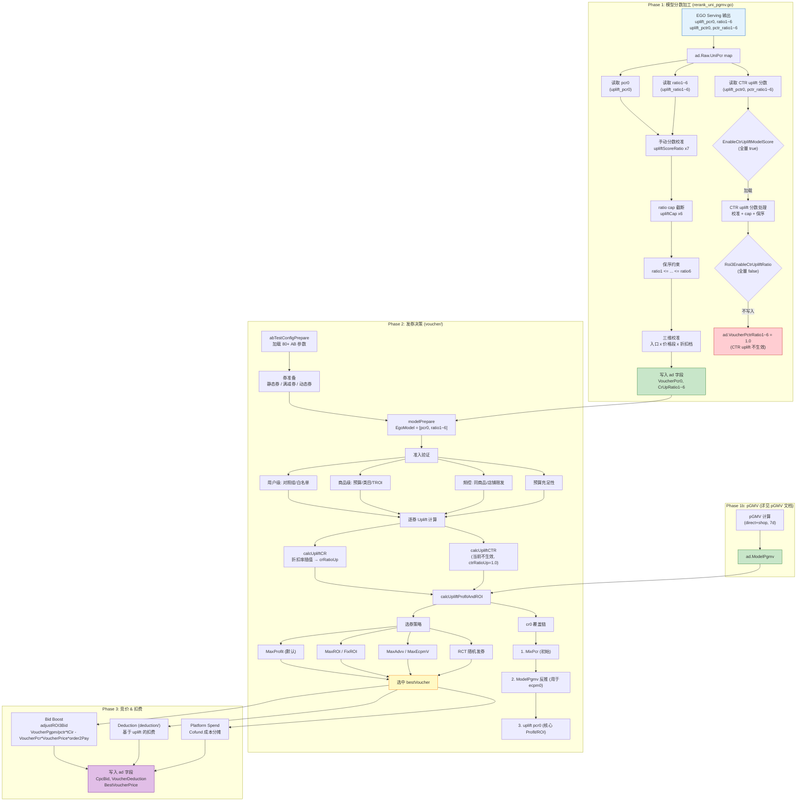
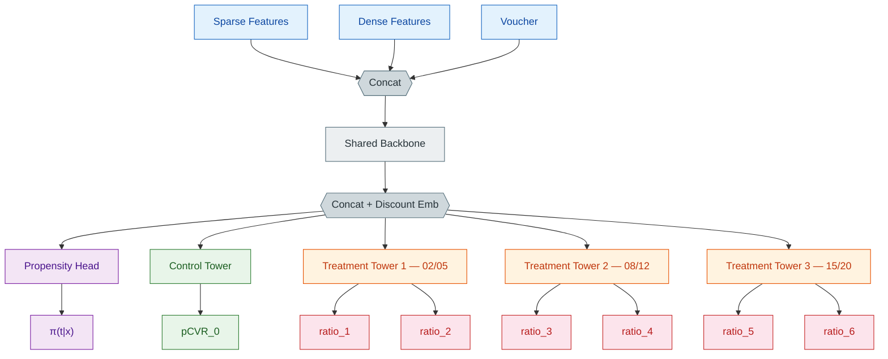

<!-- ads-workspace-gdoc-sync: gdoc_id=1dNHkpOMgYBT-mVrIgi8cTWdv8N9XmgDYYnTHyDxUSfE gdoc_url=https://docs.google.com/document/d/1dNHkpOMgYBT-mVrIgi8cTWdv8N9XmgDYYnTHyDxUSfE/edit -->


# Uplift ROI3 Unified Knowledge Base

## KB 必要信息索引

| 类别 | 当前索引 |
|---|---|
| 代码仓库 GitLab 路径 | `shopee/deep/paidads-alg`、`shopee/deep/paidads-bidding/online-bidding`、`shopee/deep/scoringX` |
| 核心服务 SDU 路径 | **【待确认】需由 owner 通过 Space / SMC 确认 Uplift 模型 serving、ScoringX、online-bidding 线上 SDU 路径** |
| ConfigCenter namespace | **【待确认】Uplift serving、ROI3 model score、voucher 开关与阈值相关 namespace 需补齐当前线上值** |
| Grafana dashboard | **【待确认】当前源 KB 未集中列出 Uplift 模型训练、serving、pCoC、AUUC dashboard** |
| 关键 Kafka topic | **【待确认】样本、score、posterior 或 voucher 回流如有 Kafka topic，需按当前生产配置补齐** |
| 核心 Hive 表名 | `mkplpaidads_search_ads.cr_uplift_model_rct_all_voucher_di`、`mkplpaidads_search_ads.dwd_uplift_click_conversion_hi`、`mkplpaidads_search_ads.dws_cr_uplift_pcoc_di`、`mp_paidads.ads_order_voucher_1d__reg_s0_live` |

> ROI3 是广告发券业务，uplift 模型服务于 ROI3 的选券、出价、扣费和业务评估链路。
> 这份文档把 `model-algo/knowledge` 下所有 `uplift*.md` 专题文档，与 `roi3/README.md` 直接关联的 ROI3 知识卡片合并成一个统一入口，便于后续检索、交接和扩写。
> 文内保留并重写了原文相对链接，确保从当前文件位置继续可跳转到原始专题、FAQ、SQL Playbook 和补充资料。

## 内容范围

- Uplift 专题：`uplift-kb.md`、`uplift-business.md`、`uplift-model.md`、`uplift-sample.md`、`uplift-feature.md`、`uplift-voucher-strategy.md`、`uplift-data-tables.md`
- ROI3 入口：`roi3/README.md`
- ROI3 README 直接引用的知识卡片：`roi3_knowledge_template.md`、`roi3_voucher_serving_faq.md`、`roi3_business_question_playbook.md`、`roi3_knowledge_template_agent_handoff.md`、`roi3_agent_playbook.md`、`roi3_definition_consistency_audit.md`

## 建议阅读顺序

1. 先看 `Uplift 总入口` 和 `ROI3 总览 / README`，建立业务边界。
2. 再看 `业务目标`、`模型与训练`、`样本链路`、`特征体系`、`发券策略`、`数据表`，补齐模型到策略的端到端链路。
3. 遇到线上问答、业务取证、Agent 交接问题时，再跳到 ROI3 FAQ、业务问题 playbook、Agent playbook 与 consistency audit。

---

## Part 1: `docs/team/04.product-algo/model-algo/knowledge/uplift-kb.md`

> Source: `docs/team/04.product-algo/model-algo/knowledge/uplift-kb.md`

## Uplift 知识库


> 本文将 Uplift 相关资料整合为一份入口文档，方便快速建立全局认知。
>
> 如需查看包含 ROI3 广告发券业务入口、FAQ、Playbook 与 Agent Handoff 的统一大知识库，请优先阅读 [uplift-roi3-kb.md](../../../team/04.product-algo/model-algo/knowledge/uplift-roi3-kb.md)。

> 详细资料仍保留在原始文档中：

> - [业务目标](../../../team/04.product-algo/model-algo/knowledge/uplift-business.md)

> - [样本链路](../../../team/04.product-algo/model-algo/knowledge/uplift-sample.md)

> - [特征明细](../../../team/04.product-algo/model-algo/knowledge/uplift-feature.md)

> - [模型与训练](../../../team/04.product-algo/model-algo/knowledge/uplift-model.md)

> - [策略实现](../../../team/04.product-algo/model-algo/knowledge/uplift-voucher-strategy.md)


---


### 1. Uplift 是什么


Uplift 模型服务于在线发券体系，核心目标不是预测“用户会不会下单”，而是预测“发券相比不发券，能额外带来多少转化与价值”。


系统需要实时回答三件事：


1. 这次请求要不要发券。

2. 发哪一档折扣更划算。

3. 发券后广告值多少钱，出价该怎么调。


从模型视角，Uplift 主要输出两类信息：


- `uplift_pcr0`：不发券时的 baseline 转化率

- `uplift_ratio1 ~ uplift_ratio6`：6 档折扣对应的转化率提升比


因此可以得到：


```text

pCVR_i = uplift_pcr0 × uplift_ratio_i

uplift_i = pCVR_i - uplift_pcr0

```


这里的 6 档折扣大致对应 `2% / 5% / 8% / 12% / 15% / 20%`。


---


### 2. 业务目标


发券业务的本质，是用平台或商家的补贴去换取更大的 GMV 和广告收入增长。


核心判断标准不是“发券后转化有没有提升”，而是“这张券带来的增量价值，能不能覆盖券成本”。业务上用 Guardrail 表达这件事：


```text

Guardrail = gmv_uplift / 4 + advv_uplift - cost_uplift

```


其中：


- `gmv_uplift / 4`：GMV 增量按 take rate 折算的平台收入

- `advv_uplift`：广告收入增量

- `cost_uplift`：券成本增量


当 `Guardrail > 0` 时，说明发券整体是赚钱的。


所以 Uplift 模型真正服务的是一条业务决策链：


```text

预测 uplift

-> 判断是否值得发券

-> 选择券面额

-> 影响 bid boost

-> 改变展示、点击、转化和券成本

-> 最终影响 Guardrail

```


#### 2.1 当前业务侧关键风险


现有资料里最重要的业务风险有几项：


- 训练口径和业务评估口径不完全一致：模型训练用 `1h direct order`，但业务更关注更长窗口、更多归因口径下的收益

- 85 折档位在线配置和训练桶中心存在偏移

- 用户画像特征偏弱，难以识别“券敏感用户”

- 某些 uplift 建模关系仍然被线性假设限制


详情见 [uplift-business.md](../../../team/04.product-algo/model-algo/knowledge/uplift-business.md)。


---


### 3. 样本链路


Uplift CR 样本链路复用了 UniCR CR 的主基础设施，主流程仍然是：


```text

流拼接

-> FP

-> TrainData

-> Label 回流

```


真正的差异主要集中在 Convertor 和评估样本筛选上。


#### 3.1 和 UniCR 共用的部分


以下链路与 UniCR CR 基本一致：


- Rank FeatureDump 与 UB 行为流拼接

- RawSample 落盘

- FP 场景与 CR TrainData 路径

- LabelJoin 回流机制


这意味着 Uplift 不是单独维护一套训练底座，而是在 UniCR 的 CR 样本体系上做“增量语义改造”。


#### 3.2 Uplift Convertor 的核心职责


Uplift 的关键差异在 `convertor_uplift_cr_1h_auuc.py`，它主要做几件事：


- 识别是否发券，生成 `is_treatment`

- 识别是否属于 RCT 样本，生成 `is_rct`

- 补齐 uplift portrait 默认值

- 生成 1h 窗口训练 label

- 重组 multitask 字段，供 uplift 训练和 AUUC 评估使用


#### 3.3 Treatment / Control


Uplift 的样本不是简单“有点击/没点击”，而是要区分：


- `Treatment`：发了券

- `Control`：没发券


同时还要区分：


- `RCT`：随机分组样本，可视为无偏

- `非 RCT`：由策略决定是否发券，存在选择偏差


这也是模型要使用 IPW / propensity 的原因。


#### 3.4 训练 Label


Uplift 的训练核心 label 是 `direct_order_1h`，也就是点击后 1 小时内是否下单。


选 1h 的原因非常直接：


- 广告券有效期本身就是 1 小时

- 1h 窗口下 treatment 效应最直接

- 回流完整性更好，噪声更小


#### 3.5 折扣档位


Treatment 样本会按 `discount_ratio` 离散为 6 档，分别对应不同面额区间，再映射到模型输出头。


因此，Uplift 的样本定义本质上是“点击级因果学习样本”，而不是普通的 CR 正负样本。


详情见 [uplift-sample.md](../../../team/04.product-algo/model-algo/knowledge/uplift-sample.md)。


---


### 4. 特征核心逻辑


这里只保留 Uplift 特征体系的核心逻辑，详细 slot、覆盖率、画像表结构和链路细节仍放在 [uplift-feature.md](../../../team/04.product-algo/model-algo/knowledge/uplift-feature.md)。


#### 4.1 当前特征分层


Uplift 当前的特征可以分成三层来看：


1. base 在用 sparse 特征

2. base 在用 dense / treatment 特征

3. 已完成工程但尚未并入 base 的 user portrait 特征


#### 4.2 Base 在用特征


base 版本在用特征大致覆盖这些信息：


- 用户长期/短期价格行为

- 用户与当前商品的交互命中关系

- 用户对品类和店铺的长期偏好

- 商品类目、转化率、新鲜度、价格波动等属性

- 店铺 ID、店铺转化相关信号

- 少量用户画像与入口上下文


这套特征的明显特点是：


- item 侧特征占比较高

- 纯用户画像特征偏少

- 对“用户历史券反应”的刻画很弱


#### 4.3 Dense / Treatment 特征


base 中还有一组直接参与 uplift 建模的 dense / treatment 特征：


- baseline pCR

- item_price

- platform_discount / shop_discount

- platform_voucher_id / shop_voucher_id

- 训练时可见的 `voucher_price`


这里最关键的是：模型不只是看“用户和商品是谁”，还显式感知“券长什么样、折扣多大”。


#### 4.4 待接入的用户画像特征


Uplift 特征体系里最重要的增量，是一批已经完成工程建设、但尚未并入 base 的用户券行为画像特征。


这批画像主要分两组：


- `1.x` 核销行为特征：用户过去有没有用过券、用过多少、偏好什么面额/折扣/券类型

- `2.x` 券敏感度特征：用户在“有券 vs 无券”场景下的历史转化表现差异


这些特征的价值在于，它们第一次把“用户对券的响应习惯”显式引入模型，而不是只靠通用行为特征间接猜测。


#### 4.5 特征处理策略


画像特征的处理并不是简单拼接，而是按语义分组：


- 比率类特征做裁剪和归一化

- 长尾计数特征做 `log1p`

- 金额特征做 log 归一化

- 可正可负的敏感度特征做有符号裁剪

- 低基数离散特征直接走 embedding


同时，工程侧已经针对几类数据质量问题做了保护：


- 异常折扣率

- 异常金额占比

- 小样本放大的 sensitivity

- 跨 region 金额量纲差异


#### 4.6 当前特征侧核心缺口


从现有文档看，Uplift 特征侧的核心问题主要是：


- base 用户画像太弱

- 券相关强语义特征虽然已经产出，但还没真正进 base

- 一些特征覆盖率天然偏低，需要接受“无历史 = 默认值”的建模现实


因此，这份汇总文档只保留主干逻辑，不再复制全量 slot 与画像字段表。


详情见 [uplift-feature.md](../../../team/04.product-algo/model-algo/knowledge/uplift-feature.md)。


---


### 5. 模型核心逻辑


#### 5.1 模型定位


Uplift base 模型是一个基于因果推断框架的增量转化模型，核心架构是 `DragonNet + IPW + TMLE`。


它不直接预测“最终是否转化”，而是分别学习：


- 不发券时的 baseline 转化率

- 发不同折扣券时的增量变化

- 样本被分到各 treatment / control 组的概率


#### 5.2 结构主线


可以把模型简化理解为：


```text

特征输入

-> shared backbone

-> propensity head

-> control tower

-> treatment tower × 3

-> 输出 pcr0 和 6 档 uplift ratio

```


其中：


- `control tower` 输出 `pCVR_0`

- `treatment tower` 输出不同折扣档位的 uplift ratio

- `propensity head` 输出 `pi(t|x)`，用于 IPW 纠偏


#### 5.3 为什么是 DragonNet


这是因为 uplift 学习面对的不是标准监督学习问题，而是观测数据下的因果估计问题：


- 谁会被发券，不是随机的

- 策略样本里存在明显选择偏差

- 如果直接拿发券样本和不发券样本做监督，容易学到错误结论


所以当前模型通过：


- `Propensity Head` 估计 treatment 分配概率

- `IPW` 纠正选择偏差

- `TMLE` 做进一步的半参数纠偏


#### 5.3.1 与其他方案的比较

| 方案 | 不适用原因 |
|------|-----------|
| **VCNet（Varying Coefficient Network）** | 实验验证：VCNet 所有折扣共享单一 Tower，导致高折扣档位（15%/20%）系统性低估 uplift；叠加不含 propensity 修正机制，无法处理策略分配带来的选择偏差 |
| **TARNet（历史版本，2026-01）** | Control/Treatment 分塔，无 propensity head，无法处理非 RCT 策略样本的选择偏差；引入非 RCT 样本训练时偏差无法控制，故升级为 DragonNet |
| **DragonNet + IPW + TMLE（当前，2026-03 起）** | 在 TARNet 基础上增加 propensity head + IPW（一阶纠偏）+ Targeted Regularization（二阶纠偏），具备双重鲁棒性；同时将二分类 Treatment（发/不发券）升级为多分类（6档折扣），直接建模不同面额的增量效果 |

#### 5.4 输出语义


模型线上最关键的输出是：


- `uplift_pcr0`

- `uplift_ratio1 ~ uplift_ratio6`


业务侧拿到这些值后，可以还原：


```text

pCVR_i = uplift_pcr0 × uplift_ratio_i

uplift_i = pCVR_i - uplift_pcr0

```


再把它们送入 Profit、ROI、eCPMV 等后续计算。


#### 5.5 当前模型侧已知限制


现有 base 版本的几个重要限制是：


- treatment tower 中的 uplift-discount 关系仍是线性形式

- 高折扣区间没有覆盖

- 对 item price 和折扣交互的刻画还不够强

- 折扣档位之间的有序性只做了局部约束


详情见 [uplift-model.md](../../../team/04.product-algo/model-algo/knowledge/uplift-model.md)。


---


### 6. 策略核心逻辑


Uplift 模型本身只负责“预测发券的增量效应”，真正把它变成业务动作的是策略链路。


#### 6.1 从分数到发券


策略侧大致流程是：


```text

加载 AB 参数

-> 准备候选券

-> 读取模型分数

-> 做用户/商品/预算/频控校验

-> 逐券计算 uplift profit / ROI

-> 选择最优券

-> 计算 bid boost / deduction / 平台分摊

```


#### 6.2 发券决策关注什么


策略实际在比较的，不是“哪个 ratio 最大”，而是：


- 发券后利润是否为正

- ROI 是否达标

- eCPMV 是否变高

- 券成本能否被商家和平台共同承担


这也是为什么 Uplift 必须和 pGMV、order2pay、预算约束、平台 spend 一起看，而不是单独看一个 uplift ratio。


#### 6.3 出价与扣费


发券以后，广告预期价值变了，所以 bid 也会跟着变化；扣费和 cofund 逻辑也会基于 uplift 重新计算。


换句话说，Uplift 不是一个“只影响标签分析”的模型，而是直接介入在线竞价和成本分摊。


#### 6.4 RCT 的角色


RCT 在这套体系里非常关键：


- 它提供相对无偏的训练与评估样本

- 它帮助离线 AUUC / uplift pCoC 评估成立

- 它也能帮助业务判断策略和模型是否真的赚钱


详情见 [uplift-voucher-strategy.md](../../../team/04.product-algo/model-algo/knowledge/uplift-voucher-strategy.md)。


---


### 7. 评估视角


Uplift 评估不能只看一个模型 AUC，因为它最终服务的是“增量价值”。


#### 7.1 离线评估


当前离线主要看：


- `pcr0` 的 AUC / pCoC

- 各档位 uplift 的 AUUC

- 各档位 uplift 的 pCoC


这些指标主要回答：


- baseline CR 预估准不准

- uplift 排序能力好不好

- uplift 校准是否可信


#### 7.2 在线评估


在线最终还是回到 Guardrail、GMV、ADVV、券成本等业务指标。


也正因为如此，现有资料特别强调了一个问题：


- 模型训练和业务评估口径不完全一致，可能导致线上 Profit 被系统性高估


这是当前理解 Uplift 体系时最需要记住的风险点之一。


详情见 [uplift-business.md](../../../team/04.product-algo/model-algo/knowledge/uplift-business.md) 和 [uplift-model.md](../../../team/04.product-algo/model-algo/knowledge/uplift-model.md)。


---


### 8. 一张图看懂 Uplift


```text

业务目标：

在 Guardrail 为正的前提下，用券换更多 GMV 和广告收入


样本：

复用 UniCR CR 底座，在 Convertor 中补充 treatment / RCT / 1h label 语义


特征：

base 行为与商品特征 + treatment 特征 + 待接入的用户券画像特征


模型：

DragonNet + IPW + TMLE


输出：

baseline pcr0 + 6 档 uplift ratio


策略：

把 uplift 分数转成 Profit / ROI / bid boost / deduction / cofund 决策


关键难点：

样本有选择偏差，训练口径与业务口径并不完全一致

```


---


### 9. 建议阅读顺序


如果是第一次接触 Uplift，建议按下面顺序阅读：


1. 先读本文，建立整体框架。

2. 再读 [uplift-business.md](../../../team/04.product-algo/model-algo/knowledge/uplift-business.md)，理解发券业务目标和 Guardrail。

3. 然后读 [uplift-model.md](../../../team/04.product-algo/model-algo/knowledge/uplift-model.md)，理解 DragonNet、IPW、TMLE 和输出语义。

4. 再读 [uplift-sample.md](../../../team/04.product-algo/model-algo/knowledge/uplift-sample.md)，理解 treatment / control、RCT、1h label。

5. 最后按需查看 [uplift-feature.md](../../../team/04.product-algo/model-algo/knowledge/uplift-feature.md) 和 [uplift-voucher-strategy.md](../../../team/04.product-algo/model-algo/knowledge/uplift-voucher-strategy.md) 的细节。

---

## Part 2: `docs/team/04.product-algo/model-algo/knowledge/uplift-business.md`

> Source: `docs/team/04.product-algo/model-algo/knowledge/uplift-business.md`

## Uplift Model 业务总结 — 在线发券体系

> 基于 `uplift-model.md`（模型技术文档）和 `online-bidding` 在线代码，从业务视角梳理 uplift 发券体系的设计思路、决策链路与关键开关。
> 代码路径：`online-bidding/internal/rule/productads/rerank/` 下的 `model/` 和 `voucher/` 目录。竞价与扣费详见 [uplift-voucher-strategy.md](../../../team/04.product-algo/model-algo/knowledge/uplift-voucher-strategy.md)。
> 信息截止：2026-04-15

### 目录

- [1. 业务全景与建模现状](#1-业务全景与建模现状)
  - [1.1 业务目标](#11-业务目标) / [1.2 关键决策](#12-关键决策) / [1.3 利益链](#13-利益链)
  - [1.4 当前建模方案](#14-当前建模方案) / [1.5 核心问题与风险](#15-核心问题与风险)
  - [1.6 优化方向](#16-优化方向) / [1.7 业务侧代码观察](#17-业务侧代码观察)
- [2. 端到端 DAG](#2-端到端-dag)
- [3. 模型分数加工（rerank_uni_pgmv.go）](#3-模型分数加工rerank_uni_pgmvgo)
- [4. CVR Uplift 计算（核心）](#4-cvr-uplift-计算核心)
- [5. 策略逻辑](#5-策略逻辑发券决策竞价扣费cofund开关) → [uplift-voucher-strategy.md](../../../team/04.product-algo/model-algo/knowledge/uplift-voucher-strategy.md)
- [6. 评估体系与业务指标](#6-评估体系与业务指标)
- [7. 附录：RCT 实证分析](#7-附录rct-实证分析)

---

### 1. 业务全景与建模现状

#### 1.1 业务目标

广告发券的本质是用平台/商家的补贴换取 GMV 和广告收入的增长。**核心问题不是"发券能不能带来转化"，而是"这张券带来的增量价值能否覆盖成本"。**

用 Guardrail 公式表达：

```
Guardrail = gmv_uplift / 4 + advv_uplift - cost_uplift > 0
```

- `gmv_uplift / 4`：GMV 增量折算为平台收入（take rate ~25%）
- `advv_uplift`：广告收入增量（发券广告出价提高带来的额外广告消耗）
- `cost_uplift`：券成本增量

Guardrail > 0 意味着发券整体是赚钱的。**业务目标是在 Guardrail > 0 的约束下，最大化 GMV 增长和发券量增长。**

#### 1.2 关键决策

系统需要在每次广告请求中实时回答三个问题：

| 决策 | 具体问题 | 依赖的模型能力 |
|------|---------|--------------|
| **是否发券** | 这个用户 × 商品 × 场景下，发券的增量收益能否覆盖券成本？ | 准确预测 baseline CR（不发券转化率）和 uplift（发券的增量效应） |
| **发多少面额** | 在候选面额中，哪个面额的 Profit/ROI 最优？ | 准确预测不同折扣档位的 CVR uplift ratio |
| **如何调价** | 发券后广告的预期价值变了，出价应该提高多少？ | uplift 预估驱动 Bid Boost，影响广告竞争力和展示量 |

#### 1.3 利益链

```
模型预测 uplift → 发券决策 → Bid Boost 提高出价
                                  ↓
                         广告获得更多展示
                                  ↓
              用户获得优惠 ← 券面额 → 广告主获得更多订单
                                  ↓
                    平台收获: GMV 增长 + 广告收入增长 - 券成本
```

三方利益通过 uplift 模型连接：
- **模型预测准** → 该发的券发了（不浪费），不该发的没发 → Guardrail 正向，GMV 和发券量同步增长
- **模型预测偏高** → 过度发券 → 券成本 > 增量收益 → Guardrail 为负，发券量虚高但不可持续
- **模型预测偏低** → 错过有效发券机会 → GMV 和发券量增长不充分，业务目标达不到

#### 1.4 当前建模方案

**模型架构**：DragonNet（因果推断） + IPW + TMLE，Control/Treatment 分塔，输出 pcr0 + 6 档 CVR uplift ratio。

**合理之处**：

1. **券有效期与训练 label 对齐**：广告券有效期 1h，训练 label `direct_order_1h` 也是 1h 窗口，建模目标清晰
2. **因果推断框架**：DragonNet + IPW + TMLE 处理了观测数据的选择偏差
3. **在线保序约束**：强制 ratio1 ≤ ... ≤ ratio6，弥补模型偶尔违反单调性的问题
4. **多层校准体系**：入口 × 价格段 × 折扣档三维校准，补偿分维度偏差

#### 1.5 核心问题与风险

| # | 问题 | 严重度 | 分析 |
|---|------|--------|------|
| 1 | **训练-评估口径不一致** | HIGH | 模型训练用 1h direct order，Guardrail 用 7d 全场景 GMV（含 shop 归因、nonads 溢出）。RCT 实证（§7 附录）显示 1h direct uplift ratio 比 7d broad 高 10%~15%，导致线上 Profit 计算系统性高估，发券偏积极 |
| 2 | **85 折档位偏移** | MEDIUM | 在线 discountArray 中 85 折用 0.16（84 折），训练侧中心约 0.155，15% 附近的券存在系统性低估 |
| 3 | **用户画像特征稀缺** | MEDIUM | 仅 8 个 user sparse 特征，无法区分券敏感/非券敏感用户 |
| 4 | **Treatment Tower 线性假设** | MEDIUM | `LDR = k*d + b` 只能表达线性 uplift-discount 关系，无法捕捉折扣阈值效应 |

#### 1.6 优化方向

##### 短期（低成本，高确定性）

1. **修正 85 折档位**：discountArray 中 0.16 → 0.15（或 0.155），与训练侧桶中心对齐
2. **折扣档位配置化**：硬编码 discountArray 提取为 AB 参数，方便与模型侧同步
3. **清理 CTR uplift 死代码**：`Roi3EnableCtrUpliftRatio` 全量 false，但 `EnableCtrUpliftModelScore` 仍在加载处理

##### 中期（需要实验验证）

4. **训练 label 扩展到 shop 归因**：尝试 `direct_order_1h + shop_order_1h` 作为 label。RCT 数据显示 shop uplift 有微弱正效应（1.03~1.14），有优化空间但噪声风险
5. **分维度 uplift pCoC 监控**：建立入口 × 价格段 × 折扣档的在线 uplift pCoC 看板
6. **CTR uplift 上线评估**：设计 AB 实验开启 `Roi3EnableCtrUpliftRatio`

##### 长期（架构性改进）

7. **用户画像增强**：引入购买频次、价格敏感度、券使用历史等特征
8. **非线性 Treatment Tower**：LDR 从线性扩展为 MLP，捕捉折扣阈值效应
9. **归因窗口实验**：尝试 3h/6h 训练 label，平衡信号和噪声

##### 下一重点方向（规划中）

10. **预估值与业务目标对齐**：分别建模三个核心业务量：
    - `platform_gmv_uplift`：发券带来的平台增量 GMV
    - `advv_uplift`：发券带来的增量广告价值（advertiser value）
    - `redeem voucher_cost`：预期核销券成本

    当前 uplift 模型只预估 CVR 增量（`uplift_ratio`），业务指标（GMV、ADVV、cost）通过后处理公式组合计算，存在模型目标与 Guardrail 业务目标的系统性 gap。直接对三个业务量建模可减少该 gap，使发券决策更直接对齐 `gmv_uplift / 4 + advv_uplift - cost_uplift > 0` 的 Guardrail 约束。

#### 1.7 业务侧代码观察

| 观察 | 分析 |
|------|------|
| 校准系数层数多（4 层 + 发券侧 1 层） | 叠加效果难以追踪，建议建立端到端校准监控 |
| 硬编码折扣档位散布多处 | 与训练侧桶边界需保持对齐，当前 85 折已偏移 |
| cpcBid 取法有分支 | `EnableRoi3ForAllPricingType` 下 CPC 广告用 biddingPrice 而非 itemPrice |
| 动态券 voucherPrice 重算 | engine 与 bidding 侧 itemPrice 可能不一致 |
| CTR uplift 已加载但未使用 | 占用计算资源但不产生价值 |

---

### 2. 端到端 DAG



---

### 3. 模型分数加工（rerank_uni_pgmv.go）

#### 3.1 CVR Uplift 分数

从 `ad.Raw.UniPcr` 读取 uplift 模型输出，经四层加工后写入 ad 字段：

| 加工步骤 | 说明 |
|---------|------|
| **pcr0 读取** | 当前全量使用 `uplift_pcr0`（DragonNet Control Tower 输出） |
| **ratio 读取** | 当前全量使用 `uplift_ratio1`~`uplift_ratio6`（独立 uplift 模型输出） |
| **手动分数校准** | `UpiftmodelScoreRatioTarget`（7 维），pcr0 系数 clamp [0.4, 2.5] |
| **ratio cap** | `UpiftmodelRatioCapTarget`（6 维），防止异常大 ratio |
| **保序** | 强制 `ratio1 <= ratio2 <= ... <= ratio6`，保证折扣越深增量越大 |
| **三维校准** | 入口 x 价格段 x 折扣档，公式 `cali_ratio = coef * (ratio - 1) + 1`，校准后保底 >= 1.0 |

最终写入 `ad.VoucherPcr0`, `ad.VoucherCrUpRatio1~6`。

#### 3.2 CTR Uplift 分数（当前不生效）

CTR uplift 涉及两层开关：

| 开关 | 当前状态 | 作用 |
|------|---------|------|
| `EnableCtrUpliftModelScore` | **全量 true** | 从 UniPcr 加载 CTR uplift 模型分数并处理（校准 + cap + 保序） |
| `Roi3EnableCtrUpliftRatio` | **全量 false** | 将处理后的分数写入 ad 字段供下游使用 |

**结果**：模型分数已加载并处理，但因第二层开关关闭，**不写入 ad 字段**。下游 `ad.VoucherPctrRatio1~6` 全部为 1.0，CTR uplift 不参与发券计算。

**影响**：当前发券决策完全依赖 CVR uplift。若未来开启 `Roi3EnableCtrUpliftRatio`，CTR uplift 将影响 Profit/ROI 计算、Bid Boost 和 Deduction。

#### 3.3 pGMV 与发券的关系

> pGMV 的计算逻辑详见独立的 pGMV 文档，此处仅说明其在发券体系中的角色。

`ad.ModelPgmv` 在发券计算中用于 **不发券 fallback 路径**的 ecpm0 计算（`EnableUniPcr` 全量 true）：

```
cr0_pgmv = ModelPgmv / itemPrice / avgSoldCnt
ecpm0 = itemPrice * targetCir * cr0_pgmv * ctr0
```

**注意：在发券路径（`voucherPrice > 0`）下，ecpm0 会被 uplift_pcr0 重新计算覆盖。** pGMV 反推的 cr0 仅在不发券的 fallback 路径中作为 ecpm0 的基线。核心的发券决策（ecpm0、Profit/ROI、ecpmV）统一使用 uplift 模型输出的 pcr0，详见下节。

---

### 4. CVR Uplift 计算（核心）

#### 4.1 cr0 的覆盖逻辑

发券计算中 cr0 经历多次赋值，**最终在发券场景（`voucherPrice > 0`）下，ecpm0 和 Profit/ROI 使用的是同一个 uplift_pcr0 派生的 cr0**：

| 阶段 | cr0 来源 | 用途 | 是否被覆盖 |
|------|---------|------|-----------|
| 初始值 | `ad.MixPcr` | — | 被覆盖 |
| `EnableUniPcr` | `ModelPgmv / itemPrice / avgSoldCnt` | 第一次 ecpm0 计算（仅在不发券时生效） | 发券时被覆盖 |
| **发券时** | `model.modelRes[0] * crRatioUpPlatform`（= uplift_pcr0） | **ecpm0 重算 + Profit/ROI 核心计算** | 最终生效值 |

**结论**：在发券场景下，ecpm0 也基于 uplift_pcr0 计算，不存在"ecpm0 用 pGMV、Profit 用 uplift_pcr0"的两套口径问题。pGMV 反推值仅在**不发券的 fallback 路径**中作为 ecpm0 的 cr0。

#### 4.2 uplift_pcr0 的完整生效路径

```
UniPcr["uplift_pcr0"]
  ↓ rerank_uni_pgmv.go
  手动分数校准 (upliftScoreRatio[0], clamp [0.4, 2.5])
  ↓
  ad.VoucherPcr0
  ↓ voucher_prepare.go:modelPrepare
  EgoModel.modelRes[0] = ad.VoucherPcr0
  ↓ voucher_algorithm.go:calcUpliftProfitAndROI
  cr0 = modelRes[0] * crRatioUpPlatform    -- 即 uplift_pcr0 * 平台券系数
  crV = cr0 * crRatioUp                    -- 发券后 CVR
  ecpm0 = itemPrice * targetCir * cr0 * ctr0  -- ecpm0 也用 uplift_pcr0 重算
  ↓
  所有核心决策指标（均基于 uplift_pcr0）：
  • ecpm0        = itemPrice * targetCir * cr0 * ctr0
  • upliftAdvvImp = ctrV * crRatioUp * cpcBid - ctr0 * cpcBid
  • upliftGmvImp  = (ctrV*crV - ctr0*cr0) * itemPrice * avgSoldCnt
  • voucherSpend  = voucherPrice * ctrV * crV * order2Pay * coef
  • ecpmV         = ecpm0 + platformValue - voucherSpend
  • voucherProfit = ...
  • voucherROI    = voucherProfit / voucherSpend
  ↓
  选券决策 (MaxProfit / MaxROI / MaxEcpmV / ...)
  ↓
  Bid Boost & Deduction
```

#### 4.3 cr0 覆盖链详解

`calcUpliftProfitAndROI` 中 cr0 经历多次赋值：

```
1. cr0 = ad.MixPcr                              -- 初始值
2. voucherSpend 第一次计算                         -- 用 MixPcr (后续会被重算)
3. cr0 = ModelPgmv / itemPrice / avgSoldCnt      -- EnableUniPcr 覆盖
4. ecpm0 = price * tCir * cr0 * ctr0             -- 用 pGMV 反推 cr0 (不发券时的 ecpm0)

-- 以下仅在 voucherPrice > 0 时执行 --
5. cr0 = model.modelRes[0] * crRatioUpPlatform   -- uplift_pcr0 覆盖
6. crV = cr0 * crRatioUp                         -- 发券后 CVR
7. ecpm0 = price * tCir * cr0 * ctr0             -- ecpm0 用 uplift_pcr0 重算 ← 覆盖步骤 4
8. voucherSpend 重新计算                           -- 用 uplift_pcr0 派生的 ctrV, crV
9. ecpmV = ecpm0 + platformValue - voucherSpend
10. voucherProfit 计算
```

**结论**：在发券路径下（`voucherPrice > 0`），步骤 4 计算的 ecpm0 在步骤 7 被 uplift_pcr0 派生的值覆盖。**ecpm0、Profit/ROI、voucherSpend、ecpmV、选券决策、Bid Boost、Deduction 全部统一基于 uplift_pcr0。** pGMV 反推值仅在不发券的 fallback 路径中保留。

#### 4.4 业务意义

在发券路径下，ecpm0 和 Profit/ROI **统一使用 uplift_pcr0**，不存在两套 cr0 口径混用的问题。这意味着：

- **发券场景的所有决策指标（ecpm0、ecpmV、Profit、ROI）完全一致**，都基于 DragonNet Control Tower 输出的 1h direct 口径 pcr0
- **pGMV 反推值仅在不发券的 fallback 路径中作为 ecpm0 的 cr0**，此时广告不涉及 Profit/ROI 计算，不存在口径不一致问题

uplift_pcr0 作为统一 cr0 的合理性：DragonNet Control Tower 专门训练"不发券转化率"，是因果推断框架的核心输出，用于计算增量效应（Profit = 发券价值 - 不发券基线）。

#### 4.5 插值计算

模型输出 6 档固定折扣率对应的 CVR 提升比（ratio），通过线性插值得到任意折扣率的 uplift：

```
discountArray = [0.02, 0.05, 0.08, 0.12, 0.16, 0.20]
discount = voucherPrice / itemPrice
crRatioUp = Interpolate(discount, discountArray, [ratio1, ..., ratio6])
```

`crRatioUp = 1.2` 表示发这张券后，CVR 预计提升 20%。

**折扣档位对齐问题**：在线 `discountArray` 中 85 折位置用的是 **0.16（84 折）**，而训练侧 85 折档位定义为 `[0.135, 0.175)`（中心点约 0.155）。这意味着：
- 对于真实折扣 15% 的券，插值时会将其定位在 12%~16% 之间，而非命中 85 折档位中心
- 模型输出的 `ratio_5`（对应训练的 85 折桶）在在线插值中被当作 84 折的锚点

| 档位 | 训练侧范围 | 训练侧中心 | 在线 discountArray | 偏差 |
|------|-----------|-----------|-------------------|------|
| 02 | (0, 0.04) | 0.02 | 0.02 | 0 |
| 05 | [0.04, 0.065) | 0.05 | 0.05 | 0 |
| 08 | [0.065, 0.1) | 0.08 | 0.08 | 0 |
| 12 | [0.1, 0.135) | 0.12 | 0.12 | 0 |
| **15** | **[0.135, 0.175)** | **~0.155** | **0.16** | **+0.005** |
| 20 | [0.175, 0.23) | 0.20 | 0.20 | 0 |

#### 4.6 平台券（Cofund）场景

当同时存在平台券和 seller 券时，计算 seller 券的**增量贡献**：

```
xRaw  = platformVoucherPrice / itemPrice           -- 已有平台券的折扣
xCali = (sellerVoucher + platformVoucher) / itemPrice -- 叠加后的总折扣

crRatioUp = Interpolate(xCali) / Interpolate(xRaw)
```

**业务含义**：seller 券只需为"在平台券基础上的额外增量"买单，避免为平台券效果重复付费。

在 Profit 计算中，`cr0 = uplift_pcr0 * crRatioUpPlatform`，其中 `crRatioUpPlatform = Interpolate(xRaw)`，代表平台券已经带来的 CVR 提升。

#### 4.7 手动校准

发券侧还有一层校准（`voucher_algorithm.go:82`）：

```
crRatioUp = (crRatioUp - 1) * upliftCalibPcrRatio + 1
```

当 `upliftCalibPcrRatio = 0.8` 时，原本 1.2 的 ratio 变为 1.16。相当于对 uplift 增量部分打折——保守策略，宁可少发券也不要亏钱。

---

### 5. 策略逻辑（发券决策、竞价、扣费、Cofund、开关）

> 详见 [uplift-voucher-strategy.md](../../../team/04.product-algo/model-algo/knowledge/uplift-voucher-strategy.md)，包含：
> - §1 发券决策流程与准入门槛、ROI/Profit 计算公式、选券策略（MaxProfit/MaxROI/...）、RCT 随机发券
> - §2 出价与扣费：关键文件、adjustROI3Bid 公式、出价更新逻辑、准入条件、扣费机制
> - §3 Cofund 成本分摊
> - §4 关键 AB 开关汇总

---

### 6. 评估体系与业务指标

#### 6.1 在线评估（AB Test）

工具链：`datastudio/abtest_uplift_report/scripts/run_full_report.py`

**核心指标**：

| 指标 | 来源 Tab | 说明 | 口径 |
|------|---------|------|------|
| `platform_gmv` | Platformwide - Period | 全平台 GMV | **全场景（含 nonads、game、video 等）所有 item 汇总**，7 天归因窗口，含 item 归因 + shop 归因 |
| `platform_gmv_995_v2` | Platformwide - Period | 去极值 GMV | 同上，去掉 top 0.5% 极端值 |
| `ads_revenue_usd` | Ads Type - Period | 广告收入 | — |
| `broad_gmv_usd` | Ads Type - Period | 广告宽口径 GMV | — |
| `advv_cost_7d` | Ads Type - Period | 广告主成本 | — |
| `ads_voucher_cost` | ROI3 Voucher | 广告券成本 | — |

**Guardrail 公式**：

```
gmv_uplift  = gmv_exp  - gmv_base
advv_uplift = advv_exp - advv_base
cost_uplift = ads_voucher_cost_exp - ads_voucher_cost_base

Guardrail        = gmv_uplift / 4 + advv_uplift - cost_uplift
Guardrail_995_v2 = gmv_995_v2_uplift / 4 + advv_uplift - cost_uplift
```

**为什么 GMV 除以 4**：平台对 GMV 的变现率约为 25%（广告 take rate + 佣金等），1 元 GMV 约等于 0.25 元直接收入。

**Guardrail > 0** 意味着实验组的发券策略整体是赚钱的。

#### 6.2 训练-评估口径差异（关键）

模型训练和在线评估使用了不同的转化口径，存在系统性差异：

| 维度 | 模型训练 | 在线评估（Guardrail） | 差异影响 |
|------|---------|---------------------|---------|
| **归因窗口** | 1 小时（`direct_order_1h`） | 7 天 | 训练只捕捉即时转化，评估包含延迟转化 |
| **归因类型** | 仅 direct（点击商品本身） | item 归因 + shop 归因 | 训练不含跨商品转化，评估包含店铺内其他商品的订单 |
| **场景范围** | 广告场景 | **全场景**（含 nonads、game、video 等所有 item） | 评估包含非广告场景的溢出效应 |
| **券有效期** | — | — | 广告券有效期仅 1 小时，与训练 label 的 1h 窗口对齐 |

**业务含义**：

- **券有效期 = 1h，训练 label = 1h** → 模型直接建模的是"券在有效期内带来的增量转化"，这是合理的
- **评估用 7 天全场景 GMV** → Guardrail 衡量的不仅是券的直接效果，还包括：
  - 用户因广告券进入店铺后，7 天内在该店铺的所有消费（shop 归因）
  - 发券对非广告场景的间接拉动（全场景 GMV）
- 这意味着 **Guardrail 捕捉的是发券的"全局溢出效应"，而模型只预测"即时直接效应"**。两者之间的 gap 越大，说明发券的间接价值越高，但模型无法直接优化这部分

#### 6.3 离线评估

| 指标 | 说明 |
|------|------|
| pcr0 AUC | 无券转化率预测能力 |
| pcr0 pCoC | 无券转化率校准度（预估/实际）|
| 各档位 AUUC | 各折扣档的 uplift 排序能力 |
| 各档位 uplift pCoC | uplift 的校准度 |

##### pCoC 监控

> 来源：`hive/dws_cr_uplift_pcoc_di.sql`

按 voucher_bucket × voucher_source (rct/strategy) 聚合：

| 指标 | 计算 | 说明 |
|------|------|------|
| CR_X | order_cnt_X / click_cnt_X | 实际转化率 |
| pCoC_X | sum_pcr_X / order_cnt_X | 预估/实际（校准度） |
| uplift_CR_X | CR_X - CR_0 | 实际增量转化率 |
| uplift_pCoC_X | (avg_pcr_X - avg_pcr_0) / (CR_X - CR_0) | uplift 维度的校准度 |
| redeem_rate_X | order_cnt_redeemed_X / order_cnt_X | 核销率 |

#### 6.4 当前评估缺口

1. 在线缺少按入口/品类/用户分群的 uplift 效果拆解
2. 策略发券的反事实验证依赖 RCT 子集，样本量有限
3. CTR uplift 开关未开，线上效果缺乏独立评估
4. 训练 label（1h direct）与评估指标（7d 全场景 GMV）之间的 gap 缺乏量化监控

---

### 7. 附录：RCT 实证分析

#### 7.1 1h vs 7d Uplift Ratio 对比

基于 RCT 样本（`voucher_unpicked_reason` IN (17, 18, 99)），对比 treatment（发券）vs control（未发券）在不同折扣档位的后验 uplift ratio。

**数据源**：`mkplpaidads_offline.cr_train_data`，ID 区域，2026-04-05（7d GMV 已完全回流）。
**SQL**：`uplift_feature/hive/rct_uplift_gap_analysis_sg.sql`（将 region 改为 ID）

> 02% 档样本量仅 716 条，统计不可靠，不纳入分析。

| 折扣档 | 样本数 | direct_order_1h uplift | shop_order_1h uplift | broad_gmv_1h uplift | broad_gmv_7d uplift |
|--------|--------|----------------------|---------------------|--------------------|--------------------|
| 05% | 712,136 | **1.14** | 1.03 | 1.18 | **1.16** |
| 08% | 725,574 | **1.22** | 1.07 | 1.28 | **1.23** |
| 12% | 440,532 | **1.36** | 1.12 | 1.49 | **1.35** |
| 15% | 223,817 | **1.49** | 1.13 | 1.59 | **1.39** |
| 20% | 233,176 | **1.71** | 1.14 | 1.81 | **1.57** |
| control | 14,983,332 | baseline | baseline | baseline | baseline |

**关键发现**：

1. **direct_order_1h uplift 严格保序**：折扣越大 uplift 越高（1.14 → 1.71），与模型的单调性假设一致
2. **shop_order_1h uplift 微弱正效应**（1.03~1.14）：券对店铺转化有一定拉动，但远弱于 direct
3. **7d broad_gmv uplift 系统性低于 1h direct_order uplift**：折扣越大差距越明显（20%: 1.71 vs 1.57）。control 组在 7d 窗口内的自然 GMV 回流更充分，稀释了 treatment 的相对优势
4. **7d uplift 同样严格保序**（1.16 → 1.57），说明样本量足够时 7d GMV 作为 label 也能保持单调性
5. **1h vs 7d gap 幅度**：1h uplift ratio 比 7d 高约 10%~15%（相对值），gap 可控

#### 7.2 模型口径与评估口径的偏差分析

> 注意：此前文档曾描述"ecpm0 用 pGMV（7d broad）、Profit 用 uplift_pcr0（1h direct）导致两套口径不一致"。经代码验证，**发券路径下 ecpm0 也被 uplift_pcr0 重算覆盖**，不存在两套 cr0 口径问题（详见 §4.1）。以下分析聚焦于模型训练口径（1h direct）与 AB 评估口径（7d broad GMV）之间的差异。

模型训练使用 1h direct 口径，而 Guardrail 评估使用 7d broad GMV。两者的 uplift ratio 存在系统性差异：

| 口径 | uplift ratio 水平 | 原因 |
|------|-------------------|------|
| 1h direct | 较高（1.14~1.71） | 仅计入即时直接转化，control 组回流少 |
| 7d broad GMV | 较低（1.16~1.57） | control 组在 7d 窗口内自然 GMV 充分回流，稀释 treatment 的相对优势 |

**影响**：发券决策中的 upliftGmvImp 使用 1h direct 口径的 uplift ratio，系统性高于实际 7d broad 维度的增量效应。**净效应是发券决策偏积极（倾向多发券）**。

这并非一定是问题——如果 Guardrail 持续为正，说明即使发券偏积极，整体仍然盈利。但若 Guardrail 接近 0 或为负，应考虑用 7d broad 口径重新校准 uplift ratio。

---

### 附录

#### A.1 数据表

> 完整的表字典、字段对照、SQL 模式速查见 [uplift-data-tables.md](../../../team/04.product-algo/model-algo/knowledge/uplift-data-tables.md)。

**核心源表**：

| 简称 | 全名 | 业务含义 | 粒度 |
|------|------|---------|------|
| tracking | `mkplpaidads_data.dwd_advertise_tracking_item_hi__reg_s0_live` | 广告埋点日志 | 埋点级（小时分区） |
| reportNG | `mp_paidads.ods_log_ads_report_hi__reg_s0_live` | 广告日志+转化归因 | ODS 级（小时分区） |
| adv_performance | `mp_paidads.dwd_advertise_performance_di__reg_s0_live` | 广告效果宽表 | 到达口径（天分区） |
| req_performance | `mp_paidads.dwd_ads_request_performance_di__reg_s0_live` | 请求级广告效果 | 点击归因口径（天分区） |
| ads_order_voucher | `mp_paidads.ads_order_voucher_1d__reg_s0_live` | 用券订单表 | order×item（天分区） |

**中间/产出表**：

| 表名 | 数据源 | 粒度 | 用途 |
|------|--------|------|------|
| dwd_uplift_click_conversion_hi | reportNG | 去重点击×小时 | 训练样本源（pcr、voucher 信息、direct_order_1h） |
| dws_uplift_user_daily_agg_di | click_conversion | user×region×date | 用户日级行为聚合 |
| dws_uplift_user_portrait_di | daily_agg | user×region | 用户画像特征（RFM/券行为/价格敏感度） |
| dws_uplift_user_redeem_portrait_di | ads_order_voucher | user×region | 22 个核销行为特征 |
| dws_uplift_user_sensitivity_portrait_di | click_conversion | user×region | 14 个敏感度特征 |
| dws_cr_uplift_pcoc_di | click_conversion | bucket×source×region×date | pCoC 监控 |
| cr_uplift_model_rct_all_voucher_di | req_performance | 请求级 | RCT 全量数据 |

#### A.2 转化口径与归因窗口

| 场景 | 字段 | 窗口 | 说明 |
|------|------|------|------|
| 训练 label | direct_order_1h | 1 小时 | dwd_uplift_click_conversion_hi |
| advertise_performance pCoC | order_cnt | 天级到达口径 | 非严格 1h 窗口 |
| request_performance RCT | direct_order_cnt_24h | 24 小时 | 比训练口径宽 |
| Guardrail GMV | platform_gmv | 7 天 | 全场景 item+shop 归因 |

#### A.3 Serving 字段映射

| 字段 | JSON key（明文） | score_str 索引（reportNG） |
|------|----------------|--------------------------|
| pcr_0 | `$.uplift_pcr0` | `[0]` |
| pcr_02 | `$.uplift_pcr_ratio1 × pcr0` | `[1] × [0]` |
| pcr_05 | `$.uplift_pcr_ratio2 × pcr0` | `[2] × [0]` |
| pcr_08 | `$.uplift_pcr_ratio3 × pcr0` | `[3] × [0]` |
| pcr_12 | `$.uplift_pcr_ratio4 × pcr0` | `[4] × [0]` |
| pcr_15 | `$.uplift_pcr_ratio5 × pcr0` | `[5] × [0]` |
| pcr_20 | `$.uplift_pcr_ratio6 × pcr0` | `[6] × [0]` |

---

## Part 3: `docs/team/04.product-algo/model-algo/knowledge/uplift-model.md`

> Source: `docs/team/04.product-algo/model-algo/knowledge/uplift-model.md`

## Uplift Model 技术文档 — Base 版本 (ID Region)

> 电商发券 Uplift 模型 base 版本的技术参考文档，作为后续 TD 生成器的上下文输入。
> 整理范围：当前线上 base 版本（[`cr_uplift_dragonnet_ipw_1h.py`](https://git.garena.com/shopee/deep/paidads-alg/-/blob/online/ego_models/model_modules/cr_uplift/cr_uplift_dragonnet_ipw_1h.py) + [`uplift_net_dragonnet.py`](https://git.garena.com/shopee/deep/paidads-alg/-/blob/online/ego_models/model_modules/cr_uplift/layers/uplift_net_dragonnet.py)），ID region。
> 信息来源：[`cr_uplift/`](https://git.garena.com/shopee/deep/paidads-alg/-/tree/online/ego_models/model_modules/cr_uplift) 仓库代码、文档、配置；评估工具链。
> 信息截止：2026-04-15

> **版本说明（2026-07-01）**：以下 §0 起描述的是历史基础版本架构。当前线上版本为 **platform_gmv_uplift 模型**（ID 区域，2026-07-01 全量），训练目标、输出头设计和 serving 字段均已更新，见 §0.1。

### 0.1 当前线上版本（platform_gmv_uplift，2026-07-01 全量，ID Region）

#### 核心变更说明

原模型以 `direct_order_1h` 训练 CR uplift，再通过 `upliftGmvImp = (ctrV×crV - ctr0×cr0) × itemPrice × avgSoldCnt` 构造 GMV 估计，与业务目标 `platform_gmv_uplift` 存在两层系统性不一致（训练目标不对齐 + 归因口径不对齐）。当前版本直接预估 `platform_gmv_uplift`，将模型拆分为两个 Head：

| Head | 训练 label | 训练样本 | 输出 |
|------|-----------|---------|------|
| **CR Uplift Head** | `placed_order_1d`（1天窗口 binary order） | 全量（RCT + 非 RCT） | `pCVR_0`（控制组下单率）+ 各档位 uplift ratio |
| **GMV Calibration Head** | `platform_gmv`（omni 归因：30d ATC→24h first click，7d 回连窗口；clip item_price×10） | 仅 RCT 样本（backbone 梯度冻结） | per-tier GMV uplift ratio（`VoucherPlatformGmvUpliftRatio1..7`） |

GMV Calibration Head 机制：引入可训练全局参数 `calib_c`（control 分支）和 `g[i]`（per-tier，i=1..7），通过 arithmetic mean-matching loss 将各档位 GMV PCOC 钉至 1.0；cumulative_max 保证保序性。

`platform_gmv` label 来自训练样本侧 JOIN omni 归因表（`traffic_omni_oa.dwd_order_item_atc_journey_hi`），字段：`platform_gmv`（主 label）+ `platform_order_cnt`（训练辅助）+ `platform_soldcnt`（评估诊断），JOIN key 为 `(user_id, item_id, request_id)`，回连窗口 click_date + 7 天。

#### 折扣档位

从 6 档（02/05/08/12/15/20）扩展至 **7 档**（02/05/08/12/15/20/**30**），新增超高折扣 30 档。

#### Serving 输出

| 字段 | 含义 | 状态 |
|------|------|------|
| `VoucherPlatformGmvUpliftRatio1..7` | per-tier platform GMV uplift ratio（来自 GMV Calibration Head） | 生效 |
| `VoucherAdvvUpliftRatio1..7` | per-tier ADVV uplift ratio | 占位符（当前值 0.0） |
| `VoucherRedeemRate1..7` | per-tier redeem rate | 占位符（当前值 0.0） |

控制开关：`useVoucherPlatformGmvModel=true`（生效）；`useVoucherAdvvModel` / `useVoucherRedeemRateModel` 未开启。

#### 下游公式变更

```
旧：upliftGmvImp = (ctrV × crV - ctr0 × cr0) × itemPrice × avgSoldCnt
新：upliftGmvImp = VoucherPlatformGmvUpliftRatio_i × platform_gmv_0
```

`targetPlatformSpendImps = upliftGmvImp / targetPlatformGmvRoi` 保持不变。

#### 离线结果（2026-06-22，ID）

| 指标 | Base | 当前版本 | 变化 |
|------|------|---------|------|
| GMV AUUC（全档均值） | 0.708 | 0.736 | +0.0273 |
| Uplift PCOC error（`\|PCOC-1\|` 均值） | 0.446 | 0.168 | -62.2% |
| pgmv_0_pcoc | 0.515 | 0.889 | +0.374 |

#### 线上结果（2026-06-24~06-28，ID，5 满日）

VPR abs +44.13%；ADVV +1.50%；GMV +0.73%；Rev -0.17%；Guardrail 全过；全量日期 2026-07-01。

> **注**：本次 rollout 同时包含分折扣桶 CR 校准方案（去 IPW + UMC-lite 校准层），线上收益为联合效果，不单独归因 platform_gmv 模型。

---

**代码仓库**：[paidads-alg/ego_models/model_modules/cr_uplift (online 分支)](https://git.garena.com/shopee/deep/paidads-alg/-/tree/online/ego_models/model_modules/cr_uplift)

### 目录

- [0. Base 模型总览](#0-base-模型总览)
- [1. 业务目标与问题定义](#1-业务目标与问题定义)
- [2. Base 版本网络结构](#2-base-版本网络结构)
- [3. 训练与推理流程](#3-训练与推理流程)
- [4. 评估体系](#4-评估体系)
- [5. 已知问题](#5-已知问题)
- [6. 附录](#6-附录)

---

### 0. Base 模型总览

#### 模型定位

DragonNet 是一个基于因果推断的 Uplift 模型，用于预测在给定用户-商品对下，发放不同折扣广告券带来的增量转化率。

#### 架构图



> **LDR**: `ratio_i = sigmoid(k_i * d_i + b_i + logit_0) / pCVR_0`，clip [0.1, 5.0]

#### 推理输出

- `pCVR_0`：无券转化率
- `ratio_i = pCVR_i / pCVR_0`：6 档折扣（2%/5%/8%/12%/15%/20%）的转化率提升比（i=1..6）
- `ratio_i > 1` → 发券有正向增量；`ratio_i ≈ 1` → 发不发差不多

#### 关键设计点

| 设计 | 为什么 |
|------|--------|
| **Control / Treatment 分塔** | 分别建模"无券转化"和"有券增量"，避免相互干扰 |
| **3 个 Treatment Tower** | 低/中/高折扣段各一个子网络，拟合不同档位的增量模式 |
| **LDR_i = k_i × d_i + b_i** | Treatment 输出是折扣 d_i 的线性剂量-响应函数（LDR），保证折扣越大增量越大（单调性） |
| **Propensity Head** | 估计"该样本被分到哪组"的概率，用 IPW 纠正观测数据的选择偏差 |
| **IPW + TMLE** | 同时学好"谁被处理了"（propensity）和"处理效果如何"（outcome），并用 TMLE 做半参数纠偏 |

---

### 1. 业务目标与问题定义

#### 1.1 业务目标

预测"不同券折扣能多带来多少转化"，优化广告发券决策，提升 voucher cost 和 platform GMV，同时满足 Guardrail 约束。

#### 1.2 Uplift 建模对象

建模对象是**点击级**的增量转化率（Incremental Conversion Rate）。给定用户-商品对，模型将折扣离散化为 7 个档位（i=1..7），对每个档位预测：

- `pCVR_0`：不发券时的转化率
- `pCVR_i`：发第 i 档折扣券时的转化率
- `uplift_i = pCVR_i - pCVR_0`

#### 1.3 Treatment / Control 定义

基于 `voucher_unpicked_reason` 字段分组：RCT 样本（reason 17/18/99）权重=1，策略样本通过 IPW 加权。Treatment 按 `discount_ratio` 分为 7 个档位（02/05/08/12/15/20/30），对应模型 7 个输出头。

> 完整分组表与 IPW 加权机制见 [uplift-sample.md §4](../../../team/04.product-algo/model-algo/knowledge/uplift-sample.md#4-treatment--control-定义)，折扣档位边界见 [uplift-sample.md §6](../../../team/04.product-algo/model-algo/knowledge/uplift-sample.md#6-折扣档位分组)。

#### 1.4 Label 定义

当前版本（platform_gmv_uplift）使用两个训练 label：

| Head | Label | 说明 |
|------|-------|------|
| CR Uplift Head | `placed_order_1d` | 1天窗口 binary order；全量样本训练 |
| GMV Calibration Head | `platform_gmv` | omni 归因（30d ATC→24h first click），7d 回连窗口；clip item_price×10；仅 RCT 样本训练 |

> 基础版本（base）使用 `direct_order_1h`（点击后 1h 内是否下单，binary 0/1）。完整 label 定义见 [uplift-sample.md §5](../../../team/04.product-algo/model-algo/knowledge/uplift-sample.md#5-label-定义)。

---

### 2. Base 版本网络结构

#### 2.1 输入层

> 模型输入包含 ~250 sparse slot（其中 29 个 uplift 专用）+ 7 dense/treatment 特征 + 行为序列特征（点击/加购/购买）。
> 完整特征清单、维度分布与处理策略见 [uplift-feature.md §0-2, §7](../../../team/04.product-algo/model-algo/knowledge/uplift-feature.md#0-特征体系总览)。

#### 2.2 共享主干网络

1. **Sparse Embedding Concat**：所有 sparse slot 经 embedding lookup 后 concat
2. **Dense 层 1**：Dense(input_dim → 256)
3. **Dense 层 2**：Dense(256 → 128)
4. **Discount Embedding Concat**：pCR / item_price / platform_discount / shop_discount 的 HardBucket embedding + voucher_id embedding concat 到 128d 输出后，维度约 528

#### 2.3 输出头设计

| 输出头 | 网络结构 | 输出 | 说明 |
|--------|---------|------|------|
| **Propensity Head** | shared_repr → Dense(8) → softmax | π(t\|x) | 8 类（1 control + 7 treatment），用于 IPW 加权 |
| **Control Tower** | shared_repr → 64 → 32 → 1 → sigmoid | pCVR_0 | 无券转化率 |
| **Treatment Tower ×3** | shared_repr → 64 → 32 → [k, b] | ratio_1~ratio_7 | 每个 tower 覆盖相邻折扣档 |
| **GMV Calibration Head** | 基于 CR 输出 + 可训练标定参数（`calib_c` + `g[i]`）+ cumulative_max 保序 | `VoucherPlatformGmvUpliftRatio1..7` | 仅 RCT 样本训练，backbone 梯度冻结；arithmetic mean-matching loss，目标 GMV PCOC→1.0 |

Treatment Tower 覆盖：Tower 1 → 02/05 档，Tower 2 → 08/12 档，Tower 3 → 15/20/30 档。

```
LDR_i   = k_i × d_i + b_i             -- 线性剂量-响应，保证单调性
logit_i = LDR_i + logit_0
ratio_i = sigmoid(logit_i) / pCVR_0   -- clip [0.1, 5.0]
```

**3个 Tower 分段共享 (k, b) 的设计原因：**

- **为什么不是 6 个独立 Tower**：高折扣档位（15%/20%）训练样本量远少于低折扣档位，6 个独立 Tower 会导致高档位 Tower 样本不足、欠拟合。
- **为什么不是 1 个共享 Tower**：低/中/高折扣对用户行为的激励模式不同（低折扣更多触发价格敏感用户，高折扣更多触发非刚需用户），单 Tower 无法区分这种异质性（VCNet 实验验证了共享失败导致高折扣低估）。
- **当前 3 段设计**：将相邻折扣档合并（02/05、08/12、15/20），同段内共享 (k, b) 参数，在"样本量充足"和"档位间模式差异可区分"之间取得平衡。

**Isotonic Regularization 实现（两层）：**

- **训练时**：下一个折扣档位的预估值在上一个折扣档位上增加 delta，通过 `softplus` 函数约束 delta 为正值，保证 Tower 内相邻档位的单调性。
- **Serving 时**：额外增加保序 clip（`ratio1 ≤ ... ≤ ratio6`）作为安全兜底，弥补跨 Tower 档位之间训练未约束的情况。

> 注意："折扣档位之间的单调性只做了局部约束"指的是跨 Tower 的单调性（如 05% vs 08%）在训练时无约束，仅依赖 serving 侧 clip 保障；Tower 内单调性（如 02% vs 05%）由 softplus delta 在训练时保证。

#### 2.4 Serving 输出

| 字段 | 含义 | 来源 |
|------|------|------|
| `uplift_pcr0` | pCVR_0 无券转化率 | CR Uplift Head |
| `uplift_ratio1` ~ `uplift_ratio7` | 7 个档位的 pCVR_i / pCVR_0 | CR Uplift Head |
| `VoucherPlatformGmvUpliftRatio1` ~ `VoucherPlatformGmvUpliftRatio7` | per-tier platform GMV uplift ratio | GMV Calibration Head（生效） |
| `VoucherAdvvUpliftRatio1` ~ `VoucherAdvvUpliftRatio7` | per-tier ADVV uplift ratio | 占位符（当前值 0.0） |
| `VoucherRedeemRate1` ~ `VoucherRedeemRate7` | per-tier redeem rate | 占位符（当前值 0.0） |

#### 2.5 Loss 定义

`L = L_outcome_IPW + α · L_propensity + β · L_targeted_reg`

- **L_outcome（IPW 加权 BCE）**：主预测 loss。通过逆概率加权纠正观测数据的选择偏差——RCT 样本随机分组，权重=1（无偏）；非 RCT 样本由策略分配，按 `1/π(t|x)` 加权以近似 RCT 无偏分布。
- **L_propensity（7 分类 softmax CE）**：预测样本被分到哪组（1 control + 6 treatment），产出 `π(t|x)` 用于 IPW 加权。同时作为 shared backbone 正则项——迫使共享表征学习 treatment 分配相关特征（DragonNet 共享表征定理）。
- **L_targeted_reg（TMLE 正则）**：半参数纠偏。IPW 校正后仍可能有模型误设导致的系统性偏差，TMLE 学习波动参数 `ε(x)` 对残差 `(label - pCVR)` 做二阶修正，提升 uplift 估计的校准度。

**三层无偏性保证机制：**

1. **RCT 样本（weight=1）**：`voucher_unpicked_reason` IN (17/18/99) 的随机分组样本天然无选择偏差，直接提供无偏估计基准。
2. **IPW 一阶纠偏**：对非 RCT 策略样本，以 propensity score `π(t|x)` 的倒数加权（`w = 1/π(t|x)`），近似还原随机分组条件。当 propensity 模型正确时可消除一阶偏差。
3. **TMLE 二阶纠偏**：若 propensity 或 outcome 模型存在误设，TMLE 学习残差修正参数 `ε(x)` 对偏差做进一步校正，具备"双重稳健"性质——propensity 或 outcome 模型任意一个正确，估计仍渐进无偏。

#### 2.6 SceneFiLM 场景建模（KP5，2026-06-12 起）

入口特征 slot 1224 不变，但不再直接作为 sparse embedding 输入，而是作为场景 ID 经过 SceneFiLMLayer 对 backbone 输出做逐元素仿射变换：

```
output = x * (1 + scale) + shift
```

- `scale` 和 `shift` 由入口 embedding（table_size=256，emb_dim=16）经两个独立 Dense 层产出，`scale` clipped 到 [-0.5, 0.5]
- 初始化接近恒等映射（`init_std=1e-3`），网络可渐进学习不同入口（search/rcmd/dd/ymal 等）下的 voucher treatment effect 差异

---

### 3. 训练与推理流程

#### 3.1 训练入口

[`cr_uplift_dragonnet_ipw_1h.py`](https://git.garena.com/shopee/deep/paidads-alg/-/blob/online/ego_models/model_modules/cr_uplift/cr_uplift_dragonnet_ipw_1h.py)

主入口使用 EGO 框架 `ego.Model` 注册：
- `build_graph()`：构建 TF 计算图
- `training_mode()`：定义 train targets 和 loss
- `serving_mode()`：定义 serving 输出

#### 3.2 模型产物与 Release

EGO 标准流程：

1. 训练产出 TF checkpoint
2. Release 阶段导出 serving model（transform graph + ranker config）
3. Gray release：灰度阶段比较新旧模型各 target 打分的 diff，确认无异常后再全量
4. 全量部署到在线 serving 集群

#### 3.3 在线推理

- 部署到在线 serving 集群后，serving 输出字段见 [§2.4](#24-serving-输出)
- AB 实验分组通过 `ab_sign` 字段标识

---

### 4. 评估体系

#### 4.1 离线评估指标

##### pcr0 AUC / pCoC & 各档位 AUC

| Target | predict | label | 说明 |
|--------|---------|-------|------|
| `uplift_pcr0` AUC | pCVR_0 | direct_label_1h | 无券 CR 预测能力 |
| `uplift_pcr0` pCoC | pCVR_0 | direct_label_1h | 无券 CR 校准度（预估/实际） |
| `uplift_pcr_1` ~ `uplift_pcr_6` | ratio_i × pCVR_0 | direct_label_1h | 各档位 CR 预测能力 |

##### Uplift AUUC & pCoC

| 指标名 | predict | label | weight | 类型 |
|--------|---------|-------|--------|------|
| `uplift_XX_auuc` | ratio_i × pCVR_0 - pCVR_0 | direct_label_1h | control + 该档 treatment | AUUCMetric |
| `uplift_XX_pcoc` | uplift_pcr（factual） | direct_label_1h | control + 该档 treatment | UpliftPCOCMetric |

XX 对应：98→2%, 95→5%, 92→8%, 88→12%, 85→15%, 80→20%

EGO plugin 接入依赖（来源：`docs/auuc_pcoc_migration_checklist.md`）：
- Convertor 补充 `#int64_is_treatment:0/1` 字段
- `ego-learner.yaml` 添加 `group_field_names: [int64_is_treatment]`
- 部署 `libego-plugin-v1-auuc.so` 到训练容器（已确认兼容）

#### 4.2 离线指标与线上业务目标映射

| 离线指标 | 衡量能力 | 对应线上业务目标 | 异常时的线上风险 |
|---------|---------|----------------|----------------|
| **pcr0 AUC** | Control Tower 的无券 CR 排序能力 | ecpm0 / Profit 计算基础正确性 | AUC 差 → 基础 CR 排序错乱 → 发券选品偏差 |
| **pcr0 pCoC** | 无券 CR 数值校准度（预估/实际） | Profit 绝对值可靠性；pacing controller 基准 | pCoC 偏高 → Profit 高估 → 发券过激进，预算超消耗 |
| **Uplift AUUC** | 各折扣档 uplift 排序能力（能否识别真正受券影响的用户） | 发券增量 GMV（Guardrail `gmv_uplift`）、增量 ADVV | AUUC 低 → 券发给了不敏感用户 → Guardrail 难达标 |
| **Uplift pCoC** | 各折扣档 uplift 数值校准度 | 档位选择准确性；Profit 中 uplift 项的可靠性 | pCoC 偏高 → uplift 高估 → 倾向发高折扣券，cost/benefit 恶化 |

> **训练-评估 gap 提示**：训练 label 是 1h direct order，Guardrail 衡量 7d 全场景 GMV，RCT 实证显示 1h uplift 比 7d 系统性高 10%~15%（详见 §7.1）。离线指标改善不能直接等价线上 Guardrail 提升，需通过 AB 实验验证。

#### 4.3 评估详情

> pCoC 监控指标体系、在线 AB Test 评估、Guardrail 公式等详见 [uplift-business.md §6](../../../team/04.product-algo/model-algo/knowledge/uplift-business.md#6-评估体系与业务指标)。
> 评估样本定义见 [uplift-sample.md §7](../../../team/04.product-algo/model-algo/knowledge/uplift-sample.md#7-评估样本)。

---

### 5. 已知问题

#### 5.1 已修复问题

| # | 问题 | 严重度 | 位置 | 影响 |
|---|------|--------|------|------|
| 1 | Treatment Tower 权重共享：3 个 tower 层命名重复导致 TF 共享权重 | HIGH | `uplift_net_dragonnet_v2.py:148-150` | tower 无法独立特化 |
| 2 | shop_discount HardBucket 重复创建 + concat 重复拼接 | HIGH | `uplift_net_dragonnet_v2.py:64-70` | 1.28M 冗余参数 + 特征向量偏移 |
| 3 | sparse_inputs concat 立即被覆盖 | LOW | `cr_uplift_dragonnet_ipw_1h_v2.py:123-124` | 计算图冗余 |
| 4 | 02 档 discount_ratio 下界不一致 | LOW | `pcoc_di.sql` / `daily_analysis` | 现已统一为 (0, 0.04) |

#### 5.2 现存问题

| # | 问题 | 说明 |
|---|------|------|
| 1 | 用户侧画像特征稀缺 | base 版本仅 8 个纯 user 维度 sparse 特征。详见 [uplift-feature.md §1.2](../../../team/04.product-algo/model-algo/knowledge/uplift-feature.md#12-维度分布) 维度分布分析及 [§8.3](../../../team/04.product-algo/model-algo/knowledge/uplift-feature.md#83-base-版本特征缺口) 缺口清单 |
| 2 | 3 个 treatment tower 内线性假设 | LDR_i = k_i × d_i + b_i 只能表达线性 uplift-discount 关系 |
| 3 | 非 RCT 样本 IPW 加权高方差 | IPW 估计的通用问题 |
| 4 | 超过 30% 折扣无建模 | 当前覆盖 7 档至 30%（约 70 折），超过 30% 的更高折扣档位仍无预测能力 |
| 5 | 对不同 item price 刻画不足 | 相同折扣率对高价和低价商品的 uplift 效应不同，当前模型未充分区分 |
| 6 | 不同折扣档位在训练时无序关系 | 6 个档位作为独立 treatment 建模，未利用折扣从低到高的有序性（仅 tower 内 LDR 保证局部单调） |

---

### 6. 附录

#### 6.1 关键代码路径

> 代码根目录：[`ego_models/model_modules/cr_uplift/`](https://git.garena.com/shopee/deep/paidads-alg/-/tree/online/ego_models/model_modules/cr_uplift)

| 文件 | 说明 |
|------|------|
| [`cr_uplift_dragonnet_ipw_1h.py`](https://git.garena.com/shopee/deep/paidads-alg/-/blob/online/ego_models/model_modules/cr_uplift/cr_uplift_dragonnet_ipw_1h.py) | 主训练入口（EGO Model）— **当前线上 base** |
| [`layers/uplift_net_dragonnet.py`](https://git.garena.com/shopee/deep/paidads-alg/-/blob/online/ego_models/model_modules/cr_uplift/layers/uplift_net_dragonnet.py) | base 网络结构（UpliftLayer） |
| [`layers/loss_uplift.py`](https://git.garena.com/shopee/deep/paidads-alg/-/blob/online/ego_models/model_modules/cr_uplift/layers/loss_uplift.py) | Uplift 专用 loss |
| [`layers/loss.py`](https://git.garena.com/shopee/deep/paidads-alg/-/blob/online/ego_models/model_modules/cr_uplift/layers/loss.py) | 通用 loss 函数 |
| [`layers/embading.py`](https://git.garena.com/shopee/deep/paidads-alg/-/blob/online/ego_models/model_modules/cr_uplift/layers/embading.py) | Embedding 工具函数 |
| [`conf_loader/feature_slots_id.json`](https://git.garena.com/shopee/deep/paidads-alg/-/blob/online/ego_models/model_modules/cr_uplift/conf_loader/feature_slots_id.json) | 特征 Slot 配置 |
| [`convertor/convertor_uplift_cr_1h_auuc.py`](https://git.garena.com/shopee/deep/paidads-alg/-/blob/online/ego_models/model_modules/cr_uplift/convertor/convertor_uplift_cr_1h_auuc.py) | Uplift Convertor |
| [`ego_learner/ego-learner.yaml`](https://git.garena.com/shopee/deep/paidads-alg/-/blob/online/ego_models/model_modules/cr_uplift/ego_learner/ego-learner.yaml) | EGO Learner 配置 |

#### 6.2 关键配置

| 配置项 | 文件 | 值 |
|--------|------|---|
| X_UPLIFT_SPARSE_SLOT | feature_slots_id.json | 29 个 uplift 专用 sparse slot |
| VOUCHERPRICE_SLOT | feature_slots_id.json | [65160, 1602] |
| ITEM_PRICE_SLOT | feature_slots_id.json | [1602, 1614] |
| ORG_PREDICT_DENSE_SLOT | feature_slots_id.json | [1003, 1004]（pCR） |

#### 6.3 参考索引

| 主题 | 文档 |
|------|------|
| 数据表 / SQL / 转化口径 / Serving 字段映射 | [uplift-business.md 附录](../../../team/04.product-algo/model-algo/knowledge/uplift-business.md#附录) |
| 评估指标详情（pCoC 监控、Guardrail、AB Test） | [uplift-business.md §6](../../../team/04.product-algo/model-algo/knowledge/uplift-business.md#6-评估体系与业务指标) |
| 特征体系（Sparse / Dense / User Portrait） | [uplift-feature.md](../../../team/04.product-algo/model-algo/knowledge/uplift-feature.md) |
| 样本链路（Convertor / Label / Treatment 定义） | [uplift-sample.md](../../../team/04.product-algo/model-algo/knowledge/uplift-sample.md) |
| 发券策略（选券 / 出价 / 扣费 / AB 开关） | [uplift-voucher-strategy.md](../../../team/04.product-algo/model-algo/knowledge/uplift-voucher-strategy.md) |

---

## Part 4: `docs/team/04.product-algo/model-algo/knowledge/uplift-sample.md`

> Source: `docs/team/04.product-algo/model-algo/knowledge/uplift-sample.md`

## Uplift CR 样本链路

> Uplift 模型的训练与评估样本说明。基础样本链路与 UniCR CR 完全一致，本文档聚焦 uplift 专有的差异部分。
> 信息来源：[`convertor_uplift_cr_1h_auuc.py`](https://git.garena.com/shopee/deep/paidads-alg/-/blob/online/ego_models/model_modules/cr_uplift/convertor/convertor_uplift_cr_1h_auuc.py)、`uplift-model.md`、`uplift-business.md`、`unicr_sample.md`。
> 信息截止：2026-04-15

### 目录

- [1. 整体流程与差异概览](#1-整体流程与差异概览)
- [2. 共享链路（引用）](#2-共享链路引用)
- [3. Uplift Convertor](#3-uplift-convertor)
- [4. Treatment / Control 定义](#4-treatment--control-定义)
- [5. Label 定义](#5-label-定义)
- [6. 折扣档位分组](#6-折扣档位分组)
- [7. 评估样本](#7-评估样本)
- [8. Hive 表与 Marker](#8-hive-表与-marker)

---

### 1. 整体流程与差异概览

Uplift CR 的样本产出链路复用 UniCR CR 的全部基础设施（流拼接 → FP → TrainData → Label 回流），差异仅在 **Convertor** 和 **评估样本筛选** 两处：

| 环节 | UniCR CR | Uplift CR | 差异说明 |
|------|----------|-----------|---------|
| 流拼接 | 相同 | 相同 | — |
| RawSample | 相同 | 相同 | — |
| FP | Scene id=71 | Scene id=71 | 同一 FP 配置 |
| TrainData 存储 | cr_train_data | cr_train_data | 同一份 Parquet |
| Label 回流 | T-1 ~ T-8 回刷 | T-1 ~ T-8 回刷 | 同一套 LabelJoin |
| **Convertor** | convertor_v*.py | **convertor_uplift_cr_1h_auuc.py** | **核心差异**：1h label、is_voucher/is_treatment/is_rct、Portrait |
| **主 label** | direct_label_7d | **direct_label_1d**（训练目标通过 multitask[18:19] 选取 1h label） | 输出 label 字段为 1d，实际训练用 1h |
| **评估样本** | 全量 | **RCT 子集过滤** | voucher_unpicked_reason IN (17,18,99) |

---

### 2. 共享链路（引用）

以下环节与 UniCR CR 完全一致，不再重复，详见 `unicr_sample.md`（外部文档，位于 `paidads-alg/model_skill/reference/unicr/unicr_sample.md`）：

| 环节 | 参考章节 |
|------|---------|
| 流拼接（Kafka + HBase） | unicr_sample.md §2 |
| RawSample 存储 | unicr_sample.md §3 |
| FP（Feature Processing） | unicr_sample.md §4 |
| TrainData CR 存储与路径 | unicr_sample.md §5.2 |
| Label 回流机制 | unicr_sample.md §6 |
| 操作指引（FP 升级/新增 Label） | unicr_sample.md §7 |

---

### 3. Uplift Convertor

#### 3.1 入口文件

**当前线上**：[`convertor_uplift_cr_1h_auuc.py`](https://git.garena.com/shopee/deep/paidads-alg/-/blob/online/ego_models/model_modules/cr_uplift/convertor/convertor_uplift_cr_1h_auuc.py)

#### 3.2 输入 / 输出

| 项 | 说明 |
|----|------|
| 输入 | FP 输出的 Item 粒度样本（`sampleid \t debug_info \t action \t dense \t sparse`） |
| 输出 | EGO 训练格式（`mio_info \t is_show label #dense:dense #multitask:... sparse`） |

#### 3.3 处理流程

```
1. 解析 debug_info → dict（pcr, ads_entrance, clk_timestamp, voucher_price, voucher_unpicked_reason, placement...）
2. 过滤：
   - pcr == 0 → 丢弃（无 CR 预估）
   - pricing_type == 29 → 丢弃
   - item_type == 'organic' → 丢弃（非广告样本）
   - ocpc + update_timestamp == 0 → 丢弃（无有效归因）
3. Voucher 判定（is_random 函数）：
   - voucher_price 优先取 debug_info，fallback 取 dense slot #65160
   - voucher_price > 0 → is_voucher=1, 写入 #int64_is_treatment:1
   - voucher_price == 0 → is_uplift_zero=1, 写入 #int64_is_treatment:0
   - voucher_unpicked_reason ∈ {17,18,99} → is_rct=1
   - 若 debug_info 有 voucher_price 但 dense #65160 为 0，用 debug_info 值覆盖 #65160
4. 补充 Portrait 默认值：
   - slots 3360-3397（38 个 slot）补零，始终追加
   - 若 slot 已存在于 dense 中，EGO 取首次出现的值（默认值不会覆盖真实值）
5. 生成 delay feedback label：
   - direct_label_1h（1 小时窗口），weight_1h 强制 = 1（1h 内一定完全回流）
   - direct_label_1d（1 天窗口）
6. 组装 multitask 字符串（20 维）
7. 输出：主 label = direct_label_1d, is_show = 1
```

#### 3.4 与标准 CR Convertor 的关键差异

| 差异点 | 标准 CR Convertor | Uplift Convertor |
|--------|------------------|-----------------|
| 主 label 输出 | direct_label_7d | **direct_label_1d**（训练目标通过 EGO 配置选取 multitask 中的 1h label） |
| 1h label | 不生成 | 生成 direct_label_1h，weight 强制=1，在 multitask[18:19] |
| Label 窗口 | 1d/3d/7d × direct/shop/broad | **仅 1h + 1d（direct only）** |
| voucher 判定 | 无 | debug_info.voucher_price + slot #65160 fallback |
| is_treatment | 无 | `#int64_is_treatment:0/1` 写入 dense |
| is_rct | 无 | multitask[16:17]，reason∈{17,18,99} |
| uplift_zero | 无 | multitask[12:13]，未发券样本标记 |
| placement | 无 | multitask[14:15] |
| Portrait | 无 | slots 3360-3397 默认补零（始终追加） |
| dense 补充 | pctr/pcr/entrance/pcr_shop/broad_pcr/feature_detail | **不再补充**（仅 is_treatment + portrait） |
| multitask 维度 | 28 维 | **20 维**（完全重组） |
| dense 输出格式 | `{dense}` | `#dense:{dense}` |

#### 3.5 is_treatment 字段

用于 AUUC 离线评估的分组字段。由 `is_random()` 函数写入 dense：

- `voucher_price > 0` → `#int64_is_treatment:1`（Treatment 组，发了券）
- `voucher_price == 0` → `#int64_is_treatment:0`（Control 组，未发券）

voucher_price 来源优先级：`debug_info['voucher_price']` > dense slot `#65160`。

EGO learner 配置：`group_field_names: [int64_is_treatment]`，AUUC plugin 按此字段分组计算。

---

### 4. Treatment / Control 定义

#### 4.1 分组依据

**Treatment/Control** 由 `voucher_price` 决定（Convertor `is_random()` 函数）：

| 分组 | 条件 | is_treatment | multitask 标记 |
|------|------|-------------|---------------|
| **Treatment**（发券） | voucher_price > 0 | 1 | voucher_weight=1 (multitask[10:11]) |
| **Control**（不发券） | voucher_price == 0 | 0 | uplift_zero_weight=1 (multitask[12:13]) |

**RCT 标记** 由 `voucher_unpicked_reason` 决定（来自 debug_info）：

| RCT | reason 值 | 含义 | multitask 标记 |
|-----|-----------|------|---------------|
| RCT | 17 / 18 / 99 | 随机化样本（无选择偏差） | is_rct=1 (multitask[16:17]) |
| 非 RCT | 其他值 | 策略决定（有选择偏差） | is_rct=0 |

#### 4.2 IPW 加权

RCT 样本（reason = 17/18/99）是随机分组的，无选择偏差，权重 = 1。

非 RCT 策略样本由在线策略决定是否发券，存在选择偏差。通过 Propensity Head 预测 `pi(t|x)`（被分到各组的概率），然后用逆概率加权 `1/pi(t|x)` 近似 RCT 无偏分布。

---

### 5. Label 定义

#### 5.1 训练 Label

当前版本（platform_gmv_uplift，2026-07-01 起）使用两个训练 label：

**CR Uplift Head**：`placed_order_1d`（1天窗口 binary order），全量样本训练。

**GMV Calibration Head**：`platform_gmv`，由 KA1 样本工程在训练数据中补充，来源于 JOIN omni 归因表：

```
左表：cr_train_data
右表：traffic_omni_oa.dwd_order_item_atc_journey_hi__reg_sensitive_live
JOIN key：(user_id, item_id, request_id)
到达窗口：click_date 到 click_date+6（7天）
归因口径：30d ATC → 24h first click（atc_prorate × first_touchpoint_item 分数归因）
```

训练时 `platform_gmv` 值 clip 至 `item_price × 10`；无匹配结果时填 0。仅 RCT 样本（reason 17/18/99）用于训练 GMV Calibration Head，backbone 梯度冻结。

> **历史 base 版本**使用 `direct_order_1h`（multitask[18:19]，点击后 1h 内是否下单，binary 0/1，weight 强制=1）。Convertor 详见 [uplift-sample.md §3](../../../team/04.product-algo/model-algo/knowledge/uplift-sample.md#3-uplift-convertor)。

#### 5.2 为什么用 1h 而非 7d

| 维度 | 说明 |
|------|------|
| 券有效期 | 广告券有效期仅 1 小时 |
| 建模对齐 | 模型预测"券在有效期内带来的增量转化"，label 窗口必须与之一致 |
| 因果可观测性 | 1h 窗口内 treatment 效应最直接，噪声最少 |

#### 5.3 Multitask 字符串（20 维）

| multitask 索引 | 内容 | 说明 |
|----------------|------|------|
| [0:1] | direct_label_1d : weight_1d | 1 天窗口 direct label |
| [2:3] | 0 : search_weight | 搜索入口 |
| [4:5] | 0 : dd_weight | DD 入口 |
| [6:7] | 0 : ymal_weight | YMAL 入口 |
| [8:9] | 0 : pp_weight | PP 入口 |
| [10:11] | 0 : voucher_weight | **Treatment 标记**（is_voucher） |
| [12:13] | 0 : uplift_zero_weight | **Control 标记**（未发券） |
| [14:15] | placement : placement | 广告位 |
| [16:17] | 0 : is_rct | **RCT 标记**（reason∈{17,18,99}） |
| [18:19] | direct_label_1h : weight_1h | **1h 训练目标**（weight 强制=1） |

---

### 6. 折扣档位分组

Treatment 样本按 `discount_ratio = voucher_price / item_price` 分为 7 个档位：

| 档位 | discount_ratio 范围 | 模型输出 |
|------|-------------------|---------|
| 02 (2%) | (0, 0.04) | uplift_ratio_1 |
| 05 (5%) | [0.04, 0.065) | uplift_ratio_2 |
| 08 (8%) | [0.065, 0.1) | uplift_ratio_3 |
| 12 (12%) | [0.1, 0.135) | uplift_ratio_4 |
| 15 (15%) | [0.135, 0.175) | uplift_ratio_5 |
| 20 (20%) | [0.175, 0.23) | uplift_ratio_6 |
| 30 (30%) | [0.23, ...) | uplift_ratio_7 |

> `voucher_price` 来自 slot #65160（训练时可用，推理时不可用，因为发券决策尚未完成）。

---

### 7. 评估样本

#### 7.1 离线评估

**来源**：从 `cr_train_data` 过滤 `voucher_unpicked_reason IN (17, 18, 99)` 的 RCT 子集。无独立评估表或 marker。

**评估指标**：

| 指标 | 说明 |
|------|------|
| AUUC（per 档位） | Uplift 排序能力，按 is_treatment 分组 |
| uplift pCoC（per 档位） | Uplift 校准度 |
| pcr0 AUC | Control Tower 无券 CR 预测能力 |
| pcr0 pCoC | 无券 CR 校准度 |

> 详细指标定义见 [uplift-business.md §6.3](../../../team/04.product-algo/model-algo/knowledge/uplift-business.md#63-离线评估)。

#### 7.2 在线评估

通过 AB 实验评估，核心指标为 Guardrail。详见 [uplift-business.md §6.1](../../../team/04.product-algo/model-algo/knowledge/uplift-business.md#61-在线评估ab-test)。

---

### 8. Hive 表与 Marker

| 用途 | Hive 表 / Marker | 说明 |
|------|------------------|------|
| 训练 + 评估源 | `mkplpaidads_offline.cr_train_data` | 与 UniCR CR 共享，Parquet 格式 |
| Label 回刷完成 | `mkplpaidads_offline.ads_cr_${region}_daily_virtual` | 标识 T-1 ~ T-8 回刷完成 |
| 点击+转化归因 | `dwd_uplift_click_conversion_hi` | 训练样本源中间表 |
| 用户画像（核销） | `dws_uplift_user_redeem_portrait_di` | 1.x 核销行为特征（MOR 热拼接） |
| 用户画像（敏感度） | `dws_uplift_user_sensitivity_portrait_di` | 2.x 券敏感度特征（MOR 热拼接） |
| pCoC 监控 | `dws_cr_uplift_pcoc_di` | 按 bucket × source 聚合的校准度监控 |
| RCT 全量数据 | `cr_uplift_model_rct_all_voucher_di` | RCT 分析用（非评估主表） |

---

> 变更记录：
> - 2026-04-15 基于 convertor_uplift_cr_1h_auuc.py 全面更新（convertor 逻辑、multitask 结构、label 定义、Treatment/Control 判定）
> - 2026-04-15 初版创建（基于旧版 convertor_uplift.py）

---

## Part 5: `docs/team/04.product-algo/model-algo/knowledge/uplift-feature.md`

> Source: `docs/team/04.product-algo/model-algo/knowledge/uplift-feature.md`

## Uplift Feature 技术文档 — 特征体系


> 电商发券 Uplift 模型特征体系的技术参考文档，作为后续 TD 生成器的上下文输入。

> 整理范围：base 版本在用特征 + 已完成的画像特征工程（尚未合入 base）。

> 信息来源：[`cr_uplift/`](https://git.garena.com/shopee/deep/paidads-alg/-/tree/online/ego_models/model_modules/cr_uplift) 仓库代码、文档、配置。

> 信息截止：2026-04-15


### 目录


- [0. 特征体系总览](#0-特征体系总览)

- [1. Sparse 特征（29 个）— base 在用](#1-sparse-特征x_uplift_sparse_slot29-个-base-在用)

- [2. Dense / Treatment 特征（7 个）— base 在用](#2-dense--treatment-特征7-个-base-在用)

- [3. User Portrait 特征（18 个入模 slot）— 已接入](#3-user-portrait-特征18-个入模-slot均为-30d-窗口-已接入kp52026-06-12)

- [4. 特征处理策略](#4-特征处理策略)

- [5. 特征覆盖率分析](#5-特征覆盖率分析)

- [6. 特征来源与数据链路](#6-特征来源与数据链路)

- [7. 行为序列特征](#7-行为序列特征)

- [8. 已知问题与缺口](#8-特征体系中的已知问题与缺口)

- [9. 附录](#9-附录)


---


### 0. 特征体系总览


| 类别 | 数量 | 与 PGMV/UniCR 关系 | 是否在 base 中 | 说明 |

|------|------|------|:---:|------|

| Sparse 特征 | ~250 全量 / 29 uplift 专用 | 大量共用（同一 EGO 样本基础设施） | **是** | 用户行为、商品属性、品类偏好等 |

| Dense/Treatment 特征 | 7 | **uplift 独有** | **是** | pCR、价格、折扣、券 ID（显式感知券形态） |

| User voucher portrait 特征 | 18（30d 窗口 slot，见 §3） | **uplift 独有** | **已接入（KP5，2026-06-12）** | 用户历史核销行为（1.x）+ 券敏感度（2.x）；仅使用 30d 窗口版本 |

| Item/Shop 订单特征 | 20（item/shop 直接订单 8 + 折扣档订单 12） | **uplift 独有** | **已接入（KP5，2026-06-12）** | item/shop 侧 3d/14d 直接/宽口径订单数 + 大/中/小折扣档订单数（见 §3.3） |

| Query/Item 文本 Embedding | 2（slot_31889 query emb + slot_11 item emb） | **uplift 独有**（LLM 产出） | **已接入（KP5，2026-06-12）** | AUUC +0.019、Uplift PCOC error -0.060；KP5 3d readout VPR abs +2.11%，bad_query_rate +0.07%（PASS） |


---


### 1. Sparse 特征（X_UPLIFT_SPARSE_SLOT，29 个）— base 在用


#### 1.1 按维度分类


| 类别 | Slot ID | 特征名 | 维度 | 说明 |

|------|---------|--------|------|------|

| **用户行为-价格** | 32181 | lt_ub_order_price_bucket_rp_1 | user | 长期购买价格桶 |

| | 32178 | lt_ub_cart_price_bucket_rp_1 | user | 长期加购价格桶 |

| | 32175 | lt_ub_click_price_bucket_rp_1 | user | 长期点击价格桶 |

| | 33280 | st_ub_order_avgprice_top_diff_v1_1 | user | 短期购买均价差异 |

| | 33319 | st_ub_incart_intentionl0_avgprice_bucket | user | 短期加购意图价格桶 |

| **用户行为-交互** | 31384 | ub_click_hit_itemid_time_decay_bin | user×item | 点击命中时间衰减 |

| | 31385 | ub_cart_hit_itemid_time_decay_bin | user×item | 加购命中时间衰减 |

| | 31386 | ub_order_hit_itemid_time_decay_bin | user×item | 购买命中时间衰减 |

| **用户偏好-品类** | 31679 | ults_click_feature_detail_sim_l3l2cat | user×item | 长期点击品类相似度 |

| | 33439 | user_long_term_session_click_self_decay_bucket_sim_l3l2cat | user×item | 长期 session 品类偏好 |

| | 31235 | user_long_term_session_click_shopid_sim_l3l2cat | user×item | 长期 session 店铺偏好 |

| | 30363 | user_perfer_global_subcat_topk_string | user | 全局子品类偏好 |

| **商品属性** | 31388 | item_id | item | 商品 ID |

| | 30107 | global_cat | item | 一级品类 |

| | 30108 | global_subcat | item | 二级品类 |

| | 30109 | global_thirdcat | item | 三级品类 |

| | 30347 | item_cr7_bucket | item | 7 天转化率桶 |

| | 30350 | item_cr30_bucket | item | 30 天转化率桶 |

| | 30351 | item_ctcvr30_bucket | item | 30 天 CTCVR 桶 |

| | 30354 | item_freshness_bucket | item | 新鲜度桶 |

| | 33947 | item_fluc_price_mpi_join | item | 价格波动 |

| | 36345 | item_NCR30_bucketized | item | 30 天非点击转化桶 |

| **店铺属性** | 32544 | shop_conversion_itemid | item | 店铺转化 |

| | 35803 | shop_id_1 | item | 店铺 ID (hash1) |

| | 30608 | shop_id_1 | item | 店铺 ID (hash2) |

| | 60169 | shop_id_1 | item | 店铺 ID (hash3) |

| | 36348 | shop_id_1 | item | 店铺 ID (hash4) |

| **用户画像** | 30584 | utp_gender_age | user | 性别年龄 |

| | 30003 | mpi_address | user | 地址 |

| **上下文** | 1224 | entrance | context | 入口（v3+ 改为 FiLM 消费） |


#### 1.2 维度分布


| 维度 | 数量 | 占比 |

|------|------|------|

| 纯 user | 8 | 27.6% |

| user × item 交叉 | 6 | 20.7% |

| 纯 item | 12 | 41.4% |

| context | 1 | 3.4% |

| 店铺 ID (多 hash) | 4（算 1 个语义特征） | — |


**关键发现**：

1. 用户侧画像特征稀缺：仅 8 个纯 user 维度，无行为统计/因果类特征

2. item 侧特征占比过高（约 41%）

3. 无任何用户历史券响应特征——最直接的因果信号缺失


---


### 2. Dense / Treatment 特征（7 个）— base 在用


| 特征 | Slot | 类型 | 处理方式 | 输出维度 |

|------|------|------|---------|---------|

| pCR | 1003/1004 | dense | HardBucket → embedding | 128d |

| item_price | 1602 | dense | HardBucket → embedding；计算 discount_ratio | 128d |

| voucher_price | 65160 | dense | 与 item_price 计算 discount_ratio；**推理时不可用** | — |

| platform_discount | 34467 | dense | HardBucket → embedding | 128d |

| platform_voucher_id | 45575 | sparse | Embedding 8d | 8d |

| shop_discount | 57789 | dense | HardBucket → embedding | 128d |

| shop_voucher_id | 23572 | sparse | Embedding 8d | 8d |


**注意**：`voucher_price`（slot 65160）在推理时不存在（发券决策尚未完成），仅在训练时用于计算 treatment 分组权重。


---


### 3. User Portrait 特征（18 个入模 slot，均为 30d 窗口）— 已接入（KP5，2026-06-12）

> 下表为完整特征设计（38 定义 / 36 接受处理）。**实际入模的 18 个 slot 均为 30d 窗口版本**（7d 版本已定义但未被模型使用）。数据链路（Hive → AFP → MOR）已验证，在线通过 FSE + AFP 获取。


#### 3.1 特征全表


##### Group 1: 核销行为特征（1.x，24 个）


数据源：`ads_order_voucher_1d`（订单级，反向归因）


| 子类 | 特征名 | Slot 7d | Slot 30d | 类型 | 计算逻辑 |

|------|--------|---------|----------|------|---------|

| **1.1 核销频率** | user_ads_redeem_cnt | 3360 | 3361 | COUNT | COUNT(DISTINCT order WHERE ads_voucher_id IS NOT NULL) |

| | user_total_voucher_order_cnt | 3362 | 3363 | COUNT | COUNT(DISTINCT order) |

| | user_ads_redeem_rate | 3364 | 3365 | RATIO | ads_redeem_cnt / total_voucher_order_cnt |

| **1.2 核销面额** | user_avg_ads_voucher_amt_usd | 3366 | 3367 | AVG | AVG(ads_voucher_amt_usd WHERE ads_voucher_id IS NOT NULL) |

| | user_min_ads_voucher_amt_usd | 3368 | 3369 | MIN | MIN(ads_voucher_amt_usd) |

| | user_max_ads_voucher_amt_usd | 3370 | 3371 | MAX | MAX(ads_voucher_amt_usd) |

| **1.3 核销折扣** | user_avg_ads_discount_ratio | 3372 | 3373 | AVG | AVG(ads_voucher_amt_usd / item_price_usd) |

| | user_min_ads_discount_ratio | 3374 | 3375 | MIN | MIN(ratio) |

| | user_max_ads_discount_ratio | 3376 | 3377 | MAX | MAX(ratio) |

| **1.4 券类型偏好** | user_ads_voucher_amt_share | 3378 | 3379 | RATIO | SUM(ads_amt) / SUM(total_voucher_amt) |

| | user_platform_voucher_amt_share | 3380 | 3381 | RATIO | SUM(platform_amt) / SUM(total_voucher_amt) |

| | user_voucher_type_cnt | 3382 | 3383 | DISCRETE | COUNT(DISTINCT 券类型)，值域 {0,1,2,3,4} |


##### Group 2: 券敏感度特征（2.x，14 个）


数据源：`dwd_uplift_click_conversion_hi`（点击级，小时表）


| 子类 | 特征名 | Slot 7d | Slot 30d | 类型 | 计算逻辑 |

|------|--------|---------|----------|------|---------|

| **2.1 转化率对比** | user_cr_with_voucher | 3384 | 3385 | RATIO | SUM(order WHERE voucher>0) / COUNT(WHERE voucher>0) |

| | user_cr_without_voucher | 3386 | 3387 | RATIO | SUM(order WHERE voucher=0) / COUNT(WHERE voucher=0) |

| | user_voucher_cr_lift | 3388 | 3389 | DIFF | cr_with - cr_without（可为负） |

| **2.2 面额敏感度** | user_avg_amt_when_converted | 3390 | 3391 | AVG | AVG(voucher_price WHERE converted)，**单位 local×1e5** |

| | user_amt_sensitivity | 3392 | 3393 | RATIO | avg_amt_converted / (avg_amt_exposed + eps) - 1 |

| **2.3 折扣敏感度** | user_avg_ratio_when_converted | 3394 | 3395 | AVG | AVG(discount_ratio WHERE converted) |

| | user_ratio_sensitivity | 3396 | 3397 | RATIO | avg_ratio_converted / (avg_ratio_exposed + eps) - 1 |


#### 3.2 被丢弃的特征


| 特征 | Slot | 丢弃原因 |

|------|------|---------|

| user_avg_amt_when_converted_7d | 3390 | 面额为 local currency，跨 region 方差 > 1000x |

| user_avg_amt_when_converted_30d | 3391 | 同上（折扣比版本已保留） |


实际进入模型的特征：36 个 = 38 - 2。

#### 3.2.1 实际入模 Slot（18 个，均为 30d 窗口）

模型代码中实际读取的 user portrait slot（均使用 `FeatureType.COMMON`，经 `HardBucketizeLayer` → Dense projection 后与主干拼接）：

| 分组 | 特征名 | Slot |
|------|--------|------|
| COUNT | user_ads_redeem_cnt_30d | 3361 |
| COUNT | user_total_voucher_order_cnt_30d | 3363 |
| AMOUNT | user_avg_ads_voucher_amt_usd_30d | 3367 |
| AMOUNT | user_min_ads_voucher_amt_usd_30d | 3369 |
| AMOUNT | user_max_ads_voucher_amt_usd_30d | 3371 |
| RATIO | user_ads_redeem_rate_30d | 3365 |
| RATIO | user_avg_ads_discount_ratio_30d | 3373 |
| RATIO | user_min_ads_discount_ratio_30d | 3375 |
| RATIO | user_max_ads_discount_ratio_30d | 3377 |
| RATIO | user_ads_voucher_amt_share_30d | 3379 |
| RATIO | user_platform_voucher_amt_share_30d | 3381 |
| RATIO | user_cr_with_voucher_30d | 3385 |
| RATIO | user_cr_without_voucher_30d | 3387 |
| RATIO | user_avg_ratio_when_converted_30d | 3395 |
| SIGNED | user_voucher_cr_lift_30d | 3389 |
| SIGNED | user_amt_sensitivity_30d | 3393 |
| SIGNED | user_ratio_sensitivity_30d | 3397 |
| DISCRETE | user_voucher_type_cnt_30d | 3383 |

处理方式：COUNT/AMOUNT → `log1p_bucket_input`；RATIO → `ratio_bucket_input`；SIGNED → `signed_bucket_input`；DISCRETE → embedding lookup（vocab=5）。18 个特征统一投影到 `USER_VOUCHER_PORTRAIT_PROJ_DIM` 维度；全零时通过 gate 屏蔽（不传梯度）。

---

### 3.3 Item/Shop 订单特征（20 个 slot）— 已接入（KP5，2026-06-12）

所有 item/shop 订单特征使用 `FeatureType.ITEM`，经 `log1p_bucket_input` + `HardBucketizeLayer`（bucket_size=10000，emb_size=8）处理，分两组独立 Dense projection（`ITEM_SHOP_ORDER_PROJ_DIM=32`）：

**组 1：直接/宽口径订单数（8 个 slot）**

| 特征名 | Slot | 说明 |
|--------|------|------|
| item_direct_order_cnt_3d | 6586 | item 近 3d 直接订单数 |
| item_broad_order_cnt_3d | 6587 | item 近 3d 宽口径订单数 |
| item_direct_order_cnt_14d | 6598 | item 近 14d 直接订单数 |
| item_broad_order_cnt_14d | 6599 | item 近 14d 宽口径订单数 |
| shop_direct_order_cnt_3d | 6602 | shop 近 3d 直接订单数 |
| shop_broad_order_cnt_3d | 6603 | shop 近 3d 宽口径订单数 |
| shop_direct_order_cnt_14d | 6614 | shop 近 14d 直接订单数 |
| shop_broad_order_cnt_14d | 6615 | shop 近 14d 宽口径订单数 |

**组 2：折扣档位订单数（12 个 slot）**

| 特征名 | Slot | 说明 |
|--------|------|------|
| item_big_discount_order_cnt_3d | 6594 | item 近 3d 大折扣档订单数 |
| item_mid_discount_order_cnt_3d | 6595 | item 近 3d 中折扣档订单数 |
| item_small_discount_order_cnt_3d | 6596 | item 近 3d 小折扣档订单数 |
| item_big_discount_order_cnt_14d | 6575 | item 近 14d 大折扣档订单数 |
| item_mid_discount_order_cnt_14d | 6574 | item 近 14d 中折扣档订单数 |
| item_small_discount_order_cnt_14d | 6573 | item 近 14d 小折扣档订单数 |
| shop_big_discount_order_cnt_3d | 6610 | shop 近 3d 大折扣档订单数 |
| shop_mid_discount_order_cnt_3d | 6611 | shop 近 3d 中折扣档订单数 |
| shop_small_discount_order_cnt_3d | 6612 | shop 近 3d 小折扣档订单数 |
| shop_big_discount_order_cnt_14d | 6582 | shop 近 14d 大折扣档订单数 |
| shop_mid_discount_order_cnt_14d | 6583 | shop 近 14d 中折扣档订单数 |
| shop_small_discount_order_cnt_14d | 6584 | shop 近 14d 小折扣档订单数 |

两组各自生成 gate（全零时屏蔽梯度），再拼接入主干。

---

### 3.4 Query/Item 文本 Embedding（2 个 slot）— 已接入（KP5，2026-06-12）

| 特征名 | Slot | 类型 | 维度 | 说明 |
|--------|------|------|------|------|
| query embedding | 31889 | COMMON | 256 | LLM 产出的 query 文本表示 |
| item text embedding | 11 | ITEM | 256 | LLM 产出的商品文本表示 |

两路 embedding 均经 Dense projection 到 `QUERY_ITEM_PROJ_DIM=32` 后拼接入主干。`slot_10927`（query-item 相关性得分，dim=1）仅读取不入模（已分析与 embedding cosine 信息互补但当前未直接作为训练特征）。

离线结果（KP5 KA5，2026-05-29，ID）：全档 AUUC 均值 +0.019（达标 ≥0.01）；Uplift PCOC error 均值 -0.060（达标 ≥0.05）；pcr0 PCOC error 0.111→0.022。

---

#### 3.5 关键业务语义


- **转化 ≠ 核销**：用户可能下单但不用 ads 券（`direct_order_1h` 是转化，`ads_voucher_id IS NOT NULL` 是核销）

- **发券 ≠ 领券**：系统在竞价阶段决定发券，用户在结算时使用

- **1.x 使用 USD**（来自 ads_order_voucher_1d），**2.x 使用 local×1e5**（来自 click 表）

- **2.x "有券 vs 无券"存在选择偏差**：非 RCT 分组，`cr_lift` 可能为负


---


### 4. 特征处理策略


状态：已实现


#### 4.1 分组处理规则


| 分组 | 特征数 | 归一化 | 值域 |

|------|--------|--------|------|

| **A: Bounded Ratio** | 18 | clip(0, 1) | [0, 1] |

| **B: Long-tail Count** | 4 | log1p(x) / log1p(50) → clip(0, 1) | [0, 1] |

| **C: USD Amount** | 6 | log1p(x) / log1p(5) → clip(0, 1) | [0, 1] |

| **D: Signed Continuous** | 6 | clip(-1, 1) → (x+1)/2 | [0, 1] |

| **E: Discrete Low-Cardinality** | 2 | cast to int → embedding lookup | embedding |


各分组特征清单（处理规则见上表，所有特征均含 7d/30d 两个窗口）：


- **A: Bounded Ratio**（18 个）：ads_redeem_rate, cr_with_voucher, cr_without_voucher, ads_voucher_amt_share, platform_voucher_amt_share, avg/min/max_ads_discount_ratio, avg_ratio_when_converted

- **B: Long-tail Count**（4 个，C=50 覆盖 p99=38）：ads_redeem_cnt, total_voucher_order_cnt

- **C: USD Amount**（6 个，C=5 覆盖 p99=$2.47）：avg/min/max_ads_voucher_amt_usd

- **D: Signed Continuous**（6 个）：voucher_cr_lift, amt_sensitivity, ratio_sensitivity

- **E: Discrete**（2 个，值域 {0,1,2,3,4}）：voucher_type_cnt


#### 4.2 HardBucket 分层策略


| Tier | 特征数 | bucket_size | emb_size | 参数量 | 选择依据 |

|------|--------|-------------|----------|--------|---------|

| **Tier 1** | 12 | 2000 | 8 | 192K | 折扣行为相关特征，折扣率集中在特定 band，需更高分辨率 |

| **Tier 2** | 22 | 1000 | 8 | 176K | 其他连续特征，log1p 变换后更均匀，稀疏特征用少 bucket 避免空桶 |

| **Discrete** | 2 | — | 8 | 80 | embedding lookup，不走 HardBucket |

| **合计** | 36 | — | — | ~368K | — |


**Tier 1 特征清单**（12 个折扣行为特征）：

ads_redeem_rate_{7d,30d}, avg_ads_discount_ratio_{7d,30d}, avg_ratio_when_converted_{7d,30d}, voucher_cr_lift_{7d,30d}, amt_sensitivity_{7d,30d}, ratio_sensitivity_{7d,30d}


**对比**：现有 4 个 HardBucket（pCR、item_price、platform_discount、shop_discount）共 5.1M 参数；新增画像特征仅 368K，约为现有的 7.2%。


#### 4.3 数据质量防护


| 问题 | 涉及特征 | 根因 | 防护措施 |

|------|---------|------|---------|

| discount_ratio max=973.7 | avg/min/max_ads_discount_ratio | item_price 接近 0 | clip(0, 1) |

| amt_share max=10.56 | ads_voucher_amt_share | seller/ads 记账不一致 | clip(0, 1) |

| sensitivity max=22~26 | amt/ratio_sensitivity | 小样本放大效应 | clip(-1, 1) |

| 面额跨 region 方差 >1000x | avg_amt_when_converted | local currency 差异 | **丢弃该特征**（保留 ratio 版本） |


---


### 5. 特征覆盖率分析


数据截止：2026-04-01（grass_date = 2026-03-30）


#### 5.1 Redeem Portrait（67.3M 用户）


| 子类 | 代表特征 | 7d 覆盖率 | 30d 覆盖率 | 说明 |

|------|---------|-----------|-----------|------|

| 1.1 核销频次 | ads_redeem_cnt | 8.6% | 22.6% | ADS 券核销是低频行为 |

| 1.1 | total_voucher_order_cnt | 52.1% | 100% | 有券订单覆盖广 |

| 1.2 核销金额 | avg_ads_voucher_amt_usd | 8.6% | 22.6% | 与 ads_redeem_cnt 一致 |

| 1.3 折扣率 | avg_ads_discount_ratio | 8.6% | 22.6% | 同上 |

| 1.4 券类型偏好 | platform_voucher_amt_share | — | 91.1% | 平台券覆盖率高 |

| 1.4 | voucher_type_cnt | 52.1% | 100% | 离散值 |


#### 5.2 Sensitivity Portrait（91.2M 用户）


| 子类 | 代表特征 | 7d 覆盖率 | 30d 覆盖率 | 说明 |

|------|---------|-----------|-----------|------|

| 2.1 转化率 | cr_with_voucher | 4.8% | 14.5% | 有券 + 转化双条件 |

| 2.1 | cr_without_voucher | 11.8% | 39.2% | 无券点击更常见 |

| 2.1 | voucher_cr_lift | 15.1% | 44.0% | 有 with 或 without 任一即可（另一方默认 0） |

| 2.2 面额敏感度 | avg_amt_when_converted | 4.8% | 14.5% | 同 cr_with |

| 2.2 | amt_sensitivity | 4.3% | 13.9% | 略低于 avg_amt |

| 2.3 折扣敏感度 | avg_ratio_when_converted | 4.8% | 14.5% | 同 cr_with |

| 2.3 | ratio_sensitivity | 4.3% | 13.9% | 同 amt_sensitivity |


**关键结论**：

- ADS 券核销特征覆盖率低（8.6%~22.6%），这是业务特性决定的

- 30d 窗口覆盖率约为 7d 的 2~3 倍

- 未覆盖用户特征值 = 0（合理默认值，表示"无历史"）

- MOR 输出与 Hive 画像表的一致性已验证通过（验证逻辑见 §6.5）


---


### 6. 特征来源与数据链路


#### 6.1 数据链路总览


```

┌─────────────────────────────────────────────────────────────────────────────┐

│ 上游源表 中间/产出表 用途 │

├─────────────────────────────────────────────────────────────────────────────┤

│ │

│ reportNG (小时表) │

│ ods_log_ads_report_hi -> dwd_uplift_click_conversion_hi -> 训练样本 │

│ -> dws_uplift_user_sensitivity_daily_di │

│ -> dws_uplift_user_sensitivity_portrait │

│ -> 2.x 券敏感度特征 (14个) │

│ │

│ order_mart + dim_voucher │

│ dwd_order_item_all_ent -> ads_order_voucher_1d │

│ -> dws_uplift_user_redeem_daily_di │

│ -> dws_uplift_user_redeem_portrait │

│ -> 1.x 核销行为特征 (24个) │

│ │

│ 画像表 -> AFP (Slot 3360-3397) -> DataSuite MOR -> EGO side_sample │

└─────────────────────────────────────────────────────────────────────────────┘

```


#### 6.2 两层数据架构


每条链路拆为"日级中间表" + "画像产出表"两层：


**链路 1（订单级 → 1.x 核销行为）**：


```

ads_order_voucher_1d (天表, 只扫 T-1)

→ dws_uplift_user_redeem_daily_di (user × region × date, 增量)

→ dws_uplift_user_redeem_portrait_di (user × region, 窗口 [T-30, T-1])

```


**链路 2（点击级 → 2.x 券敏感度）**：


```

dwd_uplift_click_conversion_hi (小时表, 只扫 T-1 全部小时)

→ dws_uplift_user_sensitivity_daily_di (user × region × date, 增量)

→ dws_uplift_user_sensitivity_portrait_di (user × region, 窗口 [T-30, T-1])

```


两条链路完全独立，可并行调度。画像表 `grass_date = T`，窗口 `[T-30, T-1]`，严格不含 T 当天数据。


#### 6.3 日级中间表字段


**表 1: dws_uplift_user_redeem_daily_di**


粒度：`(user_id, grass_region, grass_date)`


| 字段 | 类型 | 说明 | 画像聚合方式 |

|------|------|------|------------|

| order_cnt | BIGINT | 当日有券补贴订单数 | SUM → total_order_cnt |

| ads_redeem_cnt | BIGINT | 当日核销 ads 券订单数 | SUM → ads_redeem_cnt |

| ads_amt_usd_sum | DOUBLE | 当日核销 ads 券面额之和 (USD) | SUM/SUM(cnt) → avg_amt |

| ads_amt_usd_min | DOUBLE | 当日核销 ads 券最小面额 | MIN → 窗口最小值 |

| ads_amt_usd_max | DOUBLE | 当日核销 ads 券最大面额 | MAX → 窗口最大值 |

| ads_discount_ratio_sum | DOUBLE | 当日逐单折扣比之和 | SUM/SUM(cnt) → avg_ratio |

| ads_discount_ratio_min | DOUBLE | 当日最小折扣比 | MIN |

| ads_discount_ratio_max | DOUBLE | 当日最大折扣比 | MAX |

| total_voucher_amt_usd | DOUBLE | 当日所有券总金额 (USD) | SUM → share 分母 |

| ads_only_amt_usd | DOUBLE | 当日 ads 券金额 | SUM → ads_share 分子 |

| platform_only_amt_usd | DOUBLE | 当日平台券金额 | SUM → platform_share 分子 |

| has_ads/seller/platform/fsv | INT | 当日是否有各类券 (0/1) | MAX |


**表 2: dws_uplift_user_sensitivity_daily_di**


粒度：`(user_id, grass_region, grass_date)`


| 字段 | 类型 | 说明 | 画像聚合方式 |

|------|------|------|------------|

| click_with_voucher | BIGINT | 当日有券点击数 | SUM |

| click_without_voucher | BIGINT | 当日无券点击数 | SUM |

| order_with_voucher | BIGINT | 当日有券且转化点击数 | SUM |

| order_without_voucher | BIGINT | 当日无券且转化点击数 | SUM |

| voucher_amt_all_sum | DOUBLE | 当日有券点击的 voucher_price 之和 | SUM/SUM(click_with) → avg_amt_exposed |

| voucher_amt_converted_sum | DOUBLE | 当日有券且转化的 voucher_price 之和 | SUM/SUM(order_with) → avg_amt_converted |

| discount_ratio_all_sum | DOUBLE | 当日有券点击的 discount_ratio 之和 | SUM/SUM(click_with) → avg_ratio_exposed |

| discount_ratio_converted_sum | DOUBLE | 当日有券且转化的 discount_ratio 之和 | SUM/SUM(order_with) → avg_ratio_converted |


#### 6.4 AFP 接入配置


| 配置项 | 值 |

|--------|---|

| AFP Scenario | unipcr_server (ID: 72) |

| Scope | paidads-pcr (ID: 12) |

| Slot 范围 | 3360-3397 (38 个) |

| Node 类型 | shared reader (user 维度，nodeType=1) |

| Operator | of_shared_arrow_feature |

| Export 类型 | dense (exportType=2) |

| 表 1 (redeem) | 24 Nodes, Slot 3360-3383, process_index: integer(2)/double(1)/integer32(13) |

| 表 2 (sensitivity) | 14 Nodes, Slot 3384-3397, process_index: double(1) |


#### 6.5 MOR 输出验证


状态：**已验证通过**


验证逻辑：


1. **Parquet 抽样验证**：通过 `sra-ego-parquet-totxt` 读取 Task A (redeem) 和 Task B (sensitivity) 各 20 行

- 确认 schema 包含 user_id + 38 Slot 列

- Task A Slot 3360-3383 有非零值，3384-3397 全零（反之亦然）

- 数值范围合理（rate ∈ [0,1]，cnt ≥ 0，sensitivity 可为负）

2. **Join 覆盖率验证**：主训练样本与画像表的 user_id 交集

- 同时计算 user 级和 sample 级覆盖率

- 预期 redeem user_coverage 30%~70%，sensitivity user_coverage 40%~80%

3. **Parquet-Hive 一致性抽检**：抽样 user_id 在 Parquet 和 Hive 画像表中的值一一对应


#### 6.6 在线/离线特征获取


- 训练时：通过 MOR 热拼接从 Hive 画像表 Join 到主样本
- 在线推理时：统一通过 FSE + AFP 获取

| 画像类型 | FSE / Hive 表名 |
|---------|----------------|
| 券敏感度特征（2.x） | `dws_uplift_user_sensitivity_portrait_di` |
| 核销行为特征（1.x） | `dws_uplift_user_redeem_portrait_di` |


---


### 7. 行为序列特征


| 类型 | Slots | 序列长度 | 说明 |

|------|-------|---------|------|

| 点击序列 | 31253, 31254, 31331, 31332 | 500 | X_CLK_500_SLOT |

| 加购序列 | 31327, 31328, 31333, 31334, 31359 | 128 | X_CART_128_SLOT |

| 购买序列 | 31329, 31330, 31335, 31336, 31360 | 128 | X_ORDER_128_SLOT |


序列特征代码中存在 [`layers/BST.py`](https://git.garena.com/shopee/deep/paidads-alg/-/blob/online/ego_models/model_modules/cr_uplift/layers/BST.py)、`layers/simpleAttention*.py`，但**在 uplift 主模型（DragonNet）中未使用，线上不生效**。


---


### 8. 特征体系中的已知问题与缺口


#### 8.1 数据质量问题（已防护）


详见 §4.3。所有已知异常值问题均已通过 clip 或丢弃特征处理。


#### 8.2 业务语义注意事项


- 2.x 有券/无券分组存在**选择偏差**：非 RCT 分组，`voucher_cr_lift` 仅为代理指标，不等于真实因果效应


#### 8.3 Base 版本特征缺口


> 模型视角的已知问题（含非特征类问题）见 [uplift-model.md §5](../../../team/04.product-algo/model-algo/knowledge/uplift-model.md#5-已知问题)。


当前线上版本（KP5，2026-06-12）已解决的缺口与仍存在的问题：

| 缺失类型 | 状态 | 说明 |
|---------|------|------|
| 用户券行为特征 | **已解决（KP5）** | 18 个 user portrait slot（§3.2.1）已接入 |
| 商品维度券历史特征 | **已解决（KP5）** | 20 个 item/shop 订单特征（§3.3）已接入 |
| 因果特征（organic_purchase_prob） | 未解决 | 需 LightGBM 在 control 组上训练 |
| 品类偏好向量（top3_category_emb） | 未解决 | 需额外 embedding 模型 |
| 实时特征 | 未解决 | 当前全部 T+1 离线更新 |


---


### 9. 附录


#### 9.1 特征 Slot 完整映射（User Portrait）


```json

{

"user_ads_redeem_cnt_7d": 3360,

"user_ads_redeem_cnt_30d": 3361,

"user_total_voucher_order_cnt_7d": 3362,

"user_total_voucher_order_cnt_30d": 3363,

"user_ads_redeem_rate_7d": 3364,

"user_ads_redeem_rate_30d": 3365,

"user_avg_ads_voucher_amt_usd_7d": 3366,

"user_avg_ads_voucher_amt_usd_30d": 3367,

"user_min_ads_voucher_amt_usd_7d": 3368,

"user_min_ads_voucher_amt_usd_30d": 3369,

"user_max_ads_voucher_amt_usd_7d": 3370,

"user_max_ads_voucher_amt_usd_30d": 3371,

"user_avg_ads_discount_ratio_7d": 3372,

"user_avg_ads_discount_ratio_30d": 3373,

"user_min_ads_discount_ratio_7d": 3374,

"user_min_ads_discount_ratio_30d": 3375,

"user_max_ads_discount_ratio_7d": 3376,

"user_max_ads_discount_ratio_30d": 3377,

"user_ads_voucher_amt_share_7d": 3378,

"user_ads_voucher_amt_share_30d": 3379,

"user_platform_voucher_amt_share_7d": 3380,

"user_platform_voucher_amt_share_30d": 3381,

"user_voucher_type_cnt_7d": 3382,

"user_voucher_type_cnt_30d": 3383,

"user_cr_with_voucher_7d": 3384,

"user_cr_with_voucher_30d": 3385,

"user_cr_without_voucher_7d": 3386,

"user_cr_without_voucher_30d": 3387,

"user_voucher_cr_lift_7d": 3388,

"user_voucher_cr_lift_30d": 3389,

"user_avg_amt_when_converted_7d": 3390,

"user_avg_amt_when_converted_30d": 3391,

"user_amt_sensitivity_7d": 3392,

"user_amt_sensitivity_30d": 3393,

"user_avg_ratio_when_converted_7d": 3394,

"user_avg_ratio_when_converted_30d": 3395,

"user_ratio_sensitivity_7d": 3396,

"user_ratio_sensitivity_30d": 3397

}

```


#### 9.2 信息说明


- 特征 Slot 映射、AFP 配置、HardBucket 参数、处理策略、数据链路、覆盖率数据均来自代码/配置直接验证

- MOR 输出一致性和 Join 覆盖率已验证通过

- 特征体系缺口分析基于早期方案文档与当前实现的对比

---

## Part 6: `docs/team/04.product-algo/model-algo/knowledge/uplift-voucher-strategy.md`

> Source: `docs/team/04.product-algo/model-algo/knowledge/uplift-voucher-strategy.md`

## 发券策略逻辑

> 从 `uplift-business.md` 拆出的策略侧详细逻辑。与模型生效相关，但本身是策略/工程实现。
> 代码路径：[`online-bidding/.../rerank/voucher/`](https://git.garena.com/shopee/deep/paidads-bidding/online-bidding/-/tree/master/internal/rule/productads/rerank/voucher)
> 信息截止：2026-04-15

---

### 1. 发券决策：从 Uplift 到行动

#### 1.1 完整流程

`rerank_voucher_rule.go:Process` 编排了端到端的发券决策：

```
 1. abTestConfigPrepare    -- 加载 80+ 个 AB 参数
 2. voucherListPrepare     -- 解析候选券 (静态券 / 满减券 / 动态券)
 3. modelPrepare           -- 组装 EgoModel = [pcr0, ratio1~6]
 4. isUserValid            -- 用户级过滤 (全局对照组、白名单)
 5. isItemRoi3Valid        -- 商品级过滤 (预算、类目、TROI)
 6. isRoi3VoucherLimit     -- 频控 (同商品/同店铺限发)
 7. isBudgetAvailable      -- 预算充足性检查
 8. FOR EACH voucher:      -- 逐券计算
    a. calcUpliftCTR       -- CTR uplift (当前不生效, ctrRatioUp=1.0)
    b. calcUpliftCR        -- CVR uplift (核心)
    c. calcUpliftProfitAndROI -- ROI / Profit / eCPMV
 9. voucherSelector        -- 选最优券
10. calcROI3BidDeduction   -- 出价 & 扣费
11. calcPlatformSpend      -- 平台成本分摊
```

#### 1.2 准入门槛

| 过滤 | 条件 | 业务含义 |
|------|------|---------|
| 用户级 | 全局对照组 / 用户标签过滤 | 确保 AB 实验干净、避免给不合适用户发券 |
| 预算 | `remainBudgetRt > 0` | 广告主预算已花完则不发 |
| 类目黑名单 | FeCat 过滤 | 某些类目发券效果差或有合规问题 |
| TROI 过滤 | `1/TargetCir >= highTroiFilter` | 目标 ROI 过高的广告主发券空间太小 |
| 频控 | 同商品/店铺限次 | 避免同一用户反复收到同一家的券 |
| 券成本上限 | `voucherPrice < maxCpaRatio * CpaBid` | 单张券面额不能超过 CPA 的一定比例 |
| 预算充足性 | `remainBudget > maxVoucherRatio * CPA` | 剩余预算至少够发一张最大券 |

#### 1.3 ROI / Profit 计算

核心公式（`voucher_algorithm.go:97-201`），注意当前 ctrRatioUp = 1.0：

```
-- 发券后预估 (当前 ctrRatioUp=1.0, 即 ctrV=ctr0)
ctrV = ctr0 * ctrRatioUp
crV  = cr0 * crRatioUp       -- cr0 = uplift pcr0

-- 广告主价值增量
upliftAdvvImp = ctrV * crRatioUp * cpcBid - ctr0 * cpcBid

-- GMV 增量（2026-07-01 起）
-- upliftGmvImp = VoucherPlatformGmvUpliftRatio_i × platform_gmv_0
-- （旧公式：upliftGmvImp = (ctrV * crV - ctr0 * cr0) * itemPrice * avgSoldCnt）
upliftGmvImp = VoucherPlatformGmvUpliftRatio_i * platform_gmv_0

-- 券成本
voucherSpend = voucherPrice * ctrV * crV * order2Pay * spendCoef

-- 净利润 & ROI
voucherProfit = ctrV * crRatioUp * (cpcBid - order2Pay * voucherPrice * cr0) - ctr0 * cpcBid
voucherROI = voucherProfit / voucherSpend

-- eCPMV (发券后有效 eCPM)
ecpmV = ecpm0 + platformValue - voucherSpend
```

**业务解读**：
- **Profit > 0**：发券带来的广告收入增量超过券成本 → 值得发
- **ROI**：每花 1 元券钱能赚回多少 → ROI 越高越划算
- **eCPMV**：发券后的综合竞价能力 → eCPMV > ecpm0 表示发券提升了广告竞争力

#### 1.4 选券策略

| 策略名 | 参数 `roi3UpliftStrategyName` | 选择逻辑 | 适用场景 |
|--------|------------------------------|---------|---------|
| **MaxProfit** | 默认 | 选 Profit 最大的券 | 追求绝对收益最大化 |
| **MaxROI** | `"MaxROI"` | 选 ROI 最大的券 | 追求投资效率 |
| **FixROI** | `"FixROI"` | 选 ROI 最接近目标值的券 | 控制投资回报稳定性 |
| **MaxAdvv** | `"MaxAdvv"` | 选 ADVV 增量最大的券 | 追求广告收入增长 |
| **MaxEcpmV** | `"MaxEcpmV"` | 选 eCPMV 最大的券 (且 > ecpm0) | 追求竞价能力最大化 |

#### 1.5 RCT 随机发券

RCT（Randomized Controlled Trial）是无偏评估发券效果的基石：

- 随机抽取目标补贴率（2%~20%），在候选券中找最接近的
- 若偏差 < 容忍度（1%）则发该券，否则不发
- 目的：产生与策略发券无偏的对照样本，供模型训练和效果评估

---

### 2. 出价与扣费：Uplift 如何影响竞价

> 代码路径：[`online-bidding/.../rerank/bid/`](https://git.garena.com/shopee/deep/paidads-bidding/online-bidding/-/tree/master/internal/rule/productads/rerank/bid)

#### 2.1 关键文件

| 文件 | 说明 |
|------|------|
| [`rerank_voucher_cpc_bid.go`](https://git.garena.com/shopee/deep/paidads-bidding/online-bidding/-/blob/master/internal/rule/productads/rerank/bid/rerank_voucher_cpc_bid.go) | Voucher CPC 出价规则入口。仅在有 bestVoucher 且非冷启动/空单广告时生效 |
| [`bidding_common.go`](https://git.garena.com/shopee/deep/paidads-bidding/online-bidding/-/blob/master/internal/rule/productads/rerank/bid/bidding_common.go) | 公共出价函数，包含核心的 `adjustROI3Bid` |
| [`rerank_cpc_bid.go`](https://git.garena.com/shopee/deep/paidads-bidding/online-bidding/-/blob/master/internal/rule/productads/rerank/bid/rerank_cpc_bid.go) | 标准 CPC 出价规则（不含 voucher） |
| [`roi2_bid_rule.go`](https://git.garena.com/shopee/deep/paidads-bidding/online-bidding/-/blob/master/internal/rule/productads/rerank/bid/roi2_bid_rule.go) | ROI2 出价规则 |
| [`GMS_cpc_bid.go`](https://git.garena.com/shopee/deep/paidads-bidding/online-bidding/-/blob/master/internal/rule/productads/rerank/bid/GMS_cpc_bid.go) / [`MP_cpc_bid.go`](https://git.garena.com/shopee/deep/paidads-bidding/online-bidding/-/blob/master/internal/rule/productads/rerank/bid/MP_cpc_bid.go) | GMS / MP 类型出价 |

#### 2.2 出价机制

发券后需要调整出价，因为广告的预期价值发生了变化：

**核心公式** — `adjustROI3Bid`（`bidding_common.go`）：

```
roi3AdjustBid = (VoucherPgpm / pctr * targetCir - VoucherPcr * VoucherPrice * order2Pay) * pidCoef * underBidCoef
```

- 第一项 `VoucherPgpm / pctr * targetCir`：发券后的预期价值
- 第二项 `VoucherPcr * VoucherPrice * order2Pay`：券成本扣除
- `pidCoef * underBidCoef`：PID 控制系数

**Cofund 场景**（`EnableCofund`）额外加入 `targetPlatformSpendImps / pctr`（平台补贴份额）。

**MaxEcpmV 策略下**：
```
voucherBidBoost = (platformValue - adjustVoucherSpend) * boostCoef
```

#### 2.3 出价更新逻辑

```go
if roi3AdjustBid > 0 {
    // EnableRoi3RemoveBidCap: 无条件替换（允许降价）
    // 否则: 只有 roi3AdjustBid > 原 adjustBid 时才替换（只升不降）
    ad.CpcBid = roi3AdjustBid
}
```

#### 2.4 准入条件

`VoucherCpcBid.IsValid` 在以下情况返回 false（不执行 voucher bid）：
- `EnableRerankVoucherRuleAfterBid`（voucher 在 bid 之后执行）
- `EnableRoi3VoucherBidInVoucherRule`（voucher bid 在 voucher rule 内完成）
- `EnableStandardEcpmvFormula`（使用标准 ecpmV 公式）
- 冷启动 / 空单 / 新广告主广告

#### 2.5 扣费机制

**非 Cofund 模式**：
```
deduction = deductionRatio * pcrV * voucherPrice * ctrRatioUp * budgetControlCoef
```

**Cofund 模式**：
```
deduction = upliftAdvvImp / pctrV * deductionRatio
```

Cofund 模式下扣费直接与 uplift 价值挂钩——广告主只为"确实带来的增量价值"付费。

#### 2.6 正向飞轮效应

```
uplift 大 → Profit 高 → 选择发券 → Bid Boost 提高出价
         → 广告获得更多展示 → 更多点击和转化
         → 更多发券数据 → 模型训练更准 → uplift 预估更准
```

---

### 3. 成本分摊机制（Cofund）

#### 3.1 商家 vs 平台分摊

Cofund（共资）模式下，券成本由商家和平台共同承担：

```
maxSellerVoucher   = upliftAdvvImp / (budgetCoef * targetSellerAdvvRoi)
maxPlatformVoucher = min(
    upliftAdvvImp / (budgetCoef * targetPlatformAdvvRoi),
    upliftGmvImp  / (budgetCoef * targetPlatformGmvRoi)
)

-- 只有当商家+平台能承担的总额 >= 券成本时，才发券
canSendVoucher = (maxSellerVoucher + maxPlatformVoucher) >= voucherSpend
```

**参数含义**：
- `targetSellerAdvvRoi`：商家每花 1 元券成本，需要带来多少 ADVV
- `targetPlatformGmvRoi`：平台每花 1 元券成本，需要带来多少 GMV
- `targetPlatformAdvvRoi`：平台每花 1 元券成本，需要带来多少 ADVV

#### 3.2 平台支出比例

平台承担比例 = `maxPlatformVoucher / (maxPlatformVoucher + maxSellerVoucher)`

可通过 `FixedPlatformSpendRatio` 固定比例，或通过 offline pacing 系数动态调整。

#### 3.3 预算 Pacing

- 当 cofund budget pacing coef < 0 时，关闭 cofund（甚至可能关闭 roi3）
- coef clamp 在 `[budgetPacingCoefMinCap, budgetPacingCoefMaxCap]`
- 支持按实验桶独立控制

---

### 4. 关键开关汇总

#### 4.1 总控开关

| 开关 | 作用 | 影响范围 |
|------|------|---------|
| `EnableRoi3New` | ROI3 发券总开关 | 整个发券链路 |
| `EnableCofundNew` | Cofund 共资模式 | 成本分摊、选券逻辑 |
| `Roi3IsRandomVoucher` | RCT 随机发券模式 | 选券策略、bid boost 不生效 |

#### 4.2 模型分数处理（rerank_uni_pgmv.go）

| 开关 | 作用 | 当前状态 |
|------|------|---------|
| `Roi3EnableCrUpliftRatio` | CVR uplift ratio 写入 ad 字段 | 生效中 |
| `Roi3EnableCrCalibration` | 三维校准总开关 | — |
| `EnableRoi3CrCaliMonotone` | 校准后保序 | — |
| `EnableCtrUpliftModelScore` | 加载 CTR uplift 模型分数 | **全量 true** |
| `Roi3EnableCtrUpliftRatio` | CTR uplift 写入 ad 字段 + 发券中使用 | **全量 false（不生效）** |

#### 4.3 发券策略（voucher/）

| 开关 | 作用 |
|------|------|
| `EnableUniPcr` | pGMV 反推 cr0 用于 ecpm0 计算（**全量 true**） |
| `EnableRoi3PlatformVoucher` | 考虑平台券的增量计算 |
| `roi3UpliftCalibPcrRatio` | CVR uplift 手动校准系数 |
| `roi3PcrVCaliFactor` | pcrV 额外校准因子 |
| `roi3UpliftStrategyName` | 选券策略 (MaxProfit/MaxROI/...) |
| `EnableDynamicVoucher` | 动态建券模式 |
| `roi3VoucherWithThr` | 满减券（分阶档） |
| `noModelScoreNoVoucher` | 无模型分数时不发券 |

#### 4.4 出价与扣费

| 开关 | 作用 |
|------|------|
| `EnableVoucherBoost` | Bid Boost 开关 |
| `EnableRoi3VoucherBidInVoucherRule` | 在 VoucherBidBoostRule 中计算 |
| `EnableStandardEcpmvFormula` | 标准 eCPMV 公式 |
| `VoucherDeductionUseUpliftAdvv` | Cofund 下用 upliftAdvv 计算扣费 |
| `roi3EnableBudgetControl` | 预算控制扣费系数 |

---

## Part 7: `docs/team/04.product-algo/model-algo/knowledge/uplift-data-tables.md`

> Source: `docs/team/04.product-algo/model-algo/knowledge/uplift-data-tables.md`

## Uplift 数据表字典与 SQL 参考

> 信息截止：2026-04-22
> 用途：Uplift 建模相关的核心数据表口径、字段对照、SQL 模式速查。供数据分析 skill 使用。
> 说明：本文档中的“当前 CR uplift 样本表逻辑”已按 `/Users/jingyi.wei/AI/uplift_feature/hive/cr_uplift_train_data_sample_analysis.sql` 更新。

---

### 目录

- [1. 核心源表](#1-核心源表)
- [2. 中间/产出表](#2-中间产出表)
- [3. 数据链路总览](#3-数据链路总览)
- [4. 字段对照](#4-字段对照)
- [5. 结构体与公共逻辑](#5-结构体与公共逻辑)
- [6. SQL 模式速查](#6-sql-模式速查)
- [7. 常见陷阱](#7-常见陷阱)

---

### 1. 核心源表

| 简称 | 全名 | 业务含义 | 粒度 | 分区 | bid_rerank_trace |
|------|------|---------|------|------|-----------------|
| tracking | `mkplpaidads_data.dwd_advertise_tracking_item_hi__reg_s0_live` | 广告埋点原始日志 | 埋点级（operation=1 曝光, =2 点击） | 小时 (grass_date + h + bz_type) | 明文 JSON |
| reportNG | `mp_paidads.ods_log_ads_report_hi__reg_s0_live` | 广告日志，含转化归因 | ODS 级 | 小时 (grass_date + h) | 编码（需 UDF） |
| adv_performance | `mp_paidads.dwd_advertise_performance_di__reg_s0_live` | DWD 广告效果宽表 | **到达口径** order | 天 (grass_date) | 明文 JSON |
| req_performance | `mp_paidads.dwd_ads_request_performance_di__reg_s0_live` | DWD 请求级广告效果表 | **点击归因口径** order | 天 (grass_date) | 明文 JSON |
| ads_order_voucher | `mp_paidads.ads_order_voucher_1d__reg_s0_live` | 用券订单表 | order_id × item_id | 天 (grass_date + tz_type) | 来自 click_oa |

**辅助维表**：

| 简称 | 全名 | 用途 |
|------|------|------|
| dim_voucher | `mp_voucher.dim_voucher__reg_live` | 券类型判断（`voucher_groups` 含 `ADS-ROI` → ads 券） |
| item_price | `mkplpaidads_data.item_price__reg_s0_live` | 商品价格（USD × 1e5） |
| ab_user_group | `mp_paidads.dim_sr_data_warehouse_abtest_user_group` | AB 实验分组（scene_id=1361, layer_id=177111） |

---

### 2. 中间/产出表

| 表名 | 全名 | 数据源 | 粒度 | 用途 |
|------|------|--------|------|------|
| dwd_uplift_click_conversion_hi | `mkplpaidads_search_ads.dwd_uplift_click_conversion_hi` | reportNG | 每次去重点击 × 小时 | 点击转化明细中间表，含 pcr_0~20、voucher 信息、direct_order_1h |
| dws_uplift_user_daily_agg_di | `mkplpaidads_search_ads.dws_uplift_user_daily_agg_di` | click_conversion | (user_id, region, date) | 用户日级行为聚合 |
| dws_uplift_user_portrait_di | `mkplpaidads_search_ads.dws_uplift_user_portrait_di` | daily_agg [T-30, T-1] | (user_id, region) | 用户画像特征（9 个 RFM/券行为/价格敏感度特征） |
| dws_uplift_user_redeem_portrait_di | `mkplpaidads_search_ads.dws_uplift_user_redeem_portrait_di` | ads_order_voucher | (user_id, region) | 22 个核销行为特征（金额/频次/折扣偏好） |
| dws_uplift_user_sensitivity_portrait_di | `mkplpaidads_search_ads.dws_uplift_user_sensitivity_portrait_di` | click_conversion | (user_id, region) | 14 个敏感度特征（有券/无券 CR 对比） |
| dws_cr_uplift_pcoc_di | `mkplpaidads_search_ads.dws_cr_uplift_pcoc_di` | click_conversion | (model_bucket, voucher_source, region, date) | pCoC 监控 |
| cr_uplift_model_rct_all_voucher_di | `mkplpaidads_search_ads.cr_uplift_model_rct_all_voucher_di` | req_performance | 请求级（未聚合） | RCT 全量数据 |
| cr_train_data | `mkplpaidads_offline.cr_train_data` | 离线训练样本产物 | 训练样本级 | 当前 CR uplift 样本分析 SQL 直接读取的样本表 |

---

### 3. 数据链路总览

```
上游源表 / 样本表                    中间/产出表                         用途
─────────────────────────────────────────────────────────────────────────────
offline train sample
  mkplpaidads_offline.cr_train_data ────────────────────────────→ 当前 CR uplift 训练样本 / 样本分析

reportNG (小时表)
  ods_log_ads_report_hi           ─→ dwd_uplift_click_conversion_hi   ─→ 点击转化明细中间表
                                        ─→ dws_uplift_user_daily_agg_di ─→ 日级预聚合
                                             ─→ dws_uplift_user_portrait_di ─→ 模型特征
                                        ─→ dws_cr_uplift_pcoc_di         ─→ pCoC 监控

advertise_performance (天表)
  dwd_advertise_performance_di    ─→ pcoc_advertise_perf_1h_by_model ─→ 按模型 pCoC

request_performance (天表)
  dwd_ads_request_performance_di  ─→ cr_uplift_model_rct_all_voucher_di ─→ RCT 全量

order_mart + dim_voucher
  dwd_order_item_all_ent_df       ─→ ads_order_voucher_1d              ─→ 券成本/核销

tracking (小时表)
  dwd_advertise_tracking_item_hi  ─→ click_ads_voucher_info            ─→ 券信息解析
```

补充说明：

- 从当前参考 SQL 看，`mkplpaidads_offline.cr_train_data` 才是直接被读取的 CR uplift 样本表。
- `dwd_uplift_click_conversion_hi` 仍然是 uplift 相关的重要中间表，但不应在这里继续写成“当前训练样本源”。
- 当前参考 SQL 只展示了 `cr_train_data` 的消费方式，没有展示其完整上游生成 SQL，因此本文档不反推其生产链路。

---

### 4. 字段对照

#### 4.1 基础 Key

| 业务含义 | tracking | reportNG | adv_performance | req_performance | ads_order_voucher |
|---------|----------|----------|-----------------|-----------------|-------------------|
| 请求 ID | ads_request_id | request_id | request_id | request_id | - |
| 用户 ID | user_id | user_id | user_id | user_id | user_id |
| 商品 ID | item_id | item_id | item_id / origin_item_id | item_id | item_id |
| 广告 ID | ads_id | ads_id | ads_id | ads_id | ads_id |
| 店铺 ID | shop_id | - | - | - | shop_id |
| 订单 ID | - | order_id | order_id | - | order_id |

#### 4.2 AB 实验 & 流量标识

| 业务含义 | tracking | reportNG | adv_performance | req_performance | ads_order_voucher |
|---------|----------|----------|-----------------|-----------------|-------------------|
| 广告 AB 分组 | ab_sign | - | ab_sign | ab_sign | ab_sign / match_voucher_click_ab_sign |
| 入口 | ads_entrance (string) | entrance (int) | entrance (bigint) | entrance (bigint) | entrance / match_voucher_click_entrance |
| 计费类型 | pricing_type (string) | pricing_type (int) | pricing_type (int) | pricing_type (int) | pricing_type / match_voucher_click_pricing_type |

#### 4.3 点击 & 转化

| 业务含义 | tracking | reportNG | adv_performance | req_performance | ads_order_voucher |
|---------|----------|----------|-----------------|-----------------|-------------------|
| 去重点击 | - | deduplicated_click | deduplicated_click | deduplicated_click | - |
| 直接转化(到达) | - | order | order_cnt | - | - |
| 直接转化(点击归因) | - | - | - | direct_order_cnt | - |
| 直接转化(24h) | - | - | - | direct_order_cnt_24h | - |
| 直接转化(1h) | - | event_timestamp - click_timestamp < 3600 | - | direct_order_cnt_1h | - |

#### 4.4 券信息 & 核销

| 业务含义 | tracking | reportNG | adv_performance | req_performance | ads_order_voucher |
|---------|----------|----------|-----------------|-----------------|-------------------|
| item_voucher | 有 | - | - | 有 | - |
| voucher_details | - | struct array | deprecated | - | - |
| voucher_details_json | - | - | JSON string | - | JSON string (click_oa) |
| 商品价格 | item_price (decimal) | item_price (bigint) | item_price (bigint, local×1e5) | item_price (double) | item_price_usd (bigint, USD×1e5) |
| ads 券 ID | - | - | - | - | ads_voucher_id |
| ads 券金额 | - | - | - | - | ads_voucher_amt_usd |
| 卖家券金额 | - | - | - | - | seller_voucher_amt_usd (**包含 ads 券**) |
| 平台券金额 | - | - | - | - | platform_voucher_amt_usd |
| 免运券金额 | - | - | - | - | fsv_voucher_amt_usd |

#### 4.5 cr_train_data 样本字段口径

以下口径直接来自 `/Users/jingyi.wei/AI/uplift_feature/hive/cr_uplift_train_data_sample_analysis.sql`：

| 业务含义 | `cr_train_data` 字段 | 提取方式 |
|---------|----------------------|----------|
| 分区日期 | `grass_date` | 直接读取 |
| 分区小时 | `grass_hour` | 直接过滤 |
| region | `region` | 直接过滤 |
| 直接下单标签 | `action_info['ads_direct_order_cnt']` | map 取值，SQL 中别名为 `order_cnt` |
| 券金额 | `debug_info` | `regexp_extract(debug_info, 'voucher_price:([^,]*)', 1)` |
| 商品价格 | `debug_info` | `regexp_extract(debug_info, 'initial_price:([^,]*)', 1)` |
| 折扣率 | - | `voucher_price / nullif(item_price, 0)` |
| 样本分桶 | - | 基于 `discount_ratio` 做 `voucher_bucket` 分桶 |

当前参考 SQL 的样本过滤条件：

```sql
FROM mkplpaidads_offline.cr_train_data
WHERE region = 'ID'
  AND grass_date = '2026-04-18'
  AND grass_hour = '23'
```

---

### 5. 结构体与公共逻辑

#### 5.1 bid_rerank_trace JSON 字段

| JSON key | 含义 | 用法 |
|----------|------|------|
| `$.uplift_pcr0` | 无券 pCR（基准转化率预估） | pcr_0 |
| `$.uplift_pcr_ratio2~6` | 各档位 pCR 与 pcr0 的比值 | pcr_05 = ratio2 × pcr0 |
| `$.uplift_model_score_str` | 逗号分隔的模型分数串（reportNG 编码后用此字段） | split(',')[0]=pcr0, [1]=ratio1, ... |
| `$.voucher_unpicked_reason` | 发券决策原因码 | 18=RCT 发券, 17/99=RCT 不发券, 其他非 0=策略决策 |
| `$.voucher_price` | 券面额 (local × 1e5) | discount_ratio = voucher_price / item_price |
| `$.bid_voucher_id` | 竞价时匹配的券 ID | click_oa 反向归因 JOIN |
| `$.platform_spend_ratio` | 平台共担比例 | ads_order_voucher 中为 voucher_cofund_ratio |
| `$.roi3_traffic_bucket` | ROI3 流量分桶 | mod(value, 100) 取模型分桶 |

#### 5.2 pCR 字段映射

| 字段 | JSON key (明文) | score_str 索引 (reportNG) |
|------|----------------|--------------------------|
| pcr_0 | `$.uplift_pcr0` | `[0]` |
| pcr_02 | `$.uplift_pcr_ratio1 × pcr0` | `[1] × [0]` |
| pcr_05 | `$.uplift_pcr_ratio2 × pcr0` | `[2] × [0]` |
| pcr_08 | `$.uplift_pcr_ratio3 × pcr0` | `[3] × [0]` |
| pcr_12 | `$.uplift_pcr_ratio4 × pcr0` | `[4] × [0]` |
| pcr_15 | `$.uplift_pcr_ratio5 × pcr0` | `[5] × [0]` |
| pcr_20 | `$.uplift_pcr_ratio6 × pcr0` | `[6] × [0]` |

#### 5.3 RCT 分组

```sql
-- 筛选 RCT 数据
WHERE voucher_unpicked_reason IN (17, 18, 99)

-- 分组
CASE
    WHEN voucher_unpicked_reason IN (17, 99) THEN 'control'   -- 不发券
    WHEN voucher_unpicked_reason = 18        THEN 'treatment'  -- 发券
END AS rct_group

-- voucher_source
CASE
    WHEN voucher_unpicked_reason IN (17, 18, 99) THEN 'rct'
    WHEN voucher_unpicked_reason IS NOT NULL      THEN 'strategy'
END AS voucher_source
```

#### 5.4 Voucher Bucket 分桶

```sql
CASE
    WHEN voucher_price = 0 OR voucher_price IS NULL THEN '0_no_voucher'
    WHEN voucher_price / NULLIF(item_price, 0) >= 0.02  AND voucher_price / NULLIF(item_price, 0) < 0.065 THEN '05'
    WHEN voucher_price / NULLIF(item_price, 0) >= 0.065 AND voucher_price / NULLIF(item_price, 0) < 0.1   THEN '08'
    WHEN voucher_price / NULLIF(item_price, 0) >= 0.1   AND voucher_price / NULLIF(item_price, 0) <= 0.135 THEN '12'
    WHEN voucher_price / NULLIF(item_price, 0) >= 0.135 AND voucher_price / NULLIF(item_price, 0) < 0.175 THEN '15'
    WHEN voucher_price / NULLIF(item_price, 0) >= 0.175 AND voucher_price / NULLIF(item_price, 0) < 0.22  THEN '20'
    WHEN voucher_price / NULLIF(item_price, 0) >= 0.22  THEN '20_plus'
    ELSE 'unknown'
END AS voucher_bucket

-- 当前 cr_train_data 参考 SQL:
discount_ratio = voucher_price / NULLIF(item_price, 0)

-- 注意：
-- 1. 上述 bucket 是当前样本分析 SQL 的分桶，不等同于所有 uplift SQL 都使用同一阈值
-- 2. 0 券样本保留为 '0_no_voucher'
-- 3. >= 0.22 的样本单独归到 '20_plus'
```

#### 5.5 转化归因窗口

```sql
-- 1 小时窗口（训练 label 口径）
event_timestamp - click_timestamp < 3600

-- req_performance 直接使用
direct_order_cnt_1h   -- 1h
direct_order_cnt_24h  -- 24h
```

#### 5.6 bid_rerank_trace 解码

```sql
-- tracking / adv_performance / req_performance: 明文 JSON，直接解析
get_json_object(bid_rerank_trace, '$.uplift_pcr0')

-- reportNG: 编码二进制，需 UDF 解码
ADD JAR hdfs://R2/projects/data_paidadsmart/hdfs/udf/paidads-data-warehouse-udf-1.0.62.jar;
CREATE TEMPORARY FUNCTION bid_info_decode_fuc
  AS 'com.shopee.deepdata.warehouse.hive.udf.BiddingInfoDecodeUDF';
get_json_object(bid_info_decode_fuc(bid_rerank_trace), '$.uplift_model_score_str')
```

#### 5.7 ADS-ROI 券判断

```sql
-- 唯一可靠方式：JOIN dim_voucher
SELECT CAST(promotion_id AS bigint) AS voucher_id,
    CASE WHEN contains(CAST(voucher_groups AS array<varchar>), 'ADS-ROI')
         THEN 'ads_voucher'
         ELSE mp_voucher_settings.mp_voucher_type
    END AS voucher_type
FROM mp_voucher.dim_voucher__reg_live

-- 核销判断统一用 ads_order_voucher: ads_voucher_id IS NOT NULL
```

---

### 6. SQL 模式速查

#### 6.1 用户特征 — 时间窗口聚合

```sql
-- 7d 滚动窗口（排除当天，避免信息泄露）
SUM(CASE WHEN grass_date BETWEEN DATE_SUB(TODAY, 7) AND DATE_SUB(TODAY, 1)
         THEN order_cnt ELSE 0 END) AS user_order_cnt_7d

-- RFM Recency（30d 截断）
LEAST(
  COALESCE(
    DATEDIFF(TODAY, MAX(CASE WHEN converted_cnt > 0 THEN grass_date END)),
    30.0
  ),
  30.0
) AS user_rfm_recency_days
```

#### 6.2 当前 CR uplift 样本分析 SQL 模式

```sql
WITH train_data AS (
    SELECT
        grass_date,
        action_info['ads_direct_order_cnt'] AS order_cnt,
        CAST(regexp_extract(debug_info, 'voucher_price:([^,]*)', 1) AS double) AS voucher_price,
        CAST(regexp_extract(debug_info, 'initial_price:([^,]*)', 1) AS double) AS item_price
    FROM mkplpaidads_offline.cr_train_data
    WHERE region = 'ID'
      AND grass_date = '2026-04-18'
      AND grass_hour = '23'
),
train_data_with_discount AS (
    SELECT
        *,
        voucher_price / NULLIF(item_price, 0) AS discount_ratio,
        CASE
            WHEN voucher_price = 0 OR voucher_price IS NULL THEN '0_no_voucher'
            WHEN voucher_price / NULLIF(item_price, 0) >= 0.02  AND voucher_price / NULLIF(item_price, 0) < 0.065 THEN '05'
            WHEN voucher_price / NULLIF(item_price, 0) >= 0.065 AND voucher_price / NULLIF(item_price, 0) < 0.1   THEN '08'
            WHEN voucher_price / NULLIF(item_price, 0) >= 0.1   AND voucher_price / NULLIF(item_price, 0) <= 0.135 THEN '12'
            WHEN voucher_price / NULLIF(item_price, 0) >= 0.135 AND voucher_price / NULLIF(item_price, 0) < 0.175 THEN '15'
            WHEN voucher_price / NULLIF(item_price, 0) >= 0.175 AND voucher_price / NULLIF(item_price, 0) < 0.22  THEN '20'
            WHEN voucher_price / NULLIF(item_price, 0) >= 0.22  THEN '20_plus'
            ELSE 'unknown'
        END AS voucher_bucket
    FROM train_data
)
SELECT
    voucher_bucket,
    COUNT(1) AS click_cnt,
    SUM(order_cnt) AS order_cnt,
    SUM(order_cnt) * 1.00000 / COUNT(1) AS cr
FROM train_data_with_discount
GROUP BY 1
ORDER BY voucher_bucket;
```

#### 6.3 pCoC 监控聚合

```sql
-- CR
cr_X = order_cnt_X / (click_cnt_X + 1e-10)

-- pCoC（校准度）
pcoc_X = sum_pcr_X / (order_cnt_X + 1e-10)

-- Uplift CR
uplift_cr_X = cr_X - cr_0

-- Uplift pCoC
uplift_pcoc_X = (sum_pcr_X/click_cnt_X - sum_pcr_0/click_cnt_0) / (cr_X - cr_0 + 1e-10)

-- Redeem Rate
redeem_rate_X = order_cnt_redeemed_X / (order_cnt_X + 1e-10)
```

#### 6.4 常用过滤条件

```sql
-- 标准入口 & 计费类型
WHERE entrance IN (1, 3, 4, 8, 9, 10, 11)
  AND pricing_type IN (1, 2, 11, 15)
  AND NOT (sub_entrance IN (310103) AND entrance = 3)

-- Region
WHERE grass_region IN ('ID', 'MY', 'PH', 'TH', 'SG', 'TW', 'BR', 'VN')

-- 入口映射
CASE WHEN entrance IN (1) THEN 'search'
     WHEN entrance IN (3) THEN 'dd'
     WHEN entrance IN (4) THEN 'yaml'
     WHEN entrance IN (8,9,10,11) THEN 'pp'
     ELSE 'other'
END AS entrance_name
```

#### 6.5 当前样本分析过滤条件

```sql
-- 当前样本分析 SQL 的最小过滤
WHERE region = 'ID'
  AND grass_date = '2026-04-18'
  AND grass_hour = '23'
```

#### 6.6 Spark 性能参数

```sql
SET spark.sql.sources.partitionOverwriteMode=dynamic;
SET spark.sql.adaptive.enabled=true;
SET spark.sql.adaptive.coalescePartitions.enabled=true;
SET spark.sql.adaptive.advisoryPartitionSizeInBytes=128MB;
SET spark.sql.shuffle.partitions=20;  -- 小表 20，大表 200
SET spark.sql.adaptive.skewJoin.enabled=true;
```

---

### 7. 常见陷阱

| 陷阱 | 说明 |
|------|------|
| **seller_voucher_amt 包含 ads 券** | ads_order_voucher 中 `seller_voucher_amt_usd` **已包含** ads 券金额。做券类型加总时分母用 `seller + platform + fsv`，不要再加 ads 否则重复 |
| **is_ads_voucher_redeemed 已废弃** | reportNG.voucher_details 的此字段含义是"归因的点击中有 ads 券"，**并非核销**。核销统一用 ads_order_voucher |
| **item_price 单位不统一** | tracking: decimal (local), reportNG: bigint (local), adv_performance: bigint (local×1e5), req_performance: double, ads_order_voucher: bigint (USD×1e5，需 / 1e5) |
| **bid_rerank_trace 编码差异** | reportNG 是编码二进制需 UDF，其他表是明文 JSON |
| **discount_ratio 极端值** | item_price=0 或 NULL 时需显式处理：`IF(item_price=0, NULL, ratio)` |
| **voucher_price 是竞价阶段面额** | `$.voucher_price` 在竞价阶段已确定，不是用户实际核销金额 |
| **promotion_id 是通用券 ID** | 不只是 ads 券，需 JOIN dim_voucher 判断类型 |
| **02 档分桶阈值不一致** | pcoc_di 用 0.03，daily_analysis 用 0.02，注意区分 |
| **cr_train_data 字段不是平铺列** | 当前参考 SQL 里 `order_cnt` 来自 `action_info` map，`voucher_price` / `item_price` 来自 `debug_info` 字符串解析，不能按普通明细列假设 |
| **当前样本表应以 cr_train_data 为准** | 如果讨论“当前 CR uplift 训练样本”，优先引用 `mkplpaidads_offline.cr_train_data`，不要再把 `dwd_uplift_click_conversion_hi` 当成当前直接训练样本表 |

---

## Part 8: `docs/team/04.product-algo/roi3/README.md`

> Source: `docs/team/04.product-algo/roi3/README.md`

## ROI3 知识库 / ROI3 Knowledge Base

本目录用于沉淀 Product Ads ROI3 相关知识卡片、分析语义和后续维护说明。

本目录只保留 ROI3 发券相关内容，不保留其他主题知识卡片的业务内容。

当前入口：

- [ROI3 总览知识卡片](../../../team/04.product-algo/roi3/knowledge_template/roi3_knowledge_template.md)
- [ROI3 发券在线问答 FAQ](../../../team/04.product-algo/roi3/knowledge_template/roi3_voucher_serving_faq.md)
- [ROI3 10 个业务问题回答思路卡](../../../team/04.product-algo/roi3/knowledge_template/roi3_business_question_playbook.md)
- [ROI3 知识卡片 Agent Handoff](../../../team/04.product-algo/roi3/knowledge_template/roi3_knowledge_template_agent_handoff.md)
- [ROI3 Agent 问答手册](../../../team/04.product-algo/roi3/roi3_agent_playbook.md)
- [ROI3 概念一致性审计](../../../team/04.product-algo/roi3/roi3_definition_consistency_audit.md)

关联专题（uplift 模型知识库）：

- [Uplift 总入口](../../../team/04.product-algo/model-algo/knowledge/uplift-kb.md)
- [业务目标与 Guardrail](../../../team/04.product-algo/model-algo/knowledge/uplift-business.md)
- [模型与训练](../../../team/04.product-algo/model-algo/knowledge/uplift-model.md)
- [样本 / RCT / Label](../../../team/04.product-algo/model-algo/knowledge/uplift-sample.md)
- [特征体系](../../../team/04.product-algo/model-algo/knowledge/uplift-feature.md)
- [发券策略 / Bid / Deduction / Cofund](../../../team/04.product-algo/model-algo/knowledge/uplift-voucher-strategy.md)
- [数据表与 SQL 入口](../../../team/04.product-algo/model-algo/knowledge/uplift-data-tables.md)

重要说明：

- `roi3` 目录负责沉淀 ROI3 的总览语义、在线问答、分析契约和维护说明；不重复展开模型 / 样本 / 特征 / 策略专题细节。
- `uplift-*` 文档是 ROI3 在模型、样本、特征、策略层的专题知识库；如果两边描述有冲突，优先回到专题文档和代码证据校正。
- FAQ 里沉淀的 `代码路径 / 字段定义 / SQL 口径 / 统计方法` 可以复用。
- FAQ 里出现的 `占比 / 概率 / GMV / 预算` 等具体数值，只是当次排查的快照示例，**不能直接当成后续问题的现成答案**。
- 后续遇到类似问题，应复用相同方法重新统计当下数据，而不是直接引用历史数字。

2026-04-20 补充：

- 新增 [ROI3 发券在线问答 FAQ](../../../team/04.product-algo/roi3/knowledge_template/roi3_voucher_serving_faq.md)，沉淀“候选过滤 / 选券 / RCT / package budget / coef / uplift 档位”这类线上问答。
- Q5 / Q8 已补齐实验平台 `uplift vs base` 标准口径。
- `656432 random voucher treatment` 在贡献问题里并入 ROI3 算法贡献，但不并入 pacing usage。
- `gmv_995_v2` 优先从 `Platformwide - Period` 读取，不再建议从 `High GMV / Low GMV` 全表回卷。
- Q10 已改成 `cost_ratio_1d` 主口径：`> 1` 偏超成本，`< 1` 偏欠成本；流量实验只能间接判断达标方向。
- 新增 Q4 / Q11 / Q12 / Q13 / Q14 的联合审计流程：
  `AB 当前配置 -> op_log -> 最新本地 pull 代码 -> agent 输出/消费链路 -> 实验效果`

2026-04-21 补充：

- 把 `model-algo/knowledge` 下的 uplift 专题文档回链到 ROI3 入口，形成“总览 / FAQ / handoff + 专题页”的双层结构。
- 在 ROI3 总览里补齐了 Guardrail、模型固定事实、专题边界和阅读路径，避免后续重复写模型 / 样本 / 特征细节。
- 在 ROI3 FAQ 和 handoff 里补齐了和 uplift 专题知识库的职责分工，后续维护时默认先改专题页，再同步 ROI3 入口文档。

2026-04-22 补充：

- 在 ROI3 总览知识卡片里补齐了 Q3 / Q4：
  `platform_gmv_v2 / platform_gmv` 的字段定义 vs ROI3 实验口径，
  以及 `pc2` 和 `gmvUplift` 的并列关系与回答边界。
- 在 ROI3 Agent 问答手册的 Q5 里新增“指标定义边界”提示，要求先区分“指标含义”与“趋势 / 贡献”再回答。
- 新增 [ROI3 概念一致性审计](../../../team/04.product-algo/roi3/roi3_definition_consistency_audit.md)，把本地 ROI3 知识库与 `ads-knowledge-qa` / Confluence 的双重校验结果单独沉淀出来，供人工确认后再回写主卡片。
- 已根据 owner decisions 回写主卡片、问答手册和 handoff：
  `ROI3` 主定义按当前分析契约收口；
  `Guardrail` 保留但明确为当前保护规则；
  `platform_gmv` 保留字段层和实验层双语境；
  `local_new_pc2` 降级为当前实验字段名。
- 新增实验平台 metric 词典和 PC2 四层口径说明，补齐 `revenue_usd / gmv_usd / advv_cost_* / cost_ratio_*` 以及 `Local / Proxy / Adjusted Proxy / True PC2` 的标准解释。
- 新增 [ROI3 10 个业务问题回答思路卡](../../../team/04.product-algo/roi3/knowledge_template/roi3_business_question_playbook.md)，把“券类型、在线漏斗、最优券目标、带券/不带券出价差异、预算分层控制、校准、region budget 变化”这 10 题沉淀成可复用的取证 playbook。
- 这 10 题的卡片不是标准答案，而是 `agent / 同学复用的回答路径`：
  回答时要区分 `当前实现事实 / 当前数据 snapshot / 设计层推断`，并优先刷新 `ROI3 知识库 -> AB 当前配置 -> 最新代码 -> 最新数据` 这 4 层证据。

建议使用顺序：

1. 先读总览卡片，建立 ROI3 的分层、变量、指标和 SQL 映射语义。
2. 遇到线上发券 / RCT / 候选过滤 / coef / package budget 问题时，优先看发券 FAQ。
3. 遇到“10 个业务问题”这类跨 `知识定义 + AB 配置 + 最新代码 + 最新数据` 的问题时，优先看 [ROI3 10 个业务问题回答思路卡](../../../team/04.product-algo/roi3/knowledge_template/roi3_business_question_playbook.md)。
4. 遇到模型架构 / 1h label / treatment-control / uplift 特征 / profit-bid 公式等专题问题时，转到 `../model-algo/knowledge/uplift-*.md` 深挖。
5. 再读 handoff，了解本轮如何把 ROI3 总览和 uplift 专题库拼起来，以及后续应如何继续补充。
6. 遇到“能不能让 agent 回答某个 ROI3 问题”时，再回到问答手册看 answerability 边界。

新增可复用资产：

- SQL 模板：
  - [`sql/roi3_budget_usage_playbook.sql`](../../../team/04.product-algo/roi3/sql/roi3_budget_usage_playbook.sql)
  - [`sql/roi3_revenue_contribution_playbook.sql`](../../../team/04.product-algo/roi3/sql/roi3_revenue_contribution_playbook.sql)
  - [`sql/roi3_coupon_efficiency_playbook.sql`](../../../team/04.product-algo/roi3/sql/roi3_coupon_efficiency_playbook.sql)
  - [`sql/roi3_coverage_space_playbook.sql`](../../../team/04.product-algo/roi3/sql/roi3_coverage_space_playbook.sql)

---

## Part 9: `docs/team/04.product-algo/roi3/knowledge_template/roi3_knowledge_template.md`

> Source: `docs/team/04.product-algo/roi3/knowledge_template/roi3_knowledge_template.md`

---
id: ads_roi3_overview
title: Ads ROI3 总览
domain: roi3
owner: Product Algo / ROI3 Strategy
source_refs:
  - ROI3 pacing analysis working draft: concept semantics, analysis contract, examples, and data migration notes (external working materials, not versioned in this repo)
  - Ads Smart Voucher business background notes (external supporting material, not versioned in this repo)
  - docs/team/04.product-algo/roi3/knowledge_template/roi3_voucher_serving_faq.md
  - docs/team/04.product-algo/model-algo/knowledge/uplift-kb.md
  - docs/team/04.product-algo/model-algo/knowledge/uplift-business.md
  - docs/team/04.product-algo/model-algo/knowledge/uplift-model.md
  - docs/team/04.product-algo/model-algo/knowledge/uplift-sample.md
  - docs/team/04.product-algo/model-algo/knowledge/uplift-feature.md
  - docs/team/04.product-algo/model-algo/knowledge/uplift-voucher-strategy.md
  - docs/team/04.product-algo/model-algo/knowledge/uplift-data-tables.md
  - docs/common/sub-kb/2.2-pgmv-model/product-ads-model-kb.md
  - docs/common/core-knowledge/
last_updated: 2026-04-22
last_verified_at: 2026-04-22
confidence: medium
---

## Ads ROI3 总览

### 阅读指引

本文档按“业务背景 -> 分层语义 -> 在线主链路 -> 关键变量 -> SQL 映射 -> 分析框架”组织，适合用来回答 3 类问题：

- ROI3 到底在做什么，和 ROI4 / cofund 的边界是什么。
- `pcr_0 / pcr_v / pgmv_0 / pgmv_v / uplift_* / pcoc / voucher_price / reward_discount / PidCoef` 分别属于哪一层。
- Level1 / Level2 / Level3 分析应该看哪些表、哪些变量、哪些约束。

如果问题更偏“在线发券 serving / RCT / 候选过滤 / package budget / coef 公式”，优先配套阅读：

- [`roi3_voucher_serving_faq.md`](../../../team/04.product-algo/roi3/knowledge_template/roi3_voucher_serving_faq.md)

如果问题更偏“模型架构 / treatment-control / 1h label / uplift 特征 / 逐券 profit-bid 公式”，优先配套阅读：

- [`../../model-algo/knowledge/uplift-kb.md`](../../../team/04.product-algo/model-algo/knowledge/uplift-kb.md)
- [`../../model-algo/knowledge/uplift-business.md`](../../../team/04.product-algo/model-algo/knowledge/uplift-business.md)
- [`../../model-algo/knowledge/uplift-model.md`](../../../team/04.product-algo/model-algo/knowledge/uplift-model.md)
- [`../../model-algo/knowledge/uplift-sample.md`](../../../team/04.product-algo/model-algo/knowledge/uplift-sample.md)
- [`../../model-algo/knowledge/uplift-feature.md`](../../../team/04.product-algo/model-algo/knowledge/uplift-feature.md)
- [`../../model-algo/knowledge/uplift-voucher-strategy.md`](../../../team/04.product-algo/model-algo/knowledge/uplift-voucher-strategy.md)
- [`../../model-algo/knowledge/uplift-data-tables.md`](../../../team/04.product-algo/model-algo/knowledge/uplift-data-tables.md)

注意：

- 配套 FAQ 里的 `代码事实 / 字段映射 / SQL 方法` 可以直接复用。
- FAQ 里的具体统计数值仅是历史排查快照，不能直接视为当前 truth；后续类似问题需要按同一方法重新跑数。
- 本卡片负责统一 ROI3 的分析语义和在线观测约束，不展开复写 uplift 专题文档已经稳定的模型 / 样本 / 特征 / 策略细节。

建议阅读顺序：

- `§0–§3`：先统一 ROI3 的业务目标、边界和锁定语义。
- `§4–§6`：再理解模型层、校准层、策略层、控制层、观测层如何串起来。
- `§7–§10`：再看 pCOC、AB 桶语义、SQL 数据契约和三层分析框架。
- `§12`：最后看常见问答的“参考回答 + 取证路径”；这部分默认不应被当成标准答案。

### 0. 一句话摘要

- 这个主题是什么：Ads Product ROI3 的统一知识卡片，目标是把“模型预测、发券策略、预算控制、SQL 观测”放到同一套语义里理解。
- 作用在哪类流量：Product Ads 的 Smart Voucher / ROI3 / ROI4(cofund) 相关流量与实验分析。
- 核心目标：统一 ROI3 的变量定义、空间标签、成本口径和实验对照语义，支撑 Level1 / Level2 / Level3 分析与后续诊断脚本迭代。

### 1. 基本信息

| 字段 | 内容 |
|---|---|
| 主题名称 | Ads ROI3 |
| 主题定位 | Product Ads Smart Voucher 语义、链路与分析框架总览 |
| 适用对象 | 策略、分析、算法、诊断脚本维护者 |
| 主要参与方 | 用户、广告主、平台 |
| 相关系统 | `online-bidding`、`ultra-core`、posterior、AB 平台、DataSuite、HyperX trace |
| 主链路文件 | `rerank_uni_pgmv.go`、`rerank_voucher_rule.go`、`voucher_*`、`voucher_pacing_control/*` |
| 当前状态 | 已完成首版知识卡片，并补齐 FAQ 对齐的基础概念 / 表 / 字段 / 流程速记，沉淀了语义分层、变量字典、AB 桶约束、SQL 映射与三层分析框架 |

### 2. 业务背景与边界

#### 2.1 ROI3 / ROI4 在业务上解决什么问题

Ads Smart Voucher 不是单纯改 bid，而是在广告竞价之外增加了“是否发券、发多大券、谁承担券成本”的补贴决策层。

背后的业务目标可以压缩成两句话：

- 发券可以提升用户转化意愿，从而提升广告竞争力与后续业务结果。
- 券不是白送的，平台必须关注发券带来的收益能否覆盖券成本。

#### 2.2 ROI3 与 ROI4 / cofund 的边界

- `ROI3`
  - 默认指平台单边承担券成本。
  - 重点在“发券是否让平台总体价值更优”。
- `ROI4 / cofund`
  - 默认指平台与广告主共担。
  - 价值函数和控制链路里会更显式地加入平台 spend / ROI 约束。

在当前主语义下，区分两者最直接的代码落点包括：

- `enableCofund`
- `targetPlatformSpendImps`
- `getPlatformGmvRoi()`
- `voucher_pacing_control`

#### 2.3 为什么 uplift 模型是 ROI3 的核心

ROI3 不是只看“发券后的最终值”，而是同时比较三类量：

- 不发券时会怎样：base 预测。
- 发券相对不发券能多带来多少：uplift 预测。
- 发券要付出多少成本：券面额、核销成本、平台 spend。

因此 ROI3 的核心不是一个单独的 `pcr` 或 `pgmv`，而是：

- `base`
- `voucher`
- `uplift`
- `cost`

四类量之间的关系。

在本知识库里，ROI3 的 canonical 语义默认按当前分析契约记录：

- 先看 `base / voucher / uplift / cost` 四类量之间的关系。
- 再看当前上线保护规则如何约束这些量。

当前最需要固定记住的 Guardrail 是：

```text
Guardrail = gmv_uplift / 4 + advv_uplift - cost_uplift > 0
```

也就是“平台从 GMV uplift 和广告收入 uplift 中拿回来的价值，要能覆盖券成本”。这里不展开 Profit / ROI / eCPMV 的专题推导，详细说明见 [`uplift-business.md`](../../../team/04.product-algo/model-algo/knowledge/uplift-business.md)。

如果需要补历史产品命名背景，可以再说明：
Confluence 和 `ads-knowledge-qa` 里常见的 `ROI3 = GMV / (ad cost + coupon cost)` 仍然成立，但它在本知识库里只作为背景定义，不替代当前 ROI3 分析契约。

#### 2.4 业务背景与代码主线的优先级

业务背景文档可以帮助理解“为什么会有 ROI3 / ROI4”，但不能直接替代线上真实语义。当前知识库采用以下优先级：

1. 代码里真实参与决策和执行的变量。
2. SQL / trace / 日志里真实可观测的字段。
3. 业务背景文档对这些变量的业务解释。

当文档与代码不完全一致时，以代码主线为准。

### 3. 锁定语义

下面这些约束是 ROI3 分析和报告必须遵守的基础语义：

1. `pcoc` 一律表示 `预测值 / 实际值`。
2. `uplift_*` 一律表示 `voucher - base`。
3. `pcr / pctr / pgmv` 分别属于不同层次，不能互相替代。
4. `ModelPgmv` 统一视为 click 空间的 `pgmv_0_clk`。
5. `BidRerankTrace.PgmvV` 统一视为 click 空间的 `pgmv_v_clk`。
6. `VoucherPgpm` 不是严格意义上的 `pgpm_v_imp`，它更接近 bid 公式回推 click-space value 的 transport 变量。
7. `voucher_price` 不是核销成本，`reward_discount -> Metric_VOUCHER_PRICE` 才更接近真实核销券成本链路。
8. ROI3 控制器只负责调节执行强度，不负责生成模型预测。
9. `校准` 不等于 `控制`；前者是模型值的后处理，后者是预算节奏调节。
10. AB 平台 group 桶、在线实验桶、运行时 `roi3_traffic_bucket` 不是同一个概念，不能直接混用。
11. ROI3 发券预算使用率的 truth 分子优先使用实验平台 `ads_voucher_cost`，`DailyVoucherPrice` 只是 controller 观测，不是最终权威真值。
12. ROI3 pacing usage 默认只统计真正参与 pacing 的算法桶；`base` 桶和 `random voucher treatment` 桶要单独展示，不能默认并入 pacing 使用率。
13. AB 平台 `Platformwide - Period` 取数时必须保留 `target_feature`、`is_ads` 和 filter-only `platform` 的正确切片；缺维度会导致重复聚合。
14. 但在 Q5 / Q8 这类“实验贡献”问题里，`656432 random voucher treatment` 必须并入 ROI3 算法贡献，因为它是 uplift 模型 RCT 数据收集的必要代价。
15. 总盘实验 uplift 默认用 `656430 + 656431` 做 base；截图对齐的单桶 uplift 默认用 normalized `656430` 做 base。
16. `gmv_995_v2` 的权威实验口径优先走 `Platformwide - Period`；不要把 `High GMV / Low GMV` 明细表直接全表求和。
17. `Platformwide - Period` 上 `gmv_995`、`ads_revenue_usd`、`advv_cost_1d` 的页面显示值可能与 API raw 不在同一尺度；做 uplift 时必须保证 base 和 treatment 用同一尺度。
18. 对广告达标方向的判断，ROI3 流量实验默认通过 `cost_ratio_1d = ads_revenue_usd / advv_cost_1d` 间接完成，而不是直接宣称看到了 hit rate 因果影响。
19. `cost_ratio_1d > 1` 表示偏超成本，`cost_ratio_1d < 1` 表示偏欠成本；目标是向 `1` 收敛。
20. 当 `cost_ratio_1d > 1` 时，如果 `rev uplift > advv uplift`，会把系统进一步推向超成本；当 `cost_ratio_1d < 1` 时，`rev uplift > advv uplift` 才可能是向目标修复。

### 4. 概念分层与基础速记

#### 4.1 FAQ 对齐的基础概念

先锁死 4 组最容易混淆的基础概念：

1. 券类型要分在线候选类型和订单结算口径两层看

- 在线候选准备路径里，当前主链路区分：
  - 普通静态券
  - 满减 / threshold 券
  - dynamic voucher
- 这三类是候选准备阶段的互斥分支。
- 但订单结算口径不是严格互斥：
  - `ads_voucher_amt_usd`
  - `seller_voucher_amt_usd`
  - `platform_voucher_amt_usd`
  - `fsv_voucher_amt_usd`
- 其中 `seller_voucher_amt_usd` 明确包含 `ads_voucher_amt_usd`，所以不能把订单金额字段直接当成互斥券类型。

2. RCT reason 要区分 random treatment 和 base rewrite

- `17 = randomNoVoucher`
- `18 = randomVoucher`
- `19 = randomVoucherNotFound`
- `99 = randomVoucherFromBase`

统一理解：

- `17 / 18 / 19` 是随机流程本身的语义。
- `99` 不是新的业务原因，而是 base bucket 为了日志 / 样本识别做的改写。

3. base / random / 算法桶不是同一类角色

- `656430 / 656431`：base
- `656432`：random voucher treatment
- `656433 ~ 656440`：算法桶

统一理解：

- 问总盘 uplift 贡献时，`656432 ~ 656440` 可以并入 ROI3 treatment。
- 问 pacing usage / 控制命中时，默认只统计算法桶，base 和 random 要单列。

4. blacklist 表要区分“严格黑名单”和“blacklist / user-tag 结果表”

- `mkplpaidads_search_ads.ads_smart_voucher_blacklist_user` 当前更接近 blacklist / user-tag 混合结果表。
- 它适合回答：
  - 哪些 group 被用于解释“不发券”
  - 不同 group 的用户 / GMV 覆盖情况
- 它不应在没有额外语义确认的情况下，直接等同“严格禁止发券名单”。

#### 4.2 FAQ 对齐的基础流程

从 FAQ 抽出来的最小 serving 主流程如下：

```text
request
  -> ab / config prepare
  -> 准备候选券（dynamic / 普通 / threshold 三选一）
  -> 候选公共过滤
  -> modelPrepare
  -> isUserValid
  -> isItemRoi3Valid
  -> isRoi3VoucherLimit
  -> isBudgetAvailable
  -> 对每张券计算 uplift / profit / ROI / eCPMV
  -> voucherSelector
  -> 回写 response / trace / full link
  -> posterior 聚合 spend / order / redeem
  -> ultra-core controller 输出 PID / budget / calibration 相关系数
```

如果问题只是在问“线上到底怎么走”，默认先按这条流程回答；如果再需要细节，再下钻到具体函数名。

#### 4.3 FAQ 对齐的基础表

下面这组表是 FAQ 和总览都默认优先使用的基础表：

| 表 / 资产 | 角色 | 最常回答的问题 |
|---|---|---|
| `mp_paidads.dwd_ads_request_performance_di__reg_s0_live` | request 聚合 + `bid_rerank_trace` | request 侧 `voucher_unpicked_reason`、`roi3_traffic_bucket`、uplift 头 |
| `mkplpaidads_data.dwd_advertise_tracking_item_hi__reg_s0_live` | click / impression 级 trace | 未发券原因、系数、动态券、模型分回放 |
| `mp_paidads.dwd_advertise_performance_di__reg_s0_live` | ads truth performance | ads GMV、spend、曝光、广告活跃用户 |
| `mp_paidads.ads_order_voucher_1d__reg_s0_live` | order / redeem truth | ads voucher spend、订单侧券金额口径、折扣率 |
| `mp_voucher.dim_voucher__reg_live` | 券类型维表 | 判断 `ADS-ROI`、统一 voucher type |
| `mkplpaidads_search_ads.ads_smart_voucher_blacklist_user` | blacklist / user-tag 结果表 | group 覆盖、发券解释、用户 / GMV 占比 |
| `mkplpaidads_search_ads.ctr_uplift_model_rct_di` | 标准 RCT 分析表 | `17 / 18 / 99` 样本、RCT 概率和 uplift 分析 |
| `mkplpaidads_search_ads.dwd_uplift_click_conversion_hi` | click 主口径 DWD | `pcr_0 / pcr_02 / ... / pcr_20`、reason、bucket |
| `mkplpaidads_search_ads.dwd_uplift_conversion_arrive_hi` | arrive 口径 DWD | arrive 旁证和补充 |
| `mkplpaidads_search_ads.auto_budget_refresh` | 离线大盘预算表 | region/date 级 budget truth |
| `mp_paidads.dwd_trace_bidding_hyperx_hi__reg_s0_live` | controller / PID trace | `DailyVoucherPrice`、PID、budget coef、controller 旁证 |

#### 4.4 FAQ 对齐的关键字段

后续 agent 回答 ROI3 发券问题时，优先围绕下面这组字段组织：

响应 / 下游字段：

- `VoucherId`
- `VoucherUnpickedReason`
- `VoucherTrafficFlag`
- `VoucherPcrUpliftRatio`
- `VoucherPctrUpliftRatio`
- `DynamicVoucherPrice`
- `DynamicVoucherDiscount`
- `TargetCir`
- `BidRerankTrace`

trace / debug 核心字段：

- `voucher_price`
- `bid_voucher_id`
- `voucher_unpicked_reason`
- `voucher_unpicked_reason_base`
- `dynamic_voucher_price`
- `dynamic_voucher_discount`
- `roi3_traffic_bucket`
- `pctr_0 / pctr_v`
- `pcr_0 / pcr_v`
- `target_platform_spend_imps`
- `voucher_boost`
- `voucher_deduction`
- `bid_coef_arr`

base / RCT 特别字段：

- `VirtualVoucherPrice`
- `VoucherUnpickedReasonBase`

controller / budget 核心字段：

- `PidCoef`
- `Roi3PlatformBudgetCoef`
- `Roi3PlatformGmvCoef`
- `Roi3PlatformAdvvCoef`
- `PackageVoucherBudgetCoef`
- `package_budget`
- `package_request_id`
- `daily_voucher_spend`
- `pid_coef`

#### 4.5 分层视角

ROI3 相关变量应按 5 层理解：

| 层级 | 主要文件 | 主要回答什么问题 |
|---|---|---|
| 模型层 | `online-bidding/.../rerank_uni_pgmv.go` | 模型原始 head 是什么，base `pcr / pctr / pgmv` 来自哪里 |
| 校准层 | `online-bidding/.../rerank_uni_pgmv.go` | raw head 是否切到 cali head，是否做 score ratio / cap / monotonicity |
| 策略层 | `rerank_voucher_rule.go`、`voucher_prepare.go`、`voucher_algorithm.go`、`voucher_selector.go` | 如何从模型公共字段推导最终的发券决策、券档位、boost / deduction |
| 控制层 | `ultra-core/.../roi3_cofund/voucher_pacing_control/*` | posterior spend 如何平滑，PID 如何打系数 |
| 观测层 | click/arrive/pCOC 聚合表、trace 表、order 表 | 日志和数仓里哪些值能直接拿到、哪些只能推导、哪些当前缺失 |

需要特别明确：

- `gmv_calibrator` 不放在本知识卡片的 ROI3 主校准层里。
- `rerank_dummy_voucher_rule.go` 不是当前策略主线。
- 旧 `internal/agent/product_ad_agent/roi3` 可以作为历史参考，但当前控制主线看 `roi3_cofund/voucher_pacing_control`。

#### 4.6 与 uplift 专题知识库的分工

ROI3 总览和 uplift 专题库的职责边界如下：

| 主题 | 权威专题入口 | 本文保留的内容 |
|---|---|---|
| 业务目标 / Guardrail / 评估口径 | [`uplift-business.md`](../../../team/04.product-algo/model-algo/knowledge/uplift-business.md) | ROI3 分析时必须锁死的目标函数和变量边界 |
| 模型架构 / 训练 / score 加工 | [`uplift-model.md`](../../../team/04.product-algo/model-algo/knowledge/uplift-model.md) | 线上公共字段来自哪一层、如何进入策略链路 |
| 样本 / treatment-control / 1h label / RCT | [`uplift-sample.md`](../../../team/04.product-algo/model-algo/knowledge/uplift-sample.md) | 在线 bucket、reason、可观测字段和分析限制 |
| uplift 特征 / 画像 / 覆盖率 | [`uplift-feature.md`](../../../team/04.product-algo/model-algo/knowledge/uplift-feature.md) | 哪些字段在 ROI3 诊断里可直接拿、哪些只是 proxy |
| 逐券 Profit / ROI / Bid / Deduction / Cofund | [`uplift-voucher-strategy.md`](../../../team/04.product-algo/model-algo/knowledge/uplift-voucher-strategy.md) | 在线主链路、关键变量映射和约束 |
| 数据表 / SQL 入口 | [`uplift-data-tables.md`](../../../team/04.product-algo/model-algo/knowledge/uplift-data-tables.md) | ROI3 报告与诊断脚本复用的最小数据契约 |

### 5. 在线主链路

#### 5.1 总体流程

```text
request
  -> 模型层读取 raw head
  -> 校准层做 cali / ratio / cap / monotonicity
  -> 写公共字段（ModelPgmv / VoucherPcr0 / VoucherPctr0 / ...）
  -> 策略层准备候选券并计算 value/cost
  -> 选择最优券，写 VoucherPgpm / VoucherPcr / VoucherDeduction / trace
  -> posterior 聚合真实曝光/点击/下单/核销
  -> 控制层平滑 spend，输出 PidCoef / budget coef
```

#### 5.2 模型层 / 校准层主链路

`rerank_uni_pgmv.go` 的主线可以压缩成 4 步：

1. 读取 raw head：
   - `direct_pgmv_7d`
   - `shop_pgmv_7d`
   - `pcr_0`
   - `uplift_ratio_*`
   - `uplift_pctr0`
   - `uplift_pctr_ratio*`
2. 做 head 级处理：
   - fallback
   - `cali_*_pgmv_7d_v2`
   - `UsePromCali`
   - `uniCRPgmvRatio`
   - score ratio / cap / monotonicity
3. 写公共字段：
   - `ModelPgmv`
   - `ModelPgpm`
   - `VoucherPcr0`
   - `VoucherCrUpRatio1..6`
   - `VoucherPctr0`
   - `VoucherPctrRatio1..6`
4. 落 trace / full link：
   - `BidRerankTrace.*`
   - `FullLinkLog.*`

当前有 5 条应在 ROI3 语义里直接锁死的模型事实：

1. 当前 uplift 主模型的固定抽象是“`uplift_pcr0` + 6 档 `uplift_ratio`”，方法族以 DragonNet + IPW + TMLE 为核心，而不是普通的单塔 CVR 预估；详见 [`uplift-model.md`](../../../team/04.product-algo/model-algo/knowledge/uplift-model.md)。
2. 训练目标虽然为了兼容 CR 格式保留了 `direct_label_1d` 输出，但实际 uplift 训练依赖 multitask `[18:19]` 上的 `direct_order_1h`；详见 [`uplift-sample.md`](../../../team/04.product-algo/model-algo/knowledge/uplift-sample.md)。
3. Treatment / Control 的根定义是 `voucher_price > 0` 与 `voucher_price == 0`，而 RCT 分析样本的关键 reason 仍是 `17 / 18 / 99`；这也是 ROI3 必须把 `656432` 看成“实验参考桶”而不是普通算法桶的原因之一。
4. 6 档折扣的主语义仍是 `2% / 5% / 8% / 12% / 15% / 20%`，在线配置和训练桶中心需要保持对齐；85 折档位偏移依然是已知风险。
5. CTR uplift 分数虽然可能被加载和处理，但只要 `Roi3EnableCtrUpliftRatio=false`，ROI3 线上发券主链路就仍然以 CVR uplift 为主；详见 [`uplift-voucher-strategy.md`](../../../team/04.product-algo/model-algo/knowledge/uplift-voucher-strategy.md)。

#### 5.3 策略层主链路

`rerank_voucher_rule.go` 及其配套文件的主线，建议统一按 FAQ 里的函数级流程来理解：

1. `abTestConfigPrepare()`
2. 准备候选券：
   - `dynamicVoucherPrepare`
   - `voucherListPrepare`
   - `voucherListPrepareNew`
3. 做候选公共过滤：
   - `max CPA cap`
   - `DynamicVoucherCap`
   - `voucherPrice >= VoucherThresholdPrice`
   - `MaxDiscountThresholdNoVoucher`
4. `modelPrepare()` 将模型公共字段包装成策略可消费结构。
5. 进入 request / item gating：
   - `isUserValid`
   - `isItemRoi3Valid`
   - `isRoi3VoucherLimit`
   - `isBudgetAvailable`
6. 对每张候选券计算：
   - `calcUpliftCTR()`
   - `calcUpliftCR()`
   - `calcUpliftProfitAndROI()`
7. `voucherSelector()` 选择最终券；算法桶还会额外受以下过滤约束：
   - `cofund send flag`
   - `only seller adjust`
   - seller voucher threshold
   - `voucherDiscountDisableList`
8. 回写结果和 trace：
   - `BestVoucherID`
   - `BestVoucherPrice`
   - `DynamicVoucherPrice`
   - `DynamicVoucherDiscount`
   - `VoucherPgpm`
   - `VoucherPcr`
   - `VoucherDeduction`
   - `VirtualVoucherPrice`
   - `VoucherUnpickedReason`
   - `VoucherUnpickedReasonBase`
   - `BidRerankTrace.PgmvV`
   - `BidRerankTrace.Pctr_0 / PctrV / Pcr_0 / PcrV`

#### 5.4 策略后处理

在规则执行顺序上，`RerankVoucherRulesNew` 位于：

- `rerank_bidding` 之后
- `rerank_subsidy` / `rerank_deduction` 之前

依次执行的关键规则是：

- `RerankVoucherRuleNewV2`
- `VoucherBidBoostRule`
- `VoucherDeboostRule`
- `VoucherAdsAddDedRule`

这意味着：

- `VoucherPgpm / VoucherPcr / VoucherDeduction` 先由 voucher 主策略生成。
- 后续规则再把这些量转成 boost / deboost / deduction 通道里的执行量。

#### 5.5 控制层主链路

`voucher_pacing_control` 的逻辑可以压缩成 5 步：

1. 从 posterior 拉 order / clk / imp 三套指标。
2. 用 `CaliCoef` 做 clk -> order spend 校正。
3. 用 order / clk / imp 做平滑混合。
4. 根据 budget、CDF、smooth spend 计算 PID error。
5. 输出 `PidCoef`、`Roi3BudgetCoefArray`、`CofundBudgetCoefArray`。

最终必须锁死一个边界：

- 控制层调的是节奏和执行强度。
- 控制层不生成 `pcr / pctr / pgmv`。

### 6. 关键变量与公式

#### 6.1 关键变量字典

| 概念 | 主变量 | 所属层 | 统一语义 | 常见误解 |
|---|---|---|---|---|
| base GMV（click） | `ModelPgmv` | 模型/校准层 | `pgmv_0_clk` | 误当成 imp 空间 GMV |
| base GMV（imp） | `ModelPgpm` | 模型/校准层 | `pgpm_0_imp` 的公共桥接字段 | 与 `ModelPgmv` 混用 |
| base PCR | `VoucherPcr0` | 模型/校准层 | 策略消费的 base PCR 公共字段 | 误当作 raw `pcr_0` 本身 |
| voucher PCR uplift ratio | `VoucherCrUpRatio1..6` | 校准层对外字段 | 发券相对不发券的 PCR ratio | 忽略了三维校准前后的差异 |
| base PCTR | `VoucherPctr0` | 模型/校准层 | 策略消费的 base PCTR | 与 tracking 原始字段混写 |
| voucher PCTR uplift ratio | `VoucherPctrRatio1..6` | 模型/校准层 | 发券相对不发券的 PCTR ratio | 与 PCR ratio 混用 |
| voucher GMV（click） | `BidRerankTrace.PgmvV` | 策略 trace | `pgmv_v_clk` | 误当成 imp 空间结果 |
| bid 桥接值 | `VoucherPgpm` | 策略层 | 供 bid 公式回推 click-space value 的 transport 变量 | 误当作严格 `pgpm_v_imp` |
| 最终券面额 | `voucher_price` / `BestVoucherPrice` | 策略层 | 最终选中的发券面额 | 误当成真实核销成本 |
| 核销券成本 | `reward_discount -> Metric_VOUCHER_PRICE` | 观测/控制层 | 最接近真实 redeem cost 的 posterior 链路 | 与 `voucher_price` 混用 |
| 广告主真实消耗 / 收入 | `CostUA` / `CostReal` | 观测层 | 广告主实际 cost / revenue 口径 | 误当作 voucher-only 成本 |
| ecpm delta | `VoucherBoost` / `VoucherDeboost` | 策略后处理 | boost/deboost 的 ecpm 调整量 | 误当成模型值或券成本 |
| deduction 通道 | `VoucherDeduction` / `AdditionalDeduction` | 策略后处理 | price deduction 参数通道 | 与 boost 通道混淆 |
| 控制系数 | `PidCoef` | 控制层 | 节奏调节系数 | 误当成模型校准系数 |

#### 6.2 Click 空间与 Imp 空间

ROI3 里最容易混淆的是 `uplift_pgmv` 的空间定义。

click 空间：

- `pgmv_0_clk = ModelPgmv`
- `pgmv_v_clk = BidRerankTrace.PgmvV = ModelPgmv * crRatioUp`
- `uplift_pgmv_clk = pgmv_v_clk - pgmv_0_clk`

imp 空间的严格定义：

- `pgpm_0_imp = ctr0 * cr0 * item_price * avg_sold_cnt`
- `pgpm_v_imp = ctrV * crV * item_price * avg_sold_cnt`
- `uplift_pgmv_imp = pgpm_v_imp - pgpm_0_imp`

分析约束：

- click 空间不显式使用 PCTR uplift。
- imp 空间必须同时使用 PCTR uplift 和 PCR uplift。
- `VoucherPgpm` 不能直接拿来当 `pgpm_v_imp` 的真值。

#### 6.3 关键公式与解释

`voucher_bid_boost_rule.go` 里 ROI3 bid 调整的核心表达可理解为：

- 非 cofund：
  - `adjustBid = VoucherPgpm / pctr * tCir * coef - VoucherPcr * VoucherPrice * order2Pay`
- cofund：
  - `adjustBid = VoucherPgpm / pctr * tCir * coef - VoucherPcr * VoucherPrice * order2Pay + targetPlatformSpendImps / pctr`

理解这条公式的关键在于：

- `VoucherPgpm / pctr`
  - 本质上更接近 click-space 的 voucher value。
- `VoucherPcr * VoucherPrice * order2Pay`
  - 更接近每 click 预期 voucher cost。

因此整个公式更接近 click-space value/cost 的比较，而不是单纯的 imp-space GMV 公式。

#### 6.4 成本与收入口径

| 概念 | 推荐语义 | 说明 |
|---|---|---|
| `voucher_price` | 发出去的券面额 | 策略侧最终选中的券值 |
| `reward_discount` | 核销掉的券成本 | 在观测层更接近真实 redeem cost |
| `Metric_VOUCHER_PRICE` | posterior 聚合后的 order/redeem 侧券成本 | 控制层消费的真实成本口径 |
| `Metric_VOUCHER_SPEND_CLICK / IMP` | click / imp 侧的券消耗代理 | 不是最终核销口径 |
| `CostUA / CostReal` | 广告主实际消耗 / revenue | 券成本只是其中一部分 |

### 7. pCOC、可观测性与展示约束

#### 7.1 正确的 pCOC 定义

统一定义：

- `pcoc = 预测值 / 实际值`

它衡量的是模型高估还是低估，不是 ROI，也不是单位成本。

推荐命名：

- `base_pcr_pcoc = pred_pcr_0 / actual_pcr_0`
- `uplift_pcr_pcoc = pred_uplift_pcr / actual_uplift_pcr`
- `base_pctr_pcoc = pred_pctr_0 / actual_pctr_0`
- `uplift_pctr_pcoc = pred_uplift_pctr / actual_uplift_pctr`
- `base_gmv_pcoc = pred_pgmv_0 / actual_base_gmv`
- `predict_uplift_gmv_pcoc_clk = pred_uplift_pgmv_clk / actual_uplift_gmv`
- `predict_uplift_gmv_pcoc_imp = pred_uplift_pgmv_imp / actual_uplift_gmv`

#### 7.2 当前哪些量能直接拿

可以直接拿：

- `ModelPgmv`
- `ModelPgpm`
- `VoucherPcr0`
- `VoucherCrUpRatio1..6`
- `VoucherPctr0`
- `VoucherPctrRatio1..6`
- `voucher_price`
- `BidRerankTrace.PgmvV`
- `BidRerankTrace.Pctr_0 / PctrV / Pcr_0 / PcrV`
- `reward_discount`
- `Metric_VOUCHER_PRICE`
- `Metric_COST_UA`
- `Metric_COST_REAL`
- `PidCoef`

可以稳定推导：

- `uplift_pcr = pcr_v - pcr_0`
- `uplift_pctr = pctr_v - pctr_0`
- `uplift_pgmv_clk = pgmv_v_clk - pgmv_0_clk`
- `uplift_pgmv_imp = pgpm_v_imp - pgpm_0_imp`

当前不能假装直接拿到：

- 一个统一落盘的真实 `pgmv_v_imp`
- 一个统一的券成本模型预测字段
- 一个不带空间标签的“通用 uplift GMV pCOC”

#### 7.3 展示约束

后续分析和报告至少要遵守这些限制：

1. 不要把 `VoucherPgpm` 写成“最终 imp-space voucher GMV”。
2. 不要把 `voucher_price`、`reward_discount`、`Metric_VOUCHER_PRICE`、`CostUA` 混成一个“券成本”。
3. 展示 `uplift_gmv_pcoc` 时必须显式标注 `clk` 或 `imp`。
4. 字段不够时要写 `missing`、`proxy` 或 `not_directly_observable`，不要硬凑成“像是真的指标”。

### 8. AB 桶语义与反事实约束

#### 8.1 先区分 3 种桶

ROI3 相关分析里至少要分清：

- AB 平台 group 桶：
  - 例如 `656430`、`656436`
- 在线实验桶：
  - `Roi3ExpBucket`
- 运行时 trace 桶：
  - `roi3_traffic_bucket = voucherStrategyBucketId * 100 + voucherModelBucketId`

三者不能混用。

#### 8.2 当前已确认的 `roi3_exp_v1` 桶语义

以下语义来自 `reference.md` / `concept_kb.md` 当前确认的 `exp_id = 164284`：

| bucket | 语义 | 分析约束 |
|---|---|---|
| `656430 / 656431` | 随机不发券 base 桶 | 真实 uplift 的主对照 |
| `656432` | random voucher treatment | 不能和算法选券桶混为一类；默认不并入 pacing usage |
| `656433 ~ 656440` | 算法选券桶 | `NoModelScoreNoVoucher = true` 的语义要单独理解 |

#### 8.3 反事实与 uplift 的统一定义

`uplift_* = voucher - base`，但真实 base 无法逐样本直接观测，因此真实 uplift 必须依赖随机 no-voucher 桶：

- `actual_uplift_metric = actual_metric(treatment) - actual_metric(random_no_voucher_bucket)`

这意味着：

- 预测 uplift 可以在样本级推导。
- 真实 uplift 必须在 group-level 依赖随机对照桶。

#### 8.4 发券预算使用率的标准口径

ROI3 预算使用率至少要分清 3 个概念：

- `truth_coupon_cost`
  - 来自实验平台 `roi3_exp_v1` 的 `ads_voucher_cost`
  - 是预算使用率结论的权威分子
- `controller_spend`
  - 来自 HyperX trace 的 `DailyVoucherPrice`
  - 用来解释 controller 认为自己花了多少
- `pacing_target`
  - 来自 HyperX trace 的 `coalesce(AdjustBudget, DailyBudget)`
  - 小时级累计目标需要再乘 `CDF`

默认主口径：

- `truth_budget_usage = SUM(truth_coupon_cost on pacing buckets) / SUM(pacing_target on pacing buckets)`
- `controller_budget_usage = SUM(controller_spend on pacing buckets) / SUM(pacing_target on pacing buckets)`

这里的 `pacing buckets` 在当前 `roi3_exp_v1` 语义下指：

- 实验桶：`656433 ~ 656440`
- trace 桶：`voucherStrategyBucketId = 2 ~ 9`

明确不默认并入：

- `656430 / 656431`
  - 随机不发券 base 桶
- `656432`
  - random voucher treatment

如果要看随机券 treatment，本质上是在看实验参考桶，不是在看 pacing execution。

#### 8.5 实验平台取数的标准切片

当前 ROI3 发券预算 usage 的实验平台权威来源是：

- 模板：
  `One Page - Paid Ads A/B Test`
- tab：
  `Platformwide - Period`
- metric：
  `ads_voucher_cost`

正确切片必须满足：

- `target_feature = ALL`
- `is_ads = all`
- `platform = all`

并且要保留模板要求的维度语义：

- `abtest_group`
  - 看总盘 / 分桶
- `abtest_region + abtest_group`
  - 看分国家

这里有两个高频坑：

1. 不能只按 `abtest_group` 或 `abtest_region + abtest_group` 取数然后直接求和，如果漏掉 `target_feature / is_ads / platform`，会把同一批 cost 重复聚合。
2. `is_ads = all` 已经是聚合总量，不能再和 `is_ads = true / false` 继续相加。

#### 8.6 本次排查暴露的高频错误

这次 `2026-04-18` 的复盘说明，ROI3 预算 usage 最容易错在下面 4 个地方：

1. 把广告预算和发券预算混为一谈。
2. 把 `plan_bucket_id`、AB group bucket、`roi3_traffic_bucket` 混为同一个“桶”。
3. 把 `656432 random voucher treatment` 并进 pacing usage，导致国家 usage 被严重拉低。
4. 用 7 国加权后的桶 usage 去解释单个国家，忽略了大国家权重主导的问题。

#### 8.7 2026-04-18 复盘样例

`2026-04-18` 这天，如果把 `656432 random voucher treatment` 错并入 pacing usage：

- 7 国总 truth usage 会被算成 `76.18%`

但按正确口径只统计 pacing 算法桶 `656433 ~ 656440`：

- 7 国总 truth usage 是 `98.19%`

两者的差异几乎完全来自 `656432` 被误并入了分子和分母，其中分母在 trace 里呈现为每个国家固定 `100000` 的占位型 budget。这个现象说明：

- 随机券 treatment 桶可以作为实验参考桶展示
- 但不能默认视为 pacing target 的一部分

#### 8.8 Q5 / Q8 的实验平台回答契约

当前 ROI3 里，下面两类问题都应优先用实验平台回答，而不是回退到 proxy SQL：

- Q5：
  `local_new_pc2`、`gmv`、`gmv_995_v2`
- Q8：
  `ads_revenue_usd`、`advv_cost_1d`、`ads_voucher_cost`

**标准实验设置**

- 实验：
  `roi3_exp_v1 (164284)`
- 总盘趋势：
  - `ROI3 = 656432 ~ 656440`
  - `base = 656430 + 656431`
- 分桶截图：
  - `control = 656430`
  - `treatments = 656432 ~ 656440`

**标准公式**

- 总盘 uplift：
  - `base_cf = 9 x (base_0 + base_1)`
  - `uplift_abs = roi3_actual - base_cf`
  - `uplift_rel = uplift_abs / base_cf`
- 单 bucket uplift：
  - `bucket_base_cf = 2 x base_0`
  - `bucket_uplift_abs = bucket_actual - bucket_base_cf`
  - `bucket_uplift_rel = bucket_uplift_abs / |bucket_base_cf|`
- guardrail：
  - `guardrail = uplift_gmv / 4 + uplift_advv - voucher_cost`
  - 目标应为正

**推荐 tab**

- `Platformwide - Daily`
  - 最近一周日趋势
  - `local_new_pc2` / `gmv` / `ads_revenue_usd` / `advv_cost_1d` / `ads_voucher_cost`
- `Platformwide - Period`
  - `gmv_995_v2`
  - 截图对齐
  - 单日分桶明细

**补充说明**

- 这些指标的实验平台字段说明见 `§8.10`。
- 如果问题追到 `pc2` 的层级定义，优先回 `§8.11`，不要把 `local_new_pc2` 直接当作 `True PC2`。

**必须废弃的旧答法**

1. 不要把 Q5 默认答成 item/shop JOIN 的 proxy attributed contribution。
2. 不要把 Q8 默认答成 `pricing_type = 18` 的收入聚合。
3. 不要把 `High GMV / Low GMV` 的明细切片直接全表求和代替总盘。
4. 不要混用页面显示值和 API raw 再去算 uplift。

#### 8.9 Q10 的实验平台回答契约

Q10 问的是“ROI3 对广告达标方向的影响，以及是否导致超成本 / 欠成本”。在当前 ROI3 语义下：

- 这是流量实验。
- 不能直接把实验结果写成“达标率已被因果证明提升/下降”。
- 应优先通过 `cost_ratio_1d` 间接判断 ROI3 是否把系统推向超成本或欠成本。

**标准指标**

- `cost_ratio_1d = ads_revenue_usd / advv_cost_1d`
- `ads_revenue_usd`
- `advv_cost_1d`
- `platform_达标rev%`
  - 只可作为辅助 proxy
  - 不可替代 `cost_ratio_1d` 成为主结论

**方向定义**

- `cost_ratio_1d > 1`
  - 偏超成本
- `cost_ratio_1d < 1`
  - 偏欠成本
- 目标：
  - 向 `1` 收敛

**判断规则**

1. 如果当前 `cost_ratio_1d > 1`：
   - `rev uplift > advv uplift` 会继续推高超成本。
   - 更健康的方向应是 `advv uplift >= rev uplift`。
2. 如果当前 `cost_ratio_1d < 1`：
   - 可以接受 `rev uplift > advv uplift`，因为是在向 `1` 修复。
3. 如果 `cost_ratio_1d` 已接近 `1`：
   - `rev` 和 `advv` 的增速应尽量接近。

**推荐 tab**

- `Platformwide - Daily`
  - 最近一周趋势
  - `cost_ratio_1d`
  - `ads_revenue_usd`
  - `advv_cost_1d`
- `Rollout Checklist`
  - `platform_达标rev%`
  - 仅作辅助解释

**必须废弃的旧答法**

1. 不要把 Q10 默认答成 `hit_rate = campaign_hit_cnt / (hit + waste)`。
2. 不要把流量实验结果直接写成“达标率已被证明改善/恶化”。
3. 不要把 `cost_ratio > 1` 和 `cost_ratio < 1` 的超/欠成本方向写反。

#### 8.10 实验平台 Metric 词典

下面这组说明用于解释 ROI3 实验平台常见 metric 的页面含义和聚合公式。默认语境是：

- 模板：
  `One Page - Paid Ads A/B Test`
- 实验：
  `roi3_exp_v1`
- 聚合：
  下面公式默认按页面维度先聚合后计算；做 uplift 时必须保证 base 和 treatment 使用同一尺度。

**页面常见 alias**

| 原始 metric id | 页面常见名称 | 说明 |
|---|---|---|
| `revenue_usd` | `ads_revenue_usd` | 广告收入 |
| `gmv_usd` | `gmv` | 广告直接归因 GMV |
| `padvv_cost_7d` | `padvv_cost` | 预测 advertising value |

**核心业务与 ROI**

| Metric | Elaboration | Calculation |
|---|---|---|
| `revenue_usd` | Ads revenue | `sum(revenue_usd)` |
| `Narrow ROI` | Considers GMV from ads directly against revenue | `sum(ads_gmv) / sum(revenue_usd)` |
| `gmv_usd` | Gross merchandising value; value of items sold | `sum(ads_gmv)` |
| `Broad ROI` | Considers broad GMV against revenue | `sum(broad_gmv_usd) / sum(revenue_usd)` |
| `broad_gmv_usd` | Considers GMV from purchase of other listings, not only ad listing, with ad as entry point | `sum(broad_gmv_usd)` |
| `take_rate` | The percentage of total GMV that platform can collect as revenue | `sum(revenue_usd) / sum(plt_gmv)` |
| `revenue_pct` | Revenue of ads type against total feature group revenue | `sum(revenue_usd) / sum(total_revenue_usd)` |

**成本 / Value / Guardrail 相关**

| Metric | Elaboration | Calculation |
|---|---|---|
| `advv_cost_1d` | Advertising value of cost; estimated advertising costs from sellers, calculated based on clicks and GMV generated on the same day | `sum(advv_cost)` |
| `cost_ratio_1d` | Compare actual ad revenue against estimated ad revenue | `sum(revenue_usd) / sum(advv_cost)` |
| `advv_cost_7d` | Advertising value of cost; estimated advertising costs from sellers, calculated based on GMV generated on that day no matter when click happens | `sum(advv_cost_7d)` |
| `cost_ratio_7d` | Compare actual ad revenue against estimated ad revenue | `sum(revenue_usd) / sum(advv_cost_7d)` |
| `padvv_cost_7d` | Predicted advertising value; can check reference doc for detailed calculation logic | `sum(padvv_cost)` |
| `advv_gmv` | Advertising value of GMV; estimated advertising GMV from sellers | `sum(advv_gmv)` |
| `gmv_ratio` | Compare actual GMV against estimated GMV | `sum(gmv_for_ratio) / sum(advv_gmv)` |
| `advv_cost_1d_excl_outlier` | `advv_cost_1d` excluding those whose target CIR `> 50` | `sum(advv_cost_excl_outlier)` |
| `cost_ratio_1d_excl_outlier` | `cost_ratio_1d` excluding those whose target CIR `> 50` | `sum(revenue_usd) / sum(advv_cost_excl_outlier)` |

**流量 / 转化 / 位置类**

| Metric | Elaboration | Calculation |
|---|---|---|
| `ads_load` | Ads impression against total impression in omni OA | `sum(ads_imp_cnt) / sum(total_imp_cnt)` |
| `CPM` | Cost per ad impression | `1000 * sum(revenue_usd) / sum(ads_imp_cnt)` |
| `CPC` | Cost per ad click | `sum(revenue_usd) / sum(ads_click_cnt)` |
| `CPA` | Cost per ad order | `sum(revenue_usd) / sum(ads_order_cnt)` |
| `order_per_uu(*100)` | Order per impression user | `sum(ads_order_cnt) / sum(ads_imp_uu) * 100` |
| `gmv_per_uu` | GMV per impression user | `sum(ads_gmv) / sum(ads_imp_uu)` |
| `avg_imp_location` | Average impression location | `sum(ads_total_location) / sum(ads_imp_cnt)` |
| `top20_avg_imp_location` | Average impression location among top 20 location | `sum(top20_ads_location) / sum(top20_ads_imp_cnt)` |
| `gmv_per_order` | GMV per order | `sum(ads_gmv) / sum(ads_order_cnt)` |
| `imp_per_uu` | Impression per impression user | `sum(ads_imp_cnt) / sum(ads_imp_uu)` |
| `click_per_uu` | Click per impression user | `sum(ads_click_cnt) / sum(ads_imp_uu)` |
| `click_CTR` | Click through rate; ads click against impression | `sum(ads_click_cnt) / sum(ads_imp_cnt)` |
| `click_CR` | Click conversion rate; ads order against click | `sum(ads_order_cnt) / sum(ads_click_cnt)` |
| `CTR_CR` | Ads order against impression | `sum(ads_order_cnt) / sum(ads_imp_cnt)` |
| `uu_click_ctr` | Among all impression UU, the percentage of users that have clicked | `sum(ads_click_uu) / sum(ads_imp_uu)` |
| `uu_ctr_cr` | Among all impression UU, the percentage of users that have placed orders | `sum(ads_order_uu) / sum(ads_imp_uu)` |
| `imp_cnt` | Impression count | `sum(ads_imp_cnt)` |
| `click_cnt` | Click count | `sum(ads_click_cnt)` |
| `order_cnt` | Order count | `sum(ads_order_cnt)` |
| `imp_uu` | Impression user count | `sum(ads_imp_uu)` |
| `click_uu` | Click user count | `sum(ads_click_uu)` |
| `order_uu` | Order user count | `sum(ads_order_uu)` |

**出价 / 模型质量类**

| Metric | Elaboration | Calculation |
|---|---|---|
| `deduction_bid_ratio` | Compare deduction price against bid price | `sum(sum_deduction_price_usd) / sum(sum_bid_price_usd)` |
| `avg_deduction_price_usd` | Deduction price refers to actual post-discounted bid price | `sum(sum_deduction_price_usd) / sum(cnt_deduction_price)` |
| `avg_bid_price_usd` | Actual bid price | `sum(sum_bid_price_usd) / sum(cnt_bid_price)` |
| `ctr_pcoc` | Accuracy of the model prediction of CTR | `sum(case when imp_cnt > 0 then pctr else 0 end) / sum(imp_cnt)` |
| `cr_pcoc` | Accuracy of the model prediction of CR | `sum(case when click_cnt > 0 then pcr else 0 end) / sum(click_cnt)` |

**使用边界**

- `cost_ratio_1d` / `cost_ratio_7d` 的本质都是 `revenue / advv_cost`，区别在 estimated cost 的归因窗口。
- `Narrow ROI` / `Broad ROI` / `take_rate` 不能混作同一类指标；它们分别回答“直接广告 ROI”“入口扩展 ROI”“平台抽成效率”。
- `gmv_usd` / `broad_gmv_usd` / `advv_gmv` 也不是同一层：一个是实际广告 GMV，一个是 broad entry GMV，一个是 seller-side estimated GMV。
- 页面展示值和 API raw 可能存在固定缩放差异；同一次 uplift 计算里不要混用两种尺度。

#### 8.11 实验平台 PC2 四层口径

当前实验平台和跨团队资料里，`pc2` 常见有 4 层语义：

| Name | Usage | Definition | Calculation Logic | Granularity | Data source |
|---|---|---|---|---|---|
| `Local PC2 (Existing)` | Used to adjust item traffic weight; items/category with higher PC2 will be allocated more traffic | Confirmed by the local team; it is a fixed rate | `gmv * pc2_rate` where `pc2_rate` is provided by local | `item_id`; can be broken down by business line / feature | Gsheet updated by Ops Team |
| `Proxy PC2 (NEW)` | Algo-controllable portion, used to evaluate the effectiveness of algorithm adjustments | Does not consider `3PL / transaction fee` | `Proxy PC2 = MP Revenue - PRM excl. 3PL Margin = Mandatory Commissions + Optional Commissions + Handling Fees + Paid Ads Rev - Paid Ads Voucher Amt (ROI3 + ROI4 only)` | `user_id x item_id`; can be broken down by business line / feature | CM order-item table, Ads Rev table, Ads Voucher table co-fund |
| `Adjusted Proxy PC2 (NEW)` | Based on `Proxy PC2`, simulates `Local PC2` so that the algo-controllable portion aligns more closely with local expectation | `Proxy PC2` adjusted by local PC2 expectation | `Adjusted Proxy PC2 % = item proxy pc2% * category local pc2% / category proxy pc2%`; `Adjusted Proxy PC2 = omni_gmv * Adjusted Proxy PC2 %` | `user_id x item_id`; can be broken down by business line / feature | Omni PC2 table `Local PC2`, CM order-item table, Ads Rev table, Ads Voucher table co-fund |
| `True PC2 (NEW)` | Actual PC2, including all constituent components | Actual PC2 including all components | `True PC2 = MP Revenue - PRM excl. 3PL Margin - RSF / RTS + 3PL - Gross Transaction Fee` | `user_id`; cannot be broken down by business line / feature | CM order-item table, CM daily table, Ads Rev table, Ads Voucher table co-fund |

补充说明：

- `True PC2` 的背景说明可参考 [PC 2](https://confluence.shopee.io/display/SPV/PC+2)。
- 当前 ROI3 实验平台里最常被直接拿来回答趋势问题的字段仍是 `local_new_pc2`，但它默认只应视为实验平台字段名，不要自动等同于 `True PC2`。
- 如果用户追问某个 dashboard / SQL / API 里的 `pc2` 到底对应哪一层，必须先锁定它是 `Local / Proxy / Adjusted Proxy / True` 哪一层，再回答。

### 9. SQL 数据契约与观测映射

#### 9.1 主要表与用途

| 表 / 资产 | 主要用途 | 对应知识层 |
|---|---|---|
| AB 平台 `roi3_exp_v1` / `Platformwide - Daily` | `local_new_pc2` / `gmv` / `ads_revenue_usd` / `advv_cost_1d` / `ads_voucher_cost` 的日级实验趋势 | 观测、实验 |
| AB 平台 `roi3_exp_v1` / `Platformwide - Period` | `gmv_995_v2`、截图对齐明细、group / region 维度切片 | 观测、实验 |
| `mp_paidads.dwd_ads_request_performance_di__reg_s0_live` | request 聚合 + request trace | 观测、实验、策略解释 |
| `mkplpaidads_search_ads.dwd_uplift_click_conversion_hi` | click 主口径的模型/策略/核销观测 | 模型、策略、观测 |
| `mkplpaidads_search_ads.dwd_uplift_conversion_arrive_hi` | arrive 口径旁证 | 观测 |
| `mkplpaidads_search_ads.cr_uplift_model_rct_pcoc*` | PCR uplift / pCOC 聚合 | 观测、分析 |
| `mkplpaidads_search_ads.ctr_uplift_model_rct_di` | CTR uplift 相关聚合输入 | 观测、分析 |
| `mp_paidads.dwd_trace_bidding_hyperx_hi__reg_s0_live` | pacing / PID / budget / spend trace | 控制 |
| `mp_paidads.ads_order_voucher_1d__reg_s0_live` | order / redeem 侧券成本真值 | 观测 |
| `mkplpaidads_data.dwd_advertise_tracking_item_hi__reg_s0_live` | 模型分、系数、未发券原因、动态券面额 | 策略解释 |
| `mp_voucher.dim_voucher__reg_live` | 统一 voucher type / 判断 `ADS-ROI` | 券类型解释 |
| `mkplpaidads_search_ads.ads_smart_voucher_blacklist_user` | blacklist / user-tag 解释表 | 用户侧解释 |
| `mkplpaidads_search_ads.auto_budget_refresh` | 离线 budget truth | 控制、预算 |

#### 9.2 概念到 SQL 的最小映射

| 概念 | 代码变量 | SQL / 日志落点 | 典型用途 |
|---|---|---|---|
| `base_pcr` | `VoucherPcr0` | click 表 `pcr_0` | Level3 回放与 reason analysis |
| `voucher_pcr` | `VoucherPcr` | click 表 `pcr_v` | voucher 后效果分析 |
| `uplift_pcr` | `pcr_v - pcr_0` | click 表 + `cr_uplift_*` 聚合表 | Level1 / 2 诊断 |
| `base_pctr` | `VoucherPctr0` | tracking / `ctr_uplift_model_rct_di` | CTR 侧校验 |
| `pgmv_0_clk` | `ModelPgmv` | tracking / full-click 重建 | Level3 replay |
| `pgmv_v_clk` | `BidRerankTrace.PgmvV` | full-click tracking 路径 | Level3 replay |
| `voucher_price` | `BestVoucherPrice` | click 表 `voucher_price` / tracking `dynamic_voucher_price` | 折扣档位分析 |
| `voucher_id` | `BestVoucherID` | trace `bid_voucher_id` / 响应 `VoucherId` | 下游感知最终发券结果 |
| `voucher_reason` | `VoucherUnpickedReason` | request / click / tracking `voucher_unpicked_reason` | reason analysis / RCT 取样 |
| `base_reason` | `VoucherUnpickedReasonBase` | trace `voucher_unpicked_reason_base` | base 组过滤原因排查 |
| `virtual_voucher_price` | `VirtualVoucherPrice` | trace `virtual_voucher_price` | base 组“本应随机发的券额” |
| `roi3_bucket` | `roi3_traffic_bucket` | click / arrive / request 相关表 | bucket slicing / base vs treatment 分流 |
| `redeemed_voucher_cost` | `reward_discount -> Metric_VOUCHER_PRICE` | order 表 / click 表 `reward_discount` | spend truth / redeem gap |
| `truth_coupon_cost` | `ads_voucher_cost` | AB 平台 `roi3_exp_v1` report | 预算使用率权威 truth |
| `controller_spend` | `DailyVoucherPrice*`、`DailyPlatformSpend*` | HyperX trace | Level2 pacing 解释 |
| `controller_coef` | `PidCoef`、`roi3_budget_coef`、`cofund_budget_coef` | HyperX trace / `output_param.extra` | 控制异常定位 |
| `package_budget` | `PackageBudget` | ultra-core trace `package_budget` / `package_request_id` | package 预算排查 |

#### 9.3 SQL 使用原则

1. click 表是主口径，arrive 表只作为旁证。
2. pCOC / AUUC 这类技术指标优先使用聚合表，不要在报告里现场重造定义。
3. trace 表负责解释“控制器怎么调”，不是用来替代模型 / 策略字段。
4. order 表的价值在于提醒我们“发出去的券面额”和“最终核销掉的券成本”不是一回事。
5. 发券预算使用率结论优先以 AB 平台 `ads_voucher_cost` 为准，trace 侧 `DailyVoucherPrice` 只能作为 controller 旁证。
6. `Platformwide - Period` 必须保留 `target_feature = ALL`、`is_ads = all`、`platform = all` 这组切片，否则极易重复聚合。
7. 做 pacing usage 聚合时，先明确桶集合；当前 `roi3_exp_v1` 默认只统计算法桶 `656433 ~ 656440`。
8. 做 Q5 / Q8 总盘 uplift 时，默认 `ROI3 = 656432 ~ 656440`，`base = 656430 + 656431`。
9. 做截图对齐的单桶 uplift 时，默认比较对象是 normalized `656430`，不是 `656430 + 656431`。
10. `gmv_995_v2` 优先从 `Platformwide - Period` 读取，不要把 `High GMV / Low GMV` 的额外切片直接相加。
11. `gmv_995`、`ads_revenue_usd`、`advv_cost_1d` 如果用页面展示值回答，就要全程使用页面展示尺度；如果用 API raw，则 base 和 treatment 都必须留在 API raw 尺度。
12. 回答 Q10 时，`cost_ratio_1d` 是主口径；`platform_达标rev%` 只能辅助解释，不能替代主判断。
13. 如果当前 `cost_ratio_1d > 1`，看到 `rev uplift > advv uplift` 应判断为更偏超成本；如果当前 `cost_ratio_1d < 1`，才可判断为向目标修复。
14. 知识库中出现的历史排查数值只用于说明统计口径和方法，不能直接视为当前 truth；后续类似问题必须按同一方法重新跑数。

### 10. Level1 / Level2 / Level3 分析框架

#### 10.1 三层主链路

| Level | 关注问题 | 主要证据 | 典型输出 |
|---|---|---|---|
| Level1 | 全天看发券是否换来更好的业务结果和平台结果 | 天级业务指标 + pCOC / AUUC + spend truth | `level1_metrics.json`、`level1_report.md` |
| Level2 | 分小时看效果和执行在哪些小时偏离 | 小时业务指标 + trace control + hourly uplift monitor | `level2_metrics.json`、`level2_report.md` |
| Level3 | 看当前策略相对更优发券决策还有多少空间 | click replay + reason/score + redeem gap | `level3_metrics.json`、`level3_report.md` |

#### 10.2 当前 sidecar diagnostics

根据 `reference.md`，当前诊断侧车默认包括：

- Level1 diagnostics
  - `rct_quality`
  - `spend_truth`
  - `arrive_quality`（仅 deep）
- Level2 diagnostics
  - `trace_control`
  - `hourly_uplift_monitor`
- Level3 diagnostics
  - `coverage_alignment`
  - `reason_and_score`
  - `redeem_gap`（仅 deep）

#### 10.3 顶层使用原则

以后 report 里每个技术指标，至少要能回答这 4 个问题：

1. 它属于哪一层：模型、校准、策略、控制还是观测。
2. 它在代码里由哪个文件、哪个变量计算出来。
3. 它在 SQL / 日志里落到哪张表、哪个字段。
4. 它在离线分析里由哪个脚本 / 产物消费。

如果这 4 个问题答不出来，那个指标不应该直接进最终报告。

### 11. 代码与逻辑位置

本节中的路径是相关源码仓库内的相对路径标识，用来帮助定位逻辑归属，不是当前文档仓库内的可点击文件链接。

#### 11.1 模型 / 校准层

- `code/online-bidding/online-bidding/internal/rule/productads/rerank/model/rerank_uni_pgmv.go`

#### 11.2 策略层

- `code/online-bidding/online-bidding/internal/rule/productads/rerank/voucher/rerank_voucher_rule.go`
- `code/online-bidding/online-bidding/internal/rule/productads/rerank/voucher/voucher_prepare.go`
- `code/online-bidding/online-bidding/internal/rule/productads/rerank/voucher/voucher_algorithm.go`
- `code/online-bidding/online-bidding/internal/rule/productads/rerank/voucher/voucher_selector.go`
- `code/online-bidding/online-bidding/internal/rule/productads/rerank/voucher/voucher_bid_boost_rule.go`
- `code/online-bidding/online-bidding/internal/rule/productads/rerank/voucher/voucher_deboost_rule.go`
- `code/online-bidding/online-bidding/internal/rule/productads/rerank/voucher/voucher_deduction.go`
- `code/online-bidding/online-bidding/internal/rule/productads/rerank/voucher/voucher_ads_add_ded_rule.go`

#### 11.3 控制层

- `code/ultra-core/ultrav-core/internal/agent/product_ad_agent/roi3_cofund/voucher_pacing_control/context.go`
- `code/ultra-core/ultrav-core/internal/agent/product_ad_agent/roi3_cofund/voucher_pacing_control/data.go`
- `code/ultra-core/ultrav-core/internal/agent/product_ad_agent/roi3_cofund/voucher_pacing_control/strategy.go`
- `code/ultra-core/ultrav-core/internal/agent/product_ad_agent/roi3_cofund/voucher_pacing_control/trace.go`

#### 11.4 观测 / SQL 资产名

本节只保留工作底稿里使用过的 SQL 资产名和用途说明，不保留个人本地目录或不可复用的绝对路径。

- `11220298__dwd_uplift_click_conversion_hi.sql`
  - click 主口径明细
- `11250032__dwd_uplift_conversion_arrive_hi.sql`
  - arrive 口径明细
- `10711383__cr_uplift_model_rct_pcoc.sql`
  - PCR uplift / pCOC 日级聚合
- `10899626__cr_uplift_model_rct_pcoc_by_hour.sql`
  - PCR uplift / pCOC 小时聚合
- `10716972__ctr_uplift_model_rct_di.sql`
  - CTR uplift 相关聚合输入
- `coef_log.sql`
  - 控制链 trace 提取
- `voucher_spend.sql`
  - order / redeem spend 校验
- `model_score_coef.sql`
  - 模型分与系数解释
- `unpicked_reason.sql`
  - 未发券原因解释
- `discount.sql`
  - 券面额与折扣分布解释

### 12. ROI3 / Uplift 常见问答（参考回答与取证路径）

本节专门回答 ROI3 / uplift 讨论里最容易被问到、但也最容易被过度简化的问题。

使用约束先锁死 3 条：

1. 下面内容默认是“参考回答”，不是脱离上下文可复用到所有场景的标准答案。
2. 回答时应优先说明“当前是按哪个视角、哪个口径、哪份证据”在答。
3. 如果文档、代码、实验平台三者不一致，优先回到“当前线上链路 + 当前实验口径”重新取证，不要机械复读旧卡片。

本节按原始提问序号保留 Q1 ~ Q10；如果后续新增问题，继续按原始提问号扩展。

#### 12.1 Q1 满减券和折扣券是 2 套券么

**参考回答**

建议不要直接回答成“是”或“不是”，而是先声明分层视角。

- 平台整体视角：
  先按 `PV / SV / FSV` 回答。
  - `PV = platform voucher`
  - `SV = seller voucher`
  - `FSV = free shipping voucher`
- 广告券视角：
  广告券属于 `SV` 体系中的一种。
- 广告发券策略视角：
  建议再拆成 `静态券 / 动态券`；
  动态券继续拆 `折扣券 / 满减券`；
  再继续拆 `单品券 / 店铺券`。

所以，这题更稳的参考回答是：

- 从平台结算 / 资产分类看，不能简单说“满减券和折扣券就是两套券体系”。
- 从广告动态券策略视角看，`满减券` 和 `折扣券` 是动态券内部的两种属性分支。

**优先怎么取证**

- 先查平台 / 结算侧分类：
  [`uplift-data-tables.md`](../../../team/04.product-algo/model-algo/knowledge/uplift-data-tables.md)
  看 `platform_voucher_amt_usd`、`seller_voucher_amt_usd`、`shipping_seller_voucher_amt_usd` 等字段语义。
- 再查广告在线候选准备与过滤：
  [`roi3_voucher_serving_faq.md`](../../../team/04.product-algo/roi3/knowledge_template/roi3_voucher_serving_faq.md)
  重点看券候选准备、券类型、候选过滤相关问答。
- 如果要确认“动态券内部的折扣 / 满减 / 单品 / 店铺”在当前线上到底如何落：
  回到代码路径
  - `rerank_voucher_rule.go`
  - `voucher_prepare.go`
  - `voucher_algorithm.go`
  再结合 `mp_voucher.dim_voucher__reg_live` 看最终券维表属性。

**回答边界**

- 这题最容易把“平台券分类”和“广告选券分支”混成一层。
- 如果问的是“谁出钱”，要单独补一层资助视角，不能拿 `SV` 的券类型分类直接替代出资方判断。
- 如果问的是“是否互斥”，要说明在线候选分支、订单侧金额字段、维表属性三层不一定完全一一互斥。

#### 12.2 Q2 券消耗和 gmvUplift 是线性关系么

**参考回答**

建议默认拆成两个视角回答，而且默认结论都不要写成“固定线性关系”。

- 算法视角：
  关注的是在线选券 / bidding 里“预估券消耗”和“预估 GMV uplift”之间的公式关系。
  当前更稳的说法是：
  两者共享同一套 `ctr / cr / itemPrice / avgSoldCnt / voucherPrice / spendCoef` 等中间量，但不是一个固定常数比例的线性关系。
- 业务视角：
  关注的是实际实验结果里的 `gmv_995_v2 / rev / advv / ads_voucher_cost`。
  当前更稳的说法是：
  业务上要分别看 `gmv_v2`、`rev`、`advv` 和 `voucher cost` 的 uplift，不要把它压成“券成本和 GMV 增量线性对应”。

**优先怎么取证**

- 算法视角先看：
  [`uplift-voucher-strategy.md`](../../../team/04.product-algo/model-algo/knowledge/uplift-voucher-strategy.md)
  和 [`uplift-business.md`](../../../team/04.product-algo/model-algo/knowledge/uplift-business.md)
  重点找 `upliftGmvImp`、`voucherSpend`、`Profit`、`ROI` 的公式链。
- 如果要确认当前线上实现是否有额外 cap / coef / 插值：
  回到代码
  - `rerank_uni_pgmv.go`
  - `voucher_algorithm.go`
  - `voucher_selector.go`
- 业务视角先看实验平台：
  `roi3_exp_v1`
  - `gmv_995_v2`
  - `ads_revenue_usd`
  - `advv_cost_1d`
  - `ads_voucher_cost`
- 如果问的是上线保护逻辑，再单独补 Guardrail：
  `guardrail = gmv / 4 + advv - voucher_cost`

**回答边界**

- 回答前必须先锁定“券消耗”指的是预估 spend 还是真实核销成本。
- 也必须先锁定“gmvUplift”指的是模型预估 uplift、实验平台 uplift，还是某个 SQL proxy uplift。
- 如果用户没有指明视角，默认先拆成“算法视角 / 业务视角”再答。

#### 12.3 Q3 `platform_gmv_v2` / `platform_gmv` 是什么

**参考回答**

建议默认先拆成两个语境回答，不要把“数仓字段定义”和“ROI3 实验指标口径”混成一层。

- Take Rate / 数仓字段语境：
  `platform_gmv_v2` 通常是在说 Take Rate v2 相关表里的 `platform_gmv` 口径，不是一个完全独立的新业务概念。
  更稳的说法是：
  它本质上是订单侧的平台 GMV 字段，用于表示平台商品交易总额，常作为 Take Rate 分母。
- ROI3 / 实验平台语境：
  如果问题上下文已经切到 ROI3、发券实验、`roi3_exp_v1` 或 Guardrail，
  更稳的说法是：
  当前讨论的 `platform_gmv` 指向 ROI3 的平台 GMV 指标，是 ROI3 / Guardrail 主结果链路的一部分，不能再直接等同于广告侧 `broad_gmv` 或任意 SQL proxy GMV。

合并两边语义后的标准回答可以写成：

- `platform_gmv_v2` / `platform_gmv` 的底层本义是“平台 GMV”。
- 在数仓和 Take Rate 语境里，它更接近订单侧平台 GMV 字段。
- 在 ROI3 实验语境里，它又会表现为实验平台上的平台 GMV 指标，但具体 tab、窗口、归因规则不在这张主定义卡里写死，应按当次实验页面和口径说明补充。

**优先怎么取证**

- 字段定义 / 数仓侧先看：
  [`mp_paidads.ads_advertise_take_rate_v2_1d__reg_s0_live/column_info.md`](../../datamap/mp_paidads.ads_advertise_take_rate_v2_1d__reg_s0_live/column_info.md)
  和
  [`mp_paidads.ads_advertise_take_rate_v2_1d__reg_s0_live/sql_patterns.md`](../../datamap/mp_paidads.ads_advertise_take_rate_v2_1d__reg_s0_live/sql_patterns.md)
- ROI3 / 实验口径先看：
  [`uplift-business.md`](../../../team/04.product-algo/model-algo/knowledge/uplift-business.md)
  重点看 `platform_gmv`、`gmv_uplift`、Guardrail 的实验口径说明。
- 如果要补 Confluence 证据：
  - [Take Rate DataSet](https://confluence.shopee.io/display/SPAD/Take+Rate+DataSet)
  - [24Q4 ROI3 Voucher](https://confluence.shopee.io/display/SPAD/24Q4+ROI3+Voucher)

**回答边界**

- 回答前必须先锁定用户问的是“字段定义”、`AB` 实验指标，还是某个 SQL / dashboard 里的 proxy 字段。
- `platform_gmv` 和 `platform_gmv_usd_proxy` 不是一回事，不能直接互换。
- 如果用户说的是 `platform_gmv_v2`，默认先按 Take Rate v2 / 数仓字段解释；只有上下文明确切到 ROI3 / 实验平台时，才补实验口径层。

#### 12.4 Q4 `pc2` 和 `gmvUplift` 是什么关系

**参考回答**

建议默认拆成“指标本义”和“ROI3 使用方式”两层来答。

- 指标本义：
  `gmvUplift` 看的是平台 GMV 的增量；
  `pc2` 看的是利润贡献 / 盈利质量类信号。
- ROI3 使用方式：
  两者在 ROI3 里是并列指标，不是同义词，也没有固定换算关系。
  更稳的说法是：
  `gmvUplift` 更偏“规模增长”，`pc2` 更偏“利润质量”。

合并两边语义后的标准回答可以写成：

- `pc2` 不是 `gmvUplift` 的别名。
- `gmvUplift` 回答的是“交易额有没有增长”。
- `pc2` 回答的是“这部分增长最终带来的利润贡献质量如何”。
- 在 ROI3 / 发券语境里，两者都可以是 north star / posterior 观测指标，但当前 Guardrail 主公式直接使用的是 `gmvUplift` 相关项，而不是把 `pc2` 直接写进主保护公式。

**优先怎么取证**

- 先看 ROI3 / uplift 主文档：
  [`uplift-business.md`](../../../team/04.product-algo/model-algo/knowledge/uplift-business.md)
  和
  [`core-knowledge`](../../core-knowledge/)
- 再看 ROI3 问答手册里的实验平台契约：
  [`roi3_agent_playbook.md`](../../../team/04.product-algo/roi3/roi3_agent_playbook.md)
  重点看当前实验平台里 `pc2` 相关字段、`gmv`、`gmv_995_v2` 的使用方式。
- 如果要补字段层证据：
  [`traffic_omni_oa.dws_user_item_feature_sales_funnel_metrics_1d__reg_sensitive_live/column_info.md`](../../datamap/traffic_omni_oa.dws_user_item_feature_sales_funnel_metrics_1d__reg_sensitive_live/column_info.md)
- 如果要补跨团队指标视角的 Confluence 证据：
  [CLV Uplift Metrics Update](https://confluence.shopee.io/display/BIG/%5BSPPC-XXXX%5D+CLV+Uplift+Metrics+Update)

**回答边界**

- 回答前先锁定用户问的是“指标本义”，还是某个实验页 / SQL / dashboard 里的 `pc2` 相关字段。
- `local_new_pc2` 默认只当作当前 ROI3 实验平台字段名，不升级成 `pc2` 的 canonical 定义。
- 也必须先锁定 `gmvUplift` 指的是模型预估 uplift、实验平台 uplift，还是某个 SQL proxy uplift。
- 不要把 `pc2` 直接说成“GMV 的另一种写法”，也不要把它机械压成“固定利润率 × GMV”。

#### 12.5 Q5 目前的 guardrail 指标 `gmvUplift / 4 + revUplift - VoucherCostUplift` 是否合理

**参考回答**

当前更稳的参考回答是：

- `gmv_v2 / rev / advv` 才是业务结果主指标。
- `gmv / 4 + advv - voucher_cost` 是上线时用于观察单位效率是否明显恶化的 Guardrail。
- 所以它是“合理的上线保护指标”，但不应被写成“ROI3 当前唯一或主业务目标”。

如果继续追问“为什么是 `/4`”，可以补一句：

- 当前知识库把 `gmv / 4` 当成平台对 GMV 的粗粒度变现代理，用来把 GMV uplift 粗略映射到平台价值。

**优先怎么取证**

- 先看业务和策略说明：
  [`uplift-business.md`](../../../team/04.product-algo/model-algo/knowledge/uplift-business.md)
- 再看产品背景 / ranking 表述：
  [`core-knowledge`](../../core-knowledge/)
- 如果问的是“最近是否合理 / 最近是否恶化”，不要只看文档，直接回实验平台拉
  - `gmv_995_v2`
  - `ads_revenue_usd`
  - `advv_cost_1d`
  - `ads_voucher_cost`

**回答边界**

- 这题不要把 Guardrail 写成训练目标。
- 也不要把 Guardrail 写成线上排序唯一目标。
- 如果问的是“是否适合上线决策”，必须补最近实验数据；只靠知识卡片无法下最终结论。

#### 12.6 Q6 uplift 模型现在用多长时间窗口的数据，样本是啥

**参考回答**

默认要把这题拆成 4 个窗口，否则很容易答错：

- 训练 label 窗口：
  当前主 label 是 `direct_order_1h`。
- label 回刷窗口：
  当前文档写的是 `T-1 ~ T-8`。
- 画像 / 聚合特征窗口：
  常见是 `[T-30, T-1]`。
- 历史训练样本 lookback：
  当前知识库只能部分确认，不应直接写死成某个天数，除非拿到了当前 EGO 任务配置。

样本侧更稳的参考回答是：

- 当前 uplift 训练与 UniCR 共用 `cr_train_data` 体系。
- 样本是 item 粒度广告样本。
- Treatment / Control 的根定义仍是 `voucher_price > 0` vs `voucher_price == 0`。
- RCT 分析样本要重点看 `voucher_unpicked_reason in (17, 18, 99)`。

**优先怎么取证**

- 样本与 label 先看：
  [`uplift-sample.md`](../../../team/04.product-algo/model-algo/knowledge/uplift-sample.md)
- 特征窗口再看：
  [`uplift-feature.md`](../../../team/04.product-algo/model-algo/knowledge/uplift-feature.md)
- 如果要确认与 UniCR 的样本复用关系：
  [`product-ads-model-kb.md`](../2.2-pgmv-model/product-ads-model-kb.md)
- 如果问题里的“现在”是真问当前线上最新训练任务：
  继续去查 EGO 当前 job / learner yaml / portal config；
  没有任务级配置时，不要把历史卡片里的 lookback 当成当前 truth。

**回答边界**

- 这题最常见错误是把“1h label 窗口”写成“训练 lookback 天数”。
- 也常见把“特征窗口”和“label 回刷窗口”混成一回事。
- 对外答复时建议显式写出“已确认部分”和“待任务配置确认部分”。

#### 12.7 Q7 uplift 模型现在建模的 label 是啥

**参考回答**

当前更稳的参考回答是：

- 实际训练目标是 `direct_order_1h`。
- 为了兼容 CR 数据格式，convertor 输出主字段可能仍写成 `direct_label_1d`。
- 真正训练时应以训练配置读取的 multitask head 为准，而不是只看字段名字。

**优先怎么取证**

- 先看：
  [`uplift-sample.md`](../../../team/04.product-algo/model-algo/knowledge/uplift-sample.md)
- 再交叉验证：
  [`uplift-model.md`](../../../team/04.product-algo/model-algo/knowledge/uplift-model.md)
- 如果后续文档和样本字段命名冲突：
  优先相信“当前训练配置实际取的 head”，不要只按产物字段名回答。

**回答边界**

- 这题一般可以直接回答，但最好顺手补一句“字段名兼容层和真实训练 head 不完全等价”。

#### 12.8 Q8 uplift 模型现在是如何建模因果性和相关性的

**参考回答**

当前更稳的参考回答是：

- 因果性建模主线：
  `DragonNet + Propensity Head + IPW + TMLE`
- 相关性建模主线：
  shared backbone / outcome heads 先学习样本和转化的相关结构，再通过 propensity / IPW / TMLE 对 treatment bias 做纠偏。

更简化地说：

- 它不是只做普通相关性预估。
- 也不是纯 RCT 统计报表。
- 而是在监督预测框架外面，再叠一层因果纠偏。

**优先怎么取证**

- 先看：
  [`uplift-model.md`](../../../team/04.product-algo/model-algo/knowledge/uplift-model.md)
- 再回到样本定义确认 RCT / policy sample 的来源：
  [`uplift-sample.md`](../../../team/04.product-algo/model-algo/knowledge/uplift-sample.md)
- 如果要回答到“实现细节到底在哪个 repo / 哪个模块”：
  需要额外补模型代码仓库和训练配置，当前总览卡片只沉淀到方法层。

**回答边界**

- “相关性”这部分通常是工程化归纳，不一定在文档里单独叫这个名字。
- 所以回答时最好注明：这是按当前模型结构对文档做的归纳解释。

#### 12.9 Q9 uplift 模型只看 AUUC 指标是否合理

**参考回答**

当前更稳的参考回答是：

- 不合理。
- `AUUC` 只能说明 uplift 排序能力的一部分。
- 默认还要同时看
  - `pcr0 AUC`
  - `pcr0 pCoC`
  - `uplift pCoC`
  - 在线实验或 Guardrail

更稳的表达是：

- `AUUC` 是核心指标之一，但不是单独足够的指标体系。

**优先怎么取证**

- 先看离线评估定义：
  [`uplift-model.md`](../../../team/04.product-algo/model-algo/knowledge/uplift-model.md)
- 再看业务侧如何消费这些指标：
  [`uplift-business.md`](../../../team/04.product-algo/model-algo/knowledge/uplift-business.md)
- 如果问题是“最近模型效果是否只看 AUUC”：
  还要补最近一周离线报表 / 看板 / 实验结果，而不是只看文档定义。

**回答边界**

- 先区分用户问的是“离线建模评估是否只看 AUUC”，还是“上线门槛是否只看 AUUC”。
- 这两个问题不能混答。

#### 12.10 Q10 uplift 模型中 `pcr_0` 和 `uplift_ratio` 是怎么融合建模的，和 UniCR 模型是啥关系

**参考回答**

当前更稳的参考回答是：

- `pcr_0` 是无券基线转化率。
- `uplift_ratio_i = pCVR_i / pCVR_0`。
- 所以任意券档位的转化率可以写成
  `pCVR_i = uplift_ratio_i * pCVR_0`。
- 在线上如果实际券档位不刚好落在锚点，会先对多个 `uplift_ratio` 做插值，再和 `pcr_0` 合成最终 `crV / ecpmV / voucherSpend / Profit / ROI`。

它和 UniCR 的关系，当前更稳的说法是：

- 共享样本基础设施与部分训练数据链路。
- 但不是同一个模型本体。
- UniCR 更像基础 CR / pGMV 模型；
  uplift 是在其基础设施之上单独建的因果 uplift 模型。

**优先怎么取证**

- 先看模型抽象和公式：
  [`uplift-model.md`](../../../team/04.product-algo/model-algo/knowledge/uplift-model.md)
- 再看在线策略如何消费这些 head：
  [`uplift-business.md`](../../../team/04.product-algo/model-algo/knowledge/uplift-business.md)
  和 `rerank_uni_pgmv.go`
- 再看样本链路与 UniCR 关系：
  [`uplift-sample.md`](../../../team/04.product-algo/model-algo/knowledge/uplift-sample.md)
  [`product-ads-model-kb.md`](../2.2-pgmv-model/product-ads-model-kb.md)
- 如果要落到“哪个 Hive 字段能拿到最终融合后的值”：
  再补
  [`roi3_voucher_serving_faq.md`](../../../team/04.product-algo/roi3/knowledge_template/roi3_voucher_serving_faq.md)
  里的模型分 / 字段映射问题。

**回答边界**

- 这题最容易把“模型抽象关系”答成“最终 SQL 字段落点”。
- 如果用户实际想问的是“线上落表字段”和“回放公式”，要继续往 FAQ 的字段映射与 tracking / click 表走，不要只停在模型层。

### 13. 常见误区

1. 不能把 `VoucherPgpm` 直接解释成“最终 imp-space GMV”。
2. 不能把 `voucher_price` 当成真实券成本。
3. 不能把 `CostUA / CostReal` 当成 voucher-only cost。
4. 不能把 `VoucherBoost` 和 `AdditionalDeduction` 当成同一条执行通道。
5. 不能把 `calibration` 和 `control` 写成一回事。
6. 不能把 AB group bucket、`Roi3ExpBucket`、`roi3_traffic_bucket` 混在一起解释。

### 14. 参考资料

#### 14.1 本轮核心输入

- ROI3 pacing analysis 语义底稿
- ROI3 pacing analysis 分析契约与诊断设计
- ROI3 pacing analysis 示例提问与运行范式
- ROI3 pacing analysis ClickHouse 迁移草案

说明：

- 上述材料当前不在本仓库中。
- 为保证团队复用性，这里只保留材料名称和用途，不保留个人本地绝对路径。

#### 14.2 业务背景补充

- Ads Smart Voucher 业务背景说明（外部材料，不在本仓库）

使用原则：

- 仅用于帮助理解业务目标和参与方关系。
- 公式、变量和最终语义仍以代码主链路与 SQL 观测为准。

#### 14.3 维护建议

- 变量语义如果变化，优先同步更新 `§3`、`§6`、`§9`。
- SQL 映射如果变化，优先同步更新 `§8`、`§9`、`§10`。
- 若后续沉淀更细的专题页，建议保持本卡片为“总览入口”，把案例、SQL、脚本说明外链出去，而不是把本页继续无限展开。

### 15. 10 个业务问题回答思路入口

这张总览卡片负责沉淀 `ROI3 的稳定语义和回答边界`，但不适合把所有“当前线上 / 当前数据 / 当前配置”的问题直接写成标准答案。

对于下面这类问题：

- 券类型和 ROI3 相对其他券型的优势
- 当前线上券型分布和预期效果
- ROI3 用户链路漏斗
- 当前最优券目标
- 带券 / 不带券的 bid / deduction 差异
- ratio-based uplift 与 direct head 建模的比较
- 预算如何分层控制
- ROI 如何被 Guardrail / gating / controller 保护
- 预测高估 / 低估时的校准手段
- region budget 的变化与生效链路

统一跳到：

- [`roi3_business_question_playbook.md`](../../../team/04.product-algo/roi3/knowledge_template/roi3_business_question_playbook.md)

使用原则：

1. 那张卡片不是标准答案，而是 `回答路径卡 / 取证 playbook`。
2. 回答时要先区分 `当前实现事实 / 当前数据 snapshot / 设计层推断`。
3. 涉及“当前线上”的问题，默认按 `ROI3 知识库 -> AB 当前配置 -> 最新代码 -> 最新数据` 4 层重新取证。
4. 临时跑出来的 `占比 / 漏斗率 / 预算变化` 数字只能带时间窗复用，不能提升成长期定义。

---

## Part 10: `docs/team/04.product-algo/roi3/knowledge_template/roi3_voucher_serving_faq.md`

> Source: `docs/team/04.product-algo/roi3/knowledge_template/roi3_voucher_serving_faq.md`

---
id: ads_roi3_voucher_serving_faq
title: ROI3 发券在线问答 FAQ
domain: roi3
owner: Product Algo / ROI3 Strategy
source_refs:
  - docs/team/04.product-algo/roi3/knowledge_template/roi3_knowledge_template.md
  - docs/team/04.product-algo/model-algo/knowledge/uplift-kb.md
  - docs/team/04.product-algo/model-algo/knowledge/uplift-business.md
  - docs/team/04.product-algo/model-algo/knowledge/uplift-sample.md
  - docs/team/04.product-algo/model-algo/knowledge/uplift-voucher-strategy.md
  - docs/team/04.product-algo/model-algo/knowledge/uplift-data-tables.md
  - online-bidding/internal/rule/productads/rerank/voucher/rerank_voucher_rule.go
  - online-bidding/internal/rule/productads/rerank/voucher/voucher_selector.go
  - online-bidding/internal/rule/productads/rerank/voucher/voucher_rct_selector.go
  - online-bidding/internal/rule/productads/rerank/voucher/voucher_valid.go
  - online-bidding/internal/rule/productads/rerank/voucher/voucher_algorithm.go
  - ultrav-core/internal/agent/product_ad_agent/roi3_cofund/voucher_pacing_control/strategy.go
  - ultrav-core/internal/agent/product_ad_agent/roi3_cofund/package_budget_control/strategy.go
last_updated: 2026-04-21
last_verified_at: 2026-04-21
confidence: medium
---

## ROI3 发券在线问答 FAQ

### 0. 目的

本文专门回答 ROI3 发券在线 serving、RCT、预算调控相关的高频问题，目标是让 agent 在遇到类似问题时，优先命中文档，而不是每次重新从代码和 AB 配置开始排查。

### 0.1 使用边界

这份 FAQ 里有两类内容，使用方式必须区分：

- `代码事实 / 字段定义 / AB 分桶 / SQL 入口 / 统计方法`：可以复用。
- `具体数值结果`：**不能直接复用为长期事实或对外结论**。

这里出现的占比、概率、GMV、预算等数字，都只是某次排查在特定时间窗、特定 region、特定口径下得到的**快照示例**。它们写进知识库的目的，是告诉后续使用者：

- 遇到类似问题时，应该去看哪段代码、哪张表、哪条 SQL 链路。
- 应该用什么统计口径重新计算当下数据。

不是让后续使用者直接引用这里的历史数值。

因此，后续如果再遇到类似问题，默认动作应该是：

1. 先复用本文的代码路径、字段映射和 SQL 统计方法。
2. 再按新的时间窗、region、实验桶和业务范围重新跑数。
3. 只把重新统计出的结果作为当次问题的正式答案。

当前结论基于以下证据：

- `roi3_exp_v1` 当前实验配置：`exp_id=164284`，`version=629`
- `online-bidding` 本地代码：2026-04-20 校验
- `ultrav-core` 本地代码：2026-04-20 校验

### 0.2 和 uplift 专题知识库的分工

这份 FAQ 负责回答“ROI3 在线到底怎么跑、怎么审计、怎么回放”的问题，不重复复写 uplift 专题文档里已经稳定的模型事实。

推荐分工如下：

| 如果问题更偏…… | 先看哪里 |
|---|---|
| 候选过滤 / 在线选券 / RCT serving / budget / coef / package budget | 本 FAQ |
| Guardrail、业务目标、在线/离线评估关系 | [`../../model-algo/knowledge/uplift-business.md`](../../../team/04.product-algo/model-algo/knowledge/uplift-business.md) |
| treatment-control、1h label、RCT 样本定义、折扣档位 | [`../../model-algo/knowledge/uplift-sample.md`](../../../team/04.product-algo/model-algo/knowledge/uplift-sample.md) |
| Profit / ROI / Bid Boost / Deduction / Cofund 公式 | [`../../model-algo/knowledge/uplift-voucher-strategy.md`](../../../team/04.product-algo/model-algo/knowledge/uplift-voucher-strategy.md) |
| 模型总入口和专题导航 | [`../../model-algo/knowledge/uplift-kb.md`](../../../team/04.product-algo/model-algo/knowledge/uplift-kb.md) |

一个简单判断原则是：

- 问“线上是怎么执行 / 怎么排查”的，优先看 FAQ。
- 问“模型为什么这么设计 / 样本为什么这么定义 / 公式为什么这么写”的，优先看 uplift 专题文档。

### 1. 当前实验分桶速记

当前 `roi3_exp_v1` 可先记住这组事实：

| group_id | group_name | 流量 | 角色 | 关键参数 |
|---|---|---:|---|---|
| `656430` | `base_0` | 5% | base | `roi3IsRandomVoucher=true`, `roi3IsFixedDiscount=true`, `Roi3ExpBucket=0`, `voucherStrategyBucketId=0`, `MinToleranceThreshold=0.02`, `NoModelScoreNoVoucher=false`, `dynamicVoucherCap=20` |
| `656431` | `base_1` | 5% | base | 同 `base_0` |
| `656432` | `bucket_01_random` | 10% | random treatment | `roi3IsRandomVoucher=true`, `roi3IsFixedDiscount=true`, `Roi3ExpBucket=1`, `voucherStrategyBucketId=1`, `MinToleranceThreshold=0.02`, `NoModelScoreNoVoucher=false`, `dynamicVoucherCap=20.0` |
| `656433~656440` | `bucket_02~09` | 各 10% | 算法桶 | `roi3IsRandomVoucher=false`, `roi3IsFixedDiscount=false`, `Roi3ExpBucket=2~9`, `voucherStrategyBucketId=2~9`, `MinToleranceThreshold=0.01`, `NoModelScoreNoVoucher=true`, `dynamicVoucherCap=5.0` |

注意：

- 当前实验显式下发了 `MinToleranceThreshold / dynamicVoucherCap / NoModelScoreNoVoucher` 等参数。
- 当前实验没有显式下发 `roi3NoVoucherProp / roi3IsRandomWideRange`；这两个值仍要结合默认 AB 配置理解。

### 2. 11 个高频问题

#### Q1. 券候选的过滤逻辑有哪些？分别影响的 imp 占比是多少？

**当前状态**

- 过滤逻辑：可以回答。
- 你这轮补充的“最近 3 天、按 region 看券消耗占比”也可以回答。
- 但如果问题字面仍是“每个过滤项影响的 imp 占比”，当前 FAQ 还没有直接产出，需要单独跑 trace / reason 口径。

**已确认的候选过滤逻辑**

候选来源阶段：

- `EnableDynamicVoucher=true` 时，走 `dynamicVoucherPrepare`
- 否则：
  - `VoucherGroup=nil` 或 `roi3VoucherWithThr=false` 时，走普通券 `voucherListPrepare`
  - 否则走满减券 `voucherListPrepareNew`

候选列表公共过滤：

- `max CPA cap`
- dynamic voucher cap 过滤：`DynamicVoucherCap` 超上限或 `voucherPrice >= VoucherThresholdPrice`
- `MaxDiscountThresholdNoVoucher` 小额折扣过滤

算法组选券前过滤：

- `cofund send flag`
- `only seller adjust`
- seller voucher threshold 过滤
- `voucherDiscountDisableList` 屏蔽档位

**最近 3 天 region 券消耗占比**

下面这组数值是**本次排查快照**，只用于示范统计口径和结果呈现方式；后续类似问题请复用同一方法重新跑数，不要直接复用这些历史数字。

口径：

- 时间：`2026-04-18 ~ 2026-04-20`
- 表：`mp_paidads.ads_order_voucher_1d__reg_s0_live`
- 指标：`SUM(ads_voucher_amt_usd)` 占全 region 总 ads voucher spend 的比例
- 过滤：`tz_type='local' AND ads_voucher_amt_usd > 0`

结果：

| region | ads voucher spend | spend share |
|---|---:|---:|
| `ID` | `3,207,816.53` | `52.0859%` |
| `VN` | `1,142,642.27` | `18.5533%` |
| `TH` | `1,063,004.43` | `17.2602%` |
| `TW` | `218,962.43` | `3.5553%` |
| `PH` | `172,336.68` | `2.7983%` |
| `MY` | `148,486.14` | `2.4110%` |
| `BR` | `112,790.47` | `1.8314%` |
| `SG` | `92,662.40` | `1.5046%` |

**当前还不能直接回答的部分**

- 每个过滤项对 `imp` 的影响占比，仍需要跑曝光或请求样本。
- 推荐补数方式：按 `voucher_unpicked_reason`、trace monitor 字段和 request 侧过滤字段回放统计。

**证据**

- `online-bidding/internal/rule/productads/rerank/voucher/rerank_voucher_rule.go`
- `online-bidding/internal/rule/productads/rerank/voucher/voucher_selector.go`
- `online-bidding/internal/rule/productads/rerank/voucher/voucher_algo_selector.go`

#### Q2. 在 online bidding 获取到券候选后，选券时还有哪些过滤逻辑？

**当前状态**

- 可以直接回答。

**标准答案**

在 `online-bidding` 拿到候选券后，主流程是：

1. `modelPrepare`
2. `isUserValid`
3. `isItemRoi3Valid`
4. `isRoi3VoucherLimit`
5. `isBudgetAvailable`
6. 对每张券计算 `calcUpliftCTR / calcUpliftCR / calcUpliftProfitAndROI`
7. `voucherSelector`

其中：

- `isUserValid` 会看 `Roi3GroupId=201`、`UserProfileTag` 黑白名单逻辑
- `isItemRoi3Valid` 会看 `VoucherAvailable`、预算使用率、`highTroiFilter`、类目/店铺黑名单
- `isRoi3VoucherLimit` 是频控逻辑
- `isBudgetAvailable` 会用 `remainBudgetRt` 和 `roi3MaxVoucherRatio * cpa` 做预算门槛判断

**证据**

- `online-bidding/internal/rule/productads/rerank/voucher/rerank_voucher_rule.go`
- `online-bidding/internal/rule/productads/rerank/voucher/voucher_valid.go`

#### Q3. 发券的 RCT 实验组有哪些 unpicked reason，对应的含义是什么？

**当前状态**

- 可以直接回答。

**标准答案**

当前代码常量里与 RCT 直接相关的 reason 是：

- `17 = randomNoVoucher`
- `18 = randomVoucher`
- `19 = randomVoucherNotFound`
- `99 = randomVoucherFromBase`

补充解释：

- `17`：随机流程明确选择“不发券”
- `18`：随机流程选择了目标折扣，并找到了容忍度内可发的券
- `19`：随机流程抽中了目标折扣，但候选券里没有容忍度内可匹配的券
- `99`：`base bucket` 跑完随机流程后，为了日志和样本识别被改写出来的 base 标记

当前多数离线 RCT SQL 仍主要按 `17 / 18 / 99` 取样，`19` 是否单独入样要看具体分析脚本。

**证据**

- `online-bidding/internal/rule/productads/rerank/voucher/const.go`
- `online-bidding/internal/rule/productads/rerank/voucher/rerank_voucher_rule.go`

#### Q4. 发券的 RCT 实验，随机不发券的概率是多少？对于不同的 item 会有差别吗？

**当前状态**

- 机制可答。
- 标准 RCT 分析口径下的观测概率，现在可以回答。
- 但如果要把 `19=randomVoucherNotFound` 也完整并入“精确概率”，还需要继续跑原始 request trace；这轮尝试过一次，查询超时。

**标准答案**

随机实验的代码机制已经明确：

- 若 `roi3IsRandomWideRange=false`，随机折扣分布是：
  - `2% -> 40%`
  - `5% -> 40%`
  - `8% -> 20%`
- 若 `roi3IsRandomWideRange=true`，随机折扣分布是：
  - `5% -> 30%`
  - `8% -> 30%`
  - `12% -> 20%`
  - `15% -> 10%`
  - `20% -> 10%`

真正的“不发券”分两种：

- `targetSubsidyRate <= 0`，记为 `17`
- 有目标折扣，但候选券里没有容忍度内匹配项，记为 `19`

对不同 item 会有差别，这一点是确定的，因为：

- 候选券集合不同
- item price 不同
- 容忍度 `MinToleranceThreshold` 不同 bucket 也不同

**标准 RCT 观测概率**

下面这组概率是**本次排查快照**，只对应 `2026-04-18 ~ 2026-04-20` 这段时间和当前标准 RCT 表口径；后续类似问题请沿用相同方法重新统计。

口径：

- 时间：`2026-04-18 ~ 2026-04-20`
- 表：`mkplpaidads_search_ads.ctr_uplift_model_rct_di`
- 范围：官方 RCT 分析表中的 `17 / 18 / 99`
- 计算方式：
  - random treatment 不发券概率 = `17 / (17 + 18)`
  - random treatment 发券概率 = `18 / (17 + 18)`
  - `99` 是 base bucket 的重写标记，用来确认 base 和 random 的量级是否接近 1:1

总体结果：

- random treatment 不发券概率：`66.6678%`
- random treatment 发券概率：`33.3322%`
- base 样本占标准 RCT 表的 request 比例：`52.3975%`

分 region 的 request 口径结果：

| region | random no voucher | random voucher | base share |
|---|---:|---:|---:|
| `BR` | `28.4%` | `71.6%` | `59.9%` |
| `ID` | `71.2%` | `28.8%` | `50.2%` |
| `MY` | `81.5%` | `18.5%` | `50.7%` |
| `PH` | `82.0%` | `18.0%` | `50.8%` |
| `SG` | `45.2%` | `54.8%` | `50.9%` |
| `TH` | `77.5%` | `22.5%` | `50.2%` |
| `TW` | `95.9%` | `4.1%` | `50.4%` |
| `VN` | `84.1%` | `15.9%` | `50.1%` |

item 是否有差别：会，而且差别可能很大。根因包括：

- 候选券集合不同
- item price 不同
- `MinToleranceThreshold` 不同 bucket 不同
- 是否命中 `19=randomVoucherNotFound`

**当前还不能完全写死的部分**

- 当前实验没有显式下发 `roi3NoVoucherProp / roi3IsRandomWideRange`
- 这版“精确概率”是标准 RCT 分析口径，`19` 尚未并入；原始 request trace 查询这轮超时

**证据**

- `online-bidding/internal/rule/productads/rerank/voucher/voucher_rct_selector.go`
- `online-bidding/internal/rule/productads/rerank/voucher/voucher_prepare.go`

#### Q5. 发券的 RCT 实验 base 组流量如何区分，base 组本应随机发的券额字段是什么？

**当前状态**

- 可以直接回答。

**标准答案**

当前 base / treatment 分桶如下：

- `656430 / 656431`：base
- `656432`：random voucher treatment
- `656433 ~ 656440`：算法桶

如果问题是“base 组如果按随机逻辑本应发券，对应券额落在哪个字段”，代码里最直接的答案是：

- `BidRerankTrace.VirtualVoucherPrice`

如果问题是“base 组跑完逻辑后的原因码在哪里”，则看：

- `BidRerankTrace.VoucherUnpickedReasonBase`

补充：

- base 组 reason 会被改写成 `99`，不是普通的 `0*100 + reason`
- 当前 `base_0` 和 `base_1` 都是 5% 流量，合起来是 10%

**证据**

- `online-bidding/internal/rule/productads/rerank/voucher/rerank_voucher_rule.go`
- `docs/team/04.product-algo/roi3/knowledge_template/roi3_knowledge_template.md`

#### Q6. 券类型都有哪些？不同券类型之间是互斥的吗？engine 的下游服务是如何感知广告发的不同券类型？

**当前状态**

- ads 在线 serving 的券类型可以回答。
- 平台券体系在 order 表上的大类可以回答；更细的 voucher_type 需要 JOIN `dim_voucher`。
- `online-bidding` 对下游透出的关键字段现在也可以直接回答。

**标准答案**

按范围拆开看：

1. ads 在线主链路里的券类型

当前 `online-bidding` 主链路里至少可以区分出：

- 普通静态券
- 满减 / threshold 券
- dynamic voucher

其中 dynamic voucher 自己又分成两类输出：

- discount 型：写 `DynamicVoucherDiscount`
- price 型：写 `DynamicVoucherPrice`

2. 平台券体系在 `ads_order_voucher_1d__reg_s0_live` 上可见的大类

订单侧至少能直接看到 4 个金额口径：

- `ads_voucher_amt_usd`
- `seller_voucher_amt_usd`
- `platform_voucher_amt_usd`
- `fsv_voucher_amt_usd`

注意：

- `seller_voucher_amt_usd` 明确**包含** `ads_voucher_amt_usd`
- 所以这些订单金额口径并不是严格互斥的分类

如果要进一步回答“平台里到底是哪种 voucher_type”，标准方式是：

- 先拿订单里的 `ads_voucher_id`
- 再 JOIN `mp_voucher.dim_voucher__reg_live`
- 用
  - `CASE WHEN contains(voucher_groups, 'ADS-ROI') THEN 'ads_voucher'`
  - `ELSE mp_voucher_settings.mp_voucher_type`
  作为统一券类型

3. ROI3 从 `online-bidding` 出去给下游的关键字段

响应结构上的关键字段：

- `VoucherId`
- `VoucherUnpickedReason`
- `VoucherTrafficFlag`
- `VoucherPcrUpliftRatio`
- `VoucherPctrUpliftRatio`
- `DynamicVoucherPrice`
- `DynamicVoucherDiscount`
- `TargetCir`
- `BidRerankTrace`

trace / debug 侧的关键字段：

- `voucher_price`
- `bid_voucher_id`
- `voucher_unpicked_reason`
- `voucher_unpicked_reason_base`
- `dynamic_voucher_price`
- `dynamic_voucher_discount`
- `pctr_0 / pctr_v`
- `pcr_0 / pcr_v`
- `target_platform_spend_imps`
- `voucher_boost`
- `voucher_deduction`

系数 / 调控侧还会额外透出：

- `PidCoef`
- `Roi3PlatformBudgetCoef`
- `Roi3PlatformGmvCoef`
- `Roi3PlatformAdvvCoef`
- `PackageVoucherBudgetCoef`

**互斥性结论**

- 在线候选准备路径是互斥分支：dynamic / 普通 / threshold 三选一
- 但订单侧金额字段不是严格互斥，最明确的例子是 `seller_voucher_amt_usd` 包含 `ads_voucher_amt_usd`
- 因此“券类型是否互斥”必须先说清是在问在线候选类型，还是订单结算口径

**证据**

- `online-bidding/internal/rule/productads/rerank/voucher/rerank_voucher_rule.go`
- `docs/team/04.product-algo/model-algo/knowledge/uplift-data-tables.md`

#### Q7. 发券有哪些黑名单逻辑，黑名单用户比例，以及这些用户的 GMV 占比是多少？

**当前状态**

- 黑名单使用逻辑可以回答。
- 按 `ads_smart_voucher_blacklist_user` 表去做用户比例 / GMV 占比，现在也可以回答。
- 但要注意：这张表更像 blacklist / user-tag 混合结果表，而不是“严格禁止名单”单一口径。

**标准答案**

当前可确认有三层黑名单 / 过滤：

- 请求侧：
  - `isUserBlack`
  - `isShopBlacklisted`
  - 进入 `VoucherBlacklist`
- 用户 tag 侧：
  - `UserProfileTag`
  - `EnableRoi3UserTagFilter`
  - `Roi3GroupId`
- 动态配置侧：
  - `roi3BlackList`
  - 由 `region + fe_cat_ids + shop_ids` 组成 map

类目黑名单在 serving 时通过 `config.GetRoi3BlackListMap()` 命中；用户侧黑名单排查可看离线表：

- `mkplpaidads_search_ads.ads_smart_voucher_blacklist_user`

这轮数据补充发现：

- 表里的 `group_name` 目前只有两类：`control`、`mp_plus_ads`
- 这些 group 会重叠，不能直接把 group 级占比相加
- 所以下面分成两层口径：
  - union 口径：把表内出现过的用户去重后，当作“命中 blacklist / user-tag 表的用户”
  - group 口径：按 `control` / `mp_plus_ads` 分开看

union 口径，最近 3 天、按 region：

下面这组比例是**本次排查快照**，目的是沉淀“按哪张表、按什么分母、如何拆 union / group 口径”的方法，不是沉淀一个可长期复用的 blacklist 比例真值。

- 时间：`2026-04-18 ~ 2026-04-20`
- 广告活跃用户分母：`mp_paidads.dwd_advertise_performance_di__reg_s0_live`
- ads GMV 分母：同表 `SUM(ads_order_gmv_usd)`
- 大盘 GMV 分母：`traffic_omni_oa.dws_user_item_feature_sales_funnel_metrics_1d__reg_sensitive_live.SUM(gmv_usd_1d)`

| region | union user ratio | union ads GMV share | union total GMV share |
|---|---:|---:|---:|
| `ID` | `98.0%` | `98.9761%` | `待补，单 region 查询仍在超时边界` |
| `MY` | `96.4%` | `98.4746%` | `98.5868%` |
| `PH` | `93.4%` | `97.1463%` | `97.7327%` |
| `SG` | `97.4%` | `98.9277%` | `98.9643%` |
| `TH` | `96.2%` | `98.5574%` | `98.6120%` |
| `VN` | `94.8%` | `98.2094%` | `98.2467%` |

group 口径，最近 3 天、按 region：

下面这组数值同样只是**本次排查快照**；后续如果继续使用这张表，必须重新确认 `group_name` 语义、重叠关系和最新时间窗。

| region | group_name | user ratio | ads GMV share | total GMV share |
|---|---|---:|---:|---:|
| `ID` | `control` | `9.5%` | `9.0972%` | `9.4553%` |
| `ID` | `mp_plus_ads` | `97.7%` | `98.7423%` | `98.1461%` |
| `MY` | `control` | `11.6%` | `11.0006%` | `11.3874%` |
| `MY` | `mp_plus_ads` | `84.8%` | `87.4740%` | `87.1995%` |
| `PH` | `control` | `9.3%` | `9.5946%` | `9.8028%` |
| `PH` | `mp_plus_ads` | `84.0%` | `87.5518%` | `87.9300%` |
| `SG` | `control` | `4.9%` | `4.6462%` | `4.8169%` |
| `SG` | `mp_plus_ads` | `92.5%` | `94.2815%` | `94.1474%` |
| `TH` | `control` | `9.6%` | `8.5658%` | `9.2263%` |
| `TH` | `mp_plus_ads` | `86.6%` | `89.9916%` | `89.3857%` |
| `VN` | `control` | `47.7%` | `45.8009%` | `48.0731%` |
| `VN` | `mp_plus_ads` | `47.1%` | `52.4084%` | `50.1737%` |

**解读边界**

- 这张表里的用户覆盖率非常高，说明它更像“ROI3 blacklist / user-tag 覆盖表”，不能直接等同于“严格禁止发券名单”
- `group_name` 之间存在重叠，所以 group 级 GMV share 和 user ratio 不能直接相加
- 如果后续要落“严格 blacklist 用户比例”，必须先把 `group_name` 语义锁死

**证据**

- `online-bidding/internal/config/config.go`
- `online-bidding/internal/handler/stage/productads/handle_rerank.go`
- `online-bidding/internal/rule/productads/rerank/voucher/rerank_voucher_rule.go`
- `online-bidding/internal/rule/productads/rerank/voucher/voucher_valid.go`

#### Q8. 发券的 base 预估值、uplift 原始预估值和纠偏后的预估值在哪个 hive 表的字段可以获取？

**当前状态**

- 可以回答到“原始值落表字段”。
- 纠偏后值目前只能回答到“在线字段 / raw monitor 字段”，还没有稳定 Hive 字段映射。

**标准答案**

Hive 里已经明确能取到的是：

- `mkplpaidads_search_ads.dwd_uplift_click_conversion_hi`
- `mkplpaidads_search_ads.dwd_uplift_conversion_arrive_hi`

字段包括：

- `pcr_0`
- `pcr_02`
- `pcr_05`
- `pcr_08`
- `pcr_12`
- `pcr_15`
- `pcr_20`

这些字段来自 `bid_rerank_trace.uplift_model_score_str`。

在线 serving 实际消费的纠偏后字段是：

- `VoucherPcr0`
- `VoucherCrUpRatio1..6`

代码也把最终值写进了 raw monitor：

- `uplift_pcr_0_final`
- `uplift_ratio_1_final ... uplift_ratio_6_final`

**当前还不能直接回答的部分**

- 这组 `*_final` 字段目前还没有在现有 Hive 文档里找到稳定落表映射
- 现有 `uplift_model_score_str` 记录的是校准前值，不应直接当作最终 serving 值

**证据**

- `docs/team/04.product-algo/roi3/sql/dwd_uplift_click_conversion_hi.sql`
- `docs/team/04.product-algo/roi3/sql/dwd_uplift_conversion_arrive_hi.sql`
- `online-bidding/internal/rule/productads/rerank/model/rerank_uni_pgmv.go`

#### Q9. package 发券的预算在哪个离线表可以查到？在线服务哪里可以查到？

**当前状态**

- 大盘预算离线表：现在可以回答。
- package 预算在线 trace：现在可以回答。
- package 预算离线 SQL：仍待补。

**标准答案**

离线大盘预算 SQL：

注意：这部分沉淀的是“预算应该去哪里查、怎么查”的方法，不是沉淀某次查询出来的 budget 数字本身。

```sql
SELECT grass_region,
       CAST(grass_date AS STRING) AS grass_date,
       budget,
       ingestion_timestamp
FROM mkplpaidads_search_ads.auto_budget_refresh
WHERE budget > 0
```

在线 package 预算链路已经比较清楚：

1. ads info 提供：
   - `PackageBudget`
   - `PackageRequestId`
2. `ultrav-core` 的 `package_budget_control` 按：
   - `Country + CampaignId + PackageRequestId + TrafficType_UNIFIED_ORDER`
   聚合 `Metric_VOUCHER_PRICE`，得到 `DailyVoucherSpend`
3. controller 输出 package 级 PID coef
4. `online-bidding` 消费 `PackageVoucherBudgetPacingCoef`
5. 系数写入：
   - `PackageVoucherBudgetCoef`
   - `bid_coef_arr[20]`

在线 trace / 日志可看的字段包括：

- `package_budget`
- `package_request_id`
- `daily_voucher_spend`
- `pid_coef`

日志里可直接用：

- `strategy_name = 'package_budget_control'`

如果问题扩大到“ROI3 预算 / 校准相关策略名”，这轮也补充了常见的 ultra-core 日志策略名：

- `package_budget_control`
- `ads_non_ads_dim_roi_control`
- `entrance_dim_roi_control`
- `multi_dim_cali_discount`
- `multi_dim_cali_entrance`
- `multi_dim_cali_itemprice`

**当前还不能直接回答的部分**

- 文档库里还没有一个稳定的 Hive 表，明确把 `package_budget` 作为字段沉淀出来
- package 离线预算 SQL 仍待补

**证据**

- `ultrav-core/internal/agent/product_ad_agent/roi3_cofund/package_budget_control/context.go`
- `ultrav-core/internal/agent/product_ad_agent/roi3_cofund/package_budget_control/data.go`
- `ultrav-core/internal/agent/product_ad_agent/roi3_cofund/package_budget_control/strategy.go`
- `ultrav-core/internal/agent/product_ad_agent/roi3_cofund/package_budget_control/trace.go`
- `online-bidding/internal/rule/productads/rerank/voucher/voucher_algorithm.go`
- `online-bidding/internal/rule/productads/rerank/finalization/rerank_roi2_finalization_rule.go`

#### Q10. 发券相关的调控 coef 都有哪些，选券和调控的公式是怎样的？

**当前状态**

- 可以直接回答。

**标准答案**

当前主干调控系数可以分三层看：

在线 bid 数组：

- `PidCoef`
- `Roi3PlatformBudgetCoef`
- `Roi3PlatformGmvCoef`
- `Roi3PlatformAdvvCoef`
- `PackageVoucherBudgetCoef`

controller 输出：

- `Roi3BudgetCoefArray`
- `CofundBudgetCoefArray`

AB / serving 关键门槛：

- `roi3MaxVoucherRatio`
- `MinToleranceThreshold`
- `dynamicVoucherCap`
- `NoModelScoreNoVoucher`
- `highTroiFilter`
- `roi3PcrVCaliFactor`
- `roi3UpliftCalibPcrRatio`

选券核心是先对每张券计算：

- `voucherProfit`
- `voucherROI`
- `upliftAdvvImp`
- `ecpmV`

然后按策略选择：

- `MaxProfit`
- `MaxROI`
- `FixROI`
- `MaxAdvv`
- `MaxEcpmV`

关键公式：

- 发券额外扣费：
  - `voucherDeduction = ratio * pcrV * voucherPrice * ctrRatioUp * budgetCoef`
- cofund 扣费：
  - `voucherDeduction = upliftAdvvImp / pctrV * ratio`
- 出价调整：
  - `adjustROI3Bid = (VoucherPgpm/pctr*tCir - VoucherPcr*VoucherPrice*order2Pay [+ targetPlatformSpendImps/pctr]) * coef`
- controller PID：
  - `errorP = 1 - (budget*CDF + smooth) / (spend + smooth)`

**证据**

- `online-bidding/internal/rule/productads/rerank/voucher/voucher_algorithm.go`
- `online-bidding/internal/rule/productads/rerank/voucher/voucher_deduction.go`
- `online-bidding/internal/rule/productads/rerank/voucher/voucher_bid_boost_rule.go`
- `online-bidding/internal/rule/productads/rerank/finalization/rerank_roi2_finalization_rule.go`
- `ultrav-core/internal/agent/product_ad_agent/roi3_cofund/voucher_pacing_control/strategy.go`

#### Q11. 线上 serving 时发券的 uplift 预估值是按折扣档位预估几个候选的 upliftRatio，这个档位的数量和范围可以扩展吗？

**当前状态**

- 可以直接回答。

**标准答案**

当前 serving 侧是 6 个 uplift ratio 头，在线插值数组写死为：

- `[0.02, 0.05, 0.08, 0.12, 0.16, 0.20]`

对应代码消费字段：

- `VoucherCrUpRatio1..6`
- `VoucherPctrRatio1..6`

因此“能不能扩展”的答案是：

- 工程上可以
- 但不是只改 AB 配置就能完成

需要同步改：

- 模型输出头数量
- 训练样本分桶
- 在线插值数组
- 评估 / RCT SQL
- 监控和知识库口径

补充：

- 现有部分离线文档还保留 `15%` 档位说法
- 但 serving 代码当前已经使用 `16%`
- 后续如扩展档位，先统一 `15%/16%` 语义再推进

**证据**

- `online-bidding/internal/rule/productads/rerank/voucher/voucher_algorithm.go`
- `online-bidding/internal/rule/productads/rerank/model/rerank_uni_pgmv.go`

### 3. 给后续 agent 的回答规则

如果下次再遇到类似问题，建议 agent 先按下面顺序回答：

1. 先判断这是“代码可直接回答”还是“必须补数据”
2. 先引用本 FAQ，再补充：
   - 当前 AB 实验版本
   - 当前本地代码 HEAD
3. 遇到下面两类问题，不要把推断写成事实：
   - 每个过滤项影响的 `imp` 占比
   - `roi3NoVoucherProp` 这类当前实验未显式下发的默认 AB 值

推荐的后续补证据路径：

- 过滤占比：tracking / impression SQL
- 默认 AB 值：`adsengine-abtest-param` 源码或线上完整透传参数
- package budget 离线表：继续补数仓字段映射

---

## Part 11: `docs/team/04.product-algo/roi3/knowledge_template/roi3_business_question_playbook.md`

> Source: `docs/team/04.product-algo/roi3/knowledge_template/roi3_business_question_playbook.md`

## ROI3 10 个业务问题回答思路卡 / ROI3 Business Question Playbook

### 1. 定位

这份文档回答的不是“ROI3 这 10 个问题的唯一标准答案”，而是：

- 当前 ROI3 知识库已经能支撑到哪一层。
- 回答每一题时应该先锁什么语境。
- 应该优先去哪里取证。
- 哪些数字只能当下次回答时的 snapshot，不能直接复用成长期事实。

建议把本文当成 `取证 playbook`，而不是 `canonical FAQ`。

### 2. 使用原则

#### 2.1 先分清 4 层

回答这 10 题时，默认按下面顺序刷新证据：

1. ROI3 知识库：
   先锁定概念、边界、字段和实验平台 metric 本义。
2. AB 当前配置：
   先确认“当前线上用的是哪条分支 / 哪个目标 / 哪些桶”。
3. 最新代码：
   再确认 `online-bidding / ultra-core` 当前实现没有漂移。
4. 最新数据：
   最后补实验平台、trace、tracking、order truth 的当下数字。

#### 2.2 回答时必须显式区分

- `当前实现事实`
  例如：当前 selector fallback 到 `MaxProfit`。
- `当前数据 snapshot`
  例如：`2026-04-21 12:00-12:59` 的券型曝光占比。
- `设计层推断`
  例如：ratio-based 建模 vs direct head 建模的优劣。

#### 2.3 两个高频坑

1. 不要把“平台券体系”与“ROI3 在线候选分支”混成一个数字。
2. 不要把“下发 / 发券 / 领券 / 核销”混成一个漏斗。

#### 2.4 当前可直接复用的 snapshot

以下数字可以作为“最近一次排查示例”，但回答时必须保留时间窗：

- `2026-04-21 12:00-12:59`、8 个 active region、`ads_placement = 40`、ROI3 impression sample：
  - `dynamic_price`: `118,834,351`，约 `90.0%`
  - `dynamic_discount`: `7,713,405`，约 `10.0%`
  - `threshold`: `50`
  - `static`: `1`
- `mkplpaidads_search_ads.auto_budget_refresh` 当前可见日期范围：
  `2026-04-01 ~ 2026-04-09`
- `2026-04-21`、8 个 active region、`tz_type = local`、`ads_voucher_id > 0` 的 redeem truth：
  - `redeemed_order_cnt = 2,941,393`
  - `redeemed_voucher_usd = 1,982,538.677758`

### 3. 十个问题的回答思路卡

#### 3.1 Q1 在整个 Shopee 场域中，有多少种券类型，ROI3 发券相较于其他券类型是否有天然优势

**当前更稳的回答**

- 这题不能先追一个“总共有几种券”的单一数字，必须先锁语境。
- 从平台券体系看，至少要先分 `PV / SV / FSV`；ROI3 ads voucher 属于 `SV`。
- 从 ROI3 在线实现看，当前 serving 候选分支至少包括：
  `static / threshold / dynamic`，其中 `dynamic` 再分 `discount / price`。
- 所以更稳的结论是：
  ROI3 在平台券体系里不是“另一套完全独立的 voucher universe”，而是 `SV` 体系在广告请求阶段的一条在线发券能力。

**关于“天然优势”的推荐答法**

- 可以写清楚的“机制优势”：
  - ROI3 在广告请求阶段按 `user x item x voucher` 实时选券。
  - 它和 `bid / boost / deduction / budget pacing` 在同一条链路里联动。
  - 它能在广告曝光前就把发券收益和成本纳入排序 / 出价。
- 不能直接写死的“业务优势”：
  - `CTR / CVR / GMV / ROI / PC2` 一定更好。
  - 这部分必须基于统一对比口径做数据比较，不能只靠机制说明。

**推荐取证路径**

1. 先看 ROI3 总览卡片里 `PV / SV / FSV` 和 ROI3 归属：
   [`roi3_knowledge_template.md`](../../../team/04.product-algo/roi3/knowledge_template/roi3_knowledge_template.md)
2. 再看 ROI3 FAQ 里的在线候选券分支：
   [`roi3_voucher_serving_faq.md`](../../../team/04.product-algo/roi3/knowledge_template/roi3_voucher_serving_faq.md)
3. 如果要补“其他券类型”的平台口径：
   再补更上游 voucher / settlement 文档，而不是只停在 ROI3 卡片。
4. 如果要比较“是否更优”：
   必须先定义比较维度：
   `imp share / click / auto-claim / redeem / cost / ROI / pc2`

**当前边界**

- ROI3 知识库能回答“ROI3 属于哪类券体系、在线候选怎么分”。
- 不能仅靠 ROI3 卡片回答“整个 Shopee 全站券类型总数”。
- 也不能只靠知识卡片回答“ROI3 对所有其他券类型天然更优”。

#### 3.2 Q2 在 ROI3 场景下，线上有多少种券类型，每种券类型对应的预期效果是什么

**当前更稳的回答**

- 当前 ROI3 在线候选分支至少有：
  `static / threshold / dynamic`
- `dynamic` 又分：
  `dynamic_discount / dynamic_price`
- 如果问“当前线上主流是哪些”，可以补最近一次 sample：
  `2026-04-21 12:00-12:59` 的 ROI3 impression sample 几乎全是 `dynamic voucher`，其中：
  - `dynamic_price` 约 `90%`
  - `dynamic_discount` 约 `10%`
  - `threshold / static` 可忽略

**关于“预期效果”的推荐答法**

- 先把“预期效果”降成一组可测维度：
  `imp share / click / claim / redeem / gmv / ads revenue / budget efficiency / pc2`
- 当前更稳的表达是：
  - `dynamic_price` 是当前线上绝对主流，说明现网策略更倾向于把规模流量分给 price 型动态券。
  - `dynamic_discount` 是补充型动态券分支。
  - `threshold / static` 当前更像长尾或历史分支，不是主流线上流量承载方式。
- 不建议直接把这些写成“price 一定更好、discount 一定更差”的固定业务 truth。

**推荐取证路径**

1. 分支定义先看：
   [`roi3_voucher_serving_faq.md`](../../../team/04.product-algo/roi3/knowledge_template/roi3_voucher_serving_faq.md)
2. 当前 mix 先从 tracking / performance 做分支映射：
   - `mkplpaidads_data.dwd_advertise_tracking_item_hi__reg_s0_live`
   - `mp_paidads.dwd_advertise_performance_di__reg_s0_live`
3. 分支映射优先从 `bid_rerank_trace` 或稳定分支字段抽取：
   不要手写没有 code 证据的新 branch label。
4. 如果 full-day exact query 太贵：
   可以先给 sample 窗口，并明确写 `sample window`。

**当前边界**

- 知识库可以回答“有哪些线上券类型”和“最近样本里谁是主流”。
- “每种券类型对应的预期效果”目前更适合写成 `推荐统计口径`，而不是长期标准答案。

#### 3.3 Q3 站在用户角度，当其打开 Shopee APP 到最终领取到 ROI3 券，整个过程涉及到的节点是什么且前后两个节点的数据漏斗是多少

**当前更稳的回答**

- 对 ROI3 来说，应该先收窄到广告发券主链路，而不是泛化成整个 App 全路径。
- 当前更稳的漏斗定义是：
  `BestVoucherID / VoucherId 下发 -> impression -> click / auto-claim -> order -> redeem`
- 如果产品一定要把“领取”单独拉出来，建议拆成：
  `下发 -> 曝光 -> 点击 -> claim / auto-claim -> 成交 -> 核销`

**必须明确的一句**

- `发券 != 领券`
- ROI3 更接近“系统在竞价阶段决定给哪张券”，而不是用户先手动进入券中心领券。

**每个节点怎么取证**

- 下发：
  `BestVoucherID`、`VoucherId`、`bid_voucher_id`
- 曝光：
  tracking `operation = 1` 或 performance `impression_cnt`
- 点击：
  tracking `operation = 2` 或 performance `click_cnt`
- claim / auto-claim：
  `is_auto_claimed_just_now`、`ads_voucher_auto_claimed`
- order：
  tracking `operation = 5` 或 performance `order_cnt`
- redeem：
  `mp_paidads.ads_order_voucher_1d__reg_s0_live`

**当前能给出的漏斗结论**

- 节点定义现在已经能稳定回答。
- redeem truth 也有稳定出口。
- 但“同一口径、全链路、精确漏斗率”当前还不能写成固定答案。

**原因**

- full-day tracking / performance 精确聚合代价高，容易超时或爆内存。
- `mkplpaidads_search_ads.dwd_uplift_conversion_arrive_hi` 当前存在坏分区，不适合直接作为稳定 same-day truth。

**推荐取证路径**

1. 先用知识库锁定节点语义：
   [`roi3_knowledge_template.md`](../../../team/04.product-algo/roi3/knowledge_template/roi3_knowledge_template.md)
   [`roi3_voucher_serving_faq.md`](../../../team/04.product-algo/roi3/knowledge_template/roi3_voucher_serving_faq.md)
2. 再用 tracking / performance 拉 `下发 -> imp -> clk -> order`
3. 最后用 `ads_order_voucher_1d` 拉 redeem truth
4. 如果 claim 必须单独算：
   优先用 `is_auto_claimed_just_now` / `ads_voucher_auto_claimed`

**当前边界**

- 这题可以稳定回答“链路长什么样”。
- 不能把某一次临时 SQL 跑出来的 funnel rate 直接写进主知识卡片当长期 truth。

#### 3.4 Q4 在请求阶段，策略层面下发一张最优券，最优的判断标准是什么

**当前更稳的回答**

- 先算每张候选券的：
  `voucherProfit / voucherROI / upliftAdvvImp / ecpmV`
- 再由 `voucherSelector` 按策略目标选最优券。
- 当前代码里显式分支是：
  `MaxROI / FixROI / MaxAdvv / MaxEcpmV`
- 如果不命中这些显式分支，selector fallback 到：
  `MaxProfit`

**当前线上更可能是哪一个目标**

- 当前 ongoing ROI3 实验：
  `scene = 1361 / paidads_universal`
  `experiment_id = 164284 / roi3_exp_v1`
- active groups `656430 ~ 656440` 的 `enableMaxEcpmV` 当前都是 `false`
- 结合 selector code fallback，当前最强结论是：
  `线上不是 MaxEcpmV，且更大概率走默认 MaxProfit 路径`

**推荐答法**

- 如果用户问“机制上怎么选最优券”：
  直接回答 `候选逐券打分 -> selector 按目标挑一张`
- 如果用户问“当前线上到底用哪个目标”：
  回答应写成：
  `当前 AB 配置 + selector fallback 最强指向 MaxProfit`
  而不是写成“已在 AB 配置里看到一条明确的 MaxProfit 开关”

**推荐取证路径**

1. AB 平台先看当前 ongoing experiment 和 active group features
2. 再看 `voucher_algo_selector.go`
3. 如果要继续补：
   再看 `voucher_algorithm.go` 和当前 serving 配置透出的 strategy name

**当前边界**

- “当前线上最优券目标”这题要区分：
  - `实现上支持哪些目标`
  - `当前线上实际启用哪一个目标`
- 当前最强结论是 `MaxProfit`，但它是 `AB 配置 + 代码 fallback` 的组合推断，不是单条 feature flag 原文。

#### 3.5 Q5 广告在携带 / 不携带 ROI3 券的情况下，对应的 bidding / boost / deduction 有什么不同

**当前更稳的回答**

- 不带券：
  ROI3 voucher layer 不改 bid，系统走基础 bidding 路径。
- 带券：
  只有 `BestVoucherID > 0` 时，ROI3 才会把 `VoucherPgpm / VoucherPcr / VoucherDeduction` 带进 bid / boost / deduction。

**没发券时的 base bid**

- `Simple ROI2 CPC`：
  `adjustBid = ModelPgmv * targetCir * pidCoef * underBidCoef * modelCoef`
- `MP CPC`：
  `adjustBid = ModelPgmv * targetCir * finalCoef * underBidCoef * manuelCoef`
- `CPS`：
  `adjustBid = ModelPgmv * targetCir * pidCoef`

**发券后的 ROI3 增量 bid**

- 非 cofund：
  `VoucherPgpm / pctr * tCir * coef - VoucherPcr * VoucherPrice * order2Pay`
- cofund：
  再加 `targetPlatformSpendImps / pctr`

**发券后的 deduction / settlement 增量**

- 非 cofund：
  `VoucherDeduction = roi3VoucherDeductionRatio * pcrV * voucherPrice * ctrRatioUp`
  如果开启 budget control，再乘 budget coef。
- cofund / standard formula：
  `VoucherDeduction = upliftAdvvImp / pctrV * roi3VoucherDeductionRatio`
- 如果打开 `EnableVoucherDeductionBidCoef`：
  deduction 还会继续乘 `PidCoef * UnderBidCoef` 写进 `AdditionalDeduction`

**关于“结算公式”的推荐答法**

- ROI3 知识库当前最稳的是“增量公式”，不是把整条广告计费链从头重推一遍。
- 所以更稳的回答是：
  - 不发券：走广告基础结算 / deduction 通道
  - 发券：在基础结算上再叠加 `voucher_deduction / additional_deduction`，并在 truth 侧产生 voucher spend / redeem cost

**推荐取证路径**

1. base bidding 先看：
   `simple_roi2_cpc_bid.go`、`MP_cpc_bid.go`、`cps_bid.go`
2. 发券增量先看：
   `voucher_bid_boost_rule.go`
3. deduction / additional deduction 先看：
   `voucher_deduction.go`
4. 如果用户要完整广告计费链：
   需要再回一般 bidding / billing 文档，不要只靠 ROI3 卡片。

**当前边界**

- ROI3 知识库可以清楚回答“带券 vs 不带券的增量差异”。
- 如果用户追问“整条广告结算最终到账公式”，要补更上游广告计费知识库。

#### 3.6 Q6 选券逻辑中 advvUplift 和 gmvUplift 的计算使用 `ctCvrPpliftRatio` 进行模拟，模型是否可以直接对发券 / 不发券的 advv 和 gmv 进行预估，两种模拟方法的优劣是什么

**当前更稳的回答**

- 这题要先拆成 `当前实现事实` 和 `设计层判断`。
- 当前实现事实：
  ROI3 当前主框架是 `base + uplift ratio`，
  即先建无券基线，再用 uplift ratio 推出带券空间的 `cr / gmv / advv / profit / ROI`。
- 这意味着：
  当前主链路更像“由基线 head + uplift head 组合推导”，而不是“直接输出发券 world / 不发券 world 两套完整 advv/gmv head”。

**当前能直接写的部分**

- 这套 ratio-based 框架的优点：
  - 能复用无券基线 head。
  - 多个券档位之间更容易维持相对单调性。
  - 线上组合公式更清楚，便于插值、cap 和 calibration。
- 这套 ratio-based 框架的风险：
  - `pcr_0` 和 `uplift_ratio` 的误差会连乘传播。
  - 很难天然表达更复杂的非线性世界差异。
  - 最终 `advv / gmv` 更像组合推导值，而不是 direct head truth。

**关于“是否可以 direct predict”的推荐答法**

- 设计上当然可以考虑 direct head：
  直接建 `with voucher / without voucher` 两套 `advv / gmv` 预估。
- 但这不是当前知识库已经证实的现网实现。
- 更稳的说法是：
  `可以作为模型设计方向讨论，但要额外验证样本、因果监督、calibration 和 serving 一致性`

**如果一定要比较两种方法的优劣**

- 下面这段属于 `设计层推断`，回答时要显式标注：
  - ratio-based：
    结构更轻、与当前线上链路更一致、对多档位券插值更友好。
  - direct world prediction：
    解释上更直接，但样本和标注要求更高，且要额外保证两套世界的一致性与稳定性。

**推荐取证路径**

1. 先看 ROI3 / uplift 模型与业务文档：
   - `uplift-model.md`
   - `uplift-business.md`
2. 再看 online-bidding 如何消费：
   - `rerank_uni_pgmv.go`
   - `voucher_algorithm.go`
3. 如果要把这题从“思路回答”升级成“设计评审结论”：
   必须再补 TD / model design doc / experiment review

**当前边界**

- 当前知识库足够回答“现网更偏 ratio-based 还是 direct head”。
- 不足以只靠现有卡片给出“哪种方法绝对更优”的最终结论。

#### 3.7 Q7 Shopee 给到一笔营销预算进行广告发券，对于这笔预算，策略层面是基于何种维度进行分配，分配的标准是什么，在预算无穷的情况下，是否可以细化预算分配的维度

**当前更稳的回答**

- 当前代码级已确认的预算控制至少有 3 层：
  1. 大盘 / region-day pacing
  2. bucket offline / traffic control
  3. package budget control

**三层分别是什么**

- 大盘 / region-day pacing：
  `voucher_pacing_control`
  以总 spend、总 budget、CDF、PID error 计算
  `Roi3BudgetCoefArray / CofundBudgetCoefArray`
- bucket offline：
  `bucket_budget`
  以 `todayRev >= AvailableBudget * trafficRate` 判断某 bucket 是否 offline
- package budget：
  `package_budget_control`
  以 `Country + CampaignId + PackageRequestId + TrafficType_UNIFIED_ORDER` 聚合 `DailyVoucherSpend`
  再和 `PackageBudget`、CDF 比较，产出 package coef

**关于“分配标准”的推荐答法**

- 当前更稳的说法不是“系统先做一次全局最优预算规划”，而是：
  - request-time 由目标函数选券
  - controller / budget agent 再通过 coef / offline flag 控制执行强度
- 也就是说，当前是 `逐层 gating + pacing`，不是一张静态预算分配表。

**关于“预算无穷能否细化”**

- 当前实现事实：
  已确认的细化粒度到 `package`
- 设计上可以继续往下做：
  `campaign / item / category / seller / user segment`
- 但这属于“下一层设计方向”，不是当前代码已经上线的事实。

**推荐取证路径**

1. `ultra-core` 先看：
   - `voucher_pacing_control/*`
   - `bucket_budget/*`
   - `package_budget_control/*`
2. `online-bidding` 再看：
   - `voucher_algorithm.go`
   - budget coef 的消费位置
3. 如果用户追问“为什么按这些维度”：
   需要再补 budget strategy / planning 设计文档

**当前边界**

- 这题现在已经能答到“当前实现分哪几层、每层靠什么控制”。
- 但“预算无穷时的最优细分维度”仍然应明确标成设计讨论。

#### 3.8 Q8 广告发券预算作为公司的一笔营销投入，在发券策略层面，如何保证这笔投入的 ROI 是达标的

**当前更稳的回答**

- 当前不是靠一个单点公式保证 ROI，而是 4 层一起工作：
  1. 目标函数和 Guardrail
  2. request-stage gating
  3. 逐券目标函数选券
  4. controller / budget pacing 调节执行强度

**四层怎么理解**

- Guardrail：
  `gmv_uplift / 4 + advv_uplift - cost_uplift > 0`
- request-stage gating：
  `isUserValid / isItemRoi3Valid / isRoi3VoucherLimit / isBudgetAvailable`
- selector：
  `voucherProfit / voucherROI / upliftAdvvImp / ecpmV`
- controller：
  通过 `CaliCoef / PID / budget coef / CDF` 控节奏

**实验和数据观测层怎么验证**

- truth 成本：
  `ads_voucher_cost`
- value / spend 对照：
  `ads_revenue_usd`、`advv_cost_1d`
- 主观察指标：
  `cost_ratio_1d = ads_revenue_usd / advv_cost_1d`

**推荐答法**

- 如果用户问“机制上怎么保 ROI”：
  可以直接回答上面 4 层
- 如果用户问“最近是否真的达标”：
  必须追加时间窗、region、experiment id，然后再拉实验平台数据

**推荐取证路径**

1. 总览知识卡片里的 Guardrail、metric 词典
2. FAQ 里的 gating、selector、controller
3. 实验平台里 `ads_voucher_cost / ads_revenue_usd / advv_cost_1d / cost_ratio_1d`

**当前边界**

- 这题可以稳定回答策略机制。
- 不能只靠知识卡片回答“最近一定达标 / 一定不达标”。

#### 3.9 Q9 在请求阶段，最优券的判断标准都是基于模型输出的预估值实现的，当预估值出现高估 / 低估情况时，策略是否有校准手段

**当前更稳的回答**

- 有，而且不止一层。
- 当前线上消费的不是 raw head，而是经过 calibration / ratio / cap / monotonicity 后的最终字段。

**当前已确认的校准手段**

- `UsePromCali`
- `cali_*_pgmv_7d_v2`
- `uniCRPgmvRatio`
- score ratio
- cap
- monotonicity

**线上最终消费的字段**

- `VoucherPcr0`
- `VoucherCrUpRatio1..6`
- `VoucherPctr0`
- `VoucherPctrRatio1..6`

**推荐答法**

- 如果用户问“有没有校准手段”：
  直接回答有，并给出上面这条链
- 如果用户问“高估 / 低估时系统还有什么兜底”：
  可以补：
  - calibration 修正预测值
  - controller / budget gating 限制执行强度
  - 但 controller 不是 prediction calibration

**推荐取证路径**

1. 先看：
   `rerank_uni_pgmv.go`
2. 再看：
   [`roi3_voucher_serving_faq.md`](../../../team/04.product-algo/roi3/knowledge_template/roi3_voucher_serving_faq.md)
3. 如果要问“当前校准效果到底多好”：
   要继续去拉 `*_final` 字段落表或线上监控

**当前边界**

- 可以稳定回答“有校准手段”。
- 不能只靠知识卡片回答“当前校准效果具体提升了多少”。

#### 3.10 Q10 各个 REGION 的发券预算如何确定，更新频率是多少，策略如何感知预算的变化，预算变更后是否会立即生效

**当前更稳的回答**

- 这题必须拆成 4 个子问题：
  1. 预算 truth 在哪里
  2. 策略如何读到它
  3. controller 如何把变化转成 coef / pacing
  4. 如何验证变更后是否生效

**当前能直接回答的部分**

- 离线 truth budget：
  `mkplpaidads_search_ads.auto_budget_refresh`
- 当前表里可见日期范围：
  `2026-04-01 ~ 2026-04-09`
- 最近可见显著 region budget 变化：
  `SG: 24900 -> 16617`
  其他 region 基本持平

**策略如何感知预算变化**

- trace / controller 侧可见：
  `DailyBudget / AdjustBudget`
- package 粒度可见：
  `PackageBudget / PackageRequestId`
- online-bidding 会消费：
  `PackageVoucherBudgetPacingCoef`

**关于“更新频率”和“是否立即生效”的推荐答法**

- 离线 truth 表当前看起来是 `day-level`
- 但“预算变更后是否立即生效”不能只看离线 truth 表，必须补：
  - ultra-core controller log
  - HyperX trace
  - 或变更前后 request-time coef 变化

**推荐答法**

- 如果用户问“最近 x 天 budget 有哪些变化”：
  可以直接用 `auto_budget_refresh` 做 by-day diff
- 如果用户问“变更下去之后多久在线生效”：
  回答必须分成：
  - offline truth 更新时点
  - online controller / request trace 首次看到新 budget 的时点

**推荐取证路径**

1. 先看离线 truth：
   `mkplpaidads_search_ads.auto_budget_refresh`
2. 再看 ultra-core：
   `voucher_pacing_control/*`
   `package_budget_control/*`
3. 再看 online-bidding 如何消费 coef：
   `voucher_algorithm.go`
4. 如果要回答“立即生效了吗”：
   必须拉 controller log / trace by day 或 by hour 差异

**当前边界**

- 这题已经能稳定回答“用什么表 / 什么 agent / 什么 coef 去追预算变化”。
- 但不能只靠离线 truth 表回答“确定逻辑”和“秒级生效 SLA”。

### 4. 推荐的统一回答模板

后续 agent 回答这 10 题时，建议默认按下面格式：

1. 先写 `当前更稳的结论`
2. 再写 `这是实现事实 / snapshot / 设计推断 的哪一类`
3. 再写 `取证路径`
4. 最后写 `当前边界`

推荐一句总提醒：

- `下面给的是当前 ROI3 知识库下最稳的回答路径，不是长期固定答案；涉及当前线上目标、预算、曝光占比和漏斗数字时，建议按同一思路重新拉 AB 配置、最新代码和最新数据。`

---

## Part 12: `docs/team/04.product-algo/roi3/knowledge_template/roi3_knowledge_template_agent_handoff.md`

> Source: `docs/team/04.product-algo/roi3/knowledge_template/roi3_knowledge_template_agent_handoff.md`

## ROI3 Knowledge Card Agent Handoff

### 1. 目的

这份文档说明 [roi3_knowledge_template.md](../../../team/04.product-algo/roi3/knowledge_template/roi3_knowledge_template.md) 是如何从 ROI3 分析资料中抽象出来的、又是如何在 `2026-04-20 ~ 2026-04-22` 这几轮更新中逐步收口到当前版本的；同时记录当前哪些结论已经锁定、哪些仍需后续补证据，以及下一位同学或 agent 应该如何继续扩建。

目标不是重复总览卡片本身，而是帮助后续维护者：

- 快速理解本轮知识库搭建的方法。
- 区分“本轮已统一的语义”与“后续仍需补实证”的部分。
- 继续扩展 ROI3 知识库时，不再回到 1600+ 行分析草稿从头整理。

### 2. 目标文件

- 目录入口：`docs/team/04.product-algo/roi3/README.md`
- 主文档：`docs/team/04.product-algo/roi3/knowledge_template/roi3_knowledge_template.md`
- FAQ：`docs/team/04.product-algo/roi3/knowledge_template/roi3_voucher_serving_faq.md`
- 10 个业务问题回答思路卡：`docs/team/04.product-algo/roi3/knowledge_template/roi3_business_question_playbook.md`
- 问答手册：`docs/team/04.product-algo/roi3/roi3_agent_playbook.md`
- 一致性审计：`docs/team/04.product-algo/roi3/roi3_definition_consistency_audit.md`
- 关联专题：`docs/team/04.product-algo/model-algo/knowledge/uplift-*.md`
- 当前定位：ROI3 总览知识卡片 + 在线 FAQ + 10 个业务问题回答思路卡 + 问答手册 + 一致性审计 + uplift 专题回链入口
- 当前状态：已经覆盖业务背景、分层语义、关键变量、AB 桶约束、实验平台回答契约、SQL 映射、Level1/2/3 分析框架、实验平台 metric 词典、PC2 四层口径、10 个业务问题回答思路卡，并把 uplift 模型专题知识库接到了 ROI3 入口上

### 3. 本轮构建方法

#### 3.1 核心方法

本轮没有直接复制 `concept_kb.md`，而是按下面顺序做抽象：

1. 先参考团队既有知识卡片的组织方式，确定“总览卡片 + handoff”应该怎么组织。
2. 再把 `concept_kb.md` 里最稳定、最容易被误解、最值得长期复用的内容抽出来。
3. 用 `reference.md` 把三层分析框架、AB 桶语义、脚本与 sidecar 结构补齐。
4. 用 `examples.md` 和 `clickhouse_schema_plan.md` 判断哪些内容更适合放在“知识卡片”，哪些应该留给未来的专题文档。
5. 对“模型 / 样本 / 特征 / 策略”这四类已经在 `model-algo/knowledge/uplift-*.md` 中较完整、且更接近代码语义的内容，不在 ROI3 总览里重复展开，而是改成摘要 + 回链。

#### 3.2 这几轮是怎么扩建的

这份 ROI3 知识库不是一次写完的，而是按 4 个阶段逐步收口：

1. `2026-04-20`
   - 先补 [roi3_voucher_serving_faq.md](../../../team/04.product-algo/roi3/knowledge_template/roi3_voucher_serving_faq.md)。
   - 先解决“线上发券 / RCT / package budget / coef / uplift 档位”这类最常问、最容易阻塞分析的问题。
   - 同时把 Q5 / Q8 / Q10 的实验平台回答契约固定下来。
2. `2026-04-21`
   - 把 `model-algo/knowledge/uplift-*.md` 回链到 ROI3 入口。
   - 明确 ROI3 总览不再重复维护模型 / 样本 / 特征 / 策略专题的全文拷贝，而是保留摘要、边界和阅读路径。
3. `2026-04-22` 第一阶段
   - 补 Q3 / Q4：
     `platform_gmv_v2 / platform_gmv`、`pc2` 和 `gmvUplift`。
   - 随后引入 [roi3_definition_consistency_audit.md](../../../team/04.product-algo/roi3/roi3_definition_consistency_audit.md)，把本地 ROI3 知识库与 `ads-knowledge-qa` / Confluence 做双重比对。
   - 再根据 owner decisions，把 `ROI3` 主定义、Guardrail、`platform_gmv` 双语境、`local_new_pc2` 的降级边界回写到主卡片、问答手册和 handoff。
4. `2026-04-22` 第二阶段
   - 补 `§8.10 实验平台 Metric 词典`。
   - 补 `§8.11 实验平台 PC2 四层口径`。
   - 让问答手册不再需要现场重造 `revenue_usd / gmv_usd / advv_cost_* / cost_ratio_* / pc2` 的定义。
5. `2026-04-22` 第三阶段
   - 新增 [roi3_business_question_playbook.md](../../../team/04.product-algo/roi3/knowledge_template/roi3_business_question_playbook.md)。
   - 把“10 个业务问题”沉淀成 `回答路径卡`，而不是 `标准答案卡`。
   - 明确要求后续 agent 先刷新：
     `ROI3 知识库 -> AB 当前配置 -> 最新代码 -> 最新数据`
   - 同时把当前可复用的 snapshot 和 source table 边界写清楚，避免后续直接复用旧数字。

#### 3.3 取舍原则

- 保留：
  - 语义分层
  - 锁定语义
  - 关键变量字典
  - click / imp 空间区别
  - 成本口径差异
  - AB 桶语义
  - SQL 最小映射
  - Level1 / Level2 / Level3 结构
- 不直接搬运：
  - `concept_kb.md` 中大量逐段变量穷举
  - 过长的分析实现细节
  - 运行命令示例全文
  - ClickHouse 迁移设计中的表级全部字段定义
  - 其他主题知识卡片中的业务内容

#### 3.4 为什么这样做

`concept_kb.md` 是“深分析工作底稿”，信息很全，但不适合作为团队长期查阅入口。
知识卡片更需要：

- 先统一概念。
- 再给出稳定落点。
- 最后指向代码、SQL 和脚本入口。

所以本轮把 ROI3 知识库定位成：

- 一张总览卡片
- 加一份维护 handoff

并且明确做了两件清理：

- 不保留个人本地绝对路径。
- 不保留其他主题的业务内容，只借鉴知识卡片结构。

而不是把原始分析工程完整搬进 `docs/team/04.product-algo/roi3`。

### 4. 主要来源

#### 4.1 直接使用的来源

- ROI3 pacing analysis 语义底稿：`concept_kb`
- ROI3 pacing analysis 分析契约：`reference`
- ROI3 pacing analysis 示例与调用范式：`examples`
- ROI3 pacing analysis ClickHouse 迁移草案：`clickhouse_schema_plan`
- `docs/team/04.product-algo/model-algo/knowledge/uplift-kb.md`
- `docs/team/04.product-algo/model-algo/knowledge/uplift-business.md`
- `docs/team/04.product-algo/model-algo/knowledge/uplift-model.md`
- `docs/team/04.product-algo/model-algo/knowledge/uplift-sample.md`
- `docs/team/04.product-algo/model-algo/knowledge/uplift-feature.md`
- `docs/team/04.product-algo/model-algo/knowledge/uplift-voucher-strategy.md`
- `docs/team/04.product-algo/roi3/roi3_agent_playbook.md`
- `docs/team/04.product-algo/roi3/roi3_definition_consistency_audit.md`
- `docs/common/core-knowledge/`
- Confluence:
  - `24Q4 ROI3 Voucher`
  - `Take Rate DataSet`
  - `CLV Uplift Metrics Update`

说明：

- 这些来源里既包含仓库内文档，也包含外部工作底稿和 Confluence 材料。
- 为保证团队复用性，本 handoff 不再保留个人本地绝对路径。

#### 4.2 来源分工

- `concept_kb.md`
  - 提供 ROI3 的概念主线、变量字典、空间标签、成本口径和 SQL 对照。
- `reference.md`
  - 提供 Level1 / Level2 / Level3 主链路、AB 桶语义、脚本产物和 diagnostics 结构。
- `examples.md`
  - 提供这个分析工程实际如何被调用的用户提问范式。
- `clickhouse_schema_plan.md`
  - 帮助识别哪些表和字段是“长期稳定的数据契约”。
- `uplift-kb.md`
  - 提供 uplift 专题的统一入口，用来判断哪些内容该沉淀在 ROI3 总览，哪些应回链到专题页。
- `uplift-business.md`
  - 提供 ROI3 的 Guardrail、评估口径、业务目标和风险语义。
- `uplift-model.md`
  - 提供模型架构、训练目标、score 加工和已知风险。
- `uplift-sample.md`
  - 提供 treatment / control、1h label、RCT 定义和折扣档位。
- `uplift-feature.md`
  - 提供 uplift 特征体系和覆盖率语义。
- `uplift-voucher-strategy.md`
  - 提供逐券 Profit / ROI / Bid / Deduction / Cofund 的策略细节。
- `roi3_agent_playbook.md`
  - 提供“哪些问题能直接答、哪些问题只能给 proxy、实验平台该去哪个 tab”这类 answerability 契约。
- `roi3_definition_consistency_audit.md`
  - 提供本地知识卡片与 `ads-knowledge-qa` / Confluence 的双重核对结果，以及 owner decision 为什么要这样回写。
- `core-knowledge/`
  - 提供 `ads-knowledge-qa` 主路径下 ROI3 / ROI4、north star metrics、voucher strategy 的 canonical 背景定义。
- `24Q4 ROI3 Voucher`
  - 提供 ROI3 产品命名公式和实验页面视角的背景证据。
- `Take Rate DataSet`
  - 提供 `platform_gmv` 在数仓/订单侧的证据。
- `CLV Uplift Metrics Update`
  - 提供 `pc2` 和 `gmv` 属于不同 metric family 的跨团队证据。
- 团队既有知识卡片写法
  - 仅提供组织方式参考，不提供 ROI3 业务内容。

### 5. 当前已锁定的核心结论

本轮知识卡片里已经作为稳定结论写入的内容包括：

1. `pcoc = 预测值 / 实际值`。
2. `uplift_* = voucher - base`。
3. `ModelPgmv` 统一视为 click 空间的 `pgmv_0_clk`。
4. `BidRerankTrace.PgmvV` 统一视为 click 空间的 `pgmv_v_clk`。
5. `VoucherPgpm` 不能直接等价为严格的 `pgpm_v_imp`。
6. `voucher_price` 与真实核销券成本不是一回事。
7. `reward_discount -> Metric_VOUCHER_PRICE` 是当前更可靠的 redeem cost 主链路。
8. `CostUA / CostReal` 应视为广告主实际消耗 / revenue 口径，不是 voucher-only cost。
9. 控制层只调执行强度，不生成模型预测。
10. AB 平台 group bucket、在线实验桶、运行时 trace bucket 必须区分。
11. 文档中不再保留个人本地绝对路径，外部材料只以名称和用途描述。
12. 文档内容只保留 ROI3 发券语义，不保留其他主题的业务内容。
13. ROI3 在本地知识库里默认按当前分析契约记录；`gmv_uplift / 4 + advv_uplift - cost_uplift > 0` 是当前主 Guardrail，但不是唯一的产品命名定义。
14. 当前 uplift 训练目标应默认理解为 `direct_order_1h`，不是把主输出 label 字段名直接当成训练目标。
15. Treatment / Control 默认按 `voucher_price > 0` 与 `voucher_price == 0` 划分，RCT 主 reason 仍以 `17 / 18 / 99` 为核心。
16. 模型 / 样本 / 特征 / 策略专题事实优先沉淀在 `uplift-*.md`，ROI3 总览只保留会影响分析契约的摘要和约束。
17. `ROI3 = GMV / (ad cost + coupon cost)` 在本知识库里只保留为历史产品命名背景，不替代当前 ROI3 分析契约。
18. `platform_gmv` 必须拆成两层：
    - Take Rate / 数仓字段定义
    - ROI3 / 实验平台指标定义
19. `platform_gmv` 在实验平台里的精确窗口、全场景、归因规则目前不作为主定义卡里的 canonical 事实，而是保留在审计和个案解释层。
20. `pc2` 的主定义在 ROI3 知识库里只保留到“利润贡献 / 盈利质量信号”这一层，不把 `local / proxy / adjusted proxy / true` 全部提升成主定义。
21. `local_new_pc2` 默认只作为当前 ROI3 实验平台字段名，不自动等于 `True PC2`。
22. `§8.10` 的 experiment metric 词典是页面解释层知识，用来回答 dashboard / AB 页面里的指标本义，不替代表级定义文档。
23. `§8.11` 的 PC2 四层口径是跨团队解释框架，用来帮助锁定“当前看到的 pc2 属于哪一层”，不是在声明 ROI3 当前线上只使用其中某一层。

### 6. 这次没有做的事情

需要明确，这一轮的“深度理解”主要是建立在 ROI3 分析资料之上，而不是再次逐行复核线上代码和 SQL。也就是说：

- 我读透并抽象了 `concept_kb.md` 与配套 `reference.md`。
- 我复用了 `model-algo/knowledge/uplift-*.md` 里已经沉淀好的专题事实。
- 我补做了 `ads-knowledge-qa` / Confluence 的概念一致性核对，并把结果沉淀在 `roi3_definition_consistency_audit.md`。
- 我没有在本轮里重新逐行审查 `online-bidding`、`ultra-core` 和所有 SQL 文件。
- 因此当前知识卡片的事实边界是：
  - 以这组 ROI3 分析资料已经完成的代码/SQL 对齐结果为准。
  - 以及 uplift 专题文档已经吸收的代码级事实为准。
  - 再叠加 `ads-knowledge-qa` / Confluence 对概念层的双重核对结果。
  - 不是重新独立完成了一次从源码到 SQL 的全量验证。

这不是缺点，但后续维护时要诚实保留这个边界。

### 7. 后续最值得继续补的方向

#### 7.1 代码级再验证

如果下一位维护者要把这张卡片从“高质量总览”推进到“排障手册”，建议优先补：

- `rerank_uni_pgmv.go` 的逐字段代码锚点
- `voucher_algorithm.go` / `voucher_bid_boost_rule.go` 的关键公式定位
- `voucher_pacing_control/*` 中控制变量的代码片段级解释

#### 7.2 SQL / 数据契约再固化

当前卡片已经给出表级映射，但仍可以继续补：

- 每张关键表的字段对照表
- 主分析 SQL 的入口路径
- “哪个指标直接拿、哪个指标要推导、哪个指标是 proxy”的更细颗粒度说明

#### 7.3 实验平台定义继续补强

虽然 `§8.10` 和 `§8.11` 已经补上，但仍有 3 类信息还值得继续补：

- 实验平台页面 metric 和 API raw metric id 的逐项映射。
- `local_new_pc2` 与 `Local / Proxy / Adjusted Proxy / True PC2` 的更直接证据链。
- `platform_gmv` 在当前实验页里的更精确窗口 / attribution 说明是否能找到更权威来源。

#### 7.4 专题页扩展

后续如果要继续扩建，建议按专题拆，而不是继续把总览卡片变长。优先可拆的主题：

- ROI3 变量字典专题
- ROI3 SQL 数据契约专题
- ROI3 Level1 / Level2 / Level3 报告阅读指南
- ROI3 AB bucket 与实验配置专题
- ROI3 实验平台 metric / tab 使用指南

### 8. 推荐的维护工作流

#### 8.1 更新原则

1. 如果变量语义变了，先改总览卡片的 `§3 锁定语义` 和 `§6 关键变量与公式`。
2. 如果变化属于模型 / 样本 / 特征 / 策略专题，先改 `model-algo/knowledge/uplift-*.md`，再把会影响分析契约的部分同步回 ROI3 总览或 FAQ。
3. 如果变化属于概念主定义，先补 `roi3_definition_consistency_audit.md`，说明和 `ads-knowledge-qa` / Confluence 是否一致，再决定是否回写主卡片。
4. 如果变化属于实验平台页面指标解释，优先同步 `§8.10` / `§8.11`，并在问答手册里补入口提示。
5. 如果 SQL 或日志落点变了，必须同步改 `§9 SQL 数据契约与观测映射`。
6. 如果三层分析框架变了，必须同步改 `§10 Level1 / Level2 / Level3`。
7. 如果只是新增案例、报表或命令，不要堆进总览卡片，优先新建专题页后再回链。

#### 8.2 建议操作顺序

1. 先读 [roi3_knowledge_template.md](../../../team/04.product-algo/roi3/knowledge_template/roi3_knowledge_template.md)。
2. 如果问题明显属于模型 / 样本 / 特征 / 策略专题，先读 `../../model-algo/knowledge/uplift-*.md` 对应文档。
3. 如果问题属于概念定义或口径冲突，先读 `../roi3_definition_consistency_audit.md`，确认当前 owner decision 是什么。
4. 如果问题属于实验平台 metric / pc2 口径，优先看总览卡片 `§8.10` / `§8.11`，再决定是否需要补外部证据。
5. 再回看 `concept_kb.md` 中对应章节，确认要改的是哪一层。
6. 需要代码锚点时，再去实际代码仓库补证据。
7. 最后把更新内容同步回总览卡片、FAQ、问答手册和 handoff。

### 9. 目录设计说明

本轮把 `docs/team/04.product-algo/roi3` 搭成了一个最小可维护结构：

- `README.md`
  - 目录入口
- `knowledge_template/roi3_knowledge_template.md`
  - 团队查阅用总览卡片
- `knowledge_template/roi3_voucher_serving_faq.md`
  - 面向线上发券 / RCT / package budget / coef 问题的问答补充
- `knowledge_template/roi3_knowledge_template_agent_handoff.md`
  - 面向后续维护者的上下文说明
- `roi3_agent_playbook.md`
  - 面向 agent / AI 问答的 answerability 与取证手册
- `roi3_definition_consistency_audit.md`
  - 面向概念主定义的审计轨迹与 owner decision 记录

这样做的原因是：

- 当前 `roi3` 目录原本几乎为空。
- 参考团队既有知识卡片的形式，最合适的首版形态就是“总览卡片 + handoff”。
- 后续继续扩建后，目录已自然演进成“总览卡片 + FAQ + playbook + audit + handoff”。
- 对于已经在 `model-algo/knowledge` 沉淀成熟的 uplift 专题，ROI3 目录不再重复维护一份拷贝，而是保留回链和边界说明。

### 10. 最后提醒

这套 ROI3 知识库的价值，不在于把分析资料全文搬过来，而在于把最容易混淆的语义锁死。
后续无论是写脚本、看实验、做诊断还是做交接，优先守住下面这几个锚点：

- 先分层，再解释变量。
- 先声明空间，再讨论 GMV。
- 先区分券面额和核销成本，再讨论成本。
- 先分清 bucket 体系，再讨论 uplift。
- 先判断当前问题是在问“主定义”还是“实验平台页面字段”，再决定去主卡片、audit 还是 metric 词典里找答案。

只要这几个锚点不丢，后续扩建会顺很多。

---

## Part 13: `docs/team/04.product-algo/roi3/roi3_agent_playbook.md`

> Source: `docs/team/04.product-algo/roi3/roi3_agent_playbook.md`

---
id: ads_roi3_agent_playbook
title: ROI3 Agent 问答手册 / ROI3 Agent Answerability Playbook
domain: roi3
owner: Product Algo / ROI3 Strategy
source_refs:
  - docs/team/04.product-algo/roi3/knowledge_template/roi3_knowledge_template.md
  - docs/team/04.product-algo/roi3/sql/datamap/mp_paidads.dwd_trace_bidding_hyperx_hi__reg_s0_live/table_info.md
  - docs/common/datamap/mp_paidads.ads_advertise_take_rate_v2_1d__reg_s0_live/table_info.md
  - docs/common/datamap/traffic_omni_oa.dws_user_item_feature_sales_funnel_metrics_1d__reg_sensitive_live/column_info.md
last_updated: 2026-04-22
last_verified_at: 2026-04-22
confidence: medium
---

## ROI3 Agent 问答手册 / ROI3 Agent Answerability Playbook

### 0. 目的 / Purpose

这份手册回答一个更实际的问题：

- 现在的 ROI3 知识库，能不能让 agent 直接回答常见业务问题？
- 如果不能，应该补哪一层：指标定义、表映射、SQL 模板，还是代码 / 配置变更审计流程？

本文把下面 10 个高频问题统一沉淀为 agent 可执行的问答入口：

1. 最近 ROI3 大盘预算使用率如何，分国家是否有问题
2. 最近 ROI3 每个桶的预算使用率如何
3. ROI3 分小时的预算使用率如何
4. 最近一周有哪些策略功能变更和升级
5. ROI3 大盘 pc2 和 platform gmv 贡献最近一周的趋势如何
6. pacing 策略的技术指标和 uplift 模型的技术指标是什么，最近一周趋势如何
7. 哪些维度 ROI3 发券效率不佳（分 item price / 场景 / 面额 / 类目）
8. ROI3 目前对广告收入的贡献如何，最近一周趋势如何
9. 目前 ROI3 发券覆盖率如何，目前可发券覆盖率多少 platform gmv / seller / item，还有多少空间
10. ROI3 目前对广告达标率的影响怎么，是否会导致超成本或欠成本，最近一周趋势如何

### 1. 先做的判断 / First Decisions

Agent 在回答 ROI3 问题前，先判断 4 件事：

1. 这是能直接回答的问题，还是只能给 proxy 的问题。
2. 问的是 attributed contribution，还是 causal uplift。
3. 问的是 eligibility（可发券）、execution（走 ROI3 链路）还是 issuance（实际发券）。
4. 需要的是业务趋势、技术指标趋势，还是代码 / 配置变更证据。

推荐统一使用下面 3 个状态标签：

- `direct`
  已有稳定表和口径，可以直接回答。
- `proxy`
  可以回答，但本质上是代理口径，不应写成“真实增量”。
- `external-evidence`
  需要额外拉代码仓库、AB 配置、SEE / Config Center 变更，不能只靠当前 ROI3 卡片。

### 2. 能力矩阵 / Answerability Matrix

| # | 问题 | 当前 ROI3 总览卡片 | 升级后 | 回答级别 | 主入口 |
|---|---|---|---|---|---|
| 1 | 大盘 / 分国家预算使用率 | 不足 | 可答 | `direct` | AB 平台 `roi3_exp_v1` + HyperX trace |
| 2 | 分桶预算使用率 | 部分可答 | 可答 | `direct` | AB 平台 `roi3_exp_v1` + HyperX trace |
| 3 | 分小时预算使用率 | 部分可答 | 可答 | `direct` | HyperX trace + 实验平台日级对账 |
| 4 | 最近一周策略功能变更 | 不能 | 可审计 | `external-evidence` | `ads-kb` + repo git log + SEE / Config Center |
| 5 | pc2 / platform gmv 贡献趋势 | 不能 | 可给 proxy | `proxy` | ROI3 item / shop 集合 + `traffic_omni` / advertiser mart |
| 6 | pacing / uplift 技术指标趋势 | 部分可答 | 可答 | `direct` | HyperX trace + uplift 聚合表 |
| 7 | 发券效率不佳维度 | 不能 | 可给 proxy | `proxy` | performance / order / category join |
| 8 | ROI3 广告收入贡献趋势 | 不足 | 可答 | `direct` | take rate 表 |
| 9 | 发券覆盖率 / 可发券空间 | 不能 | 可给 proxy | `proxy` | `enable_roi3` / `is_roi3` / voucher issuance |
| 10 | 达标率影响、超成本 / 欠成本趋势 | 不足 | 可答 | `direct` | 实验平台 `cost_ratio_1d` + `ads_revenue_usd` / `advv_cost_1d` |

### 3. 十个问题的推荐解法 / Recommended Route For Each Question

#### 3.1 Q1 预算使用率大盘与分国家 / Overall And By-Country Budget Usage

**状态**

- 旧知识库：只有 ROI3 pacing 语义，没有 ROI3 预算使用率的数据表映射。
- 本次升级后：可直接回答。

**推荐口径**

- truth 主口径：
  `truth_budget_usage = SUM(ads_voucher_cost on pacing buckets) / SUM(coalesce(AdjustBudget, DailyBudget) on pacing buckets)`
- controller 旁证：
  `controller_budget_usage = SUM(DailyVoucherPrice on pacing buckets) / SUM(coalesce(AdjustBudget, DailyBudget) on pacing buckets)`

**权威数据源**

- 分子：
  AB 平台 `roi3_exp_v1`
  - template: `One Page - Paid Ads A/B Test`
  - tab: `Platformwide - Period`
  - metric: `ads_voucher_cost`
- 分母：
  `mp_paidads.dwd_trace_bidding_hyperx_hi__reg_s0_live`
  - `strategy_name = 'cofund_budget_control'`
  - `budget = coalesce(AdjustBudget, DailyBudget)`

**桶集合约束**

- 默认只统计 pacing 算法桶：
  - AB group `656433 ~ 656440`
  - trace bucket `2 ~ 9`
- 不默认并入：
  - `656430 / 656431` base 桶
  - `656432` random voucher treatment

**是否有问题**

建议不要直接写“有问题 / 没问题”，而是按下面方式判定：

- 最近 7 天均值 vs 前 7 天均值
- 国家对大盘变化贡献度
- `truth_budget_usage` 和 `controller_budget_usage` 是否存在系统性 gap

**实验平台取数注意**

- 必须使用：
  - `target_feature = ALL`
  - `is_ads = all`
  - `platform = all`
- 分国家时优先用 `abtest_region + abtest_group` 视角；如果接口返回结果接近行数上限，优先分国家逐个取数，避免客户端过滤后截断。
- 不能漏掉 `target_feature / is_ads / platform` 再求和，否则会重复聚合。

**模板**

- SQL 模板：
  [`sql/roi3_budget_usage_playbook.sql`](../../../team/04.product-algo/roi3/sql/roi3_budget_usage_playbook.sql)
- 推荐入口：
  `/sp-ab` + `/sra-ds-sql-query`

#### 3.2 Q2 分桶预算使用率 / Budget Usage By Bucket

**状态**

- 旧知识库：知道 trace 里有 `DailyBudget`、`DailyVoucherPrice`、`PidCoef`，但没有把它显式组织成“分桶预算使用率”。
- 本次升级后：可直接回答。

**推荐口径**

默认要同时给 2 条线：

- `truth_bucket_usage = ads_voucher_cost / coalesce(AdjustBudget, DailyBudget)`
- `controller_bucket_usage = DailyVoucherPrice / coalesce(AdjustBudget, DailyBudget)`

其中第一条是结论，第二条是 controller 解释。

**桶边界**

- pacing bucket：
  `656433 ~ 656440` / `bucket_id 2 ~ 9`
- reference bucket：
  `656432 = bucket_01_random`

`bucket_01_random` 可以单独展示，但默认不并入 pacing usage 排名。

**数据源**

- truth：
  AB 平台 `roi3_exp_v1 -> ads_voucher_cost`
- target / controller：
  `mp_paidads.dwd_trace_bidding_hyperx_hi__reg_s0_live`
  - 复用 `coef_log.sql` 的 JSON 解析逻辑

**解释约束**

- 7 国聚合后的 bucket usage 是加权平均，不能直接拿来解释单个国家。
- 如果国家 usage 和聚合 bucket usage 对不上，先检查是不是把 `bucket_01_random` 错并入了国家 usage。

**模板**

- SQL 模板：
  [`sql/roi3_budget_usage_playbook.sql`](../../../team/04.product-algo/roi3/sql/roi3_budget_usage_playbook.sql)

#### 3.3 Q3 分小时预算使用率 / Hourly Budget Usage

**状态**

- 旧知识库：只有 `coef_log.sql`，缺一个“小时末快照”视角。
- 本次升级后：可直接回答。

**推荐口径**

- 小时末快照：
  每个 `grass_date + grass_region + bucket_id + hour` 取 `update_time` 最大的一条 trace
- 小时累计目标：
  `cum_target_budget_eoh = SUM(coalesce(AdjustBudget, DailyBudget) * CDF on pacing buckets)`
- 小时累计 controller usage：
  `cum_controller_usage_eoh = SUM(DailyVoucherPrice on pacing buckets) / cum_target_budget_eoh`
- 同时输出：
  - `PidCoef`
  - `CDF`
  - `ErrorP`
  - `ErrorI`

这样才能解释“为什么这个小时 usage 高 / 低”。

**小时分析的边界**

- 小时 truth 一般先拿不到和 controller 完全同粒度的权威值，因此 Q3 默认先用 ultra-core 做小时节奏判断。
- 但最后一定要把小时累计到日级后，和实验平台 `ads_voucher_cost` 做 diff。
- 聚合小时 pacing 时同样只统计算法桶 `2 ~ 9`；`bucket_01_random` 单独看，不默认并入。

**模板**

- SQL 模板：
  [`sql/roi3_budget_usage_playbook.sql`](../../../team/04.product-algo/roi3/sql/roi3_budget_usage_playbook.sql)

#### 3.4 Q4 最近一周策略功能变更 / Last-Week Strategy Changes

**状态**

- 旧知识库：不能直接回答。
- 本次升级后：可以通过“代码 + 配置 + 变更事件”审计流程回答，但它不是纯 SQL 问题。

**必须补的证据层**

1. 代码仓库变更
   - `online-bidding`
   - `ultrav-core`
2. 重点路径
   - `rerank_uni_pgmv.go`
   - `rerank_voucher_rule.go`
   - `voucher_prepare.go`
   - `voucher_algorithm.go`
   - `voucher_selector.go`
   - `voucher_*boost*`
   - `roi3_cofund/voucher_pacing_control/*`
3. 配置 / 实验变更
   - AB 参数
   - Config Center
   - SEE 变更事件

**推荐流程**

1. 用 `ads-kb` 先锁定 repo 与路径。
2. 对 ROI3 相关路径跑 `git log --since="7 days ago"`。
3. 如果代码没有明显变更，再查 Config Center / SEE。
4. 输出时按“模型 / 策略 / 控制 / 配置”四类归档。

**重要限制**

- 没有外部仓库和线上配置变更证据时，不能假装回答“最近一周升级了什么”。
- 这个问题的正确答案必须带证据来源。

#### 3.5 Q5 pc2 和 platform gmv 贡献趋势 / PC2 And Platform GMV Contribution Trend

**状态**

- 旧知识库：不能直接回答。
- 本次升级后：可直接用实验平台回答 `uplift vs base`。

**标准实验口径**

- 实验：
  `roi3_exp_v1 (164284)`
- 总盘趋势默认分组：
  - `ROI3 = 656432 ~ 656440`
  - `base = 656430 + 656431`
- 分桶明细 / 截图对齐口径：
  - `control = 656430`
  - `treatments = 656432 ~ 656440`
  - 每个 treatment bucket 都要先把 `base_0` 归一到同流量再比较
- `656432 random voucher treatment` 在 Q5/Q8 的实验贡献问题里必须并入 ROI3 算法贡献，因为它是 uplift 模型 RCT 数据收集的必要代价；但它仍然不并入 pacing usage。

**推荐指标**

- `local_new_pc2`
- `gmv`
- `gmv_995_v2`

**指标定义边界**

- 如果用户问的是“`platform_gmv` / `pc2` 是什么”，先回答指标定义，再进入趋势或贡献。
- `local_new_pc2` 是 ROI3 实验平台里当前推荐使用的 `pc2` 相关字段名；它不等于旧的 `proxy_pc2_usd`，也不应被直接提升成泛化的 `pc2` canonical 定义。
- 这里的 `gmv` / `gmv_995_v2` 是实验平台 `uplift vs base` 语义下的 ROI3 平台 GMV 指标；不要直接和 Take Rate v2 表里的 `platform_gmv` 字段、或 SQL 里的 `platform_gmv_usd_proxy` 混用。
- 如果用户继续追问实验平台 metric 本义，优先回主知识卡片 `§8.10` 和 `§8.11`，不要现场重造 `revenue_usd / gmv_usd / advv_cost_1d / pc2` 的定义。

**推荐 tab**

- 最近一周日趋势：
  `Platformwide - Daily`
  - `local_new_pc2`
  - `gmv`
- `gmv_995_v2` 日级或截图对齐明细：
  `Platformwide - Period`
  - 按天单日查询
  - 不要默认切回 `High GMV / Low GMV`

**回答公式**

- 总盘 ROI3 uplift：
  - `base_cf = 9 x (base_0 + base_1)`
  - `uplift_abs = roi3_actual - base_cf`
  - `uplift_rel = uplift_abs / base_cf`
- 截图对齐的单 bucket uplift：
  - `bucket_base_cf = 2 x base_0`
  - `bucket_uplift_abs = bucket_actual - bucket_base_cf`
  - `bucket_uplift_rel = bucket_uplift_abs / |bucket_base_cf|`

**回答时必须写清楚**

- 这是实验平台 `uplift vs base` 口径
- 当前实验平台优先看 `local_new_pc2`，不要直接退回旧的 `proxy_pc2_usd`
- `gmv_995_v2` 取代旧的 `gmv_995`

**高频坑**

1. 这题优先用实验平台，不要退回 item/shop JOIN 的 `proxy attributed contribution`。
2. `Platformwide - Period` 必须保留 `target_feature = ALL`、`is_ads = all`、`platform = all`。
3. `gmv_995_v2` 不能把 `High GMV / Low GMV` 明细表直接全表求和；那张表有额外切片，容易重复聚合。
4. pacing usage 默认排除 `656432`，但实验贡献问题必须包含 `656432`。

**模板**

- 优先：
  AB 平台 `roi3_exp_v1`
- Fallback proxy 模板：
  [`sql/roi3_revenue_contribution_playbook.sql`](../../../team/04.product-algo/roi3/sql/roi3_revenue_contribution_playbook.sql)

#### 3.6 Q6 pacing 与 uplift 技术指标 / Pacing And Uplift Technical Metrics

**状态**

- 旧知识库：概念足够，但缺“最近一周趋势”入口。
- 本次升级后：可直接回答。

**pacing 策略技术指标**

- `DailyBudget`
- `AdjustBudget`
- `DailyVoucherPrice`
- `DailyPlatformSpend`
- `DailyImpression`
- `DailyClickUa`
- `DailyOrderUa`
- `CDF`
- `ErrorP`
- `ErrorI`
- `PidCoef`
- `roi3_budget_coef`
- `cofund_budget_coef`

**uplift 模型技术指标**

- `avg_pcr_0`
- `avg_pcr_{05,08,12,15,20}`
- `avg_cr_0`
- `avg_cr_{05,08,12,15,20}`
- `pcr_*_pcoc`
- `uplift_*_pcoc`
- `AUUC_*`
- `pCTR uplift` 相关聚合

**推荐数据源**

- pacing：
  HyperX trace + `coef_log.sql`
- uplift：
  `cr_uplift_model_rct_pcoc.sql`
  `cr_uplift_model_rct_pcoc_by_hour.sql`
  `cr_uplift_rct_auuc.sql`
  `ctr_uplift_model_rct_di.sql`

#### 3.7 Q7 发券效率不佳维度 / Poor Voucher Efficiency Dimensions

**状态**

- 旧知识库：不能直接回答。
- 本次升级后：可以给 `proxy` 级回答。

**为什么不能只用一个指标**

“发券效率”至少有 3 个层次：

1. 发券执行效率
   - 多少 eligible 流量真的发了券
2. 核销效率
   - 发出去的券有多少被真实核销
3. 业务效率
   - 核销成本换来了多少 ads gmv / revenue / order / uplift

**推荐的 proxy 指标组**

- click / performance 侧
  - `voucher_rate`
  - `avg_pred_uplift_pcr`
  - `unpicked_reason`
- order 侧
  - `redeemed_voucher_usd`
  - `redeemed_order_cnt`
  - `gmv_per_redeemed_voucher_usd`
- 技术侧
  - `uplift_pcoc`
  - `AUUC`

**推荐拆分维度**

- `item_price`
- `entrance / placement / scenario`
- `voucher_price / discount_ratio`
- `level1_global_be_category`
- `level2_global_be_category`

**模板**

- SQL 模板：
  [`sql/roi3_coupon_efficiency_playbook.sql`](../../../team/04.product-algo/roi3/sql/roi3_coupon_efficiency_playbook.sql)

#### 3.8 Q8 广告收入贡献 / Ad Revenue Contribution

**状态**

- 旧知识库：只知道 ROI3 有发券成本和收入概念，但旧答法依赖 `pricing_type = 18`，已经不稳定。
- 本次升级后：可直接回答。

**标准实验口径**

- 实验：
  `roi3_exp_v1 (164284)`
- ROI3 / base 分组：
  - 总盘趋势：`656432 ~ 656440` vs `656430 + 656431`
  - 分桶截图：`656432 ~ 656440` vs normalized `656430`
- 指标：
  - `ads_revenue_usd`
  - `advv_cost_1d`
  - `ads_voucher_cost`
- guardrail：
  - `guardrail = uplift_gmv / 4 + uplift_advv - voucher_cost`
  - 目标为正

**推荐 tab**

- 日趋势：
  `Platformwide - Daily`
  - `ads_revenue_usd`
  - `advv_cost_1d`
  - `ads_voucher_cost`
- 截图对齐 / 单桶明细：
  `Platformwide - Period`

**必须废弃的旧答法**

- 不要再默认写：
  `roi3_ads_rev_usd = SUM(net_ads_rev_usd) where pricing_type = 18`
- 这条历史口径在当前 ROI3 实验问题里不稳定，且无法替代实验平台 uplift。

**推荐输出**

- `rev uplift_abs / uplift_rel`
- `advv uplift_abs / uplift_rel`
- `voucher_cost`
- `guardrail`
- 必须区分“广告收入 uplift”和“扣券成本后的 guardrail”

**高频坑**

1. `ads_revenue_usd` / `advv_cost_1d` 在 `Platformwide - Period` 页面的展示值与 API raw 可能存在固定缩放差异，回答时不要把两种尺度混用。
2. 页面截图要和 UI 对齐时，优先使用页面显示尺度；程序里做 uplift 时必须保证 base 和 treatment 用同一尺度。
3. 如果只给 rev，不给 advv 和 voucher_cost，会把“广告收入贡献”误写成“平台净收益”。

**模板**

- 优先：
  AB 平台 `roi3_exp_v1`
- Fallback proxy 模板：
  [`sql/roi3_revenue_contribution_playbook.sql`](../../../team/04.product-algo/roi3/sql/roi3_revenue_contribution_playbook.sql)

#### 3.9 Q9 发券覆盖率、可发券覆盖率与空间 / Coverage, Eligibility, And Remaining Space

**状态**

- 旧知识库：不能直接回答。
- 本次升级后：可以给 `proxy` 级回答。

**核心状态定义**

建议统一成 3 层：

- `eligible`
  `enable_roi3 = true`
- `executed`
  `is_roi3 = true`
- `issued`
  `bid_voucher_id > 0` 或 `voucher_price > 0`

这 3 层必须分开，否则“可发券覆盖率”和“实际发券覆盖率”会被混写。

**推荐 coverage 指标**

- traffic coverage
  - `executed_imp / eligible_imp`
  - `issued_imp / eligible_imp`
- seller coverage
  - `executed_seller_cnt / eligible_seller_cnt`
  - `issued_seller_cnt / eligible_seller_cnt`
- item coverage
  - `executed_item_cnt / eligible_item_cnt`
  - `issued_item_cnt / eligible_item_cnt`

**platform gmv 空间**

推荐分 2 个 proxy：

- seller-space gmv：
  eligible / executed shop-day 集合 JOIN `ads_advertiser_mkt_1d`
- item-space gmv：
  eligible / executed item-day 集合 JOIN `traffic_omni` item-day

**remaining space**

- `eligible - executed`
- `eligible - issued`

**模板**

- SQL 模板：
  [`sql/roi3_coverage_space_playbook.sql`](../../../team/04.product-algo/roi3/sql/roi3_coverage_space_playbook.sql)

#### 3.10 Q10 达标率影响、超成本 / 欠成本 / Hit Rate And Over-Under Cost

**状态**

- 旧知识库：有业务语义，但没有 ROI3 专项问答入口。
- 本次升级后：可直接回答。

**推荐主口径**

- 主口径：
  `cost_ratio_1d = ads_revenue_usd / advv_cost_1d`
- 超成本：
  `cost_ratio_1d > 1`
- 欠成本：
  `cost_ratio_1d < 1`

**必须先写清楚**

- ROI3 是流量实验，不能直接观察广告达标率的真实因果影响。
- Q10 只能通过 `cost_ratio_1d` 间接判断 ROI3 对达标方向的影响。
- 如果一定要引用 `platform_达标rev%`，也只能写成“辅助 proxy”，不能写成直接证据。

**rev / advv 的判断规则**

1. 当 `cost_ratio_1d > 1` 时：
   - 系统已经偏超成本。
   - 这时如果 `rev uplift > advv uplift`，会把系统进一步推向超成本。
   - 更理想的是 `advv uplift >= rev uplift`，让 ratio 往 `1` 收敛。
2. 当 `cost_ratio_1d < 1` 时：
   - 系统偏欠成本。
   - 这时允许 `rev uplift > advv uplift`，因为目标是往 `1` 修复。
3. 当 `cost_ratio_1d` 接近 `1` 时：
   - `rev` 和 `advv` 的增速应尽量接近，避免继续偏离目标。

**推荐实验设置**

- 实验：
  `roi3_exp_v1 (164284)`
- 分组：
  - 总盘：`ROI3 = 656432 ~ 656440`
  - 对照：`base = 656430 + 656431`
- 推荐指标：
  - `cost_ratio_1d`
  - `ads_revenue_usd`
  - `advv_cost_1d`

**推荐回答结构**

1. 最近 7 天 `cost_ratio_1d` 的 ROI3 vs base 趋势
2. 当前是更偏超成本还是更偏欠成本
3. `rev uplift` 和 `advv uplift` 哪边更快，以及这会把 ratio 往哪个方向推
4. 如有需要，再补 `PCOC / PID / 预算使用率` 是否同步偏移

**推荐技能**

- 实验平台 `roi3_exp_v1`
- 需要追根因时再补 `/ads-biz-diagnose`

因为它可以把“预算使用率、cost ratio、PCOC、PID”放到同一个归因树里。

#### 3.11 Q4 / Q11 / Q12 / Q13 / Q14 的联合审计流程 / Combined Audit Workflow

这类问题有一个共同点：

- 不能只看知识库。
- 不能只看 AB 配置。
- 不能只看本地旧代码。

它们本质上都要求把：

- 当前 AB 配置
- AB 变更历史
- 最新在线代码
- 最新离线 agent 代码
- 实验效果报表

串成一条完整证据链。

**适用问题**

- Q4 最近一周有哪些策略功能变更和升级
- Q11 目前线上有哪些实验，每个桶在做什么，最近 3 天效果如何
- Q12 发券调控依赖哪些聚合数据，口径是什么
- Q13 在线决策发券的逻辑模块有哪些，分别是什么逻辑，代码路径是什么
- Q14 离线调控输出有哪些，哪些给在线使用，哪些给日志

**证据优先级**

1. 当前 AB 配置
2. AB `op_log` / `op_log_detail`
3. 最新 `online-bidding`
4. 最新 `ultrav-core`
5. 实际执行链注册位置
6. 实验效果报表

**标准步骤**

1. 先锁定问题边界
   - 写清楚问的是：
     - current state
     - 最近 3 天
     - 最近一周
   - 同时锁定实验名、实验 id、日期窗口。
2. 优先用本地目录 `pull`
   - 先拉最新 `online-bidding`
   - 再拉最新 `ultrav-core`
   - 回答里必须记录 commit hash 和日期边界
   - 如果仓库拉不动，就不能继续宣称“基于最新代码”
3. 读取当前 AB 配置
   - 对实验详情优先解析 `mvt_info`
   - 不要只看 group summary 或空的 `parameter`
   - 需要把 `feature_key -> value` 拉平成“当前桶语义”
4. 读取 AB 变更历史
   - 先看 `get_op_log`
   - 再对关键 log id 看 `get_op_log_detail`
   - 判断：
     - 最近 3 天是否真的有改动
     - 如果没有，最近一次相关改动发生在什么时候
5. 把 AB 特征映射到最新代码
   - 至少要确认下面几类开关的真实消费位置：
   - `roi3IsRandomVoucher + roi3IsFixedDiscount`
     - 决定走 RCT 还是算法选券
   - `NoModelScoreNoVoucher`
     - 决定模型缺失时是否直接不发券
   - `dynamicVoucherCap`
     - 决定候选券过滤上限
   - `Roi3ExpBucket`
     - 决定预算系数数组索引、监控后缀和 trace bucket
   - `voucherStrategyBucketId`
     - 默认只能写成 trace / bucket identity
     - 不能先验假设成“不同代码分支”，除非代码里真有按它分叉
6. 回答实验效果时用正确 base
   - 单桶近 3 天效果：
     - 默认相对 normalized control bucket
   - 总盘 uplift：
     - `base = 656430 + 656431`
     - `ROI3 = 656432 ~ 656440`
   - 不能把 90% treatment 直接和 10% control 做未归一化对比
7. 回答最近一周策略变更时，只写“AB 变化”和“远端仓库 diff”真正交集
   - 如果本周 `online-bidding` 没有 ROI3 发券主链路代码变更，就要明确写：
     - 本周线上策略变化主要来自 AB 配置
     - 或主要来自 `ultrav-core` 调控配置 / agent 配置
8. 回答 Q12 时，只看最新 agent 真实依赖
   - 主入口默认看：
     - `roi3_cofund/voucher_pacing_control/context.go`
     - `data.go`
     - `strategy.go`
     - `trace.go`
   - 必须区分：
     - 原始 `Metric_*`
     - agent 内部派生字段
     - controller 观测值
     - AB / business truth
9. 回答 Q13 时，必须从“执行顺序”出发
   - 先看 handler
   - 再看 rules config
   - 最后看模块实现
   - 要区分：
     - 模块存在于仓库
     - 模块真的在当前主链路执行
10. 回答 Q14 时，必须拆成 3 层
   - 在线消费输出：
     - `CoefInfo.Extra.*`
   - 日志输出：
     - `Trace / TraceAll`
   - 状态持久化：
     - `AgentParam`
   - 其中 `AgentParam` 默认不是“给在线实时消费的结果”，而是 PID 续算状态

**最小必查文件**

- `online-bidding/internal/handler/stage/productads/handle_rerank.go`
- `online-bidding/internal/rule/productads/rerank_rules_config.go`
- `online-bidding/internal/rule/productads/rerank/voucher/*`
- `online-bidding/internal/rule/productads/rerank/finalization/rerank_roi2_finalization_rule.go`
- `ultrav-core/internal/agent/product_ad_agent/roi3_cofund/voucher_pacing_control/context.go`
- `ultrav-core/internal/agent/product_ad_agent/roi3_cofund/voucher_pacing_control/data.go`
- `ultrav-core/internal/agent/product_ad_agent/roi3_cofund/voucher_pacing_control/strategy.go`
- `ultrav-core/internal/agent/product_ad_agent/roi3_cofund/voucher_pacing_control/trace.go`
- `ultrav-core/internal/model/output_param.go`
- `ultrav-core/pkg/data/output_redis/output_redis.go`
- `ultrav-core/pkg/data/output_kafka_producer/output_kafka_producer.go`
- `ultrav-core/pkg/data/output_hive_kafka_producer/hive_producer.go`

**高频坑**

1. 不要用旧 checkout 回答“当前”问题。
2. 不要只看 AB `feature_list / parameter`，真实当前值常常在 `mvt_info`。
3. 不要把 AB group bucket、`Roi3ExpBucket`、`voucherStrategyBucketId`、运行时 `Roi3TrafficBucket` 当成同一个概念。
4. 不要把 `DailyVoucherPrice` 写成最终预算 truth；预算 truth 优先看实验平台 `ads_voucher_cost`。
5. 不要把“代码里有这个模块”写成“当前链路一定执行了这个模块”；必须检查 handler 和 rules config。
6. 如果 `op_log` 接口返回的是 `log_data`，不要还按旧 `list / logs` 结构解析。

**推荐回答结构**

1. 先交代证据边界
   - AB 版本
   - repo commit
   - 日期窗口
2. 再写当前桶语义
3. 再写最近 3 天 / 最近一周是否有配置或代码变更
4. 再给效果表或聚合数据表
5. 最后补代码路径和消费位置

### 4. 推荐的 Agent / Skill 编排 / Recommended Agent And Skill Composition

| 问题类型 | 优先 Skill / Agent | 说明 |
|---|---|---|
| ROI3 语义、代码路径、最近变更 | `ads-kb` | 先锁定语义层与 repo 路径，再补 repo / 配置证据 |
| 预算使用率、达标率异常 | `ads-biz-diagnose` | 适合做对比期异常判断 |
| SQL 执行与结果分析 | `ads-text2da` | 适合跑模板 SQL 并给结论 |
| 配置 / 发布变更 | `sp-see` / `sp-config-center` | 只靠本地 KB 不够 |

### 5. 回答时的硬性约束 / Hard Constraints

1. 不要把 `voucher_price` 写成真实核销成本。
2. 不要把 `attributed contribution` 写成 `causal uplift`。
3. 不要把 `eligible`、`executed`、`issued` 三层 coverage 混成一个数字。
4. 对最近一周功能变更，必须给仓库 / 配置 / SEE 证据。
5. Q5、Q8 优先走实验平台 `uplift vs base`，只有实验平台不可用时才退回 `proxy`。
6. Q7、Q9 默认只能给 `proxy`，除非补了实验 / 因果证据。
7. `Platformwide - Period` 的页面显示值和 API raw 可能不在同一尺度，比较 uplift 时必须保持 base 和 treatment 用同一尺度。
8. Q10 不要把流量实验结果直接写成“达标率提升/下降已被证明”；只能通过 `cost_ratio_1d` 间接判断。
9. Q10 中 `cost_ratio_1d > 1` 表示偏超成本，`cost_ratio_1d < 1` 表示偏欠成本，不能写反。

### 6. 本次升级新增资产 / New Assets Added In This Upgrade

- 预算使用率模板：
  [`sql/roi3_budget_usage_playbook.sql`](../../../team/04.product-algo/roi3/sql/roi3_budget_usage_playbook.sql)
- 收入贡献与平台贡献模板：
  [`sql/roi3_revenue_contribution_playbook.sql`](../../../team/04.product-algo/roi3/sql/roi3_revenue_contribution_playbook.sql)
- 发券效率模板：
  [`sql/roi3_coupon_efficiency_playbook.sql`](../../../team/04.product-algo/roi3/sql/roi3_coupon_efficiency_playbook.sql)
- 覆盖率与空间模板：
  [`sql/roi3_coverage_space_playbook.sql`](../../../team/04.product-algo/roi3/sql/roi3_coverage_space_playbook.sql)
- 10 个业务问题回答思路卡：
  [`knowledge_template/roi3_business_question_playbook.md`](../../../team/04.product-algo/roi3/knowledge_template/roi3_business_question_playbook.md)

### 7. 新 10 题的统一回答原则 / How To Use The Business Question Playbook

`roi3_business_question_playbook.md` 不是“标准答案汇总”，而是给 agent / 同学复用的 `取证路径卡`。使用时默认遵守下面 6 条：

1. 先区分 `当前实现事实`、`当前数据 snapshot` 和 `设计层推断`，不要把三层混成一句话。
2. 回答前默认刷新 4 层证据：
   `ROI3 知识库 -> AB 当前配置 -> 最新代码 -> 最新数据`
3. 如果引用 `券型占比 / 预算变化 / 漏斗率 / redeem` 这类数字，必须带时间窗和 region 约束。
4. 如果 source table 已知存在 stale / broken 问题，例如：
   `auto_budget_refresh` 的日期不够新，或 `dwd_uplift_conversion_arrive_hi` 存在坏分区，
   需要在答案里直接写明，而不是假装有稳定 truth。
5. 对“当前线上到底用哪个目标 / 哪条预算链路生效 / 变更是否立即生效”这类问题，优先给 `实现链路 + 当前证据强度`，不要超出证据强度写成绝对事实。
6. 如果用户追问的是“今天 / 最近一周 / 当前线上”的状态，默认不能只复述知识定义，必须补最新 AB / 代码 / 数据证据。

---

## Part 14: `docs/team/04.product-algo/roi3/roi3_definition_consistency_audit.md`

> Source: `docs/team/04.product-algo/roi3/roi3_definition_consistency_audit.md`

## ROI3 Definition Consistency Audit

Last updated: 2026-04-22

### 0. Purpose

This note audits whether the key concepts and definitions in the local ROI3 knowledge base are consistent with:

1. `ads-knowledge-qa` authoritative path
   - primary: `docs/common/core-knowledge/`
2. Confluence evidence
   - SPAD / related pages fetched or searched on 2026-04-22

This audit records the double-check evidence and the owner decisions used to update the core ROI3 knowledge cards.

### 1. Source Bundles

#### 1.1 Local ROI3 KB checked

- [ROI3 total knowledge card](../../../team/04.product-algo/roi3/knowledge_template/roi3_knowledge_template.md)
- [ROI3 voucher serving FAQ](../../../team/04.product-algo/roi3/knowledge_template/roi3_voucher_serving_faq.md)
- [ROI3 agent playbook](../../../team/04.product-algo/roi3/roi3_agent_playbook.md)

#### 1.2 `ads-knowledge-qa` line checked

- [`core-knowledge`](../../core-knowledge/)
  - ROI3 / ROI4 definition and core logic: lines `3569-3611`
  - ROI3 north-star metrics / voucher strategy / posterior metrics: lines `3639-3710`

#### 1.3 Confluence checked

- [24Q4 ROI3 Voucher](https://confluence.shopee.io/display/SPAD/24Q4+ROI3+Voucher)
- [Take Rate DataSet](https://confluence.shopee.io/display/SPAD/Take+Rate+DataSet)
- [CLV Uplift Metrics Update](https://confluence.shopee.io/display/BIG/%5BSPPC-XXXX%5D+CLV+Uplift+Metrics+Update)

#### 1.4 Searches with no direct hit

The following SPAD searches returned no direct result on 2026-04-22:

- `text~'advv_uplift'`
- `text~'ads_voucher_cost'`
- `text~'local_new_pc2'`
- `text~'656432'`

These "no hit" results are themselves evidence that some current ROI3 definitions are still local analysis contracts rather than externally documented canonical definitions.

### 2. Summary

#### 2.1 Concepts that are mostly aligned

- `ROI3 vs ROI4 / cofund` cost-bearing boundary
- `advv` as advertiser-side billing / value channel

#### 2.2 Concepts that are only partially double-confirmed

- `platform_gmv` base meaning
- `pc2` as a metric family distinct from GMV

#### 2.3 Concepts resolved by owner decision

- `ROI3` itself is recorded in this KB with the current local analysis contract as canonical semantics.
- Current `Guardrail = gmv_uplift / 4 + advv_uplift - cost_uplift` stays in the KB, but it must be labeled as the current protection rule rather than the only product naming definition.
- `platform_gmv` keeps both layers:
  field definition and experiment metric definition must be split by context.
- ROI3-side `platform_gmv` exact experiment semantics
  (`all scene + 7d + item/shop attribution`) are not promoted to the main definition card.
- `pc2` stays at the level of profitability / profit-contribution signal;
  `local_new_pc2` is downgraded to current experiment-field terminology.
- `ads_voucher_cost` and bucket semantics (`656430-656440`) remain as current operational contracts in ROI3 KB.

### 3. Detailed Matrix

| Concept | Local ROI3 KB | `ads-knowledge-qa` check | Confluence check | Result | Owner decision |
|---|---|---|---|---|---|
| `ROI3` definition | Local KB focuses current analysis semantics: ROI3 is not just one final number; core is `base / voucher / uplift / cost`, and the practical business guardrail is `gmv_uplift / 4 + advv_uplift - cost_uplift > 0`. Source: `roi3_knowledge_template.md` `2.3`, `12.5`. | `core-knowledge/` defines ROI3(QCPX) as `Total GMV / (Ad Cost + Coupon Marketing Cost)` and says ROI3 coupon selection maximizes platform net revenue after deducting coupon redemption costs; it explicitly says ROI3 does **not** account for the value of GMV uplift to the platform. | `24Q4 ROI3 Voucher` says `ROI3 = platform GMV / (campaign expense + voucher expense)`. | **Potential mismatch / semantic drift** | Adopt local analysis contract as canonical in ROI3 KB; keep ratio-style wording only as background |
| `ROI3` vs `ROI4 / cofund` boundary | Local KB says ROI3 is platform single-sided voucher cost; ROI4/cofund is platform + advertiser co-funding. Source: `roi3_knowledge_template.md` `2.2`. | `core-knowledge/` matches this distinction: ROI3 is platform-funded; ROI4(cofund) is jointly funded by platform and merchants. | Confluence search `ROI3` + `cofund` returns multiple SPAD pages, but this audit did not fetch a page with a cleaner direct definition than `core-knowledge/`. | **Core meaning aligned** | No extra owner action needed |
| `Guardrail` | Local KB and local uplift docs use `gmv_uplift / 4 + advv_uplift - cost_uplift`. Source: `roi3_knowledge_template.md` `2.3`, `12.5`. | `core-knowledge/` contains ROI3 / ROI4 strategy formulas, but no matching current Guardrail formula; older ROI3 wording also says GMV uplift value is not counted into ROI3 core logic. | No direct Confluence hit for `advv_uplift` or the full Guardrail expression in SPAD. | **Potential mismatch or semantic evolution** | Keep in main KB, but label as current protection rule rather than sole product naming definition |
| `platform_gmv` base meaning | Local KB Q3 says underlying meaning is platform GMV, but context must be split into Take Rate field semantics vs ROI3 experiment metric semantics. | `core-knowledge/` lists `platform_gmv` as a posterior collection metric, but does not give the exact window / attribution rule. | `Take Rate DataSet` shows `sum(platform_gmv) as platform_gmv` from `data_paidadsmart_bi.ods_log_order_sum_tz`; `24Q4 ROI3 Voucher` uses `platform GMV` as ROI3 numerator. | **Base meaning aligned, exact ROI3 experiment semantics not fully double-confirmed** | Keep both field-definition and experiment-definition layers; always split by context |
| `platform_gmv` exact ROI3 experiment semantics | Current local KB no longer writes exact experiment semantics like `Platformwide - Period`, all-scene, 7d, item+shop attribution into the main definition card; it keeps that level in case-specific explanations via `uplift-business.md` and experiment context. | `core-knowledge/` does not state these exact experiment-side semantics. | Confluence pages checked in this audit did not directly confirm `all scene + 7d + item/shop attribution`. | **Externally under-confirmed** | Do not promote this exact wording into the main definition card; keep it in audit / case-specific explanation only |
| `pc2` concept | Current local KB Q4 defines `pc2` at the level of profit-contribution / profitability-quality signal, distinct from `gmvUplift`, and no longer promotes local field variants into the canonical definition. | `core-knowledge/` confirms only that `PC2 Uplift` is a north-star metric and that `PC2` appears as an independent term in `voucher_benefit`; it does not provide a clean canonical definition of what PC2 is. | `CLV Uplift Metrics Update` shows `PC2_*` metrics and `gmv_*` metrics as distinct metric families, which supports "PC2 != GMV". SPAD search for `local_new_pc2` returned no hit. | **Directionally aligned, exact ROI3 definition not fully double-confirmed** | Keep only the profitability / profit-contribution level definition in the main KB |
| `local_new_pc2` | Current local playbook treats `local_new_pc2` as the preferred ROI3 experiment-side `pc2`-related field name for current platform usage, but not as the canonical definition of `pc2`. | No canonical hit in `core-knowledge/`. | No SPAD Confluence hit for `local_new_pc2`. | **Local contract only** | Downgrade to current experiment-field terminology; do not treat as canonical PC2 definition |
| `advv` / `advv_uplift` core meaning | Local KB uses `advv_uplift` as a distinct uplift term and uses `advv_cost_1d` in current experiment metrics. | `core-knowledge/` says advertiser-side billing uses `advv_uplift`; `addition_deduction = uplift_advv`. | No direct SPAD hit for `advv_uplift`, but there is no contradictory Confluence evidence. | **Core meaning aligned; experiment metric naming under-confirmed** | No extra owner action needed |
| `ads_voucher_cost` as truth cost | Local KB uses experiment-platform `ads_voucher_cost` as the truth coupon-cost numerator for budget usage and guardrail-style discussion. Source: `roi3_knowledge_template.md` `8.4`, `8.5`. | `core-knowledge/` mentions `PRM voucher cost` and posterior `prm(voucher_cost)`, but not `ads_voucher_cost`. | No SPAD Confluence hit for `ads_voucher_cost`. | **Externally under-confirmed** | Keep as current experiment-platform truth-cost metric / operational contract |
| `656430-656440` bucket semantics | Local KB defines exact semantics for `base`, `random voucher treatment`, and algorithm buckets. Source: `roi3_knowledge_template.md` `4.1`, `8.2`; `roi3_agent_playbook.md` `3.5`. | No exact bucket-id evidence in `core-knowledge/`. | No SPAD Confluence hit for `656432`. | **Current local experiment contract, not externally canonical** | Keep as current local operational contract, not cross-source canonical fact |

### 4. Owner Decisions

The following owner decisions were confirmed on 2026-04-22 and have been applied back to the ROI3 KB:

1. `ROI3` canonical definition in this KB:
   use the current local analysis contract as canonical.
2. `Guardrail`:
   keep both layers, but explicitly mark it as the current protection rule rather than the only product naming definition.
3. `platform_gmv`:
   keep both field-definition and experiment-definition layers, and always split by context.
4. Exact ROI3 experiment wording for `platform_gmv`:
   do not elevate `all scene + 7d + item/shop attribution` into the main definition card.
5. `pc2` canonical definition depth:
   keep only the profitability / profit-contribution level definition in the main KB.
6. `local_new_pc2`:
   downgrade it; do not promote it into the canonical `pc2` definition.
7. `ads_voucher_cost`:
   keep as the current experiment-platform truth-cost metric / operational contract.
8. `656430-656440` bucket semantics:
   keep as the current local operational contract.
9. `ROI3 vs ROI4 / cofund`:
   current boundary wording is stable enough; no further owner review required.
10. `advv / advv_uplift`:
   current wording is stable enough; no further owner review required.

### 5. Recommended Next Step

The owner decisions above have now been propagated to:

1. `roi3_knowledge_template.md`
2. `roi3_agent_playbook.md`
3. `roi3_knowledge_template_agent_handoff.md`

This audit file remains the review trail for why those wording changes were made.

---
