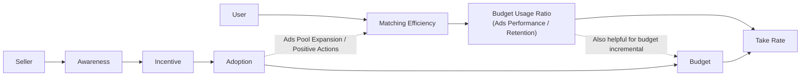
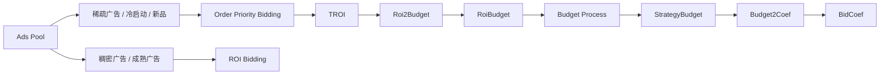
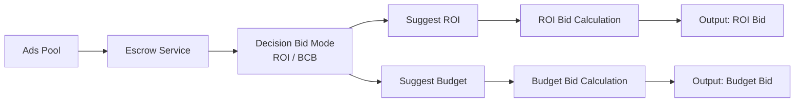
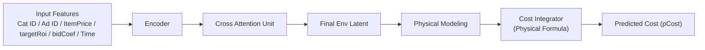

<!-- ads-workspace-gdoc-sync: gdoc_id=15A3BFXy3So-aY91frqCXm2lKYk6K_WwvBN8v-XQ_420 gdoc_url=https://docs.google.com/document/d/15A3BFXy3So-aY91frqCXm2lKYk6K_WwvBN8v-XQ_420/edit -->

# Managed Mode（Escrow）知识库

## KB 必要信息索引

| 类别 | 当前索引 |
| --- | --- |
| Git 路径 | `shopee/deep/paidads-bidding/online-bidding`、`shopee/deep/paidads-bidding/ultrav-core`、`shopee/deep/tag-service`、`shopee/deep/bid-sense` |
| 离线 agent 入口 | `ultrav-core/internal/agent/product_ads_agent/order_priority` |
| 在线 rule 入口 | `online-bidding/internal/rule/productads/rerank/prepare/cold_prepare_rule` |
| 核心 Hive 表 | `mp_paidads.dwd_trace_bidding_hyperx_hi__reg_s0_live`、`mkplpaidads_data.dwd_advertise_tracking_item_hi__reg_s0_live`、`mp_paidads.dwd_advertise_performance_di__reg_s0_live` |
| 关键标签类型 | 单品冷启动、单品空耗、单品新品、多品冷启动、多品空耗 |
| 当前阶段 | 一期已形成 `order_priority` 跑量优先框架；二期向明托管 / 暗托管演进 |

## 范围

本文汇总 `Managed Mode`（Escrow）的业务背景、技术框架和工程信息，重点回答 4 类问题：

1. `Managed Mode` 想解决什么业务问题。
2. 冷启动 / 新品 / 空耗场景如何定义。
3. 一期 `order_priority` 与二期托管策略分别做什么。
4. 排查这类策略时应先看哪些代码入口和数据表。

正文按以下顺序组织：

1. `Business`
2. `Technical`
3. `Engineering`

附录包含：

1. 术语表
2. 资料来源登记

本文不展开以下内容：

- 各 region 的线上配置值和 AB 实验结果
- `bid-sense`、`roi2budget`、`Budget2Coef` 的训练数据与特征细节
- 明托管与暗托管的前端交互方案

## Business

### 1. 业务背景与目标

`Managed Mode` 面向的是“广告主愿意投放，但在冷启动、新品或空耗阶段起量困难”的场景。

其核心目标是：

- 通过更积极但仍受约束的出价方式，改善广告主投放初体验。
- 引导非投广商家逐步使用广告产品，提高广告主留存。
- 通过改善供给侧起量，带动广告主后续预算增长和平台 take-rate 提升。

从原始材料的业务链路图来看，平台希望把“激励投放”转成“匹配效率、预算使用和留存”的长期改善：



材料里的问题定义可以归纳为两类：

- 客户侧问题
  - 商品价格缺乏竞争力
  - `TROI` 设置过高
  - 广告预算设置过低
- 系统侧问题
  - 召回策略更偏历史行为，对新品和再投长尾不友好
  - 出价可能过快耗尽预算，或过于保守导致“出价压死”
  - 冷启动阶段预估不准

### 2. 核心指标

材料给出的北极星指标主要围绕 `7d3o` 有效在投规模：

- 核心指标
  - `7d3o` 有效在投商品数
  - `7d3o` 有效在投 campaign 数
- 辅助指标
  - `7d3o item ratio`
  - `7d3o campaign ratio`

这里的直观含义是：策略希望让更多“此前没有稳定订单反馈的广告”尽快进入有效投放状态。

### 3. 场景定义

#### 3.1 单品场景

`单品冷启动`

- 广告创建 7 天内
- `direct order < 3`

`单品空耗`

- 广告创建超过 7 天
- 最近 14 天存在连续 7 天无订单
- 最近 7 天 `direct order < 3`

`单品新品`

- 商品创建 30 天内
- 30 天内无 `direct order`

#### 3.2 多品场景

`多品冷启动`

- campaign 内所有 ads 都满足：
  - 广告创建 7 天内
  - `direct order < 3`

`多品空耗`

- campaign 内所有 ads 都满足：
  - 广告创建超过 7 天
  - 最近 14 天存在连续 7 天无订单
  - 最近 7 天 `direct order < 3`

#### 3.3 Tag 定义代码路径

| 场景 | 代码路径 |
| --- | --- |
| 单品冷启动 | `pkg/processor/cold_start_direct_8d_lt3.go` |
| 单品空耗 | `pkg/processor/empty_order_direct_8d_lt3.go` |
| 单品新品 | `pkg/processor/new_item_ads_30d_lt1.go` |
| 多品冷启动 | `pkg/processor/gms_mp_cold_start.go` |
| 多品空耗 | `pkg/processor/gms_mp_empty_order.go` |

以上路径均位于 `shopee/deep/tag-service`。

## Technical

### 1. 技术总览

`Managed Mode` 可以理解成“托管策略判断 + 受约束出价执行”的两层系统。


这里有一个很重要的拆分：

- `托管服务` 负责决定“该广告适合用哪种约束”
- `出价服务` 负责在选定约束下做单目标优化

这比一期直接做“一个偏跑量的出价变种”更清晰，也更便于后续产品化。

### 2. 一期方案：跑量优先的 `order_priority`

一期优化的核心是：在 ROI、起量和预算平滑之间找一个更偏“先跑起来”的折中点。

材料中对几类策略的对比是：

- `roi` 出价
  - 成本控制最好
  - 但策略最保守，可能牺牲探索流量
- `bcb` 出价
  - 跑量能力最好
  - 对预估误差不敏感，不容易“出价压死”
  - 但基本不保证 ROI
- `order_priority` 出价
  - 是项目采用的核心变种
  - 保留了 `bcb` 的跑量优势
  - 同时尝试兼顾 ROI 目标

#### 2.1 一期核心公式

一期材料里给出的预算目标为：

```text
StrategyBudget = max(min(RoiBudget, DailyBudget), ExploreBudget)
```

其中：

- `RoiBudget`：满足广告主 ROI 目标的预算估计
- `DailyBudget`：广告主设定预算
- `ExploreBudget`：按广告潜力度分配的最小探索预算

一期的关键建模模块包括：

- `roi2budget`
  - 估计满足 ROI 目标的最优预算
- `Budget2Coef`
  - 在给定预算约束下寻找最大化 GMV 的出价系数

原始 PDF 中，这部分还给了一个比较完整的流程图，可以整理成下面这条链路：



一句话概括：一期不是简单加价，而是先估预算，再在预算约束下做偏跑量的出价。

### 3. 二期方案：明托管 / 暗托管

材料明确说二期正在向“明托管 / 暗托管”演进，并把整体框架拆成“托管策略 + 出价策略”。

#### 3.1 托管服务职责

托管服务负责 3 件事：

1. 判断商品更适合走 `roi-constraint` 还是 `budget-constraint`
2. 如果适合 `roi-constraint`，生成 `suggest roi`（`strategy roi`）
3. 如果适合 `budget-constraint`，生成 `suggest budget`（`strategy budget`）

#### 3.2 出价服务职责

出价服务不再自己决定业务模式，而是在既定约束下做单目标优化：

- 适合 `roi-constraint` 的 ads
  - 基于 `strategy roi` 做单目标优化
- 适合 `budget-constraint` 的 ads
  - 基于 `strategy budget` 做单目标优化

这意味着系统把“业务模式判断”和“最优 bid 搜索”解耦了。

原始材料里的系统图，可以归纳为下面这条更明确的服务分工：



#### 3.3 对明托管 / 暗托管的当前理解

基于现有材料，能明确确认的是“二期存在明托管 / 暗托管两条演进方向”，但 PDF 没有完整展开两者的产品交互差异。

按当前表述，可以做如下保守理解：

- `明托管`
  - 更偏把系统建议值显式暴露给广告主
  - 广告主可感知 `suggest roi` 或 `suggest budget`
- `暗托管`
  - 更偏系统内部自动选择约束并执行
  - 广告主感知到的是效果或建议值变化，而不是完整托管决策过程

这部分属于基于材料的工程化归纳，不应替代正式 PRD / 交互文档。

### 4. 技术演进路线

材料把广告出价优化路线分成两类：

#### 4.1 两阶段建模

核心范式是“环境拟合 + 决策搜索”：

1. 建立 `bid -> cost` 与 `bid -> gmv` 模型
2. 在 ROI、预算等约束下通过 `Grid Search` 或插值法找最优 bid

材料中的数学表达可以整理为：

```text
cost_i = f_c(bid, env_i)
gmv_i  = f_g(bid, env_i)
```

其中 `env_i` 表示时刻 `i` 的竞争环境、流量状态或其他上下文因素。

优点：

- 可解释性强
- 便于引入业务先验知识

缺点：

- 中间模型误差会在决策阶段被放大

#### 4.2 端到端建模

核心范式是“状态直接映射到出价动作”，常见实现为 RL 或直接策略搜索。

优点：

- 更接近全局最优
- 能处理更复杂的动态约束

缺点：

- 收敛难度大
- 黑盒属性强
- 对冷启动和 OOD 场景依赖更多样本覆盖

#### 4.3 当前团队阶段

材料明确表述当前团队仍处于“两阶段建模”路径，但在向更强的生成式建模演进：

- `mpc-v0`
  - 通过插值法建模 `f_c(bid)` 与 `f_g(bid)`
- `v1`
  - 参数化模型
- `v2`
  - `vae-based model`
- `v3`
  - `sequence vae-based model`，材料中标记为 `TBD`

##### 4.3.1 `mpc-v0`：插值版

材料对 `v0` 的表达，核心是把环境项拆成可单独估计的乘子：

```text
cost_i = f_c(bid, env_i) = f_c(bid) * pdf_i
gmv_i  = f_g(bid, env_i) = f_g(bid) * pdf_i
```

训练时使用历史序列去拟合 `f_c(bid)` 与 `f_g(bid)`，原文里的示意是：

```text
[cost_(t-i)/pdf_(t-i), ..., cost_(t-1)/pdf_(t-1)] -> f_c(bid)
[gmv_(t-i)/pdf_(t-i),  ..., gmv_(t-1)/pdf_(t-1)]  -> f_g(bid)
```

也就是说，`v0` 更像“先把环境影响除掉，再对 bid 本身做插值拟合”。

##### 4.3.2 `v1`：参数化模型

材料里的 `v1` 已经把 `cost` 和 `gmv` 写成参数化函数。按 PDF 中的公式，可整理为：

```text
pCost_i =
  w_c * itemPrice * TargetRoi *
  (1 - exp(-k_c * bidCoef ^ gamma_c)) *
  pdf_i

pGmv_i =
  w_g * itemPrice * TargetRoi *
  (1 - exp(-k_g * bidCoef ^ gamma_g)) *
  pdf_i
```

这说明 `v1` 已经不只是做经验插值，而是显式把：

- 商品价格 `itemPrice`
- 目标 ROI `TargetRoi`
- bid 系数 `bidCoef`
- 环境项 `pdf_i`

统一放进一个更强约束的函数形式里。

##### 4.3.3 `v2`：VAE + physical modeling

`v2` 在原始材料里已经有较完整的结构图，核心模块可以概括为：



它和 `v0 / v1` 的关键区别在于：

- 不再只把环境看成一个简单乘子，而是通过编码器学习环境隐变量
- 仍然保留 `Physical Formula`，避免彻底黑盒化
- 优化目标同时包含回归损失、`VAE KL Divergence`、重构损失和光滑性约束

当前阶段强调两点：

- 保留强可解释性
- 引入生成式时序编码能力，改善环境隐变量表达

未来方向包括：

- 引入更多特征
- 把竞争激烈程度等信息更显式编码进环境隐变量
- 适当放松人工先验公式约束

## Engineering

### 1. 代码与服务分工

| 仓库 / 模块 | 主要职责 |
| --- | --- |
| `shopee/deep/tag-service` | 识别冷启动、空耗、新品等标签 |
| `shopee/deep/paidads-bidding/ultrav-core` | 离线 / 近线 agent 计算，承接 `order_priority` 相关逻辑 |
| `shopee/deep/paidads-bidding/online-bidding` | 在线 rerank / prepare rule 执行与实时出价 |
| `shopee/deep/bid-sense` | 支撑 ROI / 预算相关建模能力 |

### 2. 关键代码入口

| 类型 | 路径 |
| --- | --- |
| 离线 agent 入口 | `ultrav-core/internal/agent/product_ads_agent/order_priority` |
| 在线 prepare rule 入口 | `online-bidding/internal/rule/productads/rerank/prepare/cold_prepare_rule` |
| Debug 指引 | `skills/team/03.content-algo/ads-boost-framework-debug/references/guide.md` |

从仓库内已有调试资料看，后端侧排查时通常还会补充两个过滤条件：

- `project_name = 'ultrav_core'`
- `strategy_name LIKE '%order_priority%'`

这说明当前知识卡片与已有 debug 资产是可以直接串起来使用的。

### 3. 关键数据表

| 表名 | 用途 |
| --- | --- |
| `mp_paidads.dwd_trace_bidding_hyperx_hi__reg_s0_live` | 观测后端策略运行、预算与出价相关 trace |
| `mkplpaidads_data.dwd_advertise_tracking_item_hi__reg_s0_live` | 观测在线 tracking、曝光 / 点击 / 扣费行为 |
| `mp_paidads.dwd_advertise_performance_di__reg_s0_live` | 做日级效果与成本复盘 |

### 4. 建议排查顺序

如果后续要诊断某个 `Managed Mode` 场景是否生效，可优先按下面顺序排查：

1. 先确认 `tag-service` 是否正确打上冷启动 / 空耗 / 新品标签。
2. 再确认后端侧 `order_priority` / Escrow 逻辑是否命中。
3. 再看 `strategy roi` 或 `strategy budget` 是否符合预期。
4. 最后在 tracking / performance 表中看出价、消耗和效果变化。

## 附录

### 1. 术语表

`7d3o`

- 材料中的有效在投口径，常用于衡量广告是否跑出初始有效订单反馈

`ExploreBudget`

- 最小探索预算，用于保障有潜力广告获得基础探索流量

`order_priority`

- 项目一期采用的偏跑量优先出价变种，兼顾一定 ROI 约束

`roi-constraint`

- 在 ROI 目标约束下寻找更优出价

`budget-constraint`

- 在预算目标约束下寻找更优出价

`strategy roi`

- 托管服务为某类广告生成的建议 ROI 目标

`strategy budget`

- 托管服务为某类广告生成的建议预算目标

### 2. 资料来源登记

#### 说明

可信级别：

- `L1`：代码、配置、调试指引、SQL / trace 契约
- `L2`：仓库内正式 markdown / 知识库
- `L3`：外部 PDF / Google Doc / 分享材料

状态：

- `used`：已进入正文
- `indexed`：已登记但未进入正文
- `todo`：待补充

#### 清单

| 来源标识 | 类型 | 主题 | 可信级别 | 状态 | 作用 |
| --- | --- | --- | --- | --- | --- |
| `/Users/bo.wangwb/Downloads/sub-kb Escrow.pdf` | PDF | Escrow / Managed Mode 业务与技术总览 | `L3` | `used` | 正文主来源 |
| `shopee/deep/tag-service` | 代码 | 冷启动 / 空耗 / 新品标签定义 | `L1` | `used` | 场景定义与代码入口 |
| `shopee/deep/paidads-bidding/ultrav-core` | 代码 | `order_priority` agent | `L1` | `used` | 离线入口与工程索引 |
| `shopee/deep/paidads-bidding/online-bidding` | 代码 | 在线 prepare / rerank | `L1` | `used` | 在线入口与工程索引 |
| `shopee/deep/bid-sense` | 代码 | ROI / 预算建模能力 | `L1` | `indexed` | 建模上下游索引 |
| `skills/team/03.content-algo/ads-boost-framework-debug/references/guide.md` | markdown | 预算 / 成本 / trace 调试方法 | `L2` | `used` | 工程排查补充 |
| `skills/team/03.content-algo/ads-boost-framework-debug/references/table_backend.md` | markdown | `order_priority` 调试字段与策略名 | `L2` | `used` | 查询过滤与字段参考 |
