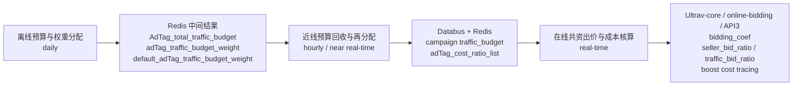

<!-- ads-workspace-gdoc-sync: gdoc_id=19D1i-ao7uyFRxOCQ104ZwHXdT8ycG6PY6_IzJk21RbE gdoc_url=https://docs.google.com/document/d/19D1i-ao7uyFRxOCQ104ZwHXdT8ycG6PY6_IzJk21RbE/edit -->

# 基于预算分配的扶持框架知识库

## KB 必要信息索引

| 类别                 | 当前索引                                                                                                  |
| ------------------ | ----------------------------------------------------------------------------------------------------- |
| 核心 repo            | `shopee/deep/paidads-bidding/boost-support-service`                                                   |
| 核心服务               | `boost-support-service`、`Ultrav-core`、`online-bidding`                                                |
| 关键 Redis 对象        | `AdTag_total_traffic_budget`、`adTag_traffic_budget_weight`、`traffic_budget`、`adTag_cost_ratio_list`   |
| 关键分发通道             | `Databus`（近线结果 → 在线依赖方）、`Redis`（在线低延迟读）                                                               |
| Epic TD 文档         | [扶持框架 Epic TD](https://docs.google.com/document/d/1WruItGFnLZFKNjs6BkqbXAJrf5uOpzrE9OIvW95i5ZI/edit)  |
| 扶持框架 Service 工程 TD | [工程 TD](https://docs.google.com/document/d/1dGOhnsKdDwepGMKSGLVlxj54vgZGQ8oIiZYop-tN0MQ/edit?tab=t.0) |

## 范围

本文汇总基于预算分配的扶持框架（Subsidy Boost Framework）的业务背景、技术架构和工程信息。

正文按以下顺序组织：

1. `Business`
2. `Technical`
3. `Engineering`

附录包含：

1. 术语表
2. 资料来源登记

本文不展开以下内容：

- 旧版扶持框架（pacing 系数方式）的完整实现细节
- voucher 与 traffic 预算链路的字段 bit 位差异细节
- 小时级版本一致性 flag 的发布细节

## Business

### 1. 业务背景与目标

#### 1.1 旧框架的问题

旧版扶持框架的核心做法，是在线上通过 `pacing` 计算扶持系数，并把系数直接合并到扶持对象的 `eCPM` 中参与竞价。这种方式已经跑通，但有两个明显问题：

1. 扶持目标和商家 bid 目标不总是一致，扶持逻辑与正常出价逻辑可能互相冲突。
2. 扶持成本难以统一度量，导致后续优化、效果归因和成本约束都不够稳定。

#### 1.2 新框架目标

把扶持从「额外叠加的系数逻辑」升级成「进入统一预算和统一出价体系的预算型扶持框架」。

核心思路有两点：

- 扶持预算先被显式分配，再被实时回收和重分配，而不是只在线上临时加系数。
- 在线出价阶段不再把扶持看成一个独立黑盒，而是把平台扶持预算与 seller 预算一起纳入统一的 `co-budget` / `co-bid` 计算与成本核算。

一句话总结：旧框架更像「在线加权」，新框架更像「预算驱动的统一出价与统一计费」。

### 2. 关键指标

`AdTag` 扶持预算消耗是核心度量指标。新框架解决了过去两个不稳定的问题：

- 某个 campaign 当前到底用了多少平台扶持预算
- 某个 `AdTag` 业务到底消耗了多少扶持成本

## Technical

### 1. 技术总览

#### 1.1 三层架构主流程



#### 1.2 分层职责

| 层级 | 核心职责 | 主要输入 | 主要输出 | 更新频率 |
| --- | --- | --- | --- | --- |
| 离线预算分配层 | 计算每个 `AdTag` 的扶持预算，并给 campaign 分配预算权重 | 过去 1d revenue、campaign/item 特征、AdTag 覆盖情况 | `AdTag_total_traffic_budget`、`adTag_traffic_budget_weight`、`default_adTag_traffic_budget_weight` | 天级 |
| 近线预算再分配层 | 根据广告进退场、预算消耗和实时成本，回收并再分配预算 | Redis 中离线结果、最新 `campaign x AdTag`、AdTag 成本、总预算 | campaign 维度 `traffic_budget`、`adTag_cost_ratio_list` | 小时级/准实时 |
| 在线出价与核算层 | 在实时出价时把 seller 预算和 traffic 预算统一纳入计算，并记录扶持成本 | `traffic_budget`、`boost_cost_ratio_map`、seller budget、实时请求 | `bidding_coef`、`seller_bid_ratio`、`traffic_bid_ratio`、扶持成本 trace | 实时 |

### 2. 离线预算与权重分配

#### 2.1 目标

离线预算与权重分配是天级任务，负责解决两个问题：

- 每个扶持业务 `AdTag` 应该拿到多少总扶持预算
- 每个 campaign 在命中的 `AdTag` 下，应该分到多大比例的预算权重

它不是直接给线上出价，而是先产出「预算池」和「权重」，供后续近线重分配和在线出价使用。

#### 2.2 主要流程

1. `boost-support-service` 的天级 job 在每天各 region 的 0 点触发，汇总过去 1d 的总收入 `revenue`，作为扶持预算计算基础。
2. 在扶持框架 Service 内按 `AdTag` 维度计算扶持预算，即 `AdTag_total_traffic_budget`。
3. 基于需要扶持的 campaign 及其 item 特征做潜力度估计，结合商品属性、历史特征、是否新品、所命中的 `AdTag`，以及时序模型（如 `budget2order`、`gmv`）做预算权重预测。
4. 为每个 `campaignId x AdTag` 预测预算权重 `adTag_traffic_budget_weight`。
5. 如果一个 campaign 同时命中多个 `AdTag`，则分别在各 `AdTag` 的预算池下拿到对应权重，最后汇总成 campaign 的总扶持预算。

#### 2.3 预算汇总方式

一个 campaign 的总扶持预算不是单点生成，而是由多个 `AdTag` 的预算贡献叠加而来。

示例：

- campaign 1001 命中「新品」和「冷启动」两个 `AdTag`
- 在「新品」下分到 5%，在「冷启动」下分到 8%

则其总 `traffic_budget` 为：

```text
traffic_budget
= 新品 AdTag 总扶持预算 x 5%
+ 冷启动 AdTag 总扶持预算 x 8%
```

这也是为什么框架必须保留 `AdTag` 粒度的信息，而不是只保留 campaign 总预算。

#### 2.4 核心产物

| 数据对象 | 粒度 | 含义 | 主要用途 |
| --- | --- | --- | --- |
| `AdTag_total_traffic_budget` | `AdTag` | 该扶持业务当天可支配的总预算 | 作为预算池输入给近线再分配层 |
| `adTag_traffic_budget_weight` | `campaign x AdTag` | 某 campaign 在某个 `AdTag` 下分到的预算权重 | 后续用于重新计算 campaign 预算 |
| `default_adTag_traffic_budget_weight` | `AdTag` | 新进场 campaign 在该 `AdTag` 下的默认权重 | 支持当天新入场广告快速接入 |

### 3. 近线预算回收与再分配

#### 3.1 目标

离线预算分配解决「初始怎么分」，近线预算再分配解决「分出去之后如何动态回收、重新平衡，并覆盖实时变化」。

近线层需要处理的场景：

- 广告实时进场和退场
- 某些预算花不出去
- 某些 `AdTag` 的花费速度与原始估计偏离
- 同一个 campaign 在不同 `AdTag` 下的预算和成本需要重新归集

#### 3.2 主流程

1. 扫描最新的 adsinfo，拿到当前 `campaign` 维度的 `AdTag` 覆盖情况。
2. 根据 `AdTag` 变化，执行进退场逻辑：
   - 新进入某 `AdTag` 的 campaign，从 Redis 中读取 `default_adTag_traffic_budget_weight`
   - 退出某 `AdTag` 的 campaign，把对应 `adTag_traffic_budget_weight` 置为 0
3. 在 `AdTag` 维度汇总当前全量 campaign 的总权重，形成重分配系数 `total_adTag_traffic_budget_weight`（通过 `AdTag x campaign id` 分片做汇总）。
4. 根据各 `AdTag` 的预算、成本和总权重，重新计算：
   - campaign 在该 `AdTag` 下的剩余预算 `delta_adTag_traffic_budget`
   - campaign 在该 `AdTag` 下的总预算 `AdTag_traffic_budget`
5. 把每个 campaign 在所有 `AdTag` 下的结果汇总成 campaign 维度总预算 `traffic_budget`。
6. 再根据各 `AdTag` 的剩余预算，反推出成本分摊比例 `AdTag_cost_ratio`。
7. 通过 Databus 把 `traffic_budget` 和 `adTag_cost_ratio_list` 写回 Redis，供在线服务使用。

#### 3.3 进退场策略

- 进场时，不等离线重算，直接走默认权重
- 退场时，把该 `AdTag` 下权重清空
- 退场条件可做策略迭代，例如超出 K 倍初始扶持预算或 ROI 不满足要求

近线预算再分配不只是预算计算层，也是一层策略治理层。

#### 3.4 核心产物

| 数据对象 | 粒度 | 含义 | 主要用途 |
| --- | --- | --- | --- |
| `traffic_budget` | `campaign` | campaign 当前在线可用的扶持预算 | 给 `Ultrav-core` 做在线出价 |
| `AdTag_traffic_budget` | `campaign x AdTag` | 某 campaign 在某个 `AdTag` 下的总预算 | 中间归因与预算汇总 |
| `delta_adTag_traffic_budget` | `campaign x AdTag` | 某 `AdTag` 下当前剩余预算 | 用于重分配与成本归因 |
| `adTag_cost_ratio_list` | `campaign` | 各 `AdTag` 在成本分摊中的比例列表 | 给在线出价与核算层做扶持成本拆分 |

### 4. 在线出价与扶持成本核算

#### 4.1 目标

在线层负责把近线给出的预算结果真正转成在线出价能力，并对每一次请求的扶持成本做核算和收集。

这是新框架和旧框架最本质的区别所在：扶持不再只是「加一个 eCPM 系数」，而是进入预算、出价、扣费和 trace 的完整闭环。

#### 4.2 两个核心机制

##### `co-budget`

预算共资，重点在「先怎么扣预算」。

规则：

- `paid + free` 优先扣减
- 之后再扣 `traffic`

回答的是：一个 campaign 在「商家预算」和「平台扶持预算」同时存在时，预算消耗顺序如何处理。

##### `co-bid`

出价共资，重点在「出价责任怎么拆」。

公式：

```text
X = seller_budget / (seller_budget + traffic_budget)
seller_bid_ratio = X
traffic_bid_ratio = 1 - X
```

- seller 预算充足时，`seller_bid_ratio = 100%`，`traffic_bid_ratio = 0`
- seller 预算不足甚至为 0 时，平台扶持承担更多比例

两个比例会被写入 `deduction_info`，并传给后续扣费链路。

#### 4.3 在线模块职责

| 模块 | 主要职责 |
| --- | --- |
| `Ultrav-core` | 读取 campaign 当前 `traffic_budget`，结合 seller budget 计算 `bidding_coef`；生成 `boost_cost_ratio_map`；计算 `seller_bid_ratio` / `traffic_bid_ratio`；写入 bidding store |
| `online-bidding` API2 | 将 `seller_bid_ratio` / `traffic_bid_ratio` 带入 `deduction_info`；按 `boost_cost_ratio_map` 计算每个 `AdTag` 的一价扶持成本；通过 `additionalDeductionPrice` 表达扶持侧承担的折扣成本 |
| `deductionPrice` API3 | 不单独实现扶持成本拆分；最终商家计费通过原始商家出价减去 `additionalDeductionPrice` 的方式完成 |

#### 4.4 成本核算链路

1. `Ultrav-core` 根据 `adTag_cost_ratio_list` 生成成本分摊 map
2. `online-bidding` 用这份 map 对本次出价扶持成本做 `AdTag` 级拆分
3. `online-bidding` 生成 `additionalDeductionPrice`，作为平台扶持承担的成本或折扣金额
4. 最终 API3 侧基于商家出价扣减 `additionalDeductionPrice` 后计费

#### 4.5 关键在线数据对象

| 数据对象 | 产生位置 | 含义 |
| --- | --- | --- |
| `traffic_budget` | 近线预算再分配 → `Ultrav-core` | 当前 campaign 在线可支配的扶持预算 |
| `bidding_coef` | `Ultrav-core` | 基于 seller budget + traffic budget 计算出的竞价系数 |
| `boost_cost_ratio_map` | `Ultrav-core` | 原 `adTag_cost_ratio_map` 的扩展版，包含出价扶持和发券扶持的成本分摊比例 |
| `seller_bid_ratio` | `Ultrav-core` / API2 | 本次出价中商家承担比例 |
| `traffic_bid_ratio` | `Ultrav-core` / API2 | 本次出价中平台扶持承担比例 |
| `boostDeltaECPM` | `online-bidding` | 每个 `AdTag` 在一价层面的扶持成本记录 |
| `additionalDeductionPrice` | `online-bidding` | 扶持侧承担成本，API3 最终基于该值对商家出价做计费打折 |

## Engineering

### 1. 服务总表

| 服务 | 角色 | 说明 |
| --- | --- | --- |
| `boost-support-service` | 扶持框架核心服务 | 承载预算收集、AdTag 维度预算计算、近线预算回收与再分配逻辑 |
| `TagService` | 广告打标服务 | 维护广告是否命中扶持条件，以及 `AdTag` 的增删变化 |
| `Ultrav-core` | 在线出价核心 | 把预算转成可用于在线竞价的 `bidding_coef` 和 cost ratio |
| `online-bidding` | 在线出价执行 | 把比例写入 `deduction_info`，记录一价扶持成本 |
| `Redis` | 主缓存 | 离线与近线中间结果存储，提供在线低延迟读 |
| `Databus` | 近线结果分发 | 近线结果分发到在线依赖方 |

### 2. 系统接口关系

| 模块 | 读什么 | 写什么 | 给谁用 |
| --- | --- | --- | --- |
| `TagService` | 当前广告状态、扶持规则 | 广告打标/删标、Kafka 消息 | 近线预算再分配服务 |
| 离线预算分配任务 | 过去 1d revenue、campaign/item 特征、`AdTag` 覆盖 | `AdTag_total_traffic_budget`、`adTag_traffic_budget_weight`、`default_adTag_traffic_budget_weight` | Redis、近线预算再分配服务 |
| `boost-support-service` | Redis 离线结果、最新 adsinfo、AdTag 成本 | `traffic_budget`、`adTag_cost_ratio_list`、`total_adTag_traffic_budget_weight` | Databus、Redis、在线出价链路 |
| `Ultrav-core` | `traffic_budget`、seller budget、`boost_cost_ratio_map` | `bidding_coef`、`seller_bid_ratio`、`traffic_bid_ratio`、bidding store 数据 | `online-bidding` |
| `online-bidding` API2 | `deduction_info`、`boost_cost_ratio_map` | `additionalDeductionPrice`、`boostDeltaECPM`、`PlatformSpend` 等 trace 信息 | API3、监控、数据汇总 |
| `deductionPrice` API3 | `deduction_info`、`additionalDeductionPrice` | 扣减扶持折扣后的商家计费结果 | 账务与成本链路 |

## 附录

### 1. 术语表

`AdTag`

- 扶持业务标签，如新品、冷启动、空耗等，是预算池和成本归因的主维度

`AdTag_total_traffic_budget`

- 某个 `AdTag` 当天总扶持预算

`adTag_traffic_budget_weight`

- 某个 `campaign x AdTag` 的预算分配权重

`default_adTag_traffic_budget_weight`

- 新进场 campaign 在该 `AdTag` 下默认使用的预算权重

`traffic_budget`

- campaign 当前可用于扶持出价的总平台预算

`delta_adTag_traffic_budget`

- 某 campaign 在某 `AdTag` 下当前剩余可用预算

`adTag_cost_ratio_list`

- campaign 维度保存的各 `AdTag` 成本分摊比例列表

`boost_cost_ratio_map`

- 在线使用的成本分摊 map，承接原 `adTag_cost_ratio_map` 并扩展到出价扶持/发券扶持

`seller_bid_ratio`

- 本次出价中由 seller 承担的比例

`traffic_bid_ratio`

- 本次出价中由平台扶持预算承担的比例

`co-budget`

- 预算共资机制，定义预算扣减顺序（`paid + free` 优先，再扣 `traffic`）

`co-bid`

- 出价共资机制，定义 seller 与 traffic 在出价中的承担比例

`boostDeltaECPM`

- 一价层面记录的扶持成本，用于 `AdTag` 粒度归因

`additionalDeductionPrice`

- `online-bidding` 计算出的扶持侧承担成本，API3 最终基于该值对商家出价做计费打折

### 2. 资料来源登记

#### 说明

可信级别：

- `L1`：代码、接口定义、配置、运行入口
- `L2`：仓库内 README / 正式 markdown
- `L3`：Google Doc
- `L4`：背景理论或历史材料

状态：

- `used`：已进入正文
- `indexed`：已登记但未进入正文
- `todo`：待阅读或待补充

#### 清单

| 来源标识 | 类型 | 主题 | 可信级别 | 状态 | 作用 |
| --- | --- | --- | --- | --- | --- |
| [扶持框架 Epic TD](https://docs.google.com/document/d/1WruItGFnLZFKNjs6BkqbXAJrf5uOpzrE9OIvW95i5ZI/edit) | Google Doc | 扶持框架总览（离线预算、近线重分配、在线成本核算） | `L3` | `used` | 三层架构、主流程、数据对象来源 |
| [离线预算与权重分配](https://docs.google.com/document/d/1WruItGFnLZFKNjs6BkqbXAJrf5uOpzrE9OIvW95i5ZI/edit?tab=t.afthykyrhmwm) | Google Doc | 离线预算分配细节 | `L3` | `used` | 离线层详细流程来源 |
| [近线预算回收与再分配](https://docs.google.com/document/d/1WruItGFnLZFKNjs6BkqbXAJrf5uOpzrE9OIvW95i5ZI/edit?tab=t.99ti2tq54uxq) | Google Doc | 近线预算再分配细节 | `L3` | `used` | 近线层详细流程来源 |
| [在线可用预算与成本计算](https://docs.google.com/document/d/1WruItGFnLZFKNjs6BkqbXAJrf5uOpzrE9OIvW95i5ZI/edit?tab=t.j8edscdf1p5b) | Google Doc | 在线出价与成本核算细节 | `L3` | `used` | 在线层详细流程来源 |
| [扶持框架 Service 工程 TD](https://docs.google.com/document/d/1dGOhnsKdDwepGMKSGLVlxj54vgZGQ8oIiZYop-tN0MQ/edit?tab=t.0) | Google Doc | 工程实现 TD | `L3` | `indexed` | 工程边界补充 |
| [扶持框架 Service 工程提需 TRD](https://docs.google.com/document/d/1WruItGFnLZFKNjs6BkqbXAJrf5uOpzrE9OIvW95i5ZI/edit?tab=t.rzkzclljcjid) | Google Doc | 工程提需细节 | `L3` | `indexed` | 工程背景补充 |
| `shopee/deep/paidads-bidding/boost-support-service` repo | 代码 | 扶持框架 Service 实现 | `L1` | `indexed` | 工程索引 |
