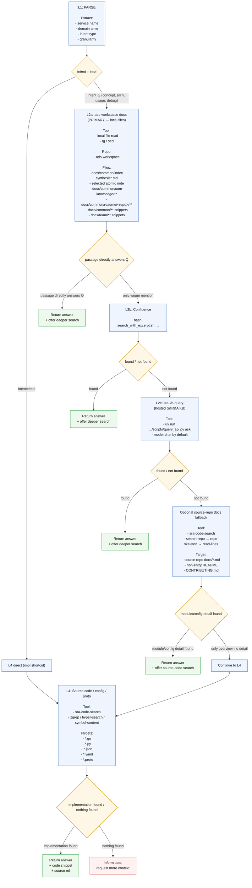

# Ads Knowledge Q&A — Workflow Reference

## Downstream Skill Delegation

| 用户需求 | 委托 Skill | 触发条件 |
|----------|-----------|---------|
| OKR/KR/KP 进展、状态、项目报告 | `ads-okr-epic-report` | "O3 KP2 进展"、KR 报告、KP 报告、epic report、项目进展 |
| 查看服务实时监控/延迟/QPS | `sp-grafana` | 延迟、监控、P99、dashboard |
| 广告数仓查数/SQL | `sra-data-query` | 曝光量、GMV、CTR数据、写SQL、查数 |
| 发布/上线管理 | `sra-release` | 发布、上线、rollback |
| RESP 回归测试 | `ads-resp-lab` | 回归测试、单发测试、压测 |
| AB 实验配置 | `sp-ab` | 实验、分流、holdout |

OKR/KR/KP progress questions are not knowledge-retrieval questions. Route them
before L2:

- Exact KP target, such as `o3-kr6-kp2` or an `epic-file.md` path:
  use `/ads-okr-epic-report --query <target>` so the result is returned in chat
  without writing `epic-report.md` or JSON.
  `--query` belongs to the `ads-okr-epic-report` slash command. It is not a
  flag for `scripts/check_freshness.py`; do not call that Python script to
  emulate query-mode output.
- KR/O target, such as `o3-kr6` or `o3`: use `ads-okr-epic-report` normal
  report-generation mode.
- Ambiguous target, such as "O3 KP2": search current-quarter `docs/team/.../o3/`
  for matching `kr*-kp2-*` directories, list the candidate titles, and ask the user
  to choose. Do not guess a KR, and do not invoke `/ads-okr-epic-report --query`
  with raw ambiguous text like `/ads-okr-epic-report --query O3 KP2`.
- Do not use `ads-okr-epic-status-check-pa` for general progress reports. It is a
  PA-team-specific checker, while `ads-okr-epic-report` is the common progress
  report source.

在回答末尾主动提供选项（按需）：
- 是否需要深入代码层查看具体实现？
- 是否需要查询实际数据（`/sra-data-query`）？
- 是否需要诊断广告效果异常（`/ads-diagnose`）？

---

## Decision Tree



---

## Layer-by-Layer Strategy

### L2a: ads-workspace docs

**Note:** The primary knowledge docs are **local files inside `ads-workspace`**.
Start from `docs/common/index-synthesis*.md` to choose the exact atomic note,
then read that file under `docs/common/core-knowledge/`, `docs/common/readme/<repo>/`,
or another indexed curated directory. If a concrete repo/service is identified,
check the indexed `docs/common/readme/<repo>/README*.md` before Confluence or source-code search.
If the primary docs are too broad or only give a pointer, search other ads-workspace
Markdown docs before Confluence.

**Local source boundaries:**
- Required retrieval entrypoint: `docs/common/index-synthesis.zh-CN.md` for Chinese questions and `docs/common/index-synthesis.md` for English questions. The index is the atomic-note directory; use it to locate the target file before reading content.
- Allowed primary source: `docs/common/core-knowledge/` (split by domain into `01.ads-overview/`, `02.ads-strategy/`, `03.ads-engine/`, `04.ads-platform/`, `05.ads-data/`; each file has `.md` (English) and `.zh-CN.md` (Chinese) versions).
- Allowed repo README source: `docs/common/readme/<repo>/README.md` and `docs/common/readme/<repo>/README.zh-CN.md`.
- Allowed supporting source: curated Markdown under `docs/common/**` and `docs/team/**` only.
- Preferred supporting search order: `docs/common/index-synthesis*.md` → selected atomic note → targeted `rg` in `docs/common/core-knowledge/**` / `docs/common/readme/**` only if the index has no clear match → other `docs/common/**` → `docs/team/**`.
- Excluded operational sources: `docs/common/ops-log/knowledge-qa-ops/feedback/`, `docs/common/ops-log/knowledge-qa-ops/evals/`, and `docs/common/ops-log/gdoc-sync-reports/` must not be used or cited for Ads business, code, data, or product conclusions. These files are operational inputs, not source-of-truth knowledge.

**Index-first lookup:**

```bash
rg -n "<keyword1>|<keyword2>" docs/common/index-synthesis.zh-CN.md docs/common/index-synthesis.md
sed -n '<start>,<end>p' docs/common/index-synthesis.zh-CN.md
sed -n '<start>,<end>p' docs/common/core-knowledge/<matched-atomic-note>.md
```

Use `.zh-CN.md` atomic notes for Chinese questions when the index points to one.
Use broad `rg` over `docs/common/core-knowledge` or `docs/common/readme` only when
the index has no likely candidate.

The primary knowledge is split into focused files. The table below is a quick
fallback map; prefer the index when it is available.

| Question topic | File | Search hint |
|---------------|------|-------------|
| Core metrics: eCPM / CTR / CVR / ROAS / RPM | `01.ads-overview/04.strategy-mechanisms.md` | search "eCPM" |
| Attribution logic (click-through / view-through, Direct / Broad) | `01.ads-overview/04.strategy-mechanisms.md` | search "归因" |
| Ad format types (search / feed / display) | `01.ads-overview/03.system-pipeline-modules.md` | search "投放机制" |
| Bidding modes: CPC / oCPX / NoBid / 双出价 / λ系数 | `02.ads-strategy/03.bidding-products-and-algorithms.md` | search "双出价" or "oCPX" |
| Auction deduction: GSP / GFP formula | `02.ads-strategy/04.traffic-strategy-and-billing.md` | search "GSP" |
| End-to-end pipeline overview, architecture diagrams | `01.ads-overview/03.system-pipeline-modules.md` | search "链路架构" |
| Ads Engine API0–API4 / GraphEngine | `03.ads-engine/02.ads-engine.md` | search "GraphEngine" or "API0" |
| Recall architecture (OhMyEmb, KNN, KV Recall) | `03.ads-engine/03.ads-recall-service.md` | search "OhMyEmb" or "Vector KNN" |
| Bidding service (UltraV core, Bidding Store, Online Bidding) | `03.ads-engine/04.ads-bidding-service.md` | search "UltraV" |
| Index / AdsInfo architecture | `03.ads-engine/05.ads-index.md` | search "Indexer" or "AdsInfo" |
| Core repo registry for L4 routing | `03.ads-engine/01.system-architecture-overview.md` | search "Core Repository List" or the repo name |

All file paths above are relative to `docs/common/core-knowledge/`.

**Repo README lookup:**

```bash
rg -n "<repo>|<keyword1>|<keyword2>" docs/common/index-synthesis.zh-CN.md docs/common/index-synthesis.md
sed -n '<start>,<end>p' docs/common/readme/<repo>/README.md
```

Use `docs/common/readme/<repo>/README.zh-CN.md` for Chinese questions when available.
These files are centralized from Fengjiao's README sync and belong to L2a.

**Supporting ads-workspace docs search:**

```bash
rg -n "<keyword1>|<keyword2>" docs/common docs/team -g '*.md'
sed -n '<start>,<end>p' docs/<matched-file>.md
```

Only read the smallest relevant snippet around the matching section. Prefer indexed or
synthesized docs such as `docs/common/index-synthesis*.md` to locate a source page before
opening a large Markdown file.

**Sufficiency threshold for L2a:**
- Concept/arch question → sufficient if retrieved passage contains definition + formula or diagram description
- Usage question → sufficient if passage contains parameter semantics or a configuration example
- **Insufficient** if only a title or one-liner mention, with no supporting detail

### L2b: Confluence

| Scenario | CQL pattern |
|----------|-------------|
| Known service name | `bash scripts/search_confluence_recent.sh "space=SPAD AND type=page AND title~'ads-engine'" 5` |
| Known domain term | `bash scripts/search_confluence_recent.sh "space=SPAD AND type=page AND (title~'ecpm' OR title~'出价')" 5` |
| Broad topic | `bash scripts/search_confluence_recent.sh "space=SPAD AND type=page AND text~'出价策略'" 5` (higher noise) |

For Paid Ads Confluence queries, use `space=SPAD`. Try `title~` before `text~`.
Prefer `bash scripts/search_confluence_recent.sh ...` so `lastModified >= "<12 months ago>"` is injected automatically based on today.

### L2c: sra-kb-query

Use `sra-kb-query` as the hosted S&R&A KB fallback after the local Ads doc and
fresh Confluence search are insufficient. Default to `chat` mode so the hosted
service can route across KB content and return sourced answers. Use `search`
mode only when the user explicitly asks for KB hits or when you need a
search-seeded summary.

`sra-kb-query` is an optional dependency: if `bash scripts/preflight.sh`
reports it as not found (warning, not an error), skip L2c entirely and continue
to the optional source-repo docs fallback or L4 — do not glob the filesystem
looking for it.

Resolve the installed skill path via `bash scripts/preflight.sh` or the
`ADS_KNOWLEDGE_QA_SRA_KB_QUERY_DIR` override, then run:

```bash
uv run <sra-kb-query-dir>/scripts/query_api.py ask --role engineering "<question>"
```

**Sufficiency threshold:** sufficient if the hosted answer contains a direct
answer plus citations/source paths. If the answer is broad, lacks citations, or
only points to likely repos, continue to optional source-repo docs fallback or L4.

### Optional Source-Repo Docs Fallback

Before searching, consult [repos.md](repos.md). The repo standard comes from
`docs/common/core-knowledge/03.ads-engine/01.system-architecture-overview.md`, not the old Google Doc. Treat `repos.md`
as routing guidance: it gives the GitLab path/search query and expected index state,
but the `repo` parameter for code-search must still be the exact `name` returned by
`search-repo`.

Use this only when local `docs/common/readme/<repo>/` and other ads-workspace docs are insufficient.
Do not treat a source-repo root `README.md` as sufficient if it only links back to ads-workspace.

| Goal | Command |
|------|---------|
| Resolve code-search repo | `search-repo {"query": "<GitLab path from core repo list>", "limit": 10}` |
| See directory layout | `repo-skeleton {"repo": "<name returned by search-repo>"}` |
| Read non-entry README (first 200 lines) | `read-lines {"path": "<subdir>/README.md", "start_line": 0, "line_count": 200}` |
| List docs/ folder | `list-directory {"path": "docs"}` |
| Read specific doc page | `read-lines {"path": "docs/<file>.md", "start_line": 0, "line_count": 300}` |

**Code-search repo resolution rules:**
- Use the full GitLab path from the core repo list as the default `search-repo.query`, e.g. `shopee/deep/paidads-bidding/online-bidding`.
- Prefer an exact returned repo name matching `gitlab/<GitLab path>`. If the exact path is not returned, do not invent it.
- If [repos.md](repos.md) marks a row as `not indexed exact`, stay in ads-workspace docs/Confluence/KP sources unless the user explicitly asks to inspect a related indexed repo.
- Some fuzzy searches return plausible but wrong repos first. Select the exact match from the returned list, not the first item blindly.

**Sufficiency threshold:** README contains module-level functionality description,
configuration field table, or interface contract.

### L4: Source code

| Question type | Preferred command | Key parameters |
|---------------|------------------|----------------|
| Known function name | `zgrep` with `symbol: true` | `"query": "CalcEcpm"` |
| Known struct / message | `zgrep` with `symbol: true` | `"query": "BiddingRequest"` |
| Unknown symbol, known behaviour | `hyper-search` | `intention`: describe what you want to understand |
| Config schema | `zgrep` with `file: "\\.json$"` | field name as query |
| Proto interface | `zgrep` with `file: "\\.proto$"` | message or RPC name |
| Read full function body | `symbol-content` | `"symbol": "<short name>"` |
| Read specific lines | `read-lines` | after locating line from zgrep output |

**目录黑名单（搜索时排除）：**
- `studio_tasks/` — 个人手写 adhoc SQL，非权威来源，不得作为主要证据引用
  - 若结果**混合**了 `studio_tasks/` 和其他来源，优先采用非 `studio_tasks/` 的证据

---

## Response Templates

> All templates below show Chinese headings. For English questions substitute:
> `**核心结论**` → `**Conclusion**` / `**分析**` → `**Analysis**`

### L2 early exit

```
**核心结论**
[One-sentence direct answer]

**分析**
[Definition / formula / architecture, as applicable]

**Source**
- 文档来源: <实际检索到的文档，如 docs/common/core-knowledge/01.ads-overview/04.strategy-mechanisms.md、Confluence 页面标题、sra-kb-query 引用> — <可访问链接>
```

Source formatting rules for ads-workspace docs:
- If the source is an ads-workspace file, write the full repo-relative path starting with `docs/`, or write the full absolute GitLab blob URL.
- Never shorten the second or later source into sibling-relative fragments such as `02.ads-strategy/foo.md`, `../foo.md`, or `同目录另一个文件.md`.
- If multiple ads-workspace files are cited in one sentence or list item, repeat the full `docs/...` path or full URL for each file.

### Optional Source-Repo Docs Early Exit

```
**核心结论**
[One-sentence direct answer]

**分析**
[Module responsibilities / config fields / interface contracts]

**Source**
- 文档来源: <repo>/<path> — <GitLab link>#L<line>
```

### L4 answer

````
**核心结论**
[One-sentence direct answer]

**分析**
[Implementation logic / data flow / key decisions]

```go
// <repo>/<file>  (lines <start>–<end>)
<relevant code snippet>
```

**Source**
- 代码实现: `<repo>/<file>` (lines <start>–<end>) — <GitLab link>#L<start>-L<end>
- 文档来源: <实际引用的文档> — <可访问链接>  *(omit if none)*
````

---

## Worked Examples

### Example 1 — Concept question (exits at L2a)

**Question:** eCPM 是什么，是怎么计算出来的？

**L1:** domain term = `eCPM`, intent = `concept` → start at L2

**L2a action:**
```bash
rg -n "eCPM|广告系统策略机制" docs/common/index-synthesis.zh-CN.md docs/common/index-synthesis.md
sed -n '<start>,<end>p' docs/common/core-knowledge/01.ads-overview/04.strategy-mechanisms.zh-CN.md
```
**L2a result:** the index points to `docs/common/core-knowledge/01.ads-overview/04.strategy-mechanisms.zh-CN.md`, which contains definition table and formula — **sufficient**.

**Return:** Definition + formula + early-exit prompt.

---

### Example 2 — Implementation question (goes directly to L4)

**Question:** `CalcEcpm` 函数里 roi3 模式下 bid price 是怎么算的？

**L1:** service = `ads-engine`, symbols = `CalcEcpm` / `roi3`, intent = `impl` → **skip to L4**

**L4 actions:**
```bash
# 1. Find repo slug
bash scripts/run_code_search.sh search-repo '{"query": "shopee/deep/ads-engine", "limit": 10}'

# 2. Locate function
bash scripts/run_code_search.sh zgrep '{
  "repo": "<repo name returned by search-repo>",
  "query": "CalcEcpm", "symbol": true, "limit": 5
}'

# 3. Read full body
bash scripts/run_code_search.sh symbol-content '{
  "repo": "<repo name returned by search-repo>",
  "symbol": "CalcEcpm"
}'
```

Use the `repo` value from step 1.

**Return:** Annotated code snippet showing the roi3 branch logic, with file path and line range.

---

### Example 3 — Usage/config question (L2a centralized README early exit)

**Question:** ads-engine 的 rule_config.json 里 `enable_roi3` 字段是什么意思，有哪些可选值？

**L1:** service = `ads-engine`, term = `rule_config` / `enable_roi3`, intent = `usage`

**L2a action:**
```bash
rg -n "ads-engine|rule_config|enable_roi3" docs/common/index-synthesis.zh-CN.md docs/common/index-synthesis.md
sed -n '<start>,<end>p' docs/common/readme/ads-engine/README.zh-CN.md
```

**L2a result:** the index points to `docs/common/readme/ads-engine/README.zh-CN.md`; if that atomic note contains the config field table including `enable_roi3`, it is **sufficient**.

If centralized README is missing or insufficient, use the optional source-repo docs fallback:
```bash
bash scripts/run_code_search.sh search-repo '{"query": "shopee/deep/ads-engine", "limit": 10}'
bash scripts/run_code_search.sh read-lines '{
  "repo": "<repo name returned by search-repo>",
  "path": "docs/<specific-doc>.md", "start_line": 0, "line_count": 300
}'
```

**Return:** Field semantics from centralized README + early-exit prompt.

---

### Example 4 — Architecture question (exits at L2a)

**Question:** ads-engine 和 online-bidding 是怎么配合工作的？

**L1:** services = `ads-engine`, `online-bidding`, intent = `arch` → start at L2

**L2a action:**
```bash
rg -n "ads-engine|online-bidding|UltraV|Bidding Store|GraphEngine" docs/common/index-synthesis.zh-CN.md docs/common/index-synthesis.md
sed -n '<start>,<end>p' docs/common/core-knowledge/03.ads-engine/02.ads-engine.zh-CN.md
sed -n '<start>,<end>p' docs/common/core-knowledge/03.ads-engine/04.ads-bidding-service.zh-CN.md
```
**L2a result:** the index points to `03.ads-engine/02.ads-engine.zh-CN.md` (Ads Engine API2 Bid Info) + `03.ads-engine/04.ads-bidding-service.zh-CN.md` (Bidding service), which describe the interaction — **sufficient**.

**Return:** Architecture explanation with data-flow description + early-exit prompt.

---

## Not-Found Guidance

Tailor follow-up questions based on intent:

| Intent | Ask the user for |
|--------|-----------------|
| `concept` / `arch` | The exact service or module name in English |
| `usage` | Config file name or specific field name |
| `debug` | Error message, log snippet, and triggering scenario |
| `impl` | Function name, struct name, or proto message name |
